# h

## 系统相关

nobody就是一个普通账户，因为默认登录shell是/sbin/nologin，所以这个用户是无法直接登录系统的，也就是黑客很难通过漏洞连接到你的服务器来做破坏。此外这个用户的权限也给配置的很低。因此有比较高的安全性。 一切都只给最低权限。这就是nobody存在的意义
wo我再补充一下，用NOBODY运行是有安全考虑的。 如果用ROOT权限启动APACHE的时候，会有安全问题 如果APACHE里有BUG，那么黑客就能直接取得ROOT权限。 如果是普通用户，哪她就只能取得普通用户的权限。 很多服务都是ROOT启动的，很多服务器的MYSQL就是ROOT启的这样很不安全


nobody是系统用户，一个特殊用途的用户 ID 。一般来说 uid < 500 的都是系统 ID 。
Linux 系统为了安全，很多操作和服务的运行都不是运行在 root 用户下面的，而是一个专用的 ID ，这个 ID 一般就是 nobody ，这样就可以把每个服务运行的情况隔离出来。保证不会因为服务器程序的问题而让服务器程序成了黑客的直接操作源（黑客拿下了服务器程序，也仅仅是 nobody 用户而不是 root 用户，还要进行提权才行）。同时也不会影响其他用户的数据。

除了 nobody ，常见的还有 ftp 、ssh 什么的。有的不是用来跑服务，而是用来占坑，主要是用用户组的权限管理进行权限设置，这个时候会有一个占坑用的同名 ID 加入到用户组。这种情况好像主要是为了兼容。

****


我们从`/etc/passwd`这个文件中获取数据，

The passwd structure is defined in <pwd.h> as follows:

```c
 struct passwd {
           char   *pw_name;       /* username */        //用户名
           char   *pw_passwd;     /* user password */   //由系统加密后的用户密码
           uid_t   pw_uid;        /* user ID */         //用户id
           gid_t   pw_gid;        /* group ID */        //组id
     	   //前3个字段比较重要
           char   *pw_gecos;      /* user information *///用户信息
           char   *pw_dir;        /* home directory */  //用户家目录
           char   *pw_shell;      /* shell program */   //用户的shell
       };
```

```c
#include <sys/types.h>
#include <pwd.h>

struct passwd *getpwnam(const char *name);  //根据用户名从/etc/passwd文件中获取信息
struct passwd *getpwuid(uid_t uid);  //根据用户id从/etc/passwd文件中获取信息

int getpwnam_r(const char *name, struct passwd *pwd,
                   char *buf, size_t buflen, struct passwd **result);
int getpwuid_r(uid_t uid, struct passwd *pwd,
                   char *buf, size_t buflen, struct passwd **result);
```

示例：

```c
#include <stdio.h>
#include <pwd.h>
#include <sys/types.h>
int main() 
{
    struct passwd *pw;
    char *username = "atguigu";
    pw = getpwnam(username);
    if (!pw) {
        printf("%s is not exist\n", username);
        return -1;
    }
    printf("pw->pw_name = %s\n", pw->pw_name);
    printf("pw->pw_passwd = %s\n", pw->pw_passwd);
    printf("pw->pw_uid = %d\n", pw->pw_uid);
    printf("pw->pw_gid = %d\n", pw->pw_gid);
    printf("pw->pw_gecos = %s\n", pw->pw_gecos);
    printf("pw->pw_dir = %s\n", pw->pw_dir);
    printf("pw->pw_shell = %s\n", pw->pw_shell);
}
```

运行结果：

```c
[root@hadoop100 test]# ./a.out 
pw->pw_name = nobody
pw->pw_passwd = x
pw->pw_uid = 99
pw->pw_gid = 99
pw->pw_gecos = Nobody
pw->pw_dir = /
pw->pw_shell = /sbin/nologin
用户名：密码：用户id：组id：用户描述：用户家目录：用户的登录shell
[root@hadoop100 test]# ./a.out 
pw->pw_name = atguigu
pw->pw_passwd = x
pw->pw_uid = 1000
pw->pw_gid = 1000
pw->pw_gecos = atguigu
pw->pw_dir = /home/atguigu
pw->pw_shell = /bin/bash

[root@hadoop100 test]# ./a.out 
pw->pw_name = root
pw->pw_passwd = x
pw->pw_uid = 0
pw->pw_gid = 0
pw->pw_gecos = root
pw->pw_dir = /root
pw->pw_shell = /bin/bash
```


## 错误打印

```c
#include <stdio.h>
void perror(const char *s); //字符串s是你传递的你想显示什么错误
#include <errno.h>          //它会自动翻译错误号，为字符串形式的错误(和你传递的字符串拼在一起输出)。

#include <string.h>
char *strerror(int errnum); //发生错误时，传递errno作为参数就行。

eg.
if (ret == -1)  //此时发生错误了
{
	printf("err=%s\n", strerror(errno));  //传递错误号，翻译出字符串形式的错误
	break;
}
```

## 三种时间结构

三种不同精度的睡眠：

```c
unsigned int sleep(unsigned int seconds); //s
int usleep(useconds_t usec); //us
int nanosleep(const struct timespec *req, struct timespec *rem); //ns
                                          //传出剩余的睡眠时间
```

man 3 sleep：

```c
RETURN VALUE
       Zero if the requested time has elapsed, or the number of seconds left to sleep, if the call
       was interrupted by a signal handler.
           
so,entirely sleep 5 seconds,you need do this.
int n=5;
while(n=sleep(n));

The  type  useconds_t  is an unsigned integer type capable of holding integers in the range [0,1000000].
```

### time

定义：

time_t time(time_t *t);

表头文件：

\#include<time.h>

说明：

**此函数会返回从公元1970年1月1日的UTC时间从0时0分0秒算起到现在所经过的秒数。如果t并非空指针的话,  此函数也会将返回值存到t指针所指的内存**。

返回值：

成功则返回秒数, 失败则返回((time_t)-1)值, 错误原因存于errno中。

相关函数：

ctime, ftime, gettimeofday

示例：

```c
#include<time.h>
#include<stdio.h>
int main()
{
	int seconds= time((time_t*)NULL);
	printf("%d\n",seconds);
}
```

执行：

```c
1669193122
```

### gmtime 取得目前时间和日期

定义：

`struct tm* gmtime(const time_t* timep);`

表头文件：

\#include<time.h>

说明：

gmtime()**将参数timep 所指的time_t 结构中的信息**转换成真实世界所使用的时间日期表示方法,  **==然后将结果由结构tm返回==**。
结构tm的定义为

```c
struct tm
{
int tm_sec;
int tm_min;
int  tm_hour;
int tm_mday;
int tm_mon;
int tm_year;
int tm_wday;
int  tm_yday;
int tm_isdst;
};
```

**int tm_sec 代表目前秒数, 正常范围为0-59, 但允许至61秒**
**int  tm_min 代表目前分数, 范围0-59**
**int tm_hour 从午夜算起的时数, 范围为0-23**
int tm_mday 目前月份的日数,  范围01-31
int tm_mon **代表目前月份, 从一月算起, 范围从0-11(所以你计算的时候需要加1)**
int tm_year 从1900  年算起至今的年数(==所以你在计算的时候需要加上1900==)
int tm_wday **一星期的日数, 从星期一算起, 范围为0-6**
int tm_yday 从今年1月1日算起至今的天数,  范围为0-365
int tm_isdst 日光节约时间的旗标
**==此函数返回的时间日期未经时区转换, 而是UTC(标准是CST时间，使用date命令查看)时间==**。

返回值：

**返回结构tm代表目前UTC 时间**

相关函数：

time,asctime,ctime,localtime

示例：

```c
#include <stdio.h>
#include <time.h>
main(){             
        char *wday[]={"Sun","Mon","Tue","Wed","Thu","Fri","Sat"};
        time_t timep;
        struct tm *p;
        time(&timep);   //get seconds firstly
        p=gmtime(&timep); //res storage in p
        printf("%d%d%d",(1900+p->tm_year), (1+p->tm_mon),p->tm_mday);
        printf("%s%d;%d;%d\n", wday[p->tm_wday], p->tm_hour, p->tm_min, p->tm_sec);
}
```

执行：

```c
20221123Wed8;52;3
```

### ==localtime== 取得当地目前时间和日期

定义：**和gmtime的定义是一致的**。

`struct tm* localtime(const time_t* timep);`

表头文件：

\#include<time.h>

说明：

localtime()将参数timep所指的**time_t结构中的信息转换成真实世界所使用的时间日期表示方法,  然后将结果由结构tm返回**。结构tm的定义请参考gmtime()。此函数返回的时间日期已经转换成当地时区。

返回值：

返回结构tm代表目前的当地时间。

相关函数：

time, asctime, ctime, gmtime

示例：**==这个函数比gmtime函数带来的时间正确，使用它即可==**。

```c
#include <stdio.h>
#include <time.h>
main(){
        char *wday[]={"Sun","Mon","Tue","Wed","Thu","Fri","Sat"};
        time_t timep;
    	time(&timep);
        struct tm *p=localtime(&timep); /*取得当地时间*/
    
        printf ("%d%d%d ", (1900+p->tm_year),( 1+p->tm_mon), p->tm_mday);
        printf("%s%d:%d:%d\n", wday[p->tm_wday],p->tm_hour, p->tm_min, p->tm_sec);
    
    	//补充格式化字符串  这个用法直接复制过去用就行
    	char timestamp[32];
        memset(timestamp, 0, sizeof(timestamp));
        strftime(timestamp, sizeof(timestamp), "%Y-%m-%d %H:%M:%S", p);
        printf("%s\n",timestamp);

}
```

执行

```c
[root@hadoop100 ~]# ./a.out 
20221123 Wed17:9:34
```


### asctime 将时间和日期以字符串格式表示

定义：

char * asctime(const struct **tm*** timeptr);

表头文件：

\#include<time.h>

说明：

asctime()将参数**timeptr所指的tm结构中的信息转换成真实世界所使用的时间日期表示方法**,  然后将结果以字符串形态返回。**此函数已经由时区转换成当地时间**, 字符串格式为:"Wed Jun 30 21:49:08 1993\n"

返回值：

若再调用相关的时间日期函数, 此字符串可能会被破坏。**==此函数与ctime不同处在于传入的参数是不同的结构==**。

相关函数：

time, ctime, gmtime, localtime

附加说明：

返回一字符串表示目前当地的时间日期。

示例：

```c
#include <stdio.h>
#include <time.h>
main()
{
        time_t timep;
        time(&timep);
        printf("%s",asctime(gmtime(&timep)));  //asctime接收 struct tm*类型的参数
}
```

执行：

```c
Wed Nov 23 09:01:22 2022
```

### ==ctime== 将时间和日期以字符串格式表示

定义：asctime传入struct tm*

`char *ctime(const time_t* timep);`

表头文件：

\#include<time.h>

说明：

ctime()将参数timep所指的time_t结构中的信息转换成真实世界所使用的时间日期表示方法,  然后将结果以字符串形态返回。此函数已经由时区转换成当地时间, 字符串格式为"Wed Jun 30 21 :49 :08  1993\n"。若再调用相关的时间日期函数, 此字符串可能会被破坏。

返回值：

返回一字符串表示目前当地的时间日期。

相关函数：

time, asctime, gmtime, localtime

示例：**==这个函数比asctime函数带来的时间正确，使用它即可==**。

```c
#include<time.h>
main()
{
	time_t timep;
	time (&timep);
	printf("%s",ctime(&timep));
}
```

执行

```c
[root@hadoop100 ~]# ./a.out 
Wed Nov 23 17:05:14 2022
```

### mktime 将时间结构数据转换成经过的秒

定义：**==这个函数就与localtime功能相反==**。

time_t mktime(strcut tm * timeptr);

表头文件：

\#include<time.h>

说明：

mktime()用来将参数timeptr所指的tm结构数据转换成从公元1970年1月1日0时0分0秒算起至今的UTC时间所经过的秒数。

返回值：

返回经过的秒数。

相关函数：

time, asctime, gmtime, localtime

示例：

```c
/* 用time()取得时间(秒数), 利用localtime()
转换成struct tm 再利用mktine()将struct tm转换成原来的秒数*/
#include<time.h>
main()
{
	time_t timep;
	struct tm *p;
	time(&timep);
	printf("time() : %d \n",timep);
	p=localtime(&timep);
	timep = mktime(p);
	printf("time()->localtime()->mktime():%d\n",timep);
}
```

执行：**==事实上是绕了半天的time函数==**。

```c
time() : 1669194830 
time()->localtime()->mktime():1669194830
```

### gettimeofday 取得目前的时间

定义：

int gettimeofday ( struct timeval* tv , struct timezone* tz )

表头文件：

\#include <sys/time.h>
\#include <unistd.h>

说明：

gettimeofday()会把目前的时间有tv所指的结构返回,  当地时区的信息则放到tz所指的结构中。
timeval结构定义为:

```c
struct timeval{
long tv_sec;  /*秒*/
long tv_usec; /*微秒*/
};
```

timezone 结构定义为:
```c
struct  timezone{
int tz_minuteswest; /*和Greenwich 时间差了多少分钟*/
int tz_dsttime;   /*日光节约时间的状态*/
};
```

上述两个结构都定义在/usr/include/sys/time.h。tz_dsttime  所代表的状态如下
```c
DST_NONE /*不使用*/
DST_USA /*美国*/
DST_AUST /*澳洲*/
DST_WET  /*西欧*/
DST_MET /*中欧*/
DST_EET /*东欧*/
DST_CAN /*加拿大*/
DST_GB  /*大不列颠*/
DST_RUM /*罗马尼亚*/
DST_TUR /*土耳其*/
DST_AUSTALT  /*澳洲(1986年以后)*/
```

返回值：

成功则返回0, 失败返回－1, 错误代码存于errno。附加说明EFAULT指针tv和tz所指的内存空间超出存取权限。

相关函数：

time, ctime, ftime, settimeofday

示例：计算程序执行时间

```c
#include <stdio.h>
#include <sys/time.h>

int main (int argc, char** argv) {
    struct timeval before, after;  // removed comma

    gettimeofday (&before, NULL);
    int i =0;
    while ( i < 10000) {
        i ++;
    }

    gettimeofday (&after, NULL);

    // Changed format to long int (%ld), changed time calculation

    printf("Time in microseconds: %ld microseconds\n",
            (after.tv_sec - before.tv_sec)*1000000L
           +after.tv_usec - before.tv_usec
          ); // Added semicolon
    return 0;
}
```

示例：计算程序执行时间

```c
#include <stdio.h>
#include <sys/time.h>
void main(void)
{
        struct timeval t_start, t_end;
        double time_consumed;

        gettimeofday(&t_start,NULL);
        int seconds= time((time_t*)NULL);  //与t_start.tv_sec的值是一样的
        printf("%ds\n",seconds);
        printf("%lfs\n",t_start.tv_sec+t_start.tv_usec * 0.000001);
        sleep(1);
        printf("hello world\n");
        gettimeofday(&t_end,NULL);

        time_consumed = (t_end.tv_sec - t_start.tv_sec) + (t_end.tv_usec - t_start.tv_usec) * 0.000001;
        printf("cost time %lfs\n", time_consumed);
}
```

运行结果：

```shell
[root@hero ~]# ./a.out 
1688139237s
1688139237.473839s
hello world
cost time 1.001743s
```

注意：

```c
time_consumed = (t_end.tv_sec - t_start.tv_sec) + (t_end.tv_usec - t_start.tv_usec) / 1000000;
```

使用这种方式运行结果，小数点后面一直都为0。根本原因是c语言中对于除法运算符，**当被除数和除数都是整数时，并不会得到一个浮点型的数，而是直接舍去小数部分（即向下取整）**

## 文件与io

### 什么是I/O

输入/输出是主存和外部设备之间拷贝数据的过程

* 设备->内存 （输入操作）

* 内存->设备 （输出操作）

高级I/OANSI C提供的标准I/O库称为高级I/O，**通常也称为带缓冲的I/O**

低级I/O通常也称为不带缓冲的I/O


**文件描述符**：

对于Linux而言，所有对设备或文件的操作都是通过文件描述符进行的。

当打开或者创建一个文件的时候，内核向进程返回一个文件描述符（非负整数）。后续对文件的操作只需通过该文件描述符，内核记录有关这个打开文件的信息。

一个进程启动时，默认打开了3个文件，标准输入、标准输出、标准错误，对应文件描述符是0（STDIN_FILENO）、1（STDOUT_FILENO）、2（STDERR_FILENO）,这些常量定义在unistd.h头文件中。

**文件描述符与文件指针转换：**

fileno：将文件指针转换为文件描述符

fdopen：将文件描述符转换为文件指针

**文件系统调用：**

open系统调用

close系统调用

creat系统调用

read系统调用

write系统调用

### open

**我想很多东西，你都可以通过man 2 open查看到，比如说错误码之类的**。

有几种方法可以获得允许访问文件的文件描述符。最常用的是使用open（）（打开）系统调用

```c
函数原型
int open(const char *path, int flags);
参数
path ：文件的名称，可以包含（绝对和相对）路径
flags：文件打开fang式
返回值
	打开成功，返回文件描述符；
	打开失败，返回－1
	
函数原型
int open(const char *path, int flags,mode_t mode);
参数
path ：文件的名称，可以包含（绝对和相对）路径
flags：文件打开模式
mode:  用来规定对该文件的所有者，文件的用户组及系统中其他用户的访问权限
返回值
	打开成功，返回文件描述符；
	打开失败，返回－1
```

**打开文件的方式：**

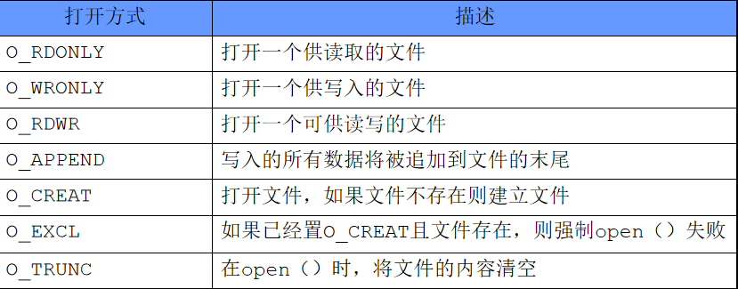

**所有这些标志值的符号名称可以通过#include <fcntl.h>访问**。

注：O_EXCL需要配合O_CREAT使用。


**简单创建文件：**

```c
#include <unistd.h>
#include <sys/types.h>
#include <sys/stat.h>
#include <fcntl.h>

#include <stdlib.h>
#include <stdio.h>
#include <errno.h>
#include <string.h>

/*
#define ERR_EXIT(m) (perror(m), exit(EXIT_FAILURE))
*/

#define ERR_EXIT(m) \
	do \
	{ \
		perror(m); \
		exit(EXIT_FAILURE); \
	} while(0)

int main(void)
{
	int fd;
	fd = open("test.txt", O_RDONLY);
/*
	if (fd == -1)
	{
		fprintf(stderr, "open error with errno=%d %s\n", errno, strerror(errno));
		exit(EXIT_FAILURE);
	}
*/
/*
	if (fd == -1)
	{
		perror("open error");
		exit(EXIT_FAILURE);
	}
*/
	if (fd == -1)
		ERR_EXIT("open error");

	printf("open succ\n");
	return 0;
}
```


**O_CREAT时文件权限问题：**

```c
int main(void)
{
	umask(0);   //注意这个，我们才能创建0666的文件权限，否则即使你指定了0666，最终创建出来的文件权限也是0644，因为shell环境的umask值是0022。
    //最终的文件权限是mode&~umask。
	int fd;
	fd = open("test.txt", O_WRONLY | O_CREAT, 0666);
	if (fd == -1)
		ERR_EXIT("open error");

	printf("open succ\n");
	return 0;
}
```


**O_CREAT | O_EXCL：**

```c
int main(void)
{
	umask(0);
	int fd;
	fd = open("test.txt", O_WRONLY | O_CREAT | O_EXCL, 0666);
	if (fd == -1)
		ERR_EXIT("open error");

	printf("open succ\n");
	return 0;
}

```


**设置权限的另一种方式：**

```c
#include <unistd.h>
#include <sys/types.h>
#include <sys/stat.h>
#include <fcntl.h>

#include <stdlib.h>
#include <stdio.h>
#include <errno.h>
#include <string.h>


#define ERR_EXIT(m) \
	do \
	{ \
		perror(m); \
		exit(EXIT_FAILURE); \
	} while(0)

int main(void)
{
	umask(0);
	int fd;
	fd = open("test2.txt", O_WRONLY | O_CREAT | O_EXCL, S_IRUSR | S_IWUSR);
	if (fd == -1)
		ERR_EXIT("open error");

	printf("open succ\n");
	close(fd);
	return 0;
}
```


**访问权限**：

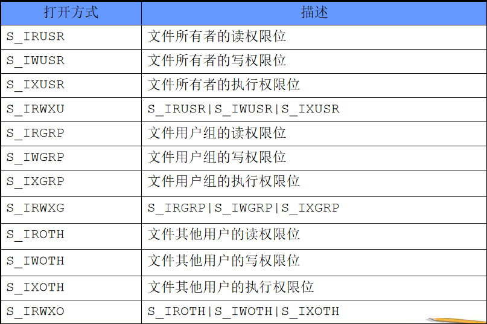

**open调用的几点说明：**

可以利用按位逻辑加(bitwise-OR)(|)对打开方式的标志值进行组合。	

如打开一个新文件：	

```c
#define NEWFILE (O_WRONLY|O_CREAT|O_TRUNC)
```

**对访问权限位进行访问所用到的标识符，均可以通过＃include <sys/stat.h> 访问到,同样可以通过|运算来对访问权限进行组合。这种方式没有数字来得直接**。

```c
#define MODE755 (S_IRWXU|S_IRGRP|S_IXGRP|S_IROTH|S_IXOTH)
#define MODE755 0755
```

### close

```c
为了重新利用文件描述符，用close()系统调用释放打开的文件描述符 
函数原型：int close(int fd);
函数参数：
fd ：要关闭的文件的文件描述符
返回值
	如果出现错误，返回-1
	调用成功返回0
```

### creat

为了维持与早期的UNIX系统的向后兼容性，Linux也提供可选的创建文件的系统调用，它称为creat()。

```c
函数原型：
		int creat(const char *path, mode_t mode)； 
		参数
path ：文件的名称，可以包含（绝对和相对）路径
mode:  用来规定对该文件的所有者，文件的用户组及系统中其他用户的访问权限
返回值
	打开成功，返回文件描述符；
	打开失败，返回－1
```

在UNIX的早期版本中，open()系统调用仅仅存在两个参数的形式。如文件不存在，它就不能打开这些文件。文件的创建则由单独的系统调用creat()完成。在Linux及所有UNIX的近代版本中，creat()系统调用是多余的。 

```c
creat()调用
	fd = creat(file, mode)；
	完全等价于近代的open()调用
	fd = open(file, O_WRONLY | O_CREAT | O_TRUNC, mode)；
```

### ==read==

一旦有了与一个打开文件描述相连的文件描述符，只要该文件是用O_RDONLY或O_RDWR标志打开的，就可以用read()系统调用从该文件中读取字节。

```c
函数原型：
		ssize_t read(int fd, void *buf, size_t count);
		参数
fd ：想要读的文件的文件描述符
buf ： 指向内存块的指针，从文件中读取来的字节放到这个内存块中
count ： 从该文件复制到buf中的字节个数
返回值
	如果出现错误，返回-1
	读文件结束，返回0(读不到内容)
	否则返回从该文件复制到规定的缓冲区中的字节数 就是返回实际读取到的字节数
```

如果是从终端读，遇到回车会结束，并且不读取回车。

注：read和write都有可能会被信号中断。即使你指定count，也不一定能够读到count字节，**==有可能是文件没有那么大，有可能是被信号中断==**。每次读，文件指针都会偏移，这个偏移值被内核维护，下一次读取时，会接着这个偏移值继续读取。


eg：

chatgpt：

posix read 函数读取内容到缓冲区后会自动补上'\0'吗


不会。POSIX read() 函数是将指定字节数的数据从文件描述符中读取到指定缓冲区中，不会自动在缓冲区末尾添加 NULL 终止符。

如果需要将读取的数据转换成一个以 NULL 结尾的 C 字符串，需要手动在读取到的数据末尾添加 NULL 终止符。通常的做法是在读取到的数据长度末尾添加一个 '\0' 字节，确保字符串以 NULL 结尾。


注意，由于从终端读取的数据通常不会以 NULL 结尾，因此 buffer 缓冲区中的数据不一定是一个以 NULL 结尾的字符串。如果需要将其转换成字符串，可以在读取到的数据末尾手动添加 NULL 终止符。

```c
[root@hero ~]# cat read.c 
#include <unistd.h>
#include <stdio.h>

int main()
{
    char buf[1024];
    ssize_t nread;

    printf("Enter some text: ");
    fflush(stdout);

    nread = read(STDIN_FILENO, buf, sizeof(buf));

    if (nread == -1) {
        perror("read");
    } else {
        printf("Read %zd bytes from stdin:\n", nread);
        //fwrite(buffer, nread, 1, stdout); // chatgpt
        // 它chatgpt是固定写出多少字节，所以不存在有没有'\0'的问题。
        
		printf("strlen=%d\n",strlen(buf));
		printf("text=%s",buf);  // 注意这里我没有手动输出换行
    }
    return 0;
}
```

运行结果1：

```bash
[root@hero ~]# ./a.out 
Enter some text: yyy
Read 4 bytes from stdin:
strlen=6
text=yyy
[root@hero ~]#
```

运行结果2：

```bash
[root@hero ~]# ./a.out 
Enter some text: ttt
Read 4 bytes from stdin:
strlen=6
text=ttt
[root@hero ~]#
```

运行结果3：

```bash
root@hero ~]# ./a.out 
Enter some text: uuu
Read 4 bytes from stdin:
strlen=4
text=uuu
[root@hero ~]#
```

这次我们才可以看到strlen是正确的4，前两次都是错误的6，这说明read函数读取后，并不会自动的帮我们补上'\0'，我们需要手动进行。strlen=6的时候我们也能有正确的输出，因为第四个字符是换行，所以肯定是换行的没有毛病。后面两个字符应该是不可打印，没有任何输出，在idx=7(strlen=6)时有个'\0'，然后字符串结束。

**=='\n'会被读取，也会被输出(作为换行符)==**。

**你最好一开始就把buf数组全初始化为0，避免不必要的错误**。


读文件：

```c
[root@hero ~]# cat read.c 
#include <unistd.h>
#include <fcntl.h>
#include <stdio.h>

int main() {
    int fd = open("input.txt", O_RDONLY);
    char buffer[1024];
    ssize_t nread;
    while ((nread = read(fd, buffer, sizeof(buffer))) > 0) {
        printf("Read %ld bytes\n", nread);
        printf("content:%s",buffer);  // 同样，使用文件中的回车来进行换行
		printf("strlen=%d\n",strlen(buffer));
    }
    close(fd);
    return 0;
}
```

假设我往文件中vim写入了aaa，其实这个文件大小为4，因为有回车。所以，我们读到的就是4个字节。

运行结果：

```bash
[root@hero ~]# ./a.out 
Read 4 bytes
content:aaa    # 文件中的回车换的行
strlen=6 
[root@hero ~]# 
```

**同样可以看到，strlen应该为4，但是给出了6**。所以记得自己补0。

### write

用write()系统调用将数据写到一个文件中 

```c
函数原型：
ssize_t write(int fd, const void *buf, size_t count);
函数参数：
fd：要写入的文件的文件描述符
buf： 指向内存块的指针，从这个内存块中读取数据写入到文件中
count： 要写入文件的字节个数
返回值
	如果出现错误，返回-1
	如果写入成功，则返回写入到文件中的字节个数
```

该函数返回值若大于0，不代表数据已经进入磁盘，仅仅是数据已经成功的被拷贝到到内核缓冲区中了。

**==如果想要同时写到磁盘，可以调用fsync函数来进行写入==**。

当然，也可以通过open函数的模式来指定。

```c
O_SYNC 打开  文件  实现  I/O  的 同步 . 任何 通过 文件描述符 对 文件 的 write 都会 使
              调用 的 进程 中断 , 直到 数据 被 真正 写入 硬件 中 .   其他  ,  参考  RESTRIC‐
              TIONS.
```

此时write函数会阻塞直到数据落盘。


eg：复制文件。注：此程序给了新文件0644的权限，事实上，cp命令，拷贝前后文件权限应该是一样的。

```c
int main(int argc, char *argv[])
{
	int infd;
	int outfd;
	if (argc != 3)
	{
		fprintf(stderr, "Usage %s src dest\n", argv[0]);
		exit(EXIT_FAILURE);
	}

	infd = open(argv[1], O_RDONLY);
	if (infd == -1)
		ERR_EXIT("open src error");

	if ((outfd = open(argv[2], O_WRONLY | O_CREAT | O_TRUNC, 0644)) == -1)
		ERR_EXIT("open dest error");
	
	char buf[1024];
	int nread;
	while ((nread = read(infd, buf, 1024)) > 0)  //这个当然是覆盖读啦，每次给定的首地址都是buf
	{
		write(outfd, buf, nread);
	}
	close(infd);
	close(outfd);
	return 0;
}
```


### 文件的随机读写

到目前为止的所有文件访问都是顺序访问。**这是因为所有的读和写都从当前文件的偏移位置开始，然后文件偏移值自动地增加到刚好超出读或写结束时的位置，使它为下一次访问作好准备**。

有个文件偏移这样的机制，在Linux系统中，**随机访问就变得很简单，你所需做的只是将当前文件移值改变到有关的位置，它将==迫使==一次read()或write()发生在这一位置**。(**==除非文件被O_APPEND打开，在这种情况下，任何write调用仍将发生在文件结束处==**)


功能说明：通过指定相对于开始位置、当前位置或末尾位置的字节数来重定位 curp，这取决于 lseek() 函数中指定的位置

原型：

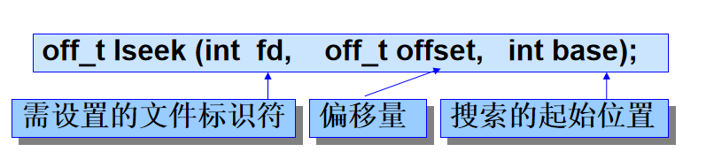

**注：offset和base两个参数共同决定了偏移到哪里。**

返回值：返回新的文件偏移值。


**base 表示搜索的起始位置**，有以下几个值：（这些值定义在<unistd.h>）


eg：简单偏移

```c
int main(void)
{
	int fd;
	fd = open("test.txt", O_RDONLY);
	if (fd == -1)
		ERR_EXIT("open error");

	char buf[1024] = {0};
	int ret = read(fd, buf, 5);  //指向待读取的下一个字符位置即5(0到4位置的已经被读取)
	if (ret == -1)
		ERR_EXIT("read error");
	printf("buf=%s\n", buf);
	
	ret = lseek(fd, 0, SEEK_CUR); //从当前位置偏移0，没偏，所以返回值是5
	if (ret == -1)
		ERR_EXIT("lseek");

	printf("current offset=%d\n", ret);
	return 0;
}
```


eg：空洞文件。

```c
#include <unistd.h>
#include <sys/types.h>
#include <sys/stat.h>
#include <fcntl.h>

#include <stdlib.h>
#include <stdio.h>
#include <errno.h>
#include <string.h>


#define ERR_EXIT(m) \
	do \
	{ \
		perror(m); \
		exit(EXIT_FAILURE); \
	} while(0)

int main(void)
{
	int fd;
	fd = open("hole.txt", O_WRONLY | O_CREAT | O_TRUNC, 0644);
	if (fd == -1)
		ERR_EXIT("open error");

	write(fd, "ABCDE", 5);

	int ret = lseek(fd, 1024*1024*1024, SEEK_CUR);
	if (ret == -1)
		ERR_EXIT("lseek error");

	write(fd, "hello", 5);

	close(fd);

	return 0;
}
```

我们先从当前位置偏移32，运行结果：

```shell
[root@hadoop100 test]# ls -l hole.txt 
-rw-r--r--. 1 root root 42 8月  11 16:35 hole.txt
[root@hadoop100 test]# cat hole.txt 
ABCDEhello[root@hadoop100 test]# od -c hole.txt 
0000000   A   B   C   D   E  \0  \0  \0  \0  \0  \0  \0  \0  \0  \0  \0
0000020  \0  \0  \0  \0  \0  \0  \0  \0  \0  \0  \0  \0  \0  \0  \0  \0
0000040  \0  \0  \0  \0  \0   h   e   l   l   o
0000052
[root@hadoop100 test]# du -h hole.txt 
4.0K	hole.txt
```

**注：上面cat是不能查看出真实情况的，需要使用od命令**。

由于磁盘块最小是4k,所以即使该文件只有42B，也显示了4k。

现在我们偏移1g，运行结果：

```shell
[root@hadoop100 test]# ls -l hole.txt 
-rw-r--r--. 1 root root 1073741834 8月  11 16:39 hole.txt
[root@hadoop100 test]# ls -hl hole.txt 
-rw-r--r--. 1 root root 1.1G 8月  11 16:39 hole.txt
[root@hadoop100 test]# du -h hole.txt 
8.0K	hole.txt
```

**显示1g，实际上磁盘并不存储那么多的0，可能只是做了一下标记。所以看到的只有8.0k**。


好吧，我整成1001g，还是存了8k。

```shell
[root@hadoop100 test]# ls -hl hole.txt 
-rw-r--r--. 1 root root 1001G 8月  11 16:46 hole.txt
[root@hadoop100 test]# du -hl hole.txt 
8.0K	hole.txt
```

### 目录相关

#### opendir

功能说明：打开一个目录

原型：

```c
DIR* opendir(char *pathname);  //这些都是相关路径或绝对路径
```

返回值：	打开成功，**返回一个目录指针(句柄)**	打开失败，则返回0

#### readdir

功能说明：访问指定目录中下一个连接的细节

原型：

````c
struct  dirent*  readdir(DIR  *dirptr); //目录指针(句柄)
struct dirent
  {
      long d_ino;                 /* inode number */
      off_t d_off;                /* offset to this dirent */
      unsigned short d_reclen;    /* length of this d_name */
      char d_name [NAME_MAX+1];   /* file name (null-terminated) */
  }
````

返回值：	**返回一个指向dirent结构的指针，它包含指定目录中下一个连接的细节**；	没有更多连接时，返回0。

#### closedir

功能说明：关闭一个已经打开的目录

原型：

```c
int closedir (DIR  *dirptr);
```

返回值：调用成功返回0，失败返回-1。注意一下返回值。


eg：简易ls

```c
#include <dirent.h>
int main(void)
{
	DIR *dir = opendir(".");
	struct dirent *de;
	while ((de = readdir(dir)) != NULL)  //它会自动迭代的
	{
		if (strncmp(de->d_name, ".", 1) == 0)  //过滤隐藏文件
			continue;
		printf("%s\n", de->d_name);
	}
	closedir(dir);
	exit(EXIT_SUCCESS);
}
```

#### 了解

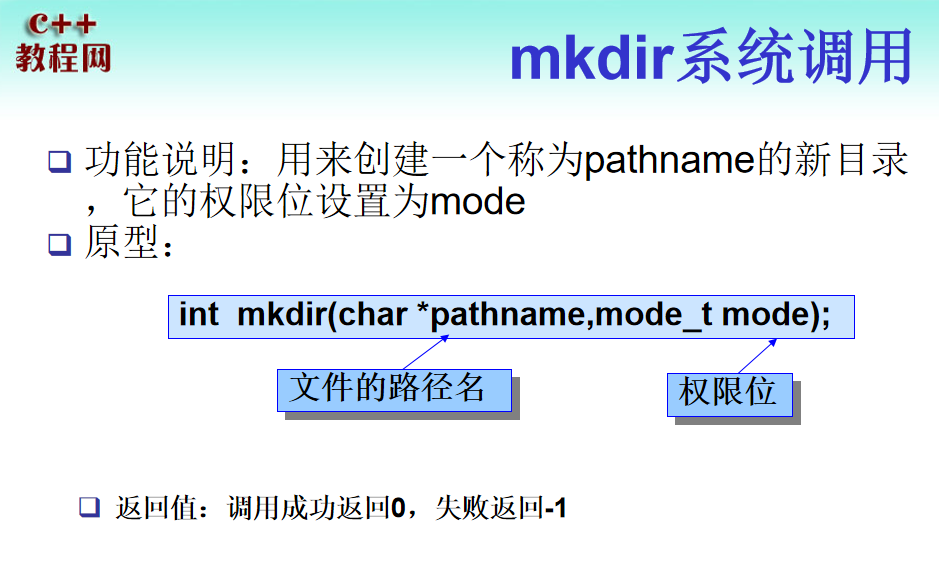

***

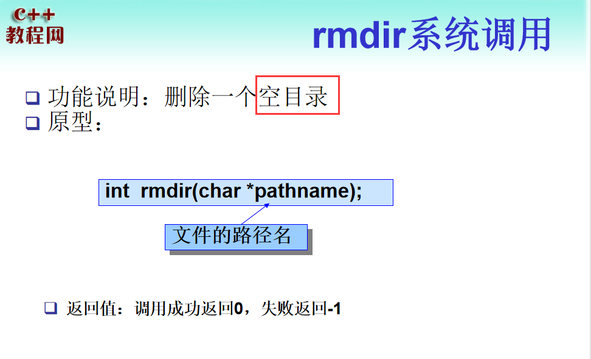

****

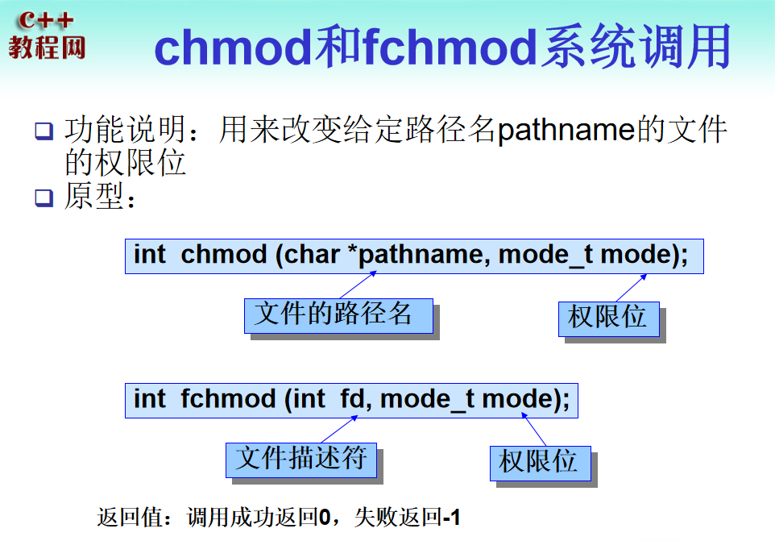

***

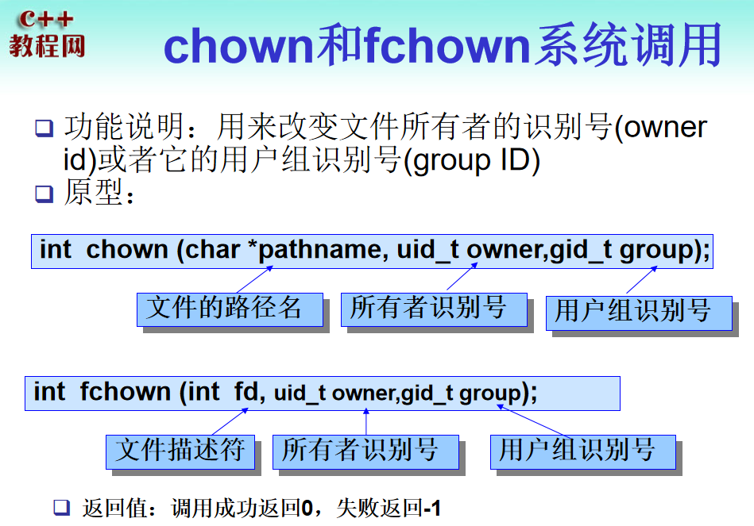

### stat

功能：读取文件元数据

```c
int stat(const char *path, struct stat *buf);
int fstat(int fd, struct stat *buf);   //针对已经打开的文件描述符
int lstat(const char *path, struct stat *buf); //对于软连接文件，获取软链接文件本身的数据
```


```c
struct stat {
	dev_t     st_dev;     /* ID of device containing file */
	ino_t     st_ino;     /* inode number */
	mode_t    st_mode;    /* protection */   //文件类型及权限
	nlink_t   st_nlink;   /* number of hard links */
	uid_t     st_uid;     /* user ID of owner */
	gid_t     st_gid;     /* group ID of owner */
	dev_t     st_rdev;    /* device ID (if special file) */ //若是设备文件，设备文件所对应的设备号
	off_t     st_size;    /* total size, in bytes */
	blksize_t st_blksize; /* blocksize for file system I/O */
	blkcnt_t  st_blocks;  /* number of 512B blocks allocated */
	time_t    st_atime;   /* time of last access */
	time_t    st_mtime;   /* time of last modification */
	time_t    st_ctime;   /* time of last status change */
};

 st_dev:16位整数，高8位存放主设备号，低8位从设备号。
```


eg：

```c
#include <unistd.h>
#include <sys/stat.h>
#include <sys/types.h>
#include <sys/stat.h>
#include <fcntl.h>

#include <stdlib.h>
#include <stdio.h>
#include <errno.h>
#include <string.h>


#define ERR_EXIT(m) \
	do \
	{ \
		perror(m); \
		exit(EXIT_FAILURE); \
	} while(0)

#define MAJOR(a) (int)((unsigned short)a >> 8)    //得到高8位
#define MINOR(a) (int)((unsigned short)a & 0xFF)  //得到低8位

int filetype(struct stat *buf);
void fileperm(struct stat *buf, char *perm);

int main(int argc, char *argv[])
{
	if (argc != 2)
	{
		fprintf(stderr, "Usage %s file\n", argv[0]);
		exit(EXIT_FAILURE);
	}

	struct stat sbuf;
	printf("Filename:%s\n", argv[1]);
	if (lstat(argv[1], &sbuf) == -1)
		ERR_EXIT("stat error");

	printf("File number:major %d,minor %d inode %d\n", MAJOR(sbuf.st_dev), MINOR(sbuf.st_dev), (int)sbuf.st_ino);
	if (filetype(&sbuf))
	{
        //设备文件打印出主，次设备号
		printf("Device number:major %d,minor %d\n", MAJOR(sbuf.st_rdev), MINOR(sbuf.st_rdev));
	}
	
	char perm[11] = {0};
	fileperm(&sbuf, perm);
	printf("File permission bits=%o %s\n", sbuf.st_mode & 07777, perm);
	

	return 0;
}

//还可以
S_ISREG(m)  is it a regular file?

S_ISDIR(m)  directory?

S_ISCHR(m)  character device?

S_ISBLK(m)  block device?

S_ISFIFO(m) FIFO (named pipe)?

S_ISLNK(m)  symbolic link?  (Not in POSIX.1-1996.)

S_ISSOCK(m) socket?  (Not in POSIX.1-1996.)

int filetype(struct stat *buf)   //文件类型
{
	int flag = 0;
	printf("Filetype:");
	mode_t mode;
	mode = buf->st_mode;
	switch (mode & S_IFMT)
	{
	case S_IFSOCK:
		printf("socket\n");
		break;
	case S_IFLNK:
		printf("symbolic link\n");
		break;
	case S_IFREG:
		printf("regular file\n");
		break;
	case S_IFBLK:
		printf("block device\n");
		flag = 1;
		break;
	case S_IFDIR:
		printf("directory\n");
		break;
	case S_IFCHR:
		printf("character device\n");
		flag = 1;
		break;
	case S_IFIFO:
		printf("FIFO\n");
		break;
	default:
		printf("unknown file type\n");
		break;
	}

	return flag;
}

void fileperm(struct stat *buf, char *perm)  //文件权限
{
	strcpy(perm, "----------");
	perm[0] = '?';
	mode_t mode;
        mode = buf->st_mode;
        switch (mode & S_IFMT)
        {
        case S_IFSOCK:
		perm[0] = 's';
                break;
        case S_IFLNK:
		perm[0] = 'l';
                break;
        case S_IFREG:
		perm[0] = '-';
                break;
        case S_IFBLK:
		perm[0] = 'b';
                break;
        case S_IFDIR:
		perm[0] = 'd';
                break;
        case S_IFCHR:
		perm[0] = 'c';
                break;
	case S_IFIFO:
		perm[0] = 'p';
                break;
	}

	if (mode & S_IRUSR)   //直接用mode进行与就行
		perm[1] = 'r';
	if (mode & S_IWUSR)
		perm[2] = 'w';
	if (mode & S_IXUSR)
		perm[3] = 'x';
	if (mode & S_IRGRP)
		perm[4] = 'r';
	if (mode & S_IWGRP)
		perm[5] = 'w';
	if (mode & S_IXGRP)
		perm[6] = 'x';
	if (mode & S_IROTH)
		perm[7] = 'r';
	if (mode & S_IWOTH)
		perm[8] = 'w';
	if (mode & S_IXOTH)
		perm[9] = 'x';
	perm[10] = '\0';
}
```

运行结果：

```shell
[root@hadoop100 test]# ./a.out kk.c 
Filename:kk.c
File number:major 253,minor 0 inode 3587962
Filetype:regular file
File permission bits=644 -rw-r--r--
[root@hadoop100 test]# df kk.c 
文件系统                   1K-块    已用     可用 已用% 挂载点
/dev/mapper/centos-root 47158788 6705112 40453676   15% /
[root@hadoop100 test]# ls -l /dev/mapper/centos-root 
lrwxrwxrwx. 1 root root 7 8月  12 13:52 /dev/mapper/centos-root -> ../dm-0
[root@hadoop100 test]# ls -l /dev/sda1
brw-rw----. 1 root disk 8, 1 8月  12 13:52 /dev/sda1
[root@hadoop100 test]# ls -l /dev/sda2
brw-rw----. 1 root disk 8, 2 8月  12 13:52 /dev/sda2
[root@hadoop100 test]# ls -l /dev/tty1
crw--w----. 1 root tty 4, 1 8月  12 13:52 /dev/tty1
# 主设备号4，次设备号1。
# 事实上。主设备号决定了系统用什么样的驱动程序来访问这些设备
```


练习：

```c
实现ls -l功能
lstat
getpwuid    //通过组uid获取用户信息
getgrgid    //通过组id获取组信息
readlink    

    struct group {
               char   *gr_name;       /* group name */
               char   *gr_passwd;     /* group password */
               gid_t   gr_gid;        /* group ID */
               char  **gr_mem;        /* group members */
           };

 #include <unistd.h>

       ssize_t readlink(const char *restrict path, char *restrict buf,
              size_t bufsize);
通过链接文件名path得到真实文件名保存到buf中
```


### 复制文件描述符

本章目标：

文件共享

* 打开文件内核数据结构

* 一个进程两次打开同一个文件

* 两个进程打开同一个文件

复制文件描述符（dup、dup2、fcntl）


**==值得注意的是，文件描述符与文件之间并没有什么一一对应的关系，fd=3和fd=4都可以同时指向同一个文件==。**


**打开文件内核数据结构：**

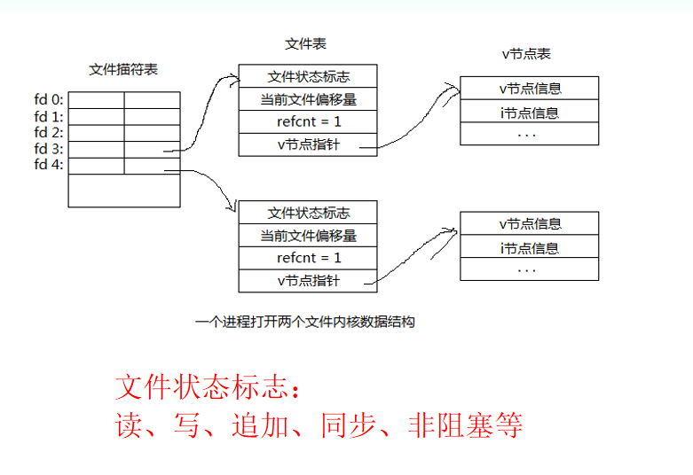

打开的不同文件有自己独立的文件表(**刻画了偏移量这一重要指标**)和节点表。其中v节点指针指向v节点表，**v节点信息与stat函数相关，i节点信息与存储在磁盘上相关**。


**==一个进程两次打开同一个文件==：**

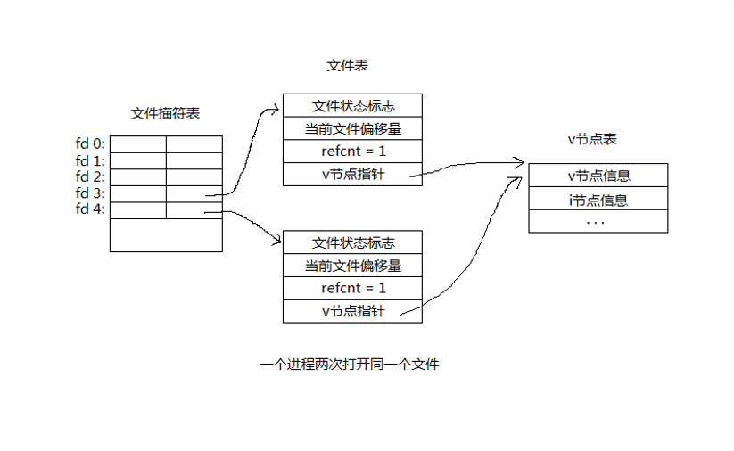

此时每个文件描述符有自己独立的文件表，但是因为是打开的同一个文件，所以v节点表是同一个。**==也就是说，文件偏移量是独立的，但是文件有修改是大家都能看到的==**。

```c
int main(int argc, char *argv[])
{
	int fd1;
	int fd2;
	char buf1[1024] = {0};
	char buf2[1024] = {0};
	fd1 = open("test.txt", O_RDONLY);
	if (fd1 == -1)
		ERR_EXIT("open error");
	read(fd1, buf1, 5);         //偏移5
	printf("buf1=%s\n", buf1);
	

	fd2 = open("test.txt", O_RDWR);  //打开同一个文件
	if (fd2 == -1)
		ERR_EXIT("open error");

	read(fd2, buf2, 5);   //偏移5
	printf("buf2=%s\n", buf2);
	write(fd2, "AAAAA", 5);  //在偏移5处开始写入5个字符(覆盖了原来的)

	memset(buf1, 0, sizeof(buf1));
	read(fd1, buf1, 5);     //在偏移5处开始读出刚才写入的5个字符
	printf("buf1=%s\n", buf1);
	close(fd1);
	close(fd2);
	return 0;
}
```

运行结果：

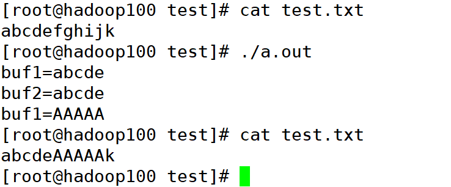


**==两个进程打开同一个文件==：**

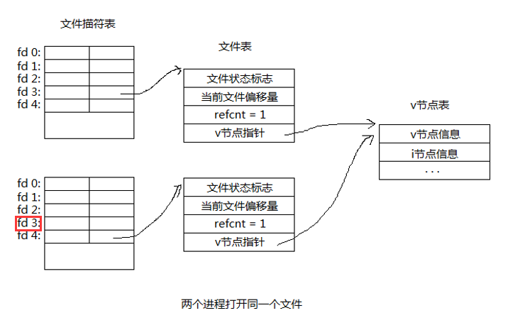

每个进程都可以打开1024个文件描述符，第二个进程的fd=3可能被其他文件占用了，所以此时fd=4 。当然他们也应该有自己独立的文件表，和相同的v节点表。


**复制文件描述符：(最大的作用应该是io重定向)**

复制文件描述符有三种方法

* dup

* dup2

* fcntl：fcntl(fd,F_DUPFD,fd_start);


我们可以看到，dup(3)的作用是，选择当前可用的最小的文件描述符(此时为4)与fd=3指向同一个文件，那么此时文件表中的refcnt理所当然变为了2。

eg:

```c
int main(int argc, char *argv[])
{
	int fd;
	fd = open("test2.txt", O_WRONLY);
	if (fd == -1)
		ERR_EXIT("open error");

/*
	close(1);
	dup(fd);
*/
	dup2(fd, 1);   //强制指定文件描述符1与fd指向同一个文件
	printf("hello\n");  //一共写入了6个字节
	return 0;
}
```

此例中，我们先关闭了文件描述符1，然后使用dup(fd)，那么系统会从0开始寻找到此时最小可用的文件描述符为1，然后将它与fd指向同一个文件test2.txt。**==于是，标准输出不再指向显示器这个文件，而是指向test2.txt这个文件==**。**==所以，最后原本应该输出到终端的hello被输出到了test2.txt这个文件==**。

> **显示器是一个设备文件，文件描述符1代表着标准输出，原先文件描述符1指向这个设备文件，所以这个设备文件可以理解为标准输出了**。

**==dup2函数等价于先强制关闭(指定的文件)，然后在调用dup函数==**。

### fcntl

功能：**操纵文件描述符**，改变已打开的文件的属性

```c
int fcntl(int fd, int cmd, ... /* arg */ );
```

第二个参数是命令，第三个参数相当于是命令的选项。

**fcntl常用操作：**

复制文件描述符

* F_DUPFD (long)

文件描述符标志(不懂)

* F_GETFD (void)

* F_SETFD (long)

文件状态标志

* F_GETFL (void)

* F_SETFL (long)

文件锁

* F_GETLK

* F_SETLK

* F_SETLKW

文件锁结构体：

```c
struct flock {
	...
	short l_type;       /* Type of lock: F_RDLCK,
			         F_WRLCK, F_UNLCK */
	short l_whence; /* How to interpret l_start:
                                   SEEK_SET, SEEK_CUR, SEEK_END */
                                   开始，当前，末尾
	off_t l_start;       /* Starting offset for lock */
	off_t l_len;         /* Number of bytes to lock */
    
    //以上三个参数决定了文件锁的范围。l_whence和l_start决定了从文件的哪个位置偏移多少，再加锁。
    //也就是决定了锁的起始位置。l_len表示锁多长，0表示到文件末尾。
	pid_t l_pid;        /* PID of process blocking our lock
                                   (F_GETLK only) */
     ...
};
```


复制文件描述符：

```c
int main(int argc, char *argv[])
{
	int fd;
	fd = open("test.txt", O_WRONLY);
	if (fd == -1)
		ERR_EXIT("open error");

/*
	close(1);
	dup(fd);
*/
/*
	dup2(fd, 1);
*/

	close(1);
	if (fcntl(fd, F_DUPFD, 0) < 0)  //此时pos=0
		ERR_EXIT("dup fd error");
	printf("hello\n");
	return 0;
}
```

注：**第三个参数表示从pos位置开始寻找一个最小可用的文件描述符**。


**文件状态标志：**

```c
void set_flag(int fd, int flags);
void clr_flag(int fd, int flags);

int main(int argc, char *argv[])
{
	char buf[1024] = {0};
	int ret;
/*
	int flags;
	flags = fcntl(0, F_GETFL, 0);  //第三个参数没有作用，填0
	if (flags == -1)
		ERR_EXIT("fcntl get flag error");

	ret = fcntl(0, F_SETFL, flags | O_NONBLOCK);
	if (ret == -1)
		ERR_EXIT("fcntl set flag error");
*/
	set_flag(0, O_NONBLOCK);
	clr_flag(0, O_NONBLOCK);
	ret = read(0, buf, 1024);
	if (ret == -1)
		ERR_EXIT("read error");

	printf("buf=%s\n", buf);
	return 0;
}

void set_flag(int fd, int flags)
{
	int val;
	val = fcntl(fd, F_GETFL, 0);
	if (val == -1)
                ERR_EXIT("fcntl get flag error");
	val |= flags;
	if (fcntl(fd, F_SETFL, val) < 0)
		ERR_EXIT("fcntl set flag error");
}

void clr_flag(int fd, int flags)
{
	int val;
	val = fcntl(fd, F_GETFL, 0);
	if (val == -1)
                ERR_EXIT("fcntl get flag error");
	val &= ~flags;
	if (fcntl(fd, F_SETFL, val) < 0)
		ERR_EXIT("fcntl set flag error");
}

```

运行结果：

```c
[root@hadoop100 test]# ./a.out 
read error: Resource temporarily unavailable
```

**此例如果取消了标准输入的阻塞性，那么read会直接返回错误。事实上，此时的错误代码是EAGAIN**。


**文件锁：**

```c
int main(int argc, char *argv[])
{
	int fd;    //O_TRUNC清空
	fd = open("test2.txt", O_CREAT | O_RDWR | O_TRUNC, 0644);
	if (fd == -1)
		ERR_EXIT("open error");

	struct flock lock;
	memset(&lock, 0, sizeof(lock));
	lock.l_type = F_WRLCK;
	lock.l_whence = SEEK_SET;
	lock.l_start = 0;
	lock.l_len = 0;

	/*if (fcntl(fd, F_SETLK, &lock) == 0)*/ //如果其他进程持有锁，直接失败返回，标志也是EAGAIN
                                            //Resource temporarily unavailable
	if (fcntl(fd, F_SETLKW, &lock) == 0)   //如果其他进程持有锁，那么我等待
	{
		printf("lock success\n");
		printf("press any key to unlock\n");
		getchar();
		lock.l_type = F_UNLCK;      //如果你不解锁，进程运行结束的话，也会解锁。
		if (fcntl(fd, F_SETLK, &lock) == 0)
			printf("unlock success\n");
		else
			ERR_EXIT("unlock fail");
	}
	else
		ERR_EXIT("lock fail");
	return 0;
}
```

## 进程间通信

### 简介

顺序程序与并发程序特征：

顺序程序特征：

* 顺序性

* 封闭性：（运行环境的封闭性）

* 确定性

* 可再现性

并发程序特征：

* 共享性

* 并发性

* **随机性**


进程互斥：

由于各进程要求共享资源，而且有些资源需要互斥使用，因此各进程间竞争使用这些资源，进程的这种关系为进程的互斥

系统中某些资源一次只允许一个进程使用，称这样的资源为临界资源或互斥资源。

在进程中涉及到互斥资源的程序段叫临界区


互斥示例：

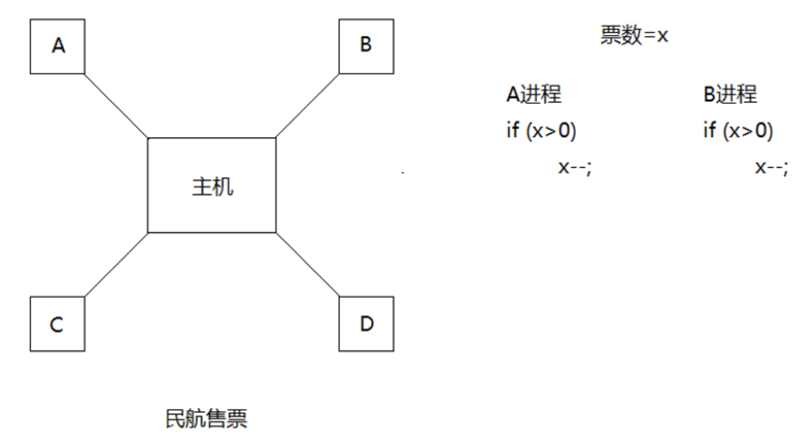

进程同步：

进程同步指的是多个进程需要相互配合共同完成一项任务。

注：**信号量既可以实现同步也可以实现互斥，单凭信号量来判断是同步还是互斥是不太清晰的，更多的是结合实际的逻辑。一般我们认为同步包含互斥。更多的，同步强调一种协作(具有顺序上的关系)，互斥是一种争抢的关系，是具有矛盾性的**。

互斥示例：

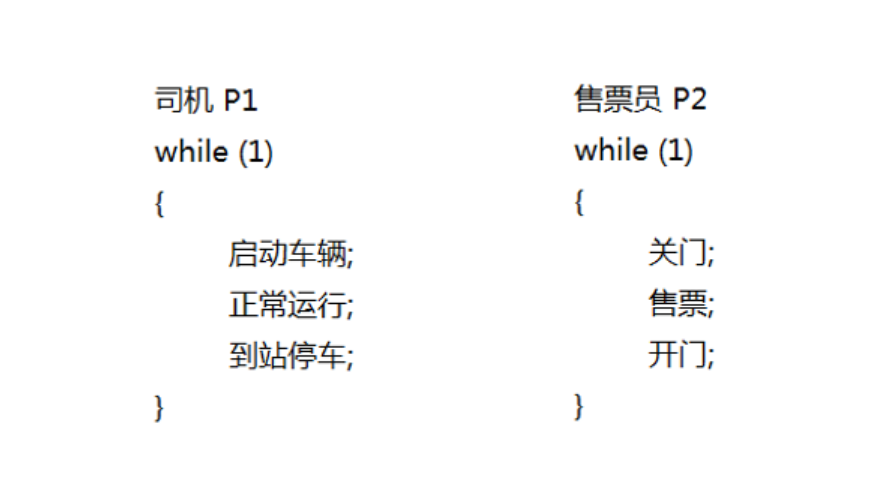

#### 进程间通信目的

* **数据传输**：一个进程需要将它的数据发送给另一个进程

* **==资源共享==**：多个进程之间共享同样的资源。

* **通知事件**：一个进程需要向另一个或一组进程发送消息，通知它（它们）发生了某种事件（如进程终止时要通知父进程）。

* 进程控制：有些进程希望完全控制另一个进程的执行（如Debug进程），此时控制进程希望能够拦截另一个进程的所有陷入和异常，并能够及时知道它的状态改变。

  注：也可以通过信号来实现：5) SIGTRAP

#### 进程间通信发展

管道

System V进程间通信

POSIX进程间通信

#### 进程间通信分类

文件(两个进程访问同一个文件也是通信)

文件锁(实际上，这是一种读写锁)

管道（pipe）和有名管理（FIFO）

信号（signal）

消息队列(传送数据)

共享内存(共享数据)

信号量(同步与互斥)

互斥量

条件变量

读写锁

套接字（socket）

#### System V IPC & POSIX IPC

System V IPC

* System V 消息队列
* System V 共享内存
* System V 信号量

POSIX IPC

* 消息队列
* 共享内存
* 信号量
* 互斥量
* 条件变量
* 读写锁

#### 进程间共享信息的三种方式

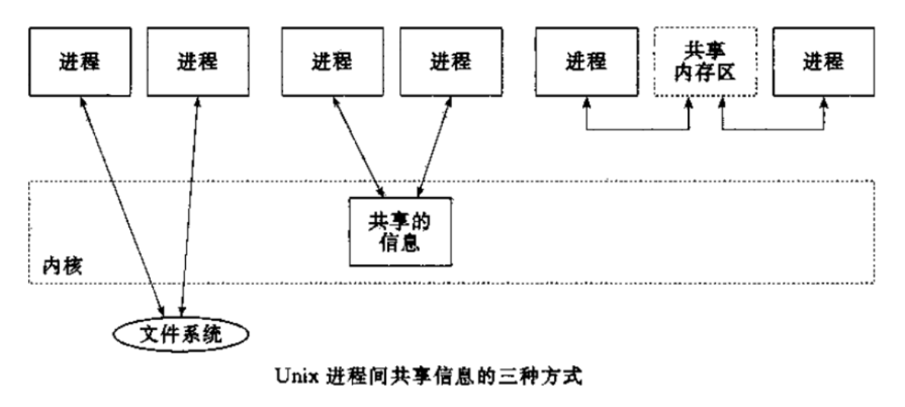

**==文件系统，内核，用户空间==**(共享内存，效率更高，不跨越内核)。

#### ==IPC对象的持续性==

随进程持续：**一直存在直到打开的最后一个进程结束**。（如pipe和FIFO）

随内核持续：一直存在直到内核自举(**即重启**)或显式删除（如System V消息队列、共享内存、信号量）

随文件系统持续：**一直存在直到显式删除，即使内核自举还存在。**（POSIX消息队列、共享内存、信号量，如果是使用映射文件来实现。若不是，那么随内核持续）

### 死锁

死锁是指多个进程之间相互等待对方的资源，而在得到对方资源之前又不释放自己的资源，这样，造成循环等待的一种现象。如果所有进程都在等待一个不可能发生的事，则进程就死锁了。

#### 死锁产生的必要条件

互斥条件

* 进程对资源进行排它性使用，即在一段时间内某资源仅为一个进程所占用。

请求和保持条件

* 当进程因请求资源而阻塞时，对已获得的资源保持不放。 

  **进程认为自己请求了就能够得到**。

不可剥夺条件

* 进程已获得的资源在未使用完之前，不能被剥夺，只能在使用完时由自己释放。 

环路等待条件

* 各个进程组成封闭的环形链，每个进程都等待下一个进程所占用的资源

以上4个条件缺一不可。

#### 防止死锁办法

注：互斥条件一般是没办法进行破坏的，所以不予考虑。

资源一次性分配：（破坏请求和保持条件）

可剥夺资源：破坏不可剥夺条件）

资源有序分配法：（破坏循环等待条件）

### 信号

#### 中断

中断是系统对于异步事件的响应

中断信号

中断源

现场信息

中断处理程序

中断向量表

#### 中断分类

硬件中断（外部中断）	外部中断是指由外部设备通过硬件请求的方式产生的中断，也称为硬件中断

软件中断（内部中断）	内部中断是由CPU运行程序错误或执行内部程序调用引起的一种中断，也称为软件中断。

#### 信号

信号是UNIX系统响应某些状况而产生的事件，进程在接收到信号时会采取相应的行动。**信号是因为某些错误条件而产生的，比如内存段冲突、浮点处理器错误或者非法指令等信号==是在软件层次上对中断的一种模拟，所以通常把它称为是软中断==**。

#### 信号与中断

信号与中断的相似点：

（1）**==采用了相同的异步==(我做我的事，信号出现了通知我。如果我等待你通知我，然后我才能做事就是同步)通信方式**；（2）当检测出有信号或中断请求时，都暂停正在执行的程序而转去执行相应的(中断or信号)处理程序；（3）都在处理完毕后返回到原来的断点；（4）**==对信号或中断都可进行屏==蔽**。

信号与中断的区别：

（1）**中断有优先级，而信号没有优先级，==所有的信号都是平等的==**；（2）**信号处理程序是在用户态下运行的，而中断处理程序是在核心态下运行**；（3）中断响应是及时的，而信号响应通常都有较大的时间延迟。

#### 信号名称

信号的名称是在头文件 signal.h里定义的。**我们可以使用man 7 signal查看一些信息。**

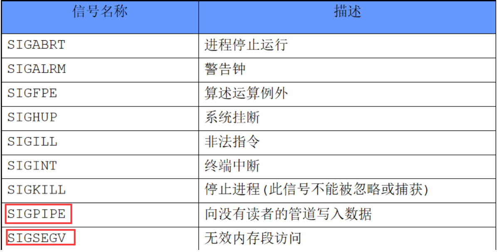

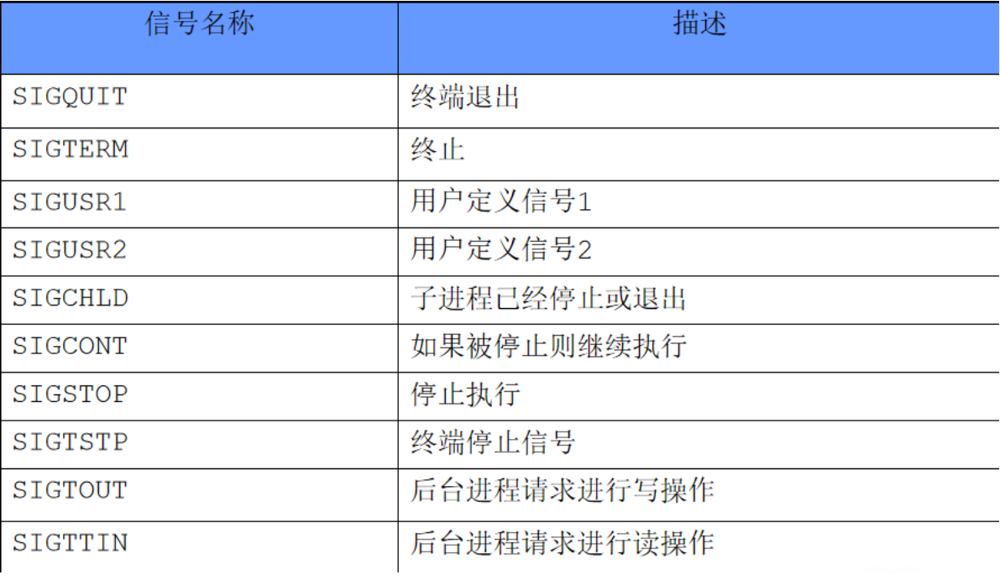

#### 进程对信号的三种响应

**忽略信号**	不采取任何操作、有两个信号**==不能被忽略(也不能被用户捕获进行处理)==**：SIGKILL和SIGSTOP(默认处理)。

**==捕获并处理信号==**	内核中断正在执行的代码，转去执行先前注册过的处理程序。

**执行默认操作**	默认操作通常是终止进程，这取决于被发送的信号。


#### signal函数

```c
typedef void (*__sighandler_t) (int);  //__sighandler_t是函数类型，形参是int，返回值是void
#define SIG_ERR ((__sighandler_t) -1)
#define SIG_DFL ((__sighandler_t) 0)   //默认处理
#define SIG_IGN ((__sighandler_t) 1)
函数原型:
	__sighandler_t signal(int signum, __sighandler_t handler);
```

参数signal是一个带signum和handler两个参数的函数，准备捕捉或屏蔽的信号由参数signum给出，接收到指定信号时将要调用的函数由handler给出

handler这个函数必须有一个int类型的参数（即接收到的信号代码），它本身的类型是void。

handler也可以是下面两个特殊值：		

* SIG_IGN	**==屏蔽该信号==**		
* SIG_DFL	**==恢复默认行为==**

返回值：**==signal返回上一次的信号处理函数==**。

例子：

```c
#include <unistd.h>
#include <sys/stat.h>
#include <sys/wait.h>
#include <sys/types.h>
#include <fcntl.h>

#include <stdlib.h>
#include <stdio.h>
#include <errno.h>
#include <string.h>
#include <signal.h>


#define ERR_EXIT(m) \
	do \
	{ \
		perror(m); \
		exit(EXIT_FAILURE); \
	} while(0)

void handler(int sig);
int main(int argc, char *argv[])
{
	__sighandler_t oldhandler;
	oldhandler = signal(SIGINT, handler);  // 返回值是默认的处理程序
	if (oldhandler == SIG_ERR)     // 这是上一行signal执行了以后立马执行的，你是猪吧
		ERR_EXIT("signal error");

	while (getchar() != '\n')
		;
	/*
	if (signal(SIGINT, oldhandler) == SIG_ERR)
	*/
    // 重新关联信号处理程序为默认处理程序(即结束进程)
	if (signal(SIGINT, SIG_DFL) == SIG_ERR)  //因为上一次的信号处理函数是默认的，
        //所以这里写SIG_DFL等价于写oldhandler。
		ERR_EXIT("signal error");
	for (;;) ;  // 按ctrl+c就能结束循环了
	return 0;
}

void handler(int sig)
{
	printf("recv a sig=%d\n", sig);
}

```

注：


#### 不可靠信号

linux信号机制基本上是从unix系统中继承过来的。早期unix系统中的信号机制比较简单和原始，后来在实践中暴露出一些问题，它的主要问题是：

* 进程每次处理信号后，**就将对信号的响应设置为默认动作**。在某些情况下，将导致对信号的错误处理。因此，用户如果不希望这样的操作，那么就要在信号处理函数结尾再一次调用signal函数，重新安装该信号。

* 早期unix下的不可靠信号主要指的是进程**==可能对信号做出错误的反应==**以及**==信号可能丢失==**。 

* linux支持不可靠信号，但是对不可靠信号机制做了改进：在调用完信号处理函数后，不必重新调用该信号的安装函数（**信号安装函数是在可靠机制上的实现**）。**==因此，linux下的不可靠信号问题主要指的是信号可能丢失==**。

#### 可靠信号

随着时间的发展，实践证明了有必要对信号的原始机制加以改进和扩充。所以，后来出现的各种unix版本分别在这方面进行了研究，力图实现"可靠信号"。**由于原来定义的信号已有许多应用，不好再做改动，最终只好又新增加了一些信号，并在一开始就把它们定义为可靠信号，==这些信号支持排队，不会丢失==**。

同时，信号的发送和安装也出现了新版本：信号**发送**函数sigqueue()及信号**安装**函数sigaction()。

#### 实时信号

早期Unix系统只定义了32种信号，Ret hat7.2支持64种信号，编号0-63(SIGRTMIN=31，SIGRTMAX=63)，将来可能进一步增加，这需要得到内核的支持。**前32种信号已经有了预定义值，每个信号有了确定的用途及含义，并且每种信号都有各自的缺省动作。==如按键盘的CTRL ^C时，会产生SIGINT信号，对该信号的默认反应就是进程终止==**。后32个信号表示实时信号，等同于前面阐述的可靠信号。这保证了发送的多个实时信号都被接收。实时信号是POSIX标准的一部分，可用于应用进程。

**==非实时信号都不支持排队，都是不可靠信号；实时信号都支持排队，都是可靠信号。==**

可靠信号都是实时信号，不可靠信号都是非实时信号。

#### 信号发送

kill给进程发送信号。

```c
kill(pid, sig) ;
pid>0:信号sig发送给进程号=pid的进程
pid=0:信号sig将被发送给调用者所在组中的每一个进程
pid=-1:信号sig将被发送给调用者进程有权限发送的每一个进程，除了1号进程与自身之外
pid<-1:信号sig将发送给进程组=-pid中的每一个进程
```


raise给自己(本进程)发送信号。`raise(sig)`等价于`kill(getpid(), sig)`;

killpg给进程组发送信号。killpg(pgrp, sig)等价于kill(-pgrp, sig);

sigqueue给进程发送信号，支持排队，可以附带信息。

例子：

```c
void handler(int sig);
int main(int argc, char *argv[])
{
	if (signal(SIGUSR1, handler) == SIG_ERR)
		ERR_EXIT("signal error");
	pid_t pid = fork();
	if (pid == -1)
		ERR_EXIT("fork error");

	if (pid == 0)
	{
		kill(getppid(), SIGUSR1);  //向父进程发送用户自定义信号。是发送，不是捕获。
		exit(EXIT_SUCCESS);
	}

	int n = 5;
	do
	{
		n = sleep(n);
	} while (n > 0);
	return 0;
}
void handler(int sig)
{
	printf("recv a sig=%d\n", sig);
}
```

sleep函数如果被信号中断会返回剩余的秒数，所以要像上面那样写才能保证父进程睡了5秒。

例2：

```c
void handler(int sig);
int main(int argc, char *argv[])
{
	if (signal(SIGUSR1, handler) == SIG_ERR)
		ERR_EXIT("signal error");
	pid_t pid = fork();
	if (pid == -1)
		ERR_EXIT("fork error");

	if (pid == 0)
	{
		/*pid = getpgrp();
		kill(-pid, SIGUSR1);*/
		killpg(getpgrp(), SIGUSR1);  //向进程组的所有进程发送信号。
		exit(EXIT_SUCCESS);
	}

	int n = 5;
	do
	{
		n = sleep(n);
	} while (n > 0);
	return 0;
}

void handler(int sig)
{
	printf("recv a sig=%d\n", sig);
}
```


#### pause

**将进程置为可中断睡眠状态。然后它(内部)调用schedule()，使linux进程调度器找到另一个进程来运行**。

**==pause使调用者进程挂起，直到一个信号被捕获==**。

**为什么会有pause函数，因为有时候需要捕获信号，否则进程直接运行结束了**。

```c
void handler(int sig);
int main(int argc, char *argv[])
{
	if (signal(SIGINT, handler) == SIG_ERR)
		ERR_EXIT("signal error");
	for (;;)
	{
		pause();  // 暂停程序，操作系统可以去执行其他进程，直到该进程捕获到任何信号
		printf("pause return\n");
	}
	return 0;
}

void handler(int sig)   //等信号处理函数执行完毕后，pause函数才会返回。
{
	printf("recv a sig=%d\n", sig);
	sleep(1);
}
```


#### 更多信号发送函数

```c
alarm 产生SIGALRM信号
setitimer 产生SIGALRM SIGVTALRM ITIMER_VIRTUAL信号
abort 产生SIGALRM信号
这三个函数看man文档写得很清楚。
```

可重入函数：

为了增强程序的稳定性，在信号处理函数中应使用可重入函数。 

所谓可重入函数是指一个可以被多个任务调用的过程，任务在调用时不必担心数据是否会出错。因为进程在收到信号后，就将跳转到信号处理函数去接着执行。如果信号处理函数中使用了不可重入函数，那么信号处理函数可能会修改原来进程中不应该被修改的数据，这样进程从信号处理函数中返回接着执行时，可能会出现不可预料的后果。不可重入函数在信号处理函数中被视为不安全函数。


不可重入函数：被中断之前的程序可能跟中断处理程序共享数据。

满足下列条件的函数多数是不可再(重)入的：

* 使用静态的数据结构，如getlogin()，gmtime()，getgrgid()，getgrnam()，getpwuid()以及getpwnam()等等；
* 函数实现时，调用了malloc（）或者free()函数；
* 实现时使用了标准I/O函数的。

alarm.c：

```c
#include <unistd.h>
#include <sys/stat.h>
#include <sys/wait.h>
#include <sys/types.h>
#include <fcntl.h>

#include <stdlib.h>
#include <stdio.h>
#include <errno.h>
#include <string.h>
#include <signal.h>


#define ERR_EXIT(m) \
	do \
	{ \
		perror(m); \
		exit(EXIT_FAILURE); \
	} while(0)

void handler(int sig);
int main(int argc, char *argv[])
{
	if (signal(SIGALRM, handler) == SIG_ERR)
		ERR_EXIT("signal error");

	alarm(1);  // 一秒闹钟
	for (;;)
		pause();
	return 0;
}

void handler(int sig)
{
	printf("recv a sig=%d\n", sig);
	alarm(1);
}
```


不可重入函数示例：

```c
#include <unistd.h>
#include <sys/stat.h>
#include <sys/wait.h>
#include <sys/types.h>
#include <fcntl.h>

#include <stdlib.h>
#include <stdio.h>
#include <errno.h>
#include <string.h>
#include <signal.h>


#define ERR_EXIT(m) \
	do \
	{ \
		perror(m); \
		exit(EXIT_FAILURE); \
	} while(0)


typedef struct
{
	int a;
	int b;
} TEST;

TEST g_data;

void handler(int sig);
int main(int argc, char *argv[])
{
	TEST zeros = {0, 0};
	TEST ones = {1, 1};
	if (signal(SIGALRM, handler) == SIG_ERR)
		ERR_EXIT("signal error");

	g_data = zeros;
	alarm(1);
	for (;;)
	{
		g_data = zeros;
		g_data = ones;
	}
	return 0;
}

void unsafe_fun()  // 不可重入函数
{
	printf("%d %d\n", g_data.a, g_data.b);
}

void handler(int sig)
{
	unsafe_fun();
	alarm(1);
}
```

理想中输出的肯定是0 0或者1 1，但是可能出现0 1或者1 0。这是因为赋值不是一个原子性的操作。

```c
g_data = zeros
g_data.a=zeros.a  可能做完这行就去执行handler函数
g_data.b=zeros.b  可能做完这行就去执行handler函数 
    
g_data = ones
g_data.a=ones.a  可能做完这行就去执行handler函数
g_data.b=ones.b  可能做完这行就去执行handler函数
```


### 管道

管道是Unix中最古老的进程间通信的形式。

我们把从一个进程连接到另一个进程的一个数据流称为一个“管道”。**事实上，管道的本质是一片内核缓冲区**。

**==管道是半双工的，数据只能向一个方向流动；需要双方通信时，需要建立起两个管道==**。

**==只能用于具有`共同祖先`的进程（具有亲缘关系的进程）之间进行通信==**；**通常，一个管道由一个进程创建，然后该进程调用fork**，此后父、子进程之间就可应用该管道。

#### 匿名管道pipe

```c
包含头文件<unistd.h>
功能:创建一无名管道
原型
int pipe(int fd[2]);
参数
fd：文件描述符数组,其中fd[0]表示读端, fd[1]表示写端
返回值:成功返回0，失败返回错误代码 errno
```

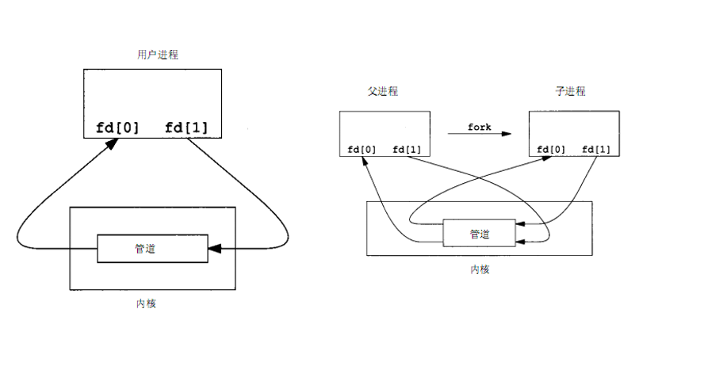

**==你创建的管道，子进程能够看到，其他进程有自己独立的虚拟地址空间，它们又看不到。所以当然是用于有亲缘的进程间通信咯==**/

eg0：same process can also use pipe to comnicate。

```c
int main(int argc, char *argv[])
{
    int pipefd[2];
    if (pipe(pipefd) == -1) 
        ERR_EXIT("pipe error");
    pid_t pid;
    while(1)
    {   
        write(pipefd[1],"hello",5);
        char buf[6]={0};                                                                 
        read(pipefd[0],buf,5);
        printf("%s\n",buf);
    }   
    return 0;
}
```

eg1:

```c
#include <unistd.h>
#include <sys/stat.h>
#include <sys/wait.h>
#include <sys/types.h>
#include <fcntl.h>
int main(int argc, char *argv[])
{
	int pipefd[2];
	if (pipe(pipefd) == -1)
		ERR_EXIT("pipe error");

	pid_t pid;
	pid = fork();
	if (pid == -1)
		ERR_EXIT("fork error");

	if (pid == 0)
	{
		close(pipefd[0]);               //子进程不需要读端
		write(pipefd[1], "hello", 5);   //子进程给父进程发送hello
		close(pipefd[1]);               //发送完毕子进程关闭写端
		exit(EXIT_SUCCESS);             //子进程退出
	}

	close(pipefd[1]);                  //父进程不需要写端
	char buf[10] = {0};
	read(pipefd[0], buf, 10);          //此时read的返回值为5
	printf("buf=%s\n", buf);	
	return 0;
}
```

eg2：ls | wc -l

```c
#include <unistd.h>
#include <sys/stat.h>
#include <sys/wait.h>
#include <sys/types.h>
#include <fcntl.h>
int main(int argc, char *argv[])
{
	int pipefd[2];
	if (pipe(pipefd) == -1)
		ERR_EXIT("pipe error");

	pid_t pid;
	pid = fork();
	if (pid == -1)
		ERR_EXIT("fork error");

	if (pid == 0)  //子进程做ls，然后发送数据
	{
		dup2(pipefd[1], STDOUT_FILENO);//将标准输出定位到管道的写端，而不再是显示器
		close(pipefd[1]);              //管道的写端已经没有作用了(相当于是两个文件描述符都指向管道
                                       //的写端，所以关掉其中一个也无所谓。)
                                      //管道的读端和写端都是不同的文件。pipefd[0]指向读端这个文件
		close(pipefd[0]);              //读端更没用
		execlp("ls", "ls", NULL);      //替换
		fprintf(stderr, "error execute ls\n");  //走到这里必然是失败了
		exit(EXIT_FAILURE);
	}

	dup2(pipefd[0], STDIN_FILENO);  //将标准输入定位到管道的读端，即不再从终端读入了
	close(pipefd[0]);
	close(pipefd[1]);
	execlp("wc", "wc", "-w", NULL);  //以前从终端读，现在从管道读
	fprintf(stderr, "error execute wc\n");
	exit(EXIT_FAILURE);
}
```

eg3：cp

前置知识：

```shell
[root@hadoop100 tuotao]# cat  //单敲一个cat命令的效果
ddd     //输入
ddd     //输出
```

**==复制Makefile的内容到Makefile2==**。

```c
#include <unistd.h>
#include <sys/stat.h>
#include <sys/wait.h>
#include <sys/types.h>
#include <fcntl.h>
int main(int argc, char *argv[])
{
	close(0);  //关闭标准输入
	open("Makefile", O_RDONLY);  //标准输入指向Makefile
	close(1);  //关闭标准输出
	open("Makefile2", O_WRONLY | O_CREAT | O_TRUNC, 0644); //标准输出指向Makefile2
	execlp("cat", "cat", NULL); //从标准输入获取数据写入到标准输出
	return 0;               
}
```

#### 管道的读写规则

```shell
man 7 pipe 可以查到规则
```

当没有数据可读时。

* O_NONBLOCK disable：**==read调用阻塞，即进程暂停执行，一直等到有数据来到为止==**。

* O_NONBLOCK enable：read调用返回-1，errno值为**EAGAIN(资源暂时不可用)**。

**当管道满的时候**。

* O_NONBLOCK disable： **write调用阻塞，直到有进程读走数据**。

* O_NONBLOCK enable：write调用失败返回-1，errno值为EAGAIN。

**如果==所有==管道写端对应的文件描述符被关闭**，则read返回0。

如果**所有**管道读端对应的文件描述符被关闭，则write操作会产生信号**==SIGPIPE==**并且write返回-1。**==该信号的默认动作是终止进程==**。

当要写入的数据量不大于PIPE_BUF时，linux将保证写入的原子性。

**当要写入的数据量大于PIPE_BUF时，linux将不再保证写入的原子性**。多个进程同时往管道写端写入数据时，**下面的例子是两个子进程同时写的同时，父进程同时接收**。

eg1：观察阻塞与非阻塞

```c
int main(int argc, char *argv[])
{
	int pipefd[2];
	if (pipe(pipefd) == -1)
		ERR_EXIT("pipe error");

	pid_t pid;
	pid = fork();
	if (pid == -1)
		ERR_EXIT("fork error");

	if (pid == 0)
	{
		sleep(3);   //达到观察到子进程阻塞的效果
		close(pipefd[0]);
		write(pipefd[1], "hello", 5);
		close(pipefd[1]);
		exit(EXIT_SUCCESS);
	}

	close(pipefd[1]);
	char buf[10] = {0};
	int flags = fcntl(pipefd[0], F_GETFL);
	fcntl(pipefd[0], F_SETFL, flags | O_NONBLOCK); //这是为了观察非阻塞
	int ret = read(pipefd[0], buf, 10);
	if (ret == -1)
		ERR_EXIT("read error");
	printf("buf=%s\n", buf);
	return 0;
}
```

eg2：非阻塞写满

```c
#include <unistd.h>
#include <sys/stat.h>
#include <sys/wait.h>
#include <sys/types.h>
#include <fcntl.h>

#include <stdlib.h>
#include <stdio.h>
#include <errno.h>
#include <string.h>
#include <signal.h>
#include <sys/time.h>


#define ERR_EXIT(m) \
	do \
	{ \
		perror(m); \       
		exit(EXIT_FAILURE); \
	} while(0)

int main(int argc, char *argv[])
{
	int pipefd[2];
	if (pipe(pipefd) == -1)
		ERR_EXIT("pipe error");

	int ret;
	int count = 0;
	int flags = fcntl(pipefd[1], F_GETFL);
	fcntl(pipefd[1], F_SETFL, flags | O_NONBLOCK);
	while (1)
	{
		ret = write(pipefd[1], "A", 1); //管道满返回-1且errno=EAGAIN
		if (ret == -1)  //此时发生错误了
		{
			printf("err=%s\n", strerror(errno));  //传递错误号，翻译出字符串形式的错误
			break;
		}
		count++;
	}
	printf("count=%d\n", count);
	return 0;
}
```

eg3：超过PIPE_BUF时的情况。

```c
#include <stdio.h>
#include <stdlib.h>
#include <string.h>
#include <unistd.h>
#include <sys/types.h>
#include <errno.h>
#include <fcntl.h>


#define ERR_EXIT(m) \
        do \
        { \
                perror(m); \
                exit(EXIT_FAILURE); \
        } while(0)

#define TEST_SIZE 68*1024  //68kB

int main(void)
{
	char a[TEST_SIZE];
	char b[TEST_SIZE];

	memset(a, 'A', sizeof(a));
	memset(b, 'B', sizeof(b));

	int pipefd[2];

	int ret = pipe(pipefd);
	if (ret == -1)
		ERR_EXIT("pipe error");

	pid_t pid;
	pid = fork();   
	if (pid == 0)  //子进程1
	{
		close(pipefd[0]);
		ret = write(pipefd[1], a, sizeof(a));
		printf("apid=%d write %d bytes to pipe\n", getpid(), ret);
		exit(0);
	}

	pid = fork();  //子进程2

	
	if (pid == 0)
	{
		close(pipefd[0]);
		ret = write(pipefd[1], b, sizeof(b));
		printf("bpid=%d write %d bytes to pipe\n", getpid(), ret);
		exit(0);
	}


	close(pipefd[1]);  //关闭所有写的管道了
	
	sleep(1);
	int fd = open("test.txt", O_WRONLY | O_CREAT | O_TRUNC, 0644);
	char buf[1024*4] = {0};  //4kB
	int n = 1;
	while (1)
	{
		ret = read(pipefd[0], buf, sizeof(buf));  //每次读4k
		if (ret == 0) //所有写管道被关闭后，读管道返回0。否则的话，read会阻塞的。
			break;
		printf("n=%02d pid=%d read %d bytes from pipe buf[4095]=%c\n", n++, getpid(), ret, buf[4095]);  //打印出这4k的最后一个字符
		write(fd, buf, ret);  //写入文件
	}
	return 0;	
}
```

运行结果：**==是边写边读的，而且它会写满68kB再退出，而且这不是顺序的，我只是贴了恰好一次顺序运行的结果==**

```c
[root@hadoop100 tuotao]# ./a.out 
n=01 pid=2841 read 4096 bytes from pipe buf[4095]=A
n=02 pid=2841 read 4096 bytes from pipe buf[4095]=A
n=03 pid=2841 read 4096 bytes from pipe buf[4095]=A
n=04 pid=2841 read 4096 bytes from pipe buf[4095]=A
n=05 pid=2841 read 4096 bytes from pipe buf[4095]=A
n=06 pid=2841 read 4096 bytes from pipe buf[4095]=A
n=07 pid=2841 read 4096 bytes from pipe buf[4095]=A
n=08 pid=2841 read 4096 bytes from pipe buf[4095]=A
n=09 pid=2841 read 4096 bytes from pipe buf[4095]=A
n=10 pid=2841 read 4096 bytes from pipe buf[4095]=A
n=11 pid=2841 read 4096 bytes from pipe buf[4095]=A
n=12 pid=2841 read 4096 bytes from pipe buf[4095]=A
n=13 pid=2841 read 4096 bytes from pipe buf[4095]=A
n=14 pid=2841 read 4096 bytes from pipe buf[4095]=A
n=15 pid=2841 read 4096 bytes from pipe buf[4095]=A
n=16 pid=2841 read 4096 bytes from pipe buf[4095]=A
apid=2842 write 69632 bytes to pipe  //写完了68kB
n=17 pid=2841 read 4096 bytes from pipe buf[4095]=A
n=18 pid=2841 read 4096 bytes from pipe buf[4095]=B
n=19 pid=2841 read 4096 bytes from pipe buf[4095]=B
n=20 pid=2841 read 4096 bytes from pipe buf[4095]=B
n=21 pid=2841 read 4096 bytes from pipe buf[4095]=B
n=22 pid=2841 read 4096 bytes from pipe buf[4095]=B
n=23 pid=2841 read 4096 bytes from pipe buf[4095]=B
n=24 pid=2841 read 4096 bytes from pipe buf[4095]=B
n=25 pid=2841 read 4096 bytes from pipe buf[4095]=B
n=26 pid=2841 read 4096 bytes from pipe buf[4095]=B
n=27 pid=2841 read 4096 bytes from pipe buf[4095]=B
n=28 pid=2841 read 4096 bytes from pipe buf[4095]=B
n=29 pid=2841 read 4096 bytes from pipe buf[4095]=B
n=30 pid=2841 read 4096 bytes from pipe buf[4095]=B
n=31 pid=2841 read 4096 bytes from pipe buf[4095]=B
n=32 pid=2841 read 4096 bytes from pipe buf[4095]=B
n=33 pid=2841 read 4096 bytes from pipe buf[4095]=B
bpid=2843 write 69632 bytes to pipe  //写完了68kB
n=34 pid=2841 read 4096 bytes from pipe buf[4095]=B
```

#### 命名管道（FIFO）

管道应用的一个限制就是只能在具有**共同祖先**（具有亲缘关系）的进程间通信。

如果我们想在不相关的进程之间交换数据，可以使用FIFO文件来做这项工作，它经常被称为命名管道。

命名管道是一种特殊类型的文件。


命名管道可以从命令行上创建，命令行方法是使用下面这个命令：

```shell
$ mkfifo filename
```

命名管道也可以从程序里创建，相关函数有：

```c
int mkfifo(const char *filename,mode_t mode);
```


匿名管道由pipe函数创建并打开。

命名管道由mkfifo函数创建，打开用open

FIFO（命名管道）与pipe（匿名管道）**==之间唯一的区别在它们创建与打开的方式不同==**，一量这些工作完成之后，它们具有相同的语义。

**命名管道的打开规则:**

如果当前打开操作是为读而打开FIFO时:

* O_NONBLOCK disable：阻塞直到有相应进程为写而打开该FIFO
* O_NONBLOCK enable：立刻返回成功

如果当前打开操作是为写而打开FIFO时

* O_NONBLOCK disable：阻塞直到有相应进程为读而打开该FIFO
* O_NONBLOCK enable：立刻返回失败，错误码为ENXIO

### 共享内存

#### 简介

本章目标：

共享内存

共享内存示意图

管道、消息队列与共享内存传递数据对比

mmap函数

munmap函数

msync函数


共享内存区**是最快的IPC形式**。一旦这样的内存映射到共享它的进程的地址空间，这些进程间数据传递不再涉及到内核，换句话说是进程不再通过执行进入内核的系统调用来传递彼此的数据。

共享内存示意图：

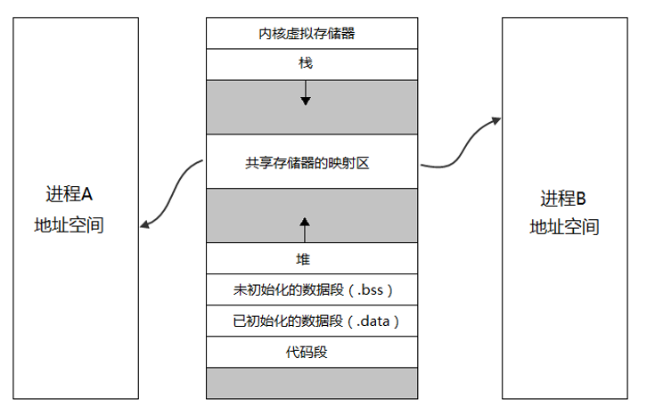

用管道或者消息队列传递数据：

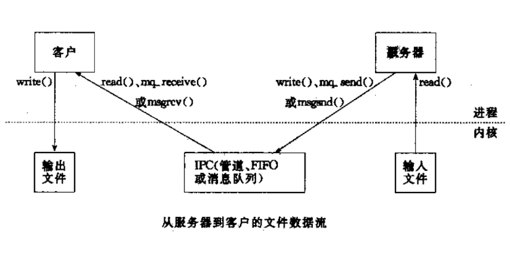

用共享内存传递数据：

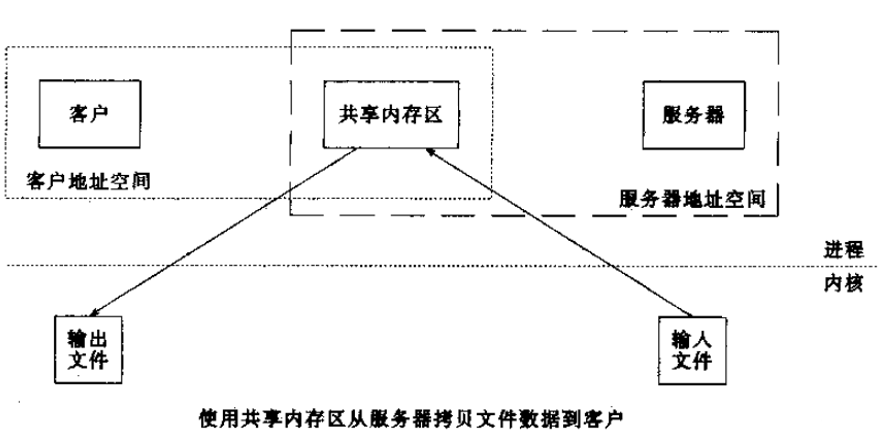


mmap函数：

功能：将文件或者设备空间映射到共享内存区。

原型void *mmap(void *addr, size_t len, int prot, int flags, int fd, off_t offset);

参数

addr: **==要映射的起始地址，通常指定为NULL，让内核自动选择==**

len:映射到进程地址空间的字节数

prot:映射区保护方式

flags:标志

fd:文件描述符

offset:从文件头开始的偏移量

返回值：成功返回映射到的内存区的起始地址；失败返回-1

| **prot**       | **说明**     |
| -------------- | ------------ |
| **PROT_READ**  | 页面可读     |
| **PROT_WRITE** | 页面可写     |
| PROC_EXEC      | 页面可执行   |
| PROT_NONE      | 页面不可访问 |

| **flags**     | **说明**                                                     |
| ------------- | ------------------------------------------------------------ |
| MAP_SHARED    | 变动是共享的(变动会写入文件，其他进程也会看到这个变动)       |
| MAP_PRIVATE   | 变动是私有的(变动不会写入文件)                               |
| MAP_FIXED     | 准确解释addr参数(自己指定addr时，自动对齐内存页)             |
| MAP_ANONYMOUS | 建立匿名映射区，不涉及文件(那就只能在具有亲缘关系的进程间共享内存了) |

**因为亲缘关系的进程可以共享这一块内存区**。


内存映射文件示意图：

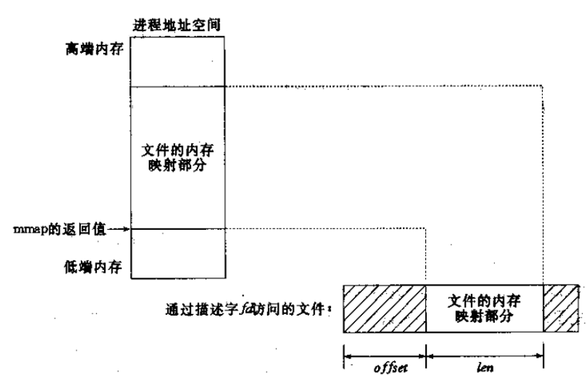

**==因为内存是以页为单位来进行操作，所以如果len不足一个页，那么文件的内存映射部分长度一定大于len==**。

> 假如你指定了80个字节，那么内存映射部分长度一般是4k。

munmap函数：

功能：取消mmap函数建立的映射

原型int munmap(void *addr, size_t len);

参数addr: 映射的内存起始地址

len:映射到进程地址空间的字节数

返回值：成功返回0；失败返回-1


msync函数：内核也会选择一个合适的时机将高速缓冲区的内容刷新到磁盘中，这个函数可以立即执行这个操作.

功能：对映射的共享内存执行同步操作

原型int msync(void *addr, size_t len, int flags);

参数

addr: 内存起始地址

len:长度flags:选项

返回值：成功返回0；失败返回-1

| **flags**     | **说明**                   |
| ------------- | -------------------------- |
| MS_ASYNC      | 执行异步写                 |
| MS_SYNC       | 执行同步写(当前进程会阻塞) |
| MS_INVALIDATE | 使高速缓存的数据失效       |


示例：

```c
#include <unistd.h>
#include <sys/types.h>
#include <sys/stat.h>
#include <fcntl.h>
#include <sys/mman.h>

#include <stdlib.h>
#include <stdio.h>
#include <errno.h>
#include <string.h>

#define ERR_EXIT(m) \
        do \
        { \
                perror(m); \
                exit(EXIT_FAILURE); \
        } while(0)


typedef struct stu
{
	char name[4];
	int age;
} STU;

int main(int argc, char *argv[])
{
	if (argc != 2)
	{
		fprintf(stderr, "Usage: %s <file>\n", argv[0]);
		exit(EXIT_FAILURE);
	}

	int fd;
	fd = open(argv[1], O_CREAT | O_RDWR | O_TRUNC, 0666);
	if (fd == -1)
		ERR_EXIT("open");

	lseek(fd, sizeof(STU)*5-1, SEEK_SET); //偏移到索引位置为39
	write(fd, "", 1); // 在第39字节处写入'\0'。总共是40字节
	STU *p;              // 映射大小为40字节                
	p = (STU*)mmap(NULL, sizeof(STU)*5, PROT_READ | PROT_WRITE, MAP_SHARED, fd, 0);
	if (p == NULL)
		ERR_EXIT("mmap");

	char ch = 'a';
	int i;              
	for (i=0; i<5; i++) // 现在对内存的操作就是对文件操作。写入5个学生的信息，刚好是40字节写入文件。
	{
		memcpy((p+i)->name, &ch, 1);  // 占用文件4字节
		(p+i)->age = 20+i;            // 占用文件4字节
		ch++;
        //p+i就是到了下一个8字节的开始处。
	}

	printf("initialize over\n");
	sleep(10);
	munmap(p, sizeof(STU)*10);
	printf("exit ...\n");

	return 0;
}
```

vim读取肯定是乱码的，这个不必说吧。

```bash
[root@hero IO]# cat test 
abcde[root@hero IO]# vim test 
[root@hero IO]# od -c test 
0000000   a  \0  \0  \0 024  \0  \0  \0   b  \0  \0  \0 025  \0  \0  \0
0000020   c  \0  \0  \0 026  \0  \0  \0   d  \0  \0  \0 027  \0  \0  \0
0000040   e  \0  \0  \0 030  \0  \0  \0
0000050
```

上面那些数字是8进制。a  \0  \0  \0 024共占据8字节，没有问题。


```c
#include <unistd.h>
#include <sys/types.h>
#include <sys/stat.h>
#include <fcntl.h>
#include <sys/mman.h>

#include <stdlib.h>
#include <stdio.h>
#include <errno.h>
#include <string.h>

#define ERR_EXIT(m) \
        do \
        { \
                perror(m); \
                exit(EXIT_FAILURE); \
        } while(0)


typedef struct stu
{
	char name[4];
	int age;
} STU;

int main(int argc, char *argv[])
{
	if (argc != 2)
	{
		fprintf(stderr, "Usage: %s <file>\n", argv[0]);
		exit(EXIT_FAILURE);
	}

	int fd;
	fd = open(argv[1], O_RDWR);
	if (fd == -1)
		ERR_EXIT("open");

	STU *p;              // 实际上可以用4k内存。
	p = (STU*)mmap(NULL, sizeof(STU)*5, PROT_READ | PROT_WRITE, MAP_SHARED, fd, 0);
	if (p == NULL)
		ERR_EXIT("mmap");

	int i;
	for (i=0; i<10; i++) // 我们就是在操作文件了！！！ 原始是5次循环。
	{
		printf("name = %s age = %d\n", (p+i)->name, (p+i)->age);
	}

	munmap(p, sizeof(STU)*5); 
	printf("exit ...\n");

	return 0;
}
```

运行结果：读取没有问题。

```bash
[root@hero IO]# ./tt test 
name = a age = 20
name = b age = 21
name = c age = 22
name = d age = 23
name = e age = 24
```

mmap注意点：

* 映射不能改变文件的大小。

  意思是原始文件40字节，但是我映射了80字节，即使你往内存中写80字节的数据，在文件中也只会成功写入前40字节。

  ```c
  int main(int argc, char *argv[])
  {
      //你映射了80字节(可以操作这么大的内存)，但是最终能写入磁盘的也至于文件大小的40字节
  	p = (STU*)mmap(NULL, sizeof(STU)*10, PROT_READ | PROT_WRITE, MAP_SHARED, fd, 0);
  }
  ```

* **可用于进程间通信的有效地址空间不完全受限于被映射文件的大小**

  虽然你只映射了40字节，但是操作系统以页为单位操作内存，所以一般给了你4k。所以实际上在内存中，你可以操作4k大小的内存。如果我们超过了4k，那么可能会产生信号SIGBUS。超过更多可能会段错误，SIGSEGV。

  ```c
  int main(int argc, char *argv[])
  {
  	lseek(fd, sizeof(STU)*5-1, SEEK_SET); 
  	write(fd, "", 1); 
  	STU *p;                        
  	p = (STU*)mmap(NULL, sizeof(STU)*5, PROT_READ | PROT_WRITE, MAP_SHARED, fd, 0);
  	if (p == NULL)
  		ERR_EXIT("mmap");
  
  	char ch = 'a';
  	int i;              
  	for (i=0; i<10; i++) // 虽然只映射了40字节，但是你也可以操作80字节(一般共4k)
  	{
  		memcpy((p+i)->name, &ch, 1);  // 占用文件4字节
  		(p+i)->age = 20+i;            // 占用文件4字节
  		ch++;
  	}
  
  	printf("initialize over\n");
  	sleep(10);  // 不睡的话另外一个进行读不到高速缓冲区中的后80字节
  	munmap(p, sizeof(STU)*5);
  	printf("exit ...\n");
  
  	return 0;
  }
  ```

* 文件一旦被映射后，所有对映射区域的访问实际上是对内存区域的访问。映射区域内容写回文件时，所写内容不能超过文件的大小。

  > **==通过一些内存读写操作函数就可以操作文件了==**。

### systemV共享内存


### systemV消息队列

本章目标：

消息队列

IPC对象数据结构

消息队列结构

消息队列在内核中的表示

消息队列函数

#### 消息队列简介

消息队列提供了一个从一个进程向另外一个进程发送一块数据的方法

**注：管道也可以做到，但是管道是基于字节流的，数据与数据之间是没有边界的，所以通常将管道称作是流管道。另外，管道接收数据的消息一定是先进先出，而消息队列可以是无序的**。

每个数据块都被认为是有一个类型(称作消息，是有边界的)，接收者进程接收的数据块可以有不同的类型值

消息队列也有管道一样的不足，**就是每个消息的最大长度是有上限的（MSGMAX），每个消息队列的总的字节数是有上限的（MSGMNB），系统上消息队列的总个 数也有一个上限（MSGMNI）**

```shell
[root@hadoop100 ~]# cat /proc/sys/kernel/msgm
msgmax  msgmnb  msgmni  
[root@hadoop100 ~]# cat /proc/sys/kernel/msgmax
8192
```


内核为每个IPC对象维护一个数据结构：

```c
struct ipc_perm {
	key_t          __key;       /* Key supplied to xxxget(2) */
	uid_t          uid;         /* Effective UID of owner */
	gid_t          gid;         /* Effective GID of owner */
	uid_t          cuid;        /* Effective UID of creator */
	gid_t          cgid;        /* Effective GID of creator */
	unsigned short mode;        /* Permissions */
	unsigned short __seq;       /* Sequence number */
};
```

消息队列结构：

```c
struct msqid_ds {
	struct ipc_perm msg_perm;     /* Ownership and permissions */
	time_t	     msg_stime;    /* Time of last msgsnd(2) */
 	time_t	     msg_rtime;    /* Time of last msgrcv(2) */
	time_t	     msg_ctime;    /* Time of last change */
	unsigned long    __msg_cbytes; /* Current number of bytes in
						queue (nonstandard) */
	msgqnum_t	     msg_qnum;     /* Current number of messages
			                                                in queue */
	msglen_t	     msg_qbytes;   /* Maximum number of bytes
                                                allowed in queue */
	pid_t	                  msg_lspid;      /* PID of last msgsnd(2) */
	pid_t                  msg_lrpid;      /* PID of last msgrcv(2) */
};
```

消息队列在内核中的表示：

### posix消息队列

```c
System V IPC
消息队列
共享内存
信号量
POSIX IPC
消息队列
共享内存
    信号量
    互斥锁
    条件变量
    读写锁
文件锁

```


systemctl stop NetworkManager
systemctl restart network.service

#### mq_open函数

功能：用来创建和访问一个消息队列

原型

```c
mqd_t mq_open(const char *name, int oflag); //两个参数的只能打开。而不能创建消息队列
mqd_t mq_open(const char *name, int oflag, mode_t mode, struct mq_attr *attr);
```
参数

* name: 某个消息队列的名字
* oflag:与open函数类似，可以是O_RDONLY、O_WRONLY、O_RDWR，还可以按位或上O_CREAT、O_EXCL、O_NONBLOCK等。
* mode:如果oflag指定了O_CREAT，需要设置mode。

返回值：成功返回消息队列文件描述符；失败返回-1


```c
#include <unistd.h>
#include <sys/types.h>
#include <fcntl.h>           /* For O_* constants */
#include <sys/stat.h>        /* For mode constants */
#include <mqueue.h>
#include <fcntl.h>           /* For O_* constants */
#include <sys/stat.h>        /* For mode constants */
#include <mqueue.h>

#include <stdlib.h>
#include <stdio.h>
#include <errno.h>

#define ERR_EXIT(m) \
        do \
        { \
                perror(m); \
                exit(EXIT_FAILURE); \
        } while(0)


int main(void)
{
	mqd_t mqid;
	mqid = mq_open("/abc", O_CREAT | O_RDWR, 0666, NULL); //NULL表示默认属性

	if (mqid == (mqd_t)-1)  //mqdT有可能是整型或指针，需要看系统，所以最好做转换
		ERR_EXIT("mq_open");	
	printf("mq_open succ\n");
	mq_close(mqid);
	return 0;
}
```

```shell
[root@hadoop100 posixipc]# gcc mq_open.c -o mq_open -lrt
[root@hadoop100 posixipc]# ./mq_open 
mq_open succ

```

我们如何找到创建的消息队列在哪里呢？这个不能用ipcs来进行查看。

```shell
[root@hadoop100 posixipc]# man 7 mq_overview
Mounting the message queue file system
       On  Linux,  message  queues  are created in a virtual file system.  (Other implementations may also provide such a
       feature, but the details are likely to differ.)  This file system can be mounted (by the superuser) using the fol‐
       lowing commands:

           # mkdir /dev/mqueue
           # mount -t mqueue none /dev/mqueue

       The sticky bit is automatically enabled on the mount directory.

       After  the  file system has been mounted, the message queues on the system can be viewed and manipulated using the
       commands usually used for files (e.g., ls(1) and rm(1)).

       The contents of each file in the directory consist of a single line containing information about the queue:

           $ cat /dev/mqueue/mymq
           QSIZE:129     NOTIFY:2    SIGNO:0    NOTIFY_PID:8260

       These fields are as follows:

       QSIZE  Number of bytes of data in all messages in the queue.
NOTIFY_PID
              If this is nonzero, then the process with this PID has used mq_notify(3) to register for asynchronous  mes‐
              sage notification, and the remaining fields describe how notification occurs.

       NOTIFY Notification method: 0 is SIGEV_SIGNAL; 1 is SIGEV_NONE; and 2 is SIGEV_THREAD.

       SIGNO  Signal number to be used for SIGEV_SIGNAL.

   Polling message queue descriptors
       On Linux, a message queue descriptor is actually a file descriptor, and can be monitored using select(2), poll(2),
       or epoll(7).  This is not portable.

[root@hadoop100 mqueue]# cat abc 
QSIZE:0          NOTIFY:0     SIGNO:0     NOTIFY_PID:0 
大小              通知方式，信号or线程 信号的编号  通知哪一个进程
```

#### POSIX IPC名字限定

**必须以/打头，并且后续不能有其它/ ，形如/somename。**

**长度不能超过NAME_MAX。**

#### mq_close函数

```c
功能：关闭消息队列
原型
mqd_t mq_close(mqd_t mqdes);
参数
mqdes : 消息队列描述符
返回值：成功返回0；失败返回-1
```

关闭消息队列不代表删除消息队列，就像关闭文件不代表删除文件。仅仅是说不能再用该fd来访问该文件(消息队列也是虚拟文件系统中的一个文件)了。

如果你忘记关闭，程序结束时也会自动关闭。

#### mq_unlink函数

```c
功能：删除消息队列
原型
mqd_t mq_unlink(const char *name);  //unlink删除文件。
参数
name: 消息队列的名字
返回值：成功返回0；失败返回-1
```

实际上是删除链接数，直到链接数为0才真正的将文件删除。

```shell
[root@hadoop100 mqueue]# ls
abc
[root@hadoop100 mqueue]# ll
总用量 0
-rw-r--r--. 1 root root 80 9月   3 13:54 abc  //链接数为1
```

例子：

```c
int main(void)
{
	mq_unlink("/abc");
	return 0;
}
```

**==POSIX消息队列是随内核持续的，你可以关闭的是访问它的文件描述符。但是如果你没有手动删除的话，它是不会被删除的，即使进程结束了对它的访问。这就是文件的特性啊==**。

#### mq_getattr/mq_setattr

```c
功能：获取/设置消息队列属性
原型
mqd_t mq_getattr(mqd_t mqdes, struct mq_attr *attr);

//传递新的，返回旧的
mqd_t mq_setattr(mqd_t mqdes, struct mq_attr *newattr, struct mq_attr *oldattr);
返回值：成功返回0；失败返回-1
```

mq_attr结构体：

```c
struct mq_attr {
	long mq_flags;	/* Flags: 0 or O_NONBLOCK */
	long mq_maxmsg;	/* Max. # of messages on queue */
	long mq_msgsize;	/* Max. message size (bytes) */
	long mq_curmsgs;	/* # of messages currently in queue */
};
```

例子：

```c
int main(void)
{
	mqd_t mqid;
	mqid = mq_open("/abc", O_RDONLY);
	if (mqid == (mqd_t)-1)
		ERR_EXIT("mq_open");	

	printf("mq_open succ\n");
	struct mq_attr attr;
	mq_getattr(mqid, &attr);
	printf("max #msg=%ld max #bytes/msg=%ld #currently on queue=%ld\n", 
           attr.mq_maxmsg,   //该队列最大消息数量(就是队列容量)
           attr.mq_msgsize,  //每条消息的最大大小(就是元素最大是多大)
           attr.mq_curmsgs); //当前消息数(元素数量)

	mq_close(mqid);
	return 0;
}
```

运行结果：

```shell
[root@hadoop100 posixipc]# ./a.out 
mq_open succ
max #msg=10 max #bytes/msg=8192 #currently on queue=0
```

#### mq_send函数

功能：发送消息
原型

* mqd_t mq_send(mqd_t mqdes, const char *msg_ptr, size_t msg_len, unsigned msg_prio);

参数

* mqdes:消息队列描述符
* msg_ptr:指向消息的指针(就是消息内容)
* msg_len:消息长度
* msg_prio:消息优先级(一个大于等于0的数)

返回值：成功返回0；失败返回-1


例子：

```c
#include <unistd.h>
#include <sys/types.h>
#include <fcntl.h>           /* For O_* constants */
#include <sys/stat.h>        /* For mode constants */
#include <mqueue.h>
#include <fcntl.h>           /* For O_* constants */
#include <sys/stat.h>        /* For mode constants */
#include <mqueue.h>

#include <stdlib.h>
#include <stdio.h>
#include <errno.h>
#include <string.h>

#define ERR_EXIT(m) \
        do \
        { \
                perror(m); \
                exit(EXIT_FAILURE); \
        } while(0)

typedef struct stu
{
	char name[32];
	int age;
} STU;

int main(int argc, char *argv[])
{
	if (argc != 2)
	{
		fprintf(stderr, "Usage: %s <prio>\n", argv[0]);
		exit(EXIT_FAILURE);
	}

	mqd_t mqid;
	mqid = mq_open("/abc", O_WRONLY);
	if (mqid == (mqd_t)-1)
		ERR_EXIT("mq_open");	

	STU stu;
	strcpy(stu.name, "test");
	stu.age = 20;

	unsigned prio = atoi(argv[1]);
	mq_send(mqid, (const char*)&stu, sizeof(stu), prio);
	mq_close(mqid);
	return 0;
}
```

运行结果：

```shell
[root@hadoop100 posixipc]# ./send 0
[root@hadoop100 mqueue]# cat abc 
QSIZE:84         NOTIFY:0     SIGNO:0     NOTIFY_PID:0  
[root@hadoop100 posixipc]# ./mq_getattr 
mq_open succ
max #msg=10 max #bytes/msg=8192 #currently on queue=1
```

#### mq_receive函数

功能：接收消息
原型

* ssize_t mq_receive(mqd_t mqdes, char *msg_ptr, size_t msg_len, unsigned *msg_prio);
  参数

* mqdes:消息队列描述符
* msg_ptr:返回接收到的消息
* msg_len:消息长度
* msg_prio:返回接收到的消息优先级

返回值：成功返回接收到的消息字节数；失败返回-1
注意：返回指定消息队列中**最高优先级的==最早==消息**


```c
#include <unistd.h>
#include <sys/types.h>
#include <fcntl.h>           /* For O_* constants */
#include <sys/stat.h>        /* For mode constants */
#include <mqueue.h>
#include <fcntl.h>           /* For O_* constants */
#include <sys/stat.h>        /* For mode constants */
#include <mqueue.h>

#include <stdlib.h>
#include <stdio.h>
#include <errno.h>
#include <string.h>

#define ERR_EXIT(m) \
        do \
        { \
                perror(m); \
                exit(EXIT_FAILURE); \
        } while(0)

typedef struct stu
{
	char name[32];
	int age;
} STU;

int main(int argc, char *argv[])
{
	mqd_t mqid;
	mqid = mq_open("/abc", O_RDONLY);
	if (mqid == (mqd_t)-1)
		ERR_EXIT("mq_open");	


	struct mq_attr attr;
        mq_getattr(mqid, &attr);
	size_t size = attr.mq_msgsize;  //必须是这个值，而不能是sizeof(STU)
	STU stu;

	unsigned prio;
	if (mq_receive(mqid, (char*)&stu, size, &prio) == (mqd_t)-1)
		ERR_EXIT("mq_receive");

	printf("name=%s age=%d prio=%u\n", stu.name, stu.age, prio);
	mq_close(mqid);
	return 0;
}
```

运行结果：**==没有消息会阻塞==**。

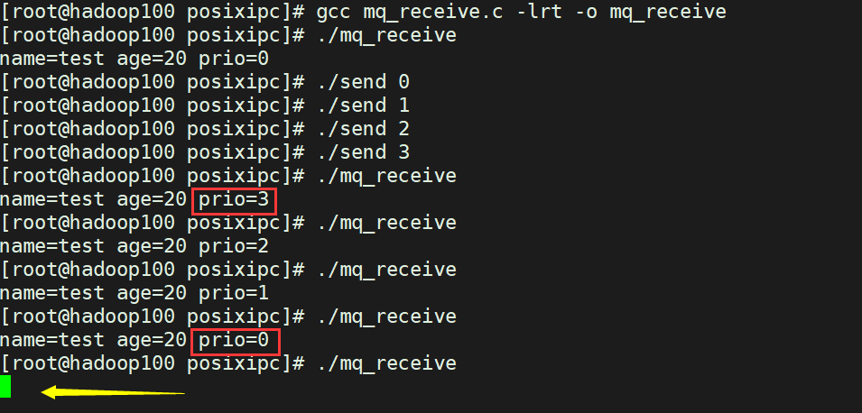


#### mq_notify函数

**==systemV不具有这种通知功能==**。

功能：建立或者删除消息到达通知事件
原型

* mqd_t mq_notify(mqd_t mqdes, const struct sigevent *notification);

参数

* mqdes:消息队列描述符
* notification：
  * **非空表示当消息到达且消息队列先前为空，那么将得到通知**;
  * **==NULL表示撤消已注册的通知==**

返回值：成功返回0；失败返回-1
通知方式：

* 产生一个信号
* 创建一个线程执行一个指定的函数

```c
nion sigval {          /* Data passed with notification */
	int     sival_int;	/* Integer value */
	void   *sival_ptr;	/* Pointer value */
};

struct sigevent {
	int          	sigev_notify;	/* Notification method */  //线程or信号or不通知
	int          	sigev_signo;	/* Notification signal */
    //如果是实时信号，可以携带这样一个参数字段
	union sigval	sigev_value;	/* Data passed with notification */
    
	void		(*sigev_notify_function) (union sigval);  //线程回调函数
					/* Function for thread notification */
	void		*sigev_notify_attributes;                 //线程属性
					/* Thread function attributes */
};

SIGEV_NONE
SIGEV_SIGNAL
SIGEV_THREAD
```

例子：

```c
typedef struct stu
{
	char name[32];
	int age;
} STU;

mqd_t mqid;
size_t size;
struct sigevent sigev;

void handle_sigusr1(int sig)
{
	mq_notify(mqid, &sigev);
    STU stu;  //接收消息

    unsigned prio;  //优先级
    if (mq_receive(mqid, (char*)&stu, size, &prio) == (mqd_t)-1)
          ERR_EXIT("mq_receive");
	//如果你在这里注册，这时候消息队列为空了，那么一个新的消息到达之后，你得不到通知。消息丢失了。
    //因为你上一次注册的已经失效了
    printf("name=%s age=%d prio=%u\n", stu.name, stu.age, prio);
}

int main(int argc, char *argv[])
{
	mqid = mq_open("/abc", O_RDONLY);
	if (mqid == (mqd_t)-1)
		ERR_EXIT("mq_open");	

	struct mq_attr attr;
        mq_getattr(mqid, &attr);
	size = attr.mq_msgsize;

	signal(SIGUSR1, handle_sigusr1);

	sigev.sigev_notify = SIGEV_SIGNAL;
	sigev.sigev_signo = SIGUSR1;

	mq_notify(mqid, &sigev);
	
	for (;;)
		pause();

	mq_close(mqid);
	return 0;
}
```

mq_notify注意：

**从空到有才会被通知**。

任何时刻只能有一个进程可以被注册为接收某个给定队列的通知。

当有一个消息到达某个先前为空的队列，而且已有一个进程被注册为接收该队列的通知时，只有没有任何线程阻塞在该队列的mq_receive调用的前提下，通知才会发出。(**==这是是说，mq_receive优先级更高，它在接收消息的话，通知不会被发出==**)

**==当通知被发送给它的注册进程时，其注册被撤消==**。**进程必须再次调用mq_notify以重新注册（如果需要的话），重新注册要放在从消息队列读出消息之前而不是之后**。

#### 自旋锁

自旋锁类似于互斥锁，它的性能比互斥锁更高。

自旋锁与互斥锁很重要的一个区别在于，线程在申请自旋锁的时候，线程不会被挂起，它处于忙等待的状态。

自旋锁适用于实时性高(等待时间短)的场景。使用方法与互斥锁差别不大。

**==自旋--->不断等待==**。

```c
pthread_spin_init
pthread_spin_destroy
pthread_spin_lock
pthread_spin_unlock
```

#### 读写锁

**只要没有线程持有给定的读写锁用于写，那么任意数目的线程可以持有读写锁用于读(没有写锁，可以施加任意多的读锁)**

**仅当没有线程持有某个给定的读写锁用于读或用于写时，才能分配读写锁用于写(有了读锁或写锁，不能再加写锁)**

**==读写锁用于读称为共享锁，读写锁用于写称为排它锁==**


```c
pthread_rwlock_init
pthread_rwlock_destroy
int pthread_rwlock_rdlock
int pthread_rwlock_wrlock
int pthread_rwlock_unlock
```

### POSIX共享内存


## 线程

### 线程介绍

本章目标：

什么是线程

进程与线程

线程优缺点

线程模型

* N:1用户线程模型

* 1:1核心线程模型

* N:M混合线程模型

在一个程序里的一个执行路线就叫做线程（thread）。更准确的定义是：线程是“一个进程内部的控制序列”

一切进程至少都有一个执行线程。

#### 进程与线程

进程是资源竞争的基本单位

线程是程序执行的最小单位

线程共享进程数据，但也拥有自己的一部分数据

* 线程ID
* 一组寄存器
* 栈
* errno
* 信号状态
* 优先级

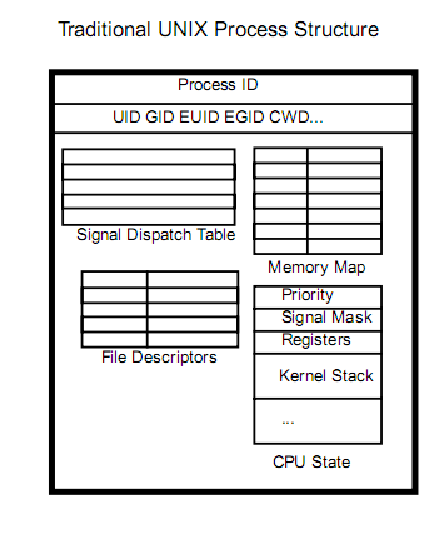

CPU State的数量与线程数相等。其余的都是共享的。

#### fork和创建新线程的区别

当一个进程执行一个fork调用的时候，会创建出进程的一个新拷贝，新进程将拥有它自己的变量和它自己的PID。这个新进程的运行时间是独立的，它在执行时几乎完全独立于创建它的进程

在进程里面创建一个新线程的时候，新的执行线程会拥有自己的堆栈（因此也就有自己的局部变量），**但要与它的创建者共享全局变量、文件描述符、信号处理器和==当前的工作目录状态==。**

#### 线程的优点

创建一个新线程的代价要比创建一个新进程小得多

与进程之间的切换相比，线程之间的切换需要操作系统做的工作要少很多

线程占用的资源要比进程少很多

能充分利用多处理器的可并行数量

在等待慢速I/O操作结束的同时，程序可执行其他的计算任务

计算密集型应用，为了能在多处理器系统上运行，将计算分解到多个线程中实现

I/O密集型应用，为了提高性能，将I/O操作重叠。线程可以同时等待不同的I/O操作。

#### 线程的缺点

性能损失

* 一个很少被外部事件阻塞的计算密集型线程往往无法与共它线程共享同一个处理器。**如果计算密集型线程的数量比可用的处理器多，那么可能会有较大的性能损失，这里的性能损失指的是增加了额外的线程同步和线程调度开销，而可用的资源不变**。

健壮性降低

* 编写多线程需要更全面更深入的考虑，在一个多线程程序里，因时间分配上的细微偏差或者因共享了不该共享的变量而造成不良影响的可能性是很大的，换句话说线程之间是缺乏保护的。

缺乏访问控制

* 进程是访问控制的基本粒度，在一个线程中调用某些OS函数会对整个进程造成影响。

编程难度提高

* 编写与调试一个多线程程序比单线程程序困难得多

#### 线程调度竞争范围

操作系统提供了各种模型，用来调度应用程序创建的线程。这些模型之间的主要不同是：在竞争系统资源（特别是CPU时间）时，线程调度竞争范围(thread-scheduling contention scope）不一样

进程竞争范围（process contention scope）：各个线程在同一进程竞争“被调度的CPU时间”（但不直接和其他进程中的线程竞争）。

系统竞争范围（system contention scope）：线程直接和“系统范围”内的其他线程竞争。

竞争范围的不同导致了线程模型的不同。

#### 线程模型

##### N:1用户线程模型

线程实现”建立在“进程控制”机制之上，由用户空间的程序库来管理。**OS内核完全不知道线程信息。这些线程称为用户空间线程**。

这些线程都工作在“进程竞争范围”

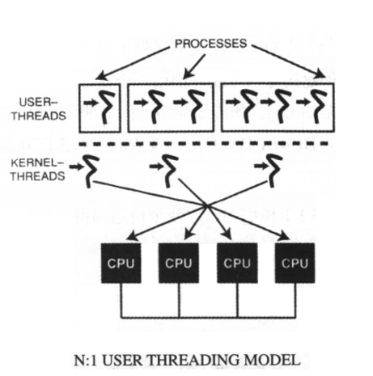

> 这起源于早期系统不支持多线程的时候。将进程看作是线程，KERNEL THREADS实际上就是进程。

在N:1线程模型中，内核不干涉线程的任何生命活动，也不干涉同一进程中的线程环境切换。

在N:1线程模型中，一个进程中的多个线程只能调度到一个CPU，这种约束限制了可用的并行总量。

第二个缺点是**==如果某个线程执行了一个“阻塞式”操作（如read），那么，进程中的所有线程都会阻塞，直至那个操作结束==**。为此，一些线程的实现是为这些阻塞式函数提供包装器，用非阻塞版本替换这些系统调用，以消除这种限制。(这种做法一般不具有可移植性)

##### 1:1核心线程模型

在1:1核心线程模型中，**应用程序创建的每一个线程都由一个核心线程直接管理**。

OS内核将每一个核心线程都调到系统CPU上，因此，所有线程都工作在“系统竞争范围”。

这种线程的创建与调度由内核完成，因为这种线程的系统开销比较大（但一般来说，比进程开销小）

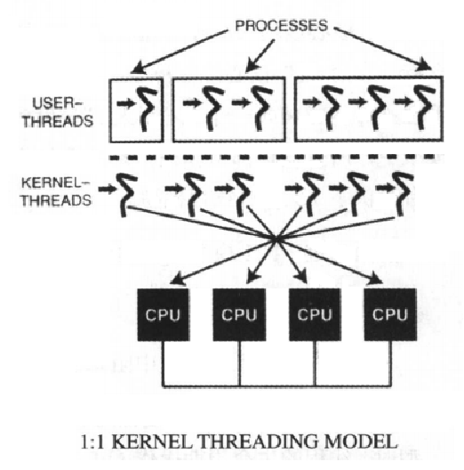

##### N:M混合线程模型

N:M混合线程模型提供了**==两级控制，将用户线程映射为系统的可调度体以实现并行==**，**这个可调度体称为轻量级进程(比核心线程的调度代价更小)**（LWP:lightweight process），**LWP再一一映射到核心线程**。

> 这也是posix线程的实现方式。

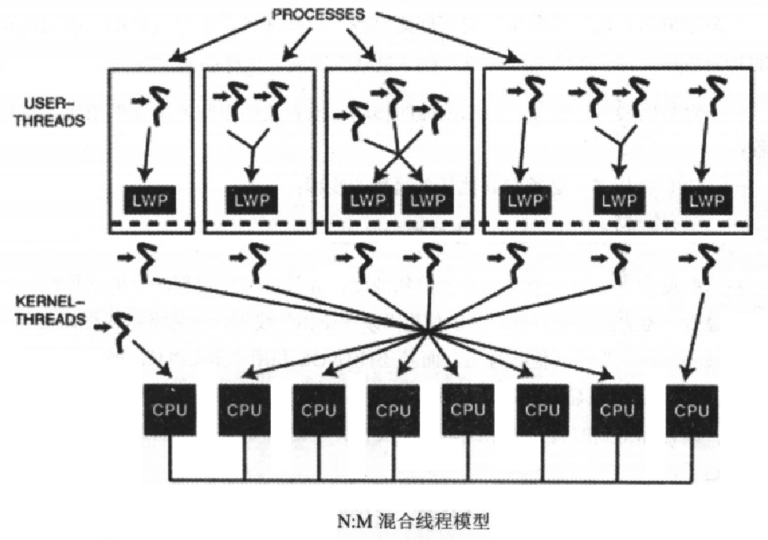

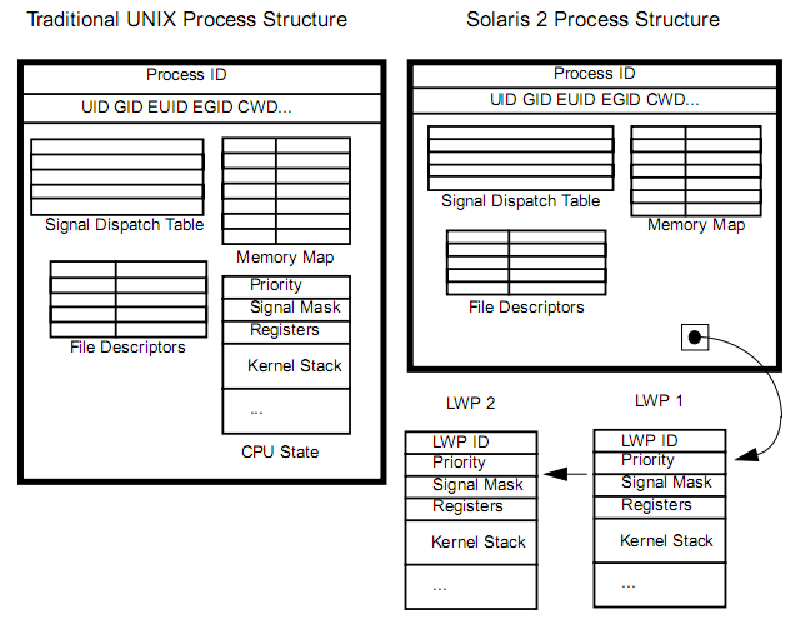

### POSIX线程（一）

本章目标

POSIX线程库相关函数

用线程实现回射客户/服务器

#### POSIX线程库

与线程有关的函数构成了一个完整的系列，绝大多数函数的名字都是以“pthread_”打头的

要使用这些函数库，要通过引入头文<pthread.h>

链接这些线程函数库时要使用编译器命令的“**-lpthread**”选项

#### pthread_create函数

功能：创建一个新的线程

原型

* int pthread_create(pthread_t *thread, const pthread_attr_t *attr, void *(*start_routine)(void*), void *arg);

参数

* thread:返回线程ID
* attr:设置线程的属性，attr为NULL表示使用默认属性
* start_routine:是个函数地址，线程启动后要执行的函数
* arg:传给线程启动函数的参数

返回值：**==成功返回0；失败返回错误码==**，注意不是返回-1。


我们讨论一下为什么arg能够传递到线程启动后要执行的函数start_routine内部。

```c
int pthread_create(pthread_t *thread, const pthread_attr_t *attr, void *(*start_routine)(void*), void *arg)
{
    void *(*func)(void*)=start_routine;
    void* p=func(arg);  
}
```

这么简单的事情，你在纠结什么？


**错误检查**

传统的一些函数是，成功返回0，失败返回-1，并且对全局变量errno赋值以指示错误。

pthreads函数出错时不会设置全局变量errno（而大部分其他POSIX函数会这样做），**==而是将错误代码通过返回值返回==**。

**==pthreads同样也提供了线程内的errno变量(每个线程都有)，以支持其它使用errno的代码。对于pthreads函数的错误，建议通过返回值来判定，因为读取返回值要比读取线程内的errno变量的开销更小。==**

#### pthread_exit函数

功能：线程终止

原型

* void pthread_exit(void *value_ptr);

参数

* value_ptr：**value_ptr不要指向一个局部变量**。

返回值：无返回值，跟进程一样，线程结束的时候无法返回到它的调用者（自身）（它都结束了你怎么返回给它自己）这个函数总是被成功调用。

#### pthread_join函数

功能：等待线程结束

原型

* int pthread_join(pthread_t thread, void **value_ptr);

参数

* thread:线程ID
* value_ptr:**它指向一个指针，可以接收线程函数的返回值，也可以配合pthread_exit函数使用，接收线程要传出的信息**

返回值：成功返回0；**==失败返回错误码==**

#### pthread_self函数

功能：返回线程ID

原型

* pthread_t pthread_self(void);

返回值：成功返回0

#### pthread_cancel函数

功能：取消一个执行中的线程(由别的线程来执行)

原型

* int pthread_cancel(pthread_t thread);

参数

* thread:线程ID

返回值：成功返回0；失败返回错误码

#### pthread_detach函数

```c
功能：将一个线程分离
原型
int pthread_detach(pthread_t thread);
参数
thread:线程ID
返回值：成功返回0；失败返回错误码
```

#### 进程线程对比

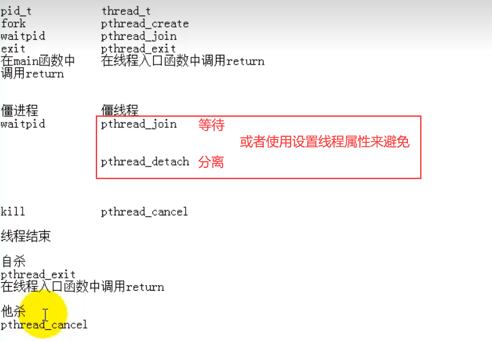

#### 例子1

```c
#include <unistd.h>
#include <sys/types.h>
#include <pthread.h>

#include <stdlib.h>
#include <stdio.h>
#include <errno.h>
#include <string.h>

#define ERR_EXIT(m) \
        do \
        { \
                perror(m); \
                exit(EXIT_FAILURE); \
        } while(0)

void* thread_routine(void *arg)
{
	    int i;
        for (i=0; i<20; i++)
        {
                printf("B");
                fflush(stdout);
		        usleep(20);
/*
		if (i==3)
			pthread_exit("ABC");
*/
        }
	sleep(3);
	return "DEF";  // 等价pthread_exit("DEF")
}

int main(void)
{
	pthread_t tid;
	int ret;
	if ((ret = pthread_create(&tid, NULL, thread_routine, NULL)) != 0)
	{
		fprintf(stderr, "pthread_create:%s\n", strerror(ret));
		exit(EXIT_FAILURE);
	}

	int i;
	for (i=0; i<20; i++)
	{
		printf("A");
		fflush(stdout);
		usleep(20);
	}

	void *value;
	if ((ret = pthread_join(tid, &value)) != 0)
	{
		fprintf(stderr, "pthread_join:%s\n", strerror(ret));
		exit(EXIT_FAILURE);
	}
	printf("\n");
	printf("return msg=%s\n", (char*)value);  //我们是能够接收到那个DEF的
	return 0;
}

```


#### 使用线程实现服务器

```c
#include <unistd.h>
#include <sys/types.h>
#include <sys/socket.h>
#include <netinet/in.h>
#include <arpa/inet.h>
#include <pthread.h>

#include <stdlib.h>
#include <stdio.h>
#include <errno.h>
#include <string.h>

#define ERR_EXIT(m) \
        do \
        { \
                perror(m); \
                exit(EXIT_FAILURE); \
        } while(0)

void echo_srv(int conn)
{
		char recvbuf[1024];
        while (1)
        {
                memset(recvbuf, 0, sizeof(recvbuf));
                int ret = read(conn, recvbuf, sizeof(recvbuf));
		if (ret == 0)
		{
			printf("client close\n");
			break;
		}
		else if (ret == -1)
			ERR_EXIT("read");
                fputs(recvbuf, stdout);
                write(conn, recvbuf, ret);
        }
}

void* thread_routine(void *arg)
{
	pthread_detach(pthread_self());   //避免僵尸线程
	/*int conn = (int)arg;*/
	int conn = *((int*)arg);
	free(arg);
	echo_srv(conn);
	printf("exiting thread ...\n");
	return NULL;    //结束线程
}

int main(void)
{
	int listenfd;
	if ((listenfd = socket(PF_INET, SOCK_STREAM, IPPROTO_TCP)) < 0)
		ERR_EXIT("socket");

	struct sockaddr_in servaddr;
	memset(&servaddr, 0, sizeof(servaddr));
	servaddr.sin_family = AF_INET;
	servaddr.sin_port = htons(5188);
	servaddr.sin_addr.s_addr = htonl(INADDR_ANY);

	int on = 1;
	if (setsockopt(listenfd, SOL_SOCKET, SO_REUSEADDR, &on, sizeof(on)) < 0)
		ERR_EXIT("setsockopt");

	if (bind(listenfd, (struct sockaddr*)&servaddr, sizeof(servaddr)) < 0)
		ERR_EXIT("bind");
	if (listen(listenfd, SOMAXCONN) < 0)
		ERR_EXIT("listen");

	struct sockaddr_in peeraddr;
	socklen_t peerlen = sizeof(peeraddr);
	int conn;

	while (1)
	{
		if ((conn = accept(listenfd, (struct sockaddr*)&peeraddr, &peerlen)) < 0)
			ERR_EXIT("accept");

		printf("ip=%s port=%d\n", inet_ntoa(peeraddr.sin_addr), ntohs(peeraddr.sin_port));

		pthread_t tid;
		int ret;
		/*pthread_create(&tid, NULL, thread_routine, (void*)&conn);*/
		int *p = malloc(sizeof(int));
		*p = conn;
		pthread_create(&tid, NULL, thread_routine, p);
/*
		if ((ret = pthread_create(&tid, NULL, thread_routine, (void*)conn)) != 0)
		{
			fprintf(stderr, "pthread_create:%s\n", strerror(ret));
			exit(EXIT_FAILURE);
		}
*/
	}
	
	return 0;
}
```

我们讨论一个细微的bug：

最开始，我们使用如下的代码来将通信的套接字conn传递到线程函数中，

`pthread_create(&tid, NULL, thread_routine, (void*)conn)`，然后使用这行代码`int conn = (int)arg`

取出套接字conn。这是没有问题的，因为void*和int都是4字节。但是不具有可移植性，万一64位系统上`void*`变成了8字节，这会带来问题。

然后，你可能认为正确的做法是`pthread_create(&tid, NULL, thread_routine, (void*)&conn)`，线程函数内部使用`int conn = *((int*)arg)`来取出conn，这是看起来最正确的做法，但是有一个细微的问题存在。如果此时conn又接收了一个新的连接，而上一次的conn还没有被上一次创建的线程使用

`int conn = *((int*)arg)`这行代码取出，**==那么会导致一个连接丢失。我们不知道系统如何调度线程，所以这种情况是可能发生的==**。

最后，我们可以先将套接字存储在堆区，然后直接传递堆区地址。

```c
int *p = malloc(sizeof(int));
*p = conn;
pthread_create(&tid, NULL, thread_routine, p);
```

在线程函数中，我们先接收conn，在释放堆区空间。

```c
int conn = *((int*)arg);
free(arg); //记得释放
```

**==这会带来内存碎片，建议引入内存池==**。

### posix条件变量

**本章目标：**

条件变量

条件变量函数

条件变量使用规范

使用条件变量解决生产者消费者问题

**条件变量：**

当一个线程互斥地访问某个变量时(但是这个变量当前的状态不是我需要的状态)，**它可能发现在其它线程改变(这个变量的)状态之前**，它什么也做不了(只能等待)。

例如一个线程访问队列时，发现队列为空，它只能等待，直到其它线程将一个节点添加到队列中。这种情况就需要用到条件变量。

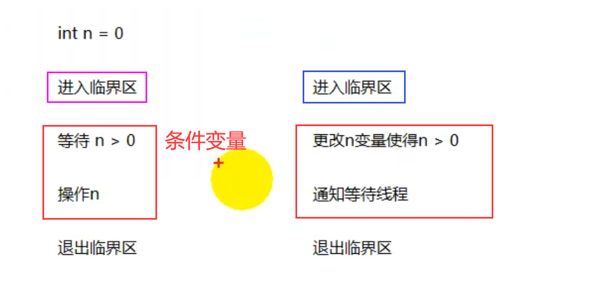

​                      消费者                                                                                  生产者

我们等待n>0这个操作需要使用条件变量来实现，但是此时需要生产者线程来更改n使得n>0，但是此时消费者线程又将临界区加上了锁。**==所以我们需要一个时机来解锁使得生产者线程能够进入临界区，我们选择在条件变量中做解锁这一操作==**。那么生产者线程便有机会进入临界区来改变n的值，**但是这会带来副作用**，也有可能是其他消费者线程此时进入临界区然后等待n>0，然后就有多条消费者线程等待在该条件变量上了(与第一条消费者线程一样：加锁进入临界区->解锁想要生产者改变n值->阻塞等待生产者改变n值->被唤醒后加锁->操作n->解锁退出临界区)。

**但是我们也只能这样子实现了，只是我认为这有一点点副作用，因为我认为这个锁是为生产者线程打开的，但是时不时会有其他消费者线程来抢，但是对最后的结果无伤大雅**。

**==所以条件变量内部：解锁->等待->加锁==**。

**临界区变量一定是互斥使用的，但是互斥使用，有时候也是有条件的**。


**条件变量使用规范：**

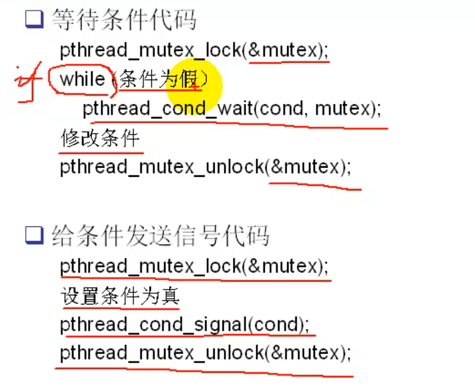

***

eg；

```c
#include <unistd.h>
#include <sys/types.h>
#include <pthread.h>
#include <semaphore.h>

#include <stdlib.h>
#include <stdio.h>
#include <errno.h>
#include <string.h>

#define ERR_EXIT(m) \
        do \
        { \
                perror(m); \
                exit(EXIT_FAILURE); \
        } while(0)

#define CONSUMERS_COUNT 2
#define PRODUCERS_COUNT 4

pthread_mutex_t g_mutex;
pthread_cond_t g_cond;

pthread_t g_thread[CONSUMERS_COUNT+PRODUCERS_COUNT];

int nready = 0;

void* consume(void *arg)
{
	int num = (int)arg;
	while (1)
	{
		pthread_mutex_lock(&g_mutex);
		while (nready == 0)
		{
			printf("%d begin wait a condtion ...\n", num);
			pthread_cond_wait(&g_cond, &g_mutex);  // 在这里解锁，使生产者有机会生产
		}
		
		printf("%d end wait a condtion ...\n", num);
		printf("%d begin consume product ...\n", num);
		--nready;
		printf("%d end consume product ...\n", num);
		pthread_mutex_unlock(&g_mutex);
		sleep(1);
	}
	return NULL;  // 等价 pthread_exit(NULL)
}

void* produce(void *arg)
{
	int num = (int)arg;
	while (1)
	{
		pthread_mutex_lock(&g_mutex);
		printf("%d begin produce product ...\n", num);
		++nready;
		printf("%d end produce product ...\n", num);
		pthread_cond_signal(&g_cond);
		printf("%d signal ...\n", num);
		pthread_mutex_unlock(&g_mutex);
		sleep(1);
	}
	return NULL;
}

int main(void)
{
	int i;

	pthread_mutex_init(&g_mutex, NULL);
	pthread_cond_init(&g_cond, NULL);


	for (i=0; i<CONSUMERS_COUNT; i++)
		pthread_create(&g_thread[i], NULL, consume, (void*)i);

	sleep(1);

	for (i=0; i<PRODUCERS_COUNT; i++)
		pthread_create(&g_thread[CONSUMERS_COUNT+i], NULL, produce, (void*)(CONSUMERS_COUNT+i));
	
    
	for (i=0; i<CONSUMERS_COUNT+PRODUCERS_COUNT; i++)
		pthread_join(g_thread[i], NULL);

	pthread_mutex_destroy(&g_mutex);
	pthread_cond_destroy(&g_cond);

	return 0;
}

```

运行结果：

```bash
0 end wait a condtion ...
0 begin consume product ...
0 end consume product ...
3 begin produce product ...
3 end produce product ...
3 signal ...
5 begin produce product ...
5 end produce product ...
5 signal ...
4 begin produce product ...
4 end produce product ...
4 signal ...
1 end wait a condtion ...
1 begin consume product ...
1 end consume product ...
2 begin produce product ...
2 end produce product ...
2 signal ...
0 end wait a condtion ...
0 begin consume product ...
0 end consume product ...
^C
```

可以看到：**运行到后半程，压根没有begin wait a condtion ...这句话输出，这是因为生产者线程多于消费者线程。我们消费者线程循环回去发现不需要等待就直接有可以消费的物品**。

0 1是消费者线程，2 3 4 5是生产者线程。

这时候，就没有等待的线程存在，所以我们的生产线程会通知，但是这个通知会丢失，但是丢失也没有关系，生产者线程让nready不为0 ，那么就不影响我们消费的逻辑。此时基本没有等待的状态。

> 当然，我们没有考虑生产者线程缓冲区会不会满，理想中是无限大的。


**==分析：==**

pthread_cond_wait内部做了什么。

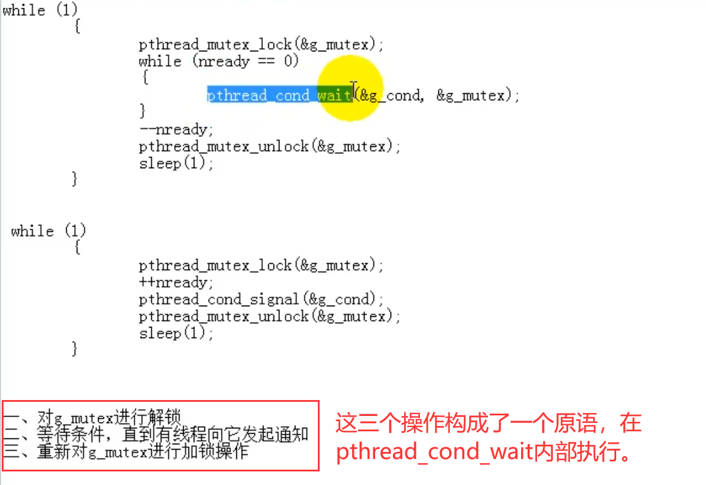


为什么不用if而用while？

If a signal is delivered to a thread waiting for a condition variable, upon return from the
       signal handler the thread resumes waiting for the condition  variable  as  if  it  was  not
       interrupted, or it shall return zero due to spurious wakeup.

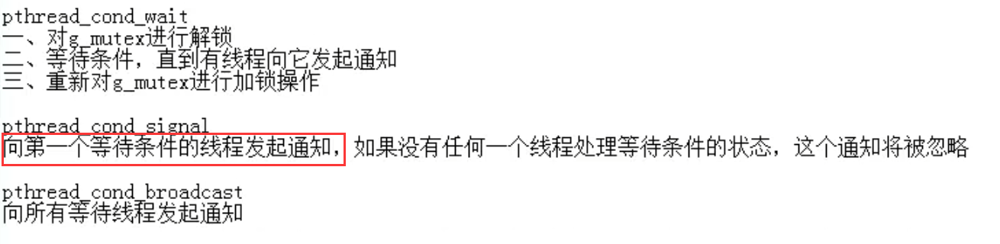

**==究其原因，这个线程可能被虚假的唤醒，所以如果我们使用while循环的话，就可以再检测一遍我们想要的条件是否真的达到了。增加了程序的健壮性。如果是if，那么我们就会执行这个虚假的通知导致出错==**。


chatgpt：条件变量可能会产生虚假通知。在某些情况下，线程可能会接收到不正确的通知，即使条件并未满足。因此，您应该使用while循环来检查条件是否满足，而不是使用if语句。

什么情况下会产生虚假通知？

虚假通知是指线程在等待条件变量时，有时会收到虚假的通知，即使条件并未满足。虚假通知通常发生在多个线程同时等待同一条件变量的情况下。

虚假通知的产生是由于条件变量的实现方式引起的。在某些情况下，线程可能会在条件变量被通知之前被唤醒。这可能会导致线程检查条件并发现它并未满足，即使它在等待条件变量之前已经被满足。这种情况下，线程必须继续等待，直到条件变量被正确地通知为止。


### 线程池

**condition.h：**

```c
#ifndef _CONDITION_H_
#define _CONDITION_H_

#include <pthread.h>

typedef struct condition
{
	pthread_mutex_t pmutex;
	pthread_cond_t pcond;
} condition_t;

int condition_init(condition_t *cond);
int condition_lock(condition_t *cond);
int condition_unlock(condition_t *cond);
int condition_wait(condition_t *cond);
int condition_timedwait(condition_t *cond, const struct timespec *abstime);
int condition_signal(condition_t *cond);
int condition_broadcast(condition_t *cond);
int condition_destroy(condition_t *cond);

#endif /* _CONDITION_H_ */
```

**condition.c：**

```c
#include "condition.h"

int condition_init(condition_t *cond)
{
	int status;
	if ((status = pthread_mutex_init(&cond->pmutex, NULL)))
		return status;

	if ((status = pthread_cond_init(&cond->pcond, NULL)))
		return status;

	return 0;
}

int condition_lock(condition_t *cond)
{
	return pthread_mutex_lock(&cond->pmutex);
}

int condition_unlock(condition_t *cond)
{
	return pthread_mutex_unlock(&cond->pmutex);
}

int condition_wait(condition_t *cond)
{
	return pthread_cond_wait(&cond->pcond, &cond->pmutex);
}

int condition_timedwait(condition_t *cond, const struct timespec *abstime)
{
	return pthread_cond_timedwait(&cond->pcond, &cond->pmutex, abstime);
}

int condition_signal(condition_t *cond)
{
	return pthread_cond_signal(&cond->pcond);
}

int condition_broadcast(condition_t* cond)
{
	return pthread_cond_broadcast(&cond->pcond);
}

int condition_destroy(condition_t* cond)
{
	int status;
	if ((status = pthread_mutex_destroy(&cond->pmutex)))
		return status;

	if ((status = pthread_cond_destroy(&cond->pcond)))
		return status;

	return 0;
}
```

**threadpool.h：**

```c
#ifndef _THREAD_POOL_H_
#define _THREAD_POOL_H_

#include "condition.h"

// 任务结构体,将任务放入队列由线程池中的线程来执行
typedef struct task
{
	void *(*run)(void *arg);	// 任务回调函数
	void *arg;					// 回调函数参数
	struct task *next;          // 任务队列(链表)
} task_t;

// 线程池结构体
typedef struct threadpool
{
	condition_t ready;		//任务准备就绪或者线程池销毁通知
	task_t *first;			//任务队列头指针
	task_t *last;			//任务队列尾指针
	int counter;			//线程池中当前线程数
	int idle;				//线程池中当前正在等待任务的(空闲的)线程数
	int max_threads;		//线程池中最大允许的线程数
	int quit;				//销毁线程池的时候置1
} threadpool_t;

// 初始化线程池
void threadpool_init(threadpool_t *pool, int threads);
// 往线程池中添加任务
void threadpool_add_task(threadpool_t *pool, void *(*run)(void *arg), void *arg);
// 销毁线程池
void threadpool_destroy(threadpool_t *pool);

#endif /* _THREAD_POOL_H_ */
```

```c
void threadpool_add_task(threadpool_t *pool, void *(*run)(void *arg), void *arg);
```

这个函数其实与pthread_create是差不多的，最主要就是扔给线程任务(函数)和任务(函数)所需的参数。

**threadpool.c：**

```c
#include "threadpool.h"
#include <stdlib.h>
#include <stdio.h>
#include <string.h>
#include <errno.h>
#include <time.h>

void *thread_routine(void *arg)
{
	struct timespec abstime;
	int timeout;
	printf("thread 0x%x is starting\n", (int)pthread_self());
	threadpool_t *pool = (threadpool_t *)arg;
	while (1)
	{
		timeout = 0;
		condition_lock(&pool->ready);
		pool->idle++;
		// 等待队列有任务到来或者线程池销毁通知
		while (pool->first == NULL && !pool->quit)
		{
			printf("thread 0x%x is waiting\n", (int)pthread_self());
			//condition_wait(&pool->ready);
			clock_gettime(CLOCK_REALTIME, &abstime);
			abstime.tv_sec += 2;
			int status = condition_timedwait(&pool->ready, &abstime);
			if (status == ETIMEDOUT)
			{
				printf("thread 0x%x is wait timed out\n", (int)pthread_self());
				timeout = 1;
				break;
			}
		}

		// 等待到条件，处于工作状态
		pool->idle--;

		// 等待到任务
		if (pool->first != NULL)
		{
			// 从队头取出任务
			task_t *t = pool->first;
			pool->first = t->next;
			// 执行任务需要一定的时间，所以要先解锁，以便生产者进程
			// 能够往队列中添加任务，其它消费者线程能够进入等待任务
			condition_unlock(&pool->ready);
			t->run(t->arg);
			free(t);
			condition_lock(&pool->ready);
		}
		// 如果等待到线程池销毁通知, 且任务都执行完毕
		if (pool->quit && pool->first == NULL)
		{
			pool->counter--;
			if (pool->counter == 0)
				condition_signal(&pool->ready);

			condition_unlock(&pool->ready);
			// 跳出循环之前要记得解锁
			break;
		}

		if (timeout && pool->first == NULL)
		{
			pool->counter--;
			condition_unlock(&pool->ready);
			// 跳出循环之前要记得解锁
			break;
		}
		condition_unlock(&pool->ready);
	}

	printf("thread 0x%x is exting\n", (int)pthread_self());
	return NULL;

}

// 初始化线程池
void threadpool_init(threadpool_t *pool, int threads)
{
	// 对线程池中的各个字段初始化
	condition_init(&pool->ready);
	pool->first = NULL;
	pool->last = NULL;
	pool->counter = 0;
	pool->idle = 0;
	pool->max_threads = threads;
	pool->quit = 0;
}

// 往线程池中添加任务
void threadpool_add_task(threadpool_t *pool, void *(*run)(void *arg), void *arg)
{
	// 生成新任务
	task_t *newtask = (task_t *)malloc(sizeof(task_t));
	newtask->run = run;
	newtask->arg = arg;
	newtask->next = NULL;

	condition_lock(&pool->ready);
	// 将任务添加到队列
	if (pool->first == NULL)
		pool->first = newtask;
	else
		pool->last->next = newtask;
	pool->last = newtask;

	// 如果有等待线程，则唤醒其中一个
	if (pool->idle > 0)
		condition_signal(&pool->ready);
	else if (pool->counter < pool->max_threads)
	{
		// 没有等待线程，并且当前线程数不超过最大线程数，则创建一个新线程
		pthread_t tid;
		pthread_create(&tid, NULL, thread_routine, pool);
		pool->counter++;
	}
	condition_unlock(&pool->ready);
}

// 销毁线程池
void threadpool_destroy(threadpool_t *pool)
{
	if (pool->quit)
	{
		return;
	}
	condition_lock(&pool->ready);
	pool->quit = 1;
	if (pool->counter > 0)
	{
		if (pool->idle > 0)
			condition_broadcast(&pool->ready);

		// 处于执行任务状态中的线程，不会收到广播
		// 线程池需要等待执行任务状态中的线程全部退出

		while (pool->counter > 0)
			condition_wait(&pool->ready);
	}
	condition_unlock(&pool->ready);
	condition_destroy(&pool->ready);
}
```

