# hh

## 第六章

### 6.1 认识socket

#### 6.1.1 什么是socket

socket可以看成是用户进程与内核网络协议栈的编程接口。

socket不仅可以用于本机的进程间通信，还可以用于网络上不同主机的进程间通信。

socket也满足异构通信，比如手机上CPU是arm，电脑是x86，硬件架构不同。另外，手机上和pc机上的操作系统也可以是不同的。

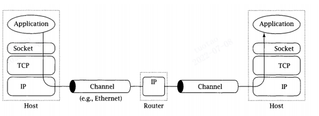

#### 6.1.2 IPV4套接口地址结构

IPv4套接口地址结构通常也称为“网际套接字地址结构”，它以“sockaddr_in”命名，定义在头文件<netinet/in.h>中

我们也可以通过`man 7 ip`来查看到这个地址结构。

```c
struct sockaddr_in {
	uint8_t  sin_len;  //有些平台并不实现这个字段
	sa_family_t  sin_family;
	in_port_t	sin_port;        //2
	struct in_addr	sin_addr;    //4
	char sin_zero[8];  //保留字段 //8  =14=sa_data
}; 
```

sin_len：整个sockaddr_in结构体的长度，在4.3BSD-Reno版本之前的第一个成员是sin_family.

**sin_family**：指定该地址家族，在这里必须设为AF_INET(针对IPV4协议)

**sin_port**：端口

**sin_addr**：IPv4的地址；

sin_zero：暂不使用，一般将其设置为0

为什么有地址族这个概念，因为socket在设计的时候，不止考虑TCP/IP协议，还有UNIX域协议等。

注：地址族，IP，端口。三元组。

注：in，说明用于内部，更多的适用于TCP/IP。


```c
/* Internet address. */
struct in_addr {
	uint32_t       s_addr;     /* address in network byte order */
};                             //网络字节序的网络地址
```

uint32_t：无符号的32位整数。

**==注意：给s_addr赋值的整数要是网络字节序才正确==**。


通用地址结构：

上面的**struct sockaddr_in**仅仅应用于IPV4地址结构，通用地址结构可以应用于任何协议的套接口。事实上，这个结构跟上面个是兼容的，TCP/IP时更多的使用上面一个，在必要时强制转换为通用地址结构。

通用地址结构用来指定与套接字关联的地址。

```c
struct sockaddr {
	uint8_t  sin_len;
	sa_family_t  sin_family;
	char sa_data[14];
}; 
```

sin_len：**整个sockaddr结构体的长度**

sin_family：指定该地址家族

sa_data：由sin_family决定它的形式。

注：**sockaddr是通用地址结构，作为不那么通用的，那么我们加个in，表示内部，于是形成了sockaddr_in**。**==那么，用什么来表示ip呢，干脆搞个in_addr吧==**。

#### 6.1.3 网络字节序

* 字节序

  * 大端字节序（Big Endian)

    最高有效位（MSB：Most Significant Bit）存储于最低内存地址处，最低有效位（LSB：Lowest Significant Bit）存储于最高内存地址处。

  * 小端字节序（Little Endian）

    最高有效位（MSB：Most Significant Bit）存储于最高内存地址    处，最低有效位（LSB：Lowest Significant Bit）存储于最低内存地址处。

* 主机字节序

  **不同的主机有不同的字节序，如x86为小端字节序**，Motorola 6800为大端字节序，ARM字节序是可配置的。

* 网络字节序

  **==网络字节序规定为大端字节序==**

既然主机字节序和网络字节序不同，那么就必然涉及到互相的转换。

#### 6.1.4 字节序转换函数

```c
uint32_t htonl(uint32_t hostlong);

uint16_t htons(uint16_t hostshort);

uint32_t ntohl(uint32_t netlong);

uint16_t ntohs(uint16_t netshort);
//这一堆都是整数之间的互相转换，你为什么纠结它能不能用于ip地址的转换呢？很明显不能，ip地址涉及到字符串。
```

说明：在上述的函数中，h代表host；n代表network s代表short；l代表long。

测试程序：

```c
#include <stdio.h>
#include <arpa/inet.h>
int main()
{
    unsigned int x=0x12345678;
    unsigned char* p=(unsigned char*)&x;
    printf("_%0x_%0x_%0x_%0x_\n",p[0],p[1],p[2],p[3]);                           
    unsigned int y=htonl(x);
    p=(unsigned char*)&y;
    printf("_%0x_%0x_%0x_%0x_\n",p[0],p[1],p[2],p[3]);
    return 0;
}
```

运行结果：

```c
[tuotao@HOST-10-198-6-250 ~]$ ./a.out  
_78_56_34_12_  //78是低位，占低字节，为小端。 逆序打印就是小端
_12_34_56_78_  
```

#### 6.1.5 地址转换函数

**==有两个函数能够将ip地址转换为网络字节序整数呀==**！！！

```c
#include <netinet/in.h>
#include <arpa/inet.h>

in_addr_t inet_addr(const char *cp);//点分10进制的ip地址转换为32位的整数，并且这个整数是网络字节序
                                    //这意味着你打印时需要先转换为主机字节序


int inet_aton(const char *cp, struct in_addr *inp);//与inet_addr功能是一样的，只是它将转换后的
                                                   //网络字节序整数使用传出参数inp进行输出。


//他配合前面两个函数使用
char *inet_ntoa(struct in_addr in); //将一个网络字节序(整数)地址结构转换为点分十进制的ip地址。

//根据下面这个结构来看，in变量就是整数ip地址。
struct in_addr {
	uint32_t       s_addr;    
}; 
```

注：**==函数中的a代表acsii码==**。ascii码就是字符串。字符串就是点分十进制ip地址。

1. 点分10进制的ip地址转换为32位的整数，**并且这个转换后得到的整数是网络字节序**。
2. 与inet_addr功能是一样的，**只是它将转换后的网络字节序整数**使用传出参数inp进行输出。
3. 将一个网络字节序(整数)地址结构转换为点分十进制的ip地址。

注意：**==只有inet_ntoa可以将整数转换为点分十进制的ip地址哦==**。

测试程序：

```c
#include <stdio.h>
#include <arpa/inet.h>

int main(void)
{
    //点分10进制的ip地址转换为32位的整数，并且这个整数是网络字节序。
	unsigned long addr = inet_addr("192.168.0.100");  
	printf("addr=%u\n", ntohl(addr));  //我们需要先转换为主机字节序，并且使用无符号的方式打印。

	struct in_addr ipaddr;
	ipaddr.s_addr = addr;  //一定要给他一个网络字节序的整数，而前面的addr正好符合。
	printf("%s\n", inet_ntoa(ipaddr));  //显然结果是192.168.0.100
	return 0;
}
```

运行结果：

```c
[tuotao@HOST-10-198-6-250 ~]$ ./a.out  
addr=3232235620
192.168.0.100
```

#### 6.1.6 套接字类型

流式套接字(SOCK_STREAM)	提供面向连接的、可靠的数据传输服务，数据无差错，无重复的发送，且按发送顺序接收。

数据报式套接字(SOCK_DGRAM)	提供无连接服务。不提供无错保证，数据可能丢失或重复，并且接收顺序混乱。

原始套接字（SOCK_RAW）

注：实际上不止这三种。

### 6.2 socket通信api的简单使用

本章目标：

* TCP客户/服务器模型

* 回射客户/服务器

* socket、bind、listen、accept、connect

#### 6.2.1 TCP客户/服务器模型

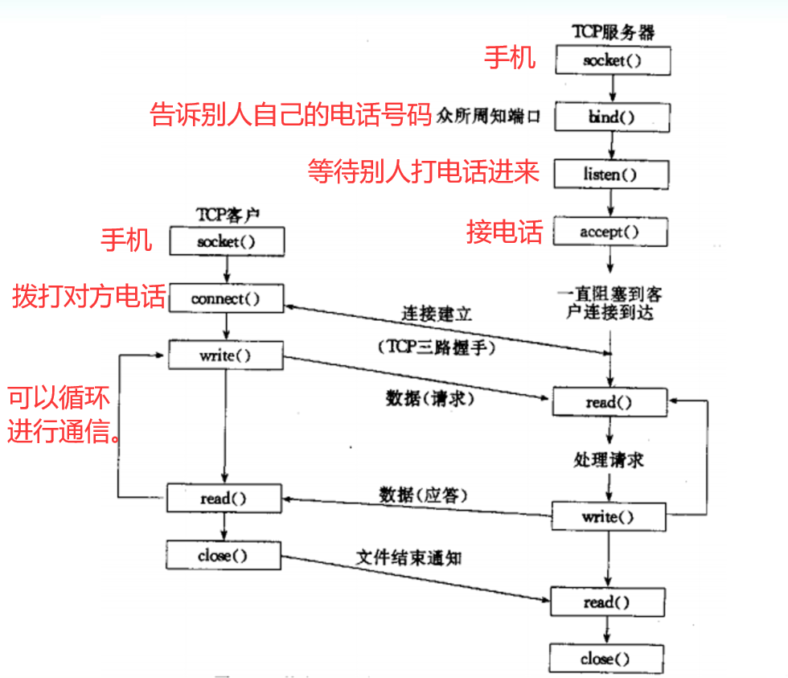

回射客户/服务器：

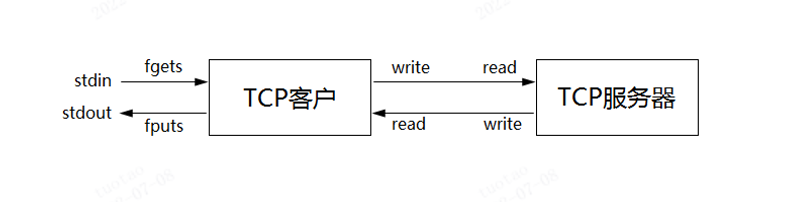

#### 6.2.2 函数使用

##### 6.2.2.1 socket函数

包含头文件<sys/socket.h>

功能：创建一个套接字用于通信

原型：`int socket(int domain, int type, int protocol);`

参数：

domain ：指定通信协议族（protocol family）

type：指定socket类型，流式套接字SOCK_STREAM，数据报套接字SOCK_DGRAM，原始套接字SOCK_RAW

protocol ：协议类型

返回值：成功返回非负整数， 它与文件描述符类似，我们把它称为套接口描述字，简称套接字。失败返回-1

##### 6.2.2.2 bind函数

包含头文件<sys/socket.h>

功能：绑定一个本地地址到套接字

原型：`int bind(int sockfd, const struct sockaddr *addr, socklen_t addrlen);`

参数

sockfd：socket函数返回的套接字

addr：要绑定的地址

addrlen：地址长度

返回值：成功返回0，失败返回-1

##### 6.2.2.3 listen函数

包含头文件<sys/socket.h>

功能：将套接字用于监听进入的连接

原型：`int listen(int sockfd, int backlog);`

参数sockfd：socket函数返回的套接字

backlog：**规定内核为此套接字排队的最大连接个数**

返回值：成功返回0，失败返回-1


一般来说，listen函数应该在调用socket和bind函数之后，调用函数accept之前调用。

对于给定的监听套接口，内核要维护两个队列：

1、已由客户发出并到达服务器，服务器正在等待完成相应的TCP三路握手过程

2、已完成连接的队列

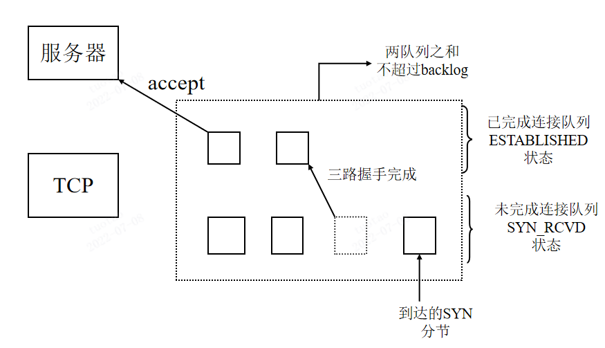

##### 6.2.2.4 accept函数函数

包含头文件<sys/socket.h>

功能：从已完成连接队列返回第一个连接，如果已完成连接队列为空，则阻塞。

原型：`int accept(int sockfd, struct sockaddr *addr, socklen_t *addrlen);`

参数：

sockfd：服务器套接字

addr：将返回对等方的套接字地址

addrlen：**返回对等方的套接字地址长度(即表示对等方那个变量的sizeof)**。（注意这个需要用一个变量记录）

例子：

```c
struct sockaddr_in peeraddr;   //表示对等方的变量
socklen_t peerlen = sizeof(peeraddr);  //表示对等方的变量的大小。需要一个变量来记录哦，因为后面要传入他的地址。
int conn;
if ((conn = accept(listenfd, (struct sockaddr*)&peeraddr, &peerlen)) < 0)
      ERR_EXIT("accept");
```

返回值：成功返回非负整数，失败返回-1

##### 6.2.2.5 connect函数

包含头文件<sys/socket.h>

功能：建立一个连接至addr所指定的套接字

原型int connect(int sockfd, const struct sockaddr *addr, socklen_t addrlen);

参数：

sockfd：未连接套接字

addr：要连接的套接字地址

addrlen：第二个参数addr长度

返回值：成功返回0，失败返回-1


**==我惊奇的发现connect函数和bind函数的形参是一模一样的！！！这很正常啊，一个是绑定它，一个是连接它==**。而accept的前两个形参是一样，只不过最后一个形参，前两个函数是socklen_t addrlen，而accept的是

socklen_t* addrlen。**==所以需要先定义socklen_t类型的一个变量，然后传入它的地址==**。

**==这三个函数都是先定义sockaddr_in地址结构，然后传参时强制转换为通用地址结构==**。

#### 6.2.3 示例程序

**服务端：**

```c
#include <unistd.h>
#include <sys/types.h>
#include <sys/socket.h>
#include <netinet/in.h>
#include <arpa/inet.h>

#include <stdlib.h>
#include <stdio.h>
#include <errno.h>
#include <string.h>

#define ERR_EXIT(m) \
        do \
	{ \
           	perror(m); \
                exit(EXIT_FAILURE); \
        } while(0)

int main(void)
{
        int listenfd;  //手机
    	//前面两个字段已经可以确定协议类型，所以第三个参数填0，让其自动显示。当然也可以显示指定。
        if ((listenfd = socket(PF_INET, SOCK_STREAM, IPPROTO_TCP)) < 0)
/*	if ((listenfd = socket(PF_INET, SOCK_STREAM, 0)) < 0)*/
                ERR_EXIT("socket");  

        struct sockaddr_in servaddr;
        memset(&servaddr, 0, sizeof(servaddr));
        servaddr.sin_family = AF_INET;
        servaddr.sin_port = htons(5188);  //转成网络字节序的端口哦
        servaddr.sin_addr.s_addr = htonl(INADDR_ANY); //将任意的ip地址转换为网络字节序的整数
    	
    	//将点分10进制的ip地址转换为网络字节序的整数，结果是网络字节序！！！！
        /*servaddr.sin_addr.s_addr = inet_addr("127.0.0.1");*/
    	//or
        /*inet_aton("127.0.0.1", &servaddr.sin_addr);*/
		
    	int on = 1;   //设置端口复用
        if (setsockopt(listenfd, SOL_SOCKET, SO_REUSEADDR, &on, sizeof(on)) < 0)
                ERR_EXIT("setsockopt");

    
    	//绑定电话号码        //转成通用地址结构             //并给出大小
        if (bind(listenfd, (struct sockaddr*)&servaddr, sizeof(servaddr)) < 0)
                ERR_EXIT("bind");
    	//等待别人打电话来
        if (listen(listenfd, SOMAXCONN) < 0) //队列最大值，已完成连接队列和未完成连接队列的总和
                ERR_EXIT("listen");

        struct sockaddr_in peeraddr;
        socklen_t peerlen = sizeof(peeraddr);
        int conn;
    	//接电话      //等待连接，就像打电话一样，我们当然可以知道对等方的地址
        if ((conn = accept(listenfd, (struct sockaddr*)&peeraddr, &peerlen)) < 0)
                ERR_EXIT("accept");

        char recvbuf[1024];
        while (1)
        {
                memset(recvbuf, 0, sizeof(recvbuf));
            	//read返回真实读取到的字节数
                int ret = read(conn, recvbuf, sizeof(recvbuf));
            	//我想，对于fputs这种函数，它当然是针对文件操作的。
            	//字面意思就是，将内容输出到一个文件里，那么很显然，标准输出也是一个
            	//文件，我们完全可以输出到标准输出。
                fputs(recvbuf, stdout);
                write(conn, recvbuf, ret); //收到多少字节，就发回去多少字节
                //也可以使用strlen(recvbuf)进行发送，但是不建议使用sizeof(recvbuf)进行发送，因为
            	//这样会发送更多的字节数，虽然都是'\0'不会对结果造成影响。
        }
		close(conn);
        close(listenfd);

        return 0;
}
```

**客户端：**

```c

#include <unistd.h>
#include <sys/types.h>
#include <sys/socket.h>
#include <netinet/in.h>
#include <arpa/inet.h>

#include <stdlib.h>
#include <stdio.h>
#include <errno.h>
#include <string.h>

#define ERR_EXIT(m) \
        do \
        { \
                perror(m); \
                exit(EXIT_FAILURE); \
        } while(0)

int main(void)
{
        int sock;
        if ((sock = socket(PF_INET, SOCK_STREAM, IPPROTO_TCP)) < 0)
                ERR_EXIT("socket");

        struct sockaddr_in servaddr;  //打电话给服务器，填写服务端的ip和端口
        memset(&servaddr, 0, sizeof(servaddr));
        servaddr.sin_family = AF_INET;
        servaddr.sin_port = htons(5188);
        servaddr.sin_addr.s_addr = inet_addr("127.0.0.1");

        if (connect(sock, (struct sockaddr*)&servaddr, sizeof(servaddr)) < 0)
                ERR_EXIT("connect");

        char sendbuf[1024] = {0};
        char recvbuf[1024] ={0};
    	//循环从标准输入读取数据(这个buf很大，所以有很大的几率读入换行符)。
        while (fgets(sendbuf, sizeof(sendbuf), stdin) != NULL) //fgets返回char*
        {
                write(sock, sendbuf, strlen(sendbuf));
            	//第三个参数是
                read(sock, recvbuf, sizeof(recvbuf));

                fputs(recvbuf, stdout);
                memset(sendbuf, 0, sizeof(sendbuf));
                memset(recvbuf, 0, sizeof(recvbuf));
        }

        close(sock);

        return 0;
}
```

注：

```c
ssize_t read(int fd, void *buf, size_t count);

read() 从文件描述符 fd 中读取 count 字节的数据并放入从 buf 开始的缓冲区中.

如果 count 为零,read()返回0,不执行其他任何操作.  如果 count 大于SSIZE_MAX,那么结果将不可预料.
```

### 6.3 socket编程(三)

本章目标：

SO_REUSEADDR

处理多客户连接（process-per-conection）

点对点聊天程序实现

#### 6.3.1 SO_REUSEADDR

服务器端尽可能使用SO_REUSEADDR

在绑定之前尽可能调用setsockopt来设置SO_REUSEADDR套接字选项。

**使用SO_REUSEADDR选项可以使得不必等待TIME_WAIT状态消失就可以重启服务器**。

#### 6.3.2 process-per-connection

**==以后的通用代码我都会删除，以免文件过大造成卡顿。==**

一个连接一个进程来处理并发。

```c
#include <unistd.h>
#include <sys/types.h>
#include <sys/socket.h>
#include <netinet/in.h>
#include <arpa/inet.h>

#include <stdlib.h>
#include <stdio.h>
#include <errno.h>
#include <string.h>

void do_service(int conn)
{
	char recvbuf[1024];
        while (1)
        {
                memset(recvbuf, 0, sizeof(recvbuf));
                int ret = read(conn, recvbuf, sizeof(recvbuf));
		if (ret == 0)
		{
			printf("client close\n");
			break;  //客户端关闭连接，结束循环
		}
		else if (ret == -1)
			ERR_EXIT("read");
        fputs(recvbuf, stdout);
        write(conn, recvbuf, ret);
        }
}

int main(void)
{
	int on = 1;
	if (setsockopt(listenfd, SOL_SOCKET, SO_REUSEADDR, &on, sizeof(on)) < 0)
		ERR_EXIT("setsockopt");

	if (bind(listenfd, (struct sockaddr*)&servaddr, sizeof(servaddr)) < 0)
		ERR_EXIT("bind");
	if (listen(listenfd, SOMAXCONN) < 0)
		ERR_EXIT("listen");

	struct sockaddr_in peeraddr;
	socklen_t peerlen = sizeof(peeraddr);
	int conn;

	pid_t pid;
	while (1)
	{
		if ((conn = accept(listenfd, (struct sockaddr*)&peeraddr, &peerlen)) < 0)
			ERR_EXIT("accept");

		printf("ip=%s port=%d\n", inet_ntoa(peeraddr.sin_addr), ntohs(peeraddr.sin_port));

		pid = fork();   //来一个连接就开辟一个子进程出来处理通信
		if (pid == -1)
			ERR_EXIT("fork");
		if (pid == 0) //子进程处理通信
		{
			close(listenfd); //子进程不需要这个监听套接字
			do_service(conn);
			exit(EXIT_SUCCESS);
		}
		else
			close(conn);  //父进程不需要这个通信套接字(由子进程来负责和客户端通信)
	}
	
	return 0;
}
```

#### 6.3.3 点对点聊天程序实现

用多进程方式实现点对点聊天。


### 6.4 粘包概念与处理

本章目标：

流协议与粘包

粘包产生的原因

粘包处理方案

readn writen

回射客户/服务器

#### 6.4.1 流协议与粘包

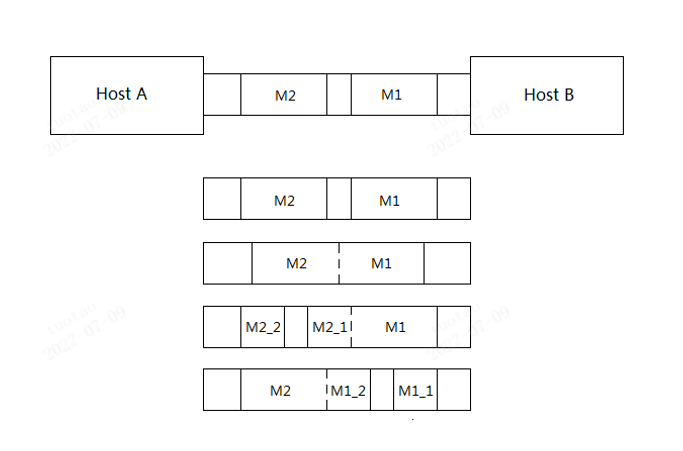

**==字节流就像水流一样是没有边界的，所以可能会两部分不同的消息粘在一起，这就是粘包问题==**。

图中的情况是：

1. 正常
2. M1,M2两条消息粘在一起。
3. M2的一部分与M1粘在一起
4. **M1的一部分与M2粘在一起**
5. 当然也可能有其他问题组合。

#### 6.4.2 粘包产生的原因

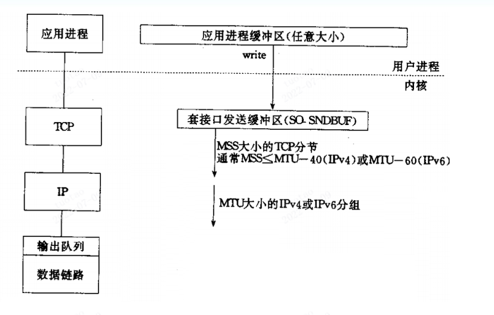

1. 用户发送buf中的消息大小超过了内核发送缓冲区大小**SO_SNDBUF**。
2. MSS大小的TCP分节。
3. 网络层(IP)的最大传输单元限制
4. 当然，还有其他原因，比如滑动窗口，拥塞控制。

#### 6.4.3 粘包解决方案

* 定长包

  **==问题在于一次接收的包可能不是我们制定的长度，所以需要自己的函数readn。n就是定长的长度==**。

* 包尾加\r\n（ftp）

  **==问题在于原始消息的末尾可能就存在\r\n，这时候可能需要一些转义==**。

* 在包头加上包体长度

  **==这样就可以先读取包头，再读取确定字节的数据(也就是定长包，说白了是两种解决方案)==**。

* 更复杂的应用层协议


readn:

```c
ssize_t readn(int fd, void *buf, size_t count)
{
        size_t nleft = count;  //还剩多少字节未读
        ssize_t nread;         
        char *bufp = (char*)buf; //它不是必要的。错了，是必要的，我们先将void*转为char*

        while (nleft > 0)     //只要还没读完n个字节
        {
                if ((nread = read(fd, bufp, nleft)) < 0)
                {
                        if (errno == EINTR)  //信号中断不是error
                                continue;
                        return -1;
                }
                else if (nread == 0) //客户端关闭了连接
                        return count - nleft; //返回真实读到的字节数(总-未读)

                bufp += nread;   //偏移
                nleft -= nread;  //未读的减少咯
        }

        return count;
}
```

writen:  一般write也是不会阻塞的，只要内核发送缓冲区够大。

```c
ssize_t writen(int fd, const void *buf, size_t count)
{
        size_t nleft = count;
        ssize_t nwrite;
        char *bufp = (char*)buf;

        while (nleft > 0)
        {
                if ((nwrite = write(fd, bufp, nleft)) < 0)
                {
                        if (errno == EINTR)
                                continue;
                        return -1;
                }
                else if (nwrite == 0) //这对于服务端来说，就好像啥也没发生
                        continue;

                bufp += nwrite;
                nleft -= nwrite;
        }

        return count;
}
```


服务端：

```c
struct packet   //自定义定长协议包解决粘包问题
{
        int len;  //这个len一定要放在前面。我们先读取的4字节才会是len
        char buf[1024];
};

ssize_t readn(int fd, void *buf, size_t count)
{
        size_t nleft = count;
        ssize_t nread;
        char *bufp = (char*)buf;

        while (nleft > 0)
        {
                if ((nread = read(fd, bufp, nleft)) < 0)
                {
                        if (errno == EINTR)
                                continue;
                        return -1;
                }
                else if (nread == 0)
                        return count - nleft;

                bufp += nread;
                nleft -= nread;
        }

	return count;
}

ssize_t writen(int fd, const void *buf, size_t count)
{
        size_t nleft = count;
        ssize_t nwritten;
        char *bufp = (char*)buf;

        while (nleft > 0)
        {
                if ((nwritten = write(fd, bufp, nleft)) < 0)
                {
                        if (errno == EINTR)
                                continue;
                        return -1;
                }
                else if (nwritten == 0)
                        continue;

                bufp += nwritten;
                nleft -= nwritten;
        }

	return count;
}

void do_service(int conn)
{
        struct packet recvbuf;
        int n;
	    while (1)
        {
                memset(&recvbuf, 0, sizeof(recvbuf));
            	//只是给他一个地址，告诉他能够读几个字节到这个地址中，
            	//什么类型的地址根本不重要。
                int ret = readn(conn, &recvbuf.len, 4);
                                 //先读前4个字节的数据(也就是读到len这个变量)，看要接收多长的消息
                                 //这里.的优先级高于&，说明是recvbuf.len的地址
                if (ret == -1)
                        ERR_EXIT("read");
                else if (ret < 4)  //如果成功读取到的字节数小于4
                {
                        printf("client close\n");
                        break;
                }

                n = ntohl(recvbuf.len);  //注意你读到的len是网络字节序。注意注意注意
                                         //我们现在要接收n这么长的数据
            
                ret = readn(conn, recvbuf.buf, n); //读数据
                if (ret == -1)
                        ERR_EXIT("read");
                else if (ret < n)  //如果成功读取到的字节数小于n
                {
                        printf("client close\n");
                        break;
                }

                fputs(recvbuf.buf, stdout);
                writen(conn, &recvbuf, 4+n);  //然后将这片内存的东西全部发过去
        }                                     //我们writen的实现是先将这片地址转为char*，
                                              //然后全部发送过去哦。
                //要对方接收的数据长度已经存到了recvbuf中，注意一定是写4+n，而不是sizeof recvbuf，
                //这个差别可就大了。
}

int main(void)
{
        pid_t pid;
        while (1)
        {
                if ((conn = accept(listenfd, (struct sockaddr*)&peeraddr, &peerlen)) < 0)
                        ERR_EXIT("accept");

                printf("ip=%s port=%d\n", inet_ntoa(peeraddr.sin_addr), ntohs(peeraddr.sin_port));

                pid = fork();
                if (pid == -1)
                        ERR_EXIT("fork");
                if (pid == 0)
                {
                        close(listenfd);
                        do_service(conn);
                        exit(EXIT_SUCCESS);
                }
                else
                    	close(conn);  //父进程不需要这个通信的套接字
        }

	return 0;
}
```

客户端：

```c
struct packet
{
        int len;
        char buf[1024];
};

ssize_t readn(int fd, void *buf, size_t count)
{
        size_t nleft = count;
        ssize_t nread;
        char *bufp = (char*)buf;

        while (nleft > 0)
        {
                if ((nread = read(fd, bufp, nleft)) < 0)
                {
                        if (errno == EINTR)
                                continue;
                        return -1;
                }
                else if (nread == 0)
                        return count - nleft;

                bufp += nread;
                nleft -= nread;
        }

	return count;
}

ssize_t writen(int fd, const void *buf, size_t count)
{
        size_t nleft = count;
        ssize_t nwritten;
        char *bufp = (char*)buf;

        while (nleft > 0)
        {
                if ((nwritten = write(fd, bufp, nleft)) < 0)
                {
                        if (errno == EINTR)
                                continue;
                        return -1;
                }
                else if (nwritten == 0)
                        continue;

                bufp += nwritten;
                nleft -= nwritten;
        }

	return count;
}
int main(void)
{
        if (connect(sock, (struct sockaddr*)&servaddr, sizeof(servaddr)) < 0)
                ERR_EXIT("connect");


        struct packet sendbuf;
        struct packet recvbuf;
        memset(&sendbuf, 0, sizeof(sendbuf));
        memset(&recvbuf, 0, sizeof(recvbuf));
        int n;
	while (fgets(sendbuf.buf, sizeof(sendbuf.buf), stdin) != NULL)
        {
                n = strlen(sendbuf.buf);
                sendbuf.len = htonl(n);  //记得转换为网络字节序(对于你要发送到网络中的数据，
                                         //如果它不是字符串) 
                writen(sock, &sendbuf, 4+n); //4不用转换为网络字节序吗。我操，4你又不用发送，
                                             //转什么网络字节序啊！！！那是你要发送的长度。


                int ret = readn(sock, &recvbuf.len, 4);
                if (ret == -1)
                        ERR_EXIT("read");
                else if (ret < 4)
                {
                        printf("client close\n");
                        break;
                }

                n = ntohl(recvbuf.len); //记得转换为主机字节序
                ret = readn(sock, recvbuf.buf, n);
                if (ret == -1)
                        ERR_EXIT("read");
                else if (ret < n)
                {
                        printf("client close\n");
                        break;
                }


                fputs(recvbuf.buf, stdout);
                memset(&sendbuf, 0, sizeof(sendbuf));
                memset(&recvbuf, 0, sizeof(recvbuf));
        }

	close(sock);

        return 0;
}
```

### 6.5 socket编程(五)

本章目标：

read、write与recv、send

readline实现

用readline实现回射客户/服务器

getsockname、getpeername gethostname、gethostbyname、gethostbyaddr

#### 6.5.1 recv和readline的实现

recv函数原型：

```c
#include <sys/socket.h>
ssize_t recv(int socket, void *buffer, size_t length, int flags);
```

**==它比read函数多了flags这个参数，且只能用于套接字io。而read可以用于任意的io==**。

其中两个有用的flags如下：

```shell
flags  Specifies the type of message reception. Values of this argument are formed by logically OR'ing zero or more of the following values:

       MSG_PEEK
              Peeks at an incoming message. The data is treated as unread and the next recv() or similar function shall still return this data.

       MSG_OOB
              Requests out-of-band data. The significance and semantics of out-of-band data are protocol-specific.
```


我们可以简单的利用MSG_PEEK这个特性来实现**==读取一行==**的操作(**==同样也解决了粘包问题==**)。

服务端：

```c
ssize_t recv_peek(int sockfd, void *buf, size_t len)
{
        while (1)
        {
                int ret = recv(sockfd, buf, len, MSG_PEEK);
                if (ret == -1 && errno == EINTR)
                        continue;
                return ret;
        }
}

ssize_t readline(int sockfd, void *buf, size_t maxline)
{
        int ret;
        int nread;
        char *bufp = buf;
        int nleft = maxline; //还剩下多少没有读
        while (1)
        {
                ret = recv_peek(sockfd, bufp, nleft);
                if (ret < 0)  //error
                        return ret;
                else if (ret == 0)  //peer close
                        return ret;

                nread = ret;
                int i;
                for (i=0; i<nread; i++)
                {
                        if (bufp[i] == '\n')
                        {
                            	//i+1读取\n，也是是这一整行
                                ret = readn(sockfd, bufp, i+1);
                                if (ret != i+1) //要是不能，那就是出错了
                                        exit(EXIT_FAILURE);

                                return ret;
                        }
                }

                if (nread > nleft)  //读到的比需要的未读的还多
                        exit(EXIT_FAILURE);

                nleft -= nread;
                //即使不到一行，也要把这些读走，因为我们需要的在前面已经偷窥过了
                ret = readn(sockfd, bufp, nread);
                if (ret != nread)
                        exit(EXIT_FAILURE);

                bufp += nread;  //偏移
        }

        return -1;
}
```

客户端：

```c
ssize_t recv_peek(int sockfd, void *buf, size_t len)
{
        while (1)
        {
                int ret = recv(sockfd, buf, len, MSG_PEEK);
                if (ret == -1 && errno == EINTR)
                        continue;
                return ret;
        }
}


ssize_t readline(int sockfd, void *buf, size_t maxline)
{
        int ret;
        int nread;
        char *bufp = buf;
        int nleft = maxline;
        while (1)
        {
                ret = recv_peek(sockfd, bufp, nleft);
                if (ret < 0)
                        return ret;
                else if (ret == 0)
                        return ret;

                nread = ret;
                int i;
                for (i=0; i<nread; i++)
                {
                        if (bufp[i] == '\n')
                        {
                                ret = readn(sockfd, bufp, i+1);
                                if (ret != i+1)
                                        exit(EXIT_FAILURE);

                                return ret;
                        }
                }

                if (nread > nleft)
                        exit(EXIT_FAILURE);

                nleft -= nread;
                ret = readn(sockfd, bufp, nread);
                if (ret != nread)
                        exit(EXIT_FAILURE);

                bufp += nread;
        }

	return -1;
}

int main(void)
{
        if (connect(sock, (struct sockaddr*)&servaddr, sizeof(servaddr)) < 0)
                ERR_EXIT("connect");

        struct sockaddr_in localaddr;
        socklen_t addrlen = sizeof(localaddr);
        if (getsockname(sock, (struct sockaddr*)&localaddr, &addrlen) < 0)
                ERR_EXIT("getsockname");

        printf("ip=%s port=%d\n", inet_ntoa(localaddr.sin_addr), ntohs(localaddr.sin_port));


        char sendbuf[1024] = {0};
        char recvbuf[1024] = {0};
        while (fgets(sendbuf, sizeof(sendbuf), stdin) != NULL)
        {
                writen(sock, sendbuf, strlen(sendbuf));

                int ret = readline(sock, recvbuf, sizeof(recvbuf));
                if (ret == -1)
                        ERR_EXIT("readline");
                else if (ret == 0)
                {
                        printf("client close\n");
                        break;
                }

                fputs(recvbuf, stdout);
                memset(sendbuf, 0, sizeof(sendbuf));
                memset(recvbuf, 0, sizeof(recvbuf));
        }

	close(sock);

        return 0;
}
```

#### 6.5.2 getsockname

```c
struct sockaddr_in localaddr;
socklen_t addrlen = sizeof(localaddr);
if (getsockname(sock, (struct sockaddr*)&localaddr, &addrlen) < 0)
                ERR_EXIT("getsockname");

printf("ip=%s port=%d\n", inet_ntoa(localaddr.sin_addr),ntohs(localaddr.sin_port));
```

这个函数只对通信的套接字(connect和accept成功之后)起作用，用于从sock中获取自己本身的localaddr信息。这对于服务端也是适用的。

#### 6.5.3 getpeername

```c
int getpeername(int socket, struct sockaddr *restrict address,
              socklen_t *restrict address_len);
//用法与上面个函数一致。
```

**==还记得吗，在前面的服务器示例程序中，我们用一个变量来记录了通信对方的信息，其实我们也可以指定为空，然后通过服务端的通信套接字配和getpeername来拿到通信对方的信息==**。

#### 6.5.4 gethostname

struct hostent的定义：**==这个ent全称应该是entry==**。

```c
struct hostent {
               char  *h_name;            /* official name of host */
               char **h_aliases;         /* alias list */
               int    h_addrtype;        /* host address type */
               int    h_length;          /* length of address */
               char **h_addr_list;       /* list of addresses */
           }
           #define h_addr h_addr_list[0] /* for backward compatibility */
```

**一般数组的第一个元素就是主机的ip地址，所以一般取h_addr**。

注意：`inet_ntoa(*(struct in_addr*)hp->h_addr)`，虽然hp->h_addr这个元素的类型是`char*`，但是它不是点分十进制的，我们直接打印它看不到任何结果(亲测)。我们需要先将它转换为(网络字节序的)整数，然后用inet_ntoa将其转换为点分十进制的ip地址。

```c
#include <netdb.h>
int getlocalip(char *ip)
{
        char host[100] = {0};
        if (gethostname(host, sizeof(host)) < 0)
                return -1;
        struct hostent *hp;
        if ((hp = gethostbyname(host)) == NULL)
                return -1;

        strcpy(ip, inet_ntoa(*(struct in_addr*)hp->h_addr));
        return 0;

}

int main(void)
{
        char host[100] = {0};
        if (gethostname(host, sizeof(host)) < 0)
                ERR_EXIT("gethostname");

        struct hostent *hp;   //hostentry
        if ((hp = gethostbyname(host)) == NULL)
                ERR_EXIT("gethostbyname");

        int i = 0;
        while (hp->h_addr_list[i] != NULL)
        {
                printf("%s\n", inet_ntoa(*(struct in_addr*)hp->h_addr_list[i]));
                i++;
        }

		char ip[16] = {0};
        getlocalip(ip);
        printf("localip=%s\n", ip);
        return 0;
}
```

### 6.6 socket编程(六)

本章目标：

TCP回射客户/服务器

TCP是个流协议

僵进程与SIGCHLD信号

#### 6.6.1 TCP回射客户/服务器

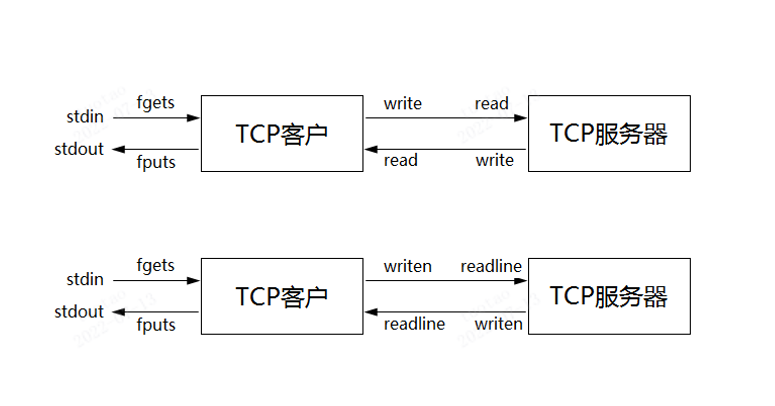

#### 6.6.2 TCP是个流协议

TCP是基于字节流传输的，只维护发送出去多少，确认了多少，没有维护消息与消息之间的边界，因而可能导致粘包问题。

粘包问题解决方法是**==在应用层维护消息边界==**。

* 定长包。(消息可能并没有那么长，导致网络上流量浪费)
* 通过包头确定数据长度。(定长头，不定长数据)
* 通过'\n'分割数据。

#### 6.6.3 僵进程与SIGCHLD信号

因为服务端采用的是多进程的方式，所以当一个客户端断开连接之后，服务端的子进程成为了僵尸进程。

```c
void handle_sigchld(int sig)
{
/*      wait(NULL);*/
        while (waitpid(-1, NULL, WNOHANG) > 0);
}
int main(void)
{
/*      signal(SIGCHLD, SIG_IGN);*/
    signal(SIGCHLD, handle_sigchld);
}
```

### 6.7 socket编程(七)

本章目标：

TCP 11种状态

连接建立三次握手、连接终止四次握手

TIME_WAIT与SO_REUSEADDR

SIGPIPE

#### 6.7.1 TCP 11种状态

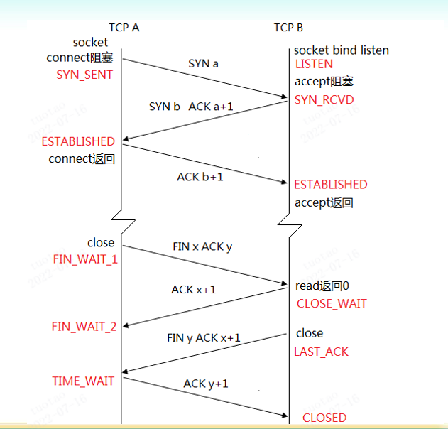


### 6.8 socket编程(八)

本章目标：

* 五种I/O模型
* select
* 用select改进回射客户端程序

#### 6.8.1 五种I/O模型

* 阻塞I/O
* 非阻塞I/O
* I/O复用（select和poll）
* 信号驱动I/O
* 异步I/O

#### 6.8.2 阻塞I/O

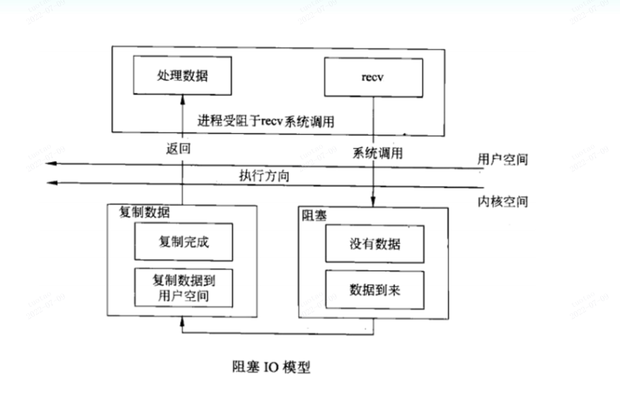

#### 6.8.3 非阻塞I/O

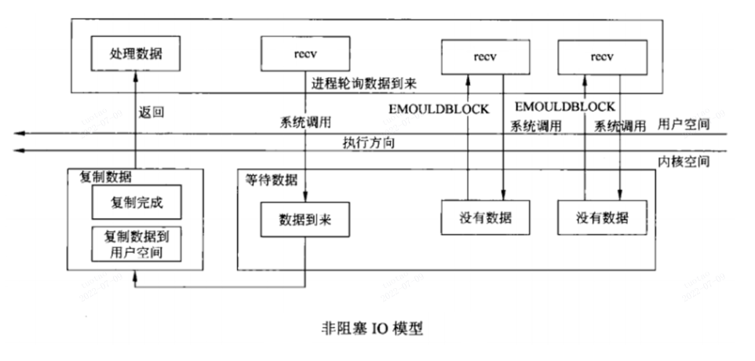

没有数据返回`EWOULDBLOCK`，图中写错了。这种很不常用，因为一直占用CPU去轮询有没有数据到来，造成了CPU忙等待。

#### 6.8.4 I/O复用

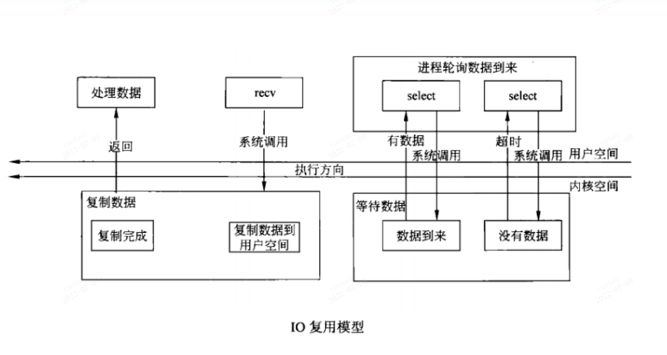

#### 6.8.5 信号驱动I/O

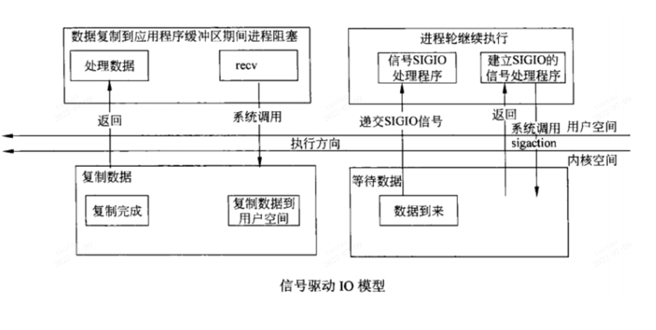

#### 6.8.6 异步I/O

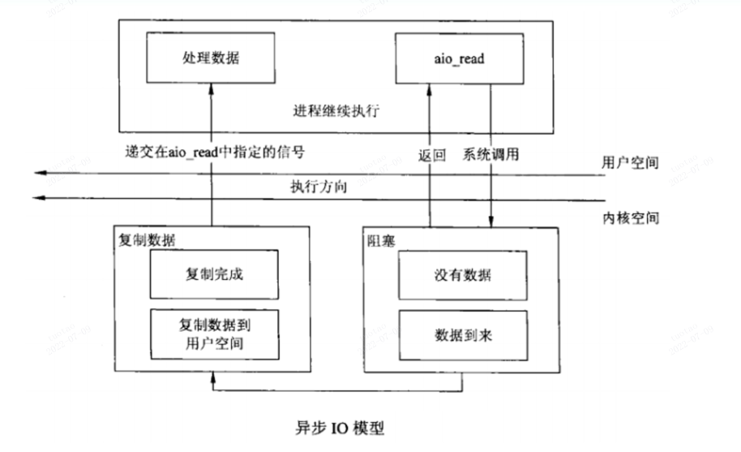

#### 6.8.7 select

```c
int select(int nfds, fd_set *readfds, fd_set *writefds, fd_set *exceptfds, struct timeval *timeout);

void FD_CLR(int fd, fd_set *set);
int  FD_ISSET(int fd, fd_set *set);
void FD_SET(int fd, fd_set *set);
void FD_ZERO(fd_set *set);
```

###  6.9 socket编程(九)

```c
int select(int nfds, fd_set *readfds, fd_set *writefds, fd_set *exceptfds, struct timeval *timeout);

void FD_CLR(int fd, fd_set *set);  //清0
int  FD_ISSET(int fd, fd_set *set);
void FD_SET(int fd, fd_set *set); //置1
void FD_ZERO(fd_set *set);  //清空
```

**读、写、异常事件发生条件：**

可读

* 套接口缓冲区有数据可读

* 连接的读一半关闭，即接收到FIN段，读操作将返回0

* 如果是监听套接口，已完成连接队列不为空时。(关心前3种)

* 套接口上发生了一个错误待处理，错误可以通过getsockopt指定SO_ERROR选项来获取。

可写

* 套接口发送缓冲区有空间容纳数据。

* 连接的写一半关闭。即收到RST段之后，再次调用write操作。

* 套接口上发生了一个错误待处理，错误可以通过getsockopt指定SO_ERROR选项来获取。

异常

* 套接口存在带外数据

  

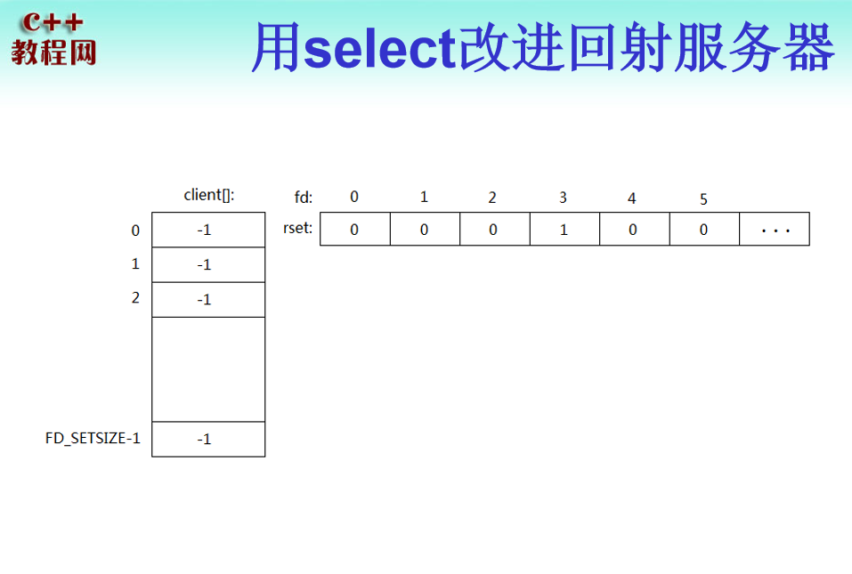

```c
void echo_srv(int conn)
{
	char recvbuf[1024];
        while (1)
        {
                memset(recvbuf, 0, sizeof(recvbuf));
                int ret = readline(conn, recvbuf, 1024);
		if (ret == -1)
			ERR_EXIT("readline");
		if (ret == 0)
		{
			printf("client close\n");
			break;
		}
		
                fputs(recvbuf, stdout);
                writen(conn, recvbuf, strlen(recvbuf));
        }
}

void handle_sigchld(int sig)
{
/*	wait(NULL);*/
	while (waitpid(-1, NULL, WNOHANG) > 0)
		;
}

int main(void)
{
/*	signal(SIGCHLD, SIG_IGN);*/
	signal(SIGCHLD, handle_sigchld);
	int listenfd;
	if ((listenfd = socket(PF_INET, SOCK_STREAM, IPPROTO_TCP)) < 0)
/*	if ((listenfd = socket(PF_INET, SOCK_STREAM, 0)) < 0)*/
		ERR_EXIT("socket");

	struct sockaddr_in servaddr;
	memset(&servaddr, 0, sizeof(servaddr));
	servaddr.sin_family = AF_INET;
	servaddr.sin_port = htons(5188);
	servaddr.sin_addr.s_addr = htonl(INADDR_ANY);
	/*servaddr.sin_addr.s_addr = inet_addr("127.0.0.1");*/
	/*inet_aton("127.0.0.1", &servaddr.sin_addr);*/

	int on = 1;
	if (setsockopt(listenfd, SOL_SOCKET, SO_REUSEADDR, &on, sizeof(on)) < 0)
		ERR_EXIT("setsockopt");

	if (bind(listenfd, (struct sockaddr*)&servaddr, sizeof(servaddr)) < 0)
		ERR_EXIT("bind");
	if (listen(listenfd, SOMAXCONN) < 0)
		ERR_EXIT("listen");

	struct sockaddr_in peeraddr;
	socklen_t peerlen;	
	int conn;

/*
	pid_t pid;
	while (1)
	{
		if ((conn = accept(listenfd, (struct sockaddr*)&peeraddr, &peerlen)) < 0)
			ERR_EXIT("accept");

		printf("ip=%s port=%d\n", inet_ntoa(peeraddr.sin_addr), ntohs(peeraddr.sin_port));

		pid = fork();
		if (pid == -1)
			ERR_EXIT("fork");
		if (pid == 0)
		{
			close(listenfd);
			echo_srv(conn);
			exit(EXIT_SUCCESS);
		}
		else
			close(conn);
	}
*/

	int i;
	int client[FD_SETSIZE];
	int maxi = 0;

	for (i=0; i<FD_SETSIZE; i++)
		client[i] = -1;

	int nready;
	int maxfd = listenfd;
	fd_set rset;
	fd_set allset;
	FD_ZERO(&rset);
	FD_ZERO(&allset);
	FD_SET(listenfd, &allset);
	while (1)
	{
		rset = allset;
        //返回已就绪的文件描述符个数
        //遍历的是[0,nfds)，所以需要加1
		nready = select(maxfd+1, &rset, NULL, NULL, NULL);
		if (nready == -1)
		{
			if (errno == EINTR)
				continue;
			
			ERR_EXIT("select");
		}
		if (nready == 0)
			continue;

		if (FD_ISSET(listenfd, &rset))
		{
			peerlen = sizeof(peeraddr);
			conn = accept(listenfd, (struct sockaddr*)&peeraddr, &peerlen);
			if (conn == -1)
				ERR_EXIT("accept");

			for (i=0; i<FD_SETSIZE; i++)
			{
				if (client[i] < 0)
				{
					client[i] = conn;  //这个数组只会存储conn，没有listenfd
					if (i > maxi)
						maxi = i;
					break;
				}
			}

			if (i == FD_SETSIZE)
			{
				fprintf(stderr, "too many clients\n");
				exit(EXIT_FAILURE);
			}
			printf("ip=%s port=%d\n", inet_ntoa(peeraddr.sin_addr), ntohs(peeraddr.sin_port));
			
			FD_SET(conn, &allset);
			if (conn > maxfd)
				maxfd = conn;   //更新

			if (--nready <= 0)  //已就绪的处理完，就没必要往下走了
				continue;

		}

		for (i=0; i<=maxi; i++)  //maxi是 不是很必要的优化
		{
			conn = client[i];
			if (conn == -1)   //没有被占用
				continue;  

			if (FD_ISSET(conn, &rset))  
			{
				char recvbuf[1024] = {0};
				int ret = readline(conn, recvbuf, 1024);
                if (ret == -1)
                	ERR_EXIT("readline");
                    if (ret == 0)
                	{
                     	printf("client close\n");
					 	FD_CLR(conn, &allset);
						client[i] = -1;
                	}

                	fputs(recvbuf, stdout);
                	writen(conn, recvbuf, strlen(recvbuf));

				if (--nready <= 0) //已就绪的处理完，就没必要往下走了
					break;
				
			}
		}
	}	
	return 0;
}
```

### 6.10 socket编程（十）

close与shutdown区别：

close终止了数据传送的两个方向。

shutdown可以有选择的终止某个方向的数据传送或者终止数据传送的两个方向。

shutdown how=1就可以保证对等方接收到一个EOF字符，而不管其他进程是否已经打开了套接字。而close不能保证，直到套接字引用计数减为0时才发送。也就是说直到所有的进程都关闭了套接字。

### 6.11 socket编程（十一）

本章目标：

**套接字I/O超时设置方法用**

select实现超时

* read_timeout函数封装

* write_timeout函数封装

* accept_timeout函数封装

* connect_timeout函数封装


套接字I/O超时设置方法：

* alarm

* 套接字选项
  * SO_SNDTIMEO
  * SO_RCVTIMEO

* select

alarm：

```c
SIGALRM

void handler(int sig)
{
    return 0; //do nothing
}
singal(SIGALRM,handler);
alarm(5);
int ret=read(fd,buf,1024);
if(ret==-1&&errno==EINTR)  //5秒之内没有收到数据并且是被超时打断的
{
    errno=ETIMEOUT;
}
else if(ret>=0)
{
    alarm(0);  //收到了数据，关闭闹钟。
}
```

但是闹钟可能更多的会用于其他的用途，这时候我们设置的闹钟会和其他用途的闹钟产生冲突，解决起来比较麻烦。


```c
#include "sysutil.h"

/*
int ret;
ret = read_timeout(fd, 5);
if (ret == 0)
{
	read(fd, ...);
}
else if (ret == -1 && errno == ETIMEDOUT)
{
	timeout....
}
else
{
	ERR_EXIT("read_timeout");
}
*/

/**
 * read_timeout - 读超时检测函数，不含读操作
 * @fd: 文件描述符
 * @wait_seconds: 等待超时秒数，如果为0表示不检测超时，那么做正常的read
 * 成功（未超时）返回0，失败返回-1，超时返回-1并且errno = ETIMEDOUT
 */
int read_timeout(int fd, unsigned int wait_seconds)  //等于0返回0，那么做正常的read
{
	int ret = 0;
	if (wait_seconds > 0)
	{
		fd_set read_fdset;
		struct timeval timeout;

		FD_ZERO(&read_fdset);
		FD_SET(fd, &read_fdset);  //只检测这一个fd

		timeout.tv_sec = wait_seconds;   //只刻画秒
		timeout.tv_usec = 0;
		do
		{
			ret = select(fd + 1, &read_fdset, NULL, NULL, &timeout);
		} while (ret < 0 && errno == EINTR);  //防止信号中断

		if (ret == 0)  //没有发生变化的(没有读事件)，返回-1
		{
			ret = -1;
			errno = ETIMEDOUT;
		}
		else if (ret == 1)  //有一个发生了变化，此时调用read不会再阻塞
			ret = 0;
	}

	return ret;
}

/**
 * write_timeout - 读超时检测函数，不含写操作
 * @fd: 文件描述符
 * @wait_seconds: 等待超时秒数，如果为0表示不检测超时
 * 成功（未超时）返回0，失败返回-1，超时返回-1并且errno = ETIMEDOUT
 */
int write_timeout(int fd, unsigned int wait_seconds)
{
	int ret = 0;
	if (wait_seconds > 0)
	{
		fd_set write_fdset;
		struct timeval timeout;

		FD_ZERO(&write_fdset);
		FD_SET(fd, &write_fdset);

		timeout.tv_sec = wait_seconds;
		timeout.tv_usec = 0;
		do
		{
			ret = select(fd + 1, NULL, NULL, &write_fdset, &timeout);
		} while (ret < 0 && errno == EINTR);

		if (ret == 0)
		{
			ret = -1;
			errno = ETIMEDOUT;
		}
		else if (ret == 1)
			ret = 0;
	}

	return ret;
}

/**
 * accept_timeout - 带超时的accept
 * @fd: 传递监听的套接字
 * @addr: 输出参数，返回对方地址
 * @wait_seconds: 等待超时秒数，如果为0表示正常模式
 * 成功（未超时）返回已连接(通信)套接字，超时返回-1并且errno = ETIMEDOUT
 */
int accept_timeout(int fd, struct sockaddr_in *addr, unsigned int wait_seconds)
{
	int ret;
	socklen_t addrlen = sizeof(struct sockaddr_in);

	if (wait_seconds > 0)
	{
		fd_set accept_fdset;
		struct timeval timeout;
		FD_ZERO(&accept_fdset);
		FD_SET(fd, &accept_fdset);
		timeout.tv_sec = wait_seconds;
		timeout.tv_usec = 0;
		do
		{
			ret = select(fd + 1, &accept_fdset, NULL, NULL, &timeout);
		} while (ret < 0 && errno == EINTR);
		if (ret == -1)
			return -1;
		else if (ret == 0)
		{
			errno = ETIMEDOUT;
			return -1;
		}
	}

	if (addr != NULL)   //保存对方地址
		ret = accept(fd, (struct sockaddr*)addr, &addrlen);
	else
		ret = accept(fd, NULL, NULL); //不保存对方地址
	if (ret == -1)
		ERR_EXIT("accept");
	return ret;
}

/**
 * activate_noblock - 设置I/O为非阻塞模式
 * @fd: 文件描符符
 */
void activate_nonblock(int fd)
{
	int ret;
	int flags = fcntl(fd, F_GETFL);
	if (flags == -1)
		ERR_EXIT("fcntl");

	flags |= O_NONBLOCK;
	ret = fcntl(fd, F_SETFL, flags);
	if (ret == -1)
		ERR_EXIT("fcntl");
}

/**
 * deactivate_nonblock - 设置I/O为阻塞模式
 * @fd: 文件描符符
 */
void deactivate_nonblock(int fd)
{
	int ret;
	int flags = fcntl(fd, F_GETFL);
	if (flags == -1)
		ERR_EXIT("fcntl");

	flags &= ~O_NONBLOCK;
	ret = fcntl(fd, F_SETFL, flags);
	if (ret == -1)
		ERR_EXIT("fcntl");
}


/**
 * connect_timeout - connect
 * @fd: 套接字
 * @addr: 要连接的对方地址
 * @wait_seconds: 等待超时秒数，如果为0表示正常模式
 * 成功（未超时）返回0，失败返回-1，超时返回-1并且errno = ETIMEDOUT
 */
int connect_timeout(int fd, struct sockaddr_in *addr, unsigned int wait_seconds)
{
	int ret;
	socklen_t addrlen = sizeof(struct sockaddr_in);

	if (wait_seconds > 0)
		activate_nonblock(fd);

	ret = connect(fd, (struct sockaddr*)addr, addrlen);
	if (ret < 0 && errno == EINPROGRESS)
	{
		printf("AAAAA\n");
		fd_set connect_fdset;
		struct timeval timeout;
		FD_ZERO(&connect_fdset);
		FD_SET(fd, &connect_fdset);
		timeout.tv_sec = wait_seconds;
		timeout.tv_usec = 0;
		do
		{
			/* 一量连接建立，套接字就可写 */
			ret = select(fd + 1, NULL, &connect_fdset, NULL, &timeout);
		} while (ret < 0 && errno == EINTR);
		if (ret == 0)
		{
			ret = -1;
			errno = ETIMEDOUT;
		}
		else if (ret < 0)
			return -1;
		else if (ret == 1)
		{
			printf("BBBBB\n");
			/* ret返回为1，可能有两种情况，一种是连接建立成功，一种是套接字产生错误，*/
			/* 此时错误信息不会保存至errno变量中，因此，需要调用getsockopt来获取。 */
			int err;
			socklen_t socklen = sizeof(err);
			int sockoptret = getsockopt(fd, SOL_SOCKET, SO_ERROR, &err, &socklen);
			if (sockoptret == -1)
			{
				return -1;
			}
			if (err == 0)
			{
				printf("DDDDDDD\n");
				ret = 0;
			}
			else
			{
				printf("CCCCCC\n");
				errno = err;
				ret = -1;
			}
		}
	}
	if (wait_seconds > 0)
	{
		deactivate_nonblock(fd);
	}
	return ret;
}

/**
 * readn - 读取固定字节数
 * @fd: 文件描述符
 * @buf: 接收缓冲区
 * @count: 要读取的字节数
 * 成功返回count，失败返回-1，读到EOF返回<count
 */
ssize_t readn(int fd, void *buf, size_t count)
{
	size_t nleft = count;
	ssize_t nread;
	char *bufp = (char*)buf;

	while (nleft > 0)
	{
		if ((nread = read(fd, bufp, nleft)) < 0)
		{
			if (errno == EINTR)
				continue;
			return -1;
		}
		else if (nread == 0)
			return count - nleft;

		bufp += nread;
		nleft -= nread;
	}

	return count;
}

/**
 * writen - 发送固定字节数
 * @fd: 文件描述符
 * @buf: 发送缓冲区
 * @count: 要读取的字节数
 * 成功返回count，失败返回-1
 */
ssize_t writen(int fd, const void *buf, size_t count)
{
	size_t nleft = count;
	ssize_t nwritten;
	char *bufp = (char*)buf;

	while (nleft > 0)
	{
		if ((nwritten = write(fd, bufp, nleft)) < 0)
		{
			if (errno == EINTR)
				continue;
			return -1;
		}
		else if (nwritten == 0)
			continue;

		bufp += nwritten;
		nleft -= nwritten;
	}

	return count;
}

/**
 * recv_peek - 仅仅查看套接字缓冲区数据，但不移除数据
 * @sockfd: 套接字
 * @buf: 接收缓冲区
 * @len: 长度
 * 成功返回>=0，失败返回-1
 */
ssize_t recv_peek(int sockfd, void *buf, size_t len)
{
	while (1)
	{
		int ret = recv(sockfd, buf, len, MSG_PEEK);
		if (ret == -1 && errno == EINTR)
			continue;
		return ret;
	}
}

/**
 * readline - 按行读取数据
 * @sockfd: 套接字
 * @buf: 接收缓冲区
 * @maxline: 每行最大长度
 * 成功返回>=0，失败返回-1
 */
ssize_t readline(int sockfd, void *buf, size_t maxline)
{
	int ret;
	int nread;
	char *bufp = buf;
	int nleft = maxline;
	while (1)
	{
		ret = recv_peek(sockfd, bufp, nleft);
		if (ret < 0)
			return ret;
		else if (ret == 0)
			return ret;

		nread = ret;
		int i;
		for (i=0; i<nread; i++)
		{
			if (bufp[i] == '\n')
			{
				ret = readn(sockfd, bufp, i+1);
				if (ret != i+1)
					exit(EXIT_FAILURE);

				return ret;
			}
		}

		if (nread > nleft)
			exit(EXIT_FAILURE);

		nleft -= nread;
		ret = readn(sockfd, bufp, nread);
		if (ret != nread)
			exit(EXIT_FAILURE);

		bufp += nread;
	}

	return -1;
}

```


### 6.12 socket编程（十二）

select限制：

用select实现的并发服务器，能达到的并发数，受两方面限制一个进程能打开的最大文件描述符限制。这可以通过调整内核参数。

select中的fd_set集合容量的限制（FD_SETSIZE） ，这需要重新编译内核。

poll：

```c
#include <poll.h>
int poll(struct pollfd *fds, nfds_t nfds, int timeout);
```

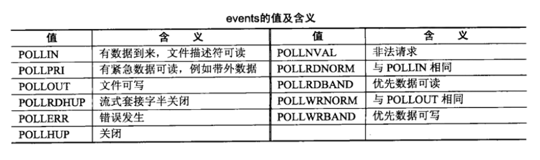

### UDP编程

本章目标

UDP特点

UDP客户/服务基本模型

UDP回射客户/服务器

UDP注意点

#### UDP特点

无连接

基于消息的数据传输服务

不可靠(丢失，乱序，重复，无流量ko)

一般情况下UDP更加高效。

#### UDP客户/服务基本模型

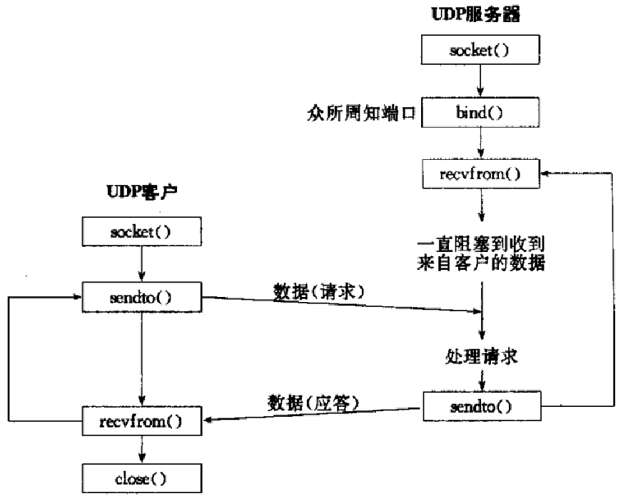


### UNIX域协议

本章目标：

UNIX域协议特点

UNIX域地址结构

UNIX域字节流回射客户/服务

UNIX域套接字编程注意点

#### UNIX域协议特点

UNIX域套接字(**==主要用于本机进程间进行通信==**)与TCP套接字相比较，**在同一台主机**的传输速度前者是后者的两倍。

UNIX域套接字可以在同一台主机上各进程之间传递描述符。

UNIX域套接字与传统套接字的区别是用路径名来表示协议族的描述。

#### UNIX域地址结构

可以使用man unix查看相关的信息。

```c
#define UNIX_PATH_MAX    108

struct sockaddr_un {                      /* PF_UNIX */ or /* PF_LOCAL */
	sa_family_t	sun_family;               /* AF_UNIX */ or /* AF_LOCAL */
	char		sun_path[UNIX_PATH_MAX];  /* pathname */  //地址的路径
};
```

#### UNIX域字节流回射客户/服务

服务器：

```c
#include <unistd.h>
#include <sys/types.h>
#include <sys/socket.h>
#include <sys/un.h>   //need
#include <stdlib.h>
#include <stdio.h>
#include <errno.h>
#include <string.h>

#define ERR_EXIT(m) \
        do \
        { \
                perror(m); \
                exit(EXIT_FAILURE); \
        } while(0)

void echo_srv(int conn)
{
	char recvbuf[1024];
	int n;
	while (1)
	{
		memset(recvbuf, 0, sizeof(recvbuf));
		n = read(conn, recvbuf, sizeof(recvbuf));
		if (n == -1)
		{
			if (n == EINTR)
				continue;

			ERR_EXIT("read");
		}
		else if (n == 0)
		{
			printf("client close\n");
			break;
		}

		fputs(recvbuf, stdout);
		write(conn, recvbuf, strlen(recvbuf));
	}

	close(conn);
}

int main(void)
{
	int listenfd;
	if ((listenfd = socket(PF_UNIX, SOCK_STREAM, 0)) < 0)
		ERR_EXIT("socket");

	unlink("/tmp/test_socket");  //这相当于设置了端口复用
	struct sockaddr_un servaddr;
	memset(&servaddr, 0, sizeof(servaddr));
	servaddr.sun_family = AF_UNIX;
	strcpy(servaddr.sun_path, "/tmp/test_socket"); //我们一般放到tmp目录下面
	
	if (bind(listenfd, (struct sockaddr*)&servaddr, sizeof(servaddr)) < 0)
		ERR_EXIT("bind");

	if (listen(listenfd, SOMAXCONN) < 0)
		ERR_EXIT("listen");

	int conn;
	pid_t pid;
	while (1)
	{
		conn = accept(listenfd, NULL, NULL);
		if (conn == -1)
		{
			if (conn == EINTR)
				continue;
			ERR_EXIT("accept");
		}

		pid = fork();
		if (pid == -1)
			ERR_EXIT("fork");

		if (pid == 0)
		{
			close(listenfd);
			echo_srv(conn);
			exit(EXIT_SUCCESS);
		}

		close(conn);
		
	}
	return 0;
}
```

客户端：

```c
#include <unistd.h>
#include <sys/types.h>
#include <sys/socket.h>
#include <sys/un.h>
#include <stdlib.h>
#include <stdio.h>
#include <errno.h>
#include <string.h>
void echo_cli(int sock)
{
	char sendbuf[1024] = {0};
	char recvbuf[1024] = {0};
	while (fgets(sendbuf, sizeof(sendbuf), stdin) != NULL)
	{
		write(sock, sendbuf, strlen(sendbuf));
		read(sock, recvbuf, sizeof(recvbuf));
		fputs(recvbuf, stdout);
		memset(sendbuf, 0, sizeof(sendbuf));
		memset(recvbuf, 0, sizeof(recvbuf));
	}
	close(sock);
}

int main(void)
{
	int sock;
	if ((sock = socket(PF_UNIX, SOCK_STREAM, 0)) < 0)
		ERR_EXIT("socket");

	struct sockaddr_un servaddr;
	memset(&servaddr, 0, sizeof(servaddr));
	servaddr.sun_family = AF_UNIX;
	strcpy(servaddr.sun_path, "/tmp/test_socket");

	if (connect(sock, (struct sockaddr*)&servaddr, sizeof(servaddr)) < 0)
		ERR_EXIT("connect");

	echo_cli(sock);
	return 0;
}
```


#### UNIX域套接字编程注意点

bind成功将会创建一个文件，权限为0777 & ~umask

sun_path最好用一个绝对路径(否则客户端与服务器不在同一目录时会报错：No such file or directory)

UNIX域协议支持流式套接口(即需要处理粘包问题，方案与以前一致)与报式套接口

UNIX域流式套接字connect发现监听队列满时，会立刻返回一个ECONNREFUSED，**这和TCP不同，如果监听队列满，会忽略到来的SYN，这导致对方重传SYN。**

### 传递fd

本章目标：

socketpair

sendmsg/recvmsg

UNIX域套接字传递描述符字

#### socketpair

功能：创建一个**==全双工==**的流管道，**==也仅用于具有亲缘关系或父子进程间进行通信==**。

原型

* int socketpair(int domain, int type, int protocol, int sv[2]);

参数domain: 协议家族

* type: 套接字类型

* protocol: 协议类型

* sv: **返回套接字对**

返回值：成功返回0；失败返回-1

pipe函数创建的是半双工的管道，单向通信，若想实现双向，应该创建两个pipe。并且只能用于具有亲缘关系的进程间通信，因为匿名管道pipe没有名字，只能是父子进程通过共享fd来进行通信。

pipe函数的fd[0]只能用于读，fd[1]只能用于写，这是固定的。而socketpair函数的sv[0]既可读也可以写，sv[1]也是同样。**但是数据需要流动，你要是使用sv[0]发送数据，那么必然只能用sv[1]来进行接收呀**。

eg：

```c
#include <unistd.h>
#include <sys/types.h>
#include <sys/socket.h>
#include <sys/un.h>
#include <stdlib.h>
#include <stdio.h>
#include <errno.h>
#include <string.h>

#define ERR_EXIT(m) \
        do \
        { \
                perror(m); \
                exit(EXIT_FAILURE); \
        } while(0)

int main(void)
{
	int sockfds[2];

	if (socketpair(PF_UNIX, SOCK_STREAM, 0, sockfds) < 0)
		ERR_EXIT("socketpair");

	pid_t pid;
	pid = fork();
	if (pid == -1)
		ERR_EXIT("fork");

	if (pid > 0)
	{
		int val = 0;
		close(sockfds[1]);
		while (1)
		{
			++val;
			printf("sending data:  %d\n", val);
			write(sockfds[0], &val, sizeof(val));  //不必转换为网络字节序，我们是本机通信
			read(sockfds[0], &val, sizeof(val));
			printf("data received: %d\n", val);
			sleep(1);
			
		}
	}
	else if (pid == 0)
	{
		int val;
		close(sockfds[0]);
		while (1)
		{
			read(sockfds[1], &val, sizeof(val));
			++val;
			write(sockfds[1], &val, sizeof(val));
		}
	}
	return 0;
}
```

同样的功能使用pipe来实现：

```c
int main(void)
{
	int fds1[2],fds2[2];
	pipe(fds1);
	pipe(fds2);
	
	pid_t pid;
	pid = fork();
	if (pid == -1)
		ERR_EXIT("fork");

	if (pid > 0)
	{
		int val = 0;
		close(fds1[0]);
		close(fds2[1]);
		while (1)
		{
			++val;
			printf("sending data:  %d\n", val);
			write(fds1[1], &val, sizeof(val));
			read(fds2[0], &val, sizeof(val));
			printf("data received: %d\n", val);
			sleep(1);
			
		}
	}
	else if (pid == 0)
	{
		int val;
		close(fds1[1]);
		close(fds2[0]);

		while (1)
		{
			read(fds1[0], &val, sizeof(val));
			++val;
			write(fds2[1], &val, sizeof(val));
		}
	}
	return 0;
}
```

#### sendmsg/recvmsg

文件描述符的传递只能够使用UNIX域协议，当前我们使用的是sockpair，在父子进程之间进行文件描述字的传递。**而如果想要在不相干的进程间进行文件描述字的传递，就需要使用到上一章节的unix域协议**。

man sendmsg：

```c
#include <sys/types.h>
#include <sys/socket.h>
ssize_t send(int sockfd, const void *buf, size_t len, int flags);
ssize_t sendto(int sockfd, const void *buf, size_t len, int flags,
                      const struct sockaddr *dest_addr, socklen_t addrlen); //ignore
ssize_t sendmsg(int sockfd, const struct msghdr *msg, int flags);

ssize_t recvmsg(int sockfd, struct msghdr *msg, int flags);
```

我们对比send和sendmsg函数，其实它们的功能是差不多的，**只是sendmsg更为强大，它能够传递文件描述符**。

```c
The  definition  of the msghdr structure follows.  See recv(2) and below for an exact
description of its fields.

struct msghdr {
	void         *msg_name;       /* optional address */ NULL
	socklen_t     msg_namelen;    /* size of address */  0
	struct iovec *msg_iov;        /* scatter/gather array */ 可以指向一个消息数组或者消息变量
	size_t        msg_iovlen;     /* # elements in msg_iov */ 若是消息数组，指定数组长度
	void         *msg_control;    /* ancillary data, see below */ 传递fd时需要的辅助信息
	size_t        msg_controllen; /* ancillary data buffer len */ 
	int           msg_flags;      /* flags on received message */ 默认填0就行
};

 You may send control information using the msg_control  and  msg_controllen  members.
 The maximum control buffer length the kernel can process is limited per socket by the
 value in /proc/sys/net/core/optmem_max; see socket(7).
```

man writev：

```c
The pointer iov points to an array of iovec structures, defined in <sys/uio.h> as:

struct iovec {
	void  *iov_base;    /* Starting address */  recv函数的buf
	size_t iov_len;     /* Number of bytes to transfer */ recv函数的len
};
```

**msghdr示意图**：
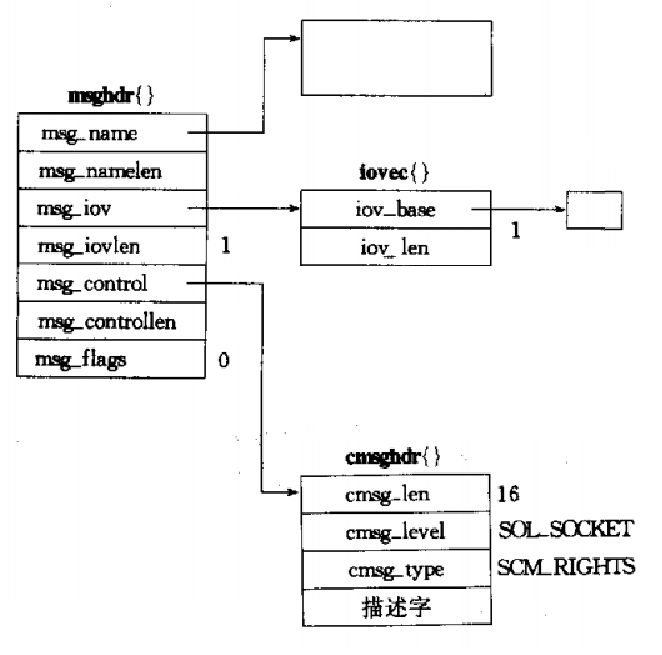


msg_iov是指针，所以它可以指向消息or变量。即可以有多个iovec()元素，相应的msg_iovlen也需要发生变化。

msg_control是控制(or辅助)信息(void*类型)，我们需要使用cmsghdr这个结构来进行填充。

man CMSG_FIRSTHDR：

```c
#include <sys/socket.h>

struct cmsghdr *CMSG_FIRSTHDR(struct msghdr *msgh);获取第一个辅助数据对象从msg变量中
获取下一个辅助数据对象从msg变量中
struct cmsghdr *CMSG_NXTHDR(struct msghdr *msgh, struct cmsghdr *cmsg);
size_t CMSG_ALIGN(size_t length);
size_t CMSG_SPACE(size_t length); //提供实际需要传送的数据的长度，获取整个辅助数据对象的大小
size_t CMSG_LEN(size_t length);   //提供实际需要传送的数据的长度，获取cmsg_len这个字段值
unsigned char *CMSG_DATA(struct cmsghdr *cmsg); //取得辅助数据示意图中的数据部分的地址

struct cmsghdr {
	size_t cmsg_len;    /* Data byte count, including header
                                  (type is socklen_t in POSIX) */
	int    cmsg_level;  /* Originating protocol */
	int    cmsg_type;   /* Protocol-specific type */
	/* followed by
	unsigned char cmsg_data[]; */
};
```

**辅助数据示意图：**

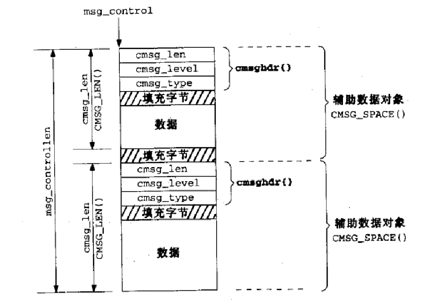

注意:cmsg_len这个字段值通过macro CMSG_LEN获取，但是不包含一个辅助数据对象大小的末尾部分填充字节。

eg:

```c
#include <unistd.h>
#include <sys/types.h>
#include <sys/socket.h>
#include <sys/un.h>
#include <stdlib.h>
#include <stdio.h>
#include <errno.h>
#include <string.h>
#include <fcntl.h>

#define ERR_EXIT(m) \
        do \
        { \
                perror(m); \
                exit(EXIT_FAILURE); \
        } while(0)


void send_fd(int sock_fd, int send_fd)
{
	int ret;
	struct msghdr msg;
	struct cmsghdr *p_cmsg;
	struct iovec vec;
    
	char cmsgbuf[CMSG_SPACE(sizeof(send_fd))];  //得到整个辅助数据对象的大小
	int *p_fds;
	char sendchar = 0;   //只是必要的发送了一个字节的数据。这是字符串结束标志，不是'0'。
                         //这里写'1'对方就能收到并打印这个数据
    //我们主要是填充这个msg变量啊
	msg.msg_control = cmsgbuf;
	msg.msg_controllen = sizeof(cmsgbuf);  //直接sizeof确定
                                   //就是获取第一个辅助数据对象从msg变量中
	p_cmsg = CMSG_FIRSTHDR(&msg);  //这个实际上是取得msg的msg_control字段，也就是cmsghdr这个结构
	p_cmsg->cmsg_level = SOL_SOCKET;
	p_cmsg->cmsg_type = SCM_RIGHTS;
	p_cmsg->cmsg_len = CMSG_LEN(sizeof(send_fd)); //填充cmsg_len这个字段，注意看那个图就行。
    
	p_fds = (int*)CMSG_DATA(p_cmsg);  //先取得辅助数据示意图中的数据部分的地址，下面行代码填入数据
	*p_fds = send_fd;  //填充辅助数据示意图中的数据部分，也就是我们待发送的套接字

	msg.msg_name = NULL;
	msg.msg_namelen = 0;
	msg.msg_iov = &vec;
	msg.msg_iovlen = 1;
	msg.msg_flags = 0;

	vec.iov_base = &sendchar;
	vec.iov_len = sizeof(sendchar);
    
	ret = sendmsg(sock_fd, &msg, 0);
	if (ret != 1)
		ERR_EXIT("sendmsg");
}

int recv_fd(const int sock_fd)
{
	int ret;
	struct msghdr msg;
	char recvchar;
	struct iovec vec;
	int recv_fd;
	char cmsgbuf[CMSG_SPACE(sizeof(recv_fd))];
	struct cmsghdr *p_cmsg;
	int *p_fd;
	vec.iov_base = &recvchar;
	vec.iov_len = sizeof(recvchar);
	msg.msg_name = NULL;
	msg.msg_namelen = 0;
	msg.msg_iov = &vec;
	msg.msg_iovlen = 1;
	msg.msg_control = cmsgbuf;
	msg.msg_controllen = sizeof(cmsgbuf);
	msg.msg_flags = 0;

	p_fd = (int*)CMSG_DATA(CMSG_FIRSTHDR(&msg));
	*p_fd = -1;  //我们又不发送什么，指定一个无意义数据即可
	ret = recvmsg(sock_fd, &msg, 0);
	if (ret != 1)
		ERR_EXIT("recvmsg");

	p_cmsg = CMSG_FIRSTHDR(&msg);   //渠道第一个HDR
	if (p_cmsg == NULL)
		ERR_EXIT("no passed fd");


	p_fd = (int*)CMSG_DATA(p_cmsg); //得到数据部分，也就fd
	recv_fd = *p_fd;
	if (recv_fd == -1)
		ERR_EXIT("no passed fd");
	printf("%s222\n",(char*)(msg.msg_iov->iov_base));
	printf("%s222\n",&recvchar);
	return recv_fd;
}

int main(void)
{
	int sockfds[2];

	if (socketpair(PF_UNIX, SOCK_STREAM, 0, sockfds) < 0)
		ERR_EXIT("socketpair");

	pid_t pid;
	pid = fork();
	if (pid == -1)
		ERR_EXIT("fork");

	if (pid > 0)
	{
		close(sockfds[1]);
		int fd = recv_fd(sockfds[0]);
		char buf[1024] = {0};
		read(fd, buf, sizeof(buf));
		printf("buf=%s\n", buf);
	}
	else if (pid == 0)
	{
		close(sockfds[0]);
		int fd;
		fd = open("test.txt", O_RDONLY);
		if (fd == -1);
		send_fd(sockfds[1], fd);
	}
	return 0;
}
```

## sendfile

函数原型：

因为只涉及内核间的拷贝，所以sendfile是比read then write更加快速的。

```c
#include <sys/sendfile.h>
ssize_t sendfile(int out_fd, int in_fd, off_t *offset, size_t count);
```

从in_fd读出数据，然后写入out_fd。

**offset参数指定从读入文件流的哪个位置开始读，如果为空，则使用读入文件流默认的起始位置。count参数指定文件描述符in_fd和out_fd之间传输的字节数**

The in_fd argument must correspond to a file which supports mmap(2)-like operations (i.e., it cannot be a socket).

返回值：

* 失败返回-1

* **==成功返回已发送的字节数==**

  

**==内核就是别人写的程序，它程序里的一个buf就是内核缓冲区==**。


**首先我们来看看传统的read/write方式==进行socket的传输==**。

当需要对一个文件进行传输的时候，具体流程细节如下：

#### 1：调用read函数，文件数据copy到内核缓冲区

#### 2：read函数返回，文件数据从内核缓冲区copy到用户缓冲区

#### 3：write函数调用，将文件数据从用户缓冲区copy到内核与socket相关的缓冲区

#### 4：数据从socket缓冲区copy到相关协议引擎。

在这个过程中发生了四次copy操作。

硬盘->内核->用户->socket缓冲区（内核）->协议引擎。

而sendfile的工作原理呢？？

1、系统调用 sendfile() 通过 DMA 把硬盘数据拷贝到 kernel buffer，然后数据被 kernel 直接拷贝到**另外一个与 socket 相关的 kernel buffer**。这里没有 用户态和核心态 之间的切换，**在内核中直接完成了从一个 buffer 到另一个 buffer 的拷贝**。
2、DMA 把数据从 kernel buffer 直接拷贝给协议栈，没有切换，也不需要数据从用户态和核心态，因为数据就在 kernel 里。

测试代码：
```c
#include<sys/socket.h>
#include<netinet/in.h>
#include<arpa/inet.h>
#include<signal.h>
#include<unistd.h>
#include<stdlib.h>
#include<assert.h>
#include<stdio.h>
#include<string.h>
#include<sys/sendfile.h>
#include<fcntl.h>
#include<sys/stat.h>
#include<sys/types.h>
#include<errno.h>

int main(int argc,char *argv[])
{
    if(argc<4)
    {
        printf("usage:%s ip_address port_number filename\n",basename(argv[0]));
        return 1;
    }
    const char* ip = argv[1];
    int port = atoi(argv[2]);
    const char* file_name = argv[3];

    int filefd = open(file_name,O_RDONLY);
    assert(filefd>0);

    struct stat stat_buf;
    fstat(filefd,&stat_buf);

    struct sockaddr_in address;

    bzero(&address,sizeof(address));
    address.sin_family = AF_INET;
    inet_pton(AF_INET,ip,&address.sin_addr);
    address.sin_port = htons(port);

    int sock = socket(PF_INET,SOCK_STREAM,0);
    assert(sock>=0);

    int ret = bind(sock,(struct sockaddr*)&address,sizeof(address));
    assert(ret!=-1);

    ret = listen(sock,5);
    assert(ret!=-1);

    struct sockaddr_in client;
    socklen_t client_addrlength = sizeof(client);

    int connfd = accept(sock,(struct sockaddr*)&client,&client_addrlength);

    if(connfd<0)
    {
        printf("errno is %d\n",errno);
    }
    else 
    {
        sendfile(connfd,filefd,NULL,stat_buf.st_size);
        close(connfd);
    }
    close(sock);
    return 0;
}
```

运行：

```c
[root@hadoop100 test]# ./a.out 192.168.10.100 11211 a.c
```

结果：

```c
[root@hadoop100 test]# telnet 192.168.10.100 11211
Trying 192.168.10.100...
Connected to 192.168.10.100.
Escape character is '^]'.
/*************************************************************************
	> File Name: a.c
	> Author: hero
	> Mail: @hero 
	> Created Time: 2022年09月06日 星期二 16时40分41秒
 ************************************************************************/

#include<sys/socket.h>
#include<netinet/in.h>
#include<arpa/inet.h>
#include<signal.h>
#include<unistd.h>
#include<stdlib.h>
#include<assert.h>
#include<stdio.h>
#include<string.h>
#include<sys/sendfile.h>
#include<fcntl.h>
#include<sys/stat.h>
#include<sys/types.h>
#include<errno.h>

int main(int argc,char *argv[])
{
    if(argc<=3)
    {
        printf("usage:%s ip_address port_number filename\n",basename(argv[0]));
        return 1;
    }
    const char* ip = argv[1];
    int port = atoi(argv[2]);
    const char* file_name = argv[3];

    int filefd = open(file_name,O_RDONLY);
    assert(filefd>0);

    struct stat stat_buf;
    fstat(filefd,&stat_buf);

    struct sockaddr_in address;

    bzero(&address,sizeof(address));
    address.sin_family = AF_INET;
    inet_pton(AF_INET,ip,&address.sin_addr);
    address.sin_port = htons(port);

    int sock = socket(PF_INET,SOCK_STREAM,0);
    assert(sock>=0);

    int ret = bind(sock,(struct sockaddr*)&address,sizeof(address));
    assert(ret!=-1);

    ret = listen(sock,5);
    assert(ret!=-1);

    struct sockaddr_in client;
    socklen_t client_addrlength = sizeof(client);

    int connfd = accept(sock,(struct sockaddr*)&client,&client_addrlength);

    if(connfd<0)
    {
        printf("errno is %d\n",errno);
    }
    else 
    {
        sendfile(connfd,filefd,NULL,stat_buf.st_size);
        close(connfd);
    }
    close(sock);
    return 0;
}
Connection closed by foreign host.
```

## capabilities

```bash
For  the  purpose of performing permission checks, traditional UNIX implementations distin‐
       guish two categories of processes: privileged processes (whose  effective  user  ID  is  0,
       referred  to  as  superuser  or  root),  and unprivileged processes (whose effective UID is
       nonzero).  Privileged processes bypass all kernel  permission  checks,  while  unprivileged
       processes  are subject to full permission checking based on the process's credentials (usu‐
       ally: effective UID, effective GID, and supplementary group list).
       # 一些附加组列表，进程在这个组，可能有这个组的一些权限。
       Starting with kernel 2.2, Linux divides the privileges traditionally associated with  supe‐
       ruser  into  distinct  units, known as capabilities, which can be independently enabled and
       disabled.  Capabilities are a per-thread attribute.
```

特权进程绕过所有的内核检测。

capabilities有一系列单元组成，每个单元可以单独使用。

我们关心：

```c
CAP_NET_BIND_SERVICE
       Bind a socket to Internet domain privileged ports (port numbers less than 1024).
```


```c
#include <sys/capability.h>   //不是sys,而是linux。查看具体信息的时候，这个man文档有点不准确。
int capget(cap_user_header_t hdrp, cap_user_data_t datap);
int capset(cap_user_header_t hdrp, const cap_user_data_t datap);
           //头                     //数据


define _LINUX_CAPABILITY_VERSION_1  0x19980330
#define _LINUX_CAPABILITY_U32S_1     1
    
#define _LINUX_CAPABILITY_VERSION_2  0x20071026
#define _LINUX_CAPABILITY_U32S_2     2

typedef struct __user_cap_header_struct {
	__u32 version;
	int pid;
} *cap_user_header_t;

typedef struct __user_cap_data_struct {
	__u32 effective;
	__u32 permitted;
	__u32 inheritable;
} *cap_user_data_t;
```


```shell
[root@hadoop100 fftp]# vim /usr/include/linux/capability.h 
```

```c
/* Allows binding to TCP/UDP sockets below 1024 */                                                   
/* Allows binding to ATM VCIs below 32 */

#define CAP_NET_BIND_SERVICE 10
```

我们要将第10位置为1，让他拥有绑定特权端口的特权。

```c
...000000000000000  //total 32 bit
...000001000000000  //or operation
...000001000000000  //result,so easy
```


直接调用capset会有警告，即使包含了头文件。实际上，capset是一个系统调用。所以我们可以自己封装一个capset函数(和上面的那个capset函数原型一模一样)，然后自己根据系统调用号去调用capset这个系统调用。

```shell
[root@hadoop100 fftp]# man syscall
[root@hadoop100 fftp]# vim /usr/include/sys/syscall.h 
查看该头文件没有实用的信息，但是它给出了下面这个头文件。
# include <bits/syscall.h> 

#so
[root@hadoop100 fftp]# vim /usr/include/bits/syscall.h 
#ifdef __NR_capset                                                                       # define SYS_capset __NR_capset
#endif
```

所以`__NR_capset`就是capset的系统调用号。意思是说，系统提供的capset函数内部实现就是调用的该系统调用，现在既然你系统提供的capset函数包含了相应头文件，仍然有警告。那么我自己实现一个capset函数，然后内部调用该系统调用即可。

实现代码：

```c
int capset(cap_user_header_t hdrp, const cap_user_data_t datap)
{
    return syscall(__NR_capset, hdrp, datap);
}
```

