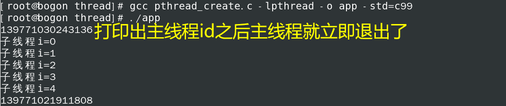

## 第三章 进程和线程

### 3.1进程控制

### 3.7多线程

#### 1.线程概述

==线程是轻量级的进程==（LWP：light weight process），**在 Linux 环境下线程的本质仍是进程**。在计算机上运行的程序是一组指令及指令参数的组合，指令按照既定的逻辑控制计算机运行。操作系统会**以进程为单位，分配系统资源**，可以这样理解，==进程是资源分配的最小单位，线程是操作系统调度执行的最小单位。==

先从概念上了解一下线程和进程之间的区别：

* ==进程有自己独立的地址空间，多个线程共用同一个地址空间==

  * **线程更加节省系统资源，效率不仅可以保持的，而且能够更高**

  * 在一个地址空间中多个线程独享：**==每个线程都有属于自己的栈区，寄存器 (内核中管理的)==**

    ​                              **==这里明明都说了每条线程有自己的栈了！！！==**

  * **在一个地址空间中多个线程共享**：`代码段`，`堆区`，`全局数据区`，`打开的文件 (文件描述符表)`，`当前工作目录` 都是线程共享的

* 线程是程序的最小执行单位，进程是操作系统中最小的资源分配单位
  * **每个进程对应一个虚拟地址空间，一个进程只能抢一个 CPU 时间片**
  * ==一个地址空间中可以划分出多个线程，在有效的资源基础上，能够抢更多的 CPU 时间片==
  * 
  * **这张图中的是一种理想状态，线程不可能像图中这样有序的交替执行，每个线程去抢占CPU时间片的时候，都是随机的，这是一个概率问题。这个图是为了大家看起更加的直观。有可能线程1前三次都抢到了时间片，线程2前10次都没抢到过**。
  * 多线程一定是一种无序的运行状态。
  
* CPU 的调度和切换：线程的上下文切换比进程要快的多

  上下文切换：进程 / 线程分时复用 CPU 时间片，在切换之前会将上一个任务的状态进行保存，下次切换回这个任务的时候，加载这个状态继续运行，==任务从保存到再次加载这个过程就是一次上下文切换。==

* 线程更加廉价，启动速度更快，退出也快，对系统资源的冲击小。

* 在处理多任务程序的时候使用多线程比使用多进程要更有优势，**但是线程并不是越多越好**，如何控制线程的个数呢？

  1. 文件 IO 操作：**文件 IO 对 CPU 是使用率不高，**因此可以分时复用 CPU 时间片，**线程的个数 = 2 * CPU 核心数 (效率最高)**。

  2. 处理复杂的算法 (主要是 CPU 进行运算，压力大)，**线程的个数 = CPU 的核心数 (效率最高)**

* 在进行并发处理的时候，我们是使用多线程还是多进程呢？

  * **进程池用于管理多个进程, 线程池用于管理多个线程，目的是让多进程、多线程操作更加简便。**因此问题就变成了**什么时候使用多进程和什么时候使用多线程，二者都能实现程序的并发**，==一般情况下优先考虑多线程，线程占用系统资源更少一些==，如果没有这方面的考虑就无所谓了。==**另外如果需要在一个应用程序中启动另外一个应用程序，此时就需要使用多进程了。**==
  * **比如说在360里边启动鲁大师，驱动精灵啥的，用的就是多进程。**
  * **如果是运行程序内部自带模块可以使用多线程**
  * 经常听到“插件”一词，他们一般都是以应用程序出现的，调用“插件”也会创建一个新进程的对吧？？？
  * 插件可以从项目中独立出去单独开发， 也可以做到项目里边作为模块处理。这就得看实际需求了，耦合度高就放到项目里边，耦合度低就可以拿出来单独开发。

#### 2 创建线程

##### 2.1 线程函数

* ==**我们在linux中创建的一定是一个子线程，而不是主线程。**==**因为主线程默认是存在的，怎么来的呢？**当我们启动一个程序会得到一个进程，在这个进程中调用了线程创建函数得到了子线程，**原来的这个进程就会退化为主线程。**因此，从一个单进程的应用程序变成了多线程的应用程序。==当我们程序中的主线程退出之后，这个地址空间也就不存在了，地址空间不存在了，那么这个子线程也就随即被销毁了，这是默认情况下。==**当然了，我们也可以让主线程自己退出，让子线程继续运行，这是调用一些操作函数可以实现的。**
* 函数规则：`pthread_  `作为前缀
  * ID------>`self`
  * 创建--->`create` 只有它需要&tid。
  * 退出--->`exit`
  * 回收--->`join`
  * 分离--->`detach`

​    每一个线程都有一个唯一的线程 ID，ID 类型为 `pthread_t`，这个 ID 是一个**无符号长整形数**，如果想要得

​    到当前线程的线程 ID，可以调用如下函数：          

​	`pthread_t pthread_self(void);	// 返回当前线程的线程ID`

​       **在一个进程中调用线程创建函数，就可得到一个子线程**，**==和进程不同==，需要给每一个创建出的线程指定** 

​       **一个处理函数，否则这个线程无法工作。**

* ```c++
  #include <pthread.h>  //线程库
  int pthread_create(pthread_t *thread, const pthread_attr_t *attr,
                     void *(*start_routine) (void *), void *arg);
  //void * 代表泛型
  //void *(*start_routine) (void *) 指向一个任务函数，然后子线程去执行
  // Compile and link with -pthread, 线程库的名字叫pthread(动态库,编译时加-l), 
  //全名: libpthread.so libptread.a
  ```

* 参数:
  * thread: **传出参数**，==是无符号长整形数==，**线程创建成功，==会将线程 ID 写入到这个指针指向的内存中==**
  * attr: 线程的属性，**一般情况下使用默认属性即可，写 NULL**
  * start_routine: 函数指针，创建出的**子线程的处理动作(外部传入一个函数名)**，也就是该函数在子线程中执行。**指向一个该线程中处理某个操作的函数(指向传入的那个函数)。就是这个函数指针变量用于指向传入的函数地址**
  * arg: **作为实参**传递到 ==**start_routine 指针指向的函数内部**==。就是作为实参传入到你传入的函数(**==就是传给函数指针的那个函数)的内部==**。`就是传递到回调函数内部`。
* 返回值：**线程创建成功返回 0，**创建失败返回对应的错误号


**==这个线程一旦被创建，那么它的回调函数(任务)就会立即被执行。不是libevent那样的事件发生了才会去执行对应的回调呀！！！别和libevent弄混了。==**

##### 2.2 创建线程

下面是创建线程的示例代码，在创建过程中一定要保证编写的线程函数与规定的函数指针类型一致：

`void *(*start_routine) (void *)`。

```c
#include<stdio.h>
#include<stdlib.h>
#include<pthread.h>
#include<string.h>
#include<unistd.h>
#include<windows.h>
void * callback(void * arg)  //子线程的任务函数，
{                            //被线程创建进函数的函数指针类型的变量所指向。
    for(int i=0;i<5;++i)
    {
        printf("子线程i=%d\n",i); 
    }
    printf("%ld\n",pthread_self());  //打出子线程id
    return NULL;
}
int main()
{
    pthread_t tid; //线程id
    pthread_create(&tid,NULL,callback,NULL); //第一个参数是传出参数，将创建的线程的id传递出去。
    for(int i=0;i<5;++i)
    {
        printf("主线程i=%d\n",i);
    }
    printf("%ld\n",pthread_self());  //打出主线程id,无符号长整形
   //sleep(30);  //睡一会,让子线程有时间片得以执行。
                 //还有一种阻塞方式是使用线程回收函数。
    return 0;
}
```

编译测试程序，会看到如下错误信息：

```SHELL
$ gcc pthread_create.c 
/tmp/cctkubA6.o: In function `main':
pthread_create.c:(.text+0x7f): undefined reference to `pthread_create'
collect2: error: ld returned 1 exit status
```

**错误原因是因为编译器链接不到线程库文件（==动态库==），需要==在编译的时候通过参数指定出来，动态库名为 libpthread.so 需要使用的参数为 -l==，根据规则掐头去尾最终形态应该写成**：**`-lpthread`（参数和参数值中间可以有空格）**。正确的编译命令为：

```shell
# pthread_create 函数的定义在某一个库中, 编译的时候需要加库名 pthread
$ gcc pthread_create.c -lpthread
$ ./a.out 
子线程创建成功, 线程ID: 139712560109312
我是主线程, 线程ID: 139712568477440
i = 0
i = 1
i = 2
```

运行结果：


在打印的日志输出中为什么**子线程处理函数没有执行完毕呢（只看到了子线程的部分日志输出，==有可能部分输出都看不到==，只要主线程执行的任务很少，那么这个时间会非常快。）**？
**主线程一直在运行，==执行期间创建出了子线程，说明主线程有 CPU 时间片==，在这个时间片内将代码执行完毕了，主线程就退出了。子线程被创建出来之后==需要抢cpu时间片, 抢不到就不能运行，如果主线程退出了, 虚拟地址空间就被释放了, 子线程就一并被销毁了==。==但是如果某一个子线程退出了, 主线程仍在运行, 虚拟地址空间依旧存在==。**

得到的结论：**在没有人为干预的情况下，==虚拟地址空间的生命周期和主线程是一样的==，与子线程无关。**

**目前的**解决方案：让子线程执行完毕，主线程再退出，**可以在主线程中添加==挂起==函数 sleep();**

* **延时函数**

  ```c
  #include <unistd.h>
  sleep(1);//1表示延时一秒，与windows下的Sleep(1);不同，Sleep(1)表示延时1毫秒，如果需要延时一毫秒，在linux下需要使用usleep(1000);  单位是微秒
  ```

#### 3. 线程退出

在编写多线程程序的时候，**如果想要让线程退出，==但是不会导致虚拟地址空间的释放（主要是针对于主线程退出）==，我们就可以调用线程库中的线程退出函数，==只要调用该函数当前线程就马上退出了，并且不会影响到其他线程的正常运行，不管是在子线程或者主线程中都可以使用==。**

```c
#include <pthread.h>
void pthread_exit(void *retval); //return value
```

* 参数：**线程退出的时候==携带(传出)==的数据，==当前子线程的主线程会得到该数据==。如果不需要使用，指定为 NULL。**
* **==谁回收这个子线程，谁就能够拿到传出来的数据。==**

下面是线程退出的示例代码，可以在任意线程的需要的位置调用该函数：

```c
#include<stdio.h>
#include<stdlib.h>
#include<pthread.h>
#include<string.h>
#include<unistd.h>
void * callback(void * arg)
{
    for(int i=0;i<5;++i)
    {
        printf("子线程i=%d\n",i);
    }
    printf("%ld\n",pthread_self());
    return NULL;
}
int main()
{
    pthread_t tid; //线程id
    pthread_create(&tid,NULL,callback,NULL); 
    printf("%ld\n",pthread_self());
    pthread_exit(NULL);   // 主线程调用退出函数退出, 地址空间不会被释放
    return 0;
}
```

运行结果：



#### 4. 线程回收

**==`线程退出`可以时传出数据，我们就可以使用线程回收函数对传出的数据进行回收。==**

##### 4.1 线程函数

线程和进程一样，**子线程退出的时候其==内核资源==主要由==主线程回收==，线程库中提供的线程回收函叫做**`pthread_join()`，**这个函数是一个==阻塞函数==，==如果还有子线程在运行==，调用该函数就会阻塞，子线程退出后，函数解除阻塞进行资源的回收，==函数被调用一次，只能回收一个子线程==，如果有多个子线程则需要==循环进行回收==。**

**另外还可以通过==线程回收函数==还==可以获取到子线程退出时传递出来的数据==**，函数原型如下：

```c
#include <pthread.h>
// 这是一个阻塞函数, 子线程在运行这个函数就阻塞
// 子线程退出, 函数解除阻塞, 回收对应的子线程资源, 类似于回收进程使用的函数 wait()
int pthread_join(pthread_t thread, void **retval);
```

* 参数:
  * thread: 要被回收的子线程的线程 ID
  
  * retval: **二级指针，==指向一级指针的地址，是一个传出参数==，这个地址中存储了 pthread_exit () ==传递出的数据==，如果不需要这个参数，可以指定为 NULL**。
  
  * 简单说一下这个`**retval`的工作原理。
  
    ```c++
    struct Test
    {
        int num;
        int age;
    };
    
    void * callback(void * arg)
    {
        for(int i=0;i<5;++i)
        {
            printf("子线程i=%d\n",i);
        }
        printf("%ld\n",pthread_self());
      struct Test t;  //子线程的栈空间,子线程结束后会被释放
        t.num=100;
      t.age=6;
        pthread_exit(&t);  //子线程退出
        return NULL;
    }
    
    int main()
    {
        void *ptr;
        // ptr是一个传出参数, 在函数内部让这个指针指向一块有效内存
        // 这个内存地址就是pthread_exit() 参数指向的内存
        // 就是让ptr指向传出来的数据的地址空间
        pthread_join(tid,&ptr);   // 阻塞等待子线程退出
        struct Test* pt=(struct Test*) ptr;
        printf("num:%d age=%d\n",pt->num,pt->age);
    }
    ```
    
    结构体变量t为子线程退出时需要携带传出的数据，我们对传出参数ptr进行&ptr（取地址），然后在
    
     `pthread_join`函数的实现中对其`*retval`得到`ptr`（解引用,因为ptr的地址传给了retval嘛。），**即执行`*retval=&t or *retval=retval（pthread_exit中的）`。就是想说明这个函数内部的执行方式是对二级指针解引用得到其外部原来的那个指针变量(如ptr)，然后让ptr指向传出来的数据的地址**。当然数据是由`pthread_exit `函数的形参传出来的。
  
* 返回值：线程回收成功返回 0，回收失败返回错误号。

##### 4.2  回收子线程数据

**在子线程退出的时候可以使用 `pthread_exit() `的参数==将数据传出==，线程创建函数中的函数指针返回的是`void *`，是可以返回数据的，但是我们接收不到，所以通过`pthread_exit`函数的参数传出数据(待删)，在回收这个子线程的时候可以通过 phread_join() 的==第二个参数来接收子线程传递出的数据==。接收数据有很多种处理方式**，下面来列举几种：

###### 4.2.1 使用子线程栈

通过函数 `pthread_exit(void *retval); `可以得知，子线程退出的时候，需要将数据记录到一块内存中，通过参数传出的是存储数据的内存的地址，而不是具体数据，由因为参数是 void* 类型，所有这个万能指针可以指向任意类型的内存地址。先来看第一种方式，将子线程退出数据保存在子线程自己的栈区：

```c
#include<stdio.h>
#include<stdlib.h>
#include<pthread.h>
#include<string.h>
#include<unistd.h>
struct Test
{
    int num;
    int age;
};
void * callback(void * arg)
{
    for(int i=0;i<5;++i)
    {
        printf("子线程i=%d\n",i);
    }
    printf("%ld\n",pthread_self());
    struct Test t;  //子线程的栈空间,子线程结束后会被释放
    t.num=100;
    t.age=6;
    pthread_exit(&t);  //子线程退出
    return NULL;
}
int main()
{
    pthread_t tid; //线程id
    pthread_create(&tid,NULL,callback,NULL); 
    printf("%ld\n",pthread_self());
    void *ptr;
    // ptr是一个传出参数, 在函数内部让这个指针指向一块有效内存
    // 这个内存地址(有效内存)就是pthread_exit() 的参数指向的内存
    // 就是让ptr指向传出来的数据的地址空间
    pthread_join(tid,&ptr);   // 阻塞等待子线程退出
    struct Test* pt=(struct Test*) ptr;
    printf("num:%d age=%d\n",pt->num,pt->age);
    return 0;
}
```

运行结果：


* 与返回局部变量的引用是一个道理。
* **如果多个线程共用同一个虚拟地址空间，==每个线程在栈区都有一块属于自己的内存，相当于栈区被这几个线程平分了==，当线程退出，==线程在栈区的内存也就被回收了，因此随着子线程的退出，写入到栈区的数据也就被释放了==。**

###### 4.2.2 使用全局变量

位于同一虚拟地址空间中的线程，**虽然不能共享栈区数据，但是可以共享全局数据区和堆区数据，==因此在子线程退出的时候可以将传出数据存储到全局变量、静态变量或者堆内存中==**。在下面的例子中将数据存储到了全局变量中：

```c
#include<stdio.h>
#include<stdlib.h>
#include<pthread.h>
#include<string.h>
#include<unistd.h>
struct Test
{
    int num;
    int age;
};
struct Test t;  //全局变量
void * callback(void * arg)
{
    for(int i=0;i<5;++i)
    {
        printf("子线程i=%d\n",i);
    }
    printf("%ld\n",pthread_self());
    t.num=100;
    t.age=6;
    pthread_exit(&t);
    return NULL;
}
int main()
{
    pthread_t tid; //线程id
    pthread_create(&tid,NULL,callback,NULL); 
    printf("%ld\n",pthread_self());
    void *ptr;
    pthread_join(tid,&ptr);   
    struct Test* pt=(struct Test*) ptr;
    printf("num:%d age=%d\n",pt->num,pt->age);
    return 0;
}
```

运行结果


*****

###### 4.2.3 使用主线程栈

虽然每个线程都有属于自己的栈区空间，但是位于同一个地址空间的多个线程是可以相互访问对方的栈空间上的数据的。由于很多情况下还需要在主线程中回收子线程资源，所以主线程一般都是最后退出，基于这个原因在下面的程序中将子线程返回的数据保存到了主线程的栈区内存中：

```c
#include<stdlib.h>
#include<pthread.h>
#include<string.h>
#include<unistd.h>
#include<stdio.h>
struct Test
{
    int num;
    int age;
};
void * callback(void * arg)
{
    for(int i=0;i<5;++i)
    {
        printf("子线程i=%d\n",i);
    }
    printf("%ld\n",pthread_self());
    struct Test* t=(struct Test*)arg;
    t->num=100;
    t->age=6;
    pthread_exit(t); //传出数据t,t本来就是地址，不必再&t
    return NULL;
}
int main()
{
    struct Test t;
    pthread_t tid; //线程id
    pthread_create(&tid,NULL,callback,&t); //将主线程栈的数据通过参数传递给子线程(的任务处理函数)
    printf("%ld\n",pthread_self());        //就是传递给那个arg参数
    void *ptr;
    pthread_join(tid,&ptr);
    struct Test* pt=(struct Test*) ptr;
    printf("num:%d age=%d\n",pt->num,pt->age);//也可将写入主线程栈中的数据传出到别的参数中(如ptr)
    printf("num:%d age=%d\n",t.num,t.age);  //在子线程中往主线程栈中写入了数据
    return 0;
}
```

运行结果：


**在上面的程序中，调用 pthread_create() 创建子线程，==并将主线程中栈空间变量 t 的地址传递到了子线程中，在子线程中将要传递出的数据写入到了这块内存中==。也就是说在程序的 main() 函数中，通过==指针变量 ptr== 或者通过==结构体变量 p 都可以读出子线程传出的数据==。**

#### 5.线程分离(==实用特性==)

在某些情况下，**程序中的==主线程有属于自己的业务处理流程，如果让主线程负责子线程的资源回收==，调用 pthread_join() ==只要==子线程不退出==主线程就会一直被阻塞，主要线程的任务也就不能被执行了==。**

**在线程库函数中为我们提供了线程分离函数 pthread_detach()，调用这个函数之后指定的子线程就可以和主线程分离，当子线程退出的时候，==其占用的内核资源就被系统的其他进程接管并回收了==。线程分离之后在主线程中使用 pthread_join() ==就回收不到子线程资源了==。**

```c
#include <pthread.h>
// 参数就子线程的线程ID, 主线程就可以和这个子线程分离了
int pthread_detach(pthread_t thread);
```

下面的代码中，在主线程中创建子线程，并调用线程分离函数，实现了主线程和子线程的分离：

```c
#include<stdlib.h>
#include<pthread.h>
#include<string.h>
#include<unistd.h>
#include<stdio.h>
struct Test
{
    int num;
    int age;
};
void * callback(void * arg)
{
    for(int i=0;i<5;++i)
    {
        printf("子线程i=%d\n",i);
    }
    printf("%ld\n",pthread_self());
    struct Test* t=(struct Test*)arg;
    t->num=100;
    t->age=6;
    pthread_exit(t); //传出数据t,t本来就是地址，不必再&t
    return NULL;
}
int main()
{
    struct Test t;
    pthread_t tid; //线程id
    pthread_create(&tid,NULL,callback,&t); //将主线程栈的数据通过参数传递给子线程(的任务处理函数)
    printf("%ld\n",pthread_self());
    //让主线程和子线程进行分离
    pthread_detach(tid);
    //主线程自己退出即可
    pthread_exit(NULL);
    return 0;
}
```

* ==**值得注意的是：如果没有主线程自己退出这行代码`pthread_exit(NULL);`，那么主线程结束后会释放空间，导致子线程可能不能运行结束(甚至无法运行)。因为线程分离的目的只是让这条子线程的主线程不再去阻塞等待回收子线程的资源(由其他的东西去回收)，但是并没有造成虚拟地址空间的分离。**==

#### 6. 其他线程函数

##### 6.1 线程取消

线程取消的意思就是**在某些特定情况下在一个线程中杀死另一个线程。==使用这个函数杀死一个线程需要分两步==**：

1. **在线程 A 中调用线程取消函数 pthread_cancel，指定杀死线程 B，==这时候线程 B 是死不了的==**
2. **在线程 B 中进行一次系统调用(==间接的系统调用也行)（从用户区切换到内核区==），==否则==线程 B 可以一直运行。**

这其实和`七步断肠散`、`含笑半步癫`的功效是一样的，吃了毒药不动或者不笑也没啥事儿。

```c
#include <pthread.h>
// 参数是子线程的线程ID
int pthread_cancel(pthread_t thread);
```

* 参数：要杀死的线程的线程 ID
* 返回值：函数调用成功返回 0，调用失败返回非 0 错误号。

在下面的示例代码中，主线程调用线程取消函数，只要在子线程中进行了系统调用，当子线程执行到这个位置就挂掉了。

```c
#include <stdio.h>
#include <stdlib.h>
#include <unistd.h>
#include <string.h>
#include <pthread.h>

// 子线程的处理代码
void* working(void* arg)
{
    int j=0;
    for(int i=0; i<9; ++i)
    {
        j++;
    }
    // 这个函数会调用系统函数, 因此这是个间接的系统调用
    printf("我是子线程, 线程ID: %ld\n", pthread_self());
    for(int i=0; i<9; ++i)
    {
        printf(" child i: %d\n", i); //间接的系统调用
    }
    return NULL;
}

int main()
{
    // 1. 创建一个子线程
    pthread_t tid;
    pthread_create(&tid, NULL, working, NULL);

    printf("子线程创建成功, 线程ID: %ld\n", tid);
    // 2. 子线程不会执行下边的代码, 主线程执行
    printf("我是主线程, 线程ID: %ld\n", pthread_self());
    for(int i=0; i<3; ++i)
    {
        printf("i = %d\n", i);
    }

    // 杀死子线程, 如果子线程中做系统调用, 子线程就结束了
    pthread_cancel(tid);

    // 让主线程自己退出即可
    pthread_exit(NULL);
    
    return 0;
}
```

关于==系统调用有两种==方式：

1. **==直接调用== Linux 系统函数**
2. **调用标准 C 库函数，为了实现某些功能，在 Linux 平台下标准 C 库函数会调用相关的系统函数(==间接==)**

##### 6.2 线程 ID 比较

在 Linux 中**==线程 ID 本质就是一个无符号长整形==**，因此**==可以直接使用比较操作符比较两个线程的 ID==，但是线程库是可以跨平台使用的，==在某些平台上 pthread_t 可能不是一个单纯的整形==，这中情况下比较两个线程的 ID 必须要使用比较函数，函数原型如下：**

```c
#include <pthread.h>
int pthread_equal(pthread_t t1, pthread_t t2);
```

* 参数：t1 和 t2 是要比较的线程的线程 ID。
* 返回值：如果两个线程 ID 相等返回非 0 值，如果不相等返回 0。
* 不太重要，更多的是为了扩展来考虑。

### 3.8线程同步

#### 1. 线程同步概念

假设有 4 个线程 A、B、C、D，当前一个线程 A 对内存中的**共享资源**进行访问的时候，其他线程 B, C, D 都不可以对这块内存进行操作，**直到线程 A 对这块内存访问完毕为止，B，C，D 中的一个才能访问这块内存，剩余的两个需要继续阻塞等待，以此类推，直至所有的线程都对这块内存操作完毕。 线程对内存的这种访问方式就称之为线程同步**，通过对概念的介绍，我们可以了解到**所谓的同步==并不是多个线程同时对内存进行访问==，==而是按照先后顺序依次进行的==。**

##### 1.1 为什么要同步

在研究线程同步之前，先来看一个两个线程交替数数（每个线程数 50 个数，交替数到 100）的例子：

```c
#include <stdio.h>
#include <unistd.h>
#include <stdlib.h>
#include <sys/types.h>
#include <sys/stat.h>
#include <string.h>
#include <pthread.h>

#define MAX 50
// 全局变量
int number;

// 线程处理函数
void* funcA_num(void* arg)
{
    for(int i=0; i<MAX; ++i)
    {
        int cur = number;
        cur++;
        usleep(10);   //挂起
        number = cur;
        printf("Thread A, id = %lu, number = %d\n", pthread_self(), number);
    }

    return NULL;
}

void* funcB_num(void* arg)
{
    for(int i=0; i<MAX; ++i)
    {
        int cur = number;
        cur++;
        number = cur;
        printf("Thread B, id = %lu, number = %d\n", pthread_self(), number);
        usleep(5);  //挂起
    }

    return NULL;
}

int main(int argc, const char* argv[])
{
    pthread_t p1, p2;
    // 创建两个子线程
    pthread_create(&p1, NULL, funcA_num, NULL);
    pthread_create(&p2, NULL, funcB_num, NULL);
    // 阻塞，资源回收
    pthread_join(p1, NULL);
    pthread_join(p2, NULL);
    return 0;
}
```

编译并执行上面的测试程序，得到如下结果：

```c++
$ ./a.out 
Thread B, id = 140504473724672, number = 1
Thread B, id = 140504473724672, number = 2
Thread A, id = 140504482117376, number = 2
Thread B, id = 140504473724672, number = 3
Thread A, id = 140504482117376, number = 4
Thread B, id = 140504473724672, number = 5
Thread A, id = 140504482117376, number = 6
Thread B, id = 140504473724672, number = 7
Thread B, id = 140504473724672, number = 8
Thread A, id = 140504482117376, number = 7
Thread B, id = 140504473724672, number = 8
Thread B, id = 140504473724672, number = 9
Thread A, id = 140504482117376, number = 8
Thread B, id = 140504473724672, number = 9
Thread A, id = 140504482117376, number = 9
Thread B, id = 140504473724672, number = 10
Thread B, id = 140504473724672, number = 11
Thread A, id = 140504482117376, number = 10
Thread B, id = 140504473724672, number = 11
Thread A, id = 140504482117376, number = 11
Thread B, id = 140504473724672, number = 12
Thread A, id = 140504482117376, number = 13
Thread B, id = 140504473724672, number = 14
Thread A, id = 140504482117376, number = 15
Thread B, id = 140504473724672, number = 16
Thread B, id = 140504473724672, number = 17
Thread B, id = 140504473724672, number = 18
Thread B, id = 140504473724672, number = 19
Thread A, id = 140504482117376, number = 17
Thread B, id = 140504473724672, number = 18
Thread B, id = 140504473724672, number = 19
Thread A, id = 140504482117376, number = 19
Thread B, id = 140504473724672, number = 20
Thread A, id = 140504482117376, number = 20
Thread B, id = 140504473724672, number = 21
Thread A, id = 140504482117376, number = 21
Thread B, id = 140504473724672, number = 22
Thread A, id = 140504482117376, number = 22
Thread B, id = 140504473724672, number = 23
Thread A, id = 140504482117376, number = 23
Thread B, id = 140504473724672, number = 24
Thread A, id = 140504482117376, number = 24
Thread B, id = 140504473724672, number = 25
Thread A, id = 140504482117376, number = 25
Thread B, id = 140504473724672, number = 26
Thread A, id = 140504482117376, number = 26
Thread B, id = 140504473724672, number = 27
Thread A, id = 140504482117376, number = 27
Thread B, id = 140504473724672, number = 28
Thread A, id = 140504482117376, number = 28
Thread B, id = 140504473724672, number = 29
Thread A, id = 140504482117376, number = 29
Thread B, id = 140504473724672, number = 30
Thread A, id = 140504482117376, number = 30
Thread B, id = 140504473724672, number = 31
Thread A, id = 140504482117376, number = 31
Thread B, id = 140504473724672, number = 32
Thread A, id = 140504482117376, number = 32
Thread B, id = 140504473724672, number = 33
Thread A, id = 140504482117376, number = 33
Thread B, id = 140504473724672, number = 34
Thread A, id = 140504482117376, number = 34
Thread B, id = 140504473724672, number = 35
Thread A, id = 140504482117376, number = 35
Thread B, id = 140504473724672, number = 36
Thread A, id = 140504482117376, number = 36
Thread B, id = 140504473724672, number = 37
Thread A, id = 140504482117376, number = 37
Thread B, id = 140504473724672, number = 38
Thread A, id = 140504482117376, number = 38
Thread B, id = 140504473724672, number = 39
Thread A, id = 140504482117376, number = 39
Thread A, id = 140504482117376, number = 40
Thread B, id = 140504473724672, number = 41
Thread B, id = 140504473724672, number = 42
Thread A, id = 140504482117376, number = 42
Thread A, id = 140504482117376, number = 43
Thread B, id = 140504473724672, number = 44
Thread B, id = 140504473724672, number = 45
Thread A, id = 140504482117376, number = 45
Thread B, id = 140504473724672, number = 46
Thread A, id = 140504482117376, number = 46
Thread B, id = 140504473724672, number = 47
Thread A, id = 140504482117376, number = 47
Thread B, id = 140504473724672, number = 48
Thread A, id = 140504482117376, number = 48
Thread B, id = 140504473724672, number = 49
Thread A, id = 140504482117376, number = 50
Thread B, id = 140504473724672, number = 51
Thread A, id = 140504482117376, number = 51
Thread B, id = 140504473724672, number = 52
Thread A, id = 140504482117376, number = 53
Thread A, id = 140504482117376, number = 54
Thread A, id = 140504482117376, number = 55
Thread A, id = 140504482117376, number = 56
Thread A, id = 140504482117376, number = 57
Thread A, id = 140504482117376, number = 58
Thread A, id = 140504482117376, number = 59
Thread A, id = 140504482117376, number = 60
Thread A, id = 140504482117376, number = 61
robin@OS:~/abc/b$ 
```

**通过对上面例子的测试，可以看出虽然每个线程内部循环了 50 次每次数一个数，==但是number最终没有数到 100==，通过输出的结果可以看到，==有些数字被重复数了多次==，其==原因就是没有对线程进行同步处理==，造成了数据的混乱。**

**两个线程在数数的时候需要==分时复用 CPU 时间片==，并且测试程序中调用了 sleep() 导致==线程的 CPU 时间片没用完就被迫挂起了，这样就能让 CPU 的上下文切换==（保存当前状态，下一次继续运行的时候需要加载保存的状态）更加频繁，==更容易再现数据混乱的这个现象==。**

**==事实上，不休眠也会混乱。==**


CPU 对应寄存器、一级缓存、二级缓存、三级缓存是独占的，用于存储处理的数据和线程的状态信息，数据被 CPU 处理完成需要再次被写入到物理内存中，物理内存数据也可以通过文件 IO 操作写入到磁盘中。

**在测试程序中两个线程共用全局变量 number 当线程变成运行态之后开始数数，从物理内存加载数据，让后将数据放到 CPU 进行运算，最后将结果更新到物理内存中。如果数数的两个线程都可以顺利完成这个流程，那么得到的结果肯定是正确的。**

如果**线程 A 执行这个过程期间就失去了 CPU 时间片**，线程 A 被挂起了**==最新的数据没能更新到物理内存==**。线程 B **变成运行态之后从物理内存读数据，==很显然它没有拿到最新数据，只能基于旧的数据往后数==，然后失去 CPU 时间片挂起**。**==线程 A== 得到 CPU 时间片变成运行态，第一件事儿就是==将上次没更新到内存的数据更新到内存==，但是这样==会导致线程 B 已经更新到内存的数据被覆盖==，活儿白干了，==最终导致有些数据会被重复数很多次。==**

##### 1.2 同步方式

对于多个线程访问共享资源出现数据混乱的问题，需要进行线程同步。常用的线程同步方式有四种：**互斥锁、读写锁、条件变量、信号量**。所谓的共享资源就是多个线程共同访问的变量，这些变量通常为全局数据区变量或者堆区变量，这些变量对应的共享资源也被称之为临界资源。


找到临界资源之后，再找和临界资源相关的上下文代码，这样就得到了一个代码块，这个代码块可以称之为临界区。确定好临界区（临界区越小越好）之后，就可以进行线程同步了，线程同步的大致处理思路是这样的：

* 在临界区代码的上边，添加加锁函数，对临界区加锁。
  * 哪个线程调用这句代码，就会把这把锁锁上，其他线程就只能阻塞在锁上了。
* 在临界区代码的下边，添加解锁函数，对临界区解锁。
  * 出临界区的线程会将锁定的那把锁打开，其他抢到锁的线程就可以进入到临界区了。
* 通过锁机制能保证临界区代码最多只能同时有一个线程访问，这样并行访问就变为串行访问了。

#### 2. 互斥锁

##### 2.1 互斥锁函数

**互斥锁是线程同步最常用的一种方式，==通过互斥锁可以锁定一个代码块，被锁定的这个代码块，所有的线程只能顺序执行 (不能并行处理)，这样多线程访问共享资源数据混乱的问题就可以被解决了==，需要付出的==代价就是执行效率的降低，因为默认临界区多个线程是可以并行处理的，现在只能串行处理==。**

在 Linux 中**互斥锁的类型为 pthread_mutex_t**，创建一个**==这种类型的变量就得到了一把互斥锁==**：

```c
pthread_mutex_t  mutex; //pthread_mutex_t 锁的类型
```

在创建的**锁对象中保存了当前这把锁的状态信息**：**锁定还是打开，==如果是锁定状态还记录了给这把锁加锁的线程信息（`线程 ID`）==**。**==`一个互斥锁变量同一时刻只能被一个线程锁定，被锁定之后其他线程再对互斥锁变量加锁就会被阻塞，直到这把互斥锁被解锁，被阻塞的线程才能被解除阻塞`==。一般情况下，==每一个共享资源对应一个把互斥锁，锁的个数和线程的个数无关。`只有加锁的线程才能来解锁(只有加的那个人能够解开，解铃还需系铃人。)`==。**

Linux 提供的互斥锁操作函数如下，如果函数调用成功会返回 0，调用失败会返回相应的错误号：

```c
// 初始化互斥锁
// restrict: 是一个关键字, 用来修饰指针, 只有这个关键字修饰的指针可以访问指向的内存地址, 其他指针是不行的
//就是说不能pthread_mutex_t * p=mutex;
//然后通过p去访问这把锁。

int pthread_mutex_init(pthread_mutex_t *restrict mutex,
           const pthread_mutexattr_t *restrict attr);

// 释放互斥锁资源            
int pthread_mutex_destroy(pthread_mutex_t *mutex);
```

* 参数:
  * mutex: 互斥锁变量的地址
  * attr: 互斥锁的属性，一般使用默认属性即可，这个参数指定为 NULL

******

```c
// 修改互斥锁的状态, 将其设定为锁定状态, 这个状态被写入到参数 mutex 中
// 在函数内部修改了mutex(锁)的值会被同步记录，因为传递的是指针。
int pthread_mutex_lock(pthread_mutex_t *mutex);
```

这个函数被调用，首先会判断参数 mutex 互斥锁中的状态是不是锁定状态:

* **没有被锁定，是打开的，这个线程可以加锁成功，==这个锁中会记录是哪个线程加锁成功了==。**
* **如果被锁定了，其他线程加锁就失败了，==这些线程都会阻塞在这把锁上。==**
* **当这把锁被解开之后，这些阻塞在锁上的线程就解除阻塞了，==并且这些线程是通过`竞争`的方式对这把锁加锁，没抢到锁的线程继续阻塞==。**


```c
// 尝试加锁
int pthread_mutex_trylock(pthread_mutex_t *mutex);
```

调用这个函数对互斥锁变量加锁还是有两种情况:

* 如果这把锁没有被锁定是打开的，线程加锁成功
* **如果锁变量被锁住了，==调用这个函数加锁的线程，不会被阻塞==，加锁失败直接返回错误号**。

```c
// 对互斥锁解锁
int pthread_mutex_unlock(pthread_mutex_t *mutex);
```

**==不是所有的线程都可以对互斥锁解锁，哪个线程加的锁，哪个线程才能解锁成功。==**

**==值得注意的是：`在线程同步期间锁的资源一定不能被释放了，即锁尽量不要在栈区(意思说锁类型的变量不要定义在栈区)`，即使要，也需要在合理的栈区。==**

**`#include <pthread.h>`为锁的头文件。**

##### 2.2 互斥锁使用

我们可以将上面多线程交替数数的例子修改一下，使用互斥锁进行线程同步。==两个线程一共操作了同一个全局变量，因此需要添加一互斥锁，来控制这两个线程==。

```c
#include <stdio.h>
#include <unistd.h>
#include <stdlib.h>
#include <sys/types.h>
#include <sys/stat.h>
#include <string.h>
#include <pthread.h>

#define MAX 50
// 全局变量
int number;

// 创建一把互斥锁
// 全局变量, 多个线程共享
pthread_mutex_t mutex;

// 线程处理函数
void* funcA_num(void* arg)
{
    for(int i=0; i<MAX; ++i)
    {
        // 如果线程A加锁成功, 不阻塞
        // 如果B加锁成功, 线程A阻塞
        pthread_mutex_lock(&mutex);
        
        int cur = number;
        cur++;
        usleep(10);
        number = cur;
        
        pthread_mutex_unlock(&mutex);
        printf("Thread A, id = %lu, number = %d\n", pthread_self(), number);
    }

    return NULL;
}

void* funcB_num(void* arg)
{
    for(int i=0; i<MAX; ++i)
    {
        // a加锁成功, b线程访问这把锁的时候是锁定的
        // 线程B先阻塞, a线程解锁之后阻塞解除
        // 线程B加锁成功了
        pthread_mutex_lock(&mutex);
        
        int cur = number;
        cur++;
        number = cur;
        
        pthread_mutex_unlock(&mutex);
        printf("Thread B, id = %lu, number = %d\n", pthread_self(), number);
        usleep(5);
    }

    return NULL;
}

int main(int argc, const char* argv[])
{
    pthread_t p1, p2;

    // 初始化互斥锁
    pthread_mutex_init(&mutex, NULL);

    // 创建两个子线程
    pthread_create(&p1, NULL, funcA_num, NULL);
    pthread_create(&p2, NULL, funcB_num, NULL);

    // 阻塞，资源回收
    pthread_join(p1, NULL);
    pthread_join(p2, NULL);

    // 销毁互斥锁
    // 线程销毁之后, 再去释放互斥锁
    pthread_mutex_destroy(&mutex);

    return 0;
}
```

**这种模型是两个线程有各自的功能函数**，但是因为互斥锁变量是全局的，所以它们都可以操作这把锁。

它们也都需要操作这把锁，因为这两个不同的功能函数都需要对全局变量number进行操作。

下面的生产者消费者模型。我们有同样有两个不同功能的函数，但是每个功能函数上都存在5条线程。

**==也就是这个功能函数(这个任务)，你可以请一个工人，也可以请多个工人来做，这是很自然的，依据你的工作量而定==**。下面的黄色字体与这里的说法是不违背的，"一条线程=一个函数=一个任务"，只是不同的线程可以对应同一个任务嘛，最后始终是"一条线程=一个任务"。

> 下面的多线程并发有提到：这个任务内部也可以分为不同的case，让多个工人做自己对应的case，根据这个工人传入线程参数的不同。当然，也可以多个工人做完全一样的事情(传入线程的参数直接填NULL)，取决于你不是吗。


线程可以就简单的理解为一个函数，它可以打印一行"hello world"之后立即结束自己的生命周期。

也可以打印固定的MAX行"hello world"之后立即结束自己的生命周期。

也可以一直循环的打印"hello world"，随进程一起结束自己的生命周期。

**==那么一条线程=一个函数=一个任务，这个任务做多久，怎么做，由你来决定不是吗==**。


如果只是**打印一次**或**固定的MAX次**这样的计算密集型任务，我们可以设计一个线程池来循环的利用这些线程，而不是频繁的创建，销毁线程。

**如果是循环打印"hello world"这样的IO密集型任务，线程池就没有用武之地了，我们创建一条线程，让它的生命周期和进程一致即可**。


运行结果：（B运气比较好，抢到了大部分时间片）


#### 3.死锁

当多个线程访问共享资源，需要加锁，如果锁使用不当，就会造成死锁这种现象。如果线程死锁造成的后果是：**所有的线程都被阻塞，并且线程的阻塞是无法解开的（==因为可以解锁的线程也被阻塞了==）。**

造成死锁的场景有如下几种：

* **加锁之后忘记解锁**

  ```c
  // 场景1
  void func()
  {
      for(int i=0; i<6; ++i)
      {
          // 当前线程A加锁成功, 当前循环完毕没有解锁, 在下一轮循环的时候自己被阻塞了
          // 其余的线程也被阻塞（如果想访问当前这个线程锁住的东西的话）
      	pthread_mutex_lock(&mutex);
      	....
      	.....
          // 忘记解锁
      }
  }
  
  // 场景2
  void func()
  {
      for(int i=0; i<6; ++i)
      {
          // 当前线程A加锁成功
          // 其余的线程被阻塞
      	pthread_mutex_lock(&mutex);
      	....
      	.....
          if(xxx)
          {
              // 函数退出, 没有解锁（解锁函数无法被执行了）
              return ;
          }
          
          pthread_mutex_lock(&mutex);
      }
  }
  ```

* 重复加锁，造成死锁(直接死)

  ```c
  void func()
  {
      for(int i=0; i<6; ++i)
      {
          // 当前线程A加锁成功
          // 其余的线程阻塞
      	pthread_mutex_lock(&mutex);
          
          // 锁被锁住了, A线程阻塞
          pthread_mutex_lock(&mutex); 即使是你锁住的，你想要再使用，你也得竞争。但是现在是锁住
                                      状态，所以你先阻塞。
      	....
      	.....
          pthread_mutex_unlock(&mutex);
      }
  }
  
  // 隐藏的比较深的情况
  void funcA()
  {
      for(int i=0; i<6; ++i)
      {
          // 当前线程A加锁成功
          // 其余的线程阻塞
      	pthread_mutex_lock(&mutex);
      	....
      	.....
          pthread_mutex_unlock(&mutex);
      }
  }
  
  void funcB()
  {
      for(int i=0; i<6; ++i)
      {
          // 当前线程A加锁成功
          // 其余的线程阻塞
      	pthread_mutex_lock(&mutex);
          funcA();		// 重复加锁  间接重复加锁
      	....
      	.....
          pthread_mutex_unlock(&mutex);
      }
  }
  ```

* 在程序中有多个共享资源，因此有很多把锁，随意加锁，导致相互被阻塞

  ```text
  场景描述:
    1. 有两个共享资源:X, Y，X对应锁A, Y对应锁B
       - 线程A访问资源X, 加锁A
       - 线程B访问资源Y, 加锁B
    2. 线程A要访问资源Y, 线程B要访问资源X，因为资源X和Y已经被对应的锁锁住了，因此这个两个线程被阻塞
       - 线程A被锁B阻塞了, 无法打开A锁
       - 线程B被锁A阻塞了, 无法打开B锁
  ```

​       

在使用多线程编程的时候，如何避免死锁呢？

* **避免多次锁定，多检查**

* **对共享资源访问完毕之后，一定要解锁，或者在加锁的使用 trylock**

* **如果程序中有多把锁，可以控制对锁的访问顺序 (顺序访问共享资源，但在有些情况下是做不到的)，==另外也可以在对其他互斥锁做加锁操作之前，先释放当前线程拥有的互斥锁。==**

* **项目程序中可以引入一些专门用于死锁检测的模块**

#### 4.读写锁

##### 4.1  读写锁函数

**读写锁是互斥锁的升级版，在做读操作的时候可以提高程序的执行效率，如果所有的线程都是做读操作, 那么读是并行的，但是使用互斥锁，读操作也是串行的**。

**==读写锁是一把锁==，锁的类型为 pthread_rwlock_t，有了类型之后就可以创建一把互斥锁了：**

```c
pthread_rwlock_t rwlock;
```

**之所以称其为读写锁，是因为这把锁既可以锁定读操作，也可以锁定写操作。**为了方便理解，可以大致认为在这把锁中记录了这些信息：

* 锁的状态：锁定 / 打开
* **锁定的是什么操作：读操作 / 写操作，使用读写锁锁定了读操作，需要先解锁才能去锁定写操作，反之亦然。**
  **哪个线程将这把锁锁上了**
* **读写锁的使用方式也互斥锁的使用方式是完全相同的：找共享资源，确定临界区，在临界区的开始位置加锁（读锁 / 写锁），临界区的结束位置解锁。**

因为通过一把读写锁可以锁定读或者写操作，下面介绍一下关于读写锁的特点：

1. **使用读写锁的==读锁==锁定了临界区，==线程对临界区的访问是并行的==，读锁是共享的。**
2. **使用读写锁的==写锁==锁定了临界区，==线程对临界区的访问是串行的==，写锁是==独占==的**。
3. **使用读写锁分别对两个临界区加了读锁和写锁，两个线程要同时访问者两个临界区，访问写锁临界区的线程继续运行，访问读锁临界区的线程阻塞，因为==写锁比读锁的优先级高==。**

**如果说程序中所有的线程都==对共享资源做写操作，使用读写锁没有优势，和互斥锁是一样的==，如果说程序中所有的线程都对==共享资源有写也有读操作==，并且对共享资源==读的操作越多，读写锁更有优势==。**

Linux 提供的读写锁操作函数原型如下，如果函数调用成功返回 0，失败返回对应的错误号：

```c
#include <pthread.h>
pthread_rwlock_t rwlock;
// 初始化读写锁
int pthread_rwlock_init(pthread_rwlock_t *restrict rwlock,
           const pthread_rwlockattr_t *restrict attr);
// 释放读写锁占用的系统资源
int pthread_rwlock_destroy(pthread_rwlock_t *rwlock);
```

* 参数:
  * rwlock: 读写锁的地址，传出参数
  * attr: 读写锁属性，一般使用默认属性，指定为 NULL

```c
// 在程序中对读写锁加读锁, 锁定的是读操作
int pthread_rwlock_rdlock(pthread_rwlock_t *rwlock);
```

**调用这个函数，如果读写锁是打开的，那么加锁成功；==如果读写锁已经锁定了读操作，调用这个函数依然可以加锁成功，因为读锁是共享的==；如果读写锁==已经锁定了写操作，调用这个函数的线程会被阻塞==。**

```c
// 这个函数可以有效的避免死锁
// 如果加读锁失败, 不会阻塞当前线程, 直接返回错误号
int pthread_rwlock_tryrdlock(pthread_rwlock_t *rwlock);
```

**调用这个函数，如果读写锁是打开的，那么加锁成功；如果读写锁已经锁定了读操作，调用这个函数依然可以加锁成功，因为读锁是共享的；如果读写锁已经锁定了写操作，==调用这个函数加锁失败，对应的线程不会被阻塞==，可以在程序中对函数返回值进行判断，添加加锁失败之后的处理动作。**

```c
// 在程序中对读写锁加写锁, 锁定的是写操作
int pthread_rwlock_wrlock(pthread_rwlock_t *rwlock);
```

**调用这个函数，如果读写锁是打开的，那么加锁成功；如果读写锁==已经锁定了读操作或者锁定了写操作==，调用这个函数的线程会被阻塞。**

```c
// 这个函数可以有效的避免死锁
// 如果加写锁失败, 不会阻塞当前线程, 直接返回错误号
int pthread_rwlock_trywrlock(pthread_rwlock_t *rwlock);
```

**调用这个函数，如果读写锁是打开的，那么加锁成功；如果读写锁==已经锁定了读操作或者锁定了写操作，调用这个函数加锁失败，但是线程不会阻塞==，可以在程序中对函数返回值进行判断，添加加锁失败之后的处理动作。**

```c
// 解锁, 不管锁定了读还是写都可用解锁
int pthread_rwlock_unlock(pthread_rwlock_t *rwlock);
```

* rd
  * tryrd (read)
* wr
  * trywr (write)

##### 4.2 读写锁使用

题目要求：8 个线程操作同一个全局变量，3 个线程不定时写同一全局资源，5 个线程不定时读同一全局资源。

```c
#include <stdio.h>
#include <stdlib.h>
#include <unistd.h>
#include <string.h>
#include <pthread.h>

// 全局变量
int number = 0;

// 定义读写锁
pthread_rwlock_t rwlock;

// 写的线程的处理函数
void* writeNum(void* arg)
{
    while(1)
    {
        pthread_rwlock_wrlock(&rwlock);
        int cur = number;
        cur ++;
        number = cur;
        printf("++写操作完毕, number : %d, tid = %ld\n", number, pthread_self());
        pthread_rwlock_unlock(&rwlock);
        // 添加sleep目的是要看到多个线程交替工作
        usleep(rand() % 100);
    }

    return NULL;
}

// 读线程的处理函数
// 多个线程可以如果处理动作相同, 可以使用相同的处理函数
// 每个线程中的栈资源是独享
void* readNum(void* arg)
{
    while(1)
    {
        pthread_rwlock_rdlock(&rwlock);
        printf("--全局变量number = %d, tid = %ld\n", number, pthread_self());
        pthread_rwlock_unlock(&rwlock);
        usleep(rand() % 100);
    }
    return NULL;
}

int main()
{
    // 初始化读写锁
    pthread_rwlock_init(&rwlock, NULL);

    // 3个写线程, 5个读的线程
    pthread_t wtid[3];
    pthread_t rtid[5];
    for(int i=0; i<3; ++i)
    {
        pthread_create(&wtid[i], NULL, writeNum, NULL);
    }

    for(int i=0; i<5; ++i)
    {
        pthread_create(&rtid[i], NULL, readNum, NULL);
    }

    // 释放资源
    for(int i=0; i<3; ++i)
    {
        pthread_join(wtid[i], NULL);
    }

    for(int i=0; i<5; ++i)
    {
        pthread_join(rtid[i], NULL);
    }

    // 销毁读写锁
    pthread_rwlock_destroy(&rwlock);

    return 0;
}
```

#### 5. 条件变量

##### 5.1 条件变量函数

**严格意义上来说，==条件变量的主要作用不是处理线程同步，而是进行线程的阻塞==。==如果==在多线程程序中==只使用条件变量无法实现线程的同步，必须要配合互斥锁来使用==。虽然条件变量和互斥锁都能阻塞线程，但是二者的==效果是不一样的==，二者的区别如下：**

* 锁是可以无条件阻塞线程的。

* **条件变量==只有==在`满足指定条件下`==才会阻塞线程，==如果条件不满足，多个线程可以同时进入临界区，同时读写临界资源，这种情况下还是会出现共享资源中数据的混乱。所以条件变量还是需要配合上互斥锁来使用。**

**一般情况下条件变量==用于处理生产者和消费者模型，并且和互斥锁配合使用==。条件变量类型对应的类型为 `pthread_cond_t`，这样就可以定义一个条件变量类型的变量了**：

```c
pthread_cond_t cond;
```

**==被条件变量阻塞的线程==的==线程信息会被记录到这个变量中==，以便在解除阻塞的时候使用。**

**注意：既然是`阻塞的线程信息`，那么就可能是一条或==多条线程==。这不是很明显吗，==哪个线程调用函数的时候使用了这个变量，哪个线程就会阻塞在这个变量上==。**


条件变量操作函数函数原型如下：

```c
#include <pthread.h>
pthread_cond_t cond;
// 初始化
int pthread_cond_init(pthread_cond_t *restrict cond,
      const pthread_condattr_t *restrict attr);
// 销毁释放资源        
int pthread_cond_destroy(pthread_cond_t *cond);
```

* 参数
  * **cond: 条件变量的地址**
  * **attr: 条件变量属性，一般使用默认属性，指定为 NULL**

```c
// 线程阻塞函数, 哪个线程调用这个函数, 哪个线程就会被阻塞
int pthread_cond_wait(pthread_cond_t *restrict cond, pthread_mutex_t *restrict mutex);
// 条件等待
```

> ==线程阻塞函数, 哪个线程调用这个函数, 哪个线程就会被阻塞。==

**通过函数原型可以看出，==该函数在阻塞线程的时候，`需要一个互斥锁参数`==，这个互斥锁==主要功能是`进行线程同步，让线程顺序进入临界区，避免出现数共享资源的数据混乱`==。==该函数==会对这个互斥锁==做以下几件事情==：**


**在阻塞线程时候，==如果线程已经对互斥锁 mutex 上锁，那么会将这把锁打开，这样做是`为了避免死锁`==**
**==当线程解除阻塞的时候，函数内部会帮助这个线程再次将这个 mutex 互斥锁锁上，继续向下访问临界区==**

解锁--->阻塞--->被唤醒--->加锁。

**==千万要注意这个函数具有加锁和解锁的功能==**。

```c
// 表示的时间是从1971.1.1到某个时间点的时间, 总长度使用秒/纳秒表示
struct timespec {
	time_t tv_sec;      /* Seconds */
	long   tv_nsec;     /* Nanoseconds [0 .. 999999999] */
};
// 将线程阻塞一定的时间长度, 时间到达之后, 线程就解除阻塞了
int pthread_cond_timedwait(pthread_cond_t *restrict cond,
           pthread_mutex_t *restrict mutex, const struct timespec *restrict abstime);
```

**这个函数的前两个参数和 `pthread_cond_wait` 函数是一样的，第三个参数表示线程阻塞的时长，但是需要额外注意一点：`struct timespec` ==这个结构体中记录的时间是从1971.1.1到某个时间点的时间，总长度使用秒/纳秒表示==。因此赋值方式相对要麻烦一点：**。**==（超时解除阻塞函数）==**

```c
time_t mytim = time(NULL);	// 1970.1.1 0:0:0 到当前的总秒数
struct timespec tmsp;
tmsp.tv_nsec = 0;
tmsp.tv_sec = time(NULL) + 100;	// 线程阻塞100s
```

```c
// 唤醒阻塞在条件变量上的线程, 至少有一个被解除阻塞
int pthread_cond_signal(pthread_cond_t *cond);     //signal 发信号，示意
// 唤醒阻塞在条件变量上的线程, 被阻塞的线程全部解除阻塞
int pthread_cond_broadcast(pthread_cond_t *cond);   //broadcast：广播
```

**调用上面两个函数中的任意一个，都可以唤醒被 pthread_cond_wait 或者 pthread_cond_timedwait 阻塞的线程，区别就在于 `pthread_cond_signal` 是==唤醒至少一个被阻塞的线程（总个数不定）==，`pthread_cond_broadcast` 是==唤醒所有被阻塞==的线程。**

chatgpt：

pthread_cond_broadcast唤醒所有正在等待的线程会发生什么？

当一个线程调用`pthread_cond_broadcast`函数唤醒所有正在等待该条件变量的线程时，所有被阻塞的线程都将被唤醒，并尝试获取相关的锁。**==如果多个线程同时被唤醒，它们将竞争获取锁。一旦某个线程获取了锁，其他线程将继续等待或者被阻塞，直到再次被唤醒==**。pthread_cond_signal是唤醒第一个阻塞的。

值得注意的是，唤醒所有等待线程可能会带来一些性能问题，因为在某些情况下，只有部分线程实际上需要被唤醒。因此，在使用`pthread_cond_broadcast`函数时，需要谨慎考虑其影响，并确保其不会影响程序的正确性和性能。

##### 5.2 生产者和消费者

生产者和消费者模型的组成：

1. 生产者线程 -> 若干个

   * 生产商品或者任务放入到任务队列中

   * **任务队列满了就阻塞，不满的时候就工作**

   * **==通过一个生产者的条件变量控制生产者线程阻塞和非阻塞==**

2. 消费者线程 -> 若干个
      * 读任务队列，将任务或者数据取出
      
      * **任务队列中有数据就消费，没有数据就阻塞**
      
      * **==通过一个消费者的条件变量控制消费者线程阻塞和非阻塞==**
      
3. 队列 -> 存储任务 / 数据，对应一块内存，为了读写访问可以通过一个数据结构维护这块内存
   
   * **可以是数组、链表，也可以使用 stl 容器：queue /stack/list /vector**
   
   

```c
场景描述：使用条件变量实现生产者和消费者模型，生产者有 5 个，往链表头部添加节点，消费者也有 5 个，删除链表头部的节点。
```

```c
#include <stdio.h>
#include <stdlib.h>
#include <unistd.h>
#include <string.h>
#include <pthread.h>

// 链表的节点
struct Node
{
    int number;
    struct Node* next;
};

// 定义条件变量, 控制消费者线程
pthread_cond_t cond;
// 互斥锁变量
pthread_mutex_t mutex;
// 指向头结点的指针
struct Node * head = NULL;

// 生产者的回调函数
void* producer(void* arg)
{
    // 一直生产
    while(1)
    {
        pthread_mutex_lock(&mutex);
        // 创建一个链表的新节点
        struct Node* pnew = (struct Node*)malloc(sizeof(struct Node));
        // 节点初始化
        pnew->number = rand() % 1000;
        // 节点的连接, 添加到链表的头部, 新节点就新的头结点
        pnew->next = head;
        // head指针前移
        head = pnew;
        printf("+++producer, number = %d, tid = %ld\n", pnew->number, pthread_self());
        pthread_mutex_unlock(&mutex);

        // 生产了任务, 通知消费者消费
        pthread_cond_broadcast(&cond);

        // 生产慢一点
        sleep(rand() % 3);
    }
    return NULL;
}

// 消费者的回调函数
void* consumer(void* arg)
{
    while(1)
    {
        pthread_mutex_lock(&mutex);
        // 一直消费, 删除链表中的一个节点(这种线程肯定需要一直做事情啊，不然消费一次这个线程就结束吗)
        // if(head == NULL)   // 这样写有bug
        while(head == NULL)
        {
            // 任务队列, 也就是链表中已经没有节点可以消费了，那么这条消费者线程需要阻塞
            // 但是这条线程前面加互斥锁成功, 它现在又阻塞在这行代码上, 如果他不把锁解开的话
            // 其他线程在访问这把锁的时候也会阻塞, (特别是)生产者也会阻塞 ==> 死锁
            // 所以这函数会自动将线程拥有的锁解开
            
            // 解开后，肯定会有其他消费者线程抢到这把锁，进入这个while语句，然后再阻塞。
            // 此时就至少有两条消费者线程阻塞在这里了
            
            // 假设下一次是生产者线程抢到了锁，那么它会生产东西然后唤醒所有消费者。
            // 唤醒所有消费者线程会发生什么，我在上面给出了答案。
            pthread_cond_wait(&cond, &mutex);
            // 当消费者线程解除阻塞(即被生产者线程唤醒)之后, 会自动将这把锁锁上
            // 这时候当前这个线程又重新拥有了这把互斥锁
            // 这个设计真的很妙
        }
        // 取出链表的头结点, 将其删除
        struct Node* pnode = head;
        printf("--consumer: number: %d, tid = %ld\n", pnode->number, pthread_self());
        head  = pnode->next;
        free(pnode);
        pthread_mutex_unlock(&mutex);        
        sleep(rand() % 3);
    }
    return NULL;
}

int main()
{
    // 初始化条件变量
    pthread_cond_init(&cond, NULL);
    pthread_mutex_init(&mutex, NULL);

    // 创建5个生产者, 5个消费者
    pthread_t ptid[5];
    pthread_t ctid[5];
    for(int i=0; i<5; ++i)
    {
        pthread_create(&ptid[i], NULL, producer, NULL);
    }

    for(int i=0; i<5; ++i)
    {
        pthread_create(&ctid[i], NULL, consumer, NULL);
    }

    // 释放资源
    for(int i=0; i<5; ++i)
    {
        // 阻塞等待子线程退出
        pthread_join(ptid[i], NULL);
    }

    for(int i=0; i<5; ++i)
    {
        pthread_join(ctid[i], NULL);
    }

    // 销毁条件变量
    pthread_cond_destroy(&cond);
    pthread_mutex_destroy(&mutex);
    return 0;
}
```

代码分析:

```c
void* consumer(void* arg)
{
    while(1)
    {
        pthread_mutex_lock(&mutex);
        // 一直消费, 删除链表中的一个节点
        if(head == NULL)   // 这样写有bug
        {
            pthread_cond_wait(&cond, &mutex);
        }
        // 取出链表的头结点, 将其删除
        struct Node* pnode = head;
        printf("--consumer: number: %d, tid = %ld\n", pnode->number, pthread_self());
        head  = pnode->next;
        free(pnode);
        pthread_mutex_unlock(&mutex);        

        sleep(rand() % 3);
    }
    return NULL;
}

/*
为什么在第7行使用if 有bug:
    当任务队列为空, 所有的消费者线程都会被这个函数阻塞 pthread_cond_wait(&cond, &mutex);
    也就是阻塞在代码的第9行
	
    当生产者生产了1个节点, 调用 pthread_cond_broadcast(&cond); 唤醒了所有阻塞的线程
      - 有一个消费者线程通过 pthread_cond_wait()加锁成功, 其余没有加锁成功的线程继续阻塞
      - 加锁成功的线程向下运行, 并成功删除一个节点, 然后解锁
      - 没有加锁成功的线程解除阻塞继续抢这把锁, 另外一个子线程加锁成功
      - 但是这个线程删除链表节点的时候链表已经为空了, 后边访问这个空节点的时候就会出现段错误
    解决方案:
      - 需要循环的对链表是否为空进行判断, 需要将if 该成 while
*/
```

因为一进来你就加上了锁，然后满足`head==NULL`的条件，于是调用pthread_cond_wait这个函数阻塞当前线程，但是pthread_cond_wait这个函数发现你已经加上了锁，为了避免造成死锁，于是这个函数内部将这把锁解开了(不解开的话，生产者也是没办法生产东西的，所以造成了死锁)。

* (当然，这把锁解开并不影响生产者，生产者完全可以拿到这把锁，然后生产物品)。

* 另一种情况是，别的消费者线程发现此时没有锁，于是它(`们`)也可以加锁成功，然后发现满足`head==NULL`的条件，于是调用pthread_cond_wait这个函数阻塞自己。但是阻塞自己的同时，它也发现了现在有锁，于是它进行解锁，解锁之后，其它消费者线程又可以加锁成功，然后进入if语句，这便是那个`们`字的由来。这个过程是满足自己加的锁自己解开的。

  **==所以，现在便有多个消费者线程进入了if语句，阻塞在pthread_cond_wait函数上==**。

  

然后生产者生产了物品之后，唤醒了所有的线程，会有一个消费者线程通过 pthread_cond_wait()加锁成功, 其余没有加锁成功的线程继续阻塞。加锁成功的线程向下运行, 并成功删除一个节点, 然后解锁。

注意解锁之后，**==就会导致刚刚在pthread_cond_wait函数上加锁不成功的函数，现在加锁成功==**。然后向下执行，访问了NULL结点，出现段错误。如果运气好，是其它消费者线程抢到了consumer函数最开始的锁，那么只是暂时不会出现错误。总是会出错的。


****

现在我们将if改为`while`，同样的，还是会有多条消费者线程阻塞在pthread_cond_wait(因为这个函数具有解锁的能力)函数上。但不同的是，当生产者生产了物品之后，唤醒了所有的线程，会有一个消费者线程通过 pthread_cond_wait()加锁成功, 其余没有加锁成功的线程继续阻塞。加锁成功的线程向下运行, 并成功删除一个节点, 然后解锁。注意解锁之后，**==就会导致(这个导致是概率性的，因为解锁之后有可能是生产者抢到了锁，然后去生产物品。)刚刚在pthread_cond_wait函数上加锁不成功的函数，现在加锁成功==**。但是，即使你现在加锁成功了，因为我们写的是`while`，所以它会再去判断`head==NULL`是否成立，如果成立的话，那么它就会再次解锁(去执行上面无序列表中的两种情况)，并不会向下执行。否则生产者已经生产了，可以向下消费。


* **==事实上，建立一个链表只需要一个头指针即可(采用头插法)。==**

#### 6. 信号量

##### 6.1 信号量函数

**信号量是==用在多线程多任务同步的==，一个线程完成了某一个动作(占用资源或释放资源)就==通过信号量告诉别的线程，别的线程再进行某些动作==。信号量==不一定是锁定某一个资源，而是流程上==的概念，比如：有 A，B 两个线程，B 线程要等 A 线程完成某一任务以后再进行自己下面的步骤，这个任务并不一定是锁定某一资源，还可以是进行一些计算或者数据处理之类。**

**`信号量（信号灯）`==与互斥锁和条件变量的主要不同在于” 灯” 的概念==，灯亮则意味着资源可用，灯灭则意味着不可用。信号量主要==阻塞==线程，==不能完全保证==线程安全，如果要保证线程安全，需要信号量和==互斥锁==一起使用。**

**信号量和==条件变量==一样用于处理生产者和消费者模型，==用于阻塞生产者线程或者消费者线程的运行==。信号的类型为 `sem_t` 对应的头文件为 `<semaphore.h>`：**

```c
#include <semaphore.h>
sem_t sem;
```

Linux 提供的信号量操作函数原型如下：

```c
#include <semaphore.h>
// 初始化信号量/信号灯
int sem_init(sem_t *sem, int pshared, unsigned int value);
// 资源释放, 线程销毁之后调用这个函数即可
// 参数 sem 就是 sem_init() 的第一个参数            
int sem_destroy(sem_t *sem);
```

* 参数:
  * sem：信号量变量地址
  * pshared：
    * 0：线程同步
    * 非 0：进程同步
  * **value：==初始化当前信号量拥有的资源数==（>=0），==如果资源数为 0，线程就会被阻塞了==。**

```c
// 参数 sem 就是 sem_init() 的第一个参数  
// 函数被调用sem中的资源就会被消耗1个, 资源数-1
int sem_wait(sem_t *sem);
```

**当线程调用这个函数，并且` sem `中的资源数 >0，线程不会阻塞==,线程会占用 `sem `中的一个资源，因此资源数 - 1==，直到 `sem` 中的资源数减为 0 时，资源被耗尽，因此线程也就被阻塞了。**


```c
// 参数 sem 就是 sem_init() 的第一个参数  
// 函数被调用sem中的资源就会被消耗1个, 资源数-1
int sem_trywait(sem_t *sem);
```

当线程调用这个函数，并且` sem `中的资源数 >0，线程不会阻塞，线程会占用` sem `中的一个资源，因此资源数 - 1，直到` sem` 中的资源数减为 0 时，资源被耗尽，但是线程不会被阻塞，直接返回错误号，因此可以在程序中添加判断分支，用于处理获取资源失败之后的情况。


```c
// 表示的时间是从1971.1.1到某个时间点的时间, 总长度使用秒/纳秒表示
struct timespec {
	time_t tv_sec;      /* Seconds */
	long   tv_nsec;     /* Nanoseconds [0 .. 999999999] */
};
// 调用该函数线程获取sem中的一个资源，当资源数为0时，线程阻塞，在阻塞abs_timeout对应的时长之后，解除阻塞。
// abs_timeout: 阻塞的时间长度, 单位是s, 是从1970.1.1开始计算的
int sem_timedwait(sem_t *sem, const struct timespec *abs_timeout);
```

该函数的参数 `abs_timeout` 和 `pthread_cond_timedwait` 的最后一个参数是一样的，使用方法不再过多赘述。当线程调用这个函数，并且 sem 中的资源数 >0，线程不会阻塞，线程会占用 sem 中的一个资源，因此资源数 - 1，直到 sem 中的资源数减为 0 时，资源被耗尽，线程被阻塞，当阻塞指定的时长之后，线程解除阻塞。


```c
// 调用该函数给sem中的资源数+1
int sem_post(sem_t *sem);
```

调用该函数会将` sem` 中的资源数 +1，如果有线程在调用` sem_wait`、`sem_trywait`、`sem_timedwait `时因为 `sem` 中的资源数为 0 被阻塞了，这时这些线程会解除阻塞，获取到资源之后继续向下运行。

**通过这个函数==可以查看 sem 中现在拥有的资源个数==，通过==第二个参数 sval 将数据传出==，也就是说第二个参数的作用和==返回值==是一样的。**

##### 6.2 生产者和消费者

* 一点东西

  

  **可以看到，消费者的判定条件是车位中车的数量，生产者的判定条件是空闲的车位的数量。**

  **现在老王有2个资源(2辆车)，老赵有4个资源(4个车位)。这两辆车可以由老王1一个人开出来，**

  **也可以由老王1和老王2分别开出来(当然还有别的组合)，所以对应了不同的应用场景。**

  **同理，车位的占用也是一样，老赵1可以全部占用，也可以是几个老赵分别占用。**

**由于生产者和消费者是==两类==线程，并且在==还没有生成之前是不能进行消费==的，在使用信号量处理这类问题的时候可以==定义两个信号量==，==分别用于记录生产者和消费者线程拥有的总资源数==。**

```c
// 生产者线程 
sem_t psem;
// 消费者线程
sem_t csem;

// 信号量初始化
sem_init(&psem, 0, 5);    // 5个生产者可以同时生产
sem_init(&csem, 0, 0);    // 消费者线程没有资源, 因此不能消费

// 生产者线程
// 在生产之前, 从信号量中取出一个资源
sem_wait(&psem);	
// 生产者商品代码, 有商品了, 放到任务队列
......	 
......
......
// 通知消费者消费，给消费者信号量添加资源，让消费者解除阻塞
sem_post(&csem);
	
////////////////////////////////////////////////////////
////////////////////////////////////////////////////////

// 消费者线程
// 消费者需要等待生产, 默认启动之后应该阻塞
sem_wait(&csem);
// 开始消费
......
......
......
// 消费完成, 通过生产者生产，给生产者信号量添加资源
sem_post(&psem);
```

**通过上面的代码可以知道，==初始化信号量的时候没有消费者分配资源，消费者线程启动之后由于没有资源自然就被阻塞了==，等==生产者生产出产品之后，再给消费者分配资源==，这样二者就可以配合着完成生产和消费流程了。**

##### 6.3 信号量使用

场景描述：使用信号量实现生产者和消费者模型，生产者有 5 个，往链表头部添加节点，消费者也有 5 个，删除链表头部的节点。

###### 6.3.1 总资源数为 1

**如果生产者和消费者线程使用的信号量对应的==总资源数为 1==，那么==不管线程有多少个，可以工作的线程只有一个，其余线程由于拿不到资源，都被迫阻塞了。==**

```c
#include <stdio.h>
#include <stdlib.h>
#include <unistd.h>
#include <string.h>
#include <semaphore.h>
#include <pthread.h>

// 链表的节点
struct Node
{
    int number;
    struct Node* next;
};

// 生产者线程信号量
sem_t psem;
// 消费者线程信号量
sem_t csem;

// 互斥锁变量
pthread_mutex_t mutex;
// 指向头结点的指针
struct Node * head = NULL;

// 生产者的回调函数
void* producer(void* arg)
{
    // 一直生产
    while(1)
    {
        // 生产者拿一个信号灯
        sem_wait(&psem);
        // 创建一个链表的新节点
        struct Node* pnew = (struct Node*)malloc(sizeof(struct Node));
        // 节点初始化
        pnew->number = rand() % 1000;
        // 节点的连接, 添加到链表的头部, 新节点就新的头结点
        pnew->next = head;
        // head指针前移
        head = pnew;
        printf("+++producer, number = %d, tid = %ld\n", pnew->number, pthread_self());

        // 通知消费者消费, 给消费者加信号灯
        sem_post(&csem);
        

        // 生产慢一点
        sleep(rand() % 3);
    }
    return NULL;
}

// 消费者的回调函数
void* consumer(void* arg)
{
    while(1)
    {
        sem_wait(&csem);
        // 取出链表的头结点, 将其删除
        struct Node* pnode = head;
        printf("--consumer: number: %d, tid = %ld\n", pnode->number, pthread_self());
        head  = pnode->next;
        free(pnode);
        // 通知生产者生成, 给生产者加信号灯
        sem_post(&psem);

        sleep(rand() % 3);
    }
    return NULL;
}

int main()
{
    // 初始化信号量
    // 生产者和消费者拥有的信号灯的总和为1
    sem_init(&psem, 0, 1);  // 生成者线程一共有1个信号灯
    sem_init(&csem, 0, 0);  // 消费者线程一共有0个信号灯

    // 创建5个生产者, 5个消费者
    pthread_t ptid[5];
    pthread_t ctid[5];
    for(int i=0; i<5; ++i)
    {
        pthread_create(&ptid[i], NULL, producer, NULL);
    }

    for(int i=0; i<5; ++i)
    {
        pthread_create(&ctid[i], NULL, consumer, NULL);
    }

    // 释放资源
    for(int i=0; i<5; ++i)
    {
        pthread_join(ptid[i], NULL);
    }

    for(int i=0; i<5; ++i)
    {
        pthread_join(ctid[i], NULL);
    }

    sem_destroy(&psem);
    sem_destroy(&csem);

    return 0;
}
```

**通过测试代码可以得到如下结论：如果生产者和消费者使用的信号量==总资源数为 1==，那么==不会出现==生产者线程和消费者线程同时访问共享资源的情况，==不管生产者和消费者线程有多少个，它们都是顺序执行的==。**

**==因为现在不会出现多个线程访问同一个互斥资源的情况，所以我们无需加锁。==**

* **生产了就阻塞，通知消费者来消费。**
* **消费了就阻塞，通知生产者来生产。**

**所以不会出现多个线程访问同一个互斥资源的情况。==如果可能出现多个线程访问同一互斥资源的情况，那么必须加锁。==**

**==自己打了一遍：==**

```c
#include <stdio.h>
#include <stdlib.h>
#include <unistd.h>
#include <string.h>
#include <pthread.h>
#include <semaphore.h> //加上信号量的头文件
struct Node
{
    int number;
    struct Node* next;
};
sem_t semp; //生产者的信号量
sem_t semc; //消费者的信号量
pthread_cond_t cond;
pthread_mutex_t mutex;
struct Node* head=NULL;
void* producer(void* args)  //生产者任务函数
{
    while(1)
    {
        sem_wait(&semp); //生产者线程如果发现semp(生产者可用资源数)的值为0,   //P
                         //那么所有的生产者线程都会阻塞在这里。
                         //直到消费者至少消费了一个产品
        struct Node* newnode=(struct Node*) malloc(sizeof(struct Node));
        newnode->number=rand()%1000;
        newnode->next=head;
        head=newnode;
        printf("+++producer, number = %d, tid = %ld\n", newnode->number, pthread_self());
        
        sem_post(&semc);  //前面的代码生产了产品，现在通知消费者来进行消费。 //V
                          //也就是semc(消费者可用资源数)的值加1
        sleep(rand()%3);
    }
    return NULL;
}

void* consumer(void* args)
{
    while(1)
    {
        sem_wait(&semc);    //消费者线程如果发现semc*(消费者可用资源数)的值为0,
                            //那么所有的消费者线程都会阻塞在这里。
                             //直到生产者至少生产了一个产品
        struct Node* pnode=head;
        head=head->next;
        printf("--consumer: number: %d, tid = %ld\n", pnode->number, pthread_self());
        free(pnode);
        sem_post(&semp);    //消费者通过sem_wait消费了一个产品，现在通知生产者可以继续生产。
                            //也就是semp(生产者可用资源数)的值加1
        sleep(rand()%3);
   }
    return NULL;
}

int main()
{
    //生产者
    sem_init(&semp,0,1);  //资源数量为1  (有一个位置可以给生产者存放物资)
    //消费者资源数量初始化为0，消费者线程启动后就自动阻塞了。
    sem_init(&semc,0,0);  //有0个消费者资源 (有0个物资等待消费者去取)
    pthread_t ptid[5],ctid[5];
    for(int i=0;i<5;++i)
        pthread_create(&ptid[i],NULL,producer,NULL);
    for(int i=0;i<5;i++)
        pthread_create(&ctid[i],NULL,consumer,NULL);

    for(int i=0;i<5;i++)
        pthread_join(ptid[i],NULL);
    for(int i=0;i<5;i++)
        pthread_join(ctid[i],NULL);
    sem_destroy(&semc);
    sem_destroy(&semp);
    return 0;
}
```

* 虽然我们创建了5个生产者线程和5个消费者线程。但是，生产者最多只有一个线程去工作。因为生产者生产了一个产品，它就要通知一个消费者去消费(自我阻塞)。所以，虽然线程很多，但是大部分线程大部分时刻都是阻塞的。
* 资源总数为1，则能够同时工作的线程只有一个。很明显，这时不需要进行线程同步(这里应该说互斥更为恰当)。

***

* 一开始，所有的消费者线程都是处于阻塞状态的，因为我们给消费者线程的可用资源数初始化为了0。

  所以，所以的消费者线程执行到这行代码时`sem_wait(&semc); `发现semc的值为0，于是都被阻塞在此。

* 解释一下：

  ```c
   sem_init(&semp,0,1);  //生产者资源数量为1
   //消费者资源数量初始化为0，消费者线程启动后就自动阻塞了。
   sem_init(&semc,0,0);  //有0个消费者资源
   while(1)
   {
       sem_wait(&semp); //生产者线程如果发现semp(生产者可用资源数)的值为0,
                           //那么所有的生产者线程都会阻塞在这里。
                           //直到消费者至少消费了一个产品
       struct Node* newnode=(struct Node*) malloc(sizeof(struct Node));
       newnode->number=rand()%1000;
       newnode->next=head;
       head=newnode;
       printf("+++producer, number = %d, tid = %ld\n", newnode->number, pthread_self());
          
       sem_post(&semc);  //前面的代码生产了产品，现在通知消费者来进行消费。
                            //也就是semc(消费者可用资源数)的值加1
       sleep(rand()%3);
      }
  ```

  这个生产者资源数量初始化为1的原因(意义)是：**让抢到CPU时间片的那个生产者线程能够不被`sem_wait(&semp);`函数所阻塞，进而能够通过创建结点的代码创建一个新的结点(==所以可以理解为为1的原因是要生产一个产品或者生产者队列有一个空闲的空间可以存放要生产的产品==**，**==绝不是指已经生产了一个产品==**.)

  ****

  现在，抢到了CPU时间片的那个线程得以执行了，并且生产了一个产品，可以通知消费者来取了，即消费者可用的资源数(semc)增加1。然后，生产者通过这个循环想要继续生产产品(当然我们在程序中使用了sleep函数来让这个生产者阻塞(这里留下了一个疑问)，但这并不影响讨论)，但是一进入它就遇到了`sem_wait(&semp);`这行代码，此时发现semp的依然为0，于是生产者线程被阻塞。因为你只是通知了消费者线程进行消费，又可能它还没有消费完呢。

  当然，有可能消费者线程消费得非常快，已经消费完了，那么它会通知生产者线程进行生产(很有良心)，即在消费者线程的任务函数里通知生产者进行生产，也是就将semp(生产者可以资源数)的值加1，以便于接下来有一条生产者进程能够不被阻塞，继续进行生产。**此时，如果上次执行任务那条生产者线程睡醒了，那么就是它们5条生产者线程一起争抢CPU时间片。若没睡醒，则只有4条生产者线程争抢CPU时间片。**

  ****

  ==**但是，与此同时，这个生产者线程得以执行的同时，会将生产者线程的可用资源数减1变为0，于是，其它生产者线程执行到`sem_wait(&semp)`这行代码的时候，检测到semp的值为0，就会被阻塞在这里。**==

  ****

  通过这行代码`sem_post(&semc);`，即生产者通知消费者可以进行消费的这行代码加消费者可以的资源数增加了一个(以前是0)，现在会有一条消费者线程抢到时间片之后进行消费了。而其余消费者线程继续阻塞，因为抢到时间片的那个消费者线程会通过这行代码`sem_wait(&semc);`将消费者可用资源数减1变为0以达到阻塞其它消费者线程的目的。

  ***

  当这个消费者线程消费完了以后，他就会通过这行代码`sem_post(&semp);`通知生产者线程继续进行生产，即把生产者的资源数由0变为1，让生产者得以继续生产。然后，消费者线程想要通过这个循环继续进行消费，

  但是一进入它就遇到了`sem_wait(&semc);`这行代码，此时发现semc的依然为0，于是消费者线程被阻塞。因为你只是通知了生产者线程进行生产，又可能它还没有生产完呢。

  当然，有可能生产者线程生产得非常快，已经生产完了，那么它会通知消费者线程进行消费(很有良心)，即在**生产者线程的任务函数里通知消费者进行消费，也是就将semc(消费者可以资源数)的值加1，以便于接下来有一条消费者进程能够不被阻塞，继续进行消费。此时，如果上次执行任务那条消费者线程睡醒了，那么就是它们5条消费者线程一起争抢CPU时间片。若没睡醒，则只有4条消费者线程争抢CPU时间片。**

  ***

  **==所以，通过上面的描述流程可知，任意时刻，只有一条线程会被执行，所以不需要处理同步问题。==**

* 运行结果：

  

****

* 现在我们将生产者线程的资源数量改为5，并且不添加同步处理，那么肯定会出现错误。因为多个线程同时创建同一个链表的链表结点(或删除)必会出现非常多的错误。

* 运行结果：

  

  ***

  

######  6.3.2 总资源数大于 1

**如果生产者和消费者线程使用的信号量对应的==总资源数为大于 1==，**这种场景下出现的情况就比较多了：

* **多个生产者线程同时生产**
* **多个消费者同时消费**
* **生产者线程和消费者线程同时生产和消费**
  **以上不管哪一种情况==都可能会出现多个线程访问共享资源==的情况，如果想==防止共享资源出现数据混乱，那么就需要使用互斥锁进行线程同步==**，处理代码如下：

```c
#include <stdio.h>
#include <stdlib.h>
#include <unistd.h>
#include <string.h>
#include <semaphore.h>
#include <pthread.h>

// 链表的节点
struct Node
{
    int number;
    struct Node* next;
};

// 生产者线程信号量
sem_t psem;
// 消费者线程信号量
sem_t csem;

// 互斥锁变量
pthread_mutex_t mutex;
// 指向头结点的指针
struct Node * head = NULL;

// 生产者的回调函数
void* producer(void* arg)
{
    // 一直生产
    while(1)
    {
        // 生产者拿一个信号灯
        sem_wait(&psem);
        // 加锁, 这句代码放到 sem_wait()上边, 有可能会造成死锁
        pthread_mutex_lock(&mutex); //在王道操作系统书中的mutex语句就等价于这里的加锁语句
        // 创建一个链表的新节点
        struct Node* pnew = (struct Node*)malloc(sizeof(struct Node));
        // 节点初始化
        pnew->number = rand() % 1000;
        // 节点的连接, 添加到链表的头部, 新节点就新的头结点
        pnew->next = head;
        // head指针前移
        head = pnew;
        printf("+++producer, number = %d, tid = %ld\n", pnew->number, pthread_self());
        
        pthread_mutex_unlock(&mutex);  //生产完了解锁

        // 通知消费者消费
        sem_post(&csem);
        
        // 生产慢一点
        sleep(rand() % 3);
    }
    return NULL;
}

// 消费者的回调函数
void* consumer(void* arg)
{
    while(1)
    {
        sem_wait(&csem);
        pthread_mutex_lock(&mutex);
        struct Node* pnode = head;
        printf("--consumer: number: %d, tid = %ld\n", pnode->number, pthread_self());
        head  = pnode->next;
        // 取出链表的头结点, 将其删除
        free(pnode);
        pthread_mutex_unlock(&mutex);         //先解锁，再通知
        // 通知生产者生成, 给生产者加信号灯
        sem_post(&psem);

        sleep(rand() % 3);
    }
    return NULL;
}

int main()
{
    // 初始化信号量
    sem_init(&psem, 0, 5);  // 生成者线程一共有5个信号灯
    sem_init(&csem, 0, 0);  // 消费者线程一共有0个信号灯
    // 初始化互斥锁
    pthread_mutex_init(&mutex, NULL);

    // 创建5个生产者, 5个消费者
    pthread_t ptid[5];
    pthread_t ctid[5];
    for(int i=0; i<5; ++i)
    {
        pthread_create(&ptid[i], NULL, producer, NULL);
    }

    for(int i=0; i<5; ++i)
    {
        pthread_create(&ctid[i], NULL, consumer, NULL);
    }

    // 释放资源
    for(int i=0; i<5; ++i)
    {
        pthread_join(ptid[i], NULL);
    }

    for(int i=0; i<5; ++i)
    {
        pthread_join(ctid[i], NULL);
    }

    sem_destroy(&psem);
    sem_destroy(&csem);
    pthread_mutex_destroy(&mutex);

    return 0;
}
```

在编写上述代码的时候还有一个需要注意是事项，不管是消费者线程的处理函数还是生产者线程的处理函数内部有这么两行代码：

```c
// 消费者
sem_wait(&csem);
pthread_mutex_lock(&mutex);

// 生产者
sem_wait(&csem);
pthread_mutex_lock(&mutex);
```

**==这两行代码的调用顺序是不能颠倒的，如果颠倒过来就有可能会造成死锁(另外，如果是先通知，再解锁，也有可能死锁)==**，下面来分析一种死锁的场景：

```c
void* producer(void* arg)
{
    // 一直生产
    while(1)
    {
        pthread_mutex_lock(&mutex);
        // 生产者拿一个信号灯
        sem_wait(&psem);
		......
        ......
        // 通知消费者消费
        sem_post(&csem);
        pthread_mutex_unlock(&mutex);
        
        // 生产慢一点
        sleep(rand() % 3);
    }
    return NULL;
}

// 消费者的回调函数
void* consumer(void* arg)
{
    while(1)
    {
        pthread_mutex_lock(&mutex);
        sem_wait(&csem);
		......
        ......
        // 通知生产者生成, 给生产者加信号灯
        sem_post(&psem);
        pthread_mutex_unlock(&mutex);

        sleep(rand() % 3);
    }
    return NULL;
}

int main()
{
    // 初始化信号量
    sem_init(&psem, 0, 5);  // 生成者线程一共有5个信号灯
    sem_init(&csem, 0, 0);  // 消费者线程一共有0个信号灯
	......
	......
    return 0;
}
```

在上面的代码中，初始化状态下消费者线程没有任务信号量资源，假设某一个消费者线程先运行，调用 pthread_mutex_lock(&mutex); 对互斥锁加锁成功，然后调用 sem_wait(&csem); 由于没有资源，因此被阻塞了。其余的消费者线程由于没有抢到互斥锁，因此被阻塞在互斥锁上。对应生产者线程第一步操作也是调用 pthread_mutex_lock(&mutex);，**==但是这时候互斥锁已经被消费者线程锁上了，所有生产者都被阻塞，到此为止，多余的线程都被阻塞了，程序产生了死锁。==**

****

**==自己打了一遍：==**

```c
#include <stdio.h>
#include <stdlib.h>
#include <unistd.h>
#include <string.h>
#include <pthread.h>
#include <semaphore.h>
struct Node
{
    int number;
    struct Node* next;
};
sem_t semp;
sem_t semc;
pthread_mutex_t mutex;
struct Node* head=NULL;
void* producer(void* args)
{
    while(1)
    {
        sem_wait(&semp);
        pthread_mutex_lock(&mutex);  //加锁避免多个线程同时生产
        struct Node* newnode=(struct Node*) malloc(sizeof(struct Node));
        newnode->number=rand()%1000;
        newnode->next=head;
        head=newnode;
        printf("+++producer, number = %d, tid = %ld\n", newnode->number, pthread_self());
        pthread_mutex_unlock(&mutex);
        sem_post(&semc);  //理论上，通知消费者已经不算临界区的内容了，所以放在锁的外面
        sleep(rand()%3);
    }
    return NULL;
}

void* consumer(void* args)
{
    while(1)
    {
        sem_wait(&semc);
        pthread_mutex_lock(&mutex);  //加锁避免多个线程同时消费
        struct Node* pnode=head;
        head=head->next;
        printf("--consumer: number: %d, tid = %ld\n", pnode->number, pthread_self());
        free(pnode);
        pthread_mutex_unlock(&mutex);
        sem_post(&semp);  //理论上，通知生产者已经不算临界区的内容了，所以放在锁的外面
        sleep(rand()%3);
    }
    return NULL;
}

int main()
{
    pthread_mutex_init(&mutex,NULL);
    sem_init(&semp,0,5);  //(有5个位置可以存放物资) 此时最多可以有5条线程同时生产，如果不加以控制
                          //必然会造成数据的混乱。
    
    sem_init(&semc,0,0);  //有0个消费者资源 (有0个物资等待消费者去取)
    pthread_t ptid[5],ctid[5];
    for(int i=0;i<5;++i)
        pthread_create(&ptid[i],NULL,producer,NULL);
    for(int i=0;i<5;i++)
        pthread_create(&ctid[i],NULL,consumer,NULL);

    for(int i=0;i<5;i++)
        pthread_join(ptid[i],NULL);
    for(int i=0;i<5;i++)
        pthread_join(ctid[i],NULL);
    sem_destroy(&semc);
    sem_destroy(&semp);
    pthread_mutex_destroy(&mutex);
    return 0;
}
```

==**Q:这里提出一个很无脑的问题：为什么光有互斥锁不行，还得有信号量呢？**==

==**A:因为互斥锁的作用仅仅是使多条线程不能访问共享资源。而信号量的作用是使得没有位置可以存放物资的时候，所有(生产者)线程都被阻塞，互斥锁可起不到这样的阻塞功能。**==

A:**==这里说的是，如果没有信号量的话，那么即使已经没有位置可以存在生产者生产的物品了，生产者仍旧会进行生产，因为互斥锁没有阻止生产者生产的功能，只有保证同一时刻，只有一个生产者在生产的功能==**。

运行结果：


* (大概率会)造成死锁的代码：**==注意了，说的是大概率会，并不是一定。事实上与资源的初始化情况有很大的关系。==**

```c
#include <stdio.h>
#include <stdlib.h>
#include <unistd.h>
#include <string.h>
#include <pthread.h>
#include <semaphore.h>
struct Node
{
    int number;
    struct Node* next;
};
sem_t semp;
sem_t semc;
pthread_mutex_t mutex;
struct Node* head=NULL;
void* producer(void* args)
{
    while(1)
    {
        pthread_mutex_lock(&mutex);
        sem_wait(&semp);
        struct Node* newnode=(struct Node*) malloc(sizeof(struct Node));
        newnode->number=rand()%1000;
        newnode->next=head;
        head=newnode;
        printf("+++producer, number = %d, tid = %ld\n", newnode->number, pthread_self());
        pthread_mutex_unlock(&mutex);
        sem_post(&semc);
        sleep(rand()%3);
    }
    return NULL;
}

void* consumer(void* args)
{
    while(1)
    {
        pthread_mutex_lock(&mutex); //假使我们把锁加在 sem_wait(&semc);这行代码的前面。
                                  //那么假设此时有一条消费者线程先抢到了CPU时间片，那么它会对这片
                                    //临界资源上锁。将其余的消费者线程阻塞在锁外。
        sem_wait(&semc);            //现在，假设出现了一种极度不妙的情况：即semc的值为0，
                                    //那么，这条消费者线程也会被阻塞。
                                 //好了，现在所有的消费者线程都被阻塞了，并且没有另外的消费者线程
                                    //来为它们解锁。
                                 //更严重的是，没有消费者线程能够进行消费。那么，就没有消费者线程
                                    //能够通知生产者线程进行生产。由此造成了死锁。
                                    //你可以代入这两行代码的资源数，进行想象或验证。
                                    //这两行代码简直完全能匹配我前面说的。
                                    //sem_init(&semp,0,1);  
                                    //sem_init(&semc,0,0);  
                                    //当然了，总资源数为1是不必加锁的，这两行代码只是很符合上面的
                                    //情况而已(加错锁的情况)。
        struct Node* pnode=head;
        head=head->next;
        printf("--consumer: number: %d, tid = %ld\n", pnode->number, pthread_self());
        free(pnode);
        pthread_mutex_unlock(&mutex);
        sem_post(&semp);
        sleep(rand()%3);
    }
    return NULL;
}

int main()
{
    pthread_mutex_init(&mutex,NULL);
    sem_init(&semp,0,5);
    sem_init(&semc,0,0);
    pthread_t ptid[5],ctid[5];
    for(int i=0;i<5;++i)
        pthread_create(&ptid[i],NULL,producer,NULL);
    for(int i=0;i<5;i++)
        pthread_create(&ctid[i],NULL,consumer,NULL);

    for(int i=0;i<5;i++)
        pthread_join(ptid[i],NULL);
    for(int i=0;i<5;i++)
        pthread_join(ctid[i],NULL);
    sem_destroy(&semc);
    sem_destroy(&semp);
    pthread_mutex_destroy(&mutex);
    return 0;
}
```

运行结果：


* ==**造成死锁的原因还是因为自己太自私了。**==

  ==**因为你明知道自己有可能会阻塞，还要把大家的共享资源锁上再去判断自己是否会阻塞。假设自己不阻塞还好，如果阻塞了，大家都是不好过。大家不只是指你的消费者同伴，还包括了生产者线程。**==

* ==**现在我们大度一点，先确定自己不会阻塞了，再去把共享资源锁上(也不能过分大度，过分大度了，别的线程(生产者和消费者)就会来打乱你的数据。)，以防造成数据的混乱。**==

****

补充一张这两行代码造成的死锁：

```c
                                    //你可以代入这两行代码的资源数，进行想象或验证。
                                    //这两行代码简直完全能匹配我前面说的(加错锁的情况)。
                                    //sem_init(&semp,0,1);  
                                    //sem_init(&semc,0,0);  
```


运行结果：


为什么会死锁？因为只有一个生产者资源，消费者没有资源。这时候，生产者顺利加锁，然后它不会被阻塞，于是会生产一个产品，然后通知消费者，再解锁(测试代码是先通知再解锁的，事实上这个顺序是无所谓的)。解锁之后，由于有多条生产者和多条消费者线程，它们都会去抢锁，假设消费者运气好，它先抢到了，那么它可以消费一个。要是运气不好，又是生产者抢到了，那么就是图中的这种死锁的情况。

#### 7. 互斥锁，同步锁，临界区，互斥量，信号量，自旋锁之间联系是什么？

* 互斥锁和互斥量在我的理解里没啥区别，不同叫法。广义上讲可以值所有实现互斥作用的同步机制。狭义上讲指的就是mutex这种特定的二元锁机制。互斥锁的作用就是互斥，mutual exclusive，是用来保护临界区(critical section)的。所谓临界区就是代码的一个区间，如果两个线程同时执行就有可能出问题，所以需要互斥锁来保护。
* **==自旋锁是一种互斥锁的实现方式而已，相比一般的互斥锁会在等待期间放弃cpu，自旋锁（spinlock）则是不断循环并测试锁的状态，这样就一直占着cpu==**。
* 信号量（semaphore）是一种更高级的同步机制，mutex可以说是semaphore在仅取值0/1(总和是1)时的特例。**Semaphore可以有更多的取值空间，用来实现更加复杂的同步，而不单单是线程间互斥(总和是1时即可实现互斥，就比如总资源数为1的情况或者说总资源数大于1的情况我们可以设定一个信号量`mutex`(操作系统课程中给定的实现)来实现互斥，但是在代码的实现层面上，我更愿意采用互斥锁来实现互斥，就是现在这种总资源数大于1的情况)。**
* 同步锁好像没啥特殊说法，你可以理解为能实现同步作用的都可以叫同步锁，比如信号量。

**最后，不要钻这些名词的牛角尖，更重要的是理解这些东西背后的原理，叫什么名字并没有什么好说的。这些东西在不同的语言和平台上又有可能会有不同的叫法，其实本质上就这么回事。**


> Q:’mutex可以说是semaphore在仅取值0/1时的特例‘’，存在一定问题。**==mutex比semaphore更加严格，一个线程获得一个锁后，其余线程均不能释放该锁，只能由获取锁的线程释放锁。但是信号量可以做到一个线程获取一个锁，其他线程同样可以释放该锁==**。
>
> 
>
> A:semaphore取值是0/1的时候，只有占用资源的线程才能释出一个资源，其余线程都要等，一样的效果。
>
> 
>
> Me:第二个人的观点是对的，当其中一个生产者线程得到了一把锁之后，只有它生产了物资才能通过它发信号给消费者有物资可以被消耗了(它自己解锁)，等到消费者消耗物资以后，别的生产者线程(包括这条线程自己)才会再去竞争谁能够加上锁(别的线程，有可能是它自己再加锁)。所以，A更加正确一些。但是你不能说Q一定错吧，有不同的理解观点，我理解Q是什么意思，只是我这里不想打字了(好吧，我解释一下Q是什么意思：就是说我们可以把`它自己解锁`这里当成还没有解锁，因为此时虽然你通知消费者消费了，但是消费者还没有来得及进行消费啊。等到消费者消费完成之后，它会通知生产者线程们再次竞争谁能加锁(意思这个过程就是先解锁，再加锁。这样子说的话，倒像是消费者线程解开了这把锁，所以怎么说都是A的观点更对！)。)。我只能说A更对一些。
>
> 
>
> 所以"mutex可以说是semaphore在仅取值0/1时的特例"成立。


*****

作者：胖君


都在讲一件事：【**并发】**

而且可以再多加几个词：竞态条件，竞态资源，轮询忙等，锁变量，原子性，TSL，阻塞，睡眠，唤醒，管程。这样可以构成一个完整的逻辑链条。同意 

[@Tim Chen](http://www.zhihu.com/people/5f8dec5f4fec496de6e11c3886951d4f)（上一篇答案）

 的观点，不要强记名词，要理解背后的逻辑。（注！下面讲的都专指线程，不是进程）


先写观点，这些词的内在逻辑如下：

1. 核心矛盾是**“竞态条件”，**即多个线程同时读写某个字段**。**
2. 竞态条件下多线程争抢的是**“竞态资源”**。
3. 涉及读写竟态资源的代码片段叫**“临界区”**。
4. 保证竟态资源安全的最朴素的一个思路就是让临界区代码**“互斥”**，即同一时刻最多只能有一个线程进入临界区。
5. 最朴素的互斥手段：在进入临界区之前，用if(应该是`while`吧、)检查一个bool值，条件不满足就**“忙等”**。这叫**“锁变量”**。
6. ==**但锁变量不是线程安全的。因为“检查-占锁”这个动作不具备“原子性”。**==
7. **“TSL指令”**就是原子性地完成“检查-占锁”的动作。
8. 就算不用TSL指令，也可以设计出线程安全的代码，有一种既巧妙又简洁的结构叫**“自旋锁”**。当然还有其他更复杂的锁比如“Peterson锁(Peterson算法)”。
9. ==**但自旋锁的缺点是条件不满足时会“忙等待”，需要后台调度器重新分配时间片，效率低。**==
10. 解决忙等待问题的是：“**sleep”**和“**wakeup”**两个原语。sleep阻塞当前线程的同时会让出它占用的锁。wakeup可以唤醒在目标锁上睡眠的线程。
11. 使用sleep和wakeup原语，保证同一时刻只有一个线程进入临界区代码片段的锁叫**“互斥量”**。
12. ==**把互斥锁推广到"N"的空间，同时允许有N个线程进入临界区的锁叫“信号量”。**==
13. 互斥量和信号量的实现都依赖TSL指令保证“检查-占锁”动作的原子性。
14. 把互斥量交给程序员使用太危险，有些编程语言实现了**“管程”**的特性，从编译器的层面保证了临界区的互斥，比如Java的synchronized关键字。
15. **==并没有“同步锁”这个名词，`Java`的`synchronized`正确的叫法应该是“互斥锁”，“独占锁”或者“内置锁”。但有的人“顾名思义”叫它同步锁。==**


*****

作者：蚂蚁技术


**互斥锁**:

**互斥锁**是一种简单的加锁的方法来控制对共享资源的访问，互斥锁只有两种状态,即**上锁( lock )和解锁( unlock )**。

互斥锁的特点

- **==原子性==**：把一个互斥量锁定为一个原子操作，这意味着操作系统（或pthread函数库）保证了如果一个线程锁定了一个互斥量，没有其他线程在同一时间可以成功锁定这个互斥量；
- **==唯一性==**：如果一个线程锁定了一个互斥量，在它解除锁定之前，没有其他线程可以锁定这个互斥量；
- **==非繁忙等待==**：如果一个线程已经锁定了一个互斥量，第二个线程又试图去锁定这个互斥量，则第二个线程将被挂起（不占用任何cpu资源），直到第一个线程解除对这个互斥量的锁定为止，第二个线程则被唤醒并继续执行，同时锁定这个互斥量
- **==自旋锁是一种互斥锁的实现方式而已，相比一般的互斥锁会在等待期间放弃cpu，自旋锁（spinlock）则是不断循环并测试锁的状态，这样就一直占着cpu。==**

**信号量**:

**信号量**广泛用于进程或线程间的同步和互斥，信号量本质上是一个非负的整数计数器，它被用来控制对公共资源的访问。

信号量的特点

信号量的四要素为：**最大许可数**、**公平模式**、**acquire方法**以及**release方法**。最大许可数和公平模式在构建Semaphore对象时指定，分别表示公共资源最多可以多少个线程同时访问以及获取许可时是否使用公平模式。acquire方法用于获取许可，假如因为不足许可的话则进入等待状态。release方法用于释放许可

这里有个很关键点就是：最大许可数和公平模式在构建Semaphore对象时指定。分别表示公共资源最多可以多少个线程同时访问以及获取许可时是否使用公平模式。


****

**忙等待**:

忙等待是为了解决[进程互斥](https://link.zhihu.com/?target=https%3A//baike.baidu.com/item/%E8%BF%9B%E7%A8%8B%E4%BA%92%E6%96%A5)问题，所谓进程互斥，就是指两个或两个以上的进程，不能同时进入同一组共享变量的临界区域。

忙等待：指在单CPU情况下，一个进程进入临界区之后，其他进程因无法满足竞争条件而循环探测竞争条件。其缺点是，在单CPU情况下，等待进程循环探测竞争条件，浪费了时间片。

常见的进程互斥解决算法有Dekker算法、Peterson算法，两种算法都解决了进程互斥问题，但两种算法都存在忙等待问题。

**自旋锁**:**==非常重要！！！！！！！！！！！！！！！！！！！！！！！！！！！！！！！！！！！！！！！！！！==**

**==自旋锁针对的是多CPU情况下的进程互斥问题。==**

==**单CPU情况下，进程陷入忙等待时，其他进程因得不到CPU时间片而浪费了系统资源；但在多CPU情况下，因存在多个CPU，等待进程只会占用一个CPU，因此，其他进程可以被调度到其他CPU上执行。**==

==**这里特别说明一下，在等待进程循环探测的时，操作系统为什么不把进程换下，因为进程切换过程有开销，而这个开销大于进程循环探测的开销，因此，在进程陷入忙等待的时候，不会被切换下CPU。**==

**信号量**:

信号量最初的发明是为了解决[进程同步](https://link.zhihu.com/?target=https%3A//baike.baidu.com/item/%E8%BF%9B%E7%A8%8B%E5%90%8C%E6%AD%A5)问题，所谓进程同步，是指进程间的并发执行，存在着时序上的约束，比如生产者和消费者问题，必须生产者进行了生产，消费者才能消费。

随着后来的发展，信号量可以同时解决进程互斥和进程同步问题。

**==这里需要说明的是，信号量的出现解决了单CPU下的忙等待问题和多CPU下的自旋锁问题。`信号量的实现依赖硬件提供的两个原语（又称原子操作），sleep和wakeup。`==**

**信号量是一个特殊变量，是用于==进程间传递信息==的一个整数**，定义如下：

```c
struc semaphore
{
    int count;
    queueType queue;
}
```

它由一个值和一个队列组成，这个值就是要传递信息的整数值，而队列则是一个缓存队列，用于存放待调度的进程。

其中二元信号量用于解决进程间的互斥问题，多元信号量用于解决进程间的同步问题。

未完待续。。。

#### 8. 线程池c语言版

##### 8.1 线程池原理

我们使用线程的时候就去创建一个线程，这样实现起来非常简便，但是就会有一个问题：**==如果并发的线程数量很多，并且每个线程都是执行一个时间很短的任务就结束了，这样频繁创建线程就会大大降低系统的效率，因为频繁创建线程和销毁线程需要时间==。**

**==那么有没有一种办法使得线程可以`复用`，就是执行完一个任务，并不被销毁，而是可以继续执行其他的任务呢？==**

==**线程池是一种多线程处理形式，处理过程中将任务添加到队列，然后在创建线程后自动启动这些任务**==。线程池线程都是后台线程。每个线程都使用默认的堆栈大小，以默认的优先级运行，并处于多线程单元中。如果某个线程在托管代码中空闲（如正在等待某个事件）, 则线程池将插入另一个辅助线程来使所有处理器保持繁忙。如果所有线程池线程都始终保持繁忙，但队列中包含挂起的工作，则线程池将在一段时间后创建另一个辅助线程但线程的数目永远不会超过最大值。超过最大值的线程可以排队，但他们要等到其他线程完成后才启动。

在各个编程语言的语种中都有线程池的概念，并且很多语言中直接提供了线程池，作为程序猿直接使用就可以了，下面给大家介绍一下线程池的实现原理：

* 线程池的组成主要分为 3 个部分，这三部分配合工作就可以得到一个完整的线程池：

1. **任务队列，存储需要处理的任务，由工作的线程来处理这些任务**

   * **通过线程池提供的 API 函数，将一个待处理的任务添加到任务队列，或者从任务队列中删除**
   * **已处理的任务会被从任务队列中删除**
   * 线程池的使用者，也就是调用线程池函数往任务队列中添加任务的线程就是生产者线程

2. **工作的线程（任务队列任务的消费者） ，N个**

   * **线程池中维护了一定数量的工作线程，他们的作用是是不停的读任务队列，从里边取出任务并处理**
   * **工作的线程相当于是任务队列的消费者角色**，
   * **==如果任务队列为空，工作的线程将会被阻塞 (使用条件变量 / 信号量阻塞)==**
   * **==如果阻塞之后有了新的任务，由生产者将阻塞解除，工作线程开始工作==**

3. **管理者线程（不处理任务队列中的任务），1个**

   * 它的任务是周期性的对任务队列中的任务数量以及处于忙状态的工作线程个数进行检测
     * **当任务过多的时候，可以适当的创建一些新的工作线程**
     * 当任务过少的时候，可以适当的销毁一些工作的线程

   


## 第四章 套接字通信(网络通信)

### 4.1 套接字 socket

#### 1. 概念

* 局域网和广域网
  * 局域网：局域网将一定区域内的各种计算机、外部设备和数据库连接起来形成计算机通信的私有网络。
  * 广域网：**又称广域网、外网、公网**。是连接**不同地区局域网或城域网计算机通信的远程公共网络**。
    IP（Internet Protocol）：本质是一个整形数，用于表示计算机在网络中的地址。IP 协议版本有两个：IPv4 和 IPv6
* IPv4（Internet Protocol version4）：

  * 使用一个 32 位的整形数描述一个 IP 地址，4 个字节，int 型

  * 也可以使用一个点分十进制字符串描述这个 IP 地址： 192.168.247.135

  * 分成了 4 份，每份 1 字节，8bit（char），最大值为 255

    * 0.0.0.0 是最小的 IP 地址

    * 255.255.255.255 是最大的 IP 地址

    * 按照 IPv4 协议计算，可以使用的 IP 地址共有 232 个
* IPv6（Internet Protocol version6）：
  * 使用一个 128 位的整形数描述一个 IP 地址，16 个字节
  * 也可以使用一个字符串描述这个 IP 地址：2001:0db8:3c4d:0015:0000:0000:1a2f:1a2b
  * 分成了 8 份，每份 2 字节，每一部分以 16 进制的方式表示
  * 按照 IPv6 协议计算，可以使用的 IP 地址共有 2128 个
* 查看 IP 地址

```shell
# linux
$ ifconfig

# windows
$ ipconfig

# 测试网络是否畅通
# 主机a: 192.168.1.11
# 当前主机: 192.168.1.12
$ ping 192.168.1.11     # 测试是否可用连接局域网
$ ping www.baidu.com    # 测试是否可用连接外网

# 特殊的IP地址: 127.0.0.1  ==> 和本地的IP地址是等价的
# 假设当前电脑没有联网, 就没有IP地址, 又要做网络测试, 可用使用 127.0.0.1 进行本地测试
```

* 端口

  端口的作用是定位到主机上的某一个进程，通过这个端口进程就可以接受到对应的网络数据了。

  比如：在电脑上运行了微信和 QQ, 小明通过客户端给我的的微信发消息，电脑上的微信就收到了消息，为什么？

  * 运行在电脑上的微信和 QQ 都绑定了不同的端口
  * 通过 IP 地址可以定位到某一台主机，通过端口就可以定位到主机上的某一个进程
  * 通过指定的 IP 和端口，发送数据的时候对端就能接受到数据了

  端口也是一个整形数 `unsigned short ，一个 16 位整形数`，有效端口的取值范围是：0 ~ 65535(0 ~ 2^16-1)

  提问：计算机中所有的进程都需要关联一个端口吗，一个端口可以被重复使用吗？

  * **不需要，如果这个进程不需要网络通信，那么这个进程就不需要绑定端口的**

  * **一个端口只能给某一个进程使用，多个进程不能同时使用同一个端口**

* OSI/ISO 网络分层模型

  OSI（Open System Interconnect），即开放式系统互联。 一般都叫 OSI 参考模型，是 ISO（国际标准化组织组织）在 1985 年研究的网络互联模型。

  

  *****

  * 物理层：负责最后将信息编码成电流脉冲或其它信号用于网上传输
  
  * 数据链路层:
    * 数据链路层通过物理网络链路供数据传输。
    * 规定了 0 和 1 的分包形式，确定了网络数据包的形式；
    
  * 网络层
    
    * 网络层负责在源和终点之间建立连接；
    
    * 此处需要确定计算机的位置，通过 IPv4，IPv6 格式的 IP 地址来找到对应的主机
  * 传输层
      * 传输层向高层提供可靠的端到端的网络数据流服务。
      * 每一个应用程序都会在网卡注册一个端口号，该层就是端口与端口的通信
    
  * 会话层
    
      * 会话层建立、管理和终止表示层与实体之间的通信会话；
      * 建立一个连接（自动的手机信息、自动的网络寻址）;
      
  * 表示层:
    
      * 对应用层数据编码和转化，确保以一个系统应用层发送的信息 可以被另一个系统应用层识别；

#### 2. 网络协议

网络协议指的是计算机网络中互相通信的对等实体之间交换信息时所必须遵守的规则的集合。一般系统网络协议包括五个部分：通信环境，传输服务，词汇表，信息的编码格式，时序、规则和过程。先来通过下面几幅图了解一下常用的网络协议的格式：

* TCP 协议 -> 传输层协议

  

* UDP 协议 -> 传输层协议

  

* IP 协议 -> 网络层协议

  

* 以太网帧协议 -> 网络接口层协议

  

* 数据的封装

  

  ****

  在网络通信的时候，程序猿需要负责的应用层数据的处理 (最上层)

  * 应用层的数据可以使用某些协议进行封装，也可以不封装
* 程序猿需要调用发送数据的接口函数，将数据发送出去
  * 程序猿调用的 API 做底层数据处理

    * 传输层使用传输层协议打包数据

    * 网络层使用网络层协议打包数据

    * 网络接口层使用网络接口层协议打包数据

    * 数据被发送到 internet
* 接收端接收到发送端的数据程
    * 序猿调用接收数据的函数接收数据
  * 调用的 API 做相关的底层处理:
    * 网络接口层拆包 ==> 网络层的包
  * 网络层拆包 ==> 网络层的包
    * 传输层拆包 ==> 传输层数据
    * 如果应用层也使用了协议对数据进行了封装，数据的包的解析需要程序猿做
  
#### 3. socket 编程

  Socket 套接字由远景研究规划局（Advanced Research Projects Agency, ARPA）资助加里福尼亚大学伯克利分校的一个研究组研发。其目的是将 TCP/IP 协议相关软件移植到 UNIX 类系统中。设计者开发了一个接口，以便应用程序能简单地调用该接口通信。这个接口不断完善，最终形成了 Socket 套接字。Linux 系统采用了 Socket 套接字，因此，Socket 接口就被广泛使用，到现在已经成为事实上的标准。与套接字相关的函数被包含在头文件 `sys/socket.h` 中。


通过上面的描述可以得知，**==套接字对应程序猿来说就是一套网络通信的接口，使用这套接口就可以完成网络通信。==**网络通信的主体主要分为两部分：`客户端`和`服务器端`。在客户端和服务器通信的时候需要频繁提到三个概念：`IP`、`端口`、`通信数据`，下面介绍一下需要注意的一些细节问题。

* 插座就相当于服务器。
* 插头就相当于客户端，一般情况下，会有多个客户端（插头）。

##### 3.1 字节序

在各种计算机体系结构中，对于字节、字等的存储机制有所不同，因而引发了计算机通信领域中一个很重要的问题，即通信双方交流的信息单元（比特、字节、字、双字等等）应该以什么样的顺序进行传送。如果不达成一致的规则，通信双方将无法进行正确的编 / 译码从而导致通信失败。

**==字节序，顾名思义字节的顺序，就是大于一个字节类型的数据在内存中的存放顺序，也就是说对于单字符来说是没有字节序问题的，字符串是单字符的集合，因此字符串也没有字节序问题。==**

目前在各种体系的计算机中通常采用的字节存储机制主要有两种：Big-Endian 和 Little-Endian，下面先从字节序说起。


大小端的这个名词最早出现在《格列佛游记》中，里边记载了两个征战的强国，你不会想到的是，他们打仗竟然和剥鸡蛋的顺序有关。很多人认为，剥鸡蛋时应该打破鸡蛋较大的一端，这群人被称作 “大端（Big endian）派”。可是那时皇帝儿子小时候吃鸡蛋的时候碰巧将一个手指弄破了。所以，当时的皇帝就下令剥鸡蛋必须打破鸡蛋较小的一端，违令者重罚，由此产生了 “小端（Little endian）派”。

老百姓们对这项命令极其反感，由此引发了 6 次叛乱，其中一个皇帝送了命，另一个丢了王位。据估计，先后几次有 11000 人情愿受死也不肯去打破鸡蛋较小的一端！

* **Little-Endian -> ==主机字节序== (小端)**

  * 数据的**低**位字节存储到内存的**低**地址位 , 数据的**高**位字节存储到内存的**高**地址位

  * **我们使用的 PC 机，数据的存储默认使用的是小端**
  
* **Big-Endian -> ==网络字节序== (大端)**
  
  * 数据的**低**位字节存储到内存的**高**地址位 , 数据的**高**位字节存储到内存的**低**地址位
  * **==套接字通信过程中操作的数据都是大端存储的，包括：接收/发送的数据、IP地址、端口。==**
  
* 字节序举例(**==似乎小端存储更符合我们的理解习惯，即内存低位存低字节(数据低位)。==**)**==低低就是小端。==**

  ```c
  // 有一个16进制的数, 有32位 (int): 0xab5c01ff ff才是低位(个位)
  // 字节序, 最小的单位: char 字节, int 有4个字节, 需要将其拆分为4份
  // 一个字节 unsigned char, 最大值是 255(十进制) ==> ff(16进制) 
                   内存低地址位                内存的高地址位
  --------------------------------------------------------------------------->
  小端:         0xff        0x01        0x5c        0xab
  大端:         0xab        0x5c        0x01        0xff
  似乎小端存储更符合我们的习惯，即低位存低字节。
  ```

  

  

* 函数**==（用于端口转换的函数）==**

  **BSD Socket 提供了封装好的转换接口，方便程序员使用。包括从主机字节序到网络字节序的转换函数：htons、htonl；从==网络字节序(network,n)到主机(host,h)字节序==的转换函数：ntohs、ntohl。**

  ```c
  #include <arpa/inet.h>
  // u:unsigned
  // 16: 16位, 32:32位
  // h: host, 主机字节序
  // n: net, 网络字节序
  // s: short
  // l: int
  
  // 这套api主要用于 网络通信过程中 IP 和 端口 的 转换
  // 将一个短整形从主机字节序 -> 网络字节序
  uint16_t htons(uint16_t hostshort);	
  // 将一个整形从主机字节序 -> 网络字节序
  uint32_t htonl(uint32_t hostlong);	
  
  
  // 将一个短整形从网络字节序 -> 主机字节序
  uint16_t ntohs(uint16_t netshort)
  // 将一个整形从网络字节序 -> 主机字节序
  uint32_t ntohl(uint32_t netlong);
  ```

==**反正最常用的也就是`uint16_t htons(uint16_t hostshort);`和`uint16_t ntohs(uint16_t netshort)`用于进行端口的转换。为什么呢？因为`struct sockaddr_in`中的`sin_port`的类型是16位的无符号整形。别的几个函数暂时不用理会**==


##### 3.2 IP 地址转换

**==虽然 IP 地址本质是一个整形数，`但是在使用的过程中都是通过一个字符串来描述`==，下面的函数描述了如何将一个==字符串类型的 IP 地址进行大小端转换==（所以上面一组转换函数是不常用的）：**

* **==主机字节序的IP地址是字符串, 网络字节序IP地址是整形==**

```c
// 主机字节序(字符串)的IP地址转换为网络字节序(无符号整形)
// 主机字节序的IP地址是字符串, 网络字节序IP地址是整形
int inet_pton(int af, const char *src, void *dst); //n代表网络字节序（这不是正解）
                                                   //dst 代表destination 目的地
//很显然，转成整形是没有必要给出长度的。
```

* 函数名中的p和n分别代表：
  * **p:presentation  表达(式)**
  * **n:numeric           数值**
* 参数:
  * af: 地址族 (IP 地址的家族包括 ipv4 和 ipv6) 协议
    * `AF_INET`: ipv4 格式的 ip 地址
    * `AF_INET6`: ipv6 格式的 ip 地址
  * **src: 传入参数，对应要转换的点分十进制的 ip 地址(字符串形式): 192.168.1.100**
  * **dst: 传出参数，函数调用完成，转换得到的大端整形 IP 被写入到这块内存中**
* 返回值：**==成功返回 1==**，失败返回 0 或者 - 1**==（可以使用man命令进行查看）==**

```c
#include <arpa/inet.h>
// 将大端的整形数, 转换为小端的点分十进制的IP地址        
const char* inet_ntop(int af, const void *src, char *dst, socklen_t size);
```

* 参数:

  * af: 地址族协议

    * AF_INET: ipv4 格式的 ip 地址

    * AF_INET6: ipv6 格式的 ip 地址
  
* **src: 传入参数，这个指针指向的内存中存储了大端的整形 IP 地址**
  * **dst: 传出参数，存储转换得到的小端的点分十进制的 IP 地址**
  
* size: **==修饰 dst 参数的==，标记 dst 指向的内存中最多可以存储多少个字节**

* 返回值:
  
  * 成功：**指针==指向第三个参数对应的内存地址==，==通过返回值也可以直接取出转换得到的 IP 字符串==**
  
* 失败: NULL

**还有一组函数也能进程 IP 地址大小端的转换，但是只能处理 ipv4 的 ip 地址：（上面组兼容性更好。）**

```c
// 点分十进制IP(点分十进制形式的字符串) -> 大端整形
in_addr_t inet_addr (const char *cp);

// 大端整形 -> 点分十进制IP
char* inet_ntoa(struct in_addr in);
```

##### 3.3 sockaddr 数据结构


```c
// 在写数据的时候不好用
struct sockaddr {
	sa_family_t sa_family;       // 地址族协议, ipv4 整形16位 
	char        sa_data[14];     // 端口(2字节) + IP地址(4字节) + 填充(8字节)
}

typedef unsigned short  uint16_t;
typedef unsigned int    uint32_t;
typedef uint16_t in_port_t;
typedef uint32_t in_addr_t;
typedef unsigned short int sa_family_t;
#define __SOCKADDR_COMMON_SIZE (sizeof (unsigned short int))

struct in_addr
{
    in_addr_t s_addr; //s_
};  

// sizeof(struct sockaddr) == sizeof(struct sockaddr_in)
struct sockaddr_in  //变量前面都加了sin_
{
    sa_family_t sin_family;		/* 地址族协议: AF_INET */
    in_port_t sin_port;         /* 端口, 2字节-> 大端  */  
    struct in_addr    sin_addr;    /* IP地址, 4字节 -> 大端  */  unsigned int
    /* 填充 8字节 */
    unsigned char sin_zero[sizeof (struct sockaddr) - sizeof(sin_family) -
               sizeof (in_port_t) - sizeof (struct in_addr)];
};  
```

* **==必须先转换成大端然后再传输。==**

* 由`sockaddr`->`sockaddr_in`

  * 由`sa_family`->`sin_family`
  * 由`sa_data`->`sin_zero`

* `struct in_addr   sin_addr;`

  ```c
  struct in_addr
  {
      in_addr_t s_addr;
  };  
  in_addr_t= uint32_t=unsigned int
  in_port_t= uint16_t=unsigned short
  sa_family_t=unsigned short int
  ```

* 虽然我们用`struct sockaddr_in`进行数据封装(因为这样封装简单)，但是使用时都要强制转换成`struct sockaddr`类型。**==能转换不出现问题的原因是它们都是18字节。==**

  ```c
  int accept(int sockfd, struct sockaddr *addr, socklen_t *addrlen);
  int connect(int sockfd, const struct sockaddr *addr, socklen_t addrlen);
  int bind(int sockfd, const struct sockaddr *addr, socklen_t addrlen);
  ```

  通过这三个函数原型可以看出来。因为函数中的类型是`struct sockaddr`。

##### 3.4 套接字函数

使用套接字通信函数需要包含头文件 <arpa/inet.h>，包含了这个头文件 <sys/socket.h> 就不用在包含了。

```c
// 创建一个套接字
int socket(int domain, int type, int protocol); //具体的通过man命令查看 man socket
```

* 参数:
  * domain: 使用的地址族协议
    * AF_INET: 使用 IPv4 格式的 ip 地址
    * AF_INET6: 使用 IPv6 格式的 ip 地址
  * type:
      * **SOCK_STREAM: 使用流式的传输协议**
      * **SOCK_DGRAM: 使用报式 (报文) 的传输协议**
  * **protocol: 一般写 0 即可，使用默认的协议**
      * ==**SOCK_STREAM: 流式传输默认使用的是 tcp**==
      * ==**SOCK_DGRAM: 报式传输默认使用的 udp**==
* 返回值:
  * **成功：可用于套接字通信的文件描述符（通信监听都行）**
  * **==失败: -1==**

**函数的返回值是一个文件描述符，==通过这个文件描述符可以操作内核中的某一块内存，网络通信是基于这个文件描述符来完成的==。**

******

```c
// 将文件描述符和本地的IP与端口进行绑定   
int bind(int sockfd, const struct sockaddr *addr, socklen_t addrlen);
```

* 参数:
  * sockfd: **==监听==的文件描述符，==通过 socket () 调用得到的返回值==**
  * addr: **传入参数，要绑定的 ==IP 和端口信息==需要初始化到这个结构体中，==IP和端口要转换为网络字节序(即大端方式，也即整形数)==**
  * **addrlen: 参数 addr 指向的内存大小，==sizeof (struct sockaddr)==**
* **==返回值：成功返回 0，失败返回 - 1==**

```c
// 给监听的套接字设置监听
int listen(int sockfd, int backlog);
```

* 参数:
  * **sockfd: 文件描述符，==可以通过调用 socket () 得到，在监听之前必须要绑定 bind ()==**
  * **==backlog: 同时能处理的最大连接要求，最大值为 128。你传入时可以指定为10000也没事，因为内部写死了128。==**
* **==返回值：函数调用成功返回 0，调用失败返回 -1==**
* **backlog代表一次性能够检测到多少个连接请求，服务器能够连接的客户端的数量可远远不止128。**

```c
// 等待并接受客户端的连接请求, 建立新的连接, 会得到一个新的文件描述符(通信的)		
int accept(int sockfd, struct sockaddr *addr, socklen_t *addrlen);  //这里需要取地址
```

* 参数:
  * sockfd: **==监听==**的文件描述符
  
  * **addr: ==传出参数，里边存储了建立连接的客户端的地址信息。若对该信息不感兴趣，指定为NULL即可==。**
  
  * **addrlen: 传入传出参数，用于存储 addr 指向的内存大小。**
  
    **具体是，现在外部用一个变量存储用sizeof测出来的addr的大小，再把这个变量的地址传给addrlen。**
* 返回值(**==通信==**的文件描述符)：函数调用成功，**==得到一个文件描述符==**，用于和建立连接的这个客户端**==通信==**，**调用失败返回 -1**

**==这个函数是一个阻塞函数，当没有新的客户端连接请求的时候，该函数阻塞；当检测到有新的客户端连接请求时，阻塞解除，新连接就建立了，得到的返回值也是一个文件描述符，基于这个文件描述符就可以和客户端通信了。==**

```c
// 接收数据
ssize_t read(int sockfd, void *buf, size_t size);
ssize_t recv(int sockfd, void *buf, size_t size, int flags);
```

* `#include <sys/types.h>`
  
  ` #include <sys/socket.h>`
  
* 参数:
  
  * sockfd: 用于通信的文件描述符，accept () 函数的返回值
  * buf: 指向一块有效内存，用于存储接收是数据
  * size: 参数 buf 指向的内存的容量
  * flags: 特殊的属性，一般不使用，指定为 0
  
* 返回值:
  * ==**大于 0：实际接收的字节数**==
  * ==**等于 0：对方断开了连接**==，**~~==注意说的是对方(服务器和客户端都有可能)~~==**
  * ==**-1：接收数据失败了**==

==如果连接没有断开，接收端接收不到数据，接收数据的函数会阻塞等待数据到达，数据到达后函数解除阻塞，开始接收数据，当发送端断开连接，接收端无法接收到任何数据，但是这时候就不会阻塞了，函数直接返回0。==

```c
// 发送数据的函数
ssize_t write(int fd, const void *buf, size_t len);
ssize_t send(int fd, const void *buf, size_t len, int flags);
```

* 参数:
  * fd: 通信的文件描述符，accept () 函数的返回值
  * **buf: 传入参数，要发送的字符串**
  * **len: 要发送的字符串的长度**
  * flags: 特殊的属性，一般不使用，指定为 0
* 返回值：
  * 大于 0：实际发送的字节数，和参数 len 是相等的（除非发送时内存已经写满了）
  * -1：发送数据失败了

*****

******

*****

```c
// 成功连接服务器之后, 客户端会自动随机绑定一个端口
// 服务器端调用accept()的函数, 第二个参数存储的就是客户端的IP和端口信息
// 客户端并没有绑定这一流程，那么服务器端调用accept()的函数,是怎么存储到客户端的端口信息呢？
// 答案是在这个connect函数实现中进行了绑定，当然，你也可以显示的在socket和connect之间用bind进行绑定，
// 不过显然没必要。因为服务器可不会主动根据客户端的[IP地址](不确定是否有IP)和端口来寻址客户端。
// 如果你这样设计，你可能需要重开。
int connect(int sockfd, const struct sockaddr *addr, socklen_t addrlen);  //这里不用取地址
```

* 参数:

  * **sockfd: ==通信==的文件描述符，==通过调用 socket () 函数就得到了==**

  * **addr: 存储了要连==接的服务器端的地址==信息: ==iP 和 端口==，这个 IP 和端口==也需要转换为大端==然后再赋值**

    **这个过程就像是服务器给出接收邮件的地址，客户端往这个地址发送数据。**

  * addrlen: addr 指针指向的内存的大小 sizeof (struct sockaddr)

* 返回值：连接成功返回 0，连接失败返回 - 1

**==调用这些发送或者接收数据的函数，并不是说直接从网络中接收数据，也不是直接把数据发送到网络中。==**

*****

```c
#include <unistd.h> //unixstandard
int close(int fd);
 //close 返回 0 表示 成功 , 或者 -1 表示 有 错误 发生 .
```


#### 4. TCP 通信流程

**TCP 是一个==面向连接的==，==安全的==，==流式传输==协议，这个协议是一个传输层协议。**

* 面向连接：是一个双向连接，通过三次握手完成，断开连接需要通过四次挥手完成。

* 安全：**tcp 通信过程中，会对发送的每一数据包都会进行校验，如果发现数据丢失，==会自动重传==**

* **流式传输：发送端和接收端处理数据的速度，==数据的量都可以不一致==**

  

###### 4.1 服务器端通信流程

1. 创建用于监听的套接字，这个套接字是一个文件描述符

   **进行网络IO操作的是内存，进行文件IO操作的是磁盘。**

   ```c
   1. int lfd = socket();
   ```

2. 将得到的监听的文件描述符和本地的 IP 端口进行绑定

   (服务器)进程和端口绑定，主机和IP绑定。

   ```c
   2. bind();
   ```

3. 设置监听 (成功之后开始监听，监听的是客户端的连接)

   ```c
   3. listen();
   ```

4. 等待并接受客户端的连接请求，建立新的连接，会得到一个新的文件描述符 (用于通信的)，==没有新连接请求就阻塞==

   ```c
   4. int cfd = accept();
   ```

5. 通信，读写操作默认都是阻塞的

   ```c
   5. 
   // 接收数据
   read(); / recv();
   // 发送数据
   write(); / send();
   ```

6. 断开连接，关闭套接字

   ```c
   close();  //进行2次挥手，客户端和服务器加起来共4次。
   ```

**在 tcp 的服务器端，有两类文件描述符**

* **==监听==**的文件描述符

  * **只需要有一个**
  * **不负责和客户端通信，负责检测客户端的连接请求，==检测到之后调用 accept 就可以建立新的连接==**

* **==通信==**的文件描述符

  * **负责==和建立连接的客户端通信==**
  * **如果==有 N 个客户端和服务器建立了新的连接，通信的文件描述符就有 N 个==，每个客户端和服务器都对应一个通信的文件描述符**

  

* 文件描述符对应的内存(在内核中)结构：

  * **一个文件文件描述符对应==两块内存==, 一块内存是读缓冲区, 一块内存是写缓冲区**
  * **读数据: ==通过文件描述符将内存中的数据读出, 这块内存称之为读缓冲区==**
  * **写数据: ==通过文件描述符将数据写入到某块内存中, 这块内存称之为写缓冲区==**
* **==监听==**的文件描述符:
  
  * **客户端的连接请求会发送到服务器端监听的文件描述符的读缓冲区中**
  * **==读缓冲区中有数据，说明有新的客户端连接==**
  * **调用 ==accept ()== 函数，这个函数==会检测监听文件描述符的读缓冲区==**
    * **==检测不到数据，该函数阻塞==**
    * **如果检测到数据，解除阻塞，新的连接建立**
* **==通信==**的文件描述符:
  
  * **==客户端(只有通信)和服务器端都有通信的文件描述符==**
  * **发送数据：调用函数 write () /send ()，==数据进入到内核中==**
    * **数据并没有被发送出去，==而是将数据写入到了通信的文件描述符对应的写缓冲区中==**
    * **内核检测到通信的文件描述符写缓冲区中有数据，==内核会将数据发送到网络中==**
  * **接收数据：调用的函数 read () /recv (), ==从内核读数据==**
      * **数据如何进入到内核程序猿不需要处理，数据进入到通信的文件描述符的==读缓冲区==中**
      * **数据进入到内核，==必须使用通信的文件描述符，将数据从读缓冲区中读出==即可**

基于 tcp 的服务器端通信代码:

```c
// server.c
#include <stdio.h>
#include <stdlib.h>
#include <unistd.h>
#include <string.h>
#include <arpa/inet.h>

int main()
{
    // 1. 创建监听的套接字
    int lfd = socket(AF_INET, SOCK_STREAM, 0);
    if(lfd == -1)
    {
        perror("socket");
        exit(0);
    }

    // 2. 将socket()返回值和本地的IP端口绑定到一起
    struct sockaddr_in addr;
    addr.sin_family = AF_INET;
    addr.sin_port = htons(10000);   // 大端端口
    // INADDR_ANY代表本机的所有IP, 假设有三个网卡就有三个IP地址
    // 这个宏可以代表任意一个IP地址
    // 这个宏一般用于本地的绑定操作
    addr.sin_addr.s_addr = INADDR_ANY;  // 这个宏的值为0 == 0.0.0.0
//    inet_pton(AF_INET, "192.168.237.131", &addr.sin_addr.s_addr);
    int ret = bind(lfd, (struct sockaddr*)&addr, sizeof(addr));
    if(ret == -1)
    {
        perror("bind");
        exit(0);
    }

    // 3. 设置监听
    ret = listen(lfd, 128);
    if(ret == -1)
    {
        perror("listen");
        exit(0);
    }

    // 4. 阻塞等待并接受客户端连接
    struct sockaddr_in cliaddr;
    int clilen = sizeof(cliaddr);
    int cfd = accept(lfd, (struct sockaddr*)&cliaddr, &clilen);
    if(cfd == -1)
    {
        perror("accept");
        exit(0);
    }
    // 打印客户端的地址信息
    char ip[24] = {0};
    printf("客户端的IP地址: %s, 端口: %d\n",
           inet_ntop(AF_INET, &cliaddr.sin_addr.s_addr, ip, sizeof(ip)),
           ntohs(cliaddr.sin_port));

    // 5. 和客户端通信
    while(1)
    {
        // 接收数据
        char buf[1024];
        memset(buf, 0, sizeof(buf));
        int len = read(cfd, buf, sizeof(buf));
        if(len > 0)
        {
            printf("客户端say: %s\n", buf);
            write(cfd, buf, len);
        }
        else if(len  == 0)
        {
            printf("客户端断开了连接...\n");
            break;
        }
        else
        {
            perror("read");
            break;
        }
    }

    close(cfd);
    close(lfd);

    return 0;
}
```

**==基于 tcp 的服务器端通信代码:（自己跟着打了一遍）==**

```c
#include <stdio.h>
#include <unistd.h>
#include <stdlib.h>
#include <sys/types.h>
#include <sys/stat.h>
#include <string.h>
#include <pthread.h>
#include <arpa/inet.h> //包含了#include <sys/socket.h> 

int main(int argc, const char* argv[])
{
    //1.创建监听的套接字(文件描述符)
    int fd=socket(AF_INET,SOCK_STREAM,0);
    if(fd==-1)
    {

        perror("socket\n");
        return -1;
    }
    
    //2. 绑定本地的IP port。把IP port打包是理所当然的
    struct sockaddr_in saddr;
    saddr.sin_family=AF_INET;
    //转换成网络字节序，大端方式，整形。
    saddr.sin_port=htons(9999);  //使用5000以上的，一般没有被占用
    saddr.sin_addr.s_addr=INADDR_ANY; //0=0.0.0.0
    //对于0来说，大端和和小端是没有区别的，因此不需要转换。
    //这个0地址是什么意思呢？
    //就是它可以绑定本地的任意的一个IP地址。如果我们给监听的套接字绑定了一个零地址，
   //就意味着在服务器端它会自动的去读网卡的实际IP。网卡的实际IP是什么，那么它就和这个实际的IP地址
    //进行绑定。它不是绑定的0地址，而是指定了0地址之后自动的去读本地网卡对应的实际IP地址。
    //建议使用INADDR_ANY
    int ret=bind(fd,(struct sockaddr*)&saddr,sizeof(saddr));
    if(ret==-1)
    {

        perror("bind\n");
        return -1;
    }
    
    //3.设置监听
    ret=listen(fd,128);  //同时能够检测的最多连接数为128.你也可以写比128小的整数
    if(ret==-1)
    {

        perror("listen\n");
        return -1;
    }
    //4.阻塞并等待客户端的连接
    struct sockaddr_in caddr;
    int addrlen=sizeof(caddr);
    int cfd=accept(fd,(struct sockaddr*)&caddr,&addrlen); //返回通信的文件描述符
    //既然是建立连接，那么99%概率都是成功，那么肯定要接收到客户端发送来的数据。
    //所以accept函数的第二个参数是(数据)传出参数就好理解了,而第三个参数是传出参数的大小的地址。
    //既然是传出参数，那么你要定义一个变量来接收也是必然的。
    
    if(cfd==-1)
    {
        perror("accept\n");
        return -1;
    }
    //连接建立成功，打印客户端的IP和端口信息
    char ip[32];  //打印客户端的IP和端口信息
    printf("客户端的IP地址:%s,端口：%d\n",
           inet_ntop(AF_INET,&caddr.sin_addr.s_addr,ip,sizeof(ip)),
           ntohs(caddr.sin_port) );
    //两个函数的功能都是将网络字节序转换为主机字节序。
    //IP地址的转换调用inet_相关的两个函数。(ntop,pton)，IP比较长，联想到p,presentation(表达式)
    //端口比较短,联想到h,host。
    //端口的转换调用htons或ntohs。其中s代表short。不用htonl或ntohl的原因是
    //                           in_port_t= uint16_t=unsigned short
    //           在struct sockaddr_in中的in_port_t sin_port。
    
    //5.通信
    while(1)
    {

        //接收数据
        char buff[1024];
        int len=recv(cfd,buff,sizeof(buff),0); //第一个参数是用于通信的文件描述符
                                               //在调用accept函数时得到的。
                                         //不知道你为什么会有bind函数返回通信的文件描述符的想法。
                                       //很明显通信的文件描述符跟bind函数和listen函数根本不沾边。
        if(len>0)
        {

            printf("client say:%s\n",buff); //打印客户端发来的数据
            
            //给客户端发送信息
            send(cfd,buff,len,0); //如果写缓冲区满了，这个函数会阻塞，当然这种情况极少发生。
        }
        else if(len==0)
        {
            printf("客户端已经断开了连接...\n");
            break;
        }
        else //-1
        {
            perror("recv\n");
            break;
        }
    }
    //关闭文件描述符
    close(fd);
    close(cfd);
    return 0;
}

```

我觉得在监听之前绑定服务器的IP和端口(**==bind时传入服务器信息结构体==**)是很理所应当的(必须)(你要别人给你打电话你肯定要告诉别人你的电话号码呀)。而在连接建立(**==accept时传递保存客户端信息的结构体==**)之后打印一下客户端的信息也是可以的(可选)

###### 4.2 客户端的通信流程

**==在单线程的情况下客户端通信的文件描述符有一个，没有监听的文件描述符。==**

1. 创建一个通信的套接字

   ```c
   1. int cfd = socket();
   ```

2. 连接服务器，需要知道服务器绑定的 IP 和端口

   ```c
   2. connect();
   ```

3. 通信

   ```c
   3.
   // 接收数据
   read(); / recv();
   // 发送数据
   write(); / send();
   ```

4. 断开连接，关闭文件描述符 (套接字)

   ```
   4. close();  //进行2次挥手
   ```

基于 tcp 通信的客户端通信代码:

```c
// client.c
#include <stdio.h>
#include <stdlib.h>
#include <unistd.h>
#include <string.h>
#include <arpa/inet.h>

int main()
{
    // 1. 创建通信的套接字
    int fd = socket(AF_INET, SOCK_STREAM, 0);
    if(fd == -1)
    {
        perror("socket");
        exit(0);
    }

    // 2. 连接服务器
    struct sockaddr_in addr;
    addr.sin_family = AF_INET;
    addr.sin_port = htons(10000);   // 大端端口
    inet_pton(AF_INET, "192.168.237.131", &addr.sin_addr.s_addr);

    int ret = connect(fd, (struct sockaddr*)&addr, sizeof(addr));
    if(ret == -1)
    {
        perror("connect");
        exit(0);
    }

    // 3. 和服务器端通信
    int number = 0;
    while(1)
    {
        // 发送数据
        char buf[1024];
        sprintf(buf, "你好, 服务器...%d\n", number++);
        write(fd, buf, strlen(buf)+1);
        
        // 接收数据
        memset(buf, 0, sizeof(buf));
        int len = read(fd, buf, sizeof(buf));
        if(len > 0)
        {
            printf("服务器say: %s\n", buf);
        }
        else if(len  == 0)
        {
            printf("服务器断开了连接...\n");
            break;
        }
        else
        {
            perror("read");
            break;
        }
        sleep(1);   // 每隔1s发送一条数据
    }
    close(fd);
    return 0;
}
```

**==基于 tcp 通信的客户端通信代码:（自己打了一遍）==**：

```c
#include <stdio.h>
#include <unistd.h>
#include <stdlib.h>
#include <sys/types.h>
#include <sys/stat.h>
#include <string.h>
#include <pthread.h>
#include <arpa/inet.h>

int main(int argc, const char* argv[])
{
    //1.创建用于通信的套接字(文件描述符)
    int fd=socket(AF_INET,SOCK_STREAM,0);
    if(fd==-1)
    {
        perror("socket\n");
        return -1;
    }
    //2. 连接服务器的IP port
    //   肯定需要指定服务器的IP地址和端口啊，基于IP地址和端口进行连接。
    struct sockaddr_in saddr;  //创建一个变量来打包好服务器的IP和端口。
    saddr.sin_family=AF_INET;  //地址族协议肯定不需要改变
    
    //必须记得转换成网络字节序，大端方式，整形。
    saddr.sin_port=htons(9999); //服务器绑定了9999端口，那么客户端肯定也要接入到9999端口.所以也不变
    
    //因为我们现在要进行远程连接，所以在客户端要指定一个实际的IP地址而不是指定一个0地址。如果我们进行的是
    //本地的连接我们可以使用127.0.0.1。也可以使用ipconfig查看本机的IP地址是多少。
    //IP地址保存到变量saddr.sin_addr.s_addr的地址中，便于打包发送。
    inet_pton(AF_INET,"192.168.10.100",&saddr.sin_addr.s_addr);
    
    //打包好了服务器的IP port。开始进行连接
    int ret=connect(fd,(struct sockaddr*)&saddr,sizeof(saddr));
    if(ret==-1)
    {

        perror("connect\n");
        return -1;
    }
    //3.通信
    int number=0;
    while(1)
    {

        //发送数据
        char buff[1024];
        sprintf(buff,"你好，hello world,%d...\n",number++);
        send(fd,buff,strlen(buff)+1,0); //+1代表把'\0'一起发出去
        
        //接收数据
        memset(buff,0,sizeof buff);  //清空buff
        int len=recv(fd,buff,sizeof(buff),0);
        if(len>0) //打印服务器发来的数据。
        {
            printf("server say:%s\n",buff);
	    }
        else if(len==0)
        {
            printf("服务器已经断开了连接...\n");
            break;
        }
        else //-1
        {
            perror("recv\n");
            break;
        }
        sleep(1);  //发送慢一点
    }
    //关闭文件描述符
    close(fd);
    return 0;
}
```

* 流程是客户端--->服务器(打印客户端发来的信息)。
* 服务器--->客户端(打印服务器发来的信息)。
* 循环往复上面两个动作。

==记住我们向`connect`函数传递的是客户端需要去连接的服务的IP地址和端口。而不是搞一个`struct sockaddr_in saddr`变量来存储客户端的ip地址和端口。你要连接这个服务器，你当然得向连接(`connect`)函数内传递/绑定服务器的地址信息呀(`协议族`，`IP`，`端口`)。==

### 4.4 服务器并发

#### 1. 单线程 / 进程

==**在 TCP 通信过程中，服务器端启动之后可以同时和多个客户端建立连接，并进行网络通信，但是在介绍 TCP 通信流程的时候，提供的服务器代码却不能完成这样的需求(`上面的服务器只能成功的连接一个客户端，并且只能和成功建立了连接的那个客户端进行通信`)**==，先简单的看一下之前的服务器代码的处理思路，再来分析代码中的弊端：

```c
// server.c
#include <stdio.h>
#include <stdlib.h>
#include <unistd.h>
#include <string.h>
#include <arpa/inet.h>

int main()
{
    // 1. 创建监听的套接字
    int lfd = socket(AF_INET, SOCK_STREAM, 0);
    // 2. 将socket()返回值和本地的IP端口绑定到一起
    struct sockaddr_in addr;
    addr.sin_family = AF_INET;
    addr.sin_port = htons(10000);   // 大端端口
    // INADDR_ANY代表本机的所有IP, 假设有三个网卡就有三个IP地址
    // 这个宏可以代表任意一个IP地址
    addr.sin_addr.s_addr = INADDR_ANY;  // 这个宏的值为0 == 0.0.0.0
    int ret = bind(lfd, (struct sockaddr*)&addr, sizeof(addr));
    // 3. 设置监听
    ret = listen(lfd, 128);
    // 4. 阻塞等待并接受客户端连接
    struct sockaddr_in cliaddr;
    int clilen = sizeof(cliaddr);
    int cfd = accept(lfd, (struct sockaddr*)&cliaddr, &clilen);
    // 5. 和客户端通信
    while(1)
    {
        // 接收数据
        char buf[1024];
        memset(buf, 0, sizeof(buf));
        int len = read(cfd, buf, sizeof(buf));
        if(len > 0)
        {
            printf("客户端say: %s\n", buf);
            write(cfd, buf, len);
        }
        else if(len  == 0)
        {
            printf("客户端断开了连接...\n");
            break;
        }
        else
        {
            perror("read");
            break;
        }
    }
    close(cfd);
    close(lfd);
    return 0;
}
```

在上面的代码中用到了**三个会引起程序阻塞的函数**，分别是：

* `accept()`：如果服务器端**没有新客户端连接**，阻塞当前进程 / 线程，如果检测到新连接解除阻塞，建立连接
* `read()`：如果通信的套接字对应的**读缓冲区**没有数据，阻塞当前进程 / 线程，检测到数据解除阻塞，接收数据
* `write()`：如果通信的套接字**写缓冲区被写满了**，阻塞当前进程 / 线程（**这种情况比较少见**）

如果需要和新的发起连接请求的客户端建立连接，那么就必须在服务器端通过一个循环调用 accept() 函数，另外已经和服务器建立连接的客户端需要和服务器通信，发送数据时的阻塞可以忽略，当接收不到数据时程序也会被阻塞，**这时候就会非常矛盾，被 accept() 阻塞就无法通信，被 read() 阻塞就无法和客户端建立新连接**。因此得出一个结论，基于上述处理方式，**==在单线程 / 单进程场景下，服务器是无法处理多连接的，解决方案也有很多==，常用的有三种：**

1. 使用多线程实现（着重讲）
2. 使用多进程实现（效率最低）
3. 使用 IO 多路转接（复用）实现
4. **==使用 IO 多路转接 + 多线程实现（效率最高）==**

#### 2. 多进程并发

如果要编写多进程版的并发服务器程序，首先要考虑，创建出的多个进程都是什么角色，这样就可以在程序中对号入座了。在 Tcp 服务器端一共有两个角色，分别是：监听和通信，监听是一个持续的动作，如果有新连接就建立连接，如果没有新连接就阻塞。关于通信是需要和多个客户端同时进行的，因此需要多个进程，这样才能达到互不影响的效果。进程也有两大类：父进程和子进程，通过分析我们可以这样分配进程：

* 父进程：
  * 负责监听，处理客户端的连接请求，也就是在父进程中循环调用 accept() 函数
  * 创建子进程：建立一个新的连接，就创建一个新的子进程，让这个子进程和对应的客户端通信
  * 回收子进程资源：子进程退出回收其内核 PCB 资源，防止出现僵尸进程
* 子进程：负责通信，基于父进程建立新连接之后得到的文件描述符，和对应的客户端完成数据的接收和发送。
  * 发送数据：send() / write()
  * 接收数据：recv() / read()

在多进程版的服务器端程序中，多个进程是有血缘关系，对应有血缘关系的进程来说，还需要想明白他们有哪些资源是可以被继承的，哪些资源是独占的，以及一些其他细节：

* 子进程是父进程的拷贝，在子进程的内核区 PCB 中，文件描述符也是可以被拷贝的，因此在父进程可以使用的文件描述符在子进程中也有一份，并且可以使用它们做和父进程一样的事情。

* 父子进程有用各自的独立的虚拟地址空间，因此所有的资源都是独占的

* 为了节省系统资源，对于只有在父进程才能用到的资源，可以在子进程中将其释放掉，父进程亦如此。

* 由于需要在父进程中做 accept() 操作，并且要释放子进程资源，如果想要更高效一下可以使用信号的方式处理

  

  多进程版并发 TCP 服务器示例代码如下：

  ```c
  #include <stdio.h>
  #include <stdlib.h>
  #include <unistd.h>
  #include <string.h>
  #include <arpa/inet.h>
  #include <signal.h>
  #include <sys/wait.h>
  #include <errno.h>
  
  // 信号处理函数
  void callback(int num)
  {
      while(1)
      {
          pid_t pid = waitpid(-1, NULL, WNOHANG);
          if(pid <= 0)
          {
              printf("子进程正在运行, 或者子进程被回收完毕了\n");
              break;
          }
          printf("child die, pid = %d\n", pid);
      }
  }
  
  int childWork(int cfd);
  int main()
  {
      // 1. 创建监听的套接字
      int lfd = socket(AF_INET, SOCK_STREAM, 0);
      if(lfd == -1)
      {
          perror("socket");
          exit(0);
      }
  
      // 2. 将socket()返回值和本地的IP端口绑定到一起
      struct sockaddr_in addr;
      addr.sin_family = AF_INET;
      addr.sin_port = htons(10000);   // 大端端口
      // INADDR_ANY代表本机的所有IP, 假设有三个网卡就有三个IP地址
      // 这个宏可以代表任意一个IP地址
      // 这个宏一般用于本地的绑定操作
      addr.sin_addr.s_addr = INADDR_ANY;  // 这个宏的值为0 == 0.0.0.0
      //    inet_pton(AF_INET, "192.168.237.131", &addr.sin_addr.s_addr);
      int ret = bind(lfd, (struct sockaddr*)&addr, sizeof(addr));
      if(ret == -1)
      {
          perror("bind");
          exit(0);
      }
  
      // 3. 设置监听
      ret = listen(lfd, 128);
      if(ret == -1)
      {
          perror("listen");
          exit(0);
      }
  
      // 注册信号的捕捉
      struct sigaction act;
      act.sa_flags = 0;
      act.sa_handler = callback;
      sigemptyset(&act.sa_mask);
      sigaction(SIGCHLD, &act, NULL);
  
      // 接受多个客户端连接, 对需要循环调用 accept
      while(1)
      {
          // 4. 阻塞等待并接受客户端连接
          struct sockaddr_in cliaddr;
          int clilen = sizeof(cliaddr);
          int cfd = accept(lfd, (struct sockaddr*)&cliaddr, &clilen);
          if(cfd == -1)
          {
              if(errno == EINTR)
              {
                  // accept调用被信号中断了, 解除阻塞, 返回了-1
                  // 重新调用一次accept
                  continue;
              }
              perror("accept");
              exit(0);
   
          }
          // 打印客户端的地址信息
          char ip[24] = {0};
          printf("客户端的IP地址: %s, 端口: %d\n",
                 inet_ntop(AF_INET, &cliaddr.sin_addr.s_addr, ip, sizeof(ip)),
                 ntohs(cliaddr.sin_port));
          // 新的连接已经建立了, 创建子进程, 让子进程和这个客户端通信
          pid_t pid = fork();
          if(pid == 0)
          {
              // 子进程 -> 和客户端通信
              // 通信的文件描述符cfd被拷贝到子进程中
              // 子进程不负责监听
              close(lfd);
              while(1)
              {
                  int ret = childWork(cfd);
                  if(ret <=0)
                  {
                      break;
                  }
              }
              // 退出子进程
              close(cfd);
              exit(0);
          }
          else if(pid > 0)
          {
              // 父进程不和客户端通信
              close(cfd);
          }
      }
      return 0;
  }
  
  
  // 5. 和客户端通信
  int childWork(int cfd)
  {
  
      // 接收数据
      char buf[1024];
      memset(buf, 0, sizeof(buf));
      int len = read(cfd, buf, sizeof(buf));
      if(len > 0)
      {
          printf("客户端say: %s\n", buf);
          write(cfd, buf, len);
      }
      else if(len  == 0)
      {
          printf("客户端断开了连接...\n");
      }
      else
      {
          perror("read");
      }
  
      return len;
  }
  ```

  在上面的示例代码中，父子进程中分别关掉了用不到的文件描述符（父进程不需要通信，子进程也不需要监听）。如果客户端主动断开连接，那么服务器端负责和客户端通信的子进程也就退出了，子进程退出之后会给父进程发送一个叫做 SIGCHLD 的信号，在父进程中通过 sigaction() 函数捕捉了该信号，通过回调函数 callback() 中的 waitpid() 对退出的子进程进行了资源回收。

  另外还有一个细节要说明一下，这是父进程的处理代码：

  ```c
  int cfd = accept(lfd, (struct sockaddr*)&cliaddr, &clilen);
  while(1)
  {
          int cfd = accept(lfd, (struct sockaddr*)&cliaddr, &clilen);
          if(cfd == -1)
          {
              if(errno == EINTR)
              {
                  // accept调用被信号中断了, 解除阻塞, 返回了-1
                  // 重新调用一次accept
                  continue;
              }
              perror("accept");
              exit(0);
   
          }
   }
  ```

  如果父进程调用 accept() 函数没有检测到新的客户端连接，父进程就阻塞在这儿了，这时候有子进程退出了，发送信号给父进程，父进程就捕捉到了这个信号 SIGCHLD， 由于信号的优先级很高，会打断代码正常的执行流程，因此父进程的阻塞被中断，转而去处理这个信号对应的函数 callback()，处理完毕，再次回到 accept() 位置，但是这是已经无法阻塞了，函数直接返回 - 1，此时函数调用失败，错误描述为 accept: Interrupted system call，对应的错误号为 EINTR，由于代码是被信号中断导致的错误，所以可以在程序中对这个错误号进行判断，让父进程重新调用 accept()，继续阻塞或者接受客户端的新连接。

#### 3. 多线程并发

 编写多线程版的并发服务器程序和多进程思路差不多，考虑明白了对号入座即可。**多线程中的线程有两大类：==主线程（父线程）==和子线程，他们分别要在服务器端处理==监听==和通信流程。**根据多进程的处理思路，就可以这样设计了：

* 主线程：
  * **负责监听，处理客户端的连接请求，也就是在==父进程中循环调用 `accept() `函数==**
  * **创建子线程：建立一个新的连接，就创建一个新的子线程，让这个子线程和对应的客户端通信**
  * **==回收子线程资源==：由于回收==需要调用阻塞函数，这样就会影响 accept()，直接做线程分离==即可。**
* 子线程：**==负责通信==，基于主线程建立新连接之后得到的文件描述符，和对应的客户端完成数据的接收和发送。**
  * 发送数据：send() / write()
  * 接收数据：recv() / read()

**在多线程版的服务器端程序中，多个线程共用同一个地址空间，==有些数据是共享的，有些数据的独占的==**，下面来分析一些其中的一些细节：

**同一地址空间中的多个线程的==栈空间是独占的==**
**多个线程==共享全局数据区，堆区，以及内核区的文件描述符等资源==，因此需要注意==数据覆盖==问题，并且在==多个线程访问共享资源的时候，还需要进行线程同步==。**


多线程版 TCP 服务器示例代码如下：

```c
#include <stdio.h>
#include <unistd.h>
#include <stdlib.h>
#include <sys/types.h>
#include <sys/stat.h>
#include <string.h>
#include <pthread.h>
#include <arpa/inet.h> //包含了#include <sys/socket.h> 

void* working(void* arg);
//信息结构体
struct SockInfo
{
    struct sockaddr_in addr; // IP及port信息
    int fd;                  // 文件描述符
    pthread_t tid;           // 线程ID
};
//我们有多个客户端要建立连接，它们的IP和port是不一样的
struct SockInfo Infos[512]; //假设最多支持512个连接

int main(int argc, const char* argv[])
{
    //1.创建监听的套接字(文件描述符)
    int fd=socket(AF_INET,SOCK_STREAM,0);
    if(fd==-1)
    {

        perror("socket\n");
        return -1;
    }
    
    //2. 绑定本地的IP port。把IP port打包是理所当然的
    struct sockaddr_in saddr;
    saddr.sin_family=AF_INET;
    saddr.sin_port=htons(9999);   // 字节序应该是网络字节序
    saddr.sin_addr.s_addr=INADDR_ANY; // == 0, 获取IP的操作交给了内核
    int ret=bind(fd,(struct sockaddr*)&saddr,sizeof(saddr));
    if(ret==-1)
    {

        perror("bind\n");
        return -1;
    }
    
    //3.设置监听
    ret=listen(fd,128);  
    if(ret==-1)
    {

        perror("listen\n");
        return -1;
    }
    
    //初始化结构体数组
    int max=sizeof(infos)/sizeof(infos[0]);
    for(int i=0;i<max;i++)
    {
        bzero(&infos[i],sizeof(infos[i])); //与memset一样，只是使用这个可以少写一个参数
        infos[i].fd=-1;   //-1代表此文件描述符没有被占用
    }
    //4.阻塞并等待客户端的连接
    int addrlen=sizeof(struct sockaddr_in); //addrlen一定是struct sockaddr_in的大小
    while(1)
    {
        struct SockInfo* pinfo;
        for(int i=0;i<max;i++)
        {
            if(infos[i].fd==-1)
            {
                pinfo=&infos[i];
                break;  //找到一个空闲的文件描述符就行
            }
        }
        int cfd=accept(fd,(struct sockaddr*)&pinfo->addr,&addrlen); 
        pinfo->fd=cfd; //保存返回的文件描述符
        if(cfd==-1)
        {
            perror("accept\n");
            //return -1; //结束程序
            break; //建立连接失败后直接跳出循环
            //continue; //连接建立失败再次尝试建立连接
                      //break还是continue取决于需求
        }
        //创建子线程
        pthread_t tid;
        pthread_create(&tid,NULL,working,pinfo); // 你至少应该把fd传递到子线程中去，不然
                                                 // 子线程怎么和客户端进行通信呢？别的还需要传递
        // 什么数据，看你的心情。如果单传文件描述符，基本类型即可。数据多，至少需要一个结构体。
        
        
        //pthread_join(); //如果你让主线程来回收子线程资源。那么主线程就会被阻塞。
                          //而不能再循环回去 去建立新的连接(必须等待子线程结束)
                          //所以我们直接做线程分离就行
        pthread_detach(tid); // 这行代码也可以写到working函数中去。
    } 
    close(fd); //通信的文件描述符不需要关闭，通信的文件描述符是在子线程中需要被使用的
               //因此，当子线程调用working任务函数执行完毕后，在函数体内部把这个通信文件描述符关掉即可。
               
    return 0;
}

// 每个线程都有一版这个代码。
void* working(void* arg) //文件描述符(int)和IP地址(结构体)需要通过一个参数arg传递进来。
{                        //因此只能将文件描述符和IP地址打包成一个结构体
    
    //这个局部变量是执行这个任务函数的每个线程都会创建一份自己的，全局变量才是线程共享呢！！！
    struct SockInfo* pinfo=(struct SockInfo*) arg;
    
    
     //连接建立成功，打印客户端的IP和端口信息
    char ip[32];  
    printf("客户端的IP地址:%s,端口：%d\n",
           inet_ntop(AF_INET,&pinfo->addr.sin_addr.s_addr,ip,sizeof(ip)),
           ntohs(pinfo->addr.sin_port) ); //addr是struct sockaddr_in类型的变量
  
    
    //5.通信
    while(1)
    {
		//struct SockInfo* pinfo=(struct SockInfo*) arg;
        //这行代码放到这里也行，只是每次循环都去取一遍同样的信息没有必要呀。
        
        //接收数据
        char buff[1024];
        int len=recv(pinfo->fd,buff,sizeof(buff),0); //第一个参数是用于通信的文件描述符
                                    
        if(len>0)
        {

            printf("client say:%s\n",buff); //打印客户端发来的数据
            
            //给客户端发送信息
            send(pinfo->fd,buff,len,0); //如果写缓冲区满了，这个函数会阻塞，当然这种情况极少发生。
        }
        else if(len==0)
        {
            printf("客户端已经断开了连接...\n");
            break;
        }
        else //-1
        {
            perror("recv\n");
            break;
        }
    }
    
    //关闭文件描述符
    close(pinfo->fd);
    pinfo->fd=-1; //重新置为空闲状态
    return NULL;
}
```

**在编写多线程版并发服务器代码的时候，需要注意==父子线程共用同一个地址空间中的文件描述符==，==因此每当在主线程中建立一个新的连接，都需要将得到文件描述符值保存起来，不能在同一变量上进行覆盖，这样做丢失了之前的文件描述符值也就不知道怎么和客户端通信了。==**

**在上面示例代码中是将成功建立连接之后得到的用于通信的文件描述符值保存到了一个全局数组中，每个子线程需要和不同的客户端通信，需要的文件描述符值也就不一样，只要保证存储每个有效文件描述符值的变量对应不同的内存地址，在使用的时候就不会发生数据覆盖的现象，造成通信数据的混乱了。**

重要：

**==这种模型也是类似生产者消费者模型，多条线程(多个工人)执行同一个任务==**。这个任务的内容肯定**==可以==**根据工人的不同(传入线程的参数)有差异啊。假设任务是cook，肯定可以依据工人的不同设置cut meats，cut vegetables这些case(这里是fd的不同和不同的客户端进行通信)啊！**当然==也可以==让他们全都做同一件事情**(生产者消费者)，这都是很自然的。取决于你想怎么设计不是吗。

### 4.5 TCP数据粘包的处理

#### 1. 背锅侠 TCP

在前面介绍套接字通信的时候说到了 TCP 是传输层协议，它是一个面向连接的、安全的、流式传输协议。因为数据的传输是基于流的所以发送端和接收端每次处理的数据的量，处理数据的频率可以不是对等的，可以按照自身需求来进行决策。

TCP 协议是优势非常明显，但是有时也会给我们造成困扰，正所谓：成也萧何败萧何。假设我们有如下需求：

```text
客户端和服务器之间要进行基于 TCP 的套接字通信

	通信过程中客户端会每次会不定期给服务器发送一个不定长度的有特定含义的字符串。
	通信的服务器端每次都需要接收到客户端这个不定长度的字符串，并对其进行解析
```

根据上面的描述，服务器在接收数据的时候有如下几种情况：

1. **一次接收到了客户端发送过来的一个完整的数据包(理想情况)**
2. **一次接收到了客户端发送过来的 N 个数据包，由于每个包的长度不定，无法将各个数据包拆开**
3. 一次接收到了一个或者 N 个数据包 + 下一个数据包的一部分，还是很悲剧，无法将数据包拆开
4. 一次收到了半个数据包，下一次接收数据的时候收到了剩下的一部分 + 下个数据包的一部分，更悲剧，头大了
5. **另外，还有一些不可抗拒的因素：比如客户端和服务器端的网速不一样，发送和接收的数据量也会不一致**

**==对于以上描述的现象很多时候我们将其称之为 TCP的粘包问题，但是这种叫法不太对的，本身 TCP 就是面向连接的流式传输协议，特性如此，我们却说是 TCP 这个协议出了问题，这只能说是使用者的无知==**。**多个数据包粘连到一起无法拆分是我们的需求过于复杂造成的，是程序猿的问题而不是协议的问题，TCP 协议表示这锅它不想背**。

···························现在问题来了，服务器端如果想保证每次都能接收到客户端发送过来的这个不定长度的数据包，程序猿应该如何解决这个问题呢？下面给大家提供几种解决方案：

1. 使用标准的应用层协议（比如：http、https）来封装要传输的不定长的数据包
2. 在每条数据的尾部添加特殊字符，如果遇到特殊字符，代表当条数据接收完毕了
   * 有缺陷：效率低，需要一个字节一个字节接收，接收一个字节判断一次，判断是不是那个特殊字符串
3. 在发送数据块之前，在数据块最前边添加一个固定大小的数据头，这时候数据由两部分组成：数据头 + 数据块
   * 数据头：存储当前数据包的总字节数，接收端先接收数据头，然后在根据数据头接收对应大小的字节
   * 数据块：当前数据包的内容

#### 2. 解决方案

如果使用 TCP 进行套接字通信，如果发送的数据包粘连到一起导致接收端无法解析，我们通常使用添加包头的方式轻松地解决掉这个问题。关于数据包的包头大小可以根据自己的实际需求进行设定，这里没有啥特殊需求，因此规定包头的固定大小为4个字节，用于存储当前数据块的总字节数。


##### 2.1 发送端

对于发送端来说，数据的发送分为 4 步：

1. 根据待发送的数据长度 N 动态申请一块固定大小的内存：N+4（4 是包头占用的字节数）

2. 将待发送数据的总长度写入申请的内存的前四个字节中，此处需要将其转换为网络字节序（大端）

3. 将待发送的数据拷贝到包头后边的地址空间中，将完整的数据包发送出去（字符串没有字节序问题）

4. 释放申请的堆内存。

由于发送端每次都需要将这个数据包完整的发送出去，因此可以设计一个发送函数，如果当前数据包中的数据没有发送完就让它一直发送，处理代码如下：

```c
/*
函数描述: 发送指定的字节数
函数参数:
    - fd: 通信的文件描述符(套接字)
    - msg: 待发送的原始数据
    - size: 待发送的原始数据的总字节数
函数返回值: 函数调用成功返回发送的字节数, 发送失败返回-1
*/
int writen(int fd, const char* msg, int size)
{
    const char* buf = msg;
    int count = size;
    while (count > 0)
    {
        int len = send(fd, buf, count, 0);
        if (len == -1)
        {
            close(fd);
            return -1;
        }
        else if (len == 0)
        {
            continue;
        }
        buf += len;
        count -= len;
    }
    return size;
}
```

有了这个功能函数之后就可以发送带有包头的数据块了，具体处理动作如下：

```c
/*
函数描述: 发送带有数据头的数据包
函数参数:
    - cfd: 通信的文件描述符(套接字)
    - msg: 待发送的原始数据
    - len: 待发送的原始数据的总字节数
函数返回值: 函数调用成功返回发送的字节数, 发送失败返回-1
*/
int sendMsg(int cfd, char* msg, int len)
{
   if(msg == NULL || len <= 0 || cfd <=0)
   {
       return -1;
   }
   // 申请内存空间: 数据长度 + 包头4字节(存储数据长度)
   char* data = (char*)malloc(len+4);
   int bigLen = htonl(len);
   memcpy(data, &bigLen, 4);
   memcpy(data+4, msg, len);
   // 发送数据
   int ret = writen(cfd, data, len+4);
   // 释放内存
   free(data);
   return ret;
}
```

关于数据的发送最后再次强调：字符串没有字节序问题，但是数据头不是字符串是整形，因此需要从主机字节序转换为网络字节序再发送。

##### 2.2 接收端

了解了套接字的发送端如何发送数据，接收端的处理步骤也就清晰了，具体过程如下：

1. 首先接收 4 字节数据，并将其从网络字节序转换为主机字节序，这样就得到了即将要接收的数据的总长度

2. 根据得到的长度申请固定大小的堆内存，用于存储待接收的数据

3. 根据得到的数据块长度接收固定数目的数据保存到申请的堆内存中

4. 处理接收的数据

5. 释放存储数据的堆内存

从数据包头解析出要接收的数据长度之后，还需要将这个数据块完整的接收到本地才能进行后续的数据处理，因此需要编写一个接收数据的功能函数，保证能够得到一个完整的数据包数据，处理函数实现如下：

```c
/*
函数描述: 接收指定的字节数
函数参数:
    - fd: 通信的文件描述符(套接字)
    - buf: 存储待接收数据的内存的起始地址
    - size: 指定要接收的字节数
函数返回值: 函数调用成功返回发送的字节数, 发送失败返回-1
*/
int readn(int fd, char* buf, int size)
{
    char* pt = buf;
    int count = size;
    while (count > 0)
    {
        int len = recv(fd, pt, count, 0);
        if (len == -1)
        {
            return -1;
        }
        else if (len == 0)
        {
            return size - count;
        }
        pt += len;
        count -= len;
    }
    return size;
}
```

这个函数搞定之后，就可以轻松地接收带包头的数据块了，接收函数实现如下：

```c
/*
函数描述: 接收带数据头的数据包
函数参数:
    - cfd: 通信的文件描述符(套接字)
    - msg: 一级指针的地址，函数内部会给这个指针分配内存，用于存储待接收的数据，这块内存需要使用者释放
函数返回值: 函数调用成功返回接收的字节数, 发送失败返回-1
*/
int recvMsg(int cfd, char** msg)
{
    // 接收数据
    // 1. 读数据头
    int len = 0;
    readn(cfd, (char*)&len, 4);
    len = ntohl(len);
    printf("数据块大小: %d\n", len);

    // 根据读出的长度分配内存，+1 -> 这个字节存储\0
    char *buf = (char*)malloc(len+1);
    int ret = readn(cfd, buf, len);
    if(ret != len)
    {
        close(cfd);
        free(buf);
        return -1;
    }
    buf[len] = '\0';
    *msg = buf;

    return ret;
}
```

这样，在进行套接字通信的时候通过调用封装的 sendMsg() 和 recvMsg() 就可以发送和接收带数据头的数据包了，而且完美地解决了粘包的问题。

### 4.7 IO 多路转接 (复用)之select

Q:这其中的复用指的是什么，什么被复用了？

A:复用就是重复使用，服务器被复用了。

#### 1. IO 多路转接 (复用)

**IO ==多路转接==也称为 ==IO 多路复用==，它是一种网络通信的手段（机制），通过这种方式==可以同时监测多个文件描述符并且这个过程是阻塞的==，一旦检测到==有文件描述符就绪==（ 可以读数据或者可以写数据）程序的==阻塞就会被解除==，之后就可以基于这些（一个或多个）就绪的文件描述符进行通信了。通过这种方式在==`单线程 / 进程`的场景下==也可以在服务器端实现并发。常见的 IO 多路转接方式有：`select`、`poll`、`epoll`。**

下面先对多线程 / 多进程并发和 IO 多路转接的并发处理流程进行对比（服务器端）：

* 多线程 / 多进程并发
  * 主线程 / 父进程：调用 `accept()` 监测客户端连接请求
    * **如果没有新的客户端的连接请求，当前线程 / 进程会阻塞**
    * **如果有新的客户端连接请求解除阻塞，建立连接**
  * **子线程 / 子进程：和建立连接的客户端通信**
    * **调用 `read() / recv()` 接收客户端发送的通信数据，如果没有通信数据(读缓冲区为空)，当前线程 / 进程会阻塞，数据到达之后阻塞自动解除**
    * **调用 `write() / send() `给客户端发送数据，如果写缓冲区已满，当前线程 / 进程会阻塞，否则将待发送数据写入写缓冲区中**

* IO 多路转接并发
  * **使用 ==IO 多路转接函数委托内核检测服务器端所有的文件描述符（通信和监听两类）==，这个检测过程会导致进程 / 线程的阻塞，如果检测到已就绪的文件描述符则阻塞解除，并将这些已就绪的文件描述符传出**
  * **根据`类型`对传出的所有已就绪文件描述符进行判断，==并做出不同的处理，单线程就可以做==**
    
    * **==如果是`监听`的文件描述符：和客户端建立连接==**
    
    * **==此时调用 accept() 是不会导致程序阻塞的==，==因为监听的文件描述符是已就绪的（有新请求）==**
    
      ***
    
    * **如果是`通信`的文件描述符(说明已经建立好了连接：调用通信函数和已建立连接的客户端通信**
    
    * **==调用 read() / recv() 不会阻塞程序，因为通信的文件描述符是就绪的，读缓冲区内已有数据。==**
    
    * **调用 write() / send() 不会阻塞程序，因为通信的文件描述符是就绪的，写缓冲区不满，可以往里面写数据**
  * **对这些文件描述符继续进行下一轮的检测（循环往复。。。）**

==**与多进程和多线程技术相比，I/O 多路复用技术的最大优势是`系统开销小，系统不必创建进程 / 线程，也不必维护这些进程 / 线程，从而大大减小了系统的开销。`**==

#### 2. select

##### 2.1 函数原型

使用 `select `这种 IO 多路转接方式需要调用一个同名函数 select，这个函数是跨平台的，`Linux`、`Mac`、`Windows` 都是支持的。**程序猿通过调用这个函数可以==委托内核帮助我们检测若干个文件描述符的状态，其实就是检测这些文件描述符对应的读写缓冲区的状态==：**

* **读缓冲区：检测里边有没有数据，如果有数据该缓冲区对应的文件描述符就绪**
* **写缓冲区：检测写缓冲区是否可以写 (有没有容量)，如果有容量可以写，缓冲区对应的文件描述符就绪**
* **读写异常：检测读写缓冲区是否有异常，如果有该缓冲区对应的文件描述符就绪**
  委托检测的文件描述符被遍历检测完毕之后，已就绪的这些满足条件的文件描述符会通过 select() 的参数**==分 3 个集合传出，程序猿得到这几个集合之后就可以分情况依次处理了==**。

下面来看一下这个函数的函数原型：

```c
#include <sys/select.h>
struct timeval {
    time_t      tv_sec;         /* seconds */
    suseconds_t tv_usec;        /* microseconds */
};

int select(int nfds, fd_set *readfds, fd_set *writefds,  //三个集合是同时检测的
           fd_set *exceptfds, struct timeval * timeout);
```

* 函数参数：
  * nfds：委托内核检测的这三个集合中最大的文件描述符 + 1(<n)
    * 内核需要线性遍历这些集合中的文件描述符，这个值是循环结束的条件
    * 在 Window 中这个参数是无效的，指定为 - 1 即可
  * readfds：文件描述符的集合，**内核只检测这个集合中文件描述符对应的读缓冲区**
    * **传入传出参数**，**读集合一般情况下都是需要检测的，这样才知道通过哪个文件描述符接收数据**
  * writefds：文件描述符的集合，内核只检测这个集合中文件描述符对应的写缓冲区
    * **传入传出参数**，如果不需要使用这个参数可以指定为 NULL
  * exceptfds：文件描述符的集合，内核检测集合中文件描述符是否有异常状态
    * **传入传出参数**，如果不需要使用这个参数可以指定为 NULL
  * timeout：**超时时长，用来强制解除 select () 函数的阻塞的**
    * NULL：**==函数检测不到就绪的文件描述符会一直阻塞。==**
    * **等待固定时长（秒）：函数检测不到就绪的文件描述符，在指定时长之后强制解除阻塞，函数返回 0**
    * **不等待：函数不会阻塞，直接将该参数对应的结构体初始化为 0 即可。**

* 函数返回值：
  大于 0：**==成功，返回集合中已就绪(变化的)的文件描述符的总个数==**
  等于 - 1：函数调用失败
  等于 0：超时，没有检测到就绪的文件描述符

另外初始化 fd_set 类型的参数还需要使用相关的一些列操作函数，具体如下：

```c
// 将文件描述符fd从set集合中删除 == 将fd对应的标志位设置为0      
// 将set集合(数组)中下标为fd的元素置0
void FD_CLR(int fd, fd_set *set);

// 判断文件描述符fd是否在set集合中 == 读一下fd对应的标志位到底是0还是1
// 判断文件描述符fd是否在set集合中对应的值是否为1
int  FD_ISSET(int fd, fd_set *set);

// 将文件描述符fd添加到set集合中 == 将fd对应的标志位设置为1
// 将set集合(数组)中下标为fd的元素置1
void FD_SET(int fd, fd_set *set);

// 将set集合中, 所有文件描述符(1024个)对应的标志位设置为0, 集合中没有添加任何文件描述符
void FD_ZERO(fd_set *set);
```

##### 2.2 细节描述

在 select() 函数中第 2、3、4 个参数都是 `fd_set` 类型，**==它表示一个文件描述符的集合==**，类似于信号集 `sigset_t`，**这个类型的数据有 128 个字节，也就是 1024 个标志位，和内核中文件描述符表中的文件描述符个数是一样的。**

```c
sizeof(fd_set) = 128 字节 * 8 = 1024 bit      // int [32] 可以立即为一个包含32个元素的数组
```

**这并不是巧合，而是故意为之。`这块内存中的每一个 bit `和 `文件描述符表中的每一个文件描述符`是==一一对应==的关系，这样就可以使用最小的存储空间将要表达的意思描述出来了。**

**下图中的 fd_set 中存储了要委托内核检测读缓冲区的文件描述符集合。**

* **==如果集合中的标志位为 0 代表不检测这个文件描述符状态==**

* **==如果集合中的标志位为 1 代表检测这个文件描述符状态==**

  

  **==内核在遍历这个读集合的过程中，如果被检测的文件描述符对应的读缓冲区中没有数据，内核将修改这个文件描述符在读集合 fd_set 中对应的标志位，改为 0，如果有数据那么这个标志位的值不变，还是 1。==**

  

  **==当 select() 函数解除阻塞之后，被内核修改过的读集合通过参数传出，`此时集合中只要标志位的值为 1(没有发生变化)`，那么它对应的文件描述符肯定是就绪的，我们就可以基于这个文件描述符和客户端`建立新连接`或者`通信`了。==**

##### 2.3 更细节的描述

在网络编程中，经常用到selec系统调用来判断套接字上是否存在数据可读，或者能否向一个套接字写入数据。其原型为：
　　int select(int nfds, fd_set *readfds, fd_set *writefds, fd_set *exceptfds, struct timeval *timeout);
其中，fd_set是一个socket集合，常用如下宏来对fd_set进行操作：

```c
FD_CLR( s, *set)    //从set中删除句柄s;
FD_ISSET( s, *set)  //检查句柄s是否存在与set中;
FD_SET( s, *set )   //把句柄s添加到set中;
FD_ZERO( *set )     //把set队列初始为空.
```

试想由你实现这样一个集合，可以往里添加任意0~1024之间的数(FD_SET操作），也可以将加入到集合中的数移除——移除一个（FD_CLR操作）或全部（FD_ZERO），你会如何实现？


一种比较好的思路是使用位图bitmap，往集合了添加n时只需将第n个bit位置1，移除n时只需将第n个比特置为0，移除所有数据时，只需将所有bit置为0，可以通过memset操作来实现。fd_set的实现就是采用位图bitmap（关于位图可以参考《编程珠玑》第一章）。


其定义如下：

```c++
#define __NFDBITS (8 * sizeof(unsigned long))   //每个ulong型可以表示多少个bit,
#define __FD_SETSIZE 1024                       //socket最大取值为1024
#define __FDSET_LONGS (__FD_SETSIZE/__NFDBITS)  //bitmap一共有1024个bit，共需要多少个ulong

typedef struct {
    unsigned long fds_bits [__FDSET_LONGS];     //用ulong数组来表示bitmap
} __kernel_fd_set;

typedef __kernel_fd_set   fd_set;
```

对应的操作如下：

```c
/*
每个ulong为32位，可以表示32个bit。
fd  >> 5 即 fd / 32，找到对应的ulong下标i；fd & 31 即fd % 32，找到在ulong[i]内部的位置
*/

/*设置对应的bit*/
#define __FD_SET(fd, fdsetp)   (((fd_set *)(fdsetp))->fds_bits[(fd) >> 5] |= (1<<((fd) & 31))) 

/*清除对应的bit*/           
#define __FD_CLR(fd, fdsetp)   (((fd_set *)(fdsetp))->fds_bits[(fd) >> 5] &= ~(1<<((fd) & 31)))            

/*判断对应的bit是否为1*/
#define __FD_ISSET(fd, fdsetp)   ((((fd_set *)(fdsetp))->fds_bits[(fd) >> 5] & (1<<((fd) & 31))) != 0)     

/*memset bitmap*/
#define __FD_ZERO(fdsetp)   (memset (fdsetp, 0, sizeof (*(fd_set *)(fdsetp))))                   
```


#### 3. 并发处理

##### 3.1 处理流程

1. 创建**监听的**套接字 lfd = socket ();
2. 将监听的套接字和本地的 IP 和端口绑定 bind ()
3. 给监听的套接字设置监听 listen ()
4. 创建一个文件描述符集合 fd_set，用于存储需要检测读事件的所有的文件描述符
   * 通过 FD_ZERO () 初始化
   * 通过 FD_SET () 将监听的文件描述符放入检测的读集合中
5. 循环调用 select ()，周期性的对所有的文件描述符进行检测
6. select () 解除阻塞返回，得到内核传出的满足条件的就绪的文件描述符集合
   * 通过 FD_ISSET () 判断集合中的标志位是否为 1
     * 如果这个文件描述符是监听的文件描述符，调用 accept () 和客户端建立连接
     * 将得到的新的通信的文件描述符，通过 FD_SET () 放入到检测集合中
     * 如果这个文件描述符是通信的文件描述符，调用通信函数和客户端通信
     * 如果客户端和服务器断开了连接，使用 FD_CLR () 将这个文件描述符从检测集合中删除
     * 如果没有断开连接，正常通信即可

7. 重复第 6 步

   


##### 3.2 通信代码

服务器端代码如下：

```c
#include <stdio.h>
#include <stdlib.h>
#include <unistd.h>
#include <string.h>
#include <arpa/inet.h>

int main()
{
    // 1. 创建监听的fd
    int lfd = socket(AF_INET, SOCK_STREAM, 0);

    // 2. 绑定
    struct sockaddr_in addr;
    addr.sin_family = AF_INET;
    addr.sin_port = htons(9999);
    addr.sin_addr.s_addr = INADDR_ANY;
    bind(lfd, (struct sockaddr*)&addr, sizeof(addr));

    // 3. 设置监听
    listen(lfd, 128);

    // 将监听的fd的状态检测委托给内核检测
    int maxfd = lfd;   //此时这个lfd的值是3,如果你没有打开其它文件的话
    // 初始化检测的读集合
    fd_set rdset;
    fd_set rdtemp;
    // 清零
    FD_ZERO(&rdset);
    // 将监听的lfd设置到检测的读集合中
    FD_SET(lfd, &rdset);  //将lfd(3)对应的位置为1，换言之，需要监视lfd这个文件描述符的变化
    // 通过select委托内核检测读集合中的文件描述符状态, 检测read缓冲区有没有数据
    // 如果有数据, select解除阻塞返回
    // 应该让内核持续检测
    while(1)
    {
        // 默认阻塞
        // rdset 中是委托内核检测的所有的文件描述符
        // 每一轮循环中，如果有新的客户端连接到来，那么它就会在rdset中被置为1.
        // 所以我们每次总是能够拿到最新的rdset，即我们想要检测的文件描述符在每次select调用前
        // 所对应的位都是被置为1了的。
        rdtemp = rdset;
        // 1.检测
        int num = select(maxfd+1, &rdtemp, NULL, NULL, NULL);
        // rdset中的数据被内核改写了, 只保留了发生变化的文件描述的标志位上的1, 没变化的改为0
        // 只要rdset中的fd对应的标志位为1 -> 缓冲区有数据了
        
        // 2.判断有没有新连接
        if(FD_ISSET(lfd, &rdtemp))  //如果lfd对应的位还是1。即lfd没有变化(当然你也可以说这是有变化)，代表有新的连接到来。
        {
            // 2.5接受新的连接请求, 这个调用不阻塞
            struct sockaddr_in cliaddr;
            int cliLen = sizeof(cliaddr);
            int cfd = accept(lfd, (struct sockaddr*)&cliaddr, &cliLen);

            // 得到了有效的文件描述符
            // 通信的文件描述符添加到读集合
            // 在下一轮select检测的时候, 就能得到缓冲区的状态
            FD_SET(cfd, &rdset);     //注意注意注意这里是放到rdset里了，不是rdtemp。
            // 重置最大的文件描述符
            maxfd = cfd > maxfd ? cfd : maxfd;
        }

        // 3.如果没有新连接, 通信
        for(int i=0; i<maxfd+1; ++i)
        {
			// 判断从监听的文件描述符之后到maxfd这个范围内的文件描述符是否读缓冲区有数据
            if(i != lfd && FD_ISSET(i, &rdtemp))
            {
                // 接收数据
                char buf[10] = {0};
                // 一次只能接收10个字节, 客户端一次发送100个字节
                // 一次是接收不完的, 文件描述符对应的读缓冲区中还有数据
                // 下一轮select检测的时候, 内核还会标记这个文件描述符缓冲区有数据 -> 再读一次
                // 	循环会一直持续, 知道缓冲区数据被读完位置
                int len = read(i, buf, sizeof(buf));
                if(len == 0)
                {
                    printf("客户端关闭了连接...\n");
                    // 将检测的文件描述符从读集合中删除
                    FD_CLR(i, &rdset);
                    close(i);
                }
                else if(len > 0)
                {
                    // 收到了数据
                    // 发送数据
                    write(i, buf, strlen(buf)+1);
                }
                else
                {
                    // 异常
                    perror("read");
                }
            }
        }
    }

    return 0;
}
```

在上面的代码中，创建了两个 fd_set 变量，用于保存要检测的读集合：

```c
// 初始化检测的读集合
fd_set rdset;
fd_set rdtemp;
```

rdset 用于保存要检测的原始数据，这个变量不能作为参数传递给 select 函数，因为在函数内部这个变量中的值会被内核修改，函数调用完毕返回之后，里边就不是原始数据了，大部分情况下是值为 1 的标志位变少了，不可能每一轮检测，所有的文件描述符都是就绪的状态。因此需要通过 rdtemp 变量将原始数据传递给内核，select () 调用完毕之后再将内核数据传出，这两个变量的功能是不一样的。

***

**==Q:为什么要更新maxfd？==**

**A:因为有可能你在别的进程打开了几个文件得到了几个文件描述符，假设值为3，4，5，6。然后你在另一个进程中调用socket得到了一个新的lfd是7(那么相应的,此时的maxfd也是7)，然后在你调用select函数后，检测到了一个新的连接，假设此时你还没有来得及调用accept函数提取这个新的连接，那个进程中文件描述符为3的文件就关闭了。然后开始调用accept函数提取新的连接，于是你极大概率就会得到这个通信的文件描述符cfd的值为3。但是我们原来的maxfd是7，所以这就是我们需要判断新来的cfd是不是要大于原来的maxfd的原因。**

****

==**Q:具体的过程是怎么样的？**==

==**A:正是因为这个maxfd会被更新(如果有新的连接到来)，那么我们下一次调用select进行检测的时候，就会检测到最大文件描述符的位置(如果上一次新来的cfd是最大的的话，就是检测到这个cfd的位置)，所以上一次的cfd对应的值如果还是为1的话，那么代表它又有新的数据发过来了。我们就进行处理。**==

==**A:每次如果有新的连接到来的话，我们就把这个新的cfd加到这个`rdset`集合中去(即将这个下标为cfd的空间置为1)，等待下一轮`rdtemp=rdset`的时候，这个新的cfd在数组中的值是为1的，代表我们要检测它的读缓冲区是否有数据。就是说，我们要检测的文件描述符，在调用`select`函数之前在`rdtemp`集合中的值都是为1的，如果检测中发现了它(一个`lfd`和若干个`cfd`)的读缓冲区有数据，那么`select`返回后，该文件描述符在`rdtemp`集合中的值仍是为1的，保持不变。如果检测不到读缓冲区有数据，那么该文件描述符在`rdtemp`集合中的值被置为0。**==

****

==**你可能会想，如果这一轮检测中，我们需要检测的某个文件描述符没有发生变化，那么他就会被置为0，那么它以后就一直为0了，不参加检测了，那可咋办啊？**==

==**事实上，为1的状态都存到了`rdset`中，而我们每轮循环都会用`rdset`更新`rdtemp`，所以你的担心纯属就是多余的。**==

客户端代码:

```c
#include <stdio.h>
#include <stdlib.h>
#include <unistd.h>
#include <string.h>
#include <arpa/inet.h>

int main()
{
    // 1. 创建用于通信的套接字
    int fd = socket(AF_INET, SOCK_STREAM, 0);
    if(fd == -1)
    {
        perror("socket");
        exit(0);
    }

    // 2. 连接服务器
    struct sockaddr_in addr;
    addr.sin_family = AF_INET;     // ipv4
    addr.sin_port = htons(9999);   // 服务器监听的端口, 字节序应该是网络字节序
    inet_pton(AF_INET, "127.0.0.1", &addr.sin_addr.s_addr);
    int ret = connect(fd, (struct sockaddr*)&addr, sizeof(addr));
    if(ret == -1)
    {
        perror("connect");
        exit(0);
    }

    // 通信
    while(1)
    {
        // 读数据
        char recvBuf[1024];
        // 写数据
        // sprintf(recvBuf, "data: %d\n", i++);
        fgets(recvBuf, sizeof(recvBuf), stdin);
        write(fd, recvBuf, strlen(recvBuf)+1);
        // 如果客户端没有发送数据, 默认阻塞
        read(fd, recvBuf, sizeof(recvBuf));
        printf("recv buf: %s\n", recvBuf);
        sleep(1);
    }

    // 释放资源
    close(fd); 

    return 0;
}
```

客户端不需要使用 IO 多路转接进行处理，因为客户端和服务器的对应关系是 1：N，也就是说客户端是比较专一的，只能和一个连接成功的服务器通信。

虽然使用 select 这种 IO 多路转接技术可以降低系统开销，提高程序效率，但是它也有局限性：

1. **待检测集合（第 2、3、4 个参数）需要==频繁的==在`用户区`和`内核区`之间进行数据的拷贝，效率低。**

   **==意思是说这个`rdtemp`集合在`select`每一次调用时，都会从用户态拷贝到内核态，而在`select`调用结束时，又从内核态拷贝回用户态。==**

2. 内核对于 select 传递进来的待检测集合的检测方式是线性(从头开始循环遍历)的
   * 如果集合内待检测的文件描述符很多，检测效率会比较低
   * 如果集合内待检测的文件描述符相对较少，检测效率会比较高

3. **==使用select能够检测的`最大文件描述符个数`有上限，默认是1024，这是在内核中被写死了的。==**


错误代码：

```c++
#include <stdio.h>
#include <sys/time.h>
#include <sys/types.h>
#include <unistd.h>
#include <sys/select.h>
#include "wrap.h"
#define PORT 8888
int main()
{
        //创建套接字，绑定
        int lfd=tcp4bind(PORT,NULL);
        printf("文件描述符lfd的具体数值是%d\n",lfd);
        //监听
        Listen(lfd,128);
        int maxfd=lfd;    //一开始最大的文件描述符就是lfd
        fd_set oldset;    //保留原始集合
        fd_set rset;      //readset
        FD_ZERO(&oldset); //清空集合
        FD_ZERO(&rset);
        //将lfd添加到oldset集合中
        FD_SET(lfd,&oldset);
        while(1)
        {
                rset=oldset; //将oldset赋值给需要监听的集合rset


                int n=select(maxfd+1,&rset,NULL,NULL,NULL);
                if(n<0)
                {
                        perror("");
                        break;
                }
                else if(n==0)
                {
                        continue;  //如果没有变化，重新监听
                }
                else  //监听到了文件描述符
                {
                        //lfd 变化 代表有新的连接到来
                         //本来我们初始时就把lfd置为1了。如果我们检测到了有新连接到达，那么lfd的值还是1不会改变。
                         //如果没有新连接到达，那么lfd的值会被内核置为0，所以我们可以通过判断lfd的值是否为1来判断
                         //是否有新的客户端申请到达
                        if(FD_ISSET(lfd,&rset)) 
                        {
                                //提取新的连接
                                struct sockaddr_in cliaddr;
                                socklen_t len=sizeof(cliaddr);
                                char ip[16];
                                int cfd=Accept(lfd,(struct sockaddr*)&cliaddr,&len);
                                printf("new client ip=%s,port=%d\n",inet_ntop(AF_INET,&cliaddr.sin_addr.s_addr,ip,16),
                                                ntohs(cliaddr.sin_port));
                                //将cfd添加至oldset集合中，以便于下一次的监听
                                FD_SET(cfd,&oldset);
                                //更新maxfd
                                if(cfd>maxfd) maxfd=cfd;
                                //如果只有lfd变化,continue
                                if(--n==0) continue;
                        }
                        //cfd
                        //遍历lfd之后的文件描述符是否在rset集合中，如果在则cfd变化 这是不对的
                        //因为你不能确定每一次新加入的cfd是否会比lfd小，若比lfd小，你的这个循环是
                        //检查不到那个比lfd小的cfd的，稳妥的做法是从0开始检测，也不会对效率有多大
                        //影响。
                        for(int i=lfd+1;i<=maxfd;i++)
                        {
                                //如果i这个(通信的)文件描述符在rsset集合中
                                if(FD_ISSET(i,&rset))
                                {
                                        char buff[1500]="";
                                        int ret=Read(i,buff,sizeof(buff));
                                        if(ret<0) //出错，将当前cfd关闭，并从oldset中删除
                                        {
                                                perror("");
                                                close(i);
                                                FD_CLR(i,&oldset);
                                                continue;
                                        }
                                        else if(ret==0)
                                        {
                                                printf("client close...\n");
                                                close(i);
                                                FD_CLR(i,&oldset);
                                        }
                                        else
                                        {
                                                printf("客户端发来的信息是%s\n",buff);
                                                Write(i,buff,ret);
                                        }
                                }
                        }


                }
        }
}
```

**这是不对的，因为你不能确定每一次新加入的cfd是否会比lfd小，若比lfd小，你的这个循环是检查不到那个比lfd小的cfd的，稳妥的做法是从0开始检测，也不会对效率有多大影响。**

### 4.9 IO多路转接（复用）之epoll

#### 4.9.1 概述

poll:民意调查，投票选举。


epoll 全称 `event poll`，是 linux 内核实现 IO 多路转接 / 复用（IO multiplexing）的一个实现。IO 多路转接的意思是在一个操作里同时监听多个输入输出源，在其中一个或多个输入输出源可用的时候返回，然后对其的进行读写操作。epoll 是 select 和 poll 的升级版，相较于这两个前辈，epoll 改进了工作方式，因此它更加高效。

* **对于待检测集合select和poll是基于线性方式处理的，epoll是基于红黑树来管理待检测集合的**。
* s**elect和poll每次都会线性扫描整个待检测集合，集合越大速度越慢，==epoll使用的是回调机制，效率高，处理效率也不会随着检测集合的变大而下降==**
* select和poll工作过程中存在内核/用户空间数据的频繁拷贝问题，在epoll中内核和用户区使用的是共享内存（基于mmap内存映射区实现），省去了不必要的内存拷贝。
* **程序猿需要对select和poll返回的集合进行判断才能知道哪些文件描述符是就绪的，通过epoll可以直接得到已就绪的文件描述符集合，无需再次检测**
* **==使用 epoll 没有最大文件描述符的限制，仅受系统中进程能打开的最大文件数目限制==**


当多路复用的文件数量庞大、IO 流量频繁的时候，一般不太适合使用 select () 和 poll ()，这种情况下 select () 和 poll () 表现较差，推荐使用 epoll ()。

#### 4.9.2  操作函数

在 epoll 中一共提供是三个 API 函数，分别处理不同的操作，函数原型如下：

```c
#include <sys/epoll.h>
// 创建epoll实例，通过一棵红黑树管理待检测集合
int epoll_create(int size);
// 管理红黑树上的文件描述符(添加、修改、删除)
int epoll_ctl(int epfd, int op, int fd, struct epoll_event *event);
// 检测epoll树中是否有就绪的文件描述符
int epoll_wait(int epfd, struct epoll_event * events, int maxevents, int timeout);
```

select/poll 低效的原因之一是将 “添加 / 维护待检测任务” 和 “阻塞进程 / 线程” 两个步骤合二为一。每次调用 select 都需要这两步操作，然而大多数应用场景中，需要监视的 socket 个数相对固定，并不需要每次都修改。epoll 将这两个操作分开，先用 epoll_ctl() 维护等待队列，再调用 epoll_wait() 阻塞进程（解耦）。通过下图的对比显而易见，epoll 的效率得到了提升。


**epoll_create() 函数的作用是创建一个红黑树模型的实例，用于管理待检测的文件描述符的集合。**

```c
int epoll_create(int size);
```

* 函数参数 size：在 Linux 内核 2.6.8 版本以后，这个参数是被忽略的，只需要指定一个大于 0 的数值就可以了。
* 函数返回值：
  * 失败：返回 - 1
  * **成功：返回一个有效的文件描述符，==通过这个文件描述符就可以访问创建的 epoll 实例了==**

epoll_ctl() 函数的作用是管理红黑树实例上的节点，可以进行添加、删除、修改操作。

```c
// 联合体, 多个变量共用同一块内存        
typedef union epoll_data {
 	void        *ptr;
	int          fd;	// 通常情况下使用这个成员, 和epoll_ctl的第三个参数相同即可
	uint32_t     u32;
	uint64_t     u64;
} epoll_data_t;

struct epoll_event {
	uint32_t     events;      /* Epoll events */
	epoll_data_t data;        /* User data variable */
};
int epoll_ctl(int epfd, int op, int fd, struct epoll_event *event);
```

* 函数参数：
  * **epfd：epoll_create () 函数的返回值，通过这个参数找到 epoll 实例**
  * **op：这是==一个枚举值==，控制通过该函数执行什么操作**
    * EPOLL_CTL_ADD：往 epoll 模型中**添加**新的节点
    * EPOLL_CTL_MOD：**修改** epoll 模型中已经存在的节点
    * EPOLL_CTL_DEL：**删除** epoll 模型中的指定的节点
  * fd：文件描述符，即要添加 / 修改 / 删除的文件描述符
  * event：epoll 事件，用来修饰第三个参数对应的文件描述符的，指定检测这个文件描述符的什么事件
      * events：委托 epoll 检测的事件
        * EPOLLIN：**读事件，接收数据，检测读缓冲区，如果有数据该文件描述符就绪**
        * EPOLLOUT：写事件，发送数据，检测写缓冲区，如果可写该文件描述符就绪
        * EPOLLERR：异常事件
     * data：用户数据变量，这是一个联合体类型，通常情况下使用里边的 fd 成员，用于存储待检测的文件描述符的值，在调用 epoll_wait() 函数的时候这个值会被传出。
* 函数返回值：
  失败：返回 - 1
  成功：返回 0

epoll_wait() 函数的作用是**检测创建的 epoll 实例中有没有就绪的文件描述符**。

```c
int epoll_wait(int epfd, struct epoll_event * events, int maxevents, int timeout);
```

* 函数参数：
  * epfd：epoll_create () 函数的返回值，通过这个参数找到 epoll 实例
  * events：==传出参数，这是一个结构体数组的地址，里边存储了已就绪的文件描述符的信息==
  * maxevents：==修饰第二个参数，结构体数组的容量（元素个数）==
  * timeout：如果检测的 epoll 实例中没有已就绪的文件描述符，该函数阻塞的时长，单位 ms 毫秒
    * 0：**函数不阻塞，不管 epoll 实例中有没有就绪的文件描述符，函数被调用后都直接返回**
    * 大于 0：**==如果 epoll 实例中没有已就绪的文件描述符，函数阻塞对应的毫秒数再返回==**
    * -1：**==函数一直阻塞，直到 epoll 实例中有已就绪的文件描述符之后才解除阻塞==**
* 函数返回值：
  * 成功：
    * 等于 0：函数是阻塞被强制解除了，没有检测到满足条件的文件描述符
    * **==大于 0：检测到的已就绪的文件描述符的总个数==**
  * 失败：返回 - 1


#### 4.9.3 epoll 的使用

##### 4.9.3.1 操作步骤

在服务器端使用 epoll 进行 IO 多路转接的操作步骤如下：

1. 创建监听的套接字

   ```c
   int lfd = socket(AF_INET, SOCK_STREAM, 0);
   ```

2. 设置端口复用（可选）

   ```c
   int opt = 1;
   setsockopt(lfd, SOL_SOCKET, SO_REUSEADDR, &opt, sizeof(opt));
   ```

3. 使用本地的IP与端口和监听的套接字进行绑定

   ```c
   int ret = bind(lfd, (struct sockaddr*)&serv_addr, sizeof(serv_addr));
   ```

4. 给监听的套接字设置监听

   ```c
   listen(lfd, 128);
   ```

5. 创建epoll实例对象

   ```c
   int epfd = epoll_create(100);
   ```

6. 将用于监听的套接字添加到epoll实例中

   ```c
   struct epoll_event ev;
   ev.events = EPOLLIN;    // 检测lfd读读缓冲区是否有数据
   ev.data.fd = lfd;
   int ret = epoll_ctl(epfd, EPOLL_CTL_ADD, lfd, &ev);
   ```

7. 检测添加到epoll实例中的文件描述符是否已就绪，并将这些已就绪的文件描述符进行处理

   ```c
   int num = epoll_wait(epfd, evs, size, -1);
   ```

   * 如果是监听的文件描述符，和新客户端建立连接，将得到的文件描述符添加到epoll实例中

     ```c
     int cfd = accept(curfd, NULL, NULL);
     ev.events = EPOLLIN;
     ev.data.fd = cfd;
     // 新得到的文件描述符添加到epoll模型中, 下一轮循环的时候就可以被检测了
     epoll_ctl(epfd, EPOLL_CTL_ADD, cfd, &ev);
     ```

   * 如果是通信的文件描述符，和对应的客户端通信，如果连接已断开，将该文件描述符从epoll实例中删除

     ```c
     int len = recv(curfd, buf, sizeof(buf), 0);
     if(len == 0)
     {
         // 将这个文件描述符从epoll模型中删除
         epoll_ctl(epfd, EPOLL_CTL_DEL, curfd, NULL);
         close(curfd);
     }
     else if(len > 0)
     {
         send(curfd, buf, len, 0);
     }
     ```

8. 重复第 7 步的操作

##### 4.9.3.2 示例代码

```c
#include <stdio.h>
#include <ctype.h>
#include <unistd.h>
#include <stdlib.h>
#include <sys/types.h>
#include <sys/stat.h>
#include <string.h>
#include <arpa/inet.h>
#include <sys/socket.h>
#include <sys/epoll.h>

// server
int main(int argc, const char* argv[])
{
    // 创建监听的套接字
    int lfd = socket(AF_INET, SOCK_STREAM, 0);
    if(lfd == -1)
    {
        perror("socket error");
        exit(1);
    }

    // 绑定
    struct sockaddr_in serv_addr;
    memset(&serv_addr, 0, sizeof(serv_addr));
    serv_addr.sin_family = AF_INET;
    serv_addr.sin_port = htons(9999);
    serv_addr.sin_addr.s_addr = htonl(INADDR_ANY);  // 本地多有的ＩＰ
    
    // 设置端口复用
    int opt = 1;
    setsockopt(lfd, SOL_SOCKET, SO_REUSEADDR, &opt, sizeof(opt));

    // 绑定端口
    int ret = bind(lfd, (struct sockaddr*)&serv_addr, sizeof(serv_addr));
    if(ret == -1)
    {
        perror("bind error");
        exit(1);
    }

    // 监听
    ret = listen(lfd, 64);
    if(ret == -1)
    {
        perror("listen error");
        exit(1);
    }

    // 现在只有监听的文件描述符
    // 所有的文件描述符对应读写缓冲区状态都是委托内核进行检测的epoll
    // 创建一个epoll模型
    int epfd = epoll_create(100);
    if(epfd == -1)
    {
        perror("epoll_create");
        exit(0);
    }

    // 往epoll实例中添加需要检测的节点, 现在只有监听的文件描述符
    struct epoll_event ev;
    ev.events = EPOLLIN;    // 检测lfd读读缓冲区是否有数据
    ev.data.fd = lfd;
    ret = epoll_ctl(epfd, EPOLL_CTL_ADD, lfd, &ev);
    if(ret == -1)
    {
        perror("epoll_ctl");
        exit(0);
    }

    struct epoll_event evs[1024];
    int size = sizeof(evs) / sizeof(struct epoll_event);
    // 持续检测
    while(1)
    {
        // 调用一次, 检测一次
        int num = epoll_wait(epfd, evs, size, -1);
        printf("num=%d\n",num);
        
        for(int i=0; i<num; ++i)   
        {
            // 取出当前的文件描述符
            int curfd = evs[i].data.fd; //这个文件描述符要么是用于通信的，要么是用于建立新连接的
            
            // 判断这个文件描述符是不是用于监听的
            if(curfd == lfd)  //有新的链接到来
            {
                // 建立新的连接
                int cfd = accept(curfd, NULL, NULL);
                // 新得到的文件描述符添加到epoll模型中, 下一轮循环的时候就可以被检测了
                
                //因为这个ev变量已有的内容已经被写入epoll_ctl这个函数中了，所以不必再新建一个ev变量，直接复用即可。
                ev.events = EPOLLIN;    // 读缓冲区是否有数据
                ev.data.fd = cfd;
                ret = epoll_ctl(epfd, EPOLL_CTL_ADD, cfd, &ev);  //上树
                if(ret == -1)
                {
                    perror("epoll_ctl-accept");
                    exit(0);
                }
            }
            else    //通信
            {
                // 处理通信的文件描述符
                // 接收数据
                char buf[1024];
                memset(buf, 0, sizeof(buf));
                int len = recv(curfd, buf, sizeof(buf), 0);
                if(len == 0)
                {
                    printf("客户端已经断开了连接\n");
                    // 将这个文件描述符从epoll模型中删除
                    epoll_ctl(epfd, EPOLL_CTL_DEL, curfd, NULL); 
                    close(curfd); //一定要先删除再关闭，否则会删除失败
                }
                else if(len > 0)
                {
                    printf("客户端say: %s\n", buf);
                    send(curfd, buf, len, 0);
                }
                else
                {
                    perror("recv");
                    exit(0);
                } 
            }
        }
    }

    return 0;
}
```

当在服务器端循环调用 epoll_wait() 的时候，就会得到一个就绪列表，并通过该函数的第二个参数传出：

```c
struct epoll_event evs[1024];
int num = epoll_wait(epfd, evs, size, -1);
```

每当 epoll_wait() 函数返回一次，在 evs 中最多可以存储 size 个已就绪的文件描述符信息，**但是在这个数组中实际存储的有效元素个数为 num 个**，**==如果在这个 epoll 实例的红黑树中已就绪的文件描述符很多，并且 evs 数组无法将这些信息全部传出，那么这些信息会在下一次 epoll_wait() 函数返回的时候被传出==**。


**==通过 evs 数组被传递出的每一个有效元素里边都包含了已就绪的文件描述符的相关信息，这些信息并不是凭空得来的，这取决于我们在往 epoll 实例中添加节点的时候，往节点中初始化了哪些数据==**：

```c
struct epoll_event ev;
// 节点初始化
ev.events = EPOLLIN;    
ev.data.fd = lfd;	// 使用了联合体中 fd 成员
// 添加待检测节点到epoll实例中
int ret = epoll_ctl(epfd, EPOLL_CTL_ADD, lfd, &ev);
```

**在添加节点的时候，需要对这个 struct epoll_event 类型的节点进行初始化，当这个节点对应的文件描述符变为已就绪状态，这些被传入的初始化信息就会被原样传出，这个对应关系必须要搞清楚**。


epoll(或者select)有缺点吗？

```c
// 持续检测
while(1)
{
	// 调用一次, 检测一次
	int num = epoll_wait(epfd, evs, size, -1);
       
	for(int i=0; i<num; ++i)   
	{
		int curfd = evs[i].data.fd; // 这个文件描述符要么是用于通信的，要么是用于建立新连接的
            
       
		if(curfd == lfd)  // 建立新连接
		{
			int cfd = accept(curfd, NULL, NULL);
            ret = epoll_ctl(epfd, EPOLL_CTL_ADD, cfd, &ev);  //上树
		}
		else             // 通信
		{
            ...    
		}
	}
}
```

我们循环这num个有就绪的fd。如果是监听的fd，建立新连接即可，这个耗时很短，不予讨论。

如果是通信的fd，如果这一个fd就需要通信10s，现状这个for循环中有1000个已就绪的通信的fd。由于是单线程，我们需要10000s来完成处理。在这期间，即使有新的连接到来，我们也没有办法循环到epoll_wait这里检测到然后再到for循环中建立新的连接。所以需要多线程来进行处理。

#### 4.9.4 epoll 的工作模式

##### 4.9.4.1  水平模式

水平模式可以简称为 LT 模式，LT（`level` triggered）是缺省的工作方式，**==并且同时支持block和no-block socket==**。**在这种做法中，内核通知使用者哪些文件描述符已经就绪，之后就可以对这些已就绪的文件描述符进行 IO 操作了。如果我们不作任何操作，内核还是会继续通知使用者(一条水平线会一直通知)**。


水平模式的特点：

* 读事件：**如果文件描述符对应的读缓冲区还有数据，读事件就会被触发，epoll_wait () 解除阻塞**
  * 当读事件被触发，epoll_wait () 解除阻塞，之后就可以接收数据了
  * **==如果接收数据的 buf 很小，不能全部将缓冲区数据读出，那么读事件会继续被触发，直到数据被全部读出，如果接收数据的内存相对较大，读数据的效率也会相对较高（减少了读数据的次数）==**
  * **因为读数据是被动的，必须要通过读事件才能知道有数据到达了，因此对于读事件的检测是必须的**
* 写事件：**如果文件描述符对应的写缓冲区可写，写事件就会被触发，epoll_wait () 解除阻塞**
  * 当写事件被触发，epoll_wait () 解除阻塞，之后就可以将数据写入到写缓冲区了
  * 写事件的触发发生在写数据之前而不是之后，被写入到写缓冲区中的数据是由内核自动发送出去的
  * **如果写缓冲区没有被写满，写事件会一直被触发**
  * **==因为写数据是主动的，并且写缓冲区一般情况下都是可写的（缓冲区不满），因此对于写事件的检测不是必须的==**


现在我们将服务器一次能读取的数据大小改为5字节，再来看看运行效果。


事实上就是，只要读缓冲区有数据，epoll_wait就会触发，直到将数据读取完毕。

##### 4.9.4.2 边沿模式

**==边沿模式可以简称为 ET 模式，ET（`edge`-triggered）是高速工作方式，只支持`no-block socket`==**。**在这种模式下，当文件描述符从未就绪变为就绪时，内核会通过epoll通知使用者。==然后它会假设使用者知道文件描述符已经就绪，并且不会再为那个文件描述符发送更多的就绪通知（only once）==**。**==如果我们对这个文件描述符做 IO 操作，从而导致它再次变成未就绪，当这个未就绪的文件描述符再次变成就绪状态，内核会再次进行通知，并且还是只通知一次。ET模式在很大程度上减少了epoll事件被重复触发的次数，因此效率要比LT模式高==**。


边沿模式的特点:

* 读事件：**当读缓冲区有新的数据进入，读事件被触发一次，没有新数据不会触发该事件**
  * **如果有新数据进入到读缓冲区，读事件被触发(==新数据到来一次就触发一次==)，epoll_wait () 解除阻塞**
  * **读事件被触发，可以通过调用 read ()/recv () 函数将缓冲区数据读出**
    * **==如果数据没有被全部读走，并且没有新数据进入，读事件不会再次触发，只通知一次==**
    * **==如果数据被全部读走或者只读走一部分，此时有新数据进入，读事件被触发，并且只通知一次==**
* 写事件：当写缓冲区状态可写，写事件只会触发一次
  * 如果写缓冲区被检测到可写，写事件被触发，epoll_wait () 解除阻塞
  * 写事件被触发，就可以通过调用 write ()/send () 函数，将数据写入到写缓冲区中
    * 写缓冲区从不满到被写满，期间写事件只会被触发一次
    * 写缓冲区从满到不满，状态变为可写，写事件只会被触发一次

综上所述：**==epoll 的边沿模式下 epoll_wait () 检测到文件描述符有新事件才会通知，如果不是新的事件就不通知，通知的次数比水平模式少，效率比水平模式要高==**。


注：**==使用epoll时，对于lfd，由于只有一个，所以设置ET还是LT都没影响的，因为lfd发生变化了，我们也不需要读数据，只需要建立新的链接即可==**。

###### 4.9.4.1.1 ET 模式的设置

边沿模式不是默认的 epoll 模式，需要额外进行设置。epoll 设置边沿模式是非常简单的，epoll 管理的红黑树示例中每个节点都是 struct epoll_event 类型，只需要将 EPOLLET 添加到结构体的 events 成员中即可：

```c
struct epoll_event ev;
ev.events = EPOLLIN | EPOLLET;	// 设置边沿模式
```

示例代码如下：

```c
int num = epoll_wait(epfd, evs, size, -1);
for(int i=0; i<num; ++i)
{
    // 取出当前的文件描述符
    int curfd = evs[i].data.fd;
    // 判断这个文件描述符是不是用于监听的
    if(curfd == lfd)   
    {
        // 建立新的连接
        int cfd = accept(curfd, NULL, NULL);
        // 新得到的文件描述符添加到epoll模型中, 下一轮循环的时候就可以被检测了
        // 读缓冲区是否有数据, 并且将文件描述符设置为边沿模式
        struct epoll_event ev;
        ev.events = EPOLLIN | EPOLLET;   
        ev.data.fd = cfd;
        ret = epoll_ctl(epfd, EPOLL_CTL_ADD, cfd, &ev);
        if(ret == -1)
        {
            perror("epoll_ctl-accept");
            exit(0);
        }
    }
}
```

###### 4.9.4.1.2  设置非阻塞

**对于写事件的触发一般情况下是不需要进行检测的，因为写缓冲区大部分情况下都是有足够的空间可以进行数据的写入**。**==对于读事件的触发就必须要检测了，因为服务器也不知道客户端什么时候发送数据，如果使用 epoll 的边沿模式进行读事件的检测，有新数据达到只会通知一次，那么必须要保证得到通知后将数据全部从读缓冲区中读出。那么，应该如何读这些数据呢==**？


* 方式 1：准备一块特别大的内存，用于存储从读缓冲区中读出的数据，但是这种方式有很大的弊端：
  * 内存的大小没有办法界定，太大浪费内存，太小又不够用
  * 系统能够分配的最大堆内存也是有上限的，栈内存就更不必多言了

* 方式 2：**==循环接收数据==**

  ```c
  int len = 0;
  while((len = recv(curfd, buf, sizeof(buf), 0)) > 0)
  {
      // 数据处理...
  }
  ```

  **==这样做也是有弊端的，因为套接字操作默认是阻塞的，当读缓冲区数据被读完之后，读操作就阻塞了也就是调用的 read()/recv() 函数(`这两个函数在没有数据可读的时候就会阻塞`)被阻塞了，当前进程 / 线程被阻塞之后就无法处理其他操作了==**。

  

  **要解决阻塞问题，就需要将==套接字默认的阻塞行为==修改为非阻塞，需要使用 `fcntl()` 函数进行处理**：

  ```c
  // 设置完成之后, 读写都变成了非阻塞模式
  int flag = fcntl(cfd, F_GETFL);  //得到属性
  flag |= O_NONBLOCK;              //修改属性                                          
  fcntl(cfd, F_SETFL, flag);       //重新设置属性
  ```

  通过上述分析就可以得出一个结论：**==epoll 在边沿模式下，必须要将套接字设置为非阻塞模式==**，**但是，这样就会引发另外的一个 bug，在非阻塞模式下，循环地将读缓冲区数据读到本地内存中，当缓冲区数据被读完了，调用的 read()/recv() 函数还会继续从缓冲区中读数据，此时函数调用就失败了，返回 - 1**，**==对应的全局变量 errno 值为 EAGAIN 或者 EWOULDBLOCK。 如果打印错误信息会得到如下的信息：Resource temporarily unavailable。所以我们需要对`EAGAIN`出判断==**

  ```c
  // 非阻塞模式下recv() / read()函数返回值 len == -1
  int len = recv(curfd, buf, sizeof(buf), 0);
  if(len == -1)
  {
      if(errno == EAGAIN)
      {
          printf("数据读完了...\n");
      }
      else
      {
          perror("recv");
          exit(0);
      }
  }
  ```

  ###### 示例代码:

  ```c
  #include <stdio.h>
  #include <ctype.h>
  #include <unistd.h>
  #include <stdlib.h>
  #include <sys/types.h>
  #include <sys/stat.h>
  #include <string.h>
  #include <arpa/inet.h>
  #include <sys/socket.h>
  #include <sys/epoll.h>
  #include <fcntl.h>
  #include <errno.h>
  
  // server
  int main(int argc, const char* argv[])
  {
      // 创建监听的套接字
      int lfd = socket(AF_INET, SOCK_STREAM, 0);
      if(lfd == -1)
      {
          perror("socket error");
          exit(1);
      }
  
      // 绑定
      struct sockaddr_in serv_addr;
      memset(&serv_addr, 0, sizeof(serv_addr));
      serv_addr.sin_family = AF_INET;
      serv_addr.sin_port = htons(9999);
      serv_addr.sin_addr.s_addr = htonl(INADDR_ANY);  // 本地多有的ＩＰ
      // 127.0.0.1
      // inet_pton(AF_INET, "127.0.0.1", &serv_addr.sin_addr.s_addr);
      
      // 设置端口复用
      int opt = 1;
      setsockopt(lfd, SOL_SOCKET, SO_REUSEADDR, &opt, sizeof(opt));
  
      // 绑定端口
      int ret = bind(lfd, (struct sockaddr*)&serv_addr, sizeof(serv_addr));
      if(ret == -1)
      {
          perror("bind error");
          exit(1);
      }
  
      // 监听
      ret = listen(lfd, 64);
      if(ret == -1)
      {
          perror("listen error");
          exit(1);
      }
  
      // 现在只有监听的文件描述符
      // 所有的文件描述符对应读写缓冲区状态都是委托内核进行检测的epoll
      // 创建一个epoll模型
      int epfd = epoll_create(100);
      if(epfd == -1)
      {
          perror("epoll_create");
          exit(0);
      }
  
      // 往epoll实例中添加需要检测的节点, 现在只有监听的文件描述符
      struct epoll_event ev;
      ev.events = EPOLLIN;    // 检测lfd读读缓冲区是否有数据
      ev.data.fd = lfd;
      ret = epoll_ctl(epfd, EPOLL_CTL_ADD, lfd, &ev);
      if(ret == -1)
      {
          perror("epoll_ctl");
          exit(0);
      }
  
  
      struct epoll_event evs[1024];
      int size = sizeof(evs) / sizeof(struct epoll_event); //用size比较好，因为1024改了以后
                                                           //这里不必再改变
      // 持续检测
      while(1)
      {
          // 调用一次, 检测一次
          int num = epoll_wait(epfd, evs, size, -1);
          printf("==== num: %d\n", num);
  
          for(int i=0; i<num; ++i)
          {
              // 取出当前的文件描述符
              int curfd = evs[i].data.fd;
              // 判断这个文件描述符是不是用于监听的
              if(curfd == lfd)
              {
                  // 建立新的连接
                  int cfd = accept(curfd, NULL, NULL);
                  // 将文件描述符设置为非阻塞
                  // 得到文件描述符的属性
                  int flag = fcntl(cfd, F_GETFL);
                  flag |= O_NONBLOCK;
                  fcntl(cfd, F_SETFL, flag);
                  // 新得到的文件描述符添加到epoll模型中, 下一轮循环的时候就可以被检测了
                  // 通信的文件描述符检测读缓冲区数据的时候设置为边沿模式
                  ev.events = EPOLLIN | EPOLLET;    // 读缓冲区是否有数据
                  ev.data.fd = cfd;
                  ret = epoll_ctl(epfd, EPOLL_CTL_ADD, cfd, &ev);
                  if(ret == -1)
                  {
                      perror("epoll_ctl-accept");
                      exit(0);
                  }
              }
              else
              {
                  // 处理通信的文件描述符
                  // 接收数据
                  char buf[5];
                  memset(buf, 0, sizeof(buf));
                  // 循环读数据
                  while(1)
                  {
                      int len = recv(curfd, buf, sizeof(buf), 0);
                      if(len == 0)
                      {
                          // 非阻塞模式下和阻塞模式是一样的 => 判断对方是否断开连接
                          printf("客户端断开了连接...\n");
                          // 将这个文件描述符从epoll模型中删除
                          epoll_ctl(epfd, EPOLL_CTL_DEL, curfd, NULL);
                          close(curfd);
                          break;
                      }
                      else if(len > 0)
                      {
                          // 通信
                          // 接收的数据打印到终端
                          write(STDOUT_FILENO, buf, len);
                          // 发送数据
                          send(curfd, buf, len, 0);
                      }
                      else   //调用失败
                      {
                          // len == -1
                          if(errno == EAGAIN)  //E AGAIN 代表数据读完了
                          {
                              printf("数据读完了...\n");
                              break;
                          }
                          else   //确实是调用失败了
                          {
                              perror("recv");
                              break;
                          }
                      }
                  }
              }
          }
      }
  
      return 0;
  }
  ```

### 4.10 比较

IO多路复用（select poll epoll）（select poll只有水平触发，epoll有边缘触法，这是他为什么效率高）
  select：服务端一直在轮询、监听如果有客户端链接上来就创建一个连接放到数组A中，继续轮询这个数组，如果在轮询的过程中有客户端发生IO事件就去处理；select只能监视1024个连接(一个进程只能创建1024个文件,就算修改进程能够创建的文件数也是如此)；而且存在线程安全问题；
  poll：在select做了许多修复，比如不限制监测的连接数；但是也有线程安全问题；
  epoll：也是监测IO事件，但是如果发生Io事件，它会告诉你是哪个连接发生了事件，就不用再轮询访问。而且它是线程安全的，但是只有linux平台支持；

  一、使用方面：
  1 **==select函数通过三个fd_set结构体变量分别给内核传递用户关注的所有可读、可写、异常事件，这使得select不能处理更多的事件类型，并且内核也通过这三个结构体变量返回就绪的文件描述符，所以每次使用之前，都必须重新设置这三个结构体变量。==**
  2 poll函数将用户关注的文件描述符以及其关注的事件、内核返回的文件描述符上发生的事件分离开表示，并且通过一个用户数组将所有的文件描述符传递给内核。因此，poll函数能关注的事件类型更多，每次调用也不需要重新设置。
  3epoll是通过一组函数来完成的，epoll通过epoll_create创建一个内核事件表，通过epoll_ctl函数添加、删除、修改事件。epoll_wait只需要从内核事件表中读取用户的注册的事件。
  二、使用限制：
  select所使用的fd_set结构实际上是一个整形数组，32bit系统上关注的文件描述符最多1024个，最大文件描述符数1023.
  poll和epoll分别用nfds和maxevents参数指定最多监听多少个文件描述符，这两个数值都能达到系统允许打开的
  最大文件描述符数。

  三、使用效率：
  1、**==select、poll每次调用都需要将用户空间的文件描述符拷贝到内核空间，epoll则只需要拷贝一次。效率更高。==**
  2、select、poll每次都将所有的文件描述符（就绪的和未就绪的）返回，所以应用程序检索就绪文件描述符的时间复杂度为O(n),epoll通过events参数返回所有就绪的文件描述符，应用程序检索就绪文件描述符的时间复杂度为O(1)。
  3、 select、poll只能工作在效率较低的LT模式，而epoll则能工作在ET高效模式，并且epoll还支持EPOLLONESHOT事件，从而进一步减少事件被触发的次数。
  四、内核效率：
  select和poll采用轮询的方式：即每次都需要扫描整个注册的文件描述符集合，并将其中就绪的文件描述符返回给用户程序，**因此，内核中检测就绪文件描述符的算法时间复杂度为O(n)， epoll则采取回调的方式，内核检测到就绪文件描述符，就触发回调函数，将文件描述符及发生的事件插入内核就绪事件队列，因此，epoll在内核中检测就绪文件描述符的算法时间复杂度为O(1)**。但是，当链接的活动比较频繁是，select和poll的效率比epoll要高，因为epoll的回调函数调用过去频繁，所以，epoll适用于链接较多，但是活动不频繁的情况。
  总结
  1、select
  同步多路IO复用
  时间复杂度:O(n)
  fd_set(监听的端口个数)：32位机默认是1024个，64位机默认是2048。
  缺点：
  （1）单进程可以打开fd有限制；
  （2）对socket进行扫描时是线性扫描，即采用轮询的方法，效率较低；
  （3）用户空间和内核空间的复制非常消耗资源；
  2、poll
  同步多路IO复用
  调用过程和select类似
  时间复杂度:O(n)
  其和select不同的：采用链表的方式替换原有fd_set数据结构,而使其没有连接数的限制。
  3、epoll
  同步多路IO复用
  时间复杂度:O(1)
  epoll的工作方式
  epoll的两种工作方式：1.水平触发（LT）2.边缘触发（ET）
  LT模式：若就绪的事件一次没有处理完要做的事件，就会一直去处理。即就会将没有处理完的事件继续放回到就绪队列之中（即那个内核中的链表），一直进行处理。
  ET模式：就绪的事件只能处理一次，若没有处理完会在下次的其它事件就绪时再进行处理。而若以后再也没有就绪的事件，那么剩余的那部分数据也会随之而丢失。
  由此可见：**ET模式的效率比LT模式的效率要高很多。只是如果使用ET模式，就要保证每次进行数据处理时，要将其处理完，不能造成数据丢失，这样对编写代码的人要求就比较高**。
  注意：ET模式只支持非阻塞的读写：为了保证数据的完整性。
  ————————————————
  版权声明：本文为CSDN博主「yeeezip」的原创文章，遵循CC 4.0 BY-SA版权协议，转载请附上原文出处链接及本声明。
  原文链接：https://blog.csdn.net/qq_43809983/article/details/101024350

******

什么是IO多路复用？怎么实现？（select/poll/epoll）
IO多路复用（IO Multiplexing）是指单个进程/线程就可以同时处理多个IO请求。
实现原理：用户将想要监视的文件描述符（File Descriptor）添加到select/poll/epoll函数中，由内核监视，函数阻塞。一旦有文件描述符就绪（读就绪或写就绪），或者超时（设置timeout），函数就会返回，然后该进程可以进行相应的读/写操作。
2.select/poll/epoll三者的区别？
select：将文件描述符放入一个集合中，调用select时，将这个集合从用户空间拷贝到内核空间（缺点1：每次都要复制，开销大），由内核根据就绪状态修改该集合的内容。（缺点2）**集合大小有限制，32位机默认是1024（**64位：2048）；采用水平触发机制。select函数返回后，需要通过遍历这个集合，找到就绪的文件描述符（缺点3：轮询的方式效率较低），当文件描述符的数量增加时，效率会线性下降；
poll：**和select几乎没有区别，区别在于文件描述符的存储方式不同，poll采用链表的方式存储，没有最大存储数量的限制**；
epoll：通过内核和用户空间共享内存，避免了不断复制的问题；支持的同时连接数上限很高（1G左右的内存支持10W左右的连接数）；文件描述符就绪时，采用回调机制，避免了轮询（回调函数将就绪的描述符添加到一个链表中，执行epoll_wait时，返回这个链表）；支持水平触发和边缘触发，采用边缘触发机制时，只有活跃的描述符才会触发回调函数。
总结，区别主要在于：
一个线程/进程所能打开的最大连接数
文件描述符传递方式（是否复制）
水平触发 or 边缘触发
查询就绪的描述符时的效率（是否轮询）
3.什么时候使用select/poll，什么时候使用epoll？
当连接数较多并且有很多的不活跃连接时，epoll的效率比其它两者高很多；但是当连接数较少并且都十分活跃的情况下，由于epoll需要很多回调，因此性能可能低于其它两者。
4.什么是文件描述符？
文件描述符在形式上是一个非负整数。实际上，它是一个索引值，指向内核为每一个进程所维护的该进程打开文件的记录表。当程序打开一个现有文件或者创建一个新文件时，内核向进程返回一个文件描述符。
内核通过文件描述符来访问文件。文件描述符指向一个文件。
5.什么是水平触发？什么是边缘触发？
水平触发（LT，Level Trigger）模式下，只要一个文件描述符就绪，就会触发通知，如果用户程序没有一次性把数据读写完，下次还会通知；
边缘触发（ET，Edge Trigger）模式下，当描述符从未就绪变为就绪时通知一次，之后不会再通知，直到再次从未就绪变为就绪（缓冲区从不可读/写变为可读/写）。
区别：边缘触发效率更高，减少了被重复触发的次数，函数不会返回大量用户程序可能不需要的文件描述符。
为什么边缘触发一定要用非阻塞（non-block）IO：避免由于一个描述符的阻塞读/阻塞写操作让处理其它描述符的任务出现饥饿状态。
6.有哪些常见的IO模型？
同步阻塞IO（Blocking IO）：用户线程发起IO读/写操作之后，线程阻塞，直到可以开始处理数据；对CPU资源的利用率不够；
同步非阻塞IO（Non-blocking IO）：发起IO请求之后可以立即返回，如果没有就绪的数据，需要不断地发起IO请求直到数据就绪；不断重复请求消耗了大量的CPU资源；
IO多路复用
异步IO（Asynchronous IO）：用户线程发出IO请求之后，继续执行，由内核进行数据的读取并放在用户指定的缓冲区内，在IO完成之后通知用户线程直接使用。
————————————————
版权声明：本文为CSDN博主「tian1191132442」的原创文章，遵循CC 4.0 BY-SA版权协议，转载请附上原文出处链接及本声明。
原文链接：https://blog.csdn.net/tian1191132442/article/details/117042593