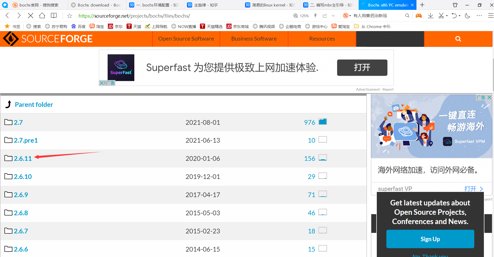

# ryy

## 1. 搭建环境

### 1.1 Bochs(发音box)虚拟机

### 1.1.1 下载Bochs

网址：https://sourceforge.net/projects/bochs/files/bochs/

此处下载2.6.11版本。如图所示：

1. 
2. 


### 1.1.2 解压

先创建一个目录，例如我的为`/home/hero/ryy`。将下载好的压缩包移到此目录下。

```shell
tar -zxvf bochs-2.6.9.tar.gz
```

使用此命令默认解压到当前目录下。

如图：


接下来进入`bochs-2.6.11`文件夹。`cd bochs-2.6.11`

如图所示：


### 1.1.3 运行

`./bochs`

结果如图所示：

1. 
2. 

当然了，很明显这不对，没有这么简单的事！！！

### 1.1.4 安装

1.进入到bochs-2.6.11的目录中，输入

```shell
./configure --prefix=path/bochs --enable-debugger --enable-disasm --enable-iodebug --enable-iodebug --enable-x86-debugger --with-x --with-x11
```

其中`path`用来指定`bochs`的安装目录，根据个人实际情况将 `path` 替换为自己待安装的路径。其它选项不做解释，参考<<操作系统真相还原>>。

例如我这里将path指定为`/home/hero/ryy/install`。则完整的路径为

```shell
./configure --prefix=/home/hero/ryy/install/bochs --enable-debugger --enable-disasm --enable-iodebug --enable-iodebug --enable-x86-debugger --with-x --with-x11
```

**==注意：install后面那个`bochs`文件夹你不需要创建==。**

2.然后就可以开始`make`了

终端输入make即可。是在`bochs-2.6.11`这个目录中输入。


`make`过程中可能出现许多错误。此处列举两点，其它错误自行搜索解决方法。

例如：


解决方法：

```shell
sudo apt install libx11-dev
```

再如：看到这个就说明离成功只有一步之遥了


解决方法：

在之前的配置中加上`libs='-lx11'`，完整的配置如下

```shell
./configure --prefix=/home/hero/ryy/install/bochs --enable-debugger --enable-disasm --enable-iodebug --enable-iodebug --enable-x86-debugger --with-x --with-x11 libs='-lx11'
```

执行这条命令后，再次`make`。没有错误发生。		

3.最后一步

执行`make install`。然后切换到刚才自己定义的安装目录，可以看到自动生成的`bochs`文件夹。好了，大功告成。


### 1.1.5 配置

安装好了`bochs`(是我们`install`目录下的那个目录哦)之后我们要对它进行配置，配置可以参考安装目录下的`bochsrc-sample.txt`，该文件的路径在bochs目录下的`share/doc/bochs/bochsrc-sample.txt`。反正全是英文，咱也看不懂。自动忽略这条。


因为`bochs`在运行的时候要加载我们的配置文件，这个配置文件需要我们自己指定，所以我把配置文件放在了安装时自动创建的`bochs`目录下。为什么我要强调这个自动生成的`bochs`目录呢。因为在

`/home/hero/ryy/bochs-2.6.11`目录下也有一个叫做`bochs`的东西，当然了，它是一个二进制文件。好了，现在应该不会搞混了。


好了，进入正题，编辑配置文件，我起名为`hero.disk`。理论上，这个名字是任意的，甚至压根不需要后缀。

```shell
touch hero.disk
nano hero.disk
# 首先设置 Bochs 在运行过程中能够使用的内存，本例为 32MB。
# 关键字为 megs
megs: 32

# 设置对应真实机器的 BIOS 和 VGA BIOS 。
# 对应两个关键字为 ： romimage 和 vgaromimage
romimage: file＝/home/hero/ryy/install/bochs/share/bochs/BIOS-bochs-latest
vgaromimage: file＝/home/hero/ryy/install/bochs/share/bochs/VGABIOS-lgpl-latest

#选择启动盘符
boot: disk  #从硬盘启动

# 设置日志文件的输入位置
log: bochs.out

# 关闭鼠标，打开键盘
mouse: enabled=0
keyboard: keymap=/home/hero/ryy/install/bochs/share/bochs/keymaps/x11-pc-us.map

# 设置硬盘
ata0: enabled=1,ioaddr1=0x1f0, ioaddr2=0x3f0, irq=14
```

在写配置文件的时候一定要把这些路径写成绝对路径，不要使用相对路径，因为bochs不认相对路径

配置文件写完了，那我们运行一下bochs试试， 看看是什么样子

在bochs的目录下输入:

```shell
bin/bochs 或者./bin/bochs 或者cd bin 然后 ./bochs
```

让我们看看`bin`目录下有什么：


**==可以看到是两个可执行文件。==**

结果如图:


可以看到默认选项是`2`，要求我们输入配置文件的名称，此时输入`hero.disk`即可，也就是以前我们写的配置文件的名称。


在我们输入配置文件按下回车之后可以看到，报了一个PANIC级别的错误，意思是我们没有启动盘，因为bochs是模拟的操作系统进行运行，此时我们还没有启动盘，所以它不知道从哪里开始运行，接下来我们就开始创建启动盘。


先输入`die`退出哈！


然后执行`bximage`程序：

```shell
./bin/bximage
```

然后按下图操作即可：


图中需要我们输入的地方我用红色的方框标记出来了，70代表该硬盘的大小为70M，hd70M.img是我给改硬盘取得名字，最后一行是我们需要加入到配置文件中的，这是我们硬盘配置好之后，bochs给我们自动生成的硬盘信息，接下来在配置文件的最后一行加上该硬盘的信息

完整的配置如下：

```shell
# 首先设置 Bochs 在运行过程中能够使用的内存，本例为 32MB。
# 关键字为 megs
megs: 32

# 设置对应真实机器的 BIOS 和 VGA BIOS 。
# 对应两个关键字为 ： romimage 和 vgaromimage
romimage: file＝/home/hero/ryy/install/bochs/share/bochs/BIOS-bochs-latest  #改成自己的
vgaromimage: file＝/home/hero/ryy/install/bochs/share/bochs/VGABIOS-lgpl-latest #改成自己的

#选择启动盘符
boot: disk  #从硬盘启动

# 设置日志文件的输入位置
log: bochs.out

# 关闭鼠标，打开键盘
mouse: enabled=0
keyboard: keymap=/home/hero/ryy/install/bochs/share/bochs/keymaps/x11-pc-us.map #改成自己的

# 设置硬盘
ata0: enabled=1,ioaddr1=0x1f0, ioaddr2=0x3f0, irq=14
#启动盘信息
ata0-master: type=disk, path="hd70M.img", mode=flat, sect_size=1024
```

硬盘信息配置好了之后我们初步的配置就已经搞定了，接下来我们在此启动一下试试

```shell
bin/bochs -f hero.disk
```

好了，我们成功的运行失败了。结果与`1.1.3`的结果一模一样。

当然，这位知乎er是成功了的。附上他的链接：https://zhuanlan.zhihu.com/p/35437842

### 1.1.6 再次配置

因为要完成课设，所以必须再折腾。。。

因为我们运行后的错误信息如下：

```shell
(coos) ubuntu@ubuntu:~/bochs-2.6.9$ bochs
========================================================================
                       Bochs x86 Emulator 2.6.9
               Built from SVN snapshot on April 9, 2017
                  Compiled on Jan 26 2019 at 23:13:17
========================================================================
00000000000i[      ] BXSHARE not set. using compile time default '/usr/local/share/bochs'
00000000000i[      ] reading configuration from .bochsrc
00000000000e[      ] .bochsrc:187: wrong value for parameter 'model'
00000000000p[      ] >>PANIC<< .bochsrc:187: cpu directive malformed.
00000000000e[SIM   ] notify called, but no bxevent_callback function is registered
00000000000e[SIM   ] notify called, but no bxevent_callback function is registered
========================================================================
Bochs is exiting with the following message:
[      ] .bochsrc:187: cpu directive malformed.
========================================================================
00000000000i[CPU0  ] CPU is in real mode (active)
00000000000i[CPU0  ] CS.mode = 16 bit
00000000000i[CPU0  ] SS.mode = 16 bit
00000000000i[CPU0  ] EFER   = 0x00000000
00000000000i[CPU0  ] | EAX=00000000  EBX=00000000  ECX=00000000  EDX=00000000
00000000000i[CPU0  ] | ESP=00000000  EBP=00000000  ESI=00000000  EDI=00000000
00000000000i[CPU0  ] | IOPL=0 id vip vif ac vm rf nt of df if tf sf ZF af PF cf
00000000000i[CPU0  ] | SEG sltr(index|ti|rpl)     base    limit G D
00000000000i[CPU0  ] |  CS:0000( 0000| 0|  0) 00000000 00000000 0 0
00000000000i[CPU0  ] |  DS:0000( 0000| 0|  0) 00000000 00000000 0 0
00000000000i[CPU0  ] |  SS:0000( 0000| 0|  0) 00000000 00000000 0 0
00000000000i[CPU0  ] |  ES:0000( 0000| 0|  0) 00000000 00000000 0 0
00000000000i[CPU0  ] |  FS:0000( 0000| 0|  0) 00000000 00000000 0 0
00000000000i[CPU0  ] |  GS:0000( 0000| 0|  0) 00000000 00000000 0 0
00000000000i[CPU0  ] | EIP=00000000 (00000000)
00000000000i[CPU0  ] | CR0=0x00000000 CR2=0x00000000
00000000000i[CPU0  ] | CR3=0x00000000 CR4=0x00000000
bx_dbg_read_linear: physical memory read error (phy=0x000000000000, lin=0x00000000)
00000000000i[SIM   ] quit_sim called with exit code 1
```

以下是解决办法，我不想做任何解释。


因为前面已经下载解压了，其实可以更简单。不过不推荐这种方式。

```shell
wget https://nchc.dl.sourceforge.net/project/bochs/bochs/2.6.11/bochs-2.6.11.tar.gz
sudo tar zxvf bochs-2.6.11.tar.gz
sudo ./configure --enable-debugger --enable-disasm
sudo make
sudo make install
```


1. nasm 安装

   ```shell
   sudo apt-get install nasm
   ```

2. 在`/home/hero/ryy/install/bochs`目录(也就是你自定义的安装目录)下创建`boot.asm`。

   ```asm
   ;boot.asm
           org     07c00h  ; 告诉编译程序加载到 7c00 处
           mov     ax, cs
           mov     ds,ax
           mov     es,ax
           call    DispStr	; 调用显示字符串例程
           jmp     $	; 无限循环
   DispStr:
           mov     ax,BootMessage
           mov     bp,ax		; ES : BP = 串地址
           mov     cx,16		; CX = 串长度
           mov     ax,01301h	; AH = 13 , AL = 01h
           mov     bx,000ch	; 页号为 0 (BH = 0) 黑底红字 (BL = 0Ch, 高亮)
           mov     dl,0	
           int     10h			; 10h 号中断
           ret
   BootMessage: db "Hello, OS World!" 
   times   510-($-$$) db 0		; $-$$ 表示本行距离程序开始处的相对距离
   						    ; 用 0 填充剩下的空间，使生成二进制恰好 512 字节
   dw      0xaa55	; 结束标志
   ```

3. 终端中编译：

   ```shell
   nasm boot.asm -o boot.bin
   ```

4. 用 bochs 生成软盘(`fd`)(前面那个教程我们选的是硬盘哦(`hd`))

   4.1 终端输入

   ```shell
   ./bin/bximage
   ```

   4.2 操作如下：

   ```shell
   ========================================================================
                                   bximage
     Disk Image Creation / Conversion / Resize and Commit Tool for Bochs
            $Id: bximage.cc 13069 2017-02-12 16:51:52Z vruppert $
   ========================================================================
   
   1. Create new floppy or hard disk image
   2. Convert hard disk image to other format (mode)
   3. Resize hard disk image
   4. Commit 'undoable' redolog to base image
   5. Disk image info
   
   0. Quit
   
   Please choose one [0] 1
   
   Create image
   
   Do you want to create a floppy disk image or a hard disk image?
   Please type hd or fd. [hd] fd
   
   Choose the size of floppy disk image to create.
   Please type 160k, 180k, 320k, 360k, 720k, 1.2M, 1.44M, 1.68M, 1.72M, or 2.88M.
    [1.44M] 
   
   What should be the name of the image?
   [a.img] a.img
   
   Creating floppy image 'a.img' with 2880 sectors
   
   The following line should appear in your bochsrc:
     floppya: image="a.img", status=inserted
   ```

5. 将引导扇区写进软盘：

   ```shell
   dd if=boot.bin of=a.img bs=512 count=1 conv=notrunc
   ```

   ==**解释一下：`boot.bin`是由`boot.asm`编译得到的可执行文件。**==

6. 再编写 `bochsrc` 配置。这个`bochsrc`就是相当于刚刚的`hero.disk`。你要先在`/home/hero/ryy/install/bochs`目录下创建这个文件哦。

   ```shell
   # bochsrc
   #configuration file foe bochs
   
   #how much memory the emulated machine will have
   megs: 32
   
   #filename of ROM images
   romimage:file=/home/hero/ryy/bochs-2.6.11/bios/BIOS-bochs-latest # 这个文件需要自己在电脑里找
   vgaromimage:file=/home/hero/ryy/bochs-2.6.11/bios/VGABIOS-lgpl-latest # 这个文件需要自己在电脑里找
   
   #what disk images will be used
   floppya:1_44=a.img,status=inserted
   
   #choose he boot disk
   boot:floppy
   
   #where do we send log messages
   log:bochsout.txt
   
   #disable the mouse
   mouse:enabled=0
   
   #enable key mapping,using US layout as default
   keyboard:keymap=/home/hero/ryy/bochs-2.6.11/gui/keymaps/x11-pc-us.map  #这个也要改成你自己的安装目录
   ```

   记得把该修改的地方改成自己的安装目录哦。

   因为这里要改的三处我们都是用的`/home/hero/ryy/bochs-2.6.11`目录下的东西，而原来用的的是

   `/home/hero/ryy/install/bochs/share/bochs`目录下的东西，这两个目录里面都是有`BIOS-bochs-latest`,`VGABIOS-lgpl-latest`,`x11-pc-us.map`这三个东西的哦。可能是这里出了问题，我也懒得折腾了.

7. 编写完成后：

   ```shell
   ./bin/bochs -f bochsrc
   ```

   运行成功了，结果如下：

   

   输出了`Hello, Os World!`

​    这个是来自于我们的`boot.asm`汇编代码的内容哦！

​    好了，就此结束。

8. 我解释一下这界面怎么进来的。==**注意是去虚拟机内部执行(有图形界面)，不是在`Xshell`中。**==

   8.1 执行命令

   ```shell
   ./bin/bochs
   ```

   8.2 如图

   

​    

​    想退出输入`q`即可。别乱按。