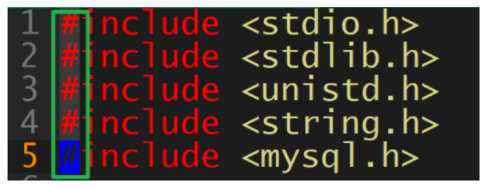
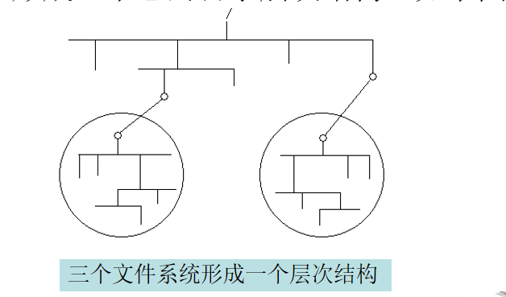
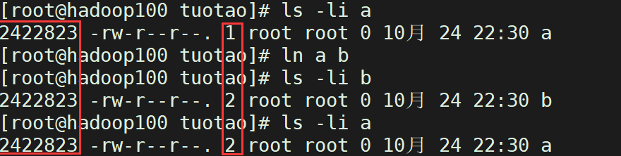

# Linux命令

od 磁盘，权限，用户。ethtool。nload。

## 基本命令

### ls

格式：`ls [选项] [文件名...]`

* l：表示list，表示以详细列表的形式进行展示

  > ll等价于ls -l

* a：表示显示所有的文件/文件夹（包含了隐藏文件/文件夹）

  > **在Linux中隐藏文档一般都是以“.”开头。**

* h：可读性较高的形式显示

示例：

```bash
[root@hero ~]# ls -lah
总用量 147M
dr-xr-x---. 29 root root 4.0K 4月  25 14:43 .
dr-xr-xr-x. 18 root root 4.0K 3月  15 17:50 ..
-rw-------.  1 root root 1.9K 3月  15 17:51 anaconda-ks.cfg
-rwxr-xr-x.  1 root root  16K 4月  22 22:32 a.out
-rw-------.  1 root root 8.6K 4月  24 23:15 .bash_history
-rw-r--r--.  1 root root   18 12月 29 2013 .bash_logout
-rw-r--r--.  1 root root  199 3月  15 18:38 .bash_profile
-rw-r--r--.  1 root root  176 12月 29 2013 .bashrc
drwx------. 15 root root 4.0K 3月  29 11:03 .cache
```

列出格式：文件类型 权限 链接数 所属用户 所属组 文件大小 最后更改时间 文件名。

d：目录

-：普通文件

l：链接文件 

b：表示为装置文件里面的可供储存的接口设备(可随机存取装置)；

c：表示为装置文件里面的串行端口设备，例如键盘、鼠标(一次性读取装置)。

### 别名

如果命令太长或者不符合用户的习惯，那么为它指定一个别名是不错的办法。

查看当前环境中的别名：alias

创建别名：alias cls=‘clear’

删除别名：unalias cls

**如果需要一直使用别名，可以在.bashrc文件中配置别名**。

如果需要所有用户都使用别名可以在/etc/bashrc文件中配置。

执行/etc/bashrc文件的方式：

```shell
[root@hero ~]# . .bashrc 
[root@hero ~]# source .bashrc 
[root@hero ~]# sh .bashrc 
[root@hero ~]# bash .bashrc
```

> ==因为你.bashrc是用shell语言编写的一个脚本啊==！

## 查找命令

| **通配符**       | **功能说明**                     | **示例**               |
| ---------------- | -------------------------------- | ---------------------- |
| *                | 匹配所有字符                     | ls *.o                 |
| ?                | 匹配所有的单个字符               | ls net???              |
| [a-z]            | 匹配属于a到z范围集合内的一个字符 | ls [a-i]*              |
| [...]            | 与方括号内的某个字符匹配         | ls [abc]*.c            |
| [!...]或`[^...]` | 与不在括号内的某个字符匹配       | `ls [^a]*.c`           |
| {c1,c2}          | 同c1或c2集合匹配                 | **ls {[0-9]\*,[acr]}** |

示例：

```sh
[root@hero SPECS]# ls /dev/tty?
/dev/tty0  /dev/tty1  /dev/tty2  /dev/tty3  /dev/tty4  /dev/tty5  /dev/tty6  /dev/tty7  /dev/tty8  /dev/tty9
[root@hero SPECS]# ls /dev/tty[1-5]   
/dev/tty1  /dev/tty2  /dev/tty3  /dev/tty4  /dev/tty5
[root@hero SPECS]# ls /dev/tty[136]
/dev/tty1  /dev/tty3  /dev/tty6
[root@hero SPECS]# ls /dev/tty[!136]
/dev/tty0  /dev/tty2  /dev/tty4  /dev/tty5  /dev/tty7  /dev/tty8  /dev/tty9
[root@hero SPECS]# ls /dev/tty[^136]
/dev/tty0  /dev/tty2  /dev/tty4  /dev/tty5  /dev/tty7  /dev/tty8  /dev/tty9
[root@hero SPECS]# ls /dev/tty{[136],[29]}
/dev/tty1  /dev/tty2  /dev/tty3  /dev/tty6  /dev/tty9
```


## 1 网络命令

```shell
nohup ping baidu.com &   # &是后台运行的符号
jobs # 查看后台命令
[root@SH-IDC1-10-198-6-214 tuotao]# jobs
[1]+  Running                 nohup ping baidu.com &
fg 1   # 继续运行
```


### 1.1 ifconfig 命令

ifconfig命令用于配置网卡ip地址信息,等网络参数信息。或者查看显示网络接口信息，类似于windows的ipconfig命令还能够**临时性的配置**ip地址、子网掩码、广播地址、网关信息等。注意ifconfig命令只能用root去操作，且可能要单独安装这个命令。

command not found #这个命令没有配置好PATH，就是没有安装

`[root@chaogelinux ~]# yum install net-tools`   //安装ifconfig命令


查看命令的使用手册，帮助信息
[root@chaogelinux ～]# ifconfig --help


ifconfig使用案例：


1.查看网络地址信息
`ifconfig` #查看所有的网络接口信息
`ifconfig ens33` #查看指定的网卡信息


2.指定开启、或者关闭网卡
#关闭网卡，注意不得在服务器上执行（注意学习在vmware中操作)

命令：`ifconfig 设备名字 up/down`
`ifconfig ens33 down`   #停止网卡

`ifconfig ens33 up`     #启用网卡
3.修改、设置ip地址
#添加一个新ip地址:`ifconfig ens33:0 192.168.178.111 netmask 255.255.255.0 up`
#第二种添加方式:`ifconfig ens33:1 192.168.178.120/24 up`
4.修改机器的MAC地址信息
原本的MAC地址信息:`ether 00:0C:29:a0:87:d4`
修改MAC地址:`ifconfig ens33 hw ether 00:0c:29:13:10:CF`

修改完毕之后，查看MAC地址信息 [root@chaogelinux～]#ifconfig lgrep ether
ether 00:0C: 29:13:10:cf txqueuelen 1000 (Ethernet)ether 00:0c: 29: 13:10:cftxqueuelen 1000 (Ethernet)ether 00:0C:29:13:10:cf txqueuelen 1000 (Ethernet)
5.**永久修改网络设备信息，ifconfig命令只是临时修改网络配置，要永久修改还得写入到网卡配置文件(/etc/sysconfig/network-scrpits)中**。

### 1.2 route命令

感觉没啥用。

### 1.3 ip命令

ip命令是iproute软件包中强大的网络管理工具，查看系统路由、网络设备，设置策略等功能。

```shell
[atguigu@hadoop103 down]$ ip --help
Usage: ip [ OPTIONS ] OBJECT { COMMAND | help }
       ip [ -force ] -batch filename
where  OBJECT := { link | address | addrlabel | route | rule | neigh | ntable |
                   tunnel | tuntap | maddress | mroute | mrule | monitor | xfrm |
                   netns | l2tp | fou | macsec | tcp_metrics | token | netconf | ila |
                   vrf }
       OPTIONS := { -V[ersion] | -s[tatistics] | -d[etails] | -r[esolve] |
                    -h[uman-readable] | -iec |
                    -f[amily] { inet | inet6 | ipx | dnet | mpls | bridge | link } |
                    -4 | -6 | -I | -D | -B | -0 |
                    -l[oops] { maximum-addr-flush-attempts } | -br[ief] |
                    -o[neline] | -t[imestamp] | -ts[hort] | -b[atch] [filename] |
                    -rc[vbuf] [size] | -n[etns] name | -a[ll] | -c[olor]}


ip命令可以操作的对象0BJECT对象：
link 网络设备
address 定义ipv4 ipv6的地址
neighbour查看ARP缓存地址(ARP用于解析MAC地址)route路由表对象
maddress 多播地址tunel IP上的通道

COMMAND:ip针对对象要操作的动作，一般增删改查
```

1.查看，显示网络设备信息
`[root@chaogelinux ～]#ip addr show`**指定网络设备显示信息** 简写`ip a或ip addr`
`[root@chaogelinux ～~]# ip link show dev ens33`显示网络设备，详细的数据包收发大小情况
`[root@chaogelinux ～~]# ip-s link show dev ens33`
2.关闭、激活网络设备
`[root@chaogelinux ~]# ip link set ens33 down/up` #关闭/启动网卡
3.修改网卡MAC地址信息
`ip link set ens33 address 0:0c:29:13:10:11`
4.显示网卡信息
`root@chaogelinux ～]# ip a#简写，显示网络设备信息ip addr show #第二种写法`
5.ip命令添加，删除ip信息(这个命令可以使同一张网卡拥有多个ip地址，网段相同即可)
`[root@chaogelinux ~]# ip address add 192.168.178.160/24 dev ens33`  #添加ip信息
`ip address del 192.168.178.161/24 dev ens33` #删除ip信息

### 1.4 ping命令


### 1.5 telnet命令

**telnet命令在以前是用于登录远程主机的命令，以及检测远程主机的端口是否打开了，但是telnet命令采用的是明文传输，安全性太低，在远程登录的时候，容易丢失或者被黑客截取服务器的密码，因此后来被弃用，采用了更安全的ssh远程登录命令**。这个telnet命令得安装后才能使用`yum install telnet -y`。


1.用于检测远程主机是否打开了某端口命令格式：`telnet ip 端口`


2.检测远程服务器,是否开放了数据库的3306端口


如果是开着的，我们就可以远程连接了。

### 1.6 ethtool命令

**用于查看网卡的==带宽==，比如这张是10wMb的网卡**。

```shell
[tuotao@HOST-10-198-6-252 yy]$ ethtool ib0
Settings for ib0:            #这是IB卡
	Supported ports: [ ]
	Supported link modes:   Not reported
	Supported pause frame use: No
	Supports auto-negotiation: No   
	Supported FEC modes: Not reported
	Advertised link modes:  Not reported
	Advertised pause frame use: No
	Advertised auto-negotiation: No
	Advertised FEC modes: Not reported
	Speed: 100000Mb/s
	Duplex: Full
	Port: Other
	PHYAD: 0
	Transceiver: internal
	Auto-negotiation: off
Cannot get wake-on-lan settings: Operation not permitted
	Link detected: yes
```

### 1.7 nload

"带宽"是由英文词汇bandwidth直译过来的。而在不同的领域，对带宽的理解角度也有所不同。

1、电子通信领域：指某个信号具有一定的频带宽度。也就是说，信号的带宽指的是该信号所包含的不同频率成份所占据的频率范围。

注意：频带是相对基带而存在的概念，指的是经过调制后能在信道上进行传输通信的信号所占据的频率范围，一般我们也称通频带。

2、计算机网络领域：指网络系统的通信链路（与信道或者传输媒体相同）传输数据的能力，即表征单位时间内从网络中的某一点到另一点所能通过的**"最高数据率"**。

注意：计算机网络中的"带宽"和"吞吐量"两个词容易混淆，区别如下：

2.1）网络带宽（bandwidth）：强调网络**==最大的数据传输速率，即传输数据率理论峰值==**。

2.2）网络吞吐量（throughput）：强调网络实际的数据传输速率。


nload工具并不是centos系统自带的，需要我们手动安装下载。

```shell
yum install epel-release     安装epel软件库
yum install nload            安装nload
```

什么是epel

EPEL (Extra Packages for Enterprise Linux)是一个开源的、免费的、基于社区的存储库项目，来自Fedora团队，它为Linux发行版提供了100%高质量的附加软件包，包括RHEL (Red Hat Enterprise Linux)、CentOS和Scientific Linux。 EPEL项目不是RHEL/CentOS的一部分，但它是为主要的Linux发行版设计的，提供了大量的开放源码包，如网络工具、系统管理员工具、编程、监控等。 大多数EPEL包都是由Fedora回购维护的。

为什么我们要使用epel

提供了大量的开源包安装通过Yum和DNF
Epel repo是100%开源和免费使用
它不提供任何核心复制包，也没有兼容性问题
所有EPEL包都由Fedora回购维护 


nload默认会分页展示各个网卡的实时流量信息。我们可以通过按键盘上的 ← → 或者 Enter/Tab 键在网卡之间切换。


**nload默认分为上下俩块**：

上半部分：Incoming为进入网卡的流量

下半部分：Outgoing为从网卡出去的流量


**nload命令参数**：

常用选项：

选项	描述
-a	**全部数据的刷新时间周期，单位是秒，默认是300s**
-i	进入网卡的流量图的显示比例最大值设置，默认10240 kBit/s
-m	**不显示流量图，只显示统计数据**
-o	出去网卡的流量图的显示比例最大值设置，默认10240 kBit/s
-t	显示数据的刷新时间间隔，单位是毫秒，默认500ms
-u	**==设置==右边Curr、Avg、Min、Max的==数据单位==，默认是h自动变的.注意大小写单位不同**

-u可以有的参数：

```shell
h|b|k|m|g   h: auto, b: Bit/s, k: kBit/s, m: MBit/s 
H|B|K|M|G H: auto, B: Byte/s, K: kByte/s, M: MByte/s
小写代表 bit  大写代表 byte
```

注：bit（比特）是存储单元；byte（字节）是计量单位，查看网络时常用byte。


常用命令：

```shell
[root@hadoop100 ~]# nload -u H
[root@hadoop100 ~]# nload -u h
[root@hadoop100 ~]# nload -m
nload -m -H ens33 不显示流量图，以Byte为单位查看ens33网卡流量情况
[root@hadoop100 ~]# nload -m -H ens33
nload -t 1000 显示数据的刷新时间间隔为1000毫秒
[root@hadoop100 ~]# nload -t 1000
[root@hadoop100 ~]# nload -t 10
```


****


### 1.8 防火墙

在我们日常工作中，经常需要关闭Linux防火墙。指令如下：

1:查看防火状态

```shell
systemctl status firewalld
service  iptables status   # 一般是不可用的
```

2:暂时关闭防火墙

```shell
systemctl stop firewalld
service  iptables stop
```

3:永久关闭防火墙

```shell
systemctl disable firewalld  # disable:使伤残，使无效，使不能运转
systemctl disable --now firewalld
chkconfig iptables off
```

4:启动防火墙

```shell
systemctl enable --now firewalld  #这应该是disable对应的
systemctl start firewalld     #常用
systemctl start --now firewalld   #启动并设置开机自启 有没有这条命令？

service iptables restart
```

5:重启防火墙

```shell
systemctl restart firewalld
```


关闭 selinux：
修改配置文件（永久关闭selinux可以使用vi命令打开/etc/selinux/config 文件将SELINUX=disable）


查看selinux状态：

```shell
getenforce
```

可能返回结果有三种：Enforcing、**Permissive** 和 Disabled。Disabled 代表 SELinux 被禁用，Permissive 代表仅记录安全警告但不阻止可疑行为，Enforcing 代表记录警告且阻止可疑行为。

目前常见发行版中，RHEL 和 Fedora 默认设置为 Enforcing，其余的如 openSUSE 等为 Permissive。


**2. 改变 SELinux 运行状态**

```
setenforce [ Enforcing | Permissive | 1 | 0 ]
```

该命令可以立刻改变 SELinux 运行状态，在 Enforcing 和 Permissive 之间切换，结果保持至关机。一个典型的用途是看看到底是不是 SELinux 导致某个服务或者程序无法运行。**若是在 setenforce 0 之后服务或者程序依然无法运行，那么就可以肯定不是 SELinux 导致的**。

若是想要永久变更系统 SELinux 运行环境，可以通过更改配置文件 /etc/sysconfig/selinux 实现。注意当从 Disabled 切换到 Permissive 或者 Enforcing 模式后需要重启计算机并为整个文件系统重新创建安全标签(touch /.autorelabel && reboot)。

**3. SELinux 运行策略**

配置文件 /etc/sysconfig/selinux 还包含了 SELinux 运行策略的信息，通过改变变量 SELINUXTYPE 的值实现，该值有两种可能：targeted 代表仅针对预制的几种网络服务和访问请求使用 SELinux 保护，strict 代表所有网络服务和访问请求都要经过 SELinux。

RHEL 和 Fedora 默认设置为 targeted，包含了对几乎所有常见网络服务的 SELinux 策略配置，已经默认安装并且可以无需修改直接使用。

若是想自己编辑 SELinux 策略，也提供了命令行下的策略编辑器 seedit 以及 Eclipse 下的编辑插件 eclipse-slide .

## 2 下载命令

### 2.1 rpm

源代码安装方式需要一些专业的知识，(**我们需要一种简单的软件安装方式**)客户端取得这个文件后，只要透过特定的指令来安装， 那么该软件文件就会依照内部的 脚本来侦测相依的前驱软件是否存在，若安装的环境符合需求,那就会开始安装， **安装完成后还会 将该软件的信息写入软件管理机制中，以达成未来可以进行升级、移除等动作**。

目前在 Linux 界软件安装方式最常见的有两种，分别是：

* dpkg： 这个机制最早是由 Debian Linux 社群所开发出来的，透过 dpkg 的机制， Debian 提供的软件就能够简单 的安装起来，同时还能提供安装后的软件信息。只要是衍生于 Debian 的其他 Linux  distributions(发行版) 大多使用 dpkg 这个机制来管理软件的， 包括 B2D, Ubuntu 等等。
* RPM： 这个机制最早是由 Red Hat 这家公司开发出来的，因其易用性，所以许多 distributions 就使用这个机制来作为软件安装的管理方式。包括 Fedora, CentOS, SuSE 等等知名的开发商咚。

但是这两个机制都牵扯到依赖未安装问题，我们希望有一个依赖列表和一套管理机制，在安装软件缺少依赖时可以自动在线升级，所以后来就基于不同的平台出现了yum和apt这两种**具有自动下载所需依赖功能**的软件安装方式。**而rpm则主要使用其查询功能**。


RPM 全名是『 RedHat Package Manager 』，由 Red Hat 公司开发。 RPM 是**以一种数据库记录的方式**来将你所需要的软件安装到 你的 Linux 系统的一套管理机制。

他最大的特点就是**将你要安装的软件先编译过**， **并且打包成为 RPM 机制的包装文件**，透过包装好的软件里头默认的数据库记录， 记录这个软件要安装的时候必须具备的相依属性软件，当安装在你 的 Linux 主机时， RPM 会**先依照软件里头的数据查询 Linux 主机的相依属性软件是否满足**， 若满足则予以安装，若不满足则不予安装。安装的时候就将该软件的信息整个写入 RPM 的数据库中，以便未来的查询、验证与反安装！

优点：

* 由于已经编译完成并且打包完毕，所以软件传输与安装上很方便 (不需要再重新编译)； 

* RPM 在被安装之前，会先检查系统的硬盘容量、操作系统版本等，可避免文件被错误安装；

* RPM 文件本身提供软件版本信息、相依属性软件名称、软件用途说明、软件所含文件等信息，便于了解软 件；

* **==由于被安装后软件的信息都已经记录在 Linux 主机的数据库上==**，很方便查询、升级与反安装

缺点：

* 软件文件安装的环境必须**与打包时的环境需求一致或相当**； 
* 需要满足软件的相依属性需求； 
* 反安装时需要特别小心，最底层的软件不可先移除，否则可能造成整个系统的问题！

如果我真的想要安装其他Linux发行版提供的好用的 RPM 软件文件时怎么办？ 还好， 我们有SRPM(Source RPM)的意思，也就是这个 RPM 文件里面含有源代码，但它同时含有该软件所需要的相依性软件说明、以及所有 RPM 文件所提供的数据，还提供了参数配置文件 (就是 configure 与 makefile)。

所以，如果我们下载的是 SRPM ， 那么要安装该软件时，你就必须要： 

* **先将该软件以 RPM 管理的方式编译，此时 SRPM 会被编译成为 RPM 文件**

* 然后将编译完成的 RPM 文件安装到 Linux 系统当中

> 这玩意就是源码安装和rpm安装的一个结合版，意味着你修改 SRPM 内的参数配置文件，然后重新编译产生能适合我们 Linux 环境的 RPM 文件。

软件包格式：

```bash
xxxxxxxxx.rpm <==RPM 的格式，已经经过编译且包装完成的 rpm 文件。
xxxxx.src.rpm <==SRPM 的格式，包含未编译的原始码信息。

怎么知道这个软件的名字、版本、适用的平台、编译释出的次数呢？
例如 fuse-libs-2.9.2-10.el7.x86_64.rpm 这的文件的意义为：
fuse-libs - 2.9.2 -        10           .el7.x86_64 .rpm
软件名称   软件的版本信息 释出(编译)的次数    适合的硬件平台 扩展名
2：主版本
9：次版本(在主版本源码上编译而来)
2: 估计是次次版本
el7：表示软件包适用的操作系统平台。在这个例子中，el7 表示该软件包适用于基于Enterprise Linux 7（如CentOS 7）的发行版。
x86_64：表示软件包适用的体系结构。在这个例子中，x86_64 表示该软件包适用于64位的x86体系结构。
[root@hero ~]# rpm -qi fuse-libs-2.9.2-10.el7.x86_64
Name        : fuse-libs
Version     : 2.9.2
Release     : 10.el7
Architecture: x86_64
```

注：**==软件名称是非常重要的，后面的查询和删除都需要软件名称==**。**而安装和升级需要rpm包全名**。

问题：**软件包从哪里来？如何得到软件包？**

* 光盘镜像文件(安全)
* 官方网站（源码包）（安全）
* 第3方资源网站
* 查找rpm包的网站：www.rpmfind.net

#### 安装

命令： `rpm -ivh package_name`

* -i ：install 的意思 

* -v ：察看更细部的安装信息画面 

* -h ：以安装信息列显示安装进度

```shell
范例一：安装原版光盘上的 rp-pppoe 软件
[root@hero ~]# rpm -ivh /mnt/Packages/rp-pppoe-3.11-5.el7.x86_64.rpm
Preparing... ################################# [100%]
Updating / installing...
 1:rp-pppoe-3.11-5.el7 ################################# [100%]
范例二、一口气安装两个以上的软件时：
[root@hero ~]# rpm -ivh a.i386.rpm b.i386.rpm *.rpm
# 后面直接接上许多的软件文件！
范例三、直接由网络上面的某个文件安装，以网址来安装：
[root@hero ~]# rpm -ivh http://website.name/path/pkgname.rpm
```

另外，如果我们在安装的过程当中发现问题，或者已经知道会发生的问题， 而还是『执意』要安装 这个软件时，可以使用如下的参数『强制』安装上去：

* --nodeps：当发生软件属性相依问题而无法安装，但你执意安装时。

* --replacefiles：如果在安装的过程当中出现了『某个文件已经被安装在你的系统上面』的信息， 又或许出现版本不合的讯息 (confilcting files) 时，可以使用这个参数来直接覆盖文件。

  > 覆盖的动作是不可逆的，你必须明确的知道它可以被覆盖。

* --replacepkgs：如果你要安装一堆 RPM 软件文件时，可以使 用 rpm -ivh *.rpm ，但若某些软件已经安装过了， 此时系统会出现『某软件已安装』的信息， 导致无法继续安装。此时可使用这个选项来进行重复安装。

* --force：这个参数其实就是 --replacefiles 与 --replacepkgs 的综合体！

* --test：测试是否可以安装到当前的 Linux 环境当中，可找出是否有属性相依的问题。

#### 升级与更新

* -Uvh：没有安装过，则系统将予以直接安装； 有安装过旧版，则系统自动更新至新版；

* -Fvh： 没有安装过，则该软件不会被安装；亦即只有已安装至你 Linux 系统内的软件会被『升级』！

  早期没有 yum 的环境底下，同时网络带宽也很糟糕的状况下，通常有的朋友在进行整个操作系统的 旧版软件修补时，喜欢这么进行：

  1、先到各发展商的 errata 网站或者是国内的 FTP 映像站捉下来最新的 RPM 文件； 

  2、使用 -Fvh 来将你的系统内**曾安装过的软件**进行修补与升级！

#### 查询

查询主要分为两部分：

* 一个是查已安装到系统上面的的软件信息，这部份的信息都是由 /var/lib/rpm/ 所提供。
* 另一个则是查某个 rpm  文件内容，等于是查询由 RPM 包内找出一些要写入数据库内的信息，这部份就得要使用 -qp (p  是 package 的意思)。 

```bash
[root@study ~]# rpm -qa <==已安装软件
[root@study ~]# rpm -q[licdR] 已安装的软件名称 <==已安装软件
[root@study ~]# rpm -qf 存在于系统上面的某个文件名 <==已安装软件
[root@study ~]# rpm -qp[licdR] 未安装的某个文件名 <==查阅 RPM 文件
选项与参数：
查询已安装软件的信息：
-q ：仅查询是否安装了该软件 注意，系统会去找后面接的软件名称是否安装了。注意，不必要加上版本喔！

-qa ：列出所有的，已经安装在本机 Linux 系统上面的所有软件名称；
-qi ：列出该软件的详细信息 (information)，包含开发商、版本与说明等；
-ql ：列出该软件所有的文件与目录所在完整文件名 (list)；(列出属于该软件所提供的所有目录与文件)
      它包含了qc和qd的功能。
-qc ：列出该软件的所有配置文件 (找出在 /etc/ 底下的檔名而已)
-qd ：列出该软件的所有说明文件 (找出与 man 有关的文件而已)
-qR ：列出与该软件有关的相依软件所含的文件 (Required 的意思)

-qf ：由后面接的文件名，找出该文件属于哪一个已安装的软件；
      注意这里接的是文件名，查询该文件来自于哪个软件/
      
-q --scripts：列出是否含有安装后需要执行的脚本档，可用以 debug 喔！

查询某个 RPM 文件内含有的信息：这个也是很重要的。
-qp[icdlR]：注意 -qp 后面接的所有参数以上面的说明一致。但用途仅在于找出
 某个 RPM 文件内的信息，而非已安装的软件信息！注意！
 
[root@hero ~]# rpm -qpi mysql57-community-release-el7-11.noarch.rpm 
Name        : mysql57-community-release
Version     : el7
Release     : 11
Architecture: noarch
# 很显然，这不是一个标准的rpm包命名
```

示例：

```bash
[root@hero ~]# rpm -q python # 接软件名称即可
python-2.7.5-68.el7.x86_64
[root@hero ~]# rpm -q python-2.7.5 # 你加上版本号也是没问题的
python-2.7.5-68.el7.x86_64
[root@hero ~]# rpm -q python-2.7.5-68.el7.x86_64 # 你写全部信息也没问题
python-2.7.5-68.el7.x86_64
[root@hero ~]# rpm -q python-2.7.5-68.el7.x86_64.rpm # 很明显，我们没有安装过一个软件是这个名字
未安装软件包 python-2.7.5-68.el7.x86_64.rpm

[root@hero ~]# rpm -qi python
Name        : python
Version     : 2.7.5
Release     : 68.el7
Architecture: x86_64
Install Date: 2023年03月15日 星期三 17时44分03秒
Group       : Development/Languages
Size        : 80907
License     : Python
Signature   : RSA/SHA256, 2018年04月25日 星期三 19时38分11秒, Key ID 24c6a8a7f4a80eb5
Source RPM  : python-2.7.5-68.el7.src.rpm
Build Date  : 2018年04月11日 星期三 16时03分06秒
Build Host  : x86-01.bsys.centos.org
Relocations : (not relocatable)
Packager    : CentOS BuildSystem <http://bugs.centos.org>
Vendor      : CentOS
URL         : http://www.python.org/
Summary     : An interpreted, interactive, object-oriented programming language
Description :
Python is an interpreted, interactive, object-oriented programming
language often compared to Tcl, Perl, Scheme or Java. Python includes
modules, classes, exceptions, very high level dynamic data types and
dynamic typing. Python supports interfaces to many system calls and
libraries, as well as to various windowing systems (X11, Motif, Tk,
Mac and MFC).

Programmers can write new built-in modules for Python in C or C++.
Python can be used as an extension language for applications that need
a programmable interface.

Note that documentation for Python is provided in the python-docs
package.

This package provides the "python" executable; most of the actual
implementation is within the "python-libs" package.

[root@hero ~]# rpm -qf python  # 这肯定不行的
错误：文件 /root/python：没有那个文件或目录
[root@hero ~]# rpm -qf /usr/bin/python  # 你查询该文件属于哪个包，必须指定具体的路径
python-2.7.5-68.el7.x86_64
[root@hero ~]# rpm -qf /bin/sh 查询 /bin/sh文件 是那个软件提供的
bash-4.2.46-30.el7.x86_64
# 这个参数后面接的可是『文件』吶！不像前面都是接软件喔！
# 这个功能在查询系统的某个文件属于哪一个软件所有的。
```


**注意！！不是所有的软件都有rpm包！！**
因为，rpm包是人制作出来的。很多网站只是提供源码。不提供rpm包。

问题：如何知道一个软件是由rpm包安装而来？

```bash
rpm -qf <文件路径>
```

如果该软件是通过RPM包安装的，该命令将输出安装该文件的RPM包的名称。如果输出为空，表示该软件(或文件)不是通过RPM包安装的。

示例：

```bash
[root@hero ~]# rpm -qf /usr/bin/mysql       # 客户端启动命令
mysql-community-client-5.7.42-1.el7.x86_64
[root@hero ~]# rpm -qf /usr/sbin/mysqld
mysql-community-server-5.7.42-1.el7.x86_64  # 服务端启动命令
```

问题：如果我误删了某个重要文件，例如 /etc/crontab，偏偏不晓得他属于哪一个软件，该怎么办？

虽然已经没有这个文件了，不过没有关系，因为 RPM 有记录该软件的信息在 /var/lib/rpm 数据库当中，所以直接下达： rpm -qf /etc/crontab 就可以知道是那个软件啰！**重新安装一次该软件即可**！

```bash
[root@hero ~]# ls /etc/crontab 
/etc/crontab
[root@hero ~]# rpm -qf /etc/crontab      # 注意，查询的不一定是可执行文件名，只要是来自于这个软件的
crontabs-1.11-6.20121102git.el7.noarch   # 文件名即可。
[root@hero ~]# rm -rf  /etc/crontab 
[root@hero ~]# ls /etc/crontab 
ls: 无法访问/etc/crontab: 没有那个文件或目录
[root@hero ~]# rpm -qf /etc/crontab 
crontabs-1.11-6.20121102git.el7.noarch
```

#### 删除

删除时一定要删除最上层的软件，不可能先拆除地基啊。你当然也能加 --nodeps 来强制移除，能承受后果就好！

**与查询一样，只指定软件名即可。安装和升级才需要指定rpm包全名呢**。


**==你能够这样直接写python去卸载python是因为系统确实安装了一个软件名称是python的软件==**。

```bash
[root@hero ~]# rpm -e python # 这里指定的是软件名，而不是可执行文件名
错误：依赖检测失败：
	python 被 (已安裝) javapackages-tools-3.4.1-11.el7.noarch 需要
	python >= 2.2 被 (已安裝) pyxattr-0.5.1-5.el7.x86_64 需要
	python 被 (已安裝) pykickstart-1.99.66.18-1.el7.noarch 需要
	python >= 2.4 被 (已安裝) yum-3.4.3-158.el7.centos.noarch 需要
你能够这样直接写python去卸载python是因为系统确实安装了一个软件名称是python的软件。
[root@hero ~]# rpm -qf /usr/bin/python
python-2.7.5-68.el7.x86_64
[root@hero ~]# rpm -qa | grep python-2.7.5-68
python-2.7.5-68.el7.x86_64
```

我们是有mysql这样一个可执行(文件)命令，它是一个mysql客户端，但是你别想使用mysql这个可执行文件去删除已安装的mysql软件，因为我们没有安装过一个叫做mysql的软件。

你需要找出与mysql相关的软件，然后指定具体的软件名称来进行卸载。

```bash
[root@hero ~]# rpm -e mysql
错误：未安装软件包 mysql
[root@hero ~]# rpm -qa | grep mysql   # 找出已安装的与mysql相关的软件
mysql-community-common-5.7.42-1.el7.x86_64
mysql-community-client-5.7.42-1.el7.x86_64
mysql-community-libs-5.7.42-1.el7.x86_64
mysql-community-server-5.7.42-1.el7.x86_64
mysql-community-libs-compat-5.7.42-1.el7.x86_64
mysql57-community-release-el7-11.noarch

[root@hero ~]# rpm -e mysql-community-libs # 指定软件名称来进行卸载
错误：依赖检测失败：
	mysql-community-libs(x86-64) >= 5.7.9 被 (已安裝) mysql-community-libs-compat-5.7.42-1.el7.x86_64 需要
	mysql-community-libs(x86-64) >= 5.7.9 被 (已安裝) mysql-community-client-5.7.42-1.el7.x86_64 需要
[root@hero ~]# rpm -e mysql-community-libs-5.7.42 # 你加上版本号也是没问题的
错误：依赖检测失败：
	mysql-community-libs(x86-64) >= 5.7.9 被 (已安裝) mysql-community-libs-compat-5.7.42-1.el7.x86_64 需要
	mysql-community-libs(x86-64) >= 5.7.9 被 (已安裝) mysql-community-client-5.7.42-1.el7.x86_64 需要
[root@hero ~]# rpm -e mysql-community-libs-5.7.42-1.el7.x86_64 # 你写全部信息也没问题
错误：依赖检测失败：
	mysql-community-libs(x86-64) >= 5.7.9 被 (已安裝) mysql-community-libs-compat-5.7.42-1.el7.x86_64 需要
	mysql-community-libs(x86-64) >= 5.7.9 被 (已安裝) mysql-community-client-5.7.42-1.el7.x86_64 需要
```

**==同查询一样，写软件名称就够了，但是你要写全也是没问题的==**。

#### 重建

由于 RPM 文件常常会安装/移除/升级等，某些动作或许可能会导致 RPM 数据库 /var/lib/rpm/ 内的文件破损。那该如何是好？我们可以使用 --rebuilddb 这个选项来重建一 下数据库喔！

```bash
[root@hero ~]# rpm --rebuilddb 
```

#### 练习

1. 查询一下ifconfig是通过那个软件包安装过来的

   ```
   #which ifconfig
   /sbin/ifconfig
   # rpm -qf /sbin/ifconfig
   net-tools-1.60-110.el6_2.x86_64
   ```

2. 了解下ssh命令的官方网站是多少？

   ```shell
   # rpm -qpi openssh-clients-5.3p1-111.el6.x86_64.rpm # 在它输出的信息里观察
   ```

3. 最小化的系统安装了多少个软件？

   ```shell
   #mount /dev/cdrom /mnt 
   #cd /mnt/Packages
   #rpm  -qa|wc -l 
   ```


### 2.1 yum

yum命令是在Fedora和RedHat以及SUSE中基于rpm的软件包管理器它可以使系统管理人员交互和自动化地更细与管理RPM软件包，能够从指定的服务器自动下载RPM包并且安装，可以自动处理依赖性关系，并且一次安装所有依赖的软体包，无须繁琐地一次次下载、安装。
尽管RPM能够帮助用户**查询软件相关的依赖关系**，但问题还是要运维人员自己来解决，而有些大型软件可能与数十个程序都有依赖关系，在这种情况下安装软件会是非常痛苦的。
Yumi软件仓库便是为了进一步降低软件安装难度和复杂度而设计的技术。Yum 软件仓库可以根据用户的要求分析出所需软件包及其相关的依赖关系，然后自动从服务器下载软件包并安装到系统。
**Yum 软件仓库中的RPM软件包可以是由红帽官方发布的，也可以是第三方发布的，当然也可以是自己编写的**。


**基本命令**：


**显示仓库列表**：

```shell
yum repolist [all][enabled][disabled]  #可用的仓库
```


**显示程序包**：

```shell
yum list all 或指定rpm程序包名
yum list [all] [pkg1] [pkg2]
```


安装源一般会有base,epel,updates。

***


**安装程序包**：

```shell
yum install [pkg1] [pkg2]
yum reinstall [pkg1] [pkg2]  重新安装
```

**升级程序包**：

```shell
yum update [pkg1] [pkg2]     不写包名，就是所有。慎用
yum downgrade [pkg1] [pkg2]  降级
```

卸载程序包：依赖也会一起卸载。

```shell
yum remove [pkg1] [pkg2]     不写包名，就是所有。慎用
```


包组管理的相关命令:
```shell
- groupinstall group1 [group2] [.. . ]*groupupdate group1 [group2] [...]
- grouplist [hidden] [groupwildcard] [...]*groupremove group1 [group2] [... ]
  *groupinfo group1 [...]
```


```shell
修改操作系统中英文
export LC_ALL=en_US.UTF-8
export LC_ALL=zh_CN.UTF-8
```


**yum工具**

* Yum (全称为Yellow dog Updater, Modified)是一个在Fedora和RedHat以及CentOS中的Shell前端软件包管理器。基于RPM包管理，能够从指定的服务器自动下载RPM包并且安装，可以自动处理依赖性关系，并且一次安装所有依赖的软件包，无须繁琐地一次次下载、安装。
* 说到yum源就必须说到linux系统中特有的依赖关系问题，yum就是为了解决依赖关系而存在的。yum源就相当是一个目录项，当我们使用yum机制安装软件时，若需要安装依赖软件，则yum机制就会根据在yum源中定义好的路径查找依赖软件，并将依赖软件安装好。
* YUM是"Yellow dog Updater, Modified”的缩写，是一个软件包管理器，YUM从指定的地方（相关网站的rpm包地址或本地的rpm路径)自动下载RPM包并且安装，能够很好的解决依赖关系问题。
* YUM的基本工作机制如下︰服务器端︰**在服务器上面存放了所有的RPM软件包，然后以相关的功能去分析每个RPM文件的依赖性关系，将这些数据记录成文件存放在服务器的某特定目录内**。客户端︰**^如果需要安装某个软件时，先下载服务器上面记录的依赖性关系文件(可通过WWW或FTP方式)，通过对服务器端下载的纪录数据进行分析，然后取得所有相关的软件，一次全部下载下来进行安装^**。
* Yum repository: **==yum仓库，存储了众多的软件包，以及相关的元数据文件==**
  * 文件服务器
    * ftp://
    * http://
    * nfs://
    * file://
  * yum仓库可以存在多个，自动选择软件最新的，以及优先选择离我们近的仓库下载

```shell
# yum其实也是一个rpm软件
[root@hadoop100 ~]# rpm -qi rpm
Name        : rpm
Version     : 4.11.3
Release     : 32.el7
Architecture: x86_64
Install Date: 2021年07月20日 星期二 14时45分25秒
Group       : System Environment/Base
Size        : 2621900
License     : GPLv2+
Signature   : RSA/SHA256, 2018年04月25日 星期三 19时44分46秒, Key ID 24c6a8a7f4a80eb5
Source RPM  : rpm-4.11.3-32.el7.src.rpm
Build Date  : 2018年04月11日 星期三 11时54分32秒
Build Host  : x86-01.bsys.centos.org
Relocations : (not relocatable)
Packager    : CentOS BuildSystem <http://bugs.centos.org>
Vendor      : CentOS
URL         : http://www.rpm.org/
Summary     : The RPM package management system
Description :
The RPM Package Manager (RPM) is a powerful command line driven
package management system capable of installing, uninstalling,
verifying, querying, and updating software packages. Each software
package consists of an archive of files along with information about
the package like its version, a description, etc.
[root@hadoop100 ~]# rpm -qa rpm
rpm-4.11.3-32.el7.x86_64
```


**yum客户端**

```shell
vim /etc/yum.conf

[main]
cachedir=/var/cache/yum/$basearch/$releasever  # 缓存路径
keepcache=0     是否开启缓存 1是 0否
debuglevel=2    日志级别
logfile=/var/log/yum.log  日志路径
exactarch=1   精确系统平台版本匹配
obsoletes=1                                                                                          
gpgcheck=1   检查软件包的合法性
plugins=1
installonly_limit=5  同时安装几个工具包
bugtracker_url=http://bugs.centos.org/set_project.php?project_id=23&ref=http://bugs.centos.org/bug_report_page.php?category=yum
distroverpkg=centos-release
#  This is the default, if you make this bigger yum won't see if the metadata
# is newer on the remote and so you'll "gain" the bandwidth of not having to
# download the new metadata and "pay" for it by yum not having correct
# information.
#  It is esp. important, to have correct metadata, for distributions like
# Fedora which don't keep old packages around. If you don't like this checking
# interupting your command line usage, it's much better to have something
# manually check the metadata once an hour (yum-updatesd will do this).
# metadata_expire=90m

# PUT YOUR REPOS HERE OR IN separate files named file.repo
# in /etc/yum.repos.d
```

**==请将你提供yum仓库地址的文件放在/etc/yum.repos.d/，并且命名为file.repo==**。


如果你觉得本地yum源比较慢，你可以将所有的都换成阿里云的，先百度阿里云镜像站，然后换centos和epel。


**点进去有具体的操作方法，这里就不再记录了**。

**==换之前记得在/etc/yum.repos.d/下创建一个`backup`文件夹，把原有的所有仓库文件都移进去做个备份即可==**。


### 2.2 apt

### 2.3 wget

**wget命令用于下载指定的url资源文件**，比如一张图片的url地址。它非常稳定，可以在网速很差的情况下，以及网速很强的情况下都能够很强的适应网络环境，进行下载资源。**wget还支持断点续传，当你下载一个大文件，突然失败，下次还可以继续的对该文件下载，直到结束**。**wget在下载普通文件的时候，即使网络出现问题，它也会不断的尝试再次下载**。
1.支持断点续传
2.wget还支持ftp以及http协议下载

3.wget也支持添加代理


**用法一：下载一张亚索的图片。**

1. 百度找到需要下载的图片，右键选择复制图像链接。
2. 执行命令`wget https://gss0.baidu.com/9fo3dSag_xI4khGko9WTAnF6hhy/zhidao/pic/item/eac4b74543a98226953f86108782b9014a90eb0f.jpg`

结果如图：


***

用法二：`-O`参数。作用是下载到指定目录并且重命名(必须)。

`wget -O /home/hero/download/亚索.jpg https://tse2-mm.cn.bing.net/th/id/OIP-C.5iBkczlORa91lp78hJ5ZuAHaEo?w=265&h=180&c=7&r=0&o=5&dpr=1.25&pid=1.7`


用法三：`--limit-rate`参数。作用是(指定)限制下载速度。


用法四：`-c`参数。**作用是支持断点续传。只要再次输入此命令就可以继续下载剩余没下载完成的部分**。


用法五：`-b`参数。作用是使wget命令在后台运行。日志默认输出到wget-log中。使用`tail -f`可以实时查看文件的变化。


用法六：检查网站是否存活。


## 软件安装

### 源码安装libevent

```bash
1 wget https://github.com/libevent/libevent/releases/download/release-2.1.12-stable/libevent-2.1.12-stable.tar.gz
2 tar zxvf libevent-2.1.12-stable.tar.gz -C /opt/module
3 cd libevent-2.1.12-stable/
4 ./configure --prefix=/usr --libdir=/usr/lib64 --disable-openssl
4 ./configure --prefix=/usr/local/libevent # 用这个 
4 ./configure --prefix=/usr/local/libevent --libdir=/usr/lib64 --disable-openssl  
5 make -j8
6 make install   # 在这一步，/usr/local/libevent这个文件才会被创建，然后将编译好的文件安装进去。

/usr/local/libevent这个目录会自动生成，将头文件和可执行文件安装到了/usr/local/libevent。而库文件安装到了/usr/lib64。若不指定--libdir=/usr/lib64，库文件会被安装到/usr/local/libevent/lib。
make uninstall的时候会删除掉/usr/local/libevent下的文件，这个目录以及子目录不会被删除。
```

linux中 `configure --prefix` 的作用是：编译的时候用来指定程序存放路径 。

如果不指定 `--prefix`，那么：这样把同一个软件的东西分散放到不同的地方，非常混乱。

* 头文件默认放在 `/usr/local/include` ；

* 可执行文件默认放在 `/usr/local/bin` ；
* 库文件默认放在 `/usr/local/lib` ；
* 配置文件默认放在 `/usr/local/etc` ；
* 其它的资源文件放在 `/usr /local/share` 。

如果指定 `--prefix`

比如： `--prefix=/usr/local/libevent` ，则此软件的所有文件都放到 `/usr/local/keepalived` 目录下，很整齐。

```bash
[root@hero ~]# cd /usr/local/libevent/
[root@hero libevent]# ls
bin  include  lib         # 不再是分散存放在不同的目录下了
```

这样做还有另外的优点：

* 卸载软件时，只须简单的删除该安装目录，就可以把软件卸载得干干净净；(当然编译后的文件仍然存在在你最开始解压缩的目录里，你可以去那里执行make install重新安装，也可以删掉该目录，进行完完全全的卸载)。(如果是要查看源代码，直接在安装目录执行make clean，然后启动服务器通过PATH环境变量)
* 移植软件时，只需拷贝整个目录到另外一个机器即可。

**==当然要卸载程序，也可以在原来执行make命令的目录下执行make uninstall，但前提是make文件指定过uninstall。==** 


源码安装过程中大多会用到configure这个程序，一般的configure都是一个script，执行时可以传入必要参数告知配置项目。

configure程序它会根据传入的配置项目检查程序编译时所依赖的环境以及对程序编译安装进行配置，最终生成编译所需的Makefile文件供程序Make读入使用进而调用相关编译程式(通常调用编译程序都是gcc)来编译最终的二进制程序。

**而configure脚本在检查相应依赖环境时**(例：所依赖软件的版本、相应库版本等)，**==通常会通过pkg-config的工具来检测相应依赖环境==**。

### pkg-config命令

pkg-config is a helper tool used **when compiling applications and libraries**. It helps you insert the correct compiler options on the command line so an application can use `gcc -o test test.c pkg-config --libs --cflags glib-2.0`. for instance, rather than hard-coding values on where to find glib (or other libraries). It is language-agnostic, so it can be used for defining the location of documentation tools, for instance.

The program is free software and licensed under the [GPL](https://www.gnu.org/licenses/gpl.html) version 2 or any later version (at your option).

pkg-config works on multiple platforms: Linux and other UNIX-like operating systems, Mac OS X and Windows. It does not require anything but a reasonably well working C compiler and a C library, but can use an installed glib if that is present. (A copy of recent glib2 is shipped together with pkg-config versions since 0.27, and this is sufficient for pkg-config to compile and work properly.)

The first implementation was written in shell, by James Henstridge. Later, it was rewritten in C by Havoc Pennington. It also grew an autoconf macro written by Tim Janik, later rewritten by Scott James Remnant. The current maintainers are [Tollef Fog Heen ](mailto:tfheen@err.no)[tfheen@err.no](mailto:tfheen@err.no) and [Dan Nicholson ](mailto:dbn.lists@gmail.com)[dbn.lists@gmail.com](mailto:dbn.lists@gmail.com).

> 就是你原先需要在gcc后面跟一大堆编译选项以指定一个第三方库的信息(-I,-L,-l)，现在我们将信息打包到一个.pc文件中，使用pkg-config这个工具去读取这些信息。

**在编译和链接过程中**使用pkg-config：在编译和链接您的代码时，您可以使用pkg-config返回的信息来自动指定正确的编译选项和链接选项。

`--cflags`一般用于指定头文件(即编译选项)，`--libs`一般用于指定库文件(即链接选项)。

pkg-config主要提供了下面几个功能：

- 检查库的版本号。 如果所需要的库的版本不满足要求，它会打印出错误信息，避免链接错误版本的库文件
- 获得编译预处理参数，如宏定义、头文件的位置
- 获得链接参数，如库及依赖的其他库的位置，文件名及其他一些链接参数
- 自动加入所依赖的其他库的设置

使用示例：

```c
#include <iostream>  
#include <event.h>  
#include <sys/socket.h>  
#include <sys/types.h>  
#include <netinet/in.h>  
#include <string.h>  
#include <fcntl.h>  
  
using namespace std;  
  
struct event_base* main_base;  
  
static const char MESSAGE[] ="Hello, World!\n";  
  
void accept_handle(const int sfd, const short event, void *arg)  
{  
    cout<<"accept handle"<<endl;  
  
    struct sockaddr_in addr;  
  
    socklen_t addrlen = sizeof(addr);  
  
    int fd = accept(sfd, (struct sockaddr *) &addr, &addrlen); //处理连接  
  
    struct bufferevent* buf_ev;  
    buf_ev = bufferevent_new(fd, NULL, NULL, NULL, NULL);  
  
    buf_ev->wm_read.high = 4096;  
  
    cout<<"event write"<<endl;  
    bufferevent_write(buf_ev, MESSAGE, strlen(MESSAGE));  
}  
  
int main()  
{  
    cout<<"hello man!"<<endl;  
  
    // 1. 初始化EVENT  
    main_base = event_init();  
    if(main_base)  
        cout<<"init event ok!"<<endl;  
  
    // 2. 初始化SOCKET  
    int sListen;  
  
    // Create listening socket  
    sListen = socket(AF_INET, SOCK_STREAM, IPPROTO_TCP);  
  
    // Bind  
    struct sockaddr_in server_addr;  
    bzero(&server_addr,sizeof(struct sockaddr_in));  
    server_addr.sin_family=AF_INET;  
    server_addr.sin_addr.s_addr=htonl(INADDR_ANY);  
    int portnumber = 8080;  
    server_addr.sin_port = htons(portnumber);  
  
    /* 捆绑sockfd描述符  */  
    if(bind(sListen,(struct sockaddr *)(&server_addr),sizeof(struct sockaddr))==-1)  
    {  
        cout<<"error!"<<endl;  
        return -1;  
    }  
  
    // Listen  
    ::listen(sListen, 3);  
    cout<<"Server is listening!\n"<<endl;  
  
    /*将描述符设置为非阻塞*/  
    int flags = ::fcntl(sListen, F_GETFL);  
  
    flags |= O_NONBLOCK;  
  
    fcntl(sListen, F_SETFL, flags);  
  
    // 3. 创建EVENT 事件  
    struct event ev;  
    event_set(&ev, sListen, EV_READ | EV_PERSIST, accept_handle, (void *)&ev);  
  
    // 4. 事件添加与删除  
    event_add(&ev, NULL);  
  
    // 5. 进入事件循环  
    event_base_loop(main_base, 0);  
  
    cout<<"over!"<<endl;  
}
```

编译：

```bash
gcc -o test_event test_event.cpp -lstdc++ `pkg-config --cflags --libs libevent`
```


事实上，pkg-config只是一个工具，**所以不是你安装了一个第三方库，pkg-config就能知道第三方库的头文件和库文件的位置的**。**为了让pkg-config可以得到一个库的信息，就要求库的提供者提供一个.pc文件(大部分开源软件都会提供)**。

.pc文件提供以后，pkg-config会在以下两个地方读取所有的.pc文件：

* 系统的/usr/lib下的所有.pc文件。
* PKG_CONFIG_PATH环境变量所指向的路径下的所有.pc文件。

还记得吗，前面我们安装了libevent，在它的lib目录下就存在`pkgconfig`这个目录，其中包含了4个.pc文件，它们记录了libevent相关的头文件，库文件被安装(make install)后的位置信息。

```bash
[root@hero lib]# pwd
/usr/local/libevent/lib
[root@hero lib]# ls
libevent-2.1.so.7       libevent_core-2.1.so.7.0.1  libevent_extra-2.1.so.7      libevent_extra.so               libevent_pthreads.a   pkgconfig
[root@hero lib]# cd pkgconfig/
[root@hero pkgconfig]# ls
libevent_core.pc  libevent_extra.pc  libevent.pc  libevent_pthreads.pc
```

当然，想要这些位置信息能够被pkg-config搜索到，那么我们可以将`/usr/local/libevent/lib/pkgconfig`这个路径加入到环境变量PKG_CONFIG_PATH中。

```bash
echo "export PKG_CONFIG_PATH=/usr/local/libevent/lib/pkgconfig:\${PKG_CONFIG_PATH}" >> /etc/profile # 这个\干嘛的
echo "export PKG_CONFIG_PATH=/usr/local/libevent/lib/pkgconfig:${PKG_CONFIG_PATH}" >> /etc/profile
source /etc/profile
```

**==现在我们就可以使用`--list-all`选项来查询libevent这个软件相关的信息，其实就是读取.pc文件中的Description字段==**。

>pkg-config --list-all 查询出所有被pkg-config管理的库。即读取所有的.pc文件。

```bash
[root@hero pkgconfig]# pkg-config --list-all | grep libevent
libevent_core             libevent_core - libevent_core
libevent_pthreads         libevent_pthreads - libevent_pthreads adds pthreads-based threading support to libevent
libevent                  libevent - libevent is an asynchronous notification event loop library
libevent_extra            libevent_extra - libevent_extra
```


**pc文件书写规范：**

示例：libevent.pc

```bash
#libevent pkg-config source file

prefix=/usr/local/libevent
exec_prefix=${prefix}
libdir=${exec_prefix}/lib
includedir=${prefix}/include

Name: libevent
Description: libevent is an asynchronous notification event loop library
Version: 2.1.12-stable
Requires:
Conflicts:
Libs: -L${libdir} -levent
Libs.private:
Cflags: -I${includedir}
```

- **Name**: 一个针对library或package的便于人阅读的名称。这个名称可以是任意的，它并不会影响到pkg-config的使用，pkg-config是采用pc文件名的方式来工作的。
- **Description**: 对package的简短描述
- URL: 人们可以通过该URL地址来获取package的更多信息或者package的下载地址
- **Version**: 指定package版本号的字符串
- Requires: 本库所依赖的其他库文件。所依赖的库文件的版本号可以通过使用如下比较操作符指定：=,<,>,<=,>=
- Requires.private: 本库所依赖的一些私有库文件，但是这些私有库文件并不需要暴露给应用程序。这些私有库文件的版本指定方式与Requires中描述的类似。
- Conflicts: 是一个可选字段，其主要用于描述与本package所冲突的其他package。版本号的描述也与Requires中的描述类似。本字段也可以取值为同一个package的多个不同版本实例。例如: Conflicts: bar < 1.2.3, bar >= 1.3.0
- **Cflags**: 编译器编译本package时所指定的编译选项，和其他并不支持pkg-config的library的一些编译选项值。假如所需要的library支持pkg-config,则它们应该被添加到Requires或者Requires.private中
- **Libs**: 链接本库时所需要的一些链接选项，和其他一些并不支持pkg-config的library的链接选项值。与Cflags类似
- Libs.private: 本库所需要的一些私有库的链接选项。

其实必须写的只有5个。Name、Description、Version、Cflags、Libs。

**pkg-config与LD_LIBRARY_PATH**：

- pkg-config: 编译时、 链接时使用
- LD_LIBRARY_PATH: 链接时、 运行时使用。


memtier安装示例：

```bash
wget https://github.com/libevent/libevent/releases/download/release-2.0.22-stable/libevent-2.0.22-stable.tar.gz
tar xvzf libevent-2.0.22-stable.tar.gz
cd libevent-2.0.22-stable
./configure --prefix=/usr/local/libevent
make && make install


echo "export PKG_CONFIG_PATH=/usr/local/libevent/lib/pkgconfig:\${PKG_CONFIG_PATH}" >> /etc/profile           # 因为memtier安装使用到了pkg-config，所以需要这个。
source /etc/profile
ldconfig /usr/local/lib  # 这个应该不是必要的？？？

git clone https://github.com/RedisLabs/memtier_benchmark.git
cd memtier_benchmark
autoreconf -ivf
./configure --prefix=/usr/local/memtier
make && make install
echo "export PATH=/usr/local/memtier/bin:\${PATH}" >> /etc/profile # 这个有待验证是否必要
source /etc/profile                                                # 很有必要
```


## 3 用户管理命令

`/etc/passwd` 存放**==用户==**信息

`/etc/shadow` 存放==用户密码==信息

`/etc/group`  存放用户组信息

### Linux登录

Linux用户类别：

root：这是系统特权用户类，他们都有访问root登录帐号的权限

owner：这是实际拥有文件的用户。

group：这是共享文件的组访问权的用户类的用户组名称

world(other)：这是不属于上面3类的所有其他用户。


文本方式登陆：

1. 输入用户名和密码
2. /etc/passwd文件对照
3. /etc/shadow文件对照
4. 启动相应的外壳(sehll)程序
5. 用户得到一个虚终端，通过Shell与系统交互
6. 进入到用户的家目录


口令文件(/etc/passwd)(密码文件)格式：

* username:用户名

* password:密码(被加密了，所以总是显示x)

* uid:用户标识号

* gid:组标识号

* comment:(用户的)备注(描述)信息

* home:家目录

* shell:shell程序

示例：`root:x:0:0:root:/root:/bin/bash`

***

影子文件(/etc/shadow)格式：

* 用户名

* 密码（加密过的密码，*或！打头表示该用户不能登录）

* 密码最后一次被修改的时间（从1970年1月1日到该日的天数）(不写就是没有修改过)

* 从上一次修改密码到下一次允许进行修改要经历的天数(为0表示随时可以修改)

* 经过多少天后用户必须重新修改密码

* 在密码到期前多少天向用户发出必须修改密码的警告

* 密码到期后经过多少天便把该帐号关闭

* 帐号到期日

* 保留字段


示例：`root:$6$S8RIaMvD/7GwV1bJ$G98MCyWYVRMxpm.QVia0r/kxDMgAET9odqD98L7XUtilYYJS4RZd7db2dnylOwvbVbrD55.mY.vr6f/M69BJl0::0:99999:7:::`


组(/etc/group)文件格式：

* groupname：组名称

* password：组密码

* gid：用户组id

* user_list：该组用户清单(组内有哪些用户)(**==显示的是附加在该组上的用户，以该组作为主组的用户不会显示==**)

> ==有这个组不一定存在同名的用户，这很正常==。

示例：`wheel:x:10:tuotao`

>==x表示占位符，虽然用户组可以设置密码，但是绝大部分的情况下不设置密码==。

**组(/etc/gshadow)文件格式：我们不必关心这个文件**。


如果一个文件的内容太多，我们可以分页进行查看。

```shell
[root@hero ~]# cat /etc/passwd|more  #它会从文件头开始显示内容
[root@hero ~]# cat /etc/passwd | more # 这不就是管道吗...
```


### id命令查看用户信息

**作用：查看一个用户的一些基本信息（包含用户id，用户组id，附加组id**…），该指令如果不指定用户则默认当前用户。

语法1：id		             默认显示当前执行该命令的用户的基本信息

语法2：id 用户名		显示指定用户的基本信息

```shell
[root@hadoop100 test]# id
uid=0(root) gid=0(root) 组=0(root) 环境=unconfined_u:unconfined_r:unconfined_t:s0-s0:c0.c1023
```

验证上述信息是否正确？

**验证用户信息**：通过文件/etc/passwd

**验证用户组信息**：通过文件/etc/group

```shell
[root@hadoop100 test]# cat /etc/passwd
root:x:0:0:root:/root:/bin/bash
bin:x:1:1:bin:/bin:/sbin/nologin
daemon:x:2:2:daemon:/sbin:/sbin/nologin
adm:x:3:4:adm:/var/adm:/sbin/nologin
lp:x:4:7:lp:/var/spool/lpd:/sbin/nologin
sync:x:5:0:sync:/sbin:/bin/sync
shutdown:x:6:0:shutdown:/sbin:/sbin/shutdown
halt:x:7:0:halt:/sbin:/sbin/halt
mail:x:8:12:mail:/var/spool/mail:/sbin/nologin
```

### 添加删除用户

作为一个普通用户是没有给系统添加新用户这个权限的，如果想要添加新用户可以先切换到 root 用户，**或者基于普通用户为其添加管理员权限来完成新用户的添加**。添加新用户需要使用 adduser/useradd 命令来完成。

#### 用户添加

用户添加：useradd

* g：表示指定用户的主组，选项的值可以是用户组的id，也可以是组名。
* G：表示指定用户的附加组，选项的值可以是用户组的id，也可以是组名。
* u：uid，用户的id（用户的标识符），系统默认会从1000之后按顺序分配(老版本从500开始)，如果不想使用系统分配的，可以通过该选项自定义。
* a：将用户添加到附加组。**只能和 -G 选项一起使用**。
* d：自定义家目录
* M：不为该用户创建家目录。例如，当用户只需要访问共享目录而不需要自己的主目录时。
* s：在Linux系统中，默认的shell程序是bash，但是可以使用该选项来指定其他的shell程序。例如，使用“-s /bin/sh”选项可以将shell程序设置为sh。
* c：添加注释

**注意：在不添加选项的时候，执行useradd之后会执行一系列的操作**

* 创建同名的家目录

* **==创建同名的用户组==**

```bash
[root@hero ~]# useradd test1
[root@hero ~]# tail -1 /etc/group
test1:x:1002:
[root@hero ~]# useradd -g test1 -G hero test2
[root@hero ~]# tail -2 /etc/group
hero:x:1001:test2
test1:x:1002:
```

> 因为你test2用户指定了主组是test1，所以不会再创建同名的用户组了。
>
> **==查看/etc/group文件的时候，最后一列只会显示附加在该组上的成员，以该组作为主组的成员是不会显示出来的==**。
>
> ```bash
> [root@hero ~]# groups test2
> test2 : test1 hero
> ```
>
> 可以通过该命令知道test2用户的主组是test1。也可以查看passwd文件。
>
> **注意：==查看用户的主组可以查看passwd文件，查看附加组可以查看group文件。==**

#### 用户修改

用户组修改：usermod

* g：表示指定用户的主组，选项的值可以是用户组的id，也可以是组名。
* G：表示指定用户的附加组，选项的值可以是用户组的id，也可以是组名。
* u：uid，用户的id（用户的标识符），系统默认会从1000之后按顺序分配，如果不想使用系统分配的，可以通过该选项自定义。
* d：更新家目录。
* m：配合选项d，移动家目录的内容。
* l：修改用户名。 **usermod** **-l** **新的用户名** **旧的用户名**

#### 用户删除

用户删除：userdel

* r：删除用户时连同家目录一起删除。

**注意：已经登录的用户删除的时候提示删除失败，但是没有登录的用户可以正常删除**。

### 修改密码

Linux 中设置用户密码和修改用户密码的方式是一样的，修改用户密码又分几种情况: 修改当前用户密码 , 普通用户A修改其他普通用户密码 , 普通用户A修改root用户密码 , root用户修改普通用户密码。修改密码需要使用 passwd 命令。当创建了一个普通用户却没有提示指定密码，或者忘记了用户密码都可以通过该命令来实现自己重置密码的需求。

- **==当前用户修改自己的密码，默认是有权限操作的==**
- **当前普通用户修改其他用户密码，默认没有权限，需要借助管理员权限才能完成操作**
- **当前普通用户修改 root 用户密码，默认没有权限，需要借助管理员权限才能完成操作**
- **==root 用户修改其他普通用户密码，默认有权限，可以直接修改==**。**root新建的用户，例如ryy用户，创建时系统并没有自动为其生成密码，这个可以在`/etc/shadow`中验证。由于ryy的密码没有被设置，所以ryy用户登录后(由root切换到ryy后)，自己不能修改自己的密码(用户修改自己的密码得知道自己的当前密码)。所以我们只能在登录root用户的情况下，使用`passwd ryy`为ryy用户修改密码**。

可以看到通过root用户去创建的新用户默认是没有设置密码的：

```bash
[root@hero ~]# tail -4 /etc/shadow
tuotao:$6$ARnsdaA5PYjVS7i4$/93x488c992PCRk.5KeIDwXsLdKWxMv4vQ2aZi3GI58bA66HYDiXmpmrVY5QhoynWTcLmxd5R2cGVrS/hSfre0:19431:0:99999:7:::
hero:!!:19471:0:99999:7:::
test1:!!:19472:0:99999:7:::
test2:!!:19472:0:99999:7:::
```

示例：

```shell
# passwd
# 修改当前用户
$ passwd

# 修改非当前用户密码
$ sudo passwd 用户名

# 修改root
$ sudo passwd root
```

**通过以上介绍的相关命令我们可以知道，如果让一个普通用户可以使用管理员权限执行一些指令其实是非常危险的的， 因此普通用户默认是没有使用 sudo 的权限的，必须授权才能使用，工作场景中授权操作一定要慎重，要三思。**

**==不是说你在这个用户前加上sudo就是有root权限的，那你这样的话所有的用户都有root权限了。==**

### 切换用户

基于安全性考虑，我们都是使用一般账号登入系统的，等有需要进行系统维护或软件更新时才转为 root 的身份来动作。 那如何让一般使用者转变身份成为 root 呢？主要有两种方式喔：

* 以『 su - 』直接将身份变成 root 即可，**==但是这个指令却需要 root 的密码==，也就是说，如果你要以 su 变 成 root 的话，你的一般使用者就必须要有 root 的密码才行**； 
* 以『 sudo 指令 』执行 root 的指令串，**由于 sudo 需要事先设定妥当，且 sudo 需要输入用户自己的密码(可以设置不需要输入自己的密码)， ==因此多人共管同一部主机时， sudo 要比 su 来的好喔！至少 root 密码不会流出去！==**

#### su

`su：switch user。`

**==Linux 是一个多用户的操作系统，可以同时登陆多个用户，因此很多时候需要在多个用户之间切换==**，用户切换需要使用 `su` 或者 `su -`

> **==su默认切换到root用户的==**。

使用 `su` 只切换用户，当前的工作目录不会变化。

使用 su - **==不仅会切换用户也会切换工作目录，工作目录切换为当前用户的家目录==**。**==并且改变了环境变量(就是执行了该用户的一些脚本配置文件)==**。

从用户 A 切换到用户 B， 如果还想再切换回用户 A，可以直接使用 exit。

切换为指定用户：`su 指定用户名`或`su - 指定用户名`。

==`sudo su -`，切换到root家==。

#### sudo

su切换用户需要知道那个用户的密码(常常是需要 root 的密码，因为我们需要切换到root用户)，sudo 的执行则仅需要自己的密 码即可，甚至可以设定不需要密码即可执行 sudo 呢！

> root用户使用su进行切换不需要那个用户的密码。

由于 sudo 可以让你以其他用户的身份执行 指令 (**通常是使用 root 的身份来执行指令**)，因此并非所有人都能够执行 sudo ， 而是仅有规范到 /etc/sudoers 内的用户才能够执行 sudo 这个指令喔！


除了 root 之外的其他账号，若想要使用 sudo 执行属于 root 的权限 指令，**则 root 需要先使用 visudo 去修改 /etc/sudoers ，让该账号能够使用全部或部分的 root 指令 功能**。为什么要使用 visudo 呢？这是因为 /etc/sudoers 是有设定语法的，如果设定错误那会造成无 法使用 sudo 指令的不良后果。因此才会使用 visudo 去修改， 并在结束离开修改画面时，系统会去 检验 /etc/sudoers 的语法就是了。


单一用户可执行 root 所有指令， sudoers 文件语法：

示例：我们要让 tuotao 这个用户可以使用 root 的任何指令。

```bash
[root@hero ~]# visudo
## Allow root to run any commands anywhere
root    ALL=(ALL)       ALL
tuotao    ALL=(ALL)       ALL  # 这一行是你要新增的！
```

> 此时tuotao 不论来自哪部主机登入，他可以变换身份成为任何人，且可以进行系统上面的任何指令。

```bash
使用者账号 登入者的来源主机名=(可切换的身份) 可下达的指令
root ALL=(ALL) ALL <==这是默认
```

上面这一行的四个组件意义是： 

1. 『使用者账号』：系统的哪个账号可以使用 sudo 这个指令的意思； 
2. 『登入者的来源主机名』：当这个账号由哪部主机联机到本 Linux 主机，意思是这个账号可能是由哪一部网 络主机联机过来的， 这个设定值可以指定客户端计算机(信任的来源的意思)。默认值 root 可来自任何一部 网络主机 
3. 『(可切换的身份)』：这个账号可以切换成什么身份来下达后续的指令，默认 root 可以切换成任何人； 
4. 『可下达的指令』：可用该身份下达什么指令？这个指令请务必使用绝对路径撰写。 预设 root 可以切换任 何身份且进行任何指令之意。

注：那个 ALL 是特殊的关键词，代表任何身份、任何主机或任何指令的意思。

```bash
[tuotao@hero ~]$ cat /etc/shadow
cat: /etc/shadow: 权限不够
[tuotao@hero ~]$ sudo cat /etc/shadow
[sudo] tuotao 的密码：
```

tuotao 输入自己的密码就能够执行 root 的指令！所以，系统管理员当然要了解 tuotao 这个用户的『操守』才行！否则随便设定一个用户，他恶搞系统怎办？

另外，一个一个设定太麻烦了， 能不能使用群组的方式来设定呢？参考底下的第二种方式吧。


利用 wheel 群组以及免密码的功能处理 visudo：

```bash
[root@hero ~]# visudo <==同样的，请使用 root 先设定
....(前面省略)....
%wheel ALL=(ALL) ALL
# 在最左边加上 % ，代表后面接的是一个『群组』之意！改完请储存后离开
[root@hero ~]# usermod -a -G wheel tuotao <==将 tuotao 加入 wheel 的支持
```

上面的设定值会造成『任何加入 wheel 这个群组的用户，都能够使用 sudo 切换任何身份来操作任何指令』的意思。 你当然可以将 wheel 换成你自己想要的群组名。

**==注意：在最左边加上 % ，代表后面接的是一个『群组』之意。==**

不过，既然我们都信任这些 sudo 的用户了，能否提供『不需要密码即可使用 sudo 』呢？

```bash
[root@study ~]# visudo <==同样的，请使用 root 先设定
....(前面省略)....
%wheel ALL=(ALL) NOPASSWD: ALL 
```

重点是那个 NOPASSWD 啦！该关键词是免除密码输入的意思喔！

III. 有限制的指令操作：


### 添加删除用户组

在Linux系统中，每个用户都有一个主组和可能有多个附加组。

主组是在创建用户账户时自动分配的组，组名通常与用户的用户名相同。主组对于文件和目录的权限非常重要，因为它决定了组内其它用户可以访问这个组的哪些资源。

> 一般情况下不需要创建新的用户组，如果有需求可以使用 groupadd 添加用户组，使用 groupdel 删除用户组。

附加组是用户可以加入的其他组。这些组允许组员用户访问属于这个组的文件和目录，并且可以用来控制对于特定应用程序的访问权限。

> 一个组可以有多名用户，一个用户可以加入多个组。> 这就是现实世界啊。

> 用户组的管理涉及用户组的**添加、删除和修改**。组的增加、删除和修改实际上就是对/etc/group文件的更新。

**==由于普通用户没有添加删除用户组权限，因此需要在管理员（root）用户下操作，或者在普通用户下借助管理员权限完成该操作(加sudo)==**。

#### 用户组添加

用户组添加：groupadd

* g：自定义组id 注：**==不可以使用已有id==**。
* 现在不指定组id默认是从1000开始 ，以前是100。

```shell
groupadd hero   # 得到一个没有用户的组
groupadd -g 1000 hero
```

#### 用户组修改

用户组修改(编辑)：groupmod

* n：指定新组名

```shell
groupmod -n catalan hero
```

#### 用户组删除

用户组删除：groupdel

```sh
groupdel hero  # 此时组内没有用户，可以直接删除。
```

>注意：当如果需要删除一个组，但是**这个组是某个用户的主组时**，则不允许删除；**==如果确实需要删除，则先从组内移出所有用户==**。

#### 显示用户所属的用户组

显示用户所属的用户组：groups

```bash
[root@hero ~]# groups tuotao
tuotao : tuotao wheel  # tuotao属于tuotao wheel这两个组
```

#### 管理用户组信息

管理用户组信息，如设置密码，添加删除组成员：gpasswd

* a：添加用户进组(添加到一个附加组中)
* d：从组中删除用户(从附加组中删除)

```bash
[root@hero ~]# gpasswd tuotao
正在修改 tuotao 组的密码
新密码：

[root@hero ~]# useradd hero
[root@hero ~]# gpasswd -a hero tuotao  
正在将用户“hero”加入到“tuotao”组中
[root@hero ~]# tail -2 /etc/group
tuotao:x:1000:hero
hero:x:1001:
[root@hero ~]# gpasswd -d hero tuotao
正在将用户“hero”从“tuotao”组中删除
[root@hero ~]# tail -2 /etc/group
tuotao:x:1000:
hero:x:1001:
```

## 3 权限管理命令

### 4.1 简介

什么是权限？

在多用户（可以不同时）计算机系统的管理中，权限是指某个特定的用户具有特定的系统资源使用权力，像是文件夹、特定系统指令的使用或存储量的限制。


在Linux中分别有读、写、执行权限：
读权限：
	对于文件夹来说，读权限影响用户是否能够列出目录结构
	对于文件来说，读权限影响用户是否可以查看文件内容

写权限：
	对文件夹来说，写权限影响用户是否可以在文件夹下“创建/删除/复制到/移动到”文档（文件/文件夹）
	对于文件来说，写权限影响用户是否可以编辑文件内容

执行权限：
	一般都是对于文件来说，特别脚本文件。


**身份介绍:**

```c
Owner身份（文件所有者，默认为文档的创建者）
由于Linux是多用户、多任务的操作系统，因此可能常常有多人同时在某台主机上工作，但每个人均可在主机上设置文件的权限，让其成为个人的“私密文件”，即个人所有者。因为设置了适当的文件权限，除本人（文件所有者）之外的用户无法查看文件内容。

例如某个MM给你发了一封Email情书，你将情书转为文件之后存档在自己的主文件夹中。为了不让别人看到情书的内容，你就能利用所有者的身份去设置文件的适当权限，这样，即使你的情敌想偷看你的情书内容也是做不到的。
Group身份（与文件所有者同组的用户）
与文件所有者同组最有用的功能就体现在多个团队在同一台主机上开发资源的时候。例如主机上有A、B两个团体，A中有a1,a2,a3三个成员，B中有b1,b2两个成员，这两个团体要共同完成一份报告F。由于设置了适当的权限，A、B团体中的成员都能互相修改对方的数据，但是团体C的成员则不能修改F的内容，甚至连查看的权限都没有。同时，团体的成员也能设置自己的私密文件，让团队的其它成员也读取不了文件数据。在Linux中，每个账户支持多个用户组。如用户a1、b1即可属于A用户组，也能属于B用户组【主组和附加组】。
Others身份（其他人，相对于所有者）
这个是个相对概念。打个比方，大明、二明、小明一家三兄弟住在一间房，房产证上的登记者是大明（owner所有者），那么，大明一家就是一个用户组，这个组有大明、二明、小明三个成员；另外有个人叫张三，和他们三没有关系，那么这个张三就是其他人了。
同时，大明、二明、小明有各自的房间，三者虽然能自由进出各自的房间，但是小明不能让大明看到自己的情书、日记等，这就是文件所有者（用户）的意义。
Root用户（超级用户）
在Linux中，还有一个神一样存在的用户，这就是root用户，因为在所有用户中它拥有最大的权限 ，所以管理着普通用户。
```

### 4.2 改变文件属性与权限

chgrp chown都只有root能够使用。

#### chgrp

chgrp ：改变文件所属群组  change group

* R：进行递归(recursive)的持续变更，亦即连同次目录下的所有文件、目录 都更新成为这个群组之意。常常用在变更某一目录内所有的文件之情况。

> 要被改变的组名必须要在/etc/group 文件内存在才行，否则会显示错误。

```bash
[root@hero ~]# ll initial-setup-ks.cfg 
-rw-r--r--. 1 root root 1896 3月  15 17:52 initial-setup-ks.cfg
[root@hero ~]# groupadd sorrow 
[root@hero ~]# chgrp sorrow initial-setup-ks.cfg 
[root@hero ~]# ll initial-setup-ks.cfg 
-rw-r--r--. 1 root sorrow 1896 3月  15 17:52 initial-setup-ks.cfg
```

#### chown

chown ：改变文件拥有者  change  owner

**==chown 还可以顺便修改用户所属的群组==**。

> 用户必须是已经存在系统中的账号，也就是在/etc/passwd 这个文件中有纪录的用户名称才能改变。

```bash
chown [-R] 用户名 文件或目录
chown [-R] 用户名:组名 文件或目录
```

```bash
[root@hero ~]# chown tuotao initial-setup-ks.cfg 
[root@hero ~]# ll initial-setup-ks.cfg 
-rw-r--r--. 1 tuotao sorrow 1896 3月  15 17:52 initial-setup-ks.cfg

[root@hero ~]# chown root:root initial-setup-ks.cfg 
[root@hero ~]# ll initial-setup-ks.cfg 
-rw-r--r--. 1 root root 1896 3月  15 17:52 initial-setup-ks.cfg
```

事实上，chown 也可以使用『chown user.group file』，亦即在拥有者与群组间加上小数 点『 . 』也行！ 不过很多朋友设定账号时，喜欢在账号当中加入小数点(例如 vbird.tsai 这样的账号格式)，这就会造成系统的误判了！ 所以我们比较建议使用冒号『:』来隔开拥有者与群组啦！此外，chown 也能单纯的修改所属 群组呢！ 例如『chown .sshd initial-setup-ks.cfg』就是修改群组，看到了吗？就是那个小数点的用途！

知道如何改变文件的群组与拥有者了，那么什么时候要使用 chown 或 chgrp 呢？

最常见的例子就是在复制文件给你之外的其他人时， 我 们使用最简单的 cp 指令来说明好了：

假设你今天要将.bashrc 这个文件拷贝成为.bashrc_test 档名，**且是要给 bin 这个人**，你可以这样做：

```bash
[root@hero ~]# ll .bashrc
-rw-r--r--. 1 root root 176 12月 29 2013 .bashrc
[root@hero ~]# cp .bashrc .bashrc_test
[root@hero ~]# ll .bashrc*
-rw-r--r--. 1 root root 176 12月 29 2013 .bashrc
-rw-r--r--. 1 root root 176 4月  27 20:41 .bashrc_tes  # 新文件的属性除了时间以外没有任何改变
```

> 新文件的属性除了时间以外没有任何改变

由于复制行为(cp)会复制执行者的属性与权限，所以！怎么办？.bashrc_test 还是属于 root 所拥有， **如此一来，即使你将文件拿给 bin 这个使用者了，那他仍然无法修改的(看属性/权限就知道了吧)**， 所 以你就必须要将这个文件的拥有者与群组修改一下啰！知道如何修改了吧？

#### chmod

权限的设定方法有两种：数字组合与符号组合。

**==注意点：如果想要给文档设置权限，操作者要么是root用户，要么就是文档的所有者。==**

**数字类型改变文件权限**：

`r:4      w:2      x:1`

每种身份(owner/group/others)各自的三个权限(r/w/x)分数是需要累加的，例如当权限为： 

`[-rwxrwx---]` 时分数则是： 

owner = rwx = 4+2+1 = 7 

group = rwx = 4+2+1 = 7 

others= --- = 0+0+0 = 0

所以等一下我们设定权限的变更时，该文件的权限数字就是 770 啦！

```bash
[root@hero ~]# chmod [-R] xyz 文件或目录
选项与参数：
xyz : 就是刚刚提到的数字类型的权限属性，为 rwx 属性数值的相加。
-R : 进行递归(recursive)的持续变更，亦即连同次目录下的所有文件都会变更
```

```bash
[root@hero ~]# ll .bashrc
-rw-r--r--. 1 root root 176 12月 29 2013 .bashrc
[root@hero ~]# chmod 777 .bashrc
[root@hero ~]# ll .bashrc
-rwxrwxrwx. 1 root root 176 12月 29 2013 .bashrc
```


**符号类型改变文件权限：**

从之前的介绍中我们可以发现，**==基本上==**就九个权限分别是(1)user (2)group  (3)others 三种身份啦！那么我们就可以藉由 **u, g, o** 来代表三种身份的权限！此外， a 则代表 all 亦即全部的身份！那么读写的权限就可以写成 r, w, x 啰！也就是可以使用底下的方式来看：


假如我们要『设定』一个文件的权限成为『-rwxr-xr-x』时，基本上就是： 

* user (u)：具有可读、可写、可执行的权限； 

* group 与 others (g/o)：具有可读与执行的权限。

```bash
[root@hero ~]# chmod u=rwx,go=rx .bashrc 
# 注意喔！那个 u=rwx,go=rx 是连在一起的，中间并没有任何空格符！
[root@hero ~]# ll .bashrc
-rwxr-xr-x. 1 root root 176 12月 29 2013 .bashrc
```

那么假如是『 -rwxr-xr-- 』这样的权限呢？可以使用『 **chmod u=rwx,g=rx,o=r filename** 』来设定。

此外，**==如果我不知道原先的文件属性，而我只想要增加.bashrc 这个文件的每个人均可写入的权限==**， 那么我就可以使用：

```bash
[root@hero ~]# ll .bashrc
-rwxr-xr-x. 1 root root 176 12月 29 2013 .bashrc
[root@hero ~]# chmod a+w .bashrc
[root@hero ~]# ll .bashrc
-rwxrwxrwx. 1 root root 176 12月 29 2013 .bashrc
```

而如果是要将权限去掉而不更动其他已存在的权限呢？例如要拿掉全部人的可执行权限，则：

```bash
[root@hero ~]#  chmod a-x .bashrc
[root@hero ~]# ll .bashrc
-rw-rw-rw-. 1 root root 176 12月 29 2013 .bashrc

[root@hero ~]# chmod 644 .bashrc # 测试完毕得要改回来喔！
```

知道 +, -, = 的不同点了吗？对啦！+ 与 – 的状态下，只要是没有指定到的项目，则该权限『不会被变动』， 例如上面的例子中，由于仅以 – 拿掉 x 则其他两个保持当时的值不变！

> **==chmod a+x 文件  增加可执行权限。 等价于chmod +x 文件(不写默认为a设定)==**。 

#### 权限对文件的重要性

文件是实际含有数据的地方，包括一般文本文件、数据库内容文件、二进制可执行文件(binary program) 等等。 因此，权限对于文件来说，他的意义是这样的：

* r (read)：可读取此一文件的实际内容，如读取文本文件的文字内容等； 
* w (write)：可以编辑、新增或者是修改该文件的内容(但不含删除该文件)； 
* x (execute)：该文件具有可以被系统执行的权限。

#### 权限对目录的重要性

文件是存放实际数据的所在，那么目录主要是储存啥玩意啊？**目录主要的内容在记录文件名列表，文件名与目录有强烈的关连啦！** 所以如果是针对目录时，那个 r, w, x 对目录是什么意义呢？

* r (read contents in directory)： **==表示具有读取目录结构列表的权限，所以当你具有读取(r)一个目录的权限时，表示你可以查询该目录下的文件名数据==**。 所以你就可以利用 ls 这个指令将该目录的内容列表显示出来！ 

* w (modify contents of directory)： 这个可写入的权限对目录来说，是很了不起的！ **因为他表示你具有异动该目录结构列表的权限**，也就是底下这些权限： 

  * 建立新的文件与目录； 

  * **==删除已经存在的文件与目录（不论该文件的权限为何）==** 

  * 将已存在的文件或目录进行更名； 

  * **搬移**该目录内的文件、目录位置。 

    总之，目录的 w 权限就与该目录底下的文件名异动有关就对了啦！

* x (access directory)： 咦！目录的执行权限有啥用途啊？目录只是记录文件名而已，总不能拿来执行吧？没错！目录不可以被执行，**==目录的 x 代表的是用户能否进入该目录成为工作目录的用途==**！ 所谓的工作目录(work directory)就是你目前所在的目录啦！举例来说，当你登入 Linux 时， 你所在的家目录就是你当下的工作目录。而变换目录的指令是『cd』(change directory)啰！

例题：

```bash
[root@hero tuotao]# ll
drwxrwxr--. 2 root   root   4096 4月  27 21:29 uu
[root@hero tuotao]# cd uu
[root@hero uu]# touch a.txt
[root@hero uu]# ll
总用量 0
-rw-r--r--. 1 root root 0 4月  27 21:29 a.txt
[root@hero uu]# cd ..
[root@hero tuotao]# chmod 774 uu
[root@hero tuotao]# exit
exit

[tuotao@hero ~]$ cd uu
-bash: cd: uu: 权限不够
[tuotao@hero ~]$ ls ./uu
ls: 无法访问./uu/a.txt: 权限不够  # 有点奇怪(可能是无法进去这个目录吧)
a.txt  # 这个正常
```

**因为tuotao用户对目录uu没有x权限，且它不在root组内，所以它不能进入uu目录**。

**因为tuotao用户对目录uu有r权限，所以它可以查询到该目录下的文件名数据**。


很多朋友在架设网站的时候都会卡在一些权限的设定上，他们开放**目录数据**给因特网的任何人来浏览， **却只开放 r 的权限**，如上面的范例所示那样，那样的结果就是导致网站服务器软件**==无法到该目录下读 取文件(最多只能看到文件名)==**， 最终用户总是无法正确的查阅到文件的内容(显示权限不足啊！)。

要注意：**==要开放目录给任何人浏览时，应该至少也要给予 r 及 x 的权限，但 w 权限不可随便给！==** 为什 么 w 不能随便给，我们来看下一个例子：

```bash
假设有个账号名称为 dmtsai，他的家目录在/home/dmtsai/，dmtsai 对此目录具有[rwx]的权限。 若在此目录下有个
名为 the_root.data 的文件，该文件的权限如下：
-rwx------ 1 root root 4365 Sep 19 23:20 the_root.data
请问 dmtsai 对此文件的权限为何？可否删除此文件？
答：
如上所示，由于 dmtsai 对此文件来说是『others』的身份，因此这个文件他无法读、无法编辑也无法执行， 也就
是说，他无法变动这个文件的内容就是了。
但是由于这个文件在他的家目录下， 他在此目录下具有 rwx 的完整权限，因此对于 the_root.data 这个『档名』来
说，他是能够『删除』的！ 结论就是，dmtsai 这个用户能够删除 the_root.data 这个文件！
```


chmod ：改变文件的权限, SUID, SGID, SBIT 等等的特性

```c
语法：#chmod(change the permissions mode of a file) 选项 权限模式 文档
注意事项：
	常用选项：
			-R：递归设置权限	（当文档类型为文件夹的时候）
	权限模式：就是该文档需要设置的权限信息
	文档：可以是文件，也可以是文件夹，可以是相对路径也可以是绝对路径。
注意点：如果想要给文档设置权限，操作者要么是root用户，要么就是文档的所有者。
```

### 4.3 umask

在linux系统中，我们创建一个新的文件或者目录的时候，这些新的文件或目录都会有默认的[访问权限](https://so.csdn.net/so/search?q=访问权限&spm=1001.2101.3001.7020)，umask命令与文件和目录的默认访问权限有关。若用户创建一个文件，则文件的默认访问权限为 `-rw-rw-rw-` ，创建目录的默认权限`drwxrwxrwx` ，而umask值则表明了需要从默认权限中去掉哪些权限来成为最终的默认权限值。


可以使用命令 `umask` 来查看umask值

```shell
[root@hadoop100 test]# umask
0022
[root@hadoop100 test]# umask -S
u=rwx,g=rx,o=rx
```

可以看到umask值为0022，其中第一个0与特殊权限有关，可以暂时不用理会，后三位022则与普通权限(rwx)有关，其中022中第一个0与用户(user)权限有关，表示从用户权限减0，也就是权限不变，所以文件的创建者的权限是默认权限(rw)，第二个2与组权限（group）有关，表示从组的权限减2，所以群组的权限变为（r），最后一位2则与系统中其他用户（others）的权限有关，由于w=2，所以需要从其他用户默认权限（rw）减去2，也就是去掉写（w）权限，则其他人的权限为rw - w = r，则创建文件的最终默认权限为 `-rw-rw-r--` 。同理，目录的默认权限为 `drwxrwxrwx` ，则d rwx rwx rwx - 022 = (d rwx r-x r-x) ，所以用户创建目录的默认访问权限为 `drwxr-xr-x` 。我们通过下面的例子验证一下：

真实计算方式：mode&~umask。

```shell
[root@hadoop100 test]# mkdir hero
drwxr-xr-x. 2 root root             6 8月  11 17:16 hero
[root@hadoop100 test]# touch hero.txt
-rw-r--r--. 1 root root             0 8月  11 17:17 hero.txt
```


可以通过命令 `umask 值` 的方式来更改umask值，比如我要把umask值改为027，则使用命令 `umask 027` 即可。改成027后，用户权限不变，群组权限减掉2，也就是去掉写（w）权限，其他用户减7，也就是去掉读写执行权限(rwx)，所以其他用户没有访问权限。


这种方式并不能永久改变umask值，只是改变了当前会话的umask值，打开一个新的terminal输入umask命令，可以看到umask值仍是默认的002。要想永久改变umask值，则可以修改文件/etc/bashrc，在文件中添加一行 `umask 027` 。

## 4 压缩命令

不管是在 Linux 还是其他操作系统中，关于数据的压缩和解压缩操作是经常被用到的。由于在 windows 平台文件的相关操作被傻瓜化了，到了 Linux 平台让好多小伙伴感觉有点束手无策，本篇文章中主要为大家讲解基于 Linux 的常用压缩包操作，格式包含：`tar.gz, .tgz, .tar.bz2, .zip, .rar, .tar.xz`。

### 4.1 .tar

在 Linux 操作系统中默认自带两个原始的压缩工具分别是 `gzip` 和 `bzip2`, **==但是它们都有先天的缺陷，不能打包再进行压缩文件(就是每个文件会单独压缩形成多个压缩包，不能把所有的文件打包到一起形成一个压缩包), 每个文件都会生成一个单独的压缩包, 并且压缩之后不会保留原文件==**， 这是一件叔能忍婶也不能忍的事情。


**==Linux 中自带一个打包工具==，叫做 `tar`, ==默认情况下该工具是不能进行压缩操作的==**，**==在这种情况下 tar 和 gzip, bzip2 就联姻了(打包压缩并且不会删除原始文件)==，各自发挥各自的优势，Linux 下最强大的打包压缩工具至此诞生。**

**我们在使用 tar 进行压缩和解压缩的时候，==只需要指定相对用的参数，在其内部就会调用对应的压缩工具 gzip 或者 bzip2 完成指定的操作==。**

#### 4.1.1 压缩 (.tar.gz .tar.bz2 .tgz)

如果使用 tar 完成文件压缩，涉及的参数如下，在使用过程中参数没有先后顺序:

- c: **创建压缩文件**
- z: **使用 gzip 的方式进行文件压缩(`z`和`j`是互斥的)**
- j: 使用 bzip2 的方式进行文件压缩
- v: **压缩过程中显示压缩信息，可以省略不写**
- f: **指定压缩包的名字**

**==一般认为 `.tgz` 文件就等同于 `.tar.gz` 文件，因此它们的压缩方式是相同的。==**

```shell
# 语法: 
$ tar 参数 生成的压缩包的名字 要压缩的文件(文件或者目录)

# 备注: 关于生成的压缩包的名字, 建议使用标准后缀, 方便识别:
	- 压缩使用 gzip 方式,  标准后缀格式为: .tar.gz
	- 压缩使用 bzip2 方式, 标准后缀格式为: .tar.bz2	
```

举例：**使用 gzip 的方式进行文件压缩**:

```shell
# 查看目录内容
[root@VM-8-14-centos ~/luffy]# ls
get  onepiece.txt  robin.txt

# 压缩目录中所有文件, 如果要压缩某几个文件, 直接指定文件名即可
[root@VM-8-14-centos ~/luffy]# tar zcvf all.tar.gz *
get/                     # ....... 压缩信息
get/link.lnk             # ....... 压缩信息
get/onepiece/            # ....... 压缩信息
get/onepiece/haha.txt
get/link.txt
onepiece.txt
robin.txt

# 查看目录文件, 多了一个压缩文件 all.tar.gz
[root@VM-8-14-centos ~/luffy]# ls
all.tar.gz  get  onepiece.txt  robin.txt
```

举例：使用 bzip2 的方式进行文件压缩

```shell
# 查看目录内容
[root@VM-8-14-centos ~/luffy]# ls
all.tar.gz  get  onepiece.txt  robin.txt

# 压缩目录中除 all.tar.gz 的文件和目录
[root@VM-8-14-centos ~/luffy]# tar jcvf part.tar.bz2 get onepiece.txt robin.txt 
get/                   # ....... 压缩信息
get/link.lnk           # ....... 压缩信息
get/onepiece/          # ....... 压缩信息
get/onepiece/haha.txt
get/link.txt
onepiece.txt
robin.txt

# 查看目录信息, 多了一个压缩文件 part.tar.bz2
[root@VM-8-14-centos ~/luffy]# ls
all.tar.gz  get  onepiece.txt  part.tar.bz2  robin.txt
```

#### 4.1.2 解压缩 (.tar.gz .tar.bz2 .tgz)

如果使用 `tar` 进行文件的解压缩，涉及的参数如下，在使用过程中参数没有先后顺序:

`x`: **释放压缩文件内容(与`c`对应)**
`z`: 使用 gzip 的方式进行文件压缩，压缩包后缀为`tar.gz`
`j`: 使用 bzip2 的方式进行文件压缩，压缩包后缀为`.tar.bz2`
`v`: 解压缩过程中显示解压缩信息
`f`: 指定压缩包的名字

**==使用以上参数是将压缩包解压到当前目录，如果需要解压到指定目录，需要指定参数 -C==。 一般认为 .tgz 文件就等同于 .tar.gz 文件，解压缩方式是相同的**。解压的语法格式如下:

```shell
# 语法1: 解压到当前目录中
$ tar 参数 压缩包名 

# 语法2: 解压到指定目录中
$ tar 参数 压缩包名 -C 解压目录
```

举例：使用 gzip 的方式进行文件解压缩:

```shell
# 查看目录文件信息
[root@VM-8-14-centos ~/luffy]# ls
all.tar.gz  get  onepiece.txt  part.tar.bz2  robin.txt  temp

# 将 all.tar.gz 压缩包解压缩到 temp 目录中
[root@VM-8-14-centos ~/luffy]# tar zxvf all.tar.gz -C temp
get/                      # 解压缩文件信息
get/link.lnk              # 解压缩文件信息
get/onepiece/             # 解压缩文件信息
get/onepiece/haha.txt     # 解压缩文件信息
get/link.txt
onepiece.txt
robin.txt

# 查看temp目录内容, 都是从压缩包中释放出来的
[root@VM-8-14-centos ~/luffy]# ls temp/
get  onepiece.txt  robin.txt
```

举例：使用 bzip2 的方式进行文件解压缩:

```shell
# 删除 temp 目录中的所有文件
[root@VM-8-14-centos ~/luffy]# rm temp/* -rf

# 查看 luffy 目录中的文件信息
[root@VM-8-14-centos ~/luffy]# ls
all.tar.gz  get  onepiece.txt  part.tar.bz2  robin.txt  temp

# 将 part.tar.bz2 中的文件加压缩到 temp 目录中
[root@VM-8-14-centos ~/luffy]# tar jxvf part.tar.bz2 -C temp
get/                         # 解压缩文件信息
get/link.lnk                 # 解压缩文件信息
get/onepiece/                # 解压缩文件信息
get/onepiece/haha.txt        # 解压缩文件信息
get/link.txt
onepiece.txt
robin.txt

# 查看 temp 目录中的文件信息
[root@VM-8-14-centos ~/luffy]# ls temp/
get  onepiece.txt  robin.txt
```

总结：`tar`压缩时默认是递归的。压缩和解压共享`v f z j`四个参数，压缩`z`，解压`x`。`z j`互斥，所以`tar`命令最多同时使用4个参数。

### 4.2 zip

zip 格式的压缩包在 Linux 中也是很常见的，在某些版本中需要安装才能使用。

- Ubuntu

  ```shell
  $ sudo apt install zip    	# 压缩
  $ sudo apt install unzip	# 解压缩
  ```

- CentOS

  ```shell
  # 因为 centos 可以使用 root 用户登录, 基于 root 用户安装软件, 不需要加 sudo
  $ sudo yum install zip    	# 压缩
  $ sudo yum install unzip	# 解压缩
  ```

#### 4.2.1 压缩 (.zip)

**使用 zip ==压缩目录==需要注意一点，必须要添加参数 `-r`, 这样才能将子目录中的文件一并压缩，如果要压缩的文件中没有目录，该参数就可以不写了。**


**==另外使用 zip 压缩文件，会自动生成文件后缀.zip, 因此就不需要额外指定了。==**

```shell
# 语法: 后自动添加压缩包后缀 .zip, 如果要压缩目录, 需要添加参数 r
$ zip [-r]  压缩包名 要压缩的文件
```

举例:

```shell
# 查看目录文件信息
[root@VM-8-14-centos ~/luffy]# ls
get  onepiece.txt  robin.txt  temp

# 压缩目录 get 和文件 onepiece.txt robin.txt 得到压缩包 all.zip(不需要指定后缀, 自动添加)
[root@VM-8-14-centos ~/luffy]# zip all onepiece.txt robin.txt get/ -r
  adding: onepiece.txt (stored 0%)
  adding: robin.txt (stored 0%)
  adding: get/ (stored 0%)
  adding: get/link.lnk (stored 0%)             # 子目录中的文件也被压缩进去了
  adding: get/onepiece/ (stored 0%)            # 子目录中的文件也被压缩进去了
  adding: get/onepiece/haha.txt (stored 0%)    # 子目录中的文件也被压缩进去了
  adding: get/link.txt (stored 0%)             # 子目录中的文件也被压缩进去了
  
# 查看目录文件信息, 多了一个压缩包文件 all.zip
[root@VM-8-14-centos ~/luffy]# ls
all.zip  get  onepiece.txt  robin.txt  temp
```

#### 4.2.2 解压缩 (.zip)

**==对应 `zip` 格式的文件解压缩，必须要使用 `nzip` 命令，和压缩的时候使用的命令是不一样的。如果压缩包中的文件要解压到指定目录需要指定参数 `-d`, 默认是解压缩到当前目录中。==**

```shell
# 语法1: 解压到当前目录中 
$ unzip 压缩包名

# 语法: 解压到指定目录, 需要添加参数 -d
$ unzip 压缩包名 -d 解压目录


作者: 苏丙榅
链接: https://subingwen.cn/linux/commpress/#2-1-%E5%8E%8B%E7%BC%A9-zip
来源: 爱编程的大丙
著作权归作者所有。商业转载请联系作者获得授权，非商业转载请注明出处。
```

举例:

```shell
# 查看目录文件信息
[root@VM-8-14-centos ~/luffy]# ls
all.zip  get  onepiece.txt  robin.txt  temp

# 删除 temp 目录中的所有文件
[root@VM-8-14-centos ~/luffy]# rm temp/* -rf

# 将 all.zip 解压缩到 temp 目录中
[root@VM-8-14-centos ~/luffy]# unzip all.zip -d temp/
Archive:  all.zip
 extracting: temp/onepiece.txt           # 释放压缩的子目录中的文件            
 extracting: temp/robin.txt              # 释放压缩的子目录中的文件            
   creating: temp/get/
 extracting: temp/get/link.lnk       
   creating: temp/get/onepiece/
 extracting: temp/get/onepiece/haha.txt  # 释放压缩的子目录中的文件
 extracting: temp/get/link.txt      
 
# 查看 temp 目录中的文件信息 
[root@VM-8-14-centos ~/luffy]# ls temp/
```

### 4.3 rar

rar 这种压缩格式在 Linux 中并不常用，这是 Windows 常用的压缩格式，如果想要在 Linux 压缩和解压这种格式的文件需要额外安装对应的工具，不同版本的 Linux 安装方式也是不同的。

- Ubuntu

  ```shell
  # 执行在线下载命令即可
  $ sudo apt install rar
  ```

- CentOS

  ```shell
  # 需要下载安装包, 官方地址: https://www.rarlab.com/download.htm
  # 从下载页面找到 Linux 版本的下载链接并复制链接地址, 使用 wget 下载到本地
  $ wget https://www.rarlab.com/rar/rarlinux-x64-6.0.0.tar.gz
  
  # 将下载得到的 rarlinux-x64-6.0.0.tar.gz 压缩包解压缩, 得到解压目录 rar
  $ tar zxvf rarlinux-x64-6.0.0.tar.gz 
  
  # 将得到的解压目录移动到 /opt 目录中 (因为/opt软件安装目录, 移动是为了方便管理, 不移动也没事儿)
  # 该操作需要管理员权限, 我是使用 root 用户操作的
  $ mv ./rar /opt
  
  # 给 /opt/rar 目录中的可执行程序添加软连接, 方便命令解析器可以找到该压缩命令
  $ ln -s /opt/rar/rar /usr/local/bin/rar
  $ ln -s /opt/rar/unrar /usr/local/bin/unrar
  ```

  该方法在任何版本的 Linux 系统中都适用

#### 4.3.1  压缩 (.rar)

使用 `rar` 压缩过程中的注意事项和 `zip` 是一样的，如果压缩的是目录, 需要指定参 `-r`, 如果只压缩文件就不需要添加了。压缩过程中需要使用参数` a (archive)`, 压缩归档的意思。

`rar` 工具在生成压缩包的时候也会自动添加后缀，名字为`.rar`, 因此我们只需要指定压缩包的名字。

```shell
# 文件压缩, 需要使用参数 a, 压缩包名会自动添加后缀 .rar
# 如果压缩了目录, 需要加参数 -r
# 语法: 
$ rar a 压缩包名 要压缩的文件 [-r]

# 举例
# 查看目录文件信息
[root@VM-8-14-centos ~/luffy]# ls
get  onepiece.txt  robin.txt  temp

# 压缩文件 onepiece.txt, robin.txt 和目录 get/ 到要是文件 all.rar 中
[root@VM-8-14-centos ~/luffy]# rar a all onepiece.txt get/ robin.txt -r 

RAR 6.00   Copyright (c) 1993-2020 Alexander Roshal   1 Dec 2020
Trial version             Type 'rar -?' for help

Evaluation copy. Please register.

Creating archive all.rar

Adding    onepiece.txt                     OK 
Adding    get/link.lnk                     OK        # 子目录中的文件也被压缩了 
Adding    get/onepiece/haha.txt            OK        # 子目录中的文件也被压缩了
Adding    get/link.txt                     OK        # 子目录中的文件也被压缩了  
Adding    robin.txt                        OK 
Adding    get/onepiece                     OK         
Done
[root@VM-8-14-centos ~/luffy]# ls
all.rar  get  onepiece.txt  robin.txt  temp
```

#### 4.3.2  解压缩 (.rar)

解压缩.rar 格式的文件的时候，可以使用 rar 也可以使用 unrar, 操作方式是一样的，需要添加参数 x, **默认是将压缩包内容释放到当前目录中，如果要释放到指定目录直接指定解压目录名即可，不需要使用任何参数。**

```shell
# 解压缩: 需要参数 x
# 语法: 解压缩到当前目录中
$ rar/unrar x 压缩包名字

# 语法: 解压缩到指定目录中
rar/unrar x 压缩包名字 解压目录
```

举例:

```shell
# 查看目录文件信息
[root@VM-8-14-centos ~/luffy]# ls
all.rar  get  onepiece.txt  robin.txt  temp

# 删除 temp 目录中的所有文件
[root@VM-8-14-centos ~/luffy]# rm temp/* -rf

# 将 all.rar 中的文件解压缩到 temp 目录中
[root@VM-8-14-centos ~/luffy]# rar x all.rar temp/ 

RAR 6.00   Copyright (c) 1993-2020 Alexander Roshal   1 Dec 2020
Trial version             Type 'rar -?' for help


Extracting from all.rar

Extracting  temp/onepiece.txt               OK 
Creating    temp/get                        OK
Extracting  temp/get/link.lnk               OK          # 子目录文件也被释放出来了
Extracting  temp/get/link.lnk               OK          # 子目录文件也被释放出来了
Extracting  temp/get/link.lnk               OK          # 子目录文件也被释放出来了
Creating    temp/get/onepiece               OK                    
Extracting  temp/get/link.lnk               OK          # 子目录文件也被释放出来了 
Extracting  temp/get/link.lnk               OK          # 子目录文件也被释放出来了 
Extracting  temp/get/onepiece/haha.txt      OK
Extracting  temp/get/link.txt               OK 
Extracting  temp/robin.txt                  OK 
All OK

# 查看 temp 目录中文件信息
[root@VM-8-14-centos ~/luffy]# ls temp/
get  onepiece.txt  robin.txt
```

### 4.4 xz

`.xz` 格式的文件压缩和解压缩都相对比较麻烦，通过一个命令是完不成对应的操作的，**需要通过两步操作才行。并且操作过程中需要使用 `tar` 工具进行打包，压缩使用的则是 `xz` 工具。**

#### 4.4.1 压缩（.tar.xz)

创建文件的步骤如下，首先 将需要压缩的文件打包 `tar cvf xxx.tar files`, 然后再对打包文件进行压缩 `xz -z xxx.tar`(这个`xxx.tar`会消失), 这样我们就可以得到一个打包之后的压缩文件了。

使用 `xz` 工具压缩文件的时候需要添加参数 `-z`。

```shell
# 语法:
# 第一步
$ tar cvf xxx.tar 要压缩的文件
# 第二步, 最终得到一个xxx.tar.xz 格式的压缩文件
$ xz -z xxx.tar
```

举例:

```shell
# 查看目录文件信息
[root@VM-8-14-centos ~/luffy]# ls
get  onepiece.txt  robin.txt  temp

# 将文件 onepiece.txt, robin.txt 和目录 get 打包到 all.tar 中
[root@VM-8-14-centos ~/luffy]# tar cvf all.tar onepiece.txt robin.txt get/
onepiece.txt
robin.txt
get/
get/link.lnk
get/onepiece/
get/onepiece/haha.txt
get/link.txt

# 查看目录文件信息, 多了一个打包文件 all.tar
[root@VM-8-14-centos ~/luffy]# ls
all.tar  get  onepiece.txt  robin.txt  temp

# 使用 xz 工具压缩打包文件 all.tar
[root@VM-8-14-centos ~/luffy]# xz -z all.tar 

# 最终得到了压缩之后的打包文件 all.tar.xz
[root@VM-8-14-centos ~/luffy]# ls
all.tar.xz  get  onepiece.txt  robin.txt  temp
```

#### 4.4.2 解压缩 (.tar.xz)

解压缩的步骤和压缩的步骤相反，需要先解压缩，然后将文件包中的文件释放出来。

使用 `xz` 工具解压需要使用参数 `-d`。

```shell
# 语法:
# 第一步： 压缩包解压缩, 得到 xxx.tar
$ xz -d xxx.tar.xz
# 第二步: 将 xxx.tar 中的文件释放到当前目录
$ tar xvf xxx.tar 
```

举例:

```shell
# 查看目录中文件信息, 有一个 all.tar.xz
[root@VM-8-14-centos ~/luffy]# ls
all.tar.xz  get  onepiece.txt  robin.txt  temp

# 将 all.tar.xz 解压缩, 得到 all.tar
[root@VM-8-14-centos ~/luffy]# xz -d all.tar.xz 

# 查看目录文件, 得到了 all.tar
[root@VM-8-14-centos ~/luffy]# ls
all.tar  get  onepiece.txt  robin.txt  temp

# 释放 all.tar 到当前目录
[root@VM-8-14-centos ~/luffy]# tar xvf all.tar 
onepiece.txt
robin.txt
get/
get/link.lnk
get/onepiece/
get/onepiece/haha.txt
get/link.txt
```

## 6 Vim 的使用

### 6.1 vim概述

vim 提供了使用文档，直接在终端执行下面的命令就可以打开了。

```shell
$ vimtutor
```

### 6.2 vim 的模式

在 vim 中一共有三种模式，分别是 命令模式 , 末行模式 , 编辑模式，当我们打开 vim 之后默认进入的是命令模式。

- 命令模式：在该模式下我们可以进行**查看文件内容** , **修改文件** , **关键的搜索**等操作。
- 编辑模式：在该模式下主要对文件内容进行修改和内容添加。
- 末行模式：在该模式下可以进行 执行Linux命令 , 保存文件 , 进行行的跳转 , 窗口分屏等操作。

介绍的以上三种模式之间是可以相互切换的：

- 命令模式 -> 编辑模式 -> 命令模式
- 命令模式 -> 末行模式 -> 命令模式
- 编辑模式和末行模式之间是不能相互直接切换的


### 6.3 命令模式下的操作

通过 vim 打开一个文件，如果文件不存在，在退出的时候进行了保存，文件就会被创建出来

```shell
# 打开一个文件
$ vim 文件名
```

#### 6.3.1 保存退出

直接在键盘上操作，通过键盘按两个连续的大写的 Z (**==此处是大写的Z, 需要先按住 Shift 再操作哦==**)

```shell
# 先按住 shift 键, 然后连续按两次 z
ZZ
```

#### 6.3.2 代码格式化

在编码过程中，为了便于阅读和代码维护，代码都需要按照样式对其，如果代码格式凌乱，可以在命令模式下快速进行代码的格式化，让其看起来更加美观，这个操作需要在键盘上连续输入多个字符。

```shell
# 假设写的c/c++代码没有对齐, 通过该命令可以对齐代码
# 一定要注意最后一个字符是 大写的 G, 因此需要先按 shift
gg=G  //是连续按这4个字符
```

**你也可以选中要对齐的，然后按`shift+<`或`shift+>`**。

#### 6.3.3 光标移动

在 vim 中可以使用键盘上的方向键 (↑, ↓, ←, →) 来移动光标，这种操作相对比较麻烦， 有一种更加简便的操作方式， 就是使用键盘上的 `h, j, k, l`。

```shell
# 标准的移动光标的方法: 使用 h, j, k, l

                                        光标上移   
                                           ↑
                                           |
                     光标左移 <-- h    j    k    l --> 光标右移
                                       |
                                       ↓
                                    光标下移    
```

除此之外我们还可以使用一些快捷键实现光标的快速跳转，常用的有:

| 快捷键      | 功能               | 备注                                            |
| ----------- | ------------------ | ----------------------------------------------- |
| `0`或`^`    | 光标移动到行首     | 无 选按两个键: shift + 4                        |
| `$`         | 光标移动到行尾部   | 选按两个键: shift + 4                           |
| `gg`        | 光标移动到文件头   | 第一行的开始                                    |
| `G`         | 光标移动到文件尾部 | 最后一行的开始                                  |
| `nG`或`ngg` | 行跳转             | n 代表要跳转到哪一行                            |
| `n+回车`    | 相对跳转 n 行      | 从光标所在当前行往下跳 n 行，n 对应的是一个整数 |

#### 6.3.4 删除命令

**==在 vim 中是没有删除操作的，其实所谓的删除就是剪切，被删除的数据都可被粘贴到文档的任意位置==，即便如此我们还是习惯性的将剪切操作称之为删除**，常用的删除操作如下表所示:

| 快捷键     | 功能                   | 备注                                                         |
| ---------- | ---------------------- | ------------------------------------------------------------ |
| `x (小写)` | **删除光标后边的字符** | vim 中的光标比较宽会盖住后边的字符                           |
| `X (大写)` | 删除光标前边的字符     | 无                                                           |
| `dw`       | **删除单词**           | `要先把光标移动到单词的第一个字母上再删除, 否则单词只能被删除一部分` |
| `d0`       | 删除光标前的字符串     | 从字符串开头到光标当前位置的字符串被删除了                   |
| `d$ (D)`   | 删除光标后的字符串     | 从光标当前位置到字符串尾部的字符串被删除了，使用 D 也行      |
| `dd`       | 删除光标所在行         | 这其实是剪切，即可以再复制到别处                             |
| `ndd`      | 删除 n 行              | 从光标所在行开始删除 n 行，n 对应的是一个整数                |

#### 6.3.5 撤销和反撤销

撤销和反撤销对应 windows 中的 ctrl+z 和 ctrl+y, 但是在 vim 中使用这两个快捷键是不行的。

| 快捷键   | 功能   | 备注                       |
| -------- | ------ | -------------------------- |
| `u`      | 撤销   | 等价于 windows 中的 ctrl+z |
| `ctrl+r` | 反撤销 | 等价于 windows 中的 ctrl+y |

注：`u`代表`undo`。

#### 6.3.6 复制和粘贴

前边已经介绍了，**==在 vim 中做删除操作就相当于剪切，剪切或者复制之后的数据都可以用来做粘贴操作==**，在 vim 中对应的快捷键如下:

| 快捷键 | 功能                      | 备注                            |
| ------ | ------------------------- | ------------------------------- |
| `p`    | 粘贴到光标所在行的下边    | 小写的 p                        |
| `P`    | 粘贴到光标所在行的上边    | 大写的 P                        |
| `yy`   | 复制光标所在行            | 无                              |
| `nyy`  | 从光标所在行向下复制 n 行 | `n是要复制的行数, 代表一个整数` |

#### 6.3.7 可视模式

在编辑文件的过程中，有时候需要删除或者需要复制的数据不整行的，而是一行中的某一部分，这时候可以使用可视模式进行文本的选择，之后再通过相关的快捷键对所选中的数据块进行复制或者删除操作。

有三种方式可以切换到可视模式:

- `v`： 进入的字符可视化模式（Characterwise visual mode)，文本选择是以**字符**为单位的。
- `V` ：进入的行可视化模式（Linewise visual mode)，文本选择是**以行**为单位的。
- `ctrl-v`： 进入的块可视化模式（Blockwise visual mode），可以选择一个**矩形**内的文本。

进入到可视模式之后，就可以进行文本块的选择和复制以及删除了。**==注意可视模式下的复制和删除都是只按一个键==**.

| 快捷键    | 功能                     | 备注                                 |
| --------- | ------------------------ | ------------------------------------ |
| `d`       | 删除 (剪切)              | 删除可视模式下选中的数据块           |
| `y`       | 复制                     | 复制可视模式下选中的数据块           |
| `p(小写)` | 数据粘贴到光标的**后边** | 粘贴在可视模式下复制或者剪切的数据块 |
| `P(大写)` | 数据粘贴到光标的**前边** | 粘贴在可视模式下复制或者剪切的数据块 |

**==注意是按一个`d`或者一个`y`。粘的是边，而不是面。==**

**==但是我可以确定在ubuntu下，行可视化模式粘的是面。(人性化)==**

#### 6.3.8 替换

**命令模式下的替换功能并不强，常用于某个单字符的替换。**(直接使用末行模式下的替换即可)

| 快捷键 | 功能                 | 备注            |
| ------ | -------------------- | --------------- |
| r      | 替换光标后的单个字符 | 无              |
| R      | 替换光标后的多个字符 | 按 esc 结束替换 |

#### 6.3.9 查找

**在 vim 的命令模式下一共有三种查找方式，首先需要在键盘上输入对应的字符，然后按回车键 vim 会进行关键字匹配，之后就可以通过 n(==next==) 或者 N 进行关键字之间的切换了。**

| 搜索快捷键 | 关键字遍历 | 描述               | 备注                                       |
| ---------- | ---------- | ------------------ | ------------------------------------------ |
| /          | n          | **从当前位置向下** | 直接按键盘上的 / 即可                      |
|            | N          | **从当前位置向上** |                                            |
| ?          | n          | 从当前位置向上     | 直接按键盘上的 ? 即可，需要使用组合键      |
|            | N          | 从当前位置向下     |                                            |
| #          | n          | 从当前位置向上     | 光标需要先放在被搜索的关键字上，键盘上按 # |
|            | N          | 从当前位置向下     |                                            |

关于 ? 和 # 都需要使用组合键，这点要注意一下。

下面总结一下这三种搜索方式：

1. **使用 / 或者 ? 搜索效果一样，只是遍历关键字的时候的顺序是相反的**
2. **使用 # 必须先从被搜索的文件中找到要搜索的关键字，好处就是搜索的内容不需要通过键盘输入**
3. 以上两种搜索方式各有优劣，请根据实际情况选择使用。

#### 6.3.10 代码注释

**==直接在末行模式下使用替换操作即可完成==**。

代码块注释可以使用块可视模式，具体操作步骤如下：

1. 通过 ctrl+v 进入块可视模式

2. 移动光标上移（k）或者下移（j），选中多个代码行的开头，如下图所示

   

3. 选择完毕后，按大写的的 I 键，此时下方会提示进入 “insert” 模式，输入你要插入的注释符，例如: //

4. 最后按 ESC 键，你就会发现选中的多行代码已经被注释了


ubuntu中不好使啊。

#### 6.3.11 查看 man 文档

man 文档，是 Linux 中默认自带的帮助文档，作为程序猿可以通过这个文档来查询 shell 命令或者标准 API 函数或者系统自带的配置文件格式的说明等信息。

man 文档一共有 9 个章节， 具体如下：

| 章节      | 说明                                      |
| --------- | ----------------------------------------- |
| section 1 | **Linux 提供的所有 shell 命令**           |
| section 2 | **系统函数（由内核提供的）**              |
| section 3 | **库调函数 (程序库中的函数)**             |
| section 4 | 特殊文件 (通常在 /dev 目录中可以找到)     |
| section 5 | 系统配置文件格式和约定，比如：/etc/passwd |
| section 6 | 游戏（如果有的话）                        |
| section 7 | 杂项 (包括宏包和约定)                     |
| section 8 | 系统管理命令 (通常仅针对 root 用户)       |
| section 9 | 内核例程 [非标准]                         |

```shell
# 打开 man 文档首页
$ man man
# 退出 man 文档，直接按键盘上的 q 即可
q
```

那么，我们如何通过 man 文档查询相关的 shell 命令或者函数等信息呢？

```shell
# 下边举几个例子:

# 查询第一章的shell命令
$ man 1 cp

# 查询第二章的系统函数 (如: read, write, open 等)
$ man 2 read

# 查询第三章的标准的库函数 (如: fread, fwrite, fopen 等)
$ man 3 fread

# 查询第五章的特殊的配置文件说明, 比如: /etc/passwd 或者 /etc/group
$ man 5 passwd
```

**==查询的时候章节号是可以省略的，只是查到的结果不精确。如果不写章节号，从第一章开始搜索查询的关键字，如果查询到了，直接就结束了。也就是说如果查询的是函数，但是这个函数和某个命令的名字是相同的，查询到第一章搜索就结束了。==**


**==如果当前是在 vim 的命令模式下，我们可以直接跳转到 man 文档==**：

- **找到要查看的函数，然后将光标放到该函数上**
- **在键盘上依次输入：章节号 (可选，建议选上) + K(shift+k)(大写的k)，就会自动调整到 man 文档中了(例如：`3+shift+k)`**
- **真的是超级实用了。**

#### 6.3.12 切换到编辑模式

如果要编辑文件，需要从命令模式切换到文件编辑模式，切换模式的快捷键有很多，不同的快捷键对应的效果有所不同，效果如下表所示:

| 快捷键        | 功能                                                      |
| ------------- | --------------------------------------------------------- |
| `i`           | **从光标前边开始输入**                                    |
| `a`           | 从光标的后边开始输入                                      |
| `o`           | **在光标下边创建新行，在新行中输入**                      |
| `s`           | 删除光标后边的字符 (盖住的字符), 从删除的字符位置开始输入 |
| `I (大写的i)` | 从当前行行首开始输入                                      |
| `A`           | 从当前行行尾开始输入                                      |
| `O`           | 在光标上边创建新行，在新行中输入                          |
| `S`           | 删除当前行，在当前行开始输入                              |

文件编辑完成之后，从编辑模式回到命令模式只需要按键盘上的 Esc 即可。

#### 6.3.13 翻屏

**向上翻屏（页）：按键ctrl** **+** **b**   **（backword）**	**或** 		**PgUp**

**==向下==翻屏（页）：按键ctrl** **+** **f**	   **（forward）**		**或**		**PgDn**

### 6.4 末行模式下的操作

#### 6.4.1 命令模式到末行模式

从命令模式切换到末行模式只需要在键盘上输入一个 :，同时这个符号也会出现在窗口的最下端，这时候我们就可以在最后一行输入我们执行的命令了。

```shell
# 命令模式切换到末行模式
在命令模式下键盘输入一个 冒号  -> :

# 从末行模式 -> 命令模式
1. 按两次esc
2. 在末行模式下执行一个完整指令, 执行完毕, 自动回到命令模式
```

从末行模式切换回命令模式有两种方式：

1. 按两次 Esc
2. 在末行模式下执行一个完整指令，执行完毕，自动回到命令模式

#### 6.4.2  保存退出

使用 vim 对文件编辑完成之后，需要保存或者退出 vim 一般都是在末行模式下完成的，不管是进行那种操作都有对应的操作命令，如下表:

| 末行模式下输入的命令 | 功能                                                   |
| -------------------- | ------------------------------------------------------ |
| q                    | 退出，如果退出的时候文件没有保存，vim 会提示是否要保存 |
| q!                   | **直接退出，不保存 (强制退出)**                        |
| w                    | 保存，不退出 (相当在 windows 中于按了 ctrl+s)          |
| wq                   | 保存退出(即使你没有修改文件也会改变时间)               |
| x                    | 保存退出(没有修改文件不会改变时间)                     |

#### 6.4.3 替换

末行模式下的替换比命令模式下的替换功能要强大的多，在末行模式下可以指定将什么样的内容替换为什么样的内容，并且可以指定替换某一行或者某几行或者是全文替换。

替换对应的命令是 s 并且可以给其指定参数，默认情况下只替换相关行的第一个满足条件的关键字， 如果需要整行替换需要加参数 /g。


:s/搜索的关键词/新的内容				替换光标**所在行的第一处**符合条件的内容

:s/搜索的关键词/新的内容/**g**			替换光标**所在行的全部符合条件**的内容

:**%**s/搜索的关键词/新的内容			替换整个文档中**每行第一个**符合条件的内容

:%s/搜索的关键词/新的内容/g			替换整个文档的符合条件的内容

 

% **表示整个文件**

g **表示全局（global）**

s **应该是表示substitute**

#### 6.4.4 分屏

分屏就是将当前屏幕中的窗口以水平或者垂直的方式拆分成多个，在不同的子窗口中可以显示同一个文件或者不同文件中的内容，下边介绍一下相关的分屏命令：

| 末行模式命令或者快捷键 | 说明                                                   | 备注                                   |
| ---------------------- | ------------------------------------------------------ | -------------------------------------- |
| sp                     | 水平分屏，多个窗口垂直排列                             | 多个窗口中显示同一个文件里的内容       |
| vsp(建议使用)          | **==垂直分屏(两个窗口之间画竖线)，多个窗口水平排列==** | 多个窗口中显示同一个文件里的内容       |
| ctrl+w+w               | 光标在打开的屏幕之间切换                               | **快捷键操作(按住 ctrl 然后按两次 w)** |
| qall                   | 同时退出多个屏幕                                       |                                        |
| wqall                  | 同时保存退出多个屏幕                                   |                                        |
| **==sp 文件名==**      | 分屏的同时指定打开的文件的名字                         | 在新窗口中显示指定的文件的内容         |
| vsp 文件名             | 分屏的同时指定打开的文件的名字                         | 在新窗口中显示指定的文件的内容         |

**除了在命令模式下分屏，我们也可以在使用 vim 打开文件的时候直接分屏，下边是需要用到的参数**:

- -o: 水平分屏
- -O: 垂直分屏（建议使用）

```shell
# 在vim打开文件的时候指定打开多个文件和分屏方式
# 水平分屏
$ vim -o 文件1, 文件2, 文件3 ...
# 垂直分屏
$ vim -O 文件1, 文件2, 文件3 ...
```

#### 6.4.5 行跳转

**在 vim 中不仅可以在命令模式下进行行的跳转，也可以在末行模式下进行行跳转，末行模式下指定哪一行光标就可以跳转到哪一行**。

```shell
:行号   # 输入完行号之后敲回车
```

#### 6.4.6  执行 shell 命令

**==在使用 vim 编辑文件的过程中，还可以在末行模式下执行需要的 shell 命令，在执行 shell 命令之前需要在前边加上一个叹号 !==**。

```shell
# 语法:
:!shell命令

# 举例
:!ls		# 回车即可
```

### 6.5 vim 配置文件

vim 是一个文本编辑器工具，这个工具也是有配置文件的，文件的名字叫做 vimrc，在里边可以设置样式，功能 , 快捷键等属性 。对应的配置文件分为两种 用户级别和系统级别。

- 用户级别的配置文件（~/.vimrc）只对当前用户有效
- 系统级别的配置文件（/ect/vim/vimrc）对所有 Linux 用户都有效
- 如果两个配置文件都设置了，用户级别的配置文件起作用（用户级别优先级高）。


## 7 gcc

GCC 是 Linux 下的==**编译工具集**==，==是 `GNU Compiler Collection` 的缩写==，包含 `gcc、g++ `等编译器。这个工具集不仅包含编译器，还包含其他工具集，例如 ar、nm 等。

GCC 工具集不仅能编译 `C/C++` 语言，其他例如 `Objective-C`、`Pascal`、`Fortran`、`Java`、`Ada` 等语言均能进行编译。GCC 在可以根据不同的硬件平台进行编译，即能进行交叉编译，在 A 平台上编译 B 平台的程序，支持常见的 `X86`、`ARM`、`PowerPC`、`mips` 等，以及 `Linux`、`Windows` 等软件平台。

### 7.1 安装gcc

有些纯净版的 Linux 默认没有 gcc 编译器，需要自己安装，在线安装步骤如下:

```shell
# 安装软件必须要有管理员权限
# ubuntu
$ sudo apt update   		# 更新本地的软件下载列表, 得到最新的下载地址
$ sudo apt install gcc g++	# 通过下载列表中提供的地址下载安装包, 并安装

# centos
$ sudo yum update   		# 更新本地的软件下载列表, 得到最新的下载地址
$ sudo yum install gcc g++	# 通过下载列表中提供的地址下载安装包, 并安装
```

gcc 安装完毕之后，可以查看版本:

```shell
# 查看 gcc 版本
$ gcc -v
$ gcc --version

# 查看 g++ 版本
$ g++ -v
$ g++ --version
```

### 7.2 gcc 工作流程

GCC 编译器对程序的编译下图所示，分为 4 个阶段：`预处理（预编译）`、`编译`和优化、`汇编`和`链接`。**==GCC 的编译器可以将这 4 个步骤合并成一个==**。 先介绍一个每个步骤都分别做了写什么事儿:

1. 预处理：在这个阶段主要做了三件事: **展开头文件** 、**宏替换** 、**去掉注释行**
   - 这个阶段需要 GCC 调用`预处理器`来完成，最终得到的还是源文件，文本格式   E i
2. 编译：这个阶段需要 GCC 调用`编译器`对文件进行编译，最终得到一个汇编文件     S s
3. 汇编：这个阶段需要 GCC 调用`汇编器`对文件进行汇编，最终得到一个二进制文件   c o
4. 链接：这个阶段需要 GCC 调用`链接器`对程序需要调用的库进行链接，最终得到一个可执行的二进制文件


在 Linux 下使用 GCC 编译器编译单个文件十分简单，直接使用 `gcc` 命令后面加上要编译的 C 语言的源文件，GCC 会自动生成文件名为` a.out` 的可执行文件（**==也可以通过参数 -o 指定生成的文件名==**），也就是通过一个简单的命令上边提到的 4 个步骤就全部执行完毕了。但是如果想要单步执行也是没问题的， 下边基于这段示例程序给大家演示一下。

```c++
// 假设程序对应的源文件名为 test.c
#include <stdio.h>
#include <stdlib.h>
#include <unistd.h>
#include <string.h>

int main()
{
    int array[5] = {1,2,3,4,5};
    for(int i=0; i<5; ++i)
    {
        printf("array[%d] = %d\n", i, array[i]);
    }
    return 0;
}
```

第一步：对源文件进行预处理，需要使用的 gcc 参数为 -E

```shell
SHELL
1
2
# 1. 预处理, -o 指定生成的文件名
$ gcc -E test.c -o test.i
```

第二步：编译预处理之后的文件，需要使用的 gcc 参数为 -S

```shell
# 2. 编译, 得到汇编文件
$ gcc -S test.i -o test.s
```

第三步：对得到的汇编文件进行汇编，需要使用的 gcc 参数为 -c

```shell
# 3. 汇编
$ gcc -c test.s -o test.o
```

第四步：将得到的二进制文件和标准库进制链接，得到可执行的二进制文件，不需要任何参数

```shell
# 4. 链接
$ gcc test.o -o test
```

最后再次强调，**在使用 gcc 编译程序的时候可以通过参数控制内部自动执行几个步骤:**

```shell
# 参数 -c 是进行文件的汇编, 汇编之前的两步会自动执行
$ gcc test.c -c -o app.o

# 该命令是直接进行链接生成可执行程序, 链接之前的三步会自动执行
$ gcc test.c -o app    
```

### 7.3 gcc常用参数

下面的表格中列出了常用的一些 gcc 参数，**==这些参数在 gcc命令中没有位置要求==**，**只需要编译程序的时候将需要的参数指定出来即可。**


```basic
-I:搜索头文件目录
-L:搜索库的路径
-l:指定所使用的库
```

#### 7.3.1 指定生成的文件名 (-o)

该参数用于指定原文件通过 gcc 处理之后生成的新文件的名字，有两种写法，原文件可以写在参数 -o 前边后缀写在后边。

```shell
# 参数 -o的用法 , 原材料 test.c 最终生成的文件名为 app
# test.c 写在 -o 之前
$ gcc test.c -o app    //以后直接使用这种

# test.c 写在 -o 之后
$ gcc -o app test.c
```

#### 7.3.2 搜索头文件 (-I)

如果在程序中包含了一些头文件，但是包含的一些头文件在程序预处理的时候因为找不到无法被展开，导致程序编译失败，**这时候我们可以在 gcc 命令中添加 `-I` 参数重新指定要引用的==头文件路径==**，保证编译顺利完成。

```shell
# -I, 指定头文件目录
$ tree
.
├── add.c
├── div.c
├── include
│   └── head.h
├── main.c
├── mult.c
└── sub.c

# 编译当前目录中的所有源文件，得到可执行程序
$ gcc *.c -o calc   //注意这里可以使用通配符
main.c:2:18: fatal error: head.h: No such file or directory
compilation terminated.
sub.c:2:18: fatal error: head.h: No such file or directory
compilation terminated.
```

**通过编译得到的错误信息可以知道，源文件中包含的头文件无法被找到**(**==默认是在当前目录下进行寻找==**)。通过提供的目录结构可以得知头文件 head.h 在 include 目录中，因此可以在编译的时候重新指定头文件位置(**亡羊补牢的意思**)，具体操作如下：

```shell
# 可以在编译的时候重新指定头文件位置 -I 头文件目录
$ gcc *.c -o calc -I ./include
```

#### 7.3.3 指定一个宏 (-D)

在程序中我们可以使用宏定义一个常量，**==也可以通过宏控制某段代码是否能够被执行==**。在下面这段程序中第 8 行判断是否定义了一个叫做 DEBUG 的宏，如果没有定义第 9 行代码就不会被执行了，**通过阅读代码能够知道这个宏是没有在程序中被定义的。**

```c
// test.c
#include <stdio.h>
#define NUMBER  3

int main()
{
    int a = 10;
#ifdef DEBUG
    printf("我是一个程序猿, 我不会爬树...\n");
#endif
    for(int i=0; i<NUMBER; ++i)
    {
        printf("hello, GCC!!!\n");
    }
    return 0;
}
```

如果不想在程序中定义这个宏， 但是又想让它存在，通过 gcc 的参数 -D 就可以实现了，编译器会认为参数后边指定的宏在程序中是存在的。

```shell
# 在编译命令中定义这个 DEBUG 宏, 
$ gcc test.c -o app -D DEBUG  #加入宏

# 执行生成的程序， 可以看到程序第9行的输出
$ ./app 
我是一个程序猿, 我不会爬树...
hello, GCC!!!
hello, GCC!!!
hello, GCC!!!
```

-D 参数的应用场景:
**在发布程序的时候，一般都会要求将程序中所有的 log 输出去掉，如果不去掉会影响程序的执行效率，很显然删除这些打印 log 的源代码是一件很麻烦的事情，解决方案是这样的：**

**将所有的打印 log 的代码都写到一个宏判定中，可以模仿上边的例子**
**==在编译程序的时候指定 -D 就会有 log 输出==**
==**在编译程序的时候不指定 -D, log 就不会输出**==

### 7.4 多文件编译

==**GCC 可以自动编译链接多个文件，不管是目标文件还是源文件，都可以使用同一个命令编译到一个可执行文件中。**==

#### 7.4.1  准备工作

首先将程序编译之前需要的代码准备出来，例如一个项目包含 3 个文件，文件 `string.h` ,` string.c` 中有一个函数 `strLength` 用于计算字符串的长度，而在 `main.c` 中调用这个函数将计算的结果显示出来。

- 头文件

  ```c
  #ifndef _STRING_H_
  #define _STRING_H_
  int strLength(char *string);
  #endif // _STRING_H_
  ```

- 源文件 string.c

  ```c
  #include "string.h"
  
  int strLength(char *string)
  {
  	int len = 0;
  	while(*string++ != '\0') 	// 当*string 的值为'\0'时, 停止计算
      {
          len++;
      }
  	return len; 	// 返回字符串长度
  }
  ```

- 源文件 main.c

  ```c
  #include <stdio.h>
  #include "string.h"
  
  int main(void)
  {
  	char *src = "Hello, I'am Monkey·D·Luffy!!!"; 
  	printf("string length is: %d\n", strLength(src)); 
  	return 0;
  }
  ```

#### 7.4.2 编译运行

**因为头文件是包含在源文件中的**，因此在使用 `gcc` 编译程序的时候不需要指定头文件的名字（**==在头文件无法被找到的时候需要使用参数 -I `指定其具体路径而不是名字`==**）。**我们可以通过一个 gcc 命令将多个源文件编译并生成可执行程序，也可以分多步完成这个操作。**

- 直接链接生成可执行程序

  ```shell
  # 直接生成可执行程序 test
  $ gcc string.c main.c -o test
  
  # 运行可执行程序
  $ ./test
  ```

- **先将源文件编成目标文件，然后进行链接得到可执行程序**

  ```shell
  # 汇编生成二进制目标文件, 指定了 -c 参数之后, 源文件会自动生成 string.o 和 main.o
  $ gcc –c string.c main.c  //生成了两个对应的.o文件
  
  # 链接目标文件, 生成可执行程序 test
  $ gcc string.o main.o -o test
  
  # 运行可执行程序
  $ ./test
  ```

### 7.5 gcc 与 g++

关于对 `gcc` 和` g++` 很多人的理解都是比较片面的或者是对二者的理解有一些误区，下边从三个方面介绍一下二者的区别:

1. 在代码编译阶段（第二个阶段）:

- 后缀为 `.c `的，**gcc** 把它当作是 `C `程序，而 **g++** 当作是 `C++ `程序
- 后缀为`.cpp `的，**两者都会认为是 C++ 程序，C++ 的语法规则更加严谨一些**
- `g++` **==会调用==** `gcc`，**==对于 C++ 代码，两者是等价的，也就是说 gcc 和 g++ 都可以编译 C/C++ 代码==**

2. 在链接阶段（最后一个阶段）:

- **gcc 和 g++ 都可以自动链接到标准 C 库**
- **g++ 可以自动链接到标准 C++ 库，==gcc 如果要链接到标准 C++ 库需要加参数 -lstdc++==**

3. 关于 __cplusplus 宏的定义

- g++ 会自动定义__cplusplus 宏，但是这个不影响它去编译 C 程序
- gcc 需要根据文件后缀判断是否需要定义 __cplusplus 宏 （规则参考第一条）


综上所述：

==**不管是 gcc 还是 g++ 都可以编译 C 程序，编译程序的规则和参数都相同**==
==**g++ 可以直接编译 C++ 程序， gcc 编译 C++ 程序需要添加额外参数 -lstdc++**==
==**不管是 gcc 还是 g++ 都可以定义 __cplusplus 宏**==

```shell
# 编译 c 程序
$ gcc test.c -o test	# 使用gcc
$ g++ test.c -o test	# 使用g++

# 编译 c++ 程序
$ g++ test.cpp -o test              # 使用g++
$ gcc test.cpp  -o test -lstdc++     # 使用gcc
```

## 8  静态库和动态库

**==静态库是许多.o模块的集合，好吧，动态库也是。记住啊，记住啊，记住啊==**。

不管是 `Linux` 还是 `Windows` 中的库文件其本质和工作模式都是相同的，只不过在不同的平台上库对应的文件格式和文件后缀不同。程序中调用的库有两种 `静态库`和`动态库`，**==不管是哪种库文件本质是还是源文件==**，只不过是二进制格式只有计算机能够识别，作为一个普通人就无能为力了。

**在项目中使用库一般有两个目的，==一个是为了使程序更加简洁不需要在项目中维护太多的源文件==，==另一方面是为了源代码保密==，毕竟不是所有人都想把自己编写的程序开源出来。**

**当我们拿到了库文件（动态库、静态库）之后要想使用还必须有这些库中提供的 API 函数的声明，也就是头文件，把这些都添加到项目中，就可以快乐的写代码了。**

### 8.1 静态库

在 Linux 中静态库由`程序 ar` 生成，**==现在静态库已经不像之前那么普遍了，这主要是由于程序都在使用动态库==**。关于静态库的命名规则如下:

在 Linux 中静态库以 `lib` 作为前缀，以`.a` 作为后缀，**中间是库的名字自己指定即可**，即: `libxxx.a`
**在 Windows 中静态库一般以 lib 作为前缀，以 `lib` 作为后缀**，中间是库的名字需要自己指定，即: `libxxx.lib`

#### 8.1.1 生成静态链接库

生成静态库，需要先对源文件进行汇编操作 (使用参数 -c) 得到二进制格式的目标文件 (.o 格式), 然后在通过 ar 工具将目标文件打包就可以得到静态库文件了 (libxxx.a)。

使用 `ar` 工具创建静态库的时候需要三个参数:

- 参数c：创建一个库，不管库是否存在，都将创建。

- 参数s：创建目标文件索引，这在创建较大的库时能加快时间。

- 参数r：在库中插入模块 (替换)。默认新的成员添加在库的结尾处，如果模块名已经在库中存在，则替换同名的模块。

  

生成静态链接库的具体步骤如下:

1. 需要将源文件进行汇编，得到 .o 文件，需要使用参数 -c

   ```shell
   # 执行如下操作, 默认生成二进制的 .o 文件
   # -c 参数位置没有要求
   $ gcc 源文件(*.c) -c
   ```

2. 将得到的 .o 进行打包，得到静态库

   ```shell
   $ ar rcs 静态库的名字(libxxx.a) 原材料(*.o)
   ```

3. 发布静态库

   ```shell
   # 发布静态库
   	1. 提供头文件 **.h
   	2. 提供制作出来的静态库 libxxx.a
   ```

#### 8.1.2 静态库制作举例

##### 8.1.2.1 准备测试程序

在某个目录中有如下的源文件，用来实现一个简单的计算器:

```shell
# 目录结构 add.c div.c mult.c sub.c -> 算法的源文件, 函数声明在头文件 head.h
# main.c中是对接口的测试程序, 制作库的时候不需要将 main.c 算进去
.
├── add.c
├── div.c
├── include
│   └── head.h
├── main.c
├── mult.c
└── sub.c
```

加法计算源文件 `add.c`:

```c
#include <stdio.h>
#include "head.h"

int add(int a, int b)
{
    return a+b;
}
```

减法计算源文件 `sub.c`:

```c
#include <stdio.h>
#include "head.h"

int subtract(int a, int b)
{
    return a-b;
}
```

乘法计算源文件 `mult.c`:

```c
#include <stdio.h>
#include "head.h"

int multiply(int a, int b)
{
    return a*b;
}
```

除法计算的源文件 `div.c`:

```c
#include <stdio.h>
#include "head.h"

double divide(int a, int b)
{
    return (double)a/b;
}
```

头文件 `head.h`:

```c
#ifndef _HEAD_H
#define _HEAD_H
// 加法
int add(int a, int b);
// 减法
int subtract(int a, int b);
// 乘法
int multiply(int a, int b);
// 除法
double divide(int a, int b);
#endif
```

测试文件 `main.c`:

```c
#include <stdio.h>
#include "head.h"

int main()
{
    int a = 20;
    int b = 12;
    printf("a = %d, b = %d\n", a, b);
    printf("a + b = %d\n", add(a, b));
    printf("a - b = %d\n", subtract(a, b));
    printf("a * b = %d\n", multiply(a, b));
    printf("a / b = %f\n", divide(a, b));
    return 0;
}
```

##### 8.1.2.2 生成静态库

第一步：将源文件 `add.c`, `div.c`, `mult.c`, `sub.c` 进行汇编，得到二进制目标文件 `add.o`, `div.o`, `mult.o`, `sub.o`

```shell 
# 1. 生成.o
$ gcc add.c div.c mult.c sub.c -c
sub.c:2:18: fatal error: head.h: No such file or directory
compilation terminated.

# 提示头文件找不到, 添加参数 -I 重新头文件路径即可   //记得加上同文件路径啊
$ gcc add.c div.c mult.c sub.c -c -I ./include/

# 查看目标文件是否已经生成
$ tree
.
├── add.c
├── add.o            # 目标文件
├── div.c
├── div.o            # 目标文件
├── include
│   └── head.h
├── main.c
├── mult.c
├── mult.o           # 目标文件
├── sub.c
└── sub.o            # 目标文件
```

第二步：将生成的目标文件通过 ar 工具打包生成静态库(**==静态库是许多.o文件的集合，好吧，动态库也是==**)


```shell
# 2. 将生成的目标文件 .o 打包成静态库
$ ar rcs libcalc.a a.o b.o c.o    # a.o b.o c.o在同一个目录中可以写成 *.o

# 查看目录中的文件
$ tree
.
├── add.c
├── add.o
├── div.c
├── div.o
├── include
│   └── `head.h  ===> 和静态库一并发布
├── `libcalc.a   ===> 生成的静态库
├── main.c
├── mult.c
├── mult.o
├── sub.c
└── sub.o
```

第三步：==**将生成的的静态库 `libcalc.a` 和库对应的头文件 `head.h `一并发布给使用者就可以了。**==当然头文件在同一级目录也是可以的，不一定非要在`include`文件夹中。

```shell
# 3. 发布静态库
	1. head.h    => 函数声明
	2. libcalc.a => 函数定义(二进制格式)
```

##### 8.1.2.3 静态库的使用

当我们得到了一个可用的静态库之后，需要将其放到一个目录中，然后根据得到的头文件编写测试代码，对静态库中的函数进行调用。

```shell
# 1. 首先拿到了发布的静态库
	`head.h` 和 `libcalc.a`
	
# 2. 将静态库, 头文件, 测试程序放到一个目录中准备进行测试
.
├── head.h          # 函数声明
├── libcalc.a       # 函数定义（二进制格式）
└── main.c          # 函数测试
```

编译测试程序，得到可执行文件。

```shell
# 3. 编译测试程序 main.c
$ gcc main.c -o app
/tmp/ccR7Fk49.o: In function `main':
main.c:(.text+0x38): undefined reference to `add'
main.c:(.text+0x58): undefined reference to `subtract'
main.c:(.text+0x78): undefined reference to `multiply'
main.c:(.text+0x98): undefined reference to `divide'
collect2: error: ld returned 1 exit status
```

上述错误分析:

**编译的源文件中包含了头文件 head.h, 这个头文件中声明的函数对应的定义（也就是函数体实现）在静态库中，程序在编译的时候没有找到函数实现，因此提示 undefined reference to xxxx。**==**就是有函数声明，但是找不到函数定义。**==

==**解决方案：在编译的时将静态库的路径和名字都指定出来**==

==**-L: 指定库所在的目录 (相对或者绝对路径)，即使库在当前目录下你也得写出来**==
==**`-l`: 指定库的名字，需要`掐头 (lib) 去尾 (.a)` 剩下的才是需要的静态库的名字**==

```shell
# 4. 编译的时候指定库信息
	-L: 指定库所在的目录(相对或者绝对路径)
	-l: 指定库的名字, 掐头(lib)去尾(.a) ==> calc
# -L -l, 参数和参数值之间可以有空格, 也可以没有  -L./ -lcalc
$ gcc main.c -o app -L ./ -l calc
//gcc main.c -o app -L. -lcalc  //可以挨在一起写

# 查看目录信息, 发现可执行程序已经生成了
$ tree
.
├── app   		# 生成的可执行程序
├── head.h
├── libcalc.a
└── main.c
```

### 8.2 动态库

**==动态链接库是程序运行时加载的库，当动态链接库正确部署之后，`运行的多个程序可以使用同一个加载到内存中的动态库`，因此在 Linux 中动态链接库也可称之为共享库。==**

**动态链接库是目标文件的集合，目标文件在动态链接库中的组织方式是按照特殊方式形成的。库中函数和变量的地址使用的是相对地址（都是相对地址），其真实地址是在应用程序加载动态库时形成的。**

关于动态库的命名规则如下:

1. 在 Linux 中动态库以 `lib` 作为前缀，以`.so` 作为后缀，中间是库的名字自己指定即可，即: `libxxx.so`
2. 在 Windows 中动态库一般以 `lib` 作为前缀，以 `dll` 作为后缀，中间是库的名字需要自己指定，即: `libxxx.dll`


#### 8.2.1 生成动态链接库

生成动态链接库是直接使用 `gcc` 命令并且需要添加 `-fPIC（-fpic）` 以及 `-shared` 参数。

- `-fPIC` 或 `-fpic` **参数的作用是使得 gcc 生成的代码是与位置无关的，也就是使用相对位置。**

- `-shared`参数的作用是**告诉编译器生成一个动态链接库。**

  

生成动态链接库的具体步骤如下:

1. 将源文件进行汇编操作，需要使用参数 -c, 还需要添加额外参数 -fpic /-fPIC

   ```shell
   # 得到若干个 .o文件
   $ gcc 源文件(*.c) -c -fpic
   ```

2. 将得到的.o 文件打包成动态库，还是使用 gcc, 使用参数 -shared 指定生成动态库 (位置没有要求)

   ```shell
   $ gcc -shared 与位置无关的目标文件(*.o) -o 动态库(libxxx.so)
   ```

3. 发布动态库和头文件

   ```shell
   # 发布
    	1. 提供头文件: xxx.h
    	2. 提供动态库: libxxx.so
   ```

#### 8.2.2 动态库制作举例

在此还是以上面制作静态库使用的实例代码为例来制作动态库，代码目录如下:

```shell
# 举例, 示例目录如下:
# 目录结构 add.c div.c mult.c sub.c -> 算法的源文件, 函数声明在头文件 head.h
# main.c中是对接口的测试程序, 制作库的时候不需要将 main.c 算进去
.
├── add.c
├── div.c
├── include
│   └── head.h
├── main.c
├── mult.c
└── sub.c
```

第一步：**使用 gcc 将源文件进行汇编 (参数-c)(动态库静态库第一步的制作都是需要-c这个参数的，后面的都不用), 生成与位置无关的目标文件，需要使用参数 -fpic或者-fPIC**

```shell
# 1. 将.c汇编得到.o, 需要额外的参数 -fpic/-fPIC
$ gcc add.c div.c mult.c sub.c -c -fpic -I ./include/
                                        //记得加上头文件路径
# 查看目录文件信息, 检查是否生成了目标文件
$ tree
.
├── add.c
├── add.o                # 生成的目标文件
├── div.c
├── div.o                # 生成的目标文件
├── include
│   └── head.h
├── main.c
├── mult.c
├── mult.o               # 生成的目标文件
├── sub.c
└── sub.o                # 生成的目标文件
```

第二步：使用 gcc 将得到的目标文件打包生成动态库，需要使用参数 -shared

```shell
# 2. 将得到 .o 打包成动态库, 使用gcc , 参数 -shared
$ gcc -shared add.o div.o mult.o sub.o -o libcalc.so  

# 检查目录中是否生成了动态库
$ tree
.
├── add.c
├── add.o
├── div.c
├── div.o
├── include
│   └── `head.h   ===> 和动态库一起发布
├── `libcalc.so   ===> 生成的动态库
├── main.c
├── mult.c
├── mult.o
├── sub.c
└── sub.o
```


第三步：发布生成的动态库和相关的头文件

```shell
# 3. 发布库文件和头文件
	1. head.h
	2. libcalc.so
```

#### 8.2.3 动态库的使用

**当我们得到了一个可用的动态库之后，需要将其放到一个目录中，然后根据得到的头文件编写测试代码，对动态库中的函数进行调用**。

```shell
# 1. 拿到发布的动态库
	`head.h   libcalc.so
# 2. 基于头文件编写测试程序, 测试动态库中提供的接口是否可用
	`main.c`
# 示例目录:
.
├── head.h          ==> 函数声明
├── libcalc.so      ==> 函数定义
└── main.c          ==> 函数测试
```

编译测试程序

```shell
# 3. 编译测试程序
$ gcc main.c -o app
/tmp/ccwlUpVy.o: In function `main':
main.c:(.text+0x38): undefined reference to `add'
main.c:(.text+0x58): undefined reference to `subtract'
main.c:(.text+0x78): undefined reference to `multiply'
main.c:(.text+0x98): undefined reference to `divide'
collect2: error: ld returned 1 exit status
```

错误原因:**注意注意注意**。

**==和使用静态库一样，在编译的时候需要指定库相关的信息: 库的路径 -L 和 库的名字 -l==**

添加库信息相关参数，重新编译测试代码:

```shell
# 在编译的时候指定动态库相关的信息: 库的路径 -L, 库的名字 -l
$ gcc main.c -o app -L./ -lcalc

# 查看是否生成了可执行程序
$ tree
.
├── app 			# 生成的可执行程序
├── head.h
├── libcalc.so
└── main.c

# 执行生成的可执行程序, 错误提示 ==> 可执行程序执行的时候找不到动态库
$ ./app 
./app: error while loading shared libraries: libcalc.so: cannot open shared object file: No such file or directory
```

关于整个操作过程的报告：

 **gcc 通过指定的动态库信息生成了可执行程序，但是==可执行程序运行==却提示==无法加载到动态库==**。

### 8.3 解决动态库无法加载问题

#### 8.3.0 ldconfig

ldconfig 命令用于在==默认搜寻目录== `/lib` 和 `/usr/lib` 以及**==动态库配置文件 /etc/ld.so.conf==** 内**所列的目录下**，搜索出可共享的动态链接库（格式如 `lib*.so*`），进而创建出动态链接器（ld.so 或 ld-linux.so）**所需的缓存文件**。缓存文件**默认为 /etc/ld.so.cache，此文件保存已排好序的动态链接库名字列表**。为了让动态链接库为系统所共享，**需运行动态链接库的管理命令 ldconfig 更新动态链接库的缓存文件**。

ldconfig 位于 /==s==bin 目录下，**==通常在系统启动时运行==**。**但是当用户安装了一个新的动态链接库时，需要手动运行这个命令**。
命令格式：

```shell
/sbin/ldconfig [ -nNvXV ] [ -f conf ] [ -C cache ] [ -r root ] directory ...
/sbin/ldconfig -l [ -v ] library ...
/sbin/ldconfig -p
```

参数说明：

```shell
-v, --verbose
	用此选项时，ldconfig 将显示正在扫描的目录及搜索到的动态链接库，还有它所创建的链接的名字

-n
	ldconfig仅扫描命令行指定的目录，不扫描默认目录（/lib、/usr/lib），也不扫描配置文件 /etc/ld.so.conf 所列的目录。

-N
	ldconfig 不重建缓存文件（/etc/ld.so.cache），若未用 -X 选项，ldconfig 照常更新文件的链接

-X
	ldconfig 不更新文件的链接，若未用 -N 选项，则缓存文件照常重建

-f <conf >
	指定动态链接库的配置文件为 <conf > ，系统默认为 /etc/ld.so.conf

-C <cache>
	指定生成的缓存文件为 <cache>，系统默认的是 /etc/ld.so.cache，此文件存放已排好序的可共享的动态链接库的列表

-r <root>
	改变应用程序的根目录为 <root>（是调用 chroot 函数实现的）。选择此项时，系统默认的配置文件 /etc/ld.so.conf，实际对应的为 <root>/etc/ld.so.conf。如用 -r /usr/zzz时，打开配置文件 /etc/ld.so.conf 时，实际打开的是 /usr/zzz/etc/ld.so.conf 文件。用此选项，可以大大增加动态链接库管理的灵活性

-l
	通常情况下，ldconfig 搜索动态链接库时将自动建立动态链接库的链接，选择此项时，将进入专家模式，需要手工设置链接，一般用户不用此项

-p, --print-cache
	ldconfig 打印出当前缓存文件保存的所有共享库的名字

-c FORMAT 或 --format=FORMAT：此选项用于指定缓存文件所使用的格式，共有三种：old(老格式)，new(新格式)和compat（兼容格式，此为默认格式）。

-V
	打印出 ldconfig 的版本信息

-?, --help, --usage
	这三个选项作用相同，都是让ldconfig打印出其帮助信息
```

**常用示例：**

（1）显示 ldconfig 帮助信息。

```
ldconfig -?
```

（2）显示 ldconfig 版本信息。

```
ldconfig -V
```

（3）刷新**==动态链接库缓存文件==** /etc/ld.so.cache。

```
sudo ldconfig
```

（3）查看缓存文件

```shell
ldconfig -p
```


**注意事项：**

（1）往 /lib 和 /usr/lib 里面加动态链接库，是不用修改 /etc/ld.so.conf的。但是完了之后要调一下 ldconfig，不然这个 library 会找不到。**==是能够找得到的哈==**。

（2）**想往上面两个目录以外加东西的时候，一定要修改 /etc/ld.so.conf，然后再调用 ldconfig，不然也会找不到**。

比如安装了一个 mysql 到 /usr/local/mysql，mysql 有一大堆 library在 /usr/local/mysql/lib 下面，这时就需要在 ==/etc/ld.so.conf== 里面加一行 /usr/local/mysql/lib，保存过后执行 ldconfig 更新一下动态链接库缓存 /etc/ld.so.cache，新的 library 才能在程序运行时被找到。

（3）如果想在 /lib 和 /usr/lib 这两个目录以外放 lib，并且又不想在 /etc/ld.so.conf 中加动态链接库的目录（或者是没有权限加）。那么可以 export 一个全局变量 LD_LIBRARY_PATH，然后运行程序的时候就会去这个目录中找 library。一般来讲这只是一种临时的解决方案，在没有权限或临时需要的时候使用。

（4）**ldconfig 更新动态链接库的缓存文件只与程序运行时有关，跟编译时没有关系**。**==编译时需要加 -L 就得加，不要混淆了==**。

（5）总之，就是不管做了什么关于 library 的变动后，最好都 ldconfig 一下，不然会出现一些意想不到的结果。不会花太多的时间，但是会省很多的事。


#### 8.3.1  库的工作原理

- 静态库如何被加载

  **在程序编译的最后一个阶段也就是链接阶段，提供的==静态库会被打包到可执行程序中==**。**==当可执行程序被执行，静态库中的代码也会一并被加载到内存中，因此不会出现静态库找不到无法被加载的问题==**。


- 动态库如何被加载
  - 在程序编译的最后一个阶段也就是链接阶段：
    - **在 `gcc` 命令中虽然指定了库路径 (使用参数 `-L` )**, **==`但是这个路径并没有记录到可执行程序中，只是检查了这个路径下的库文件是否存在。(只是记录了动态库的名字)`==**
    - **==同样对应的动态库文件也没有被打包到可执行程序中，只是在可执行程序中记录了库的名字==**。
  - 可执行程序被执行起来之后:
    - **==程序执行的时候会先检测需要的动态库是否可以被加载，加载不到就会提示上边的错误信息==** 
    - **==当动态库中的函数在程序中被调用了, 这个时候动态库才加载到内存，如果不被调用就不加载==** 
    - **动态库的`检测`和`内存加载`操作**都是由**==动态链接器==**来完成的

#### 8.3.2 动态链接器

**==动态链接器是一个独立于应用程序的进程==，属于操作系统**，当用户的程序需要加载动态库的时候动态连接器就开始工作了，**==很显然动态连接器根本就不知道用户通过 gcc 编译程序的时候通过参数 -L 指定的路径。==**

**那么动态链接器是如何搜索某一个动态库的呢，在它内部有一个默认的搜索顺序，按照优先级从高到低的顺序分别是：**

1.  **==在编译目标代码时所传递的动态库搜索路径==**（注意，这里指的是通过`-Wl,rpath=<path1>:<path2>`或`-R`选项传递的运行时动态库搜索路径，而不是通过`-L`选项传递的）
2. 可执行文件内部的 DT_RPATH 段(改不了)
3. **系统的环境变量** `LD_LIBRARY_PATH`
4. 系统动态库的缓存文件 `/etc/ld.so.cache`(二进制文件)。**==可以使用/etc/ld.so.conf这个配置文化 +ldconfig命令来进行更新这个缓存文件==**。
5. **存储动态库 / 静态库的系统目录** `/lib/`, `/usr/lib` 等

按照以上5个顺序，依次搜索，找到之后结束遍历，最终还是没找到，动态连接器就会提示动态库找不到的错误信息。

#### 8.3.3 解决方案

可执行程序生成之前，我们可以使用`-Wl,rpath`选项来指定程序运行时所需动态库的搜索路径。它是一个链接选项，生效于设置的环境变量之前(LD_LIBRARY_PATH)。

示例：

```c
// add.h
int add(int i, int j);
 
// add.c
#include "add.h"
 
int add(int i, int j)
{
	return i + j;
}

// main.c
#include <stdio.h>
#include <stdlib.h>
#include "add.h"
int main(int argc, char *argv[]) 
{
	printf("1 + 2 = %d\n", add(1, 2));
	return 0;
}
```

`add.h`和`add.c`用于生成一个so库，实现了一个简单的加法，main.c中引用共享库计算1 + 2：

```bash
# 编译共享库
gcc add.c -fPIC -shared -o libadd.so
# 编译主程序
gcc main.o -L. -ladd -o app
```

编译好后检查可执行程序：

```bash
# ldd app
linux-vdso.so.1 (0x00007ffeb23ab000)
libadd.so => not found
libc.so.6 => /lib/x86_64-linux-gnu/libc.so.6 (0x00007febb7dd0000)
/lib64/ld-linux-x86-64.so.2 (0x00007febb83d0000
# ./app
./app: error while loading shared libraries: libadd.so: cannot open shared object file: No such file or directory
```

可以看到， `libadd.so`这个库没有找到，程序也无法运行，要运行它必须要把当前目录添加到环境变量或者搜索路径中去。但是如果在链接时加上`-Wl,rpath`选项之后：

```bash
# gcc -Wl,-rpath=`pwd` main.o -L. -ladd -o app
# ldd app
linux-vdso.so.1 (0x00007fff8f4e3000)
libadd.so => /data/code/c/1-sys/solib/libadd.so (0x00007faef8428000)
libc.so.6 => /lib/x86_64-linux-gnu/libc.so.6 (0x00007faef8030000)
/lib64/ld-linux-x86-64.so.2 (0x00007faef8838000)
# ./app
1 + 2 = 3

$ readelf app -d

Dynamic section at offset 0xe08 contains 26 entries:
  Tag        Type                         Name/Value
 0x0000000000000001 (NEEDED)             Shared library: [libadd.so]
 0x0000000000000001 (NEEDED)             Shared library: [libc.so.6]
 0x000000000000000f (RPATH)              Library rpath: [/root/test] #编译后包含了动态库搜索路径
```

说明：**==-Wl,rpath选项虽然是在编译时传递的，但是其实是工作在运行时==**。其本身其实也不算是gcc的一个选项，而是ld的选项，gcc是包装了ld的。我们可以执行man ld来进一步了解相关信息。

补充：`-Wl,rpath-link`是设置编译链接时候的顺序，例如app运行依赖libadd.so，但是libadd.so又依赖libadd_ex.so，`rpath-link`就是指定libadd_ex.so的路径。和`-Wl,rpath`相比工作的时间不同，一个在链接期间，一个在运行期间。


可执行程序生成之后，根据动态链接器的搜索路径，我们可以提供三种解决方案，我们只需要将动态库的路径放到对应的环境变量或者系统配置文件中，同样也可以将动态库拷贝到系统库目录（或者是将动态库的软链接文件放到这些系统库目录中）。

- 方案 1: 将库路径添加到环境变量 LD_LIBRARY_PATH 中

  1. 找到相关的配置文件

     - 用户级别: ~/.bashrc —> 设置对当前用户有效
     - 系统级别: /etc/profile —> 设置对所有用户有效

  2. 使用 vim 打开配置文件，在文件最后添加这样一句话

     ```shell
     # 自己把路径写进去就行了
     export LIBRARY_PATH=$LIBRARY_PATH:动态库的绝对路径
     ```

  3. 让修改的配置文件生效

  - 修改了用户级别的配置文件，关闭当前终端，打开一个新的终端配置就生效了
  - 修改了系统级别的配置文件，注销或关闭系统，再开机配置就生效了
  - 不想执行上边的操作，可以执行一个命令让配置重新被加载

- 方案 2: 

  1. **==更新 /etc/ld.so.cache 文件找到动态库所在的绝对路径==**（不包括库的名字）比如：/home/robin/Library/
  2. 使用 vim 修改 /etc/ld.so.conf 这个文件，将上边的路径添加到文件中 (独自占一行)

  ```shell
  # 1. 打开文件
  $ sudo vim /etc/ld.so.conf
  
  # 2. 添加动态库路径, 并保存退出
  ```

  3. 更新 /etc/ld.so.conf 中的数据到 /etc/ld.so.cache 中

  ```shell
  # 必须使用管理员权限执行这个命令
  $ sudo ldconfig   
  ```

- 方案 3: 拷贝动态库文件到系统库目录 **/lib/ 或者 /usr/lib** 中 (或者将库的软链接文件放进去)

  ```shell
  # 库拷贝
  sudo cp /xxx/xxx/libxxx.so /usr/lib   不推荐
  
  # 创建软连接
  sudo ln -s /xxx/xxx/libxxx.so /usr/lib/libxxx.so 亲测好用
  ```

#### 8.3.4 验证

**在启动可执行程序之前，或者在设置了动态库路径之后，我们可以通过一个命令检测程序能不能够通过动态链接器加载到对应的动态库，这个命令叫做 `ldd`**。同样，可以这个命令来检测动态库是否缺少其它动态库。

```shell
# 语法:
$ ldd 可执行程序名

# 举例:
$ ldd app
	linux-vdso.so.1 =>  (0x00007ffe8fbd6000)
    libcalc.so => /home/robin/Linux/3Day/calc/test/libcalc.so (0x00007f5d85dd4000)
    libc.so.6 => /lib/x86_64-linux-gnu/libc.so.6 (0x00007f5d85a0a000)
    /lib64/ld-linux-x86-64.so.2 (0x00007f5d85fd6000)  ==> 动态链接器, 操作系统提供
```


下面是对编译时库的查找与运行时库的查找做一个简单的比较：

* 编译时查找的是静态库或动态库， 而运行时，查找的是动态库

* 编译时可以用`-L`指定查找路径，或者用环境变量`LIBRARY_PATH`。 而运行时可以用`-Wl,rpath`或者`-R`选项，或者修改`/etc/ld.so.conf`，或者设置环境变量`LD_LIBRARY_PATH`

* 编译时用的链接器是`ld`，而运行时用的链接器是`/lib/ld-linux.so.2`

* 编译时与运行时都会查找默认路径`/lib`、`/usr/lib`

* 编译时还有一个默认路径`/usr/local/lib`，而运行时不会默认查找该路径(这个我没有验证)

### 8.4 优缺点

#### 8.4.1 静态库

- 优点：

  - **静态库被打包到应用程序中加载速度快**
  - **==发布程序无需提供静态库，移植方便==**

- 缺点：

  - **相同的库文件数据可能在内存中被加载多份，消耗系统资源，浪费内存**

  - **==库文件`更新`需要`重新编译`项目文件，生成新的可执行程序，浪费时间==**

    

#### 8.4.2 动态库

- 优点：

  - **可实现不同进程间的资源共享**
  - **==动态库升级简单，`只需要替换库文件`，无需重新编译应用程序==**
  - **==程序猿可以`控制何时加载动态库`，不调用库函数动态库不会被加载(这就是实现了函数级别链接吧)==**

- 缺点：

  - **==加载速度比静态库慢(每次都需要重新加载，可以通过`延迟绑定解决`)，以现在计算机的性能可以忽略==**

  - **==`发布程序需要提供依赖的动态库`==**

    

## 10 挂载和使用光盘

1. **创建挂载点**

   ```shell
   mkdir /mnt/cdrom
   ```

   这个是任意的，任意一个目录都能够被作为挂载点。

   一般会在 /mnt 目录下创建一个空文件夹cdrom作为光盘的挂载点（任何一个空目录都可以作为挂载点）。

2. #### 打开光驱，放入光盘

   如果用的是VMware中的虚拟机，进入虚拟机设置，选择“CD/DVD”硬件，勾选“已连接”和“启动时连接”，在连接处，选择“使用ISO映像文件”，浏览选择本地电脑中下载好的ISO光盘镜像文件，确定即可。

3. #### 执行挂载命令

   ```shell
   mount -t iso9660 /dev/sr0 /mnt/cdrom
   或者
   mount /dev/sr0 /mnt/cdrom
   ```

   **`iso9660` 是光盘的默认文件系统。**
   **由于[linux](https://so.csdn.net/so/search?from=pc_blog_highlight&q=linux)系统==可以自动识别==光盘的文件系统**，**==故“-t iso9660”也可以省略不写==**。

   **光盘的设备文件名是固定的，一般为/dev/cdrom或/dev/sr0。(这俩有一个是软连接)**

   挂载成功后，就可以通过挂载点读取光盘里面的数据。

4. **==查看当前已经挂载的光盘==**

   ```shell
   df -hl
   ```

   

   表示挂载到/mnt/cdrom目录下面的是成功的。

5. #### 查看光盘中的数据

   ```shell
   cd /mnt/cdrom
   ls -l
   ```

   我们把这个目录下的东西，拷贝到其它目录下，这样以后就不用重新挂载也能用了，缺点是浪费空间。

   注意：操作完成之后，如果要取出光盘，必须解除挂载。

6. 解除挂载

   不能在挂载点目录下解除挂载，必须先切换到其他目录（如用户家目录)。

   ```shell
   cd 
   切换到用户家目录
   
   umount /dev/sr0
   或者 
   umount /mnt/cdrom   //这俩目录关联着同一个光盘，所以你取消哪一个都是一样的。
   ```

   **==如果因为不小心关机了，关机之前没有取消挂载，那么再开机也是取消挂载了的==。**

   `umount` `ulimit` `unzip`

7. 挂载其它光盘

   假设我现在有一块光盘`Mitaka.iso`在根目录下。那么我可以这样将其挂载。

   ```shell
   [root@hadoop102 /]# mount -o loop Mitaka.iso /mnt/cdrom/
   ```

   注意：必须在根目录下执行，因为Mitaka.iso在根目录下。

   

## 11 配置yum源。

### 11.1 配置本地yum源

1. 挂载iso的镜像文件在CD/DVD驱动器上，或者上传iso镜像文件至服务器上（需要进行额外的操作）
   举例：如下，需要确保，已连接已打开，且CD/DVD上的介质符合当前操作系统的版本。

   

2. 创建本地源文件夹：

   ```shell
   mkdir -p /media/centos/
   ```

3. 挂载镜像文件至指定的目录。

   ```shell
   mount /dev/cdrom /media/centos
   ```

4. 备份原本地源。

   ```shell
   cp -rf /etc/yum.repos.d  /etc/yum.repos.d_$(date '+%Y%m%d_%H%M%S')
   ```

5. 删除默认原本地源。

   ```shell
   rm -rf /etc/yum.repos.d/*
   ```

6. 配置本地源，创建Media.repo文件。

   ```shell
   vi /etc/yum.repos.d/Media.repo
   ```

7. 配置如下内容：

   ```shell
   [iso]
   name=Media
   baseurl=file:///media/centos/
   gpgcheck=0
   enabled=1
   ```

8. 按ESC。输入:wq保存完成编写，且完成本地源的配置。

9. 加载本地yum源&测试

   ```shell
   # 清除yum缓存
   yum clean all
   # 缓存本地yum源
   yum makecache
   # 测试yum本地源 
   yum list
   ```

10. 可以封装成脚本`auto_source.sh`，看你心情吧。

    ```shell
    #!/bin/bash
    
    # 创建本地源文件夹
    mkdir -p /media/centos/
    # 挂载镜像文件至指定的目录
    mount /dev/cdrom /media/centos
    # 备份原本地源
    cp -rf /etc/yum.repos.d  /etc/yum.repos.d_$(date '+%Y%m%d_%H%M%S')
    # 删除默认原本地源
    rm -rf /etc/yum.repos.d/*
    # 配置本地源,创建Media.repo文件,并配置如下内容
    cd /etc/yum.repos.d/
    >Media.repo
    echo '[iso]'                            >> Media.repo
    echo 'name=Media'                       >> Media.repo
    echo 'baseurl=file:///media/centos/'    >> Media.repo
    echo 'gpgcheck=0'                       >> Media.repo
    echo 'enabled=1'                        >> Media.repo
    # 清除yum缓存
    yum clean all
    # 缓存本地yum源
    yum makecache
    ```

### 11.2 配置阿里云镜像源

1. 你需要准备一台干净的CentOS7的环境，且可以ping的通外网~尤其是mirrors.aliyun.com。
   简单测试一下，如果通的话，再执行以下步骤完成设置。

   ```shell
   ping mirrors.aliyun.com
   ```

2. 备份官方的原yum源的配置

   ```shell
   mv /etc/yum.repos.d/CentOS-Base.repo /etc/yum.repos.d/CentOS-Base.repo.backup
   ```

3. 下载Centos-7.repo文件

   最小化安装，如果没有wget的命令，可使用curl代替wget，执行如下语句代替：
   `curl -o /etc/yum.repos.d/CentOS-Base.repo http://mirrors.aliyun.com/repo/Centos-7.repo`

   ```shell
   wget -O /etc/yum.repos.d/CentOS-Base.repo http://mirrors.aliyun.com/repo/Centos-7.repo
   ```

4. 清除及生成缓存。

   ```shell
   # 清除yum缓存
   yum clean all
   # 缓存阿里云源
   yum makecache
   # 测试阿里云源 
   yum list
   ```

5. 可以封装成脚本

   ```shell
   #!/bin/bash
   
   # 备份官方的原yum源的配置
   mv /etc/yum.repos.d/CentOS-Base.repo /etc/yum.repos.d/CentOS-Base.repo.backup
   # 下载Centos-7.repo文件,或者curl -o /etc/yum.repos.d/CentOS-Base.repo http://mirrors.aliyun.com/repo/Centos-7.repo，取决于你是否有wget的命令
   wget -O /etc/yum.repos.d/CentOS-Base.repo http://mirrors.aliyun.com/repo/Centos-7.repo
   
   # 清除旧的yum缓存
   yum clean all
   # 缓存本地yum源  为新的yum仓库生成缓存 不做也行，看心情
   yum makecache
   ```

## 12 dns

### 12.1 简介

由于ip地址难以记忆，所有有了域名的概念。这就好比电话号码对应某个人的姓名，短的电话号码还比较好记忆，比如119。但是碰到12345678944这样的电话号码便难以记忆，我们我们为这个电话号码备注了一个姓名。ip地址也是如此，我们可以给它一个见名知意的域名。也就是形成了{域名，ip}这样的一个{key,value}对，我们可以理解存储非常多这样{key,value}对的域名服务器是一个巨大的电话簿，比如阿里的114.114.114.114和223.5.5.5，谷歌的8.8.8.8(似乎不太安全)，这些dsn服务器(其上安装有dns服务端软件)存储了全世界域名和ip的对应关系，并且在实时的更新。


这里有一个古老的问题：为什么有的电脑可以聊天而不可以上网？这是因为上网需要进行域名解析，而聊天你是知道对方的ip的，没有域名解析这一步骤。

### 12.2 dns配置文件

linux的dns服务配置文件：

- /etc/hosts     是这台机器的所有者可以自由定义域名和ip的强制解析关系的。
- /etc/resolv.conf   **填入的是互联网dns服务器的ip地址**。 resolve:下决定，分解，解决。

**/etc/hosts配置示例**：


当我们ping hadoop100的时候，实际就是在ping192.168.10.100.


/etc/resolv.conf配置示例：这里面写入的是存储了一个巨大(全世界)的电话簿({域名，ip})的**==dns服务器的地址==**。

```shell
# Generated by NetworkManager
nameserver 114.114.114.114   主
nameserver 223.5.5.5         如果主挂掉了，那么会用它
```

如果将里面的内容注释掉，那么我们就无法找到**公网上的**ip(指baidu的ip)和域名的映射关系了，此时也就ping不通www.baidu.com，也就是无法解析www.baidu.com所对应的ip，即出现了有网络上不了网(指百度)的情况。


当然如果你将{39.156.66.14，www.baidu.com}写到/etc/hosts中，那么也是可以ping通的，只要有一处找得到**正确的**映射关系就可以。


注意：**==如果配置好之后，还是ping不通的话==，你需要执行**`systemctl restart network`或`service network restart`。

### 12.3 查看域名解析关系的工具

(1)ping命令

(2)nslookup命令(信息较为详细)全称nameserver lookup：域名服务器查找。

安装：`yum install -y bind-utils`

使用：nslookup www.baidu.com 或 nslookup www.baidu.com 或者 nslookup进入交互式方式，输一个域名则解析一个。


注意：当我不在/etc/resolv.conf中写入公网dns服务器ip的时候，执行这条命令会卡住，尽管我在/etc/hosts中配置了www.baidu.com中对应的ip。所以可以看出这条命令是不走/etc/hosts的。从最开始也可以看出，它需要一个DNS Server，比如223.5.5.5。


**此时是可以不在/etc/resolv.conf配置dns服务器的地址的，因为你手动指定了**。

### 12.4 dns劫持的概念

简单来想就是域名解析给我返回了一个错误的ip，然后我用这个错误的ip访问到了错误的网站。

#### 12.4.1 域名劫持

**==域名劫持又称DNS劫持==**，是指在劫持的网络范围内拦截域名解析的请求，分析请求的域名，把审查范围以外的请求放行，否则返回假的IP地址或者什么都不做使请求失去响应，**==其效果就是对特定的网络不能访问或访问的是假网址==**。

#### 12.4.2 域名劫持原理

- 域名解析（DNS）的基本原理是把网络地址（域名，以一个字符串的形式）对应到真实的计算机能够识别的网络地址（IP地址，比如216.239.53.99 这样的形式），以便计算机能够进一步通信，传递网址和内容等。
- 由于域名劫持往往**只能在特定的被劫持的网络范围内进行**，所以在此范围外的域名服务器(DNS)能够返回正常的IP地址，高级用户可以在网络设置把DNS指向这些正常的域名服务器以实现对网址的正常访问。所以域名劫持通常相伴的措施——封锁正常DNS的IP。
- **==如果知道该域名的真实IP地址，则可以直接用此IP代替域名后进行访问==**。比如访问谷歌 ，可以把访问改为http://216.239.53.99/ ，**从而绕开域名劫持**。

#### 12.4.3 常见域名劫持现象

- **广告劫持**：用户正常页面指向到广告页面。
- **恶意劫持**：域名指向IP被改变，将用户访问流量引到挂马，盗号等对用户有害页面的劫持。
- local DNS缓存：为了降低跨网流量及用户访问速度进行的一种劫持，导致域名解析结果不能按时更新。

#### 12.4.4 数据劫持及预防

- **跟域名劫持经常一起出现的是数据劫持**
- 数据劫持针对明文传输的内容发生。用户发起HTTP请求，服务器返回页面内容时，经过中间的运营商网络，**页面内容被篡改或加塞内容，强行插入弹窗或者广告**。

**如何预防？**

**==业内解决的办法即是对内容进行HTTPS加密，实现密文传输，彻底避免劫持问题==**。

### 1.12.5 dns解析流程

1.在浏览器上输入www.baidu.com，操作系统会先检查自己本地的hosts文件，是否存在了写死的对应关系，读取到了记录则进行解析，没有则进行下一步。这是优先级最高的。


现在我在/etc/hosts中写入了`127.0.0.1 www.baidu.com`这样一条不正确的记录，那么`ping www.baidu.com`会走到127.0.0.1，**==因为这个文件的优先级是最高的，尽管这是不对的==**。

2.**如果hosts文件没有写死的记录，操作系统会再去查看本地的dns缓存，是否有解析关系**
3.**如果hosts文件和本地dns缓存都没有解析关系，那么操作系统会去我们在网络配置中定义的dns服务器地址去查找， www. pythonav.cn比如常见的223.5.5.5 8.8.8.8 , dns服务器进行查询是否存在www.pythonav.cn的记录**
**找到了表示该域名已在公网中注册了，找不到表示该域名未注册，不存在。**

## 13. 系统管理命令

### ulimit命令

ulimit命令的全称是"User Limits"，它是一个用于设置和显示用户进程资源限制的命令。

ulimit用来限制每个用户可使用的资源，如CPU、内存、句柄等。

用法:

```shell
ulimit - [SHacdefilmnpqrstuvx] [限制值]
```

示例：

```bash
[root@hero ~]# ulimit -a
core file size          (blocks, -c) 0
data seg size           (kbytes, -d) unlimited
scheduling priority             (-e) 0
file size               (blocks, -f) unlimited
pending signals                 (-i) 15599
max locked memory       (kbytes, -l) 64
max memory size         (kbytes, -m) unlimited
open files                      (-n) 1024
pipe size            (512 bytes, -p) 8
POSIX message queues     (bytes, -q) 819200
real-time priority              (-r) 0
stack size              (kbytes, -s) 8192
cpu time               (seconds, -t) unlimited
max user processes              (-u) 15599
virtual memory          (kbytes, -v) unlimited
file locks                      (-x) unlimited
```

参数详解:

- S：表示软限制,超出设定的值会告警。

- H ：表示硬限制，超出设定的值会报错。

- a ：**列出系统所有资源限制的值**

- `c`：当某些程序发生错误时，系统可能会将该程序在内存中的信息写成文件(除错用)，这种文件就被称为核心文件(core file)。**==此为限制每个核心文件的最大大小。一般设为无限制即可==**。

- `d`：每个进程数据段的最大值

- `f`：**当前shell可创建的最大文件大小**

- `l`：可以锁定的物理内存的最大值

- `m`：**可以使用的常驻内存的最大值**

- `n`：**==每个进程==可以同时打开的最大文件句柄数(fd个数)**

  **==但是系统有其可以打开的最大文件个数限制==**

  ```bash
  [root@hero ~]# cat /proc/sys/fs/file-max
  394447
  ```

- `p`：每条管道对应的内核缓冲区最大值：(512 bytes, -p) 8 = 4kb

- `s`：堆栈的最大值

- `t`：每个进程可以使用CPU的最大时间

- `u`：**每个用户运行的最大进程并发数**

- `v`：**当前shell可使用的最大虚拟内存**

#### **临时修改ulimit**

在命令[限制]处,设置值,即可调整限制值,**只对当前shell有效**。

S表示软限制;H表示硬限制；如果不指明，则表示软硬皆设置；

#### 永久生效ulimit


`ulimit` 命令设置的限制只对当前进程和其子进程(shell)生效。如果您需要永久修改限制，您可以将其写入系统配置文件中。例如，将 `ulimit -n 1024` 添加到 `/etc/profile` 中将在每次登录时将文件句柄限制设置为 1024。


修改`limits.conf`文件,内容如下：

```bash
[root@hero ~]# vim /etc/security/limits.conf
* soft nofile 65536
* hard nofile 65536
* soft nproc 65536
* hard nproc 65536
```

/etc/security/limits.conf配置详解：

格式：

```bash
<domain> <type> <item> <value>
```

- ```
  domain
  ```

  是指生效实体

  - 用户名
  - 也可以通过`@group`指定用户组
  - 使用`*`表示默认值

- ```
  type
  ```

  指限制类型

  - `soft`软限制
  - `hard`硬限制

- ```
  item
  ```

  限制资源

  - `core`同`ulimit -c`
  - `data`同`ulimit -d`
  - `fsize`同`ulimit -f`
  - `memloc`同`ulimit -l`
  - `nofile`同`ulimit -n`
  - `stack`同`ulimit -s`
  - `cpu` 同`ulimit -t`
  - `nproc`同`ulimit -u`
  - `maxlogins`指定用户可以同时登陆的数量
  - `maxsyslogins`系统可以同时登陆的用户数
  - `priority`用户进程运行的优先级
  - `locks`用户可以锁定的文件最大值
  - `sigpengding`同`ulimit -i`
  - `msgqueue`同`ulimit -q`

### core文件生成及位置配置

#### core文件

当程序运行过程中出现段错误（Segmentation Fault），程序将停止运行，由**操作系统把程序当前的内存状况存储在一个 core 文件中，即核心转储文件（Coredump File），core 文件是程序运行状态的内存映象**。

之所以将程序运行状态存为名为 core 的文件，因为 core 意指 core memory，用线圈做的内存。如今，半导体工业澎勃发展，已不再使用 core memory 了，不过，在许多情况下，**人们还是把记忆体叫作 core** 。

**使用 gdb 调试 core 文件，可以帮助我们快速定位程序出现段错误的位置**。**==当然，可执行程序编译时应加上 -g 编译选项，生成调试信息==**。

当程序访问非法内存会产生段错误，产生段错误的常见情况有：
（1）访问不存在的内存地址；
（2）访问系统保护的内存地址；
（3）数组访问越界等。

#### 控制 core 文件是否生成

* 使用 ulimit -c(或-a) 命令可查看生成 core 文件的最大大小，若结果为 0，则表示不会生成 core文件。

* 使用 ulimit -c FILESIZE 命令，可以限制 core 文件的大小（**FILESIZE 单位为 KB**）。如果生成的信息超过此大 小，将会被截断，最终生成一个不完整的 core 文件。**在调试此类型 core 文件的时候，gdb 会提示错误**。

  比如：`ulimit -c 1024`。

* **使用 ulimit -c unlimited，则表示 core 文件的大小不受限制**。、

**==在终端通过命令ulimit -c unlimited只是临时修改，重启后无效 ，要想永久修改有三种方式==**：

* 在/etc/rc.local 中增加一行 ulimit -c unlimited；

* 在/etc/profile 中增加一行 ulimit -c unlimited；

* 在/etc/security/limits.conf 最后增加如下两行记录

  ```bash
  @root soft core unlimited
  @root hard core unlimited
  ```

#### 控制 core 文件的名称和生成路径

core 默认的文件名称是 core.pid，**==pid 指的是产生段错误的程序的进程号。默认路径是产生段错误的程序的当前目录==**。

如果想修改 core 文件的名称和生成路径，相关的配置文件为：

```bash
/proc/sys/kernel/core_uses_pid
用于控制产生的 core 文件的文件名中是否添加 pid 作为扩展，如果添加则文件内容为 1，否则为 0

/proc/sys/kernel/core_pattern
可以设置 core 文件保存的位置和名称。
比如 echo "/corefile/core-%e-%p-%t" > /proc/sys/kernel/core_pattern
所产生的 core 文件会存放到 /corefile 目录下，产生的文件名为：core-命令名-pid-时间戳
```

以下是参数列表：

```shell
%p - insert pid into filename 添加 pid
%u - insert current uid into filename 添加当前 uid
%g - insert current gid into filename 添加当前 gid
%s - insert signal that caused the coredump into the filename 添加导致产生 core 的信号
%t - insert UNIX time that the coredump occurred into filename 添加 core 文件生成时的 unix 时间
%h - insert hostname where the coredump happened into filename 添加主机名
%e - insert coredumping executable name into filename 添加命令名
```

一般情况下，无需修改，按照默认的方式即可。

示例：

```bash
echo "./core-%e-%p-%s" > /proc/sys/kernel/core_pattern
```

表示core文件将在当前目录下生成，并且命名规则为core-%e-%p-%s。

测试：

```bash
[root@hero ~]# mkdir core
[root@hero ~]# cd core/
[root@hero core]# vim t.c
#include<stdio.h>
int main()
{
	int* p=NULL;
	printf("%d\n",*p);
}

[root@hero core]# gcc -g t.c 
[root@hero core]# ulimit -c unlimited
[root@hero core]# ./a.out 
段错误(吐核)
[root@hero core]# ls
a.out  core-a.out-2229-11  t.c
[root@hero core]# kill -l
 1) SIGHUP	 2) SIGINT	 3) SIGQUIT	 4) SIGILL	 5) SIGTRAP
 6) SIGABRT	 7) SIGBUS	 8) SIGFPE	 9) SIGKILL	10) SIGUSR1
11) SIGSEGV	12) SIGUSR2	13) SIGPIPE	14) SIGALRM	15) SIGTERM
```


## 14. 配置SSH免密

首先，如果你知道那台主机的密码，你可以直接

```shell
ssh root@10.198.6.254
```

**然后输入密码**连接上那台主机。


下面是配置免密的过程：

```shell
ssh-keygen -t rsa    # 生成公私钥
ssh-keygen           #等价上面，默认就是rsa。
```

注：-t是用来指定算法的，有`rsa`和`dsa`。


然后怎么免密登录另外一台主机(10.198.6.254)呢？

方法一：先手动登录另一台主机，然后将本地的公钥拷贝到另一台主机的`/home/tuotao/.ssh/authorized_keys`文件中。然后就可以

`ssh tuotao@10.198.6.254`登录到这台主机了。

此方法的缺点是需要登录到需要免密登录的那台(254)主机做手动配置。

root---->root

tuotao--->root

root--->tuotao

tuotao--->tuotao

**你想要以root身份登录到另一条主机的root身份，你就需要把当前主机root用户产生的公钥放到另一台主机root用户的.ssh目录下。其余的同理**。

方法二：

```shell
[tuotao@HOST-10-198-6-252 .ssh]$ ssh-copy-id tuotao@10.198.6.254
```

这样做是需要输入254主机上tuotao用户的密码。

缺点是你有可能不知道他的密码。

运行结果：


值得注意的是，在这种情况下，直接

```shell
[tuotao@HOST-10-198-6-252 .ssh]$ ssh-copy-id 10.198.6.254
```

也是让你输入254主机上tuotao用户的密码。

## 15. crontab

**什么是计划任务︰后台运行**，到了预定的时间就会自动执行的任务，前提是︰事先手动将计划任务设定好。

* 周期性任务执行
* 清空/tmp目录下的内容
* mysql数据库备份
* redis数据备份

这些都会使用到crond服务。

检查crond服务相关的软件包是否被安装：

```shell
[root@HOST-10-140-2-148 ttttttt]# rpm -qa cron*       
cronie-1.4.11-19.el7.x86_64
cronie-anacron-1.4.11-19.el7.x86_64
crontabs-1.11-6.20121102git.el7.noarch

rpm -ivh 安装软件包
rpm -qa  查看软件是否安装
rpm -ql  查看软件详细列表
rpm -qf  查看命令属于的安装包
rpm -e   卸载软件
```

检查crond服务是否正在运行。

```shell
[root@HOST-10-140-2-148 ttttttt]# systemctl status crond
[root@HOST-10-140-2-148 ttttttt]# systemctl status crond.service
[root@HOST-10-140-2-148 ttttttt]# service crond status              centos6
```


**Cron**是Linux系统中以**后台进程模式** **==周期性执行命令==** 或 **==指定程序任务==** 的**服务软件名**。
**Linux系统启动后，cron软件便会启动，对应的进程名字叫做crond**，默认是定期（每分钟检查一次）**检查系统中是否有需要执行的任务计划**，如果有，则按计划进行，好比我们平时用的闹钟。

crond定时任务**默认最快的频率是每分钟执行**
若是需要以秒为单位的计划任务，则编写shell脚本更合适，crond不适用了。下面是例子

```shell
while true;do echo "hahha";sleep 1;done;
```

**为什么需要crond定时任务**？

* 夜间数据库定时备份
* 夜间网站数据〔用户上传、文件、图片、程序)
* 备份备份等待时间过长
* 任务重复性高

利用Linux的定时任务cron工具可以解决重复性、周期性的、自动备份等运维工作

**linux下定时任务软件**
at定时任务工具，依赖于atd 服务，适用于执行一次就结束的调度任务

例如突发任务，某天夜里3点需要临时性备份数据，可以使用at软件。

 ```shell
[root@localhost ~]# ps -ef | grep atd
语法
HH:MM
YYYY-mm-dd
noon 正中午12点
midnight 午夜晚12点
teatime  下午茶时间，下午4点
tomorrow 明天
now+1min #1分钟之后
now+1minutes/hours/days/weeks
 ```

示例：

```shell
一分钟之后运行ls /opt  
at now+1min   #ctrl+d确定任务
```


**定时任务与邮件服务**
任务计划触发执行后，会通过邮件发送给用户，(并非互联网上的邮件，而是系统内部的邮件服务)

```shell
1.检查服务器端口，25号邮件端口是否打开,centos5是sendmail,centos6、7是postfix服务
ss -tnl | grep 25
netstat -tunlp | grep 25

2.发现未启动25端口的话，则需要启动postfix服务，用于发送邮件。首先更改postfix配置文件
vim /etc/postfix/main.cf
修改如下参数
inet_interfaces = all
inet_protocols = all
3.启动postfix服务
systemctl start postfix
systemctl status postfix

```


**定时任务cron实践**
**向crond进程提交任务的方式与at不同，crond需要读取配置文件，且有固定的文件格式，通过crontab命令管理文件**
cron任务分为两类

* 系统定时任务
  crond服务除了会在工作时查看/var/spool/cron文件夹下的定时任务文件以外，还会查看/etc/cron.d目录以及/etc/anacrontab下面的文件内容，里面存放`每天`、`每周`、`每月`需要执行的系统任务

```shell
cat /var/spool/cron/root
crontab -l
#两者查询到的结果一模一样

*/30 * * * * /usr/sbin/ntpdate  pool.ntp.org edu.ntp.org.cn cn.ntp.org.cn # 这个格式后续会有解释
```


```shell
[root@HOST-10-140-2-148 ttttttt]# ls -l /etc/ | grep cron*
-rw-------.  1 root root       541 Apr 11  2018 anacrontab
drwxr-xr-x.  2 root root        90 Jan 15 03:03 cron.d #系统定时任务
drwxr-xr-x.  2 root root        74 Dec  9 10:24 cron.daily #每天的定时任务
-rw-------.  1 root root         0 Apr 11  2018 cron.deny
drwxr-xr-x.  2 root root        22 Jun 10  2014 cron.hourly #每小时
drwxr-xr-x.  2 root root         6 Jun 10  2014 cron.monthly #每月
-rw-r--r--.  1 root root       451 Jun 10  2014 crontab #配置文件
drwxr-xr-x.  2 root root         6 Jun 10  2014 cron.weekly #每周
```

系统定时任务配置文件`/etc/crontab`

```shell
[root@HOST-10-140-2-148 ttttttt]# cat /etc/crontab 
SHELL=/bin/bash
PATH=/sbin:/bin:/usr/sbin:/usr/bin #路径信息很少，因此定时任务用绝对路径
MAILTO=root #执行结果发送邮箱到哪个用户

# For details see man 4 crontabs

# Example of job definition:
# .---------------- minute (0 - 59)
# |  .------------- hour (0 - 23)
# |  |  .---------- day of month (1 - 31)
# |  |  |  .------- month (1 - 12) OR jan,feb,mar,apr ...
# |  |  |  |  .---- day of week (0 - 6) (Sunday=0 or 7) OR sun,mon,tue,wed,thu,fri,sat
# |  |  |  |  |
# *  *  *  *  * user-name  command to be executed

#每一行，就是一条周期性任务
user-name是以某一个用户身份运行任务
command to be executed任务是什么
```


* 用户定时任务计划
  当系统管理员（root)或是普通用户(chaoge)创建了需要定期执行的任务，可以使用crontab 命令配置，
  crond服务在启动时，**会每分钟查**看/var/spool/cron路径下**以系统用户名命名的定时任务文件，以确定是否有需要执行的任务**。

**crontab命令**
crontab命令被用来**提交**和**管理**用户的需要周期性执行的任务，与windows下的**计划任务**类似

| 参数    | 解释                                                   | 使用示例                                                     |
| ------- | ------------------------------------------------------ | ------------------------------------------------------------ |
| -l      | list查看定时任务                                       | crontab -l                                                   |
| -e      | edit编辑定时任务，建议手动编辑                         | crontab -e(保存退出时，如果有语法出错，它会提示你，而直接修改配置文件会不会，我还不知道) |
| -i      | 删除定时任务，会提升用户是否确认删除，避免出错。       | crontab -i                                                   |
| -r      | 删除定时任务，移除/var/spoll/cron/username文件，全没了 | crontab -r                                                   |
| -u user | 指定用户执行任务，root可以管理普通用户计划任务         | crontab -u tuotao -l                                         |

crontab命令就是在修改/var/spoll/cron中的定时任务文件。

**用户查看定时任务**(假定此时在root用户上进行操作)

```shell
crontab -l #列车用户设置的定时任务，等于cat /var/spopl/cron/root
crontab -e #编辑用户的定时任务，等于vim /var/spool/cron/root文件
```

检查crond服务是否运行

```shell
[root@HOST-10-140-2-148 ttttttt]# systemctl is-active crond

systemctl status crond
```

定时任务相关的文件

```shell
/var/spool/cron 定时任务的配置文件所在目录
/var/log/cron 定时任务日志文件
/etc/cron.deny 定时任务黑名单
```

**定时任务语法格式**

口诀：什么时候做什么事

查看定时任务配置文件

```shell
cat /etc/crontab
```


示例：**==分时日月周==**

```shell
每天上午8点30，去上学
30 08 * * * go to school
每天晚上12点回家睡觉
00 00 * * * go home
```

定时任务符号

```shell
crontab任务配置基本格式: 这个*表示每的意思
* * * * * command
分钟(0-59) 小时(0-23) 日期(1-31)月份 (1-12)星期 (0-6,0或7代表星期天) 命令
第1列表示分钟1～59每分钟用*或者 */1表示
第2列表示小时1～23（0表示0点)
第3列表示日期1～31
第4列表示月份1～12
第5列标识号星期0～6（0表示星期天)
第6列要运行的命令

(注意:day of month和day of week一般不同时使用) #你不能保证这月的这天一定是这周的星期几
(注意: day of month和day of week一般不同时使用)
(注意:day of month和day of week一般不同时使用)

```

时间表示法：

* 特定值，时间点有效取值范围内的值
* 通配符，某时间点有效范围内的所有值，表示"每"的意思(例如5颗*代表每分钟执行一次，因为默认是一分钟)

| 特殊符号 | 含义                                                         |
| -------- | ------------------------------------------------------------ |
| *        | *表示每的意思，例如`00 23 * * * cmd`表示每月每周每日的23：00整点执行命令 |
| -        | 减号表示时间范围，例如17-19，表示每天的17，18，19点          |
| ,        | 表示分隔时段，如`30 17,18,19 * * * cmd`表示17，18，19的半点执行命令 |
| /n       | n表示可以整除的数字，每隔n的单位时间，**如每隔10分钟执行一次任务的表示**`*/10 * * * * cmd` |

练习

```shell
0 * * * *      每小时执行,每小时的整点执行
1 2 * * 4      每周执行，每周四的凌晨2点1分执行
1 2 3 * *      每月执行，每月的3号的凌晨2点1分执行
1 2 3 4 *      每年执行，每年的4月份3号的凌晨2点1分执行
1 2 * * 3,5     每周3和周五的2点1分执行
* 13,14 * * 6,0 每周六、周日的下午1点和2点的每一分钟都执行
# 这个上面的*就代表每一分钟

0 9-18 * * 1-5 周一到周五的每天早上9点一直到下午6点的每一个整点(工作日的每个小时整点)
*/10 * * * *   每隔10分钟执行一次任务

* * * * *      每分钟执行一次命令，后面写命令的绝对路径

30 3,12 * * *  每天的凌晨3点半和12点30执行脚本

30 */6 * * *   每隔6小时的半点执行脚本
30 21 * * * systemctl restart nginx   每天晚上21:30重启nginx
0 7-11/2 * * * 每天早上7点到上午11点，每两小时执行脚本
31 10/2 * * *  每天的10:31开始，每2小时执行一次
0 8,9 * * 1-5  每周一到周五8:00，每周一到周五9:00

*/7 * * * *  如果没法整除，定时任务则没意义,60整除不了7

可以自定制脚本控制频率定时任务最小单位是分钟，想完成秒级任务，只能通过其他方式（编程译言)
```

## 16. Linux文件系统

### 16.1 什么是文件系统

* A directory structure contained within a disk drive or disk area（文件系统是包括在一个磁盘或分区的目录结构）

* A method of organising files on a disk, eg NTFS, FAT,Sytem V,ext2,ext3。（文件系统是在一个磁盘组织文件的方法，如NTFS，FAT，Sytem V，ext2,ext3）

* 刚买回来的硬盘是没有文件系统的，只有当它用FDISK这样的工具进行分区与格式化之后才有，这个过程称为建立文件系统。

Linux系统中每个分区都是一个文件系统，有它自己的顶层目录和下面的目录层次结构。并将一个文件系统的顶层目录装配到另一个文件系统的子目录上形成一个总的目录层次结构。如下图



**Linux主要目录结构：**


### 16.2 文件类型

普通文件：字节集合，分为文本文件与二进制文件

目录文件：目录好比一个容器，用来存放其他文件和目录。

**特殊文件：也称设备文件，代表着某种设备，一般放在/dev目录下**。

**符号链接文件**：它是一个文本文件，其中包含它提供连接的另一个文件的路径名。用ls来查看，链接文件的标志用l开头，文件后面以“－>”指向所连接的文件。

### 16.3 mount与umount

如果您想进入一个文件系统，**首先您要做的是挂载（mount）文件系统；为了挂载（mount）文件系统，您必须指定一个挂载点**。

特殊设备如光驱，我们不能直接访问，必须先挂载（mount）到指定目录,如：     

mount /dev/cdrom /mnt/cdrom

与mount对应的是umount命令，用法如下：　　  

umount /mnt/cdrom

### 16.4 软连接与硬连接

**硬连接**：

索引结点号(i节点号)：Linux对存放在磁盘中的每一个文件，都分配一个号码，称为索引结点号。

索引结点连接：目录中**==每一对文件名称和索引结点号==**称为一个连接（**lin**k）。

创建一个连接可以用ln命令。

查看文件的索引结点号可以用`ls -i`命令



创建一个硬链接文件之后，文件的inode号不发生改变，但是链接数发生了改变，这表明两个文件是否相同是由inode来决定的。

这两个文件是同一个文件，就是名称不同而已。所以，我们对一个文件名称里做的更改必然影响到另外一个文件名称。

注：**在Unix世界里有两个'link'（连接）概念，一般称之为硬连接和软连接。一个硬连接仅仅是一个文件名。（一个文件可以有好几个文件名，只有将最后一个文件名从磁盘上删除，才能把这个文件删掉**。

```shell
[root@hadoop100 tuotao]# mkdir a
[root@hadoop100 tuotao]# ls -ldi a
68756245 drwxr-xr-x. 2 root root 6 10月 24 22:34 a
[root@hadoop100 tuotao]# ls -ldi a/.
68756245 drwxr-xr-x. 2 root root 6 10月 24 22:34 a/.
-d     将目录名象其它文件一样列出，而不是列出它们的内容。
```

当我们创建了一个目录a之后，我们发现它的链接数是2。这是因为这个目录文件有两个名字造成的。

两个名称是`a`和`a/.`。

根据这个知识，我在a目录下创建一个目录`tt`，那么a的链接数应该变为3。因为a这个目录又多了一个目录叫做

`a/tt/..`。

```shell
[root@hadoop100 tuotao]# cd a
[root@hadoop100 a]# mkdir tt
[root@hadoop100 a]# cd ..
[root@hadoop100 tuotao]# ls -ldi a
68756245 drwxr-xr-x. 3 root root 16 10月 24 22:40 a
[root@hadoop100 tuotao]# ls -ldi a/tt/..
68756245 drwxr-xr-x. 3 root root 16 10月 24 22:40 a/tt/..
```


**单个文件多个连接**：


**符号链接(软链接)：**

* 符号连接：使用硬(索引)连接的问题在于不能在不同的分区建立连接(因为两个分区可能具有相同的inode号，比如100，这样因为索引节点号不同，我们认为它就是两个文件了，而不再符合我们认为的链接指向同一个文件)，为解决这个问题引入了符号连接。符号连接可以用带`-s`参数的ln命令来建立。
* 为了与符号连接区别，我们把索引结点连接称为硬连接（hard link） ，符号连接称为软连接（soft link）。

例子：

```shell
[root@hadoop100 tuotao]# touch a
[root@hadoop100 tuotao]# ln -s a b
[root@hadoop100 tuotao]# ln -s b c
[root@hadoop100 tuotao]# ls -li 
总用量 0
2429676 -rw-r--r--. 1 root root 0 10月 24 22:53 a
2429687 lrwxrwxrwx. 1 root root 1 10月 24 22:53 b -> a
2430062 lrwxrwxrwx. 1 root root 1 10月 24 22:54 c -> b
```

很明显，索引节点号是不一样的，打开b文件时，先找到b所在的索引节点表，再从该表中打开文件a。相当于是间接寻址了。当然可能为b再创建软链接，但是这不是能够无限进行创建的。

同样，对一个文件的b的修改会同步到文件a和c。

```shell
[root@hadoop100 tuotao]# rm -rf a
```


当我删除原始文件a之后，b和c随之失效，但是查看inode号仍然是没有变化的。

然后我尝试vim b写入内容之后。

```shell
[root@hadoop100 tuotao]# vim b
[root@hadoop100 tuotao]# ls -li
总用量 4
2422823 -rw-r--r--. 1 root root 4 10月 24 23:00 a
2429687 lrwxrwxrwx. 1 root root 1 10月 24 22:53 b -> a
2430062 lrwxrwxrwx. 1 root root 1 10月 24 22:54 c -> b
```

a文件又自动生成了，并且写入的内容也同步到三个文件中了，**只是a文件的inode号发生了变化，这是是理所应当的**。

# 工作

rocksdb的文章：

```c
https://docs.pingcap.com/zh/tidb/dev/rocksdb-overview
https://wanghenshui.github.io/rocksdb-doc-cn/doc/MemTable.html
```

