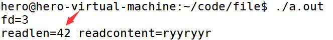
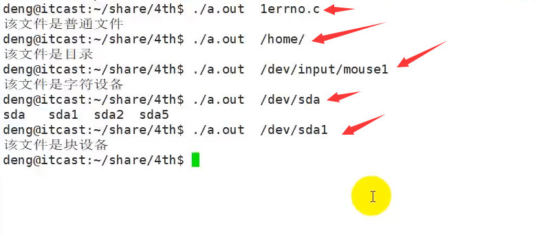
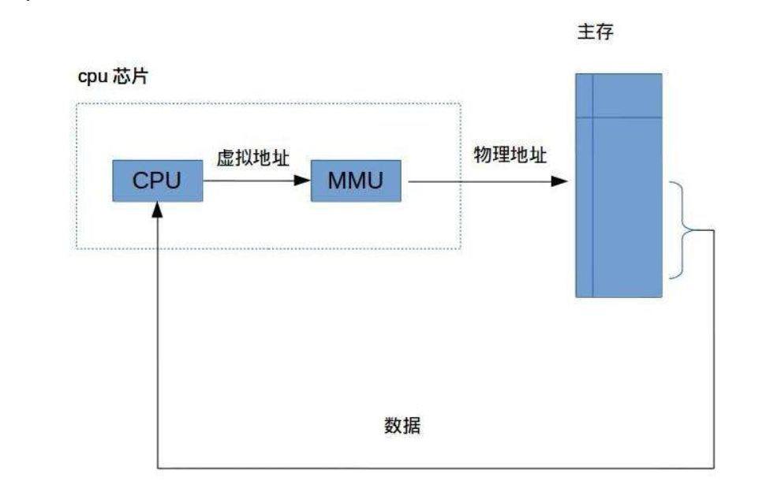
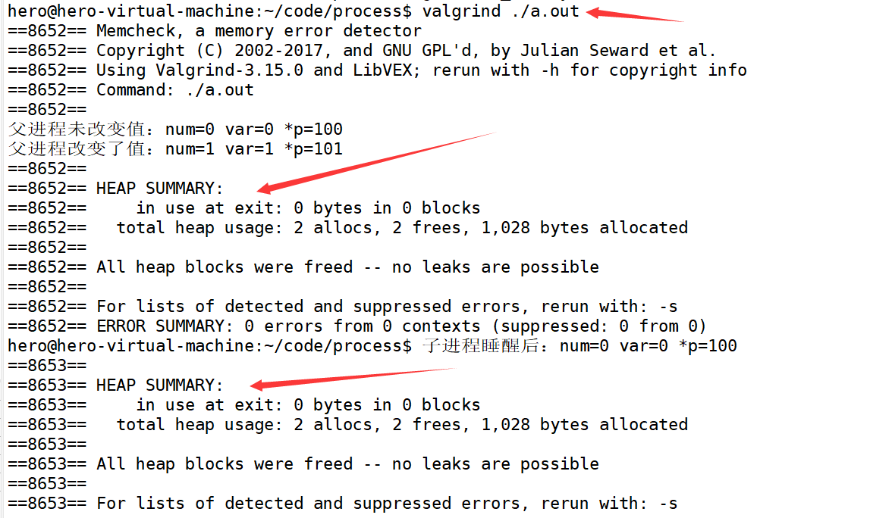
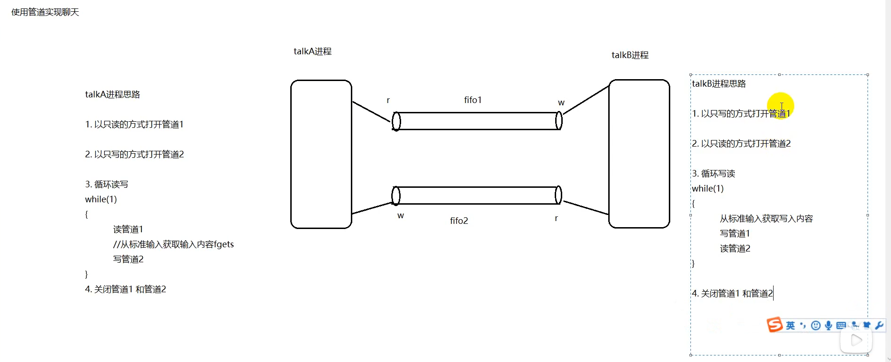
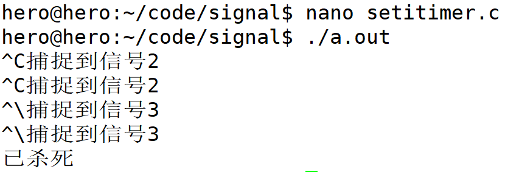

# hero

grep -n 'BBB' *

## 1. 基本命令

**touch -p**

**cp -r**

**rm -r**

## 2. vim gcc

`!g`：代表执行最近一次以g开头的命令。

## 3. makefile

## 4. 文件和系统

### 4.1 系统调用简介和实现

#### 4.1.1 什么是系统调用

系统调用，顾名思义，**说的是操作系统提供给用户程序调用的一组“特殊”接口**。用户程序可以通过这组“特殊”接口来获得操作系统内核提供的服务，比如用户可以通过文件系统相关的调用请求系统打开文件、关闭文件或读写文件，可以通过时钟相关的系统调用获得系统时间或设置定时器等。

从逻辑上来说，系统调用可被看成是一个内核与用户空间程序交互的接口——它好比一个中间人，把用户进程的请求传达给内核，待内核把请求处理完毕后再将处理结果送回给用户空间。


系统服务之所以需要通过系统调用来提供给用户空间的根本原因是为了对系统进行“保护”，因为我们知道 Linux 的运行空间分为内核空间与用户空间，它们各自运行在不同的级别中，逻辑上相互隔离。

所以用户进程在通常情况下不允许访问内核数据，也无法使用内核函数，它们只能在用户空间操作用户数据，调用用户空间函数。

比如我们熟悉的“hello world”程序（执行时）就是标准的用户空间进程，它使用的打印函数 printf 就属于用户空间函数，打印的字符“hello word”字符串也属于用户空间数据。

但是很多情况下，用户进程需要获得系统服务（调用系统程序），这时就必须利用系统提供给用户的“特殊接口”——系统调用了，它的特殊性主要在于规定了用户进程进入内核的具体位置。

换句话说，用户访问内核的路径是事先规定好的，只能从规定位置进入内核，而不准许肆意跳入内核。有了这样的陷入内核的统一访问路径限制才能保证内核安全无误。我们可以形象地描述这种机制：作为一个游客，你可以买票要求进入野生动物园，但你必须老老实实地坐在观光车上，按照规定的路线观光游览。当然，不准下车，因为那样太危险，不是让你丢掉小命，就是让你吓坏了野生动物。


#### 4.1.2 系统调用的实现

系统调用是属于操作系统内核的一部分的，必须以某种方式提供给进程让它们去调用。CPU 可以在不同的特权级别下运行，而相应的操作系统也有不同的运行级别，**用户态和内核态**。运行在内核态的进程可以毫无限制的访问各种资源，而在用户态下的用户进程的各种操作都有着限制，比如不能随意的访问内存、不能开闭中断以及切换运行的特权级别。显然，属于内核的系统调用一定是运行在内核态下，但是如何切换到内核态呢？

**==答案是软件中断。软件中断和我们常说的中断（硬件中断）不同之处在于，它是通过软件指令触发而并非外设引发的中断，也就是说，又是编程人员开发出的一种异常（该异常为正常的异常==）**。**==操作系统一般是通过软件中断从用户态切换到内核态。==**

#### 4.1.3 系统调用和库函数的区别

Linux 下对文件操作有两种方式：**系统调用（system call）**和**库函数调用（Library functions）**。

**==库函数由两类函数组成：==**

1）`不需要调用系统调用`

**不需要切换到内核空间即可完成函数全部功能，并且将结果反馈给应用程序，如strcpy、bzero 等字符串操作函数。**

2）`需要调用系统调用`

需要切换到内核空间，这类函数通过封装系统调用去实现相应功能，如 printf、fread等。


**==系统调用是需要时间的，程序中频繁的使用系统调用会降低程序的运行效率。当运行内核代码时，CPU工作在内核态，在系统调用发生前需要保存用户态的栈和内存环境，然后转入内核态工作。系统调用结束后，又要切换回用户态。这种环境的切换会消耗掉许多时间 。==**

#### 4.1.4 C库中IO函数工作流程


库函数访问文件的时候根据需要，设置不同类型的缓冲区，从而减少了直接调用 IO 系统调用的次数，提高了访问效率。


这个过程类似于快递员给某个区域（内核空间）送快递一样，快递员有两种方式送：

1）来一件快递就马上送到目的地，来一件送一件，这样导致来回走比较频繁（系统调用）

2）等快递攒着差不多后（缓冲区），才一次性送到目的地（库函数调用）

#### 4.1.4 错误处理函数

`errno(全局变量) 是记录系统的最后一次错误的代码`。代码是一个`int`型的值，在`errno.h`中定义。查看错误代码`errno`是调试程序的一个重要方法。

当`Linux C api`函数发生异常时，**==一般会将errno全局变量赋一个整数值==**，不同的值表示不同的含义，可以通过查看该值推测出错的原因。

 

测试程序：

```c
#include <stdio.h>  //fopen
#include <errno.h>  //errno
#include <string.h> //strerror(errno)
​
int main()
{
    FILE *fp = fopen("xxxx", "r");
    if (NULL == fp)
    {
        printf("%d\n", errno);  //打印错误码
        printf("%s\n", strerror(errno)); //把errno的数字转换成相应的文字
        perror("fopen");    //打印错误原因的字符串 推荐使用
    }
​
    return 0;
}
```

**==注意：使用perror函数的时候，一定要记得用帮助手册查看一下这个函数(如`fopen`)有没有设置错误号。==**


查看错误号：

>/usr/include/asm-generic/errno-base.h
>
>/usr/include/asm-generic/errno.h


#### 4.1.5 虚拟地址空间

**==每个进程都会分配虚拟地址空间，在32位机器上，该地址空间为4G 。==**


在进程里平时所说的指针变量，保存的就是虚拟地址。当应用程序使用虚拟地址访问内存时，处理器（CPU）会将其转化成物理地址（MMU）。

MMU：将虚拟的地址转化为物理地址。

这样做的好处在于：

- 进程隔离，更好的保护系统安全运行
- 屏蔽物理差异带来的麻烦，方便操作系统和编译器安排进程地址

#### 4.1.6 文件描述符

在 Linux 的世界里，一切设备皆文件。我们可以系统调用中 I/O 的函数（I：input，输入；O：output，输出），对文件进行相应的操作（ open()、close()、write() 、read() 等）。

打开现存文件或新建文件时，系统（内核）会返回一个文件描述符，文件描述符用来指定已打开的文件。这个文件描述符相当于这个已打开文件的标号，文件描述符是非负整数，是文件的标识，操作这个文件描述符相当于操作这个描述符所指定的文件。

程序运行起来后（每个进程）都有一张文件描述符的表，`标准输入`、`标准输出`、`标准错误输出设备文件`被打开，对应的文件描述符 0、1、2 记录在表中。==**程序运行起来后这三个文件描述符是`默认打开`的。**==

```text
#define STDIN_FILENO  0 //标准输入的文件描述符
#define STDOUT_FILENO 1 //标准输出的文件描述符
#define STDERR_FILENO 2 //标准错误的文件描述符
```

**==每打开一个新文件，则占用一个文件描述符，而且是空闲的最小的一个文件描述符==**

在程序运行起来后打开其他文件时，系统会返回文件描述符表中最小可用的文件描述符，并将此文件描述符记录在表中。


**最大打开的文件个数**

Linux 中一个进程最多只能打开 `NR_OPEN_DEFAULT` （即1024）个文件，故当文件不再使用时应及时调用 `close()` 函数关闭文件。

 

- 查看当前系统允许打开最大文件个数：

  > `cat /proc/sys/fs/file-max`

- 当前默认设置最大打开文件个数1024

  > `ulimit -a`

- 修改默认设置最大打开文件个数为4096

  > `ulimit -n 4096`

#### 4.1.7 常用文件IO函数

##### 4.1.7.1 open函数

```c
#include <sys/types.h>
#include <sys/stat.h>
#include <fcntl.h>
​
int open(const char *pathname, int flags);
int open(const char *pathname, int flags, mode_t mode);
功能：
    打开文件，如果文件不存在则可以选择创建。
参数：
    pathname：文件的路径及文件名
    flags：打开文件的行为标志，必选项 O_RDONLY, O_WRONLY, O_RDWR
    mode：这个参数，只有在文件不存在时有效，指新建文件时指定文件的权限
返回值：
    成功：成功返回打开的文件描述符
    失败：-1
```

示例：

```c
//1．以只读的方式打开一个文件如果文件不存在就报错l
fd = open ( "txt", O_RDONLY);
//2．以只写的方式打开一个文件如果文件存在就直接打开如果文件不存在就新建一个文件
fd = open ( "txt", O_WRONLY |O_CREAT,0644);
//3．以只写的方式打开一个文件，如果文件存在就报错，如果文件不存在就新建一个文件
fd = open ( "txt", O_WRONLY |O_CREAT | O_EXCL, 0644);
//4，以读写的方式打开一个文件，如果文件存在就打开，如果文件不存在就新建一个文件
fd = open ( "txt",O_RDWR | O_CREAT，0644);
//5.O_TRUNC 清空文件内容
//如果文件不存在就新建一个文件如果文件存在打开之后清空
fd = open ( "txt" , O_WRONLY | O_TRUNC | 0_CREAT，0644);
//6. O_APPEND 追加的方式
//以只写的方式和追加的方式打开一个文件如果文件不存在会报错
fd = open ( "txt",O_WRONLY |0_APPEND);
```


**flags详细说明**

必选项：

| **取值** | **含义**               |
| :------- | :--------------------- |
| O_RDONLY | 以只读的方式打开       |
| O_WRONLY | 以只写的方式打开       |
| O_RDWR   | 以可读、可写的方式打开 |

**==可选项，和必选项按位或起来==**

| **取值**    | **含义**                                                   |
| :---------- | :--------------------------------------------------------- |
| `O_CREAT`   | 文件不存在则创建文件，使用此选项时需使用mode说明文件的权限 |
| O_EXCL      | 如果同时指定了O_CREAT，且文件已经存在，则出错              |
| `O_TRUNC`   | 如果文件存在，则清空文件内容                               |
| O_APPEND    | 写文件时，数据添加到文件末尾                               |
| O_NONBLOCK` | 对于设备文件, 以O_NONBLOCK方式打开可以做非阻塞I/O          |

**mode补充说明(一般不使用)**

1) 文件最终权限：mode & ~umask

2) shell进程的umask掩码可以用umask命令查看

Ø umask：查看掩码（补码）

Ø umask mode：设置掩码，mode为八进制数

Ø umask -S：查看各组用户的默认操作权限

| **取值** | **八进制** | 含义                                   |
| :------- | :--------- | :------------------------------------- |
| S_IRWXU  | 00700      | 文件所有者的读、写、可执行权限         |
| S_IRUSR  | 00400      | 文件所有者的读权限                     |
| S_IWUSR  | 00200      | 文件所有者的写权限                     |
| S_IXUSR  | 00100      | 文件所有者的可执行权限                 |
| S_IRWXG  | 00070      | 文件所有者同组用户的读、写、可执行权限 |
| S_IRGRP  | 00040      | 文件所有者同组用户的读权限             |
| S_IWGRP  | 00020      | 文件所有者同组用户的写权限             |
| S_IXGRP  | 00010      | 文件所有者同组用户的可执行权限         |
| S_IRWXO  | 00007      | 其他组用户的读、写、可执行权限         |
| S_IROTH  | 00004      | 其他组用户的读权限                     |
| S_IWOTH  | 00002      | 其他组用户的写权限                     |
| S_IXOTH  | 00001      | 其他组用户的可执行权限close函数        |

##### 4.1.7.2 close函数

```c
#include <unistd.h>
​
int close(int fd);
功能：
    关闭已打开的文件
参数：
    fd : 文件描述符，open()的返回值
返回值：
    成功：0
    失败： -1, 并设置errno
```

**需要说明的是，当一个进程终止时，内核对该进程所有尚未关闭的文件描述符调用close关闭，所以即使用户程序不调用close，在终止时内核也会自动关闭它打开的所有文件。**

**==但是对于一个长年累月运行的程序(比如网络服务器)，打开的文件描述符一定要记得关闭,否则随着打开的文件越来越多，会占用大量文件描述符和系统资源。==**


##### 4.1.7.3 write函数

```c

#include <unistd.h>
ssize_t write(int fd, const void *buf, size_t count);
功能：
    把指定数目的数据写到文件（fd）
参数：
    fd :  文件描述符
    buf : 数据首地址
    count : 写入数据的长度（字节）
返回值：
    成功：实际写入数据的字节个数
    失败： - 1
```

示例：

```c
#include <stdio.h>
#include <string.h>
#include <sys/types.h>
#include <sys/stat.h>
#include <fcntl.h>
#include <unistd.h>
int main()
{
	int fd=-1;
    //1. 以只写的方式打开一个文件,若没有则创建
	fd=open("txt",O_WRONLY|O_CREAT,0644);
	if(fd==-1)
	{
		perror("fopen:");
	}
	printf("fd=%d\n",fd);
    
   //2.写文件
    char buff[]="hello world";
    int len=-1;
    len=write(fd,buff,strlen(buff));
    if(len==-1)
    {
        perror("write:");
        return -1;
    }
    printf("write len=%d\n",len);
    //3.关闭文件
	close(fd);
    return 0;
}
```


##### 4.1.7.4  read函数

```c
#include <unistd.h>
​
ssize_t read(int fd, void *buf, size_t count);
功能：
    把指定数目的数据读到内存（缓冲区）
参数：
    fd : 文件描述符
    buf : 内存首地址
    count : 读取的字节个数
返回值：
    成功：实际读取到的字节个数
    失败： - 1
```

示例：

```c
#include <stdio.h>
#include <string.h>
#include <sys/types.h>
#include <sys/stat.h>
#include <fcntl.h>
#include <unistd.h>
const int N=128;
int main()
{
	int fd=-1;
    //1. 以只读的方式打开一个文件
	fd=open("txt",O_RDONLY);
	if(fd==-1)
	{
		perror("fopen:");
	}
	printf("fd=%d\n",fd);
    
   //2.读文件
    char buff[N];
    memset(buff,0,sizeof buff);
    int len=-1;
    len=read(fd,buff,N);
    if(len==-1)
    {
        perror("read:");
        return -1;
    }
    printf("read len=%d %s\n",len,buff);
    //3.关闭文件
	close(fd);
    return 0;
}
```


**阻塞和非阻塞的概念**

**读常规文件是不会阻塞的，不管读多少字节，read一定会在有限的时间内返回。**

从**==终端设备==**或**==网络==**读则不一定，如**==果从终端输入的数据没有换行符，调用read读终端设备就会阻塞，如果网络上没有接收到数据包，调用read从网络读就会阻塞，至于会阻塞多长时间也是不确定的，如果一直没有数据到达就一直阻塞在那里。==**

**同样，写常规文件是不会阻塞的，而向终端设备或网络写则不一定。**

**【注意】==阻塞与非阻塞是对于文件而言的==，而不是指read、write等的属性。**

以非阻塞方式打开文件程序示例：

```c
#include <unistd.h> //read
#include <sys/types.h>
#include <sys/stat.h>
#include <fcntl.h>
#include <stdio.h>
#include <errno.h> //EAGAIN
​
int main()
{
    // /dev/tty --> 当前终端设备
    // 以不阻塞方式(O_NONBLOCK)打开终端设备
    int fd = open("/dev/tty", O_RDONLY | O_NONBLOCK);
​
    char buf[10];
    int n;
    n = read(fd, buf, sizeof(buf));
    if (n < 0)
    {
        // 如果为非阻塞，但是没有数据可读，此时全局变量 errno 被设置为 EAGAIN
        if (errno != EAGAIN)
        {
            perror("read /dev/tty");
            return -1;
        }
        printf("没有数据\n");
    }
​
    return 0;
}
```

##### 4.1.7.5 lseek函数

```c

#include <sys/types.h>
#include <unistd.h>
​
off_t lseek(int fd, off_t offset, int whence);
功能：
    改变文件的偏移量
参数：
    fd：文件描述符
    offset：根据whence来移动的位移数（偏移量），可以是正数，也可以负数，如果正数，则相对于whence往右移动，如果是负数，则相对于whence往左移动。如果向前移动的字节数超过了文件开头则出错返回，如果向后移动的字节数超过了文件末尾，再次写入时将增大文件尺寸。
​
    whence：其取值如下：
        SEEK_SET：从文件开头移动offset个字节
        SEEK_CUR：从当前位置移动offset个字节
        SEEK_END：从文件末尾移动offset个字节
返回值：
    若lseek成功执行, 则返回新的偏移量
    如果失败， 返回-1
```

**所有打开的文件都有一个当前文件偏移量(current file offset)，以下简称为 cfo。cfo 通常是一个非负整数，==用于表明文件开始处到文件当前位置的字节数==。**

读写操作通常开始于 cfo，并且使 cfo 增大，增量为读写的字节数。**==文件被打开时，cfo 会被初始化为 0，除非使用了 O_APPEND 。==**


代码示例：

```c
#include<stdio.h>
#include<stdlib.h>
#include<string.h>
#include<unistd.h>
#include <errno.h>
#include <sys/types.h>
#include <sys/stat.h>
#include <fcntl.h>

int main()
{
	//lseek使用
	//1.打开文件
	int fd=open("txt",O_RDWR|O_CREAT,0644);
	if(fd==-1)
	{
		//perror("open");
	}
	printf("fd=%d\n",fd);
	//2.lseek操作
	write(fd,"ryyryyr",7);
	int ret=lseek(fd,32,SEEK_SET);  //从文件开头偏移32字节
	if(ret==-1)
	{
		perror("lseek");
		return 1;
	}
	write(fd,"1234567890",10);
	lseek(fd,0,SEEK_SET);
	char buf[110];
	int readlen=read(fd,buf,sizeof buf);
	printf("readlen=%d readsontent=%s\n",readlen,buf);
	//3.关闭文件
	close(fd);
	return 0;
}
```

1. 首先我们写入了`7`个字节，然后偏移了`32`字节。再写入了`10`个字节。所以文件大小为`32+10=42`字节

   

2. 由于没有重置偏移指针，所以我们没有读到任何内容

   

3. 将文件指针指到文件开头处(0处)，可以读出内容。但是由于中间的内容是`\0`。所以`%s`认为字符串结束，所以读不到后面的`1234567890`。

   

4. ==**查看`ascii`码。**==

   ```shell
   man ascii
   ```

#### 4.1.8 文件操作相关函数

##### 4.1.8.1 stat函数(重点) 

**==值得一提的是，你可以直接在终端`stat filename`查看文件的一些具体信息。==**

```c

#include <sys/types.h>
#include <sys/stat.h>
#include <unistd.h>
​
int stat(const char *path, struct stat *buf);
int lstat(const char *pathname, struct stat *buf);
功能：
    获取文件状态信息
    stat和lstat的区别：
        当文件是一个符号链接时，lstat返回的是该符号链接本身的信息；
        而stat返回的是该链接指向的文件的信息。
参数：
    path：文件名
    buf：保存文件信息的结构体
返回值：
    成功： 0
    失败: -1
```

struct stat结构体说明：

```c
struct stat {
    dev_t           st_dev;     //文件的设备编号
    ino_t           st_ino;     //节点
    mode_t          st_mode;            //文件的类型和存取的权限
    nlink_t         st_nlink;       //连到该文件的硬连接数目，刚建立的文件值为1
    uid_t           st_uid;     //用户ID
    gid_t           st_gid;     //组ID
    dev_t           st_rdev;        //(设备类型)若此文件为设备文件，则为其设备编号
    off_t           st_size;        //文件字节数(文件大小)
    blksize_t       st_blksize;     //块大小(文件系统的I/O 缓冲区大小)
    blkcnt_t        st_blocks;      //块数
    time_t          st_atime;       //最后一次访问时间
    time_t          st_mtime;       //最后一次修改时间(指内容)
    time_t          st_ctime;       //最后一次改变时间(指属性)
};
```

示例：

```c
#include <stdio.h>
#include <string.h>
#include <stdlib.h>
#include <sys/types.h>
#include <sys/stat.h>
#include <unistd.h>

#if 0
struct stat {
    dev_t     st_dev;         /* ID of device containing file */
    ino_t     st_ino;         /* inode number */
    mode_t    st_mode;        /* protection */
    nlink_t   st_nlink;       /* number of hard links */
    uid_t     st_uid;         /* user ID of owner */
    gid_t     st_gid;         /* group ID of owner */
    dev_t     st_rdev;        /* device ID (if special file) */
    off_t     st_size;        /* total size, in bytes */
    blksize_t st_blksize;     /* blocksize for filesystem I/O */
    blkcnt_t  st_blocks;      /* number of 512B blocks allocated */

    /* Since Linux 2.6, the kernel supports nanosecond
     *                   precision for the following timestamp fields.
     *                                     For the details before Linux 2.6, see NOTES. */

    struct timespec st_atim;  /* time of last access */
    struct timespec st_mtim;  /* time of last modification */
    struct timespec st_ctim;  /* time of last status change */

#define st_atime st_atim.tv_sec      /* Backward compatibility */
#define st_mtime st_mtim.tv_sec
#define st_ctime st_ctim.tv_sec
};

S_IFMT     0170000   bit mask for the file type bit field

S_IFSOCK   0140000   socket
S_IFLNK    0120000   symbolic link
S_IFREG    0100000   regular file
S_IFBLK    0060000   block device
S_IFDIR    0040000   directory
S_IFCHR    0020000   character device
S_IFIFO    0010000   FIFO


#endif

//查看文件信息命令
//deng@itcast:~/share/4th$ stat txt

//获取文件相关信息
int main(int argc, char **argv)
{
    int ret = -1;

    struct stat buf;

    if (2 != argc)
    {
        printf("usage: ./a.out filename\n"); 
        return 1;
    }

    memset(&buf, 0, sizeof(buf));
    //获取文件相关信息
    ret = stat(argv[1], &buf);
    if (-1 == ret)
    {
        perror("stat"); 
        return 1;
    }

    printf("st_dev: %lu\n", buf.st_dev);
    printf("st_ino: %lu\n", buf.st_ino);
    printf("st_nlink: %lu\n", buf.st_nlink);
    printf("st_uid: %d\n", buf.st_uid);
    printf("st_gid: %d\n", buf.st_gid);
    printf("st_rdev:%lu\n", buf.st_rdev);
    printf("st_size: %ld\n", buf.st_size);
    printf("st_blksize: %ld\n", buf.st_blksize);
    printf("st_blocks: %ld\n", buf.st_blocks);

#if 0
    switch((buf.st_mode & S_IFMT))  //就是模仿这个判断模式
    {                               //具体的man一下就知道了
        case S_IFSOCK:   
            printf("socket\n");
            break;
        case S_IFLNK :   
            printf("symbolic link\n");
            break;
        case S_IFREG :   
            printf("regular file\n");
            break;
        case S_IFBLK :   
            printf("block device\n");
            break;
        case S_IFDIR :   
            printf("directory\n");
            break;
        case S_IFCHR :   
            printf("character device\n");
            break;
        case S_IFIFO :   
            printf("FIFO\n");
            break;
        defalt:
            printf("未知类型....\n");
    }
#else
 
    if (S_ISREG(buf.st_mode) )           //得益于宏的实现(为什么我在帮助文档查不到？？？)
        printf("is it a regular file \n"); 
    if (S_ISDIR(buf.st_mode) ) 
        printf("directory            \n");   
    if (S_ISCHR(buf.st_mode) ) 
        printf("character device     \n");   
    if (S_ISBLK(buf.st_mode) ) 
        printf("block device         \n"); 
    if (S_ISFIFO(buf.st_mode)) 
        printf("FIFO (named pipe)    \n");   
    if (S_ISLNK(buf.st_mode) ) 
        printf("symbolic link        \n");    
    if (S_ISSOCK(buf.st_mode)) 
        printf("socket               \n");   


#endif

    //判断文件所属者权限         (为什么我在帮助文档查不到？？？)
    if (buf.st_mode & S_IRUSR)
        printf("r");
    else
        printf("-");

    buf.st_mode & S_IWUSR ? printf("w") : printf("-");
    buf.st_mode & S_IXUSR ? printf("x") : printf("-");

    //判断文件所属组权限
    buf.st_mode & S_IRGRP ? printf("r") : printf("-");
    buf.st_mode & S_IWGRP ? printf("w") : printf("-");
    buf.st_mode & S_IXGRP ? printf("x") : printf("-");

    //判断文件其它权限
    buf.st_mode & S_IROTH ? printf("r") : printf("-");
    buf.st_mode & S_IWOTH ? printf("w") : printf("-");
    buf.st_mode & S_IXOTH ? printf("x") : printf("-");


    printf("\n");


    return 0;
}
```

结果：



****


总结一下：

st_mode(16位整数)参数说明：


文件类型判断应使用宏函数


##### 4.1.8.2 access函数

```c

#include <unistd.h>
​
int access(const char *pathname, int mode);
功能：测试指定文件是否具有某种属性
参数：
    pathname：文件名
    mode：文件权限，4种权限
        R_OK：   是否有读权限
        W_OK：   是否有写权限
        X_OK：   是否有执行权限
        F_OK：   测试文件是否存在
返回值：
    0：  有某种权限，或者文件存在
    -1：没有，或文件不存在
```

```
access("txt", F_OK);
```

##### 4.1.8.3 chmod函数

```c
#include <sys/stat.h>
​
int chmod(const char *pathname, mode_t mode);
功能：修改文件权限
参数：
    filename：文件名
    mode：权限(8进制数)  你当十进制处理就行，因为最大是7
返回值：
    成功：0
    失败：-1
```

##### 4.1.8.4 truncate函数

```c
#include <unistd.h>
#include <sys/types.h>
​
int truncate(const char *path, off_t length);
功能：修改文件大小
参数：
    path：文件文件名字
    length：指定的文件大小
        a)比原来小, 删掉后边的部分
        b)比原来大, 向后拓展
返回值：
    成功：0
    失败：-1
```

##### 4.1.8.5 link函数

```c
#include <unistd.h>
​
int link(const char *oldpath, const char *newpath);
功能：创建一个硬链接
参数：
    oldpath：源文件名字
    newpath：硬链接名字
返回值：
    成功：0
    失败：-1
```

##### 4.1.8.6 symlink函数

```c
#include <unistd.h>
​
int symlink(const char *target, const char *linkpath);
功能：创建一个软链接
参数：
    target：源文件名字
    linkpath：软链接名字
返回值：
    成功：0
    失败：-1
```

##### 4.1.8.7  readlink函数

```c

#include <unistd.h>

ssize_t readlink(const char *pathname, char *buf, size_t bufsiz);
功能：读软连接对应的文件名，不是读内容(该函数只能读软链接文件)
参数：
    pathname：软连接名
    buf：存放软件对应的文件名
    bufsiz ：缓冲区大小(第二个参数存放的最大字节数)
返回值：
    成功：>0，读到buf中的字符个数
    失败：-1
```

##### 4.1.8.8 unlink函数

```c
#include <unistd.h>
​
int unlink(const char *pathname);
功能：删除一个文件(软硬链接文件)
参数：
    pathname：删除的文件名字
返回值：
    成功：0
    失败：-1
```

##### 4.1.8.9 rename函数

```c
#include <stdio.h>
​
int rename(const char *oldpath, const char *newpath);
功能：把oldpath的文件名改为newpath
参数：
oldpath：旧文件名
newpath：新文件名
返回值：
成功：0
失败：-1
```

#### 4.1.9 文件描述符复制(重点)

##### 4.1.9.1 概述

`dup()` 和 `dup2()` **是两个非常有用的==系统调用==**，都是用来复制一个文件的描述符，使新的文件描述符也标识旧的文件描述符所标识的文件。

**这个过程类似于现实生活中的配钥匙，钥匙相当于文件描述符，锁相当于文件，本来一个钥匙开一把锁，相当于，一个文件描述符对应一个文件，现在，我们去配钥匙，通过旧的钥匙复制了一把新的钥匙，这样的话，旧的钥匙和新的钥匙都能开启这把锁。**

对比于 dup(), dup2() 也一样，通过原来的文件描述符复制出一个新的文件描述符，这样的话，**==原来的文件描述符和新的文件描述符都指向同一个文件，我们操作这两个文件描述符的任何一个，都能操作它所对应的文件==。**

##### 4.1.9.2 dup函数

```c
#include <unistd.h>
​
int dup(int oldfd);
功能：
    通过 oldfd 复制出一个新的文件描述符，新的文件描述符是调用进程文件描述符表中最小可用的文件描述符，最终 oldfd 和新的文件描述符都指向同一个文件。
参数：
    oldfd : 需要复制的文件描述符 oldfd
返回值：
        成功：新文件描述符
        失败： -1
```

##### 4.1.9.3 dup2函数

```c

#include <unistd.h>
​
int dup2(int oldfd, int newfd);
功能：
    通过 oldfd 复制出一个新的文件描述符 newfd，如果成功，newfd 和函数返回值是同一个返回值，最终 oldfd 和新的文件描述符 newfd 都指向同一个文件。
参数：
    oldfd : 需要复制的文件描述符
    newfd : 新的文件描述符，这个描述符可以人为指定一个合法数字（0 - 1023），如果指定的数字已经被占用（和某个文件有关联），此函数会自动关闭 close() 断开这个数字和某个文件的关联，再来使用这个合法数字。
返回值：
    成功：返回 newfd
    失败：返回 -1
```

示例：

```c
#include <stdio.h>
#include <string.h>
#include <stdlib.h>
#include <sys/types.h>
#include <sys/stat.h>
#include <fcntl.h>
#include <unistd.h>

//文件描述符复制
int main(void)
{
    int fd = -1;
    int newfd = -1;

    //1. 打开文件 Ctrl + P
    fd = open("txt", O_RDWR | O_CREAT | O_TRUNC, 0644);
    if (-1 == fd)
    {
        perror("open"); 
        return 1;
    }

    //2. 复制文件描述符
    //newfd = dup(fd);
    newfd = 10;
    //如果newfd文件描述符已经与其它文件关联, 那么先close, 然后在使用该数字
    newfd = dup2(fd, newfd);
    if (-1 == newfd)
    {
        perror("dup"); 
        return 1;
    }

    printf("fd : %d  newfd: %d\n", fd, newfd);

    write(fd, "123456789", 9);
    write(newfd, "ABCDEFGHI", 9);  //不会造成覆盖。共享文件表项

    
    //3. 关闭文件
    close(fd);
    close(newfd);

    return 0;
}

```

注意：如果你先打开一个文件(得到一个文件描述符)，再打开一个文件(再得到一个文件描述符)。那么你再这样写的话是会覆盖的哦！

```c
 write(fd, "123456789", 9);
 write(newfd, "ABCDEFGHI", 9);  //会覆盖
```


##### 4.1.9.4 示例分析


##### 4.1.9.5 fcnlt函数

```c
#include <unistd.h>
#include <fcntl.h>
​
int fcntl(int fd, int cmd, ... /* arg */);
功能：改变已打开的文件性质，fcntl针对描述符提供控制。
参数：
    fd：操作的文件描述符
    cmd：操作方式
    arg：针对cmd的值，fcntl能够接受第三个参数int arg。
返回值：
    成功：返回某个其他值
    失败：-1
```

>fcntl函数有5种功能：
>
>1) 复制一个现有的描述符（cmd=F_DUPFD）
>
>2) 获得／设置文件描述符标记(cmd=F_GETFD或F_SETFD)
>
>3) 获得／设置文件状态标记(cmd=F_GETFL或F_SETFL)
>
>4) 获得／设置异步I/O所有权(cmd=F_GETOWN或F_SETOWN)
>
>5) 获得／设置记录锁(cmd=F_GETLK, F_SETLK或F_SETLKW)

参考示例：

```c
// 等价于dup()
    int new_fd = fcntl(fd, F_DUPFD, 0);
​
    // 获取文件状态标志
    int flag = fcntl(fd, F_GETFL, 0);
    switch (flag & O_ACCMODE)
    {
    case O_RDONLY:
        printf("read only\n");
        break;
    case O_WRONLY:
        printf("write only\n");
        break;
    case O_RDWR:
        printf("read and write\n");
        break;
    default:
        break;
    }
​
    if (flag & O_APPEND)
    {
        printf("append\n");
    }
​
    flag |= O_APPEND; // 追加flag
    fcntl(fd, F_SETFL, flag); //设置文件状态标记
```


#### 4.1.10 目录相关操作(掌握)

##### 4.1.10.1 getcwd函数

```c
#include <unistd.h>
char *getcwd(char *buf, size_t size); //current work directory
功能：获取当前进程的工作目录
参数：
    buf : 缓冲区，存储当前的工作目录
    size : 缓冲区大小
返回值：
    成功：buf中保存当前进程工作目录位置
    失败：NULL
```

##### 4.1.10.2  chdir函数

```c
#include <unistd.h>
int chdir(const char *path);   //change directory
功能：修改当前进程(应用程序)的路径
参数：
    path：切换的路径
返回值：
    成功：0
    失败：-1
```

##### 4.1.10.3 opendir函数

```c
#include <sys/types.h>
#include <dirent.h>
DIR *opendir(const char *name);
功能：打开一个目录
参数：
    name：目录名
返回值：
    成功：返回指向该目录结构体指针
    失败：NULL
```

##### 4.1.10.4 closedir函数

```c
#include <sys/types.h>
#include <dirent.h>
int closedir(DIR *dirp);
功能：关闭目录
参数：
    dirp：opendir返回的指针
返回值：
    成功：0
    失败：-1
```

##### 4.1.10.5 readdir函数

```c
#include <dirent.h>
struct dirent *readdir(DIR *dirp);
功能：读取目录
参数：
    dirp：opendir的返回值
返回值：
    成功：目录结构体指针
    失败：NULL
```

相关结构体说明：

```c
struct dirent
{
    ino_t d_ino;                    // 此目录进入点的inode
    off_t d_off;                    // 目录文件开头至此目录进入点的位移
    signed short int d_reclen;      // d_name 的长度, 不包含NULL 字符
    unsigned char d_type;           // d_type 所指的文件类型 
    char d_name[256];               // 文件名
};
```

d_type文件类型说明：


值得一提的是，有新建目录这个函数`mkdir`。具体的可以`man 2 mkdir`进行查看。

### 4.2 获取用户信息相关函数

#### 4.2.1 getpwnam系列

getpwnam函数功能是获取用户登录相关信息。

```c
#include <sys/types.h>
#include <pwd.h>
//根据name获取用户信息
//根据uid获取用户信息
struct passwd *getpwnam(const char *name);  //nam是指name
struct passwd *getpwuid(uid_t uid);

int getpwnam_r(const char *name, struct passwd *pwd,
	char *buf, size_t buflen, struct passwd **result);
int getpwuid_r(uid_t uid, struct passwd *pwd,
	char *buf, size_t buflen, struct passwd **result);
```

**若成功，返回指针;若出错或者达到文件尾端，返回NULL。**

信息存贮在如下的结构体之中:

```c
The passwd structure is defined in <pwd.h> as follows:
struct passwd {
	char   *pw_name;       /* username */
	char   *pw_passwd;     /* user password */
	uid_t   pw_uid;        /* user ID */
	gid_t   pw_gid;        /* group ID */
	char   *pw_gecos;      /* user information */
	char   *pw_dir;        /* home directory */
	char   *pw_shell;      /* shell program */
};
```

eg:

```c
#include <stdio.h>
#include <pwd.h>
int main() 
{
    struct passwd *pw;
    char *username = "tuotao";
    pw = getpwnam(username);
    //or pw = getpwuid(username);
    if (!pw) {
        printf("%s is not exist\n", username);
        return -1;
    }
    printf("pw->pw_name = %s\n", pw->pw_name);
    printf("pw->pw_passwd = %s\n", pw->pw_passwd);
    printf("pw->pw_uid = %d\n", pw->pw_uid);
    printf("pw->pw_gid = %d\n", pw->pw_gid);
    printf("pw->pw_gecos = %s\n", pw->pw_gecos);
    printf("pw->pw_dir = %s\n", pw->pw_dir);
    printf("pw->pw_shell = %s\n", pw->pw_shell);
}
```

运行结果：

```c
pw->pw_name = tuotao
pw->pw_passwd = x
pw->pw_uid = 1001
pw->pw_gid = 1001
pw->pw_gecos = 
pw->pw_dir = /home/tuotao
pw->pw_shell = /bin/bash
```


## 5. 进程控制

### 5.1 学习目标

- 掌握目录遍历相关的函数使用
- 了解进程相关的概念
- 掌握fork/getpid/getppid函数的使用
- 熟练掌握ps/kill命令的使用
- 熟练掌握execl/execlp函数的使用
- 说出什么是孤儿进程和僵尸进程

### 5.2  进程和程序 (理解)

我们平时写的 C 语言代码，通过编译器编译，最终它会成为一个可执行程序，当这个可执行程序运行起来后（没有结束之前），它就成为了一个进程。

程序是存放在存储介质上的一个可执行文件，而进程是程序执行的过程。进程的状态是变化的，其包括进程的创建、调度和消亡。程序是静态的，进程是动态的。

示例：


程序就类似于剧本(纸)，进程类似于戏(舞台、演员、灯光、道具...)，同一个剧本可以在多个舞台同时上演。同样，同一个程序也可以加载为不同的进程(彼此之间互不影响)。

在 Linux 系统中，操作系统是通过进程去完成一个一个的任务，**进程是管理事务的基本单元。**

进程拥有自己独立的**处理环境**（如：当前需要用到哪些环境变量，程序运行的目录在哪，当前是哪个用户在运行此程序等）和**系统资源**（如：处理器 CPU 占用率、存储器、I/O设备、数据、程序）。

我们可以这么理解，公司相当于操作系统，部门相当于进程，公司通过部门来管理（系统通过进程管理），对于各个部门，每个部门有各自的资源，如人员、电脑设备、打印机等。

### 5.3 单道、多道程序设计(了解)

#### 5.3.1 单道程序设计

所有进程一个一个排队执行。若A阻塞，B只能等待，即使CPU处于空闲状态。而在人机交互时阻塞的出现是必然的。所有这种模型在系统资源利用上及其不合理，在计算机发展历史上存在不久，大部分便被淘汰了。

#### 5.3.2 多道程序设计

在计算机内存中同时存放几道相互独立的程序，它们在管理程序控制之下，相互穿插的运行。多道程序设计必须有硬件基础作为保证。

在计算机中**时钟中断**即为多道程序设计模型的理论基础。并发时，任意进程在执行期间都不希望放弃cpu。因此系统需要一种强制让进程让出cpu资源的手段。时钟中断有硬件基础作为保障，对进程而言不可抗拒。 操作系统中的中断处理函数，来负责调度程序执行。

在多道程序设计模型中，多个进程轮流使用CPU (分时复用CPU资源)。而当下常见CPU为纳秒级，1秒可以执行大约10亿条指令。由于人眼的反应速度是毫秒级，所以看似同时在运行。

> 1s = 1000ms
>
> 1ms = 1000us
>
> 1us = 1000ns
>
> 1s = 1000000000ns


### 5.4 并行和并发(理解)

**并行(parallel)：**指在同一时刻，有多条指令在多个处理器上同时执行。


**并发(concurrency)：**指在同一时刻只能有一条指令执行，但多个进程指令被快速的轮换执行，使得在宏观上具有多个进程同时执行的效果，但在微观上并不是同时执行的，只是把时间分成若干段，使多个进程快速交替的执行。


举例说明：

- 并行是两个队列**同时**使用两台咖啡机
- 并发是两个队列**交替**使用一台咖啡机


### 5.5 MMU(了解)

MMU是Memory Management Unit的缩写，中文名是[内存管理](https://baike.baidu.com/item/内存管理)单元，它是[中央处理器](https://baike.baidu.com/item/中央处理器)（CPU）中用来管理[虚拟存储器](https://baike.baidu.com/item/虚拟存储器)、物理存储器的控制线路，同时也负责[虚拟地址](https://baike.baidu.com/item/虚拟地址)映射为[物理地址](https://baike.baidu.com/item/物理地址)，以及提供硬件机制的内存访问授权，多用户多进程操作系统。



### 5.6  进程控制块PCB(了解)

进程运行时，内核为进程每个进程分配一个PCB（进程控制块），维护进程相关的信息，Linux内核的进程控制块是task_struct结构体。


在 /usr/src/linux-headers-xxx/include/linux/sched.h 文件中可以查看struct task_struct 结构体定义：

> deng@itcast:~/share$ vim /usr/src/linux-headers-4.10.0-28/include/linux/sched.h


其内部成员有很多，我们掌握以下部分即可：

- 进程id。系统中每个进程有唯一的id，在C语言中用pid_t类型表示，其实就是一个非负整数。
- 进程的状态，有就绪、运行、挂起、停止等状态。
- 进程切换时需要保存和恢复的一些CPU寄存器。
- 描述虚拟地址空间的信息。
- 描述控制终端的信息。
- 当前工作目录（Current Working Directory）。
- umask掩码。
- **文件描述符表，包含很多指向file结构体的指针。**
- 和信号相关的信息。
- 用户id和组id。
- 会话（Session）和进程组。
- 进程可以使用的资源上限（Resource Limit）。

### 5.7 进程的状态(重点)

进程状态反映进程执行过程的变化。这些状态随着进程的执行和外界条件的变化而转换。

在三态模型中，进程状态分为三个基本状态，即**运行态，就绪态，阻塞态**。

在五态模型中，进程分为**新建态、终止态，运行态，就绪态，阻塞态**。


**①TASK_RUNNING：**进程正在被CPU执行。当一个进程刚被创建时会处于TASK_RUNNABLE，表示己经准备就绪，正等待被调度。

　　**②TASK_INTERRUPTIBLE（可中断）：**进程正在睡眠（也就是说它被阻塞）等待某些条件的达成。一旦这些条件达成，内核就会把进程状态设置为运行。处于**此状态的进程也会因为接收到信号而提前被唤醒**，**比如给一个TASK_INTERRUPTIBLE状态的进程发送SIGKILL信号，这个进程将先被唤醒（进入TASK_RUNNABLE状态），然后再响应SIGKILL信号而退出**（变为TASK_ZOMBIE状态），并不会从TASK_INTERRUPTIBLE状态直接退出。

　　**③TASK_UNINTERRUPTIBLE（不可中断）：**处于等待中的进程，待资源满足时被唤醒，**但不可以由其它进程通过信号或中断唤醒**。由于不接受外来的任何信号，**因此无法用kill杀掉这些处于该状态的进程**。而**TASK_UNINTERRUPTIBLE状态存在的意义就在于**，**内核的某些处理流程是不能被打断的**。如果响应异步信号，程序的执行流程中就会被插入一段用于处理异步信号的流程，于是原有的流程就被中断了，这可能使某些设备陷入不可控的状态。处于TASK_UNINTERRUPTIBLE状态一般总是非常短暂的，通过ps命令基本上不可能捕捉到。

　　**④TASK_ZOMBIE（僵死）：**表示进程已经结束了，**但是其父进程还没有调用wait4或waitpid()来释放进程描述符**。为了父进程能够获知它的消息，子进程的进程描述符仍然被保留着。一旦父进程调用了wait4()，进程描述符就会被释放。

　　**⑤TASK_STOPPED（停止）：**进程停止执行。当进程接收到SIGSTOP，SIGTSTP，SIGTTIN，SIGTTOU等信号的时候。此外，**在调试期间接收到任何信号**，都会使进程进入这种状态。**当接收到SIGCONT信号，会重新回到TASK_RUNNABLE**。

如何查看进程状态：`ps -aux`


stat中的参数意义如下：

| **参数** | **含义**                                   |
| :------- | :----------------------------------------- |
| D        | **不可中断 Uninterruptible（usually IO）** |
| R        | 正在运行，或在队列中的进程                 |
| S(大写)  | **处于休眠状态**                           |
| T        | 停止或被追踪                               |
| Z        | **僵尸进程** `zombie`                      |
| W        | 进入内存交换（从内核2.6开始无效）          |
| X        | **死掉的进程**                             |
| <        | 高优先级                                   |
| N        | 低优先级                                   |
| s        | 包含子进程                                 |
| +        | 位于前台的进程组                           |

#### 5.7.1 ps

进程是一个具有一定独立功能的程序，它是操作系统动态执行的基本单元。

**==ps命令可以查看进程的详细状况，常用选项(选项可以不加“-”)如下：==**

| **选项** | **含义**                                     |
| :------- | :------------------------------------------- |
| -a       | **显示终端上的所有进程，包括其他用户的进程** |
| -u       | **显示进程的详细状态**                       |
| -x       | **显示没有控制终端的进程**                   |
| -w       | 显示加宽，以便显示更多的信息                 |
| -r       | **只显示正在运行的进程**                     |

`ps aux`

`ps ef`   //与ps aux基本等价

`ps -a`


#### 5.7.2 top

**top命令用来动态显示运行中的进程**。top命令能够在运行后，在指定的时间间隔更新显示信息。可以在使用top命令时加上-d 来指定显示信息更新的时间间隔。


在top命令执行后，可以按下按键得到对显示的结果进行排序：

| **按键** | **含义**                           |
| :------- | :--------------------------------- |
| M        | **根据内存使用量来排序**           |
| P        | **根据CPU占有率来排序**            |
| T        | 根据进程运行时间的长短来排序       |
| U        | 可以根据后面输入的用户名来筛选进程 |
| K        | 可以根据后面输入的PID来杀死进程。  |
| q        | 退出   只记这个即可                |
| h        | 获得帮助                           |


#### 5.7.3 kill

**==`kill`命令指定进程号的进程，需要配合 `ps` 使用。==**

使用格式：

kill [-signal] pid

信号值从0到15，**==其中9为绝对终止==**，可以处理一般信号无法终止的进程。

使用`kill -l`可查看所有信号。

**`kill 6252`** ：6252 为应用程序所对应的进程号


**==有些进程不能直接杀死，这时候我们需要加一个参数“ -9 ”，“ -9 ” 代表强制结束：==**


#### 5.7.4 killall

**==通过进程名字杀死进程。可以存在多个同名的不同进程。可以杀死多个同名进程==。**


### 5.8 进程号和相关函数

每个进程都由一个进程号来标识，其类型为 pid_t（整型），**==进程号的范围：0～32767。进程号总是唯一的，但进程号可以重用。当一个进程终止后，其进程号就可以再次使用。==**


接下来，再给大家介绍三个不同的进程号。

**进程号（PID）**：

标识进程的一个非负整型数。

**父进程号（PPID）**：

任何进程（ 除 init 进程）都是由另一个进程创建，该进程称为被创建进程的父进程，对应的进程号称为父进程号（PPID）。如，A 进程创建了 B 进程，A 的进程号就是 B 进程的父进程号。

**进程组号（PGID）**：

进程组是一个或多个进程的集合。他们之间相互关联，进程组可以接收同一终端的各种信号，**关联的进程有一个进程组号（PGID）** 。这个过程有点类似于 QQ 群，组相当于 QQ 群，各个进程相当于各个好友，把各个好友都拉入这个 QQ 群里，主要是方便管理，特别是通知某些事时，只要在群里吼一声，所有人都收到，简单粗暴。**但是，这个进程组号和 QQ 群号是有点区别的，==默认的情况下，当前的进程号会当做当前的进程组号==**。

#### 5.8.1 getpid函数

```c

#include <sys/types.h>
#include <unistd.h>
​
pid_t getpid(void);
功能：
    获取本进程号（PID）
参数：
    无
返回值：   
    本进程号  These functions are always successful.
```

#### 5.8.2 getppid函数

```c
#include <sys/types.h>
#include <unistd.h>
​
pid_t getppid(void);
功能：
    获取调用此函数的进程的父进程号（PPID）
参数：
    无
返回值：
    调用此函数的进程的父进程号（PPID）
```

#### 5.8.3 getpgid函数

```c
#include <sys/types.h>
#include <unistd.h>
​
pid_t getpgid(pid_t pid);
功能：
    获取进程组号（PGID）
参数：
    pid：进程号
返回值：
    参数为 0 时返回当前进程组号，否则返回参数指定的进程的进程组号
```

示例

```c

```


**==进程组号和进程号一样是因为把当前进程当组长了。==**

**==父进程id都一样，因为都是运行在当前终端上(换个终端的话父进程id肯定会发生变化)，即：==**


### 5.9 进程的创建（重点）

**==系统允许一个进程创建新进程，新进程即为子进程，子进程还可以创建新的子进程，形成进程树结构模型。==**

```C
#include <sys/types.h>
#include <unistd.h>

pid_t fork(void);
功能：
    用于从一个已存在的进程中创建一个新进程，新进程称为子进程，原进程称为父进程。
参数：
    无
返回值：
    成功：子进程中返回 0，父进程中返回子进程 ID。pid_t，为整型。
    失败：返回-1。
    失败的两个主要原因是：
        1）当前的进程数已经达到了系统规定的上限，这时 errno 的值被设置为 EAGAIN。
        2）系统内存不足，这时 errno 的值被设置为 ENOMEM。	
```

**==成功：子进程中返回 0，父进程中返回子进程 ID。pid_t，为整型。==**


**子进程创建成功后，父子进程根据调度算法开始执行余下的代码。自子进程创建成功后，相当于父子进程都各自拥有了相同的一份余下的代码，他们都能看到这份代码。所以我们可以根据返回值来区分父子进程。**

示例：

```c
#include<stdio.h>
#include<sys/types.h>
#include<unistd.h>

int main()
{
	//创建子进程
	fork();
	printf("hello world\n");
	return 0;
}
```


可以看到打印了两次`hello world`，说明确实创建了一个子进程。

这说明，fork() 之后确实创建了一个新的进程，新进程为子进程，原来的进程为父进程。

***

```c
for(int i=0;i<3;i++ )
{
    pid_t p=fork();
    cout<<"hello"<<endl;
}
```

这段代码会打印出14个hello。


因为第一轮循环裂变成2个进程，此时2个进程都打印一遍hello。就是打印一遍hello之后，两个进程都还在循环里呢，为什么你觉得会退出去呢？奇怪。 

因为第二轮循环裂变成4个进程，此时4个进程都打印一遍hello。

因为第三轮循环裂变成8个进程，此时8个进程都打印一遍hello。总共14=2+8+4。

如果hello不在循环中，则打印8个hello，因为最后存在8个进程往下执行。

### 5.10  父子进程关系

使用 fork() 函数得到的子进程是父进程的一个复制品，它从父进程处继承了整个进程的地址空间：**`包括进程上下文（进程执行活动全过程的静态描述）`、`进程堆栈`、`打开的文件描述符`、`信号控制设定`、`进程优先级`、进程组号等**。

**==子进程所独有的只有它的进程号，计时器等（只有小量信息）==**。因此，**==使用 fork() 函数的代价是很大的==**。

​                             

简单来说， 一个进程调用 fork() 函数后，**系统先给新的进程分配资源，例如存储数据和代码的空间。然后把原来的进程的所有值都复制到新的新进程中，只有少数值与原来的进程的值不同。相当于克隆了一个自己**。

实际上，更准确来说，Linux 的 fork() 使用是通过写时拷贝 (copy- on-write) 实现。写时拷贝是一种可以推迟甚至避免拷贝数据的技术。**内核此时并不复制整个进程的地址空间，而是让父子进程共享同一个地址空间。只用在需要写入的时候才会复制地址空间，从而使各个进行拥有各自的地址空间。也就是说，资源的复制是在需要写入的时候才会进行，==在此之前，只有以只读方式共享==**。

注意：**fork之后父子进程共享文件，fork产生的子进程与父进程相同的文件文件描述符指向相同的文件表，引用计数增加，共享文件文件偏移指针**。

### 5.11 区分父子进程

子进程是父进程的一个复制品，可以简单认为父子进程的代码一样的。那大家想过没有，这样的话，父进程做了什么事情，子进程也做什么事情（如上面的例子），是不是不能实现满足我们实现多任务的要求呀，那我们是不是要想个办法区别父子进程呀，这就通过 fork() 的返回值。

fork() 函数被调用一次，但返回两次。两次返回的区别是：**==子进程的返回值是 0，而父进程的返回值则是新子进程的进程 ID==**。

测试程序：

```c
int main()
{
    pid_t pid;
    pid = fork();
    if (pid < 0)
    {   // 没有创建成功  
        perror("fork");
        return 1;
    }
    if (0 == pid)  //返回0为子进程
    { // 子进程  
        while (1)
        {
            printf("I am son\n");
            sleep(1);
        }
    }
    else if (pid > 0)  //这个大于0的pid就是子进程的id号。
    { // 父进程  
        while (1)
        {
            printf("I am father\n");
            sleep(1);
        }
    }
    return 0;
}
```

运行结果如下：


通过运行结果，可以看到，父子进程各做一件事（各自打印一句话）。这里，我们只是看到只有一份代码，实际上，fork() 以后，有两个地址空间在独立运行着，有点类似于有两个独立的程序（父子进程）在运行着。

**==一般来说，在 fork() 之后是父进程先执行还是子进程先执行是不确定的。这取决于内核所使用的调度算法。==**

**==需要注意的是，在子进程的地址空间里，子进程是从 fork() 这个函数后才开始执行代码==**。


### 5.12 父子进程地址空间

父子进程各自的地址空间是独立的，**==读时共享，写时拷贝。==**

示例：

```c
#include<stdio.h>
#include<stdlib.h>
#include<unistd.h>
int num=0;
int main()
{
	int var=0;
	int* p=malloc(sizeof(int));
	*p=100;
    pid_t pid;
    pid = fork();
    if (pid < 0)
    {  
        perror("fork");
        return 1;
    }
    if (0 == pid)  
    {  
        sleep(1);
		printf("子进程睡醒后：num=%d var=%d *p=%d\n",num,var,*p);
    }
    else if (pid > 0)
    { 
		
		printf("父进程未改变值：num=%d var=%d *p=%d\n",num,var,*p);
		num++;
		var++;
		(*p)++;
		printf("父进程改变了值：num=%d var=%d *p=%d\n",num,var,*p);
    }
    return 0;
}
```

运行结果：


**==可以看到，父子进程的空间的确是互不干扰的。在数据发生写时，父子进程拥有自己独立的虚拟地址空间。==**


**==但是这段代码存在问题，我们在堆空间分配了内存但是没有进行释放。现在有了父子进程，我们应该释放一次还是两次？在父进程中释放还是在子进程中释放？？？(从父子进程`发生写时`都有自己的空间可以推测出，应该各自释放一次。)==**

在linux中我们可以借助`valgrind`(**==grind：磨碎，嚼碎，研细。所以是研细值的意思==**)这个工具(需要下载)来查看内存情况,`valgrind ./a.out`执行时加在前面即可。


**==`我们可以看到，父子进程的堆空间都有残余的4个字节没有释放`。于是我们需要在父子进行空间各自释放一次==**。

```c
#include<stdio.h>
#include<stdlib.h>
#include<unistd.h>
int num=0;
int main()
{
	int var=0;
	int* p=malloc(sizeof(int));
	*p=100;
    pid_t pid;
    pid = fork();
    if (pid < 0)
    {   // 没有创建成功  
        perror("fork");
        return 1;
    }
    if (0 == pid)  
    {  
        sleep(1);
		printf("子进程睡醒后：num=%d var=%d *p=%d\n",num,var,*p);
		free(p);   //记得释放
    }
    else if (pid > 0)
    { 
		
		printf("父进程未改变值：num=%d var=%d *p=%d\n",num,var,*p);
		num++;
		var++;
		(*p)++;
		printf("父进程改变了值：num=%d var=%d *p=%d\n",num,var,*p);
		free(p);   //记得释放
    }
    return 0;
}

```

运行结果：



**可以看到，消除了内存泄露的问题**。

### 5.13 vfork

在fork还没实现copy on write之前，**这时候的fork执行的地址空间的全拷贝**。Unix设计者很关心fork之后立刻执行exec所造成的地址空间浪费，所以引入了vfork系统调用,vfork不执行拷贝，直接共享父进程地址空间。
**vfork有个限制，子进程必须立刻执行_exit或者==exec==函数**。
即使后来fork实现了copy on write，效率也没有vfork高，但是我们不推荐使用vfork，因为几乎每一个vfork的实现，都或多或少存在一定的问题。

vfork设计的初衷就是vfork+exec函数族。就是创建进程+替换进程。

```C
#include <sys/types.h>
#include <unistd.h>
pid_t vfork(void);
```


例：

```c
#include<stdio.h>
#include<sys/types.h>
#include<unistd.h>  //_exit(0);
#include<stdlib.h>  //exit(0);
int g=100;
int main()
{
	pid_t pid=fork();
    if(pid==0)
    {
        g++;
        printf("child=%d\n",g);  //101
        _exit(0);   //用return 0或什么都不写会出现段错误，意思是说要用系统调用来结束。
        //exit(0)也可以。 这里可以体现出return 0和exit(0)的不同。
    }
    else
    {
        sleep(1);
        printf("parent=%d\n",g); //101
    }
}
```

与fork不同，因为是共享父进程地址空间，所以两个打印结果都是101。

### 5.13 GDB调试多进程

使用gdb调试的时候，gdb只能跟踪一个进程。可以在fork函数调用之前，通过指令设置gdb调试工具跟踪父进程或者是跟踪子进程。默认跟踪父进程。

- set follow-fork-mode child 设置gdb在fork之后跟踪子进程。
- set follow-fork-mode parent 设置跟踪父进程（默认）。

注意，一定要在fork函数调用之前设置才有效。

### 5.14 进程退出函数

相关函数：

```c
#include <stdlib.h>
void exit(int status);

#include <unistd.h>
void _exit(int status);  完全等价于_Exit(int status)  //暴力退出，不做任何事后清理工作
功能：
    结束调用此函数的进程。
参数：
    status：返回给父进程的参数（低 8 位有效），至于这个参数是多少根据需要来填写。
返回值：
    无
```


​		  

注：先调用`atexit`注册的退出处理函数，再刷IO缓冲区，关闭文件描述符。

`atexit`：这是一个库函数。

```c
#include <stdlib.h>
int atexit(void (*function)(void));
```

由atexit注册的函数，先注册的后调用。

示例：

```c
#include<stdio.h>
#include<unistd.h>  //_exit(0);
#include<stdlib.h>  //exit(0);
int main()
{
	printf("hello world\n");
    //exit(0);  等价return 0 它俩都会刷新缓冲区，等价于什么都不写
    
	_exit(0); //原则上不会打出hello world，那我为什么打出来了？因为你加了\n。它会刷新缓冲区
    _Exit(0); //完全等价_exit(0);
}

```


### 5.15  等待子进程退出函数

#### 5.15.1  概述

**在每个进程退出的时候，内核释放该进程所有的资源、包括打开的文件、占用的内存等**。**==但是仍然为其保留一定的信息，这些信息主要主要指进程控制块PCB的信息（包括进程号、退出状态、运行时间等）==**。


**父进程可以通过调用wait或waitpid==得到它的退出状态==`同时`彻底清除掉这个进程**。


`wait()` 和 `waitpid()` 函数的功能一样，区别在于，`wait()` **==函数会阻塞(父进程一直等待子进程结束)==**，

**==waitpid() 可以设置不阻塞，waitpid() 还可以指定等待哪个子进程结束==**。


注意：**==一次wait或waitpid调用只能清理一个子进程，清理多个子进程应使用循环==**。

#### 5.15.2 wait函数

函数说明：

```c

#include <sys/types.h>
#include <sys/wait.h>

pid_t wait(int *status);
功能：
    等待任意一个子进程结束，如果任意一个子进程结束了，此函数会回收该子进程的资源。
参数：
    status : 进程退出时的状态信息。
返回值：
    成功：已经结束子进程的进程号
    失败： -1
```

**调用 wait() 函数的进程会挂起（阻塞），直到它的一个子进程退出或收到一个不能被忽视的信号时才被唤醒（相当于继续往下执行）**。

**==若调用进程没有子进程，该函数立即返回；若它的子进程已经结束，该函数同样会立即返回，并且会回收那个早已结束进程的资源==**。

所以，wait()函数的主要功能为**回收已经结束子进程的资源**。

**如果参数 status 的值不是 NULL，wait() 就会把子进程退出时的状态取出并存入其中，这是一个==整数值==（int），指出了子进程是正常退出还是被非正常结束的**。

**==这个退出信息在一个 int 中包含了多个字段，直接使用这个值是没有意义的，我们需要用宏定义取出其中的每个字段==**。


**宏函数可分为如下三组：**

1) W IF EXIT ED(status)  

为非0 → 进程正常结束

`WEXITSTATUS`(status)     **==//写退出状态==**。

如上宏为真，使用此宏 → 获取进程退出状态 (exit的参数)

2) WIF SIGNA LED(status)

为非0 → 进程异常终止

WTERMSIG(status)

如上宏为真，使用此宏 → 取得使进程终止的那个信号的编号。

3) WIF STOPP ED(status)

为非0 → 进程处于暂停状态

WSTOPSIG(status)   

如上宏为真，使用此宏 → 取得使进程暂停的那个信号的编号。


WIFCONTINUED(status)

为真 → 进程暂停后已经继续运行 使用此宏 → 取得使进程继续的那个信号的编号。


示例：

```c
#include<stdio.h>
#include<stdlib.h>
#include<string.h>
#include<unistd.h>
#include<sys/stat.h>
#include<sys/types.h>
#include<sys/wait.h>
int main()
{
	int status=0;
	int ret=-1;
	int pid=-1;
	//创建子进程
	pid=fork();
	if(pid==-1)
	{
		perror("fork");
		return 1;
	}
	//子进程
	if(!pid)
	{
		sleep(3);
		for(int i=0;i<15;i++)
		{
			printf("子进程id=%d咕咕%d\n",getpid(),i+1);
			sleep(1);
		}
		exit(10);  //退出后子进程不再执行以后的代码
	}
	//父进程
	printf("子进程id=%d\n",pid);  //如果不让子进程先睡3秒，那么它很快的执行完并退出(exit)，
                                  //我们将无法在父进程中打出子进程的pid
	printf("父进程等待子进程退出，回收其资源\n");
	//父进程阻塞等待子进程退出
    ret=wait(&status);
	if(ret==-1)
	{
		perror("wait");
		return 1;
	}
	printf("父进程回收了子进程资源\n");

	if(WIFEXITED(status))
	{
		printf("子进程退出状态码：%d\n",WEXITSTATUS(status));
	}
	else if(WIFSIGNALED(status))   //kill -9 4521
	{
		printf("子进程被信号%d杀死了\n",WTERMSIG(status));
	}
	else if(WIFSTOPPED(status))
	{
		printf("子进程被信号%d暂停了\n",WSTOPSIG(status));
	}
}
```

子**进程被创建后，父子进程拥有相同的代码，我们的fork()函数有两个返回值，在子进程中返回0,父进程中返回子进程的pid。==在此之后，若在子进程中执行getpid函数,得到的就是子进程的pid。若在父进程中执行getpid函数,得到的就是父进程的pid==。但若是下面这样父子进程都能执行到的代码**：

```c
int pid=-1;
//创建子进程
pid=fork();
int ret=getpid();  //父进程执行到此就得到父进程的pid。
                   //子进程执行到此就得到子进程的pid。
```


运行结果：

1. 正常退出

   

2. 子进程被杀死

   

* **==默认是被信号15杀死==**`kill 4548`

  

3. 子进程被暂停`kill -19 4555`

   

4. 继续执行`kill -18 4555`

   


#### 5.15.3 waitpid函数

函数说明：

```c
#include <sys/types.h>
#include <sys/wait.h>

pid_t waitpid(pid_t pid, int *status, int options);
功能：
    等待子进程终止，如果子进程终止了，此函数会回收子进程的资源。

参数：
    pid : 参数 pid 的值有以下几种类型：
      pid > 0  等待进程 ID 等于 pid 的子进程。
      pid = 0  等待同一个进程组中的任何子进程，如果子进程已经加入了别的进程组，waitpid 不会等待它。
      pid = -1 等待任一子进程，此时 waitpid 和 wait 作用一样。
      pid < -1 等待指定进程组中的任何子进程，这个进程组的 ID 等于 pid 的绝对值。

    status : 进程退出时的状态信息。和 wait() 用法一样。

    options : options 提供了一些额外的选项来控制 waitpid()。
            0：同 wait()，阻塞父进程，等待子进程退出。
            WNOHANG：没有任何已经结束的子进程，则立即返回。不阻塞。 W应该是wait的意思。就是说：没有检测到已结束的子进程，就是没有资源可回收，那么就立即返回，可以接着执行这个函数后面的语句，不阻塞等待子进程结束。当然，这样做有可能导致后续子进程退出了没有爹回收，导致僵尸进程。
            
            WUNTRACED：如果子进程暂停了则此函数马上返回，并且不予以理会子进程的结束状态。（由于涉及到一些跟踪调试方面的知识，加之极少用到）
                 
返回值：
    waitpid() 的返回值比 wait() 稍微复杂一些，一共有 3 种情况：
        1) 当正常返回的时候，waitpid() 返回收集到的已经回收子进程的进程号；
        2) 如果设置了选项 WNOHANG，而调用中 waitpid() 发现没有已退出的子进程可等待，则返回 0；
        3) 如果调用中出错，则返回-1，这时 errno 会被设置成相应的值以指示错误所在，如：当 pid 所对应的子进程不存在，或此进程存在，但不是调用进程的子进程，waitpid() 就会出错返回，这时 errno 被设置为 ECHILD；

```

### 5.16 孤儿进程

**父进程运行结束，但子进程还在运行（未运行结束）的子进程就称为孤儿进程（Orphan Process）**。

**==每当出现一个孤儿进程的时候，`内核`就把孤儿进程的父进程设置为 init== ，而 init 进程会循环地 wait() （即回收） 它的已经退出的子进程。这样，当一个孤儿进程凄凉地结束了其生命周期的时候，init 进程就会代表党和政府出面处理它的一切善后工作。**

**==因此孤儿进程并不会有什么危害==**。

示例：

```c
#include<stdio.h>
#include<unistd.h>
#include<stdlib.h>
#include<string.h>
#include<sys/stat.h>
#include<sys/types.h>
#include<sys/wait.h>
//孤儿进程
//父进程退出了，子进程还在执行
int main()
{
	int pid=-1;
	pid=fork();
	if(pid>0)
	{
		printf("父进程睡眠一秒后退出...\n");
		sleep(1);
		printf("父进程太累了，先休息了...\n");
		exit(0);
	}
	//子进程
	while(1)
	{
		printf("子进程不停的工作ppid=%d\n",getppid());
		sleep(1);
	}
}
```

运行结果：


**在另一个终端执行`killall a.out`才能杀死子进程(因为父进程已经先死了)**。

### 5.17 僵尸进程

**子进程终止，父进程尚未回收，子进程残留资源（PCB）存放于内核中，变成僵尸（Zombie）进程**。

**==这样就会导致一个问题，如果进程不调用wait() 或 waitpid() 的话， 那么保留的那段信息就不会释放，`其进程号就会一直被占用，但是系统所能使用的进程号是有限的，如果大量的产生僵尸进程，将因为没有可用的进程号而导致系统不能产生新的进程，此即为僵尸进程的危害，应当避免`==**。

示例：

```c
#include<stdio.h>
#include<unistd.h>
#include<stdlib.h>
#include<string.h>
#include<sys/stat.h>
#include<sys/types.h>
#include<sys/wait.h>
//僵尸进程
//子进程退出了，父进程还未回收其资源
int main()
{
	int pid=-1;
	pid=fork();

	//子进程
	if(pid==0)
	{
		for(int i=0;i<5;i++)
		{
			printf("子进程咕咕%d\n",i+1);
			sleep(1);
		}
		printf("子进程咕咕累了，结束了自己\n");
		exit(0);
	}
	printf("父进程睡100秒再起来干活...\n");   //注意子进程如果没有退出的话，它是会执行到这里来的
	sleep(100);                               //从这里开始是父子进程公共的代码
}
```

运行结果


**==可以看到子进程变成了僵尸进程。因为父进程还在睡觉的过程中，没有来回收它的儿子！==**

### 5.18 进程替换

**概述**

**在 Windows 平台下，我们可以通过双击运行可执行程序，让这个可执行程序成为一个进程；而在 Linux 平台，我们可以通过 ./ 运行，让一个可执行程序成为一个进程**。

**==但是，如果我们本来就运行着一个程序（进程），我们如何在这个进程内部启动一个外部程序，`由内核将这个外部程序读入内存`，使其执行起来成为一个进程呢==？**这里我们通过 `exec 函数族`实现。

exec 函数族，顾名思义，就是一簇函数，在 Linux 中，并不存在 exec() 函数，exec 指的是一组函数，一共有 6 个：

```c
#include <unistd.h>
extern char **environ;

int execl(const char *path, const char *arg, .../* (char  *) NULL */);
int execlp(const char *file, const char *arg, ... /* (char  *) NULL */);

//以下4个不常用
int execle(const char *path, const char *arg, .../*, (char *) NULL, char * const envp[] */);
int execv(const char *path, char *const argv[]);
int execvp(const char *file, char *const argv[]);
int execvpe(const char *file, char *const argv[], char *const envp[]);

   //进程名，全路径(相对或绝对)即可   //参数列表           //环境变量列表
int execve(const char *filename, char *const argv[], char *const envp[]);
```

**==其中只有 execve() 是真正意义上的系统调用，其它都是在此基础上经过包装的库函数==**。

**值得注意的是：进程被替换后，pid是不变的，因为替换并没有产生新进程**。

**exec 函数族的作用是根据指定的文件名或目录名找到可执行文件，并用它来取代调用进程的内容，换句话说，==就是在调用进程内部执行一个可执行文件==**。

**==进程调用一种 exec 函数时，`该进程完全由新程序替换`，而新程序则从其 main 函数开始执行。因为调用 exec `并不创建新进程`，所以前后的进程 ID （当然还有父进程号、进程组号、当前工作目录……）并未改变。exec 只是用另一个新程序替换了当前进程的正文、数据、堆和栈段（进程替换）==**。

   

**exec 函数族使用说明**

**exec 函数族的 6 个函数看起来似乎很复杂，但实际上无论是作用还是用法都非常相似，只有很微小的差别**。


带l：可变参数列表。不带l(带v):以数组形式指定可变参数列表。

带p:会去path中搜索程序名。

带e:可传递环境信息给你要加载的程序。

补充说明：**==文件名指可执行文件名==**。

| l(list)        | 参数地址列表，以空指针结尾                       |
| :------------- | :----------------------------------------------- |
| v(vector)      | 存有各参数地址的指针数组的地址                   |
| p(path)        | **==按 PATH 环境变量指定的目录搜索可执行文件==** |
| e(environment) | 存有环境变量字符串地址的指针数组的地址           |

**exec 函数族与一般的函数不同，exec 函数族中的函数执行成功后不会返回，而且，exec 函数族下面的代码执行不到。==只有调用失败了，它们才会返回 -1，失败后从原程序的调用点接着往下执行==**。


示例：

```c
#include<stdio.h>
#include<stdlib.h>
#include<string.h>
#include<unistd.h>

int main()
{
        printf("hahaha...\n");
        // 等价于    ls   -a   ./  最后一个参数必须是NULL
        execlp("ls","ls","-a","./",NULL);  //p代表使用可执行文件名
        //execlp("ls","ls","-a","-l","./",NULL);  //可接收多个参数
        printf("hhh...\n");

}
```

运行结果：


***


```c
#include<stdio.h>
#include<stdlib.h>
#include<string.h>
#include<unistd.h>

int main()
{
        printf("hahaha...\n");
        execl("/bin/ls","ls","-a","-l","./",NULL);  //第一个参数是可执行文件的路径(绝对或相对)
        printf("hhh...\n");
}
```

运行结果：


***

**比如我当然目录下有个可执行文件是fork，我们也可以执行它**。

```c
#include<stdio.h>
#include<stdlib.h>
#include<string.h>
#include<unistd.h>

int main()
{
        printf("hahaha...\n");
        execl("./fork",NULL);  
        printf("hhh...\n");
}
```

**==运行结果：只是会有一个警告，以后再来研究吧==**。


## 6. 进程间通信

### 6.1 学习目标

- 熟练掌握execl/execlp函数的使用
- 说出什么是孤儿进程和僵尸进程
- 说出并理解管道的读写行为
- 熟练使用pipe进行父子进程间通信
- 熟练使用pipe进行兄弟进程间通信
- 熟练使用fifo进行无血缘关系的进程间通信
- 熟练掌握mmap函数的使用
- 使用mmap进行有血缘关系的进程间通信
- 使用mmap进行无血缘关系的进程间通信

### 6.2 进程间通讯概念

**==进程是一个独立的资源分配单元==，不同进程（这里所说的进程通常指的是用户进程）之间的资源是独立的，没有关联，不能在一个进程中直接访问另一个进程的资源。**

**==但是，进程不是孤立的==，不同的进程需要进行信息的交互和状态的传递等，因此需要进程间通信**( IPC：Inter Processes Communication )。

**==进程间通信的目的：==**

- **==数据传输==**：一个进程需要将它的数据发送给另一个进程。
- **==通知事件==**：一个进程需要向另一个或一组进程发送消息，通知它（它们）发生了某种事件（如进程终止时要通知父进程）。
- **==资源共享==**：**多个进程之间共享同样的资源。为了做到这一点，需要内核提供互斥和同步机制。**
- **==进程控制==**：有些进程希望完全控制另一个进程的执行（如 Debug 进程），此时控制进程希望能够拦截另一个进程的所有陷入和异常，并能够及时知道它的状态改变。

**Linux 操作系统支持的主要进程间通信的通信机制：**


### 6.3 无名管道

#### 6.3.1 概述

**管道也叫无名管道，它是是 UNIX 系统 IPC（进程间通信） 的最古老形式，所有的 UNIX 系统都支持这种通信机制。**

**管道有如下特点：**

1) **==半双工，数据在同一时刻只能在一个方向上流动==。**

2) **数据只能从管道的一端写入，从另一端读出。**

3) 写入管道中的数据遵循**==先入先出==**的规则。

4) **管道所传送的数据是无格式的**，这要求管道的读出方与写入方必须事先约定好数据的格式，如多少字节算一个消息等。

5) **==管道不是普通的文件，不属于某个文件系统==**，==其只存在于**内存**中==。

6) **管道在内存中==对应一个缓冲区==。不同的系统其(缓冲区)大小不一定相同。**

7) **==从管道读数据是一次性操作，数据一旦被读走，`它就从管道中被抛弃`，释放空间以便写更多的数据。==**

8) **==管道没有名字，只能在具有公共祖先的进程（父进程与子进程，或者两个兄弟进程，具有亲缘关系）之间使用。==**

**对于管道特点的理解，我们可以类比现实生活中管子，管子的一端塞东西，管子的另一端取东西。**

**==管道是一种特殊类型的文件，在应用层体现为两个打开的文件描述符。==**


#### 6.3.2 pipe函数

```c

#include <unistd.h>
读写读写读写(0,1)
int pipe(int pipefd[2]);
功能：创建无名管道。
​
参数：
    pipefd : 为 int 型数组的首地址，其存放了管道的文件描述符 pipefd[0]、pipefd[1]。
    
    当一个管道建立时，它会创建两个文件描述符 fd[0] 和 fd[1]。其中 fd[0] 固定用于读管道，而 fd[1] 固定用于写管道。一般文件 I/O的函数都可以用来操作管道(lseek() 除外,因为管道是顺序读出的)。
​
返回值：
    成功：0
    失败：-1
```

 当一个管道建立时，它会创建两个文件描述符 `fd[0]` 和 `fd[1]`。其中 `fd[0]` 固定用于读管道，而 `fd[1]` 固定用于写管道。**一般文件 I/O的函数都可以用来操作管道(`lseek()` 除外,因为管道是顺序读出的)**。


创建无名管道示例：

```c
#include<stdio.h>
#include<stdlib.h>
#include<string.h>
#include<unistd.h>
int main()
{       
        int fds[2];
        int ret=-1;
        //创建一个无名管道
        ret =pipe(fds);
        if(ret==-1) perror("pipe");  //成功返回0，失败返回-1
        //fds[0]用于读，fds[1]用于写
        printf("fds[0]=%d,fds[1]=%d\n",fds[0],fds[1]);  //3 4 (0 1 2 已经被占用)
        //关闭文件描述符
        close(fds[0]);
        close(fds[1]);
}
```


下面我们写这个一个例子，子进程通过无名管道给父进程传递一个字符串数据：


```c
#include<stdio.h>
#include<stdlib.h>
#include<string.h>
#include<unistd.h>
int main()
{       
        int fds[2];
        char buf[100];
        int ret=-1;
        int pid=-1;
        //1.创建一个无名管道
        ret =pipe(fds);
        if(ret==-1) perror("pipe");  //成功返回0，失败返回-1
        pid=fork();
        if(pid==-1)
        {
                perror("fork");
                exit(1);
        }

        //子进程 读管道
        if(pid==0)
        {
                //当前我们可以循环读，但是现在我们只读一次即可
                bzero(buf,sizeof buf);
                //关闭写端
                close(fds[1]);
                ret=read(fds[0],buf,sizeof buf);
                if(ret<0)
                {
                        perror("read");
                        exit(1);
                }
                printf("child process buf:%s\n",buf);
                //关闭读端
                close(fds[0]);
                //子进程退出
                exit(0);
        }
        //父进程 写管道
        //关闭读端
        close(fds[0]);
        ret=write(fds[1],"ryy",3);
        if(ret<0)
        {
                perror("write");
                return 1;
        }
        printf("parent process write len %d\n",ret);
        //关闭写端
        close(fds[1]);
}
```

==**注意：管道一定要在fork之前创建，然后通过fork创建子进程之后，这条管道就是父子进程共享的了。**==

​      ==**你要是fork之后再创建管道，那么就是父子进程各自都创建了一条管道，这不是我们想要的！！！**==

运行结果：


****

#### 6.3.3 管道的读写特点

使用管道需要注意以下4种特殊情况（假设都是阻塞I/O操作，没有设置O_NONBLOCK标志）：

1) **如果所有指向管道写端的文件描述符都关闭了**（管道写端引用计数为0），**而仍然有进程从管道的读端读数据，那么管道中剩余的数据都被读取后，再次read会返回0，就像读到文件末尾一样。**

2) 如果有指向管道写端的文件描述符没关闭（管道写端引用计数大于0），而持有管道写端的进程也没有向管道中写数据，这**时有进程从管道读端读数据，那么管道中剩余的数据都被读取后，再次read会阻塞，直到管道中有数据可读了才读取数据并返回。**

3) **==如果所有指向管道读端的文件描述符都关闭了（管道读端引用计数为0），这时有进程向管道的写端write，那么该进程会收到信号SIGPIPE，通常会导致进程异常终止==。当然也可以对SIGPIPE信号实施捕捉，不终止进程。具体方法信号章节详细介绍。**

4) **如果有指向管道读端的文件描述符没关闭（管道读端引用计数大于0），而持有管道读端的进程也没有从管道中读数据，这时有进程向管道写端写数据，那么在管道被写满时再次write会阻塞，直到管道中有空位置了才写入数据并返回**。**==写满了肯定要阻塞呀！！！==**


**==注意：这里所提到的阻塞属性是管道固有的属性，而非读写函数的。==**

**总结：**

**读管道：**

Ø 管道中有数据，read返回实际读到的字节数。

Ø 管道中无数据：

u 管道写端被全部关闭，read返回0 (相当于读到文件结尾)

u 写端没有全部被关闭，read阻塞等待(不久的将来可能有数据递达，此时会让出cpu)

**写管道：**

Ø 管道读端全部被关闭， 进程异常终止(也可使用捕捉SIGPIPE信号，使进程终止)

Ø 管道读端没有全部关闭：

u 管道已满，write阻塞。

u 管道未满，write将数据写入，并返回实际写入的字节数。


图示：


#### 6.3.4 查看管道缓冲区大小

**1.可以使用`ulimit -a` 命令来查看当前系统中创建管道文件所对应的内核缓冲区大小。**


**==是8个512B，即4KB。==**

****

2.可以使用`fpathconf` 函数来查看当前系统中创建管道文件所对应的内核缓冲区大小。

```c
#include <unistd.h>
​
long fpathconf(int fd, int name);
功能：该函数可以通过name参数查看不同的属性值
参数：
    fd：文件描述符
    name： //这是两个宏  还有很多宏，只是这里没有列举出来
        _PC_PIPE_BUF，查看管道缓冲区大小
        _PC_NAME_MAX，文件名字字节数的上限
返回值：
    成功：根据name返回的值的意义也不同。
    失败： -1
```

示例：

```c
int main()
{
    int fd[2];
    int ret = pipe(fd);
    if (ret == -1)
    {
        perror("pipe error");
        exit(1);
    }
    long num1 = fpathconf(fd[0], _PC_PIPE_BUF);  //读
    long num2 = fpathconf(fd[1], _PC_PIPE_BUF);  //写
    printf("pipe size = %ld\n", num1);
    printf("pipe size = %ld\n", num2);
    return 0;
}
```

**结果：可以看到，与使用命令查看的结果是一致的。**


#### 6.3.5 设置为非阻塞的方法

**设置方法：**

```c
//获取原来的flags(文件描述符属性)
int flags = fcntl(fd[0], F_GETFL);
// 设置新的flags
flag |= O_NONBLOCK;
// flags = flags | O_NONBLOCK;
fcntl(fd[0], F_SETFL, flags);
```

1. 获取原来的标记(`fcntl`)
2. 追加属性(位或)。你千万不用把原来的标志全部清掉了。
3. 重新设置标记(`fcntl`)

**==结论： 如果写端没有关闭，读端设置为非阻塞， 如果没有(读到)数据，`read`函数直接返回-1。==**


先来看看(子进程的读端)没有设置非阻塞的情况。为了便于测试，先让父进程睡眠一秒。

```c
#include<stdio.h>
#include<stdlib.h>
#include<string.h>
#include<unistd.h>
int main()
{       
        int fds[2];
        char buf[100];
        int ret=-1;
        int pid=-1;
        //1.创建一个无名管道
        ret =pipe(fds);
        if(ret==-1) perror("pipe");  //成功返回0，失败返回-1
        //fds[0]用于读，fds[1]用于写

        pid=fork();
        if(pid==-1)
        {
                perror("fork");
                exit(1);
        }

        //子进程 读管道
        if(pid==0)
        {
                //当前我们可以循环读，但是现在我们只读一次即可
                bzero(buf,sizeof buf);
                //关闭写端
                close(fds[1]);
                printf("子进程读取管道的内容...\n");
                ret=read(fds[0],buf,sizeof buf);
                if(ret<0)
                {
                        perror("read");
                        exit(1);
                }
                printf("child process buf:%s\n",buf);
                //关闭读端
                close(fds[0]);
                //子进程退出
                exit(0);
        }
        //父进程 写管道
        //关闭读端
        close(fds[0]);
        
        //父进程睡眠一秒再写，以便观察是否阻塞了
        sleep(1);
        ret=write(fds[1],"ryy",3);
        if(ret<0)
        {
                perror("write");
                return 1;
        }
        printf("parent process write len %d\n",ret);
        //关闭写端
        close(fds[1]);
}
```

结果：


**可以看到，==确实是等父进程睡了1s之后==，再写入数据，然后读到数据，然后程序才结束的。**

接下来，我们将子进程的读端设置为非阻塞。

```c
#include<stdio.h>
#include<stdlib.h>
#include<string.h>
#include<unistd.h>
#include<fcntl.h>
int main()
{       
        int fds[2];
        char buf[100];
        int ret=-1;
        int pid=-1;
        //1.创建一个无名管道
        ret =pipe(fds);
        if(ret==-1) perror("pipe");  //成功返回0，失败返回-1
        //fds[0]用于读，fds[1]用于写

        pid=fork();
        if(pid==-1)
        {
                perror("fork");
                exit(1);
        }

        //子进程 读管道
        if(pid==0)
        {
                //当前我们可以循环读，但是现在我们只读一次即可
                bzero(buf,sizeof buf);
                //关闭写端
                close(fds[1]);
                printf("子进程读取管道的内容...\n");
                //设置读端为非阻塞
                ret=fcntl(fds[0],F_GETFL);
                ret|=O_NONBLOCK;
                fcntl(fds[0],F_SETFL,ret);
                ret=read(fds[0],buf,sizeof buf);
                if(ret<0)
                {
                        perror("read");
                        exit(1);
                }
                printf("child process buf:%s\n",buf);
                //关闭读端
                close(fds[0]);
                //子进程退出
                exit(0);
        }
        //父进程 写管道
        //关闭读端
        close(fds[0]);
        
        //父进程睡眠一秒再写，以便观察是否阻塞了
        sleep(1);
        ret=write(fds[1],"ryy",3);
        if(ret<0)
        {
                perror("write");
                return 1;
        }
        printf("parent process write len %d\n",ret);
        //关闭写端
        close(fds[1]);
}
```

运行结果：


***

**Q:为什么父进程连这句话` printf("parent process write len %d\n",ret);`都没有机会打出来呢？**

**A:因为前面的读写特点里面说了，如果在所有读端都关闭的情况下，再去写的话，那么会导致进程异常终止。**

### 6.4 有名管道

#### 6.4.1 概述

**管道，==由于没有名字，只能用于亲缘关系的进程间通信==**。**为了克服这个缺点，提出了命名管道（FIFO），也叫有名管道、FIFO文件。**

**命名管道（FIFO）不同于无名管道之处在于==它提供了一个路径名与之关联，以 FIFO 的文件形式存在于文件系统中==，这样，==即使与 FIFO 的创建进程不存在亲缘关系的进程，只要可以访问该路径，就能够彼此通过 FIFO 相互通信，因此，通过 FIFO 不相关的进程也能交换数据==。**

 

命名管道（FIFO)和无名管道（pipe）有一些特点是相同的，不一样的地方在于：

1) FIFO 在**文件系统中作为一个特殊的文件而存在**，但 **FIFO 中的==内容却存放在内存==**中。

2) **==当使用 FIFO 的进程退出后，FIFO 文件将继续保存在文件系统中以便以后使用。==**

3) **FIFO 有名字，==不相关的进程==可以通过打开命名管道进行通信。**

#### 6.4.2 通过命令创建有名管道


#### 6.4.3 通过函数创建有名管道

```c
#include <sys/types.h>
#include <sys/stat.h>
​
int mkfifo(const char *pathname, mode_t mode);
功能：
    命名管道的创建。
参数：
    pathname : 普通的路径名，也就是创建后 FIFO 的名字。
    mode : 文件的权限，与打开普通文件的 open() 函数中的 mode 参数相同。(0666)
返回值：
    成功：0   状态码
    失败：如果文件已经存在，则会出错且返回 -1。
```

**==失败：如果文件已经存在，则会出错且返回 -1。==**

#### 6.4.4 有名管道读写操作

一旦使用mkfifo创建了一个FIFO，就可以使用open打开它，常见的文件I/O函数都可用于fifo。如：`close`、`read`、`write`、`unlink`等。

FIFO严格遵循先进先出（first in first out），**==对管道及FIFO的读总是从开始处返回数据，对它们的写则把数据添加到末尾==**。**它们不支持诸如lseek()等文件定位操作。**

`write.c`:

```c
#include<stdio.h>
#include<stdlib.h>
#include<string.h>
#include<unistd.h>
#include<sys/stat.h>
#include<sys/types.h>
#include<sys/fcntl.h>

//写有名管道
int main()
{
        int fd=-1;
        int ret=-1;
        //1.以只写的方式打开一个管道文件
        fd=open("fifo",O_WRONLY);
        if(fd==-1)
        {
                perror("open");
                return -1;
        }
        printf("以只写的方式打开一个管道成功...\n");
        //2.写管道
        char buf[1024];
        int i=0;
        while(1)
        {
                bzero(buf,1024);
                sprintf(buf,"ryy %d",i++);
                ret=write(fd,buf,50);
                if(ret<0)
                {
                        perror("write");
                        break;
                }
                printf("write len is %d\n",ret);
                sleep(1); //写慢点
        }
        //3.关闭文件
        close(fd);
}
```

`read.c`:

```c
#include<stdio.h>
#include<stdlib.h>
#include<string.h>
#include<unistd.h>
#include<sys/stat.h>    //open函数的必备三个头文件
#include<sys/types.h>
#include<fcntl.h>
//读有名管道
int main()
{
        int fd=-1;
        int ret=-1;
        //1.以只读的方式打开一个管道文件
        fd=open("fifo",O_RDONLY);
        if(fd==-1)
        {
                perror("open");
                return -1;
        }
        printf("以只读的方式打开一个管道成功...\n");
        //2.读管道
        char buf[1024];
        while(1)
        {
                bzero(buf,1024);
                ret=read(fd,buf,50);
                if(ret<=0) //等于0代表读到末尾，写端关闭
                {
                        perror("read");
                        break;
                }
                printf("读到；%s\n",buf);
                //sleep(1); //写慢点
                //不用睡眠，读不到自己就阻塞了
        }
        //3.关闭文件
        close(fd);
}
```

运行结果：


****


**为什么read len和write len 都是50，因为你指定的是50，并且write和 read函数都没有出错，所以返回的是50。**

**别的我不说，但是，在write的时候，你最好使用`strlen arr`。**

#### 6.4.5 有名管道注意事项

==**1) 一个为只读而打开一个管道的进程会阻塞直到另外一个进程为只写打开该管道**==

==**2）一个为只写而打开一个管道的进程会阻塞直到另外一个进程为只读打开该管道**==

 

**读管道：**

Ø 管道中有数据，read返回实际读到的字节数。

Ø 管道中无数据：

u 管道写端被全部关闭，read返回0 (相当于读到文件结尾)

u 写端没有全部被关闭，read阻塞等待

**写管道：**

Ø 管道读端全部被关闭， 进程异常终止(也可使用捕捉SIGPIPE信号，使进程终止)

Ø 管道读端没有全部关闭：

u 管道已满，write阻塞。

u 管道未满，write将数据写入，并返回实际写入的字节数。

#### 6.4.6 有名管道实现简单聊天



### 6.5 共享存储映射

#### 6.5.1 概述

**存储映射**I/O (Memory-mapped I/O) **==使一个磁盘文件与存储空间(内存)中的一个缓冲区相映射==**。


**==注：这张图不是从文件头开始映射哦。已经偏移了off。下面的示例是从文件头开始映射的==**。


**于是当从缓冲区中取数据，就相当于读文件中的相应字节。于此类似，将数据存入缓冲区，则相应的字节就自动写入文件。==这样，就可在不使用read和write函数的情况下，使用地址（指针）完成文件I/O操作==**。


**==共享内存可以说是最有用的进程间通信方式，也是最快的==**`IPC(Inter-Process Communication)进程间通信`形式, **==因为进程可以直接读写内存，而不需要任何数据的拷贝==**。**==因为此时操作内存就是操作文件==**。


==**IPC(Inter-Process Communication)进程间通信，提供了各种进程间通信的方法。在Linux C编程中有几种方法**==

==**(1) 半双工Unix管道**==

==**(2) FIFOs(命名管道)**==

==**(3) 消息队列**==

==**(4) 信号量**==

==**(5) 共享内存**==

==**(6) 网络Socket**==

#### 6.5.2 存储映射函数

(1) mmap函数

```c
#include <sys/mman.h>

void *mmap(void *addr, size_t length, int prot, int flags, int fd, off_t offset);
功能:
    一个文件或者其它对象映射进内存
参数：
    addr :  指定映射的起始地址, 通常设为NULL, 由系统指定
    length：映射到内存的文件长度
    prot：  映射区的保护方式, 最常用的 :
        a) 读：PROT_READ
        b) 写：PROT_WRITE
        c) 读写：PROT_READ | PROT_WRITE
    flags：  映射区的特性, 可以是
        a) MAP_SHARED : 写入映射区的数据会复制回文件, 且允许其他映射该文件的进程共享。
        b) MAP_PRIVATE : 对映射区的写入操作会产生一个映射区的复制(copy - on - write), 对此区域所做的修改不会写回原文件。
    fd：由open返回的文件描述符, 代表要映射的文件。
    offset：以文件开始处的偏移量, 必须是4k(每页大小)的整数倍, 通常为0, 表示从文件头开始映射
返回值：
    成功：返回创建的映射区首地址
    失败：MAP_FAILED宏  define MAP_FAILED ((void* ) -1) 
```

**==关于mmap函数的使用总结：==**

1) 第一个参数写成NULL

2) 第二个参数要映射的文件大小 > 0

3) 第三个参数：PROT_READ 、PROT_WRITE

4) 第四个参数：`MAP_SHARED`(通常使用) 或者 MAP_PRIVATE

5) 第五个参数：打开的文件对应的文件描述符

6) **第六个参数：4k的整数倍，通常为0，==表示从文件头开始映射==**


(2) munmap函数

```c

#include <sys/mman.h>

int munmap(void *addr, size_t length);
功能：
    释放内存映射区
参数：
    addr：使用mmap函数创建的映射区的首地址
    length：映射区的大小
返回值：
    成功：0
    失败：-1
```

示例：

```c
#include<stdio.h>
#include<stdlib.h>
#include<string.h>
#include<unistd.h>
#include<sys/stat.h>
#include<sys/types.h>
#include<fcntl.h>
#include<sys/mman.h>   //专有头文件

int main()
{
        int fd=-1;
        int ret=-1;
        void* addr=NULL;
        //1.以读写的方式开一个文件
        fd=open("txt",O_RDWR);
        //2.将文件映射到内存                      //多进程共享
        addr=mmap(NULL,1024,PROT_READ|PROT_WRITE,MAP_SHARED,fd,0);  
        if(addr==MAP_FAILED)
        {
                perror("mmap");
                return 1;
        }
        printf("文件存储映射ok...\n");
        //3.关闭文件(已经建立好映射就可以关闭文件描述符了)
        close(fd);
    
        //4.写文件(直接通过内存去写，没必要write了)
        memcpy(addr,"ryy",3);  //不要使用strcpy。因为文件中可能存在0
        //5.断开存储映射
        munmap(addr,1024);
}
```

运行结果：


***

原先的`hello world` 变成了`ryyo world`。可我明明写的长度为3个字节。也许是它给我整了个`\0`吧(这应该是肯定的)。

**==注意从结果可以看到是覆盖写。==**

#### 6.5.3  注意事项

1) **创建映射区的过程中，隐含着一次对映射文件的读操作**。

2) 当MAP_SHARED时，要求：映射区的权限应 <=文件打开的权限(出于对映射区的保护) (就是说，如果你的文件只有读权限，那么你的第三个参数就不要传读写了)。**而MAP_PRIVATE则无所谓，因为mmap中的权限是对内存的限制**。

3) **==映射区的释放与文件关闭无关。只要映射建立成功，文件可以立即关闭==**。

4) 特别注意，当映射文件大小为0时，不能创建映射区。所以，用于映射的文件必须要有实际大小。mmap使用时常常会出现总线错误，通常是由于共享文件存储空间大小引起的。

5) **==munmap传入的地址一定是mmap的返回地址。坚决杜绝指针++操作==**。**相当于你malloc了一片内存，然后你p++再去释放，你这不是隐形的内存杀手吗**？

6) 如果文件偏移量必须为4K的整数倍。

7) **==mmap创建映射区出错概率非常高，一定要检查返回值，确保映射区建立成功再进行后续操作。==**

#### 6.5.4共享映射实现父子进程通信


**==注：对于没有血缘关系的进程之间也是这套通信逻辑==**。

参考示例：

```c

```

**自从创建子进程之后，其后的所有代码父子进程都是能够看到的。如果你想要子进程单独执行的代码就写在`if(pid==0)`里面，父进程单独执行的代码就写在`else`里面。父子进程都要执行的代码直接写就行。**


**==不同进程之间使用共享内存通信也是这套逻辑，一个写，一个读就行。==**

#### 6.5.5 匿名映射实现父子进程通信

通过使用我们发现，使用映射区来完成文件读写操作十分方便，父子进程间通信也较容易。但缺陷是，每次创建映射区一定要依赖一个文件才能实现。

通常为了建立映射区要open一个temp文件，创建好了再unlink、close掉，比较麻烦。 可以直接使用匿名映射来代替。

其实Linux系统给我们提供了创建匿名映射区的方法，无需依赖一个文件即可创建映射区。同样需要借助标志位参数flags来指定。

使用**`MAP_ANONYMOUS` (或`MAP_ANON`(已弃用))**。**==最关键的就是追加上这个属性。==**

`int *p = mmap(NULL, 4, PROT_READ|PROT_WRITE, MAP_SHARED|MAP_ANONYMOUS, -1, 0);`

- "4"随意举例，该位置表示映射区大小，可依实际需要填写。
- M**AP_ANONYMOUS和MAP_ANON这两个宏是Linux操作系统特有的宏。在类Unix系统中如无该宏定义.可使用如下两步来完成匿名映射区的建立**。

程序示例：

```c

// 创建匿名内存映射区
    int len = 4096;                                     
    void *ptr = mmap(NULL, len, PROT_READ | PROT_WRITE, MAP_SHARED | MAP_ANON, -1, 0);
    if (ptr == MAP_FAILED)
    {
        perror("mmap error");
        exit(1);
    }

    // 创建子进程
    pid_t pid = fork();
    if (pid > 0) //父进程
    {
        // 写数据
        strcpy((char*)ptr, "hello mike!!");
        // 回收
        wait(NULL);
    }
    else if (pid == 0)//子进程
    {
        sleep(1);
        // 读数据
        printf("%s\n", (char*)ptr);
    }

    // 释放内存映射区
    int ret = munmap(ptr, len);
    if (ret == -1)
    {
        perror("munmap error");
        exit(1);
    }
```

### 6.6 消息队列


## 7. 信号

### 7.1 信号的概述

**信号的概念**

**==信号是 Linux `进程间通信的最古老的方式`。信号是`软件中断`，`它是在软件层次上对中断机制的一种模拟，是一种异步通信的方式`== 。信号可以导致一个正在运行的进程被另一个正在运行的异步进程中断，转而处理某一个突发事件**。

“中断”在我们生活中经常遇到，譬如，我正在房间里打游戏，突然送快递的来了，把正在玩游戏的我给“中断”了，我去签收快递( 处理中断 )，处理完成后，再继续玩我的游戏。

这里我们学习的“信号”就是属于这么一种“中断”。我**们在终端上敲“Ctrl+c”，就产生一个“中断”，相当于产生一个信号，接着就会处理这么一个“中断任务”（默认的处理方式为中断当前进程）**。

**==信号的特点==**

- **简单**
- 不能携带大量信息
- **满足某个特设条件才发送**

 

**信号可以直接进行用户空间进程和内核空间进程的交互，内核进程可以利用它来通知用户空间进程发生了哪些系统事件**。

一个完整的信号周期包括三个部分：**信号的产生，信号在进程中的注册，信号在进程中的注销，执行信号处理函数**。如下图所示：


注意：**这里信号的==产生，注册，注销是信号的内部机制==，而不是信号的函数实现**。

### 7.2 信号的编号(了解)

1. 信号编号：

   Unix早期版本就提供了信号机制，但不可靠，信号可能丢失。Berkeley 和 AT&T都对信号模型做了更改，增加了可靠信号机制。但彼此不兼容。POSIX.1对可靠信号例程进行了标准化。

   Linux 可使用命令：`kill -l`（"l" 为字母）**，查看相应的信号**。

   

   **==不存在编号为0的信号。其中1-31号信号称之为常规信号（也叫普通信号或标准信号），34-64称之为实时信号，驱动编程与硬件相关==。名字上区别不大。而前32个名字各不相同(没有32，33)**。

2. Linux常规信号一览表 :

   | **编号**   | **信号**             | **对应事件**                                                 | **默认动作**                   |
   | :--------- | :------------------- | :----------------------------------------------------------- | :----------------------------- |
   | 1          | SIGHUP               | **用户退出shell时，由该shell启动的所有进程将收到这个信号**   | 终止进程                       |
   | 2          | **SIGINT**           | **当用户按下了<Ctrl+C>组合键时，用户终端向正在运行中的由该终端启动的程序发出此信号** | 终止进程                       |
   | 3          | **SIGQUIT**          | 用户按下**<ctrl+\>**组合键时产生该信号，用户终端向正在运行中的由该终端启动的程序发出些信号 | 终止进程                       |
   | 4          | SIGILL               | **CPU检测到某进程执行了非法指令**                            | 终止进程并产生core文件         |
   | 5          | SIGTRAP              | 该信号由断点指令或其他 trap指令产生                          | 终止进程并产生core文件         |
   | 6          | SIGABRT              | **调用abort函数时产生该信号**                                | 终止进程并产生core文件         |
   | 7          | `SIGBUS`             | **非法访问内存地址，包括内存对齐出错**                       | 终止进程并产生core文件         |
   | 8          | SIGFPE               | 在发生致命的运算错误时发出。不仅包括浮点运算错误，还包括溢出及除数为0等所有的算法错误 | 终止进程并产生core文件         |
   | **==9==**  | `SIGKILL`            | **==无条件终止进程。本信号不能被忽略，处理和阻塞==**         | **终止进程，可以杀死任何进程** |
   | 10         | SIGUSE1              | 用户定义的信号。即程序员可以在程序中定义并使用该信号         | 终止进程                       |
   | 11         | **SIGSEGV**          | 指示进程进行了无效内存访问(段错误)                           | 终止进程并产生core文件         |
   | 12         | SIGUSR2              | 另外一个用户自定义信号，程序员可以在程序中定义并使用该信号   | 终止进程                       |
   | 13         | **SIGPIPE**          | Broken pipe向一个没有读端的管道写数据                        | 终止进程                       |
   | 14         | SIGALRM              | 定时器超时，超时的时间 由系统调用alarm设置                   | 终止进程                       |
   | 15         | `SIGTERM`            | **程序结束信号，与SIGKILL不同的是，该信号可以被阻塞和终止。通常用来要示程序正常退出。执行shell命令Kill时，缺省产生这个信号** | 终止进程                       |
   | 16         | SIGSTKFLT            | Linux早期版本出现的信号，现仍保留向后兼容                    | 终止进程                       |
   | 17         | **SIGCHLD**          | 子进程结束时，父进程会收到这个信号                           | 忽略这个信号                   |
   | 18         | SIGCONT              | 如果进程已停止，则使其继续运行                               | 继续/忽略                      |
   | **==19==** | SIGSTOP              | **==停止进程的执行。信号不能被忽略，处理和阻塞==**           | 为终止进程                     |
   | 20         | SIGTSTP              | 停止终端交互进程的运行。按下<ctrl+z>组合键时发出这个信号     | 暂停进程                       |
   | 21         | SIGTTIN              | 后台进程读终端控制台                                         | 暂停进程                       |
   | 22         | SIGTTOU              | 该信号类似于SIGTTIN，在后台进程要向终端输出数据时发生        | 暂停进程                       |
   | 23         | SIGURG               | 套接字上有紧急数据时，向当前正在运行的进程发出些信号，报告有紧急数据到达。如网络带外数据到达 | 忽略该信号                     |
   | 24         | SIGXCPU              | 进程执行时间超过了分配给该进程的CPU时间 ，系统产生该信号并发送给该进程 | 终止进程                       |
   | 25         | SIGXFSZ              | 超过文件的最大长度设置                                       | 终止进程                       |
   | 26         | SIGVTALRM            | 虚拟时钟超时时产生该信号。类似于SIGALRM，但是该信号只计算该进程占用CPU的使用时间 | 终止进程                       |
   | 27         | SGIPROF              | 类似于SIGVTALRM，它不公包括该进程占用CPU时间还包括执行系统调用时间 | 终止进程                       |
   | 28         | SIGWINCH             | 窗口变化大小时发出                                           | 忽略该信号                     |
   | 29         | SIGIO                | 此信号向进程指示发出了一个异步IO事件                         | 忽略该信号                     |
   | 30         | SIGPWR               | 关机                                                         | 终止进程                       |
   | 31         | SIGSYS               | 无效的系统调用                                               | 终止进程并产生core文件         |
   | 34~64      | SIGRTMIN ～ SIGRTMAX | **LINUX的实时信号，它们没有固定的含义（可以由用户自定义**）  | 终止进程                       |

### 7.3 信号四要素

每个信号必备4要素，分别是：

**==1）编号 2）名称 3）事件 4）默认处理动作==**

可通过**`man 7 signal`**查看帮助文档获取：


在标准信号中，有一些信号是有三个“Value”，第一个值通常对alpha和sparc架构有效，中间值针对x86、arm和其他架构，最后一个应用于mips架构。一个‘-’表示在对应架构上尚未定义该信号。

不同的操作系统定义了不同的系统信号。因此有些信号出现在Unix系统内，也出现在Linux中，而有的信号出现在FreeBSD或Mac OS中却没有出现在Linux下。这里我们只研究Linux系统中的信号。

Action为默认动作：

- Term：**终止进程**
- Ign： 忽略信号 (默认即时对该种信号忽略操作)
- Core：终止进程，生成Core文件。(查验死亡原因，用于gdb调试)
- Stop：停止（暂停）进程
- Cont：继续运行进程

注意通过man 7 signal命令查看帮助文档，其中可看到 : The signals **SIGKILL** and **SIGSTOP** cannot be caught, blocked, or ignored.

这里特别强调了**9) SIGKILL** **和19) SIGSTOP信号，不允许忽略和捕捉，只能执行默认动作。甚至不能将其设置为阻塞。**

**==另外需清楚，只有每个信号所对应的事件发生了，该信号才会被递送(但不一定递达)，不应乱发信号！==**！

### 7.4 信号的状态

**1) 产生**

a) **当用户按某些终端键时，将产生信号**。

终端上按“Ctrl+c”组合键通常产生中断信号 `SIGINT`

终端上按“Ctrl+\”键通常产生中断信号 `SIGQUIT`

终端上按“Ctrl+z”键通常产生中断信号 `SIGSTOP` 等。


b) **硬件异常将产生信号**。

除数为 0，无效的内存访问等。这些情况通常由硬件检测到，并通知内核，然后内核产生适当的信号发送给相应的进程。


==c) **软件异常将产生信号。**==

==**当检测到某种软件条件已发生(如：定时器alarm)，并将其通知有关进程时，产生信号**。==


**d) 调用系统函数(如：kill、raise、abort)将发送信号。**

**注意：==接收信号进程和发送信号进程的所有者必须相同，或发送信号进程的所有者必须是超级用户==**。


e) 运行 kill /killall命令将发送信号。

**==此程序实际上是使用 kill 函数来发送信号。也常用此命令终止一个失控的后台进程==**。

 

**2) 未决状态：没有被处理**

**3) 递达状态：信号被处理了**

### 7.5 阻塞信号集和未决信号集

**信号的实现手段导致信号有很强的延时性，但对于用户来说，时间非常短，不易察觉**。


Linux内核的进程控制块PCB是一个结构体，task_struct, 除了包含`进程id`，`状态`，`工作目录`，`用户id`，`组id`，`文件描述符表`，**还包含了信号相关的信息**，主要指**阻塞信号集和未决信号集**。

**6.1 阻塞信号集(信号屏蔽字)**

**将某些信号加入集合，对他们设置屏蔽，当屏蔽x信号后，再收到该信号，该信号的处理将推后(处理发生在解除屏蔽后)**。

**6.2 未决信号集(并不全是由阻塞引起的，有可能是还未处理(优先级低))**

**信号产生，未决信号集中描述该信号的位立刻翻转为1，表示信号处于未决状态。当信号被处理对应位翻转回为0。这一时刻往往非常短暂**。

**==信号产生后由于某些原因(主要是阻塞)不能抵达。这类信号的集合称之为未决信号集。在屏蔽解除前，信号一直处于未决状态==**。

### 7.6 信号产生函数

#### 7.6.1 kill函数 `kill - send signal to a process`

```c

#include <sys/types.h>
#include <signal.h>

kill - send signal to a process

int kill(pid_t pid, int sig);
功能：给指定进程发送指定信号(不一定杀死，不是说叫kill就是杀死进程)
​
参数：
    pid : 取值有 4 种情况 :
        pid > 0:  将信号传送给进程 ID 为pid的进程。
        pid = 0 :  将信号传送给当前进程所在进程组中的所有进程。
        pid = -1 : 将信号传送给系统内所有的进程。
        pid < -1 : 将信号传给指定进程组的所有进程。这个进程组号等于 pid 的绝对值。
    sig : 信号的编号，这里可以填数字编号，也可以填信号的宏定义，可以通过命令 kill - l("l" 为字母)进行相应查看。不推荐直接使用数字，应使用宏名，因为不同操作系统信号编号可能不同，但名称一致。
​
返回值：
    成功：0
    失败：-1
```

**super用户(root)可以发送信号给任意用户，普通用户是不能向系统用户发送信号的**。

**==`kill -9 (root用户的pid)` 是不可以的。同样，普通用户也不能向其他普通用户发送信号，终止其进程。 只能向自己创建的进程发送信号==**。

普通用户基本规则是：发送者实际或有效用户ID == 接收者实际或有效用户ID

程序示例:**==父进程干掉子进程。(当然子进程也是可以通过kill函数干掉父进程的)==**

```c
#include<stdio.h>
#include<stdlib.h>
#include<string.h>
#include<unistd.h>
#include<sys/types.h>
#include<signal.h>

int main()
{
        pid_t pid=fork();
        if(pid==0)
        {
                while(1)
                {
                        printf("子进程不停的工作...\n");
                        sleep(1);
                }
                exit(0);
        }
        else
        {
                sleep(3);
                printf("子进程休息吧！\n");
                kill(pid,15);  //pid是子进程的id,子进程中返回0，父进程中返回子进程的id
                printf("父进程也该休息了...\n");
        }
}
```

运行结果：


#### 7.6.2 raise函数

```c

#include <signal.h>
​
int raise(int sig);
功能：给当前进程发送指定信号(自己给自己发)，等价于 kill(getpid(), sig)
参数：
    sig：信号编号
返回值：
    成功：0
    失败：非0值
```

程序示例:进程干掉自己。

```c
#include<stdlib.h>
#include<string.h>
#include<unistd.h>
#include<signal.h>

int main()
{
	int i=1;
	while(1)
	{
		printf("我是i%d\n",i);
		i++;
		if(i==4)
		{
			//raise(SIGTERM);
			//等价于
			kill(getpid(),SIGTERM);
		}
		sleep(1);
	}
}
```

#### 7.6.3 abort函数

```c
#include <stdlib.h>
​
void abort(void);  //无参无返回值
功能：给自己发送异常终止信号 6) SIGABRT，并产生core文件，等价于kill(getpid(), SIGABRT);
​
参数：无
​
返回值：无
```

程序示例:进程干掉自己。

```c
int main()
{
	int i=1;
	while(1)
	{
		printf("我是i%d\n",i);
		i++;
		if(i==4)
		{
			//等价于
			//kill(getpid(),SIGTABRT);
			abort();
		}
		sleep(1);
	}
}
```

运行结果：


****

#### 7.6.4 alarm函数(闹钟)

```c
#include <unistd.h>
​
unsigned int alarm(unsigned int seconds);
功能：
    设置定时器(闹钟)。在指定seconds后，内核会给当前进程发送14）SIGALRM信号。进程收到该信号，默认动作终止。每个进程都有且只有唯一的一个定时器。
    取消定时器alarm(0)，返回旧闹钟余下秒数。
参数：
    seconds：指定的时间，以秒为单位
返回值：
    返回0或剩余的秒数
```

**==定时，与进程状态无关(自然定时法)！就绪、运行、挂起(阻塞、暂停)、终止、僵尸……`无论进程处于何种状态，alarm都计时`==**。

测试程序:

```c
#include<stdio.h>
#include<stdlib.h>
#include<string.h>
#include<unistd.h>
#include<signal.h>

int main()
{
    int seconds = 0;
    seconds = alarm(5);
    printf("闹钟上一次剩下的时间是%us\n",seconds);
    sleep(2);
    seconds = alarm(5);  //覆盖上一次的设置
    printf("闹钟上一次剩下的时间是%us\n",seconds);
	printf("请按任意键继续...\n");
	getchar();
    return 0;
}
```

运行结果：


#### 7.6.5 setitimer函数（定时器）

```c

#include <sys/time.h>
​
int setitimer(int which,  const struct itimerval *new_value, struct itimerval *old_value);
功能：
    设置定时器(闹钟)。 可代替alarm函数。精度微秒us，可以实现周期定时。
参数：
    which：指定定时方式
        a) 自然定时：ITIMER_REAL → 14）SIGALRM计算自然时间
        b) 虚拟空间计时(用户空间)：ITIMER_VIRTUAL → 26）SIGVTALRM  只计算进程占用cpu的时间
        c) 运行时计时(用户 + 内核)：ITIMER_PROF → 27）SIGPROF计算占用cpu及执行系统调用的时间
    new_value：struct itimerval, 负责设定timeout时间
        struct itimerval {
            struct timerval it_interval; // 闹钟触发周期
            struct timerval it_value;    // 闹钟触发时间
        };
        struct timeval {
            long tv_sec;            // 秒
            long tv_usec;           // 微秒
        }
        itimerval.it_value： 设定第一次执行function所延迟的秒数 
        itimerval.it_interval：  设定以后每几秒执行function
        
        old_value： 存放旧的timeout值，一般指定为NULL
返回值：
    成功：0
    失败：-1
```

示例程序：

```c
#include<sys/time.h>

int main()
{
        int ret=-1;
        //第一次触发时间
        struct itimerval tmo;
        tmo.it_value.tv_sec=3;
        tmo.it_value.tv_usec=0;

        //触发周期
        tmo.it_interval.tv_sec=2;
        tmo.it_interval.tv_usec=0;
        //设置定时器
        ret=setitimer(ITIMER_REAL,&tmo,NULL);

        //进程收到闹钟超时信号之后默认动作是终止进程
        printf("请按任意键继续...\n");
        getchar();
}
```

代表定义器3秒后开始生效，每隔2秒触发一次。

运行结果：


****

现在我们尝试用`signal`函数来捕捉一下这个信号。

```c
#include<sys/time.h>
#include<signal.h>

void func(int signo)
{
        printf("SIGALRM信号被捕捉%d\n",signo);
}
int main()
{
        int ret=-1;
        //第一次触发时间
        struct itimerval tmo;
        tmo.it_value.tv_sec=3;
        tmo.it_value.tv_usec=0;

        //触发周期
        tmo.it_interval.tv_sec=3;
        tmo.it_interval.tv_usec=0;
        signal(SIGALRM,func);
        //设置定时器
        ret=setitimer(ITIMER_REAL,&tmo,NULL);

        //进程收到闹钟超时信号之后默认动作是终止进程
        printf("请按任意键继续...\n");
        getchar();
}
```

**==以前超时的默认动作是终止进程，现在我们自定义(注册了)`SIGALRM`信号的处理动作，所以不会再结束进程==**。


### 7.7 信号捕捉

#### 7.7.1 信号处理方式

一个进程收到一个信号的时候，可以用如下方法进行处理：

1）执行系统默认动作

**对大多数信号来说，系统默认动作是用来终止该进程**。

2）忽略此信号(丢弃)

**接收到此信号后没有任何动作**。

3）执行自定义信号处理函数(捕获)

**用用户定义的信号处理函数处理该信号**。

【注意】：**SIGKILL 和 SIGSTOP 不能更改信号的处理方式，因为它们向用户提供了一种使进程终止的可靠方法**。

 

内核实现信号捕捉过程：


#### 7.7.2 signal函数

```c
#include <signal.h>
​
typedef void(*sighandler_t)(int);
sighandler_t signal(int signum, sighandler_t handler);
功能：
    注册信号处理函数（不可用于 SIGKILL、SIGSTOP 信号），即确定收到信号后处理函数的入口地址。此函数不会阻塞。
​
参数：
    signum：信号的编号，这里可以填数字编号，也可以填信号的宏定义，可以通过命令 kill - l("l" 为字母)进行相应查看。
    handler : 取值有 3 种情况：
          SIG_IGN：忽略该信号
          SIG_DFL：执行系统默认动作
          信号处理函数名：自定义信号处理函数，如：func
          回调函数的定义如下：
            void func(int signo)
            {
                // signo 为触发的信号，为 signal() 第一个参数的值
            }
​
返回值：
    成功：第一次返回 NULL，下一次返回此信号上一次注册的信号处理函数的地址。如果需要使用此返回值，必须在前面先声明此函数指针的类型。
    失败：返回 SIG_ERR
```

**该函数由ANSI定义，由于历史原因在不同版本的Unix和不同版本的Linux中可能有不同的行为。因此应该尽量避免使用它，取而代之使用`sigaction`函数**。

 

示例程序:

```c
#include<signal.h>
//信号注册函数

void func1(int signum)
{
        printf("捕捉到信号%d\n",signum);
}
void func2(int signum)
{
        printf("捕捉到信号%d\n",signum);
}
int main()
{
        //ctrl+C
        signal(SIGINT,func1);
        //ctrl+\

        signal(SIGQUIT,func2);
        while(1);  //没有这个循环运行完程序就结束了。
        return 0;
}
```

运行结果：



注意：不用在while(循环中使用sleep函数，否则会对`SIGQUIT`信号有影响)。

​       可以在另一个终端使用`killall -9 a.out`杀死这个进程。

**这是异步事件，就像你在打游戏时等外卖一样，你并不知道外卖什么时候会来(但是来了之后你要选择处理方式)**。

#### 7.7.3 sigaction函数

```c
#include <signal.h>
​
int sigaction(int signum, const struct sigaction *act, struct sigaction *oldact);
功能：
    检查或修改指定信号的设置（或同时执行这两种操作）。
​
参数：
    signum：要操作的信号。
    act：   要设置的对信号的新处理方式（传入参数）。
    oldact：原来对信号的处理方式（传出参数）。
​
    如果 act 指针非空，则要改变指定信号的处理方式（设置），如果 oldact 指针非空，则系统将此前指定信号的处理方式存入 oldact。
​
返回值：
    成功：0
    失败：-1
```

**struct sigaction结构体：**

```c
struct sigaction {
    void(*sa_handler)(int); //旧的信号处理函数指针
    void(*sa_sigaction)(int, siginfo_t *, void *); //新的信号处理函数指针
    sigset_t   sa_mask;      //信号阻塞集
    int        sa_flags;     //信号处理的方式
    void(*sa_restorer)(void); //已弃用
};
```

1) sa_handler、sa_sigaction：信号处理函数指针，和 signal() 里的函数指针用法一样，应根据情况给sa_sigaction、sa_handler 两者之一赋值，其取值如下：

a) SIG_IGN：忽略该信号

b) SIG_DFL：执行系统默认动作

c) 处理函数名：自定义信号处理函数

2) sa_mask：信号阻塞集，在信号处理函数执行过程中，临时屏蔽指定的信号。

3) sa_flags：用于指定信号处理的行为，通常设置为0，表使用默认属性。它可以是一下值的“按位或”组合：

Ø SA_RESTART：使被信号打断的系统调用自动重新发起（已经废弃）

Ø SA_NOCLDSTOP：使父进程在它的子进程暂停或继续运行时不会收到 SIGCHLD 信号。

Ø SA_NOCLDWAIT：使父进程在它的子进程退出时不会收到 SIGCHLD 信号，这时子进程如果退出也不会成为僵尸进程。

Ø SA_NODEFER：使对信号的屏蔽无效，即在信号处理函数执行期间仍能发出这个信号。

Ø SA_RESETHAND：信号处理之后重新设置为默认的处理方式。

Ø SA_SIGINFO：使用 sa_sigaction 成员而不是 sa_handler 作为信号处理函数。


**信号处理函数:**

```c
void(*sa_sigaction)(int signum, siginfo_t *info, void *context);
参数说明：
    signum：信号的编号。
    info：记录信号发送进程信息的结构体。
    context：可以赋给指向 ucontext_t 类型的一个对象的指针，以引用在传递信号时被中断的接收进程或线程的上下文。
​
```

示例程序:


### 7.8 信号集

#### 7.8.1 信号集概述

在PCB中有两个非常重要的信号集。一个称之为“阻塞(类似黑名单)信号集”，另一个称之为“未决信号集”。

这两个信号集都是内核使用**位图机制**来实现的。但操作系统不允许我们直接对其进行位操作。而需自定义另外一个集合，借助信号集操作函数来对PCB中的这两个信号集进行修改。


#### 7.8.2 自定义信号集函数

为了方便对多个信号进行处理，一个用户进程常常需要对多个信号做出处理，在 Linux 系统中引入了信号集（信号的集合）。

这个信号集有点类似于我们的 QQ 群，一个个的信号相当于 QQ 群里的一个个好友。

信号集是一个能表示多个信号的数据类型，sigset_t(**位图**) set，set即一个信号集。既然是一个集合，就需要对集合进行添加/删除等操作。

相关函数说明如下：

```c
#include <signal.h>  
​
int sigemptyset(sigset_t *set);       //将set集合置空
int sigfillset(sigset_t *set);          //将所有信号加入set集合
int sigaddset(sigset_t *set, int signo);  //将signo信号加入到set集合
int sigdelset(sigset_t *set, int signo);   //从set集合中移除signo信号
int sigismember(const sigset_t *set, int signo); //判断信号是否存在
```

**除sigismember外，其余操作函数中的set均为传出参数。sigset_t类型的本质是位图。但不应该直接使用位操作，而应该使用上述函数，保证跨系统操作有效**。

 

示例程序:

```c
int main()
{
    sigset_t set;   // 定义一个信号集变量
    int ret = 0;

    sigemptyset(&set); // 清空信号集的内容

    // 判断 SIGINT 是否在信号集 set 里
    // 在返回 1， 不在返回 0
    ret = sigismember(&set, SIGINT);
    if (ret == 0)
    {
        printf("SIGINT is not a member of set \nret = %d\n", ret);
    }

    sigaddset(&set, SIGINT); // 把 SIGINT 添加到信号集 set
    sigaddset(&set, SIGQUIT);// 把 SIGQUIT 添加到信号集 set

    // 判断 SIGINT 是否在信号集 set 里
    // 在返回 1， 不在返回 0
    ret = sigismember(&set, SIGINT);
    if (ret == 1)
    {
        printf("SIGINT is a member of set \nret = %d\n", ret);
    }

    sigdelset(&set, SIGQUIT); // 把 SIGQUIT 从信号集 set 移除

    // 判断 SIGQUIT 是否在信号集 set 里
    // 在返回 1， 不在返回 0
    ret = sigismember(&set, SIGQUIT);
    if (ret == 0)
    {
        printf("SIGQUIT is not a member of set \nret = %d\n", ret);
    }
	sigfillset(&set);
    return 0;
}
```


#### 7.8.3 sigprocmask函数

信号阻塞集也称信号屏蔽集、信号掩码。每个进程都有一个阻塞集，创建子进程时子进程将继承父进程的阻塞集。信号阻塞集用来描述哪些信号递送到该进程的时候被阻塞（在信号发生时记住它，直到进程准备好时再将信号通知进程）。

所谓阻塞并不是禁止传送信号(我只是把你加入黑名单，并没有禁止你给我打电话), 而是暂缓信号的传送。若将被阻塞的信号从信号阻塞集中删除，且对应的信号在被阻塞时发生了，进程将会收到相应的信号。

我们可以通过 sigprocmask() 修改当前的信号掩码来改变信号的阻塞情况。

```c
#include <signal.h>
​
int sigprocmask(int how, const sigset_t *set, sigset_t *oldset);
功能：
    检查或修改信号阻塞集，根据 how 指定的方法对进程的阻塞集合进行修改，新的信号阻塞集由 set 指定，而原先的信号阻塞集合由 oldset 保存。
​
参数：
    how : 信号阻塞集合的修改方法，有 3 种情况：
        SIG_BLOCK：向信号阻塞集合中添加 set 信号集，新的信号掩码是set和旧信号掩码的并集。相当于 mask = mask|set。
        SIG_UNBLOCK：从信号阻塞集合中删除 set 信号集，从当前信号掩码中去除 set 中的信号。相当于 mask = mask & ~ set。
        SIG_SETMASK：将信号阻塞集合设为 set 信号集，相当于原来信号阻塞集的内容清空，然后按照 set 中的信号重新设置信号阻塞集。相当于mask = set。
    set : 要操作的信号集地址。
        若 set 为 NULL，则不改变信号阻塞集合，函数只把当前信号阻塞集合保存到 oldset 中。
    oldset : 保存原先信号阻塞集地址
​
返回值：
    成功：0，
    失败：-1，失败时错误代码只可能是 EINVAL，表示参数 how 不合法。
```

#### 7.8.4 sigpending函数

```c
#include <signal.h>
​
int sigpending(sigset_t *set);
功能：读取当前进程的未决信号集 
参数：
    set：未决信号集
返回值：
    成功：0
    失败：-1
```

示例程序:

### 7.9 可重入函数与不可重入函数

满足下列条件的函数多数是不可重入（不安全）的：

- 函数体内使用了静态的数据结构；
- 函数体内调用了malloc() 或者 free() 函数(谨慎使用堆)；
- 函数体内调用了标准 I/O 函数。

 

相反，肯定有一个安全的函数，这个安全的函数又叫可重入函数。那么什么是可重入函数呢？所谓可重入是指一个可以被多个任务调用的过程，任务在调用时不必担心数据是否会出错。

 

保证函数的可重入性的方法：

- **在写函数时候尽量使用局部变量（例如寄存器、栈中的变量）**；
- **对于要使用的全局变量要加以==保护==（如采取关中断、互斥），这样构成的函数就一定是一个可重入的函数**。


**==注意：信号处理函数应该为可重入函数==。**


Linux常见的可重入函数：


## 7.10 SIGCHLD信号

#### 7.10.1 SIGCHLD信号产生的条件

1) 子进程终止时

2) 子进程接收到SIGSTOP信号停止时

3) 子进程处在停止态，接受到SIGCONT后唤醒时


#### 7.10.2 如何避免僵尸进程

1) **最简单的方法，父进程通过 wait() 和 waitpid() (可以选择不挂起)等函数等待子进程结束，==但是，这会导致父进程挂起==**。

2) **==如果父进程要处理的事情很多，不能够挂起，通过 signal() 函数人为处理信号 SIGCHLD ， 只要有子进程退出自动调用指定好的回调函数，因为子进程结束后， 父进程会收到该信号 SIGCHLD ，可以在其回调函数里调用 wait() 或 waitpid() 回收==**。

示例程序:

```c
void sig_child(int signo)
{
    pid_t  pid;
​
    //处理僵尸进程, -1 代表等待任意一个子进程, WNOHANG代表不阻塞
    while ((pid = waitpid(-1, NULL, WNOHANG)) > 0)
    {
        printf("child %d terminated.\n", pid);
    }
}
​
int main()
{
    pid_t pid;
​
    // 创建捕捉子进程退出信号
    // 只要子进程退出，触发SIGCHLD，自动调用sig_child()
    signal(SIGCHLD, sig_child);  //注册信号
​
    pid = fork();   // 创建进程
    if (pid < 0)
    { // 出错
        perror("fork error:");
        exit(1);
    }
    else if (pid == 0)
    { // 子进程
        printf("I am child process,pid id %d.I am exiting.\n", getpid());
        exit(0);
    }
    else if (pid > 0)
    { // 父进程
        sleep(2);   // 保证子进程先运行
        printf("I am father, i am exited\n\n");
        system("ps -ef | grep defunct"); // 查看有没有僵尸进程
    }
​
    return 0;
}
```

3）如果父进程不关心子进程什么时候结束，那么可以用`signal（SIGCHLD, SIG_IGN）`==**通知内核，自己对子进程的结束不感兴趣，父进程忽略此信号，那么子进程结束后，内核会回收， 并不再给父进程发送信号==**。

示例程序:

```c
int main()
{
    pid_t pid;

    // 忽略子进程退出信号的信号
    // 那么子进程结束后，内核会回收， 并不再给父进程发送信号
    signal(SIGCHLD, SIG_IGN);    // SIG_IGN是一个函数

    pid = fork();   // 创建进程

    if (pid < 0)
    { // 出错
        perror("fork error:");
        exit(1);
    }
    else if (pid == 0)
    { // 子进程
        printf("I am child process,pid id %d.I am exiting.\n", getpid());
        exit(0);

    }
    else if (pid > 0)
    { // 父进程
        sleep(2);   // 保证子进程先运行
        printf("I am father, i am exited\n\n");
        system("ps -ef | grep defunct"); // 查看有没有僵尸进程
    }

    return 0;
}

```


## 9. 一些常用的函数

### 9.2 字符串相关

### 9.2.1 strdup

dup：duplicate：v.重复，复制，复印。 a.复制的，副本的。n.复制品，副本。

**函数原型：**

```c
#include <string.h>
char *strdup(const char *s);
```

**函数功能：**

strdup()函数主要是拷贝[字符串](https://so.csdn.net/so/search?q=字符串&spm=1001.2101.3001.7020)s的一个副本，**由函数返回值返回，这个副本有自己的内存空间，和s没有关联**。strdup函数复制一个字符串，使用完后，要使用delete函数删除在函数中动态申请的内存，**==strdup函数的参数不能为NULL，一旦为NULL，就会报段错误，因为该函数包括了strlen函数，而该函数参数不能是NULL==**。

**函数实现：**

```c
char * __strdup(const char *s)
{
   size_t  len = strlen(s) +1;  // '/0'
   void *des = malloc(len);
   if (des == NULL)    
      return NULL;
   return (char *)memcpy(des, s, len);
}
```

**函数使用：**

```c
#include <syslib.h>
#include<string.h>
int main(void)
{
     char *src =”This is the job”;
     char *dest;
     dest = strdup(s);    //dest指向malloc出来的一块内存
     printf(“the dest %s\n”,dest);
	 free(dest);   //remember
     return 0;
}
```

**strdup与strcpy的区别：**

1.共同点：

两个函数都实现了字符串的拷贝。

2.不同点:

1）strcpy函数：把从src地址开始且含有NULL结束符的字符串复制到以dest开始的地址空间

2）实现：

```c
char *strcpy(char *strdest, const char *strsrc)
{
	assert((strdest!=NULL) && (strsrc!=NULL));
	char *address = strdest;
	while((*strdest ++ = *strstrc++) !='\0') ; //这个是'\0'也复制了的哦
    return address;
}
```

3）由strcpy和strdup函数实现可知

- strdup函数返回指向被复制的字符串的指针，所需空间由malloc()函数分配且可以由free()函数释放。**stdrup可以直接把要复制的内容复制给没有初始化的指针，因为它会自动分配空间给目的指针**。
- **==strcpy的目的指针一定是已经分配好的内存指针==**。

4）strdup的缺点：

**使用strdup函数的时候，往往会忘记内存的释放，因为申请内存空间的动作是在strdup函数内实现，如果对该函数的实现不是很了解，则会忘记使用free函数来释放空间**。

### 9.2.2 strstr

**函数原型：**

```c
char *strstr( const char *string, const char *strCharSet );
```

**函数功能：**

* 在一个字符串中找另一个字符串(查找字符串)
* strstr(str1,str2) 函数用于判断字符串str2是否是str1的子串。如果是，**则该函数返回** str1字符串**从 str2第一次出现的位置开始到 str1结尾的字符串**；否则，返回NULL。
* **==返回值是指针，返回的是子字符串在原先字符串中第一次出现的位置==，如果没有找到的话，就返回NULL**

**函数使用：**

```c
#include<stdio.h>
#include<string.h>
int main()
{
	char arr1[] = "abcdef";
	char arr2[] = "bcd";
	char *ret = strstr(arr1, arr2);
	if (ret == NULL)
	{
		printf("不存在\n");
	}
	else
	{
		printf("%s\n", ret);
	}
	return 0;
}
```

### 8.2.3 strchr

**函数原型：**

```c
char *strchr( const char *string, int c );
```

**函数功能：**

* 查找在s字符串中**首次出现字符c的位置**。
* 返回一个指向该字符串中第一次出现的字符的指针，如果字符串中不包含该字符则返回NULL空指针。
* **注意，该函数式大小写区分的函数，大小字母和小写字母被看成是不一样的**

**函数使用：**

```c
#include <string.h>
#include <stdio.h>
int main()
{
    char * pCh = "www.inkcool.com";
    char * pFind = strrchr(pCh, '.');  //指针指向最后一个.
    if ( pFind != NULL)  
    {
        printf("%s\n", pFind);   
    }
}
```

运行结果：

```c
.inkcool.com
```

### 8.2.4 strrchr

**函数原型：**

```c
#include <string.h>
extern char * strrchr (const char *s, int c)
```

函数功能：查找在s字符串中**最后一次出现字符c的位置**。

返回说明：如果str中存在字符ch,返回出现ch的位置的指针；否则返回NULL。

**函数功能：**

查找一个**字符**在另一个字符串中末次出现的位置，并返回从字符串中的这个位置起，一直到字符串结束的所有字符；如果未能找到指定字符，那么函数将返回False。

**函数实现：**

```c
char * strrchr (const char *s, int c)
{
    register const char *found, *p;
    c = (unsigned char) c;
    if (c == '/0')
        return strchr (s, '/0');
    found = NULL;

    //从当前字符串超找字符c,并将返回指针赋给p,如果p不等于NULL,则执行循环。
    //如果p等于NULL,说明已查找整个字符串,退出循环。
    while ( (p = strchr (s, c)) != NULL )
    {
        //暂存查找到的字符地址。
        found = p;
        //截取已经查找过的字符串（将返回地址p的下一个字符地址作为字符串开头）。
        s = p + 1;
    }
    //如果没有找到字符,则不会执行循环,found返回初值NULL。
    //如果找到字符,返回p赋给found的指针地址。
    return (char *) found;
}
```

**函数使用：**

```c
#include <string.h>
#include <stdio.h>

int main()
{
    char * pCh = "www.inkcool.com";
    char * pFind = strrchr(pCh, '.');  //指针指向最后一个.
    if ( pFind != NULL)  
    {
        printf("%s\n", pFind);   
    }
}
```

运行结果：

```c
.com      //注意，有'.'而不是只有com
```

